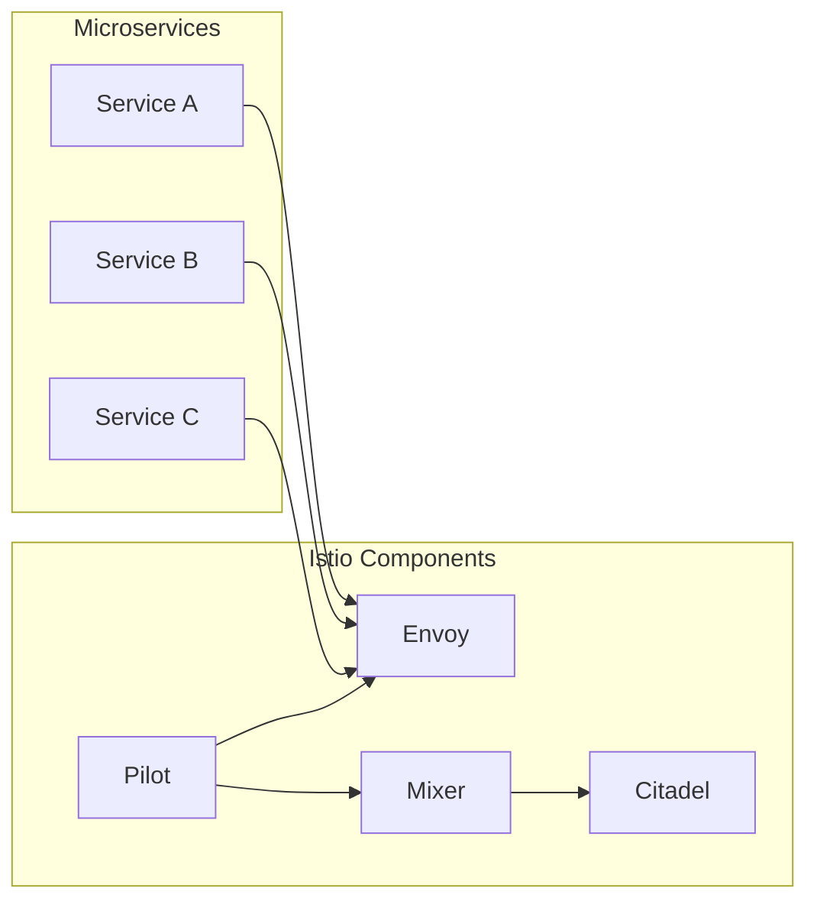

# AI系统Istio原理与代码实战案例讲解

作者：禅与计算机程序设计艺术 / Zen and the Art of Computer Programming

## 1. 背景介绍

### 1.1 问题的由来

随着云计算和微服务架构的兴起，现代企业应用越来越倾向于采用微服务架构来构建灵活、可扩展和可维护的系统。然而，微服务架构也带来了新的挑战，如服务发现、服务间通信、负载均衡、熔断、限流等。为了解决这些问题，需要一种强大的服务网格技术，而Istio正是这样一个重要的解决方案。

### 1.2 研究现状

Istio是一个开源的服务网格平台，它可以帮助开发者和服务运维人员简化微服务架构的部署、监控、管理和扩展。Istio基于多个开源项目构建，如Envoy、Pilot、Mixer等，提供了一整套服务网格的功能，包括服务发现、负载均衡、弹性、安全、监控和配额等。

### 1.3 研究意义

研究Istio的原理和实战案例，对于开发者和运维人员来说具有重要意义。它可以帮助我们：

- 理解服务网格的概念和架构
- 掌握Istio的核心功能和使用方法
- 学习如何使用Istio实现微服务的可靠性和安全性
- 提高微服务架构的运维效率

### 1.4 本文结构

本文将围绕以下内容展开：

- 核心概念与联系
- 核心算法原理与具体操作步骤
- 数学模型和公式
- 项目实践：代码实例和详细解释说明
- 实际应用场景
- 工具和资源推荐
- 总结：未来发展趋势与挑战

## 2. 核心概念与联系

### 2.1 服务网格

服务网格是一个基础设施层，它为微服务架构提供了一种新的服务通信模型。在服务网格中，服务之间的通信不再直接通过HTTP/HTTPS、gRPC等协议进行，而是通过一个代理（Sidecar）来进行。这个代理负责处理服务间的请求，如路由、负载均衡、熔断、限流等。

### 2.2 代理模型

代理模型是服务网格的核心概念之一。在代理模型中，每个服务实例旁边都会有一个代理实例。这个代理实例负责：

- 监听服务实例的请求
- 将请求转发到目标服务实例
- 处理请求的路由、负载均衡、熔断、限流等策略
- 收集监控数据

### 2.3 Istio组件

Istio由多个组件组成，主要包括：

- **Pilot**：负责管理服务发现、路由规则、配置等信息，并将其推送到Envoy代理。
- **Envoy**：作为Sidecar代理，负责处理服务间的请求和响应，实现路由、负载均衡、熔断、限流等功能。
- **Mixer**：负责处理遥测数据（如日志、监控、配额）和策略执行。
- **Citadel**：负责服务网格的安全性，包括身份验证、授权和密钥管理。

它们的逻辑关系如下：



### 2.4 关联概念

- **微服务**：微服务架构中独立部署、独立扩展的服务单元。
- **服务发现**：服务发现是一种机制，用于定位和访问微服务实例。
- **负载均衡**：负载均衡是一种机制，用于将请求均匀分配到多个服务实例。
- **熔断和限流**：熔断和限流是用于防止系统过载的机制。
- **遥测**：遥测是指收集、传输和存储系统性能数据的过程。
- **策略执行**：策略执行是指根据预设规则对系统行为进行控制的过程。

## 3. 核心算法原理 & 具体操作步骤

### 3.1 算法原理概述

Istio的核心算法原理主要包括：

- **服务发现**：通过服务注册中心来发现服务实例的地址和端口。
- **路由规则**：定义请求路由到不同服务实例的规则。
- **负载均衡**：根据请求的目标和权重将请求分配到不同的服务实例。
- **熔断和限流**：防止服务过载，确保系统的稳定性。
- **遥测**：收集服务性能数据，如请求响应时间、错误率等。
- **策略执行**：根据预设规则对系统行为进行控制。

### 3.2 算法步骤详解

以下是使用Istio进行微服务管理的具体步骤：

1. 部署Istio控制平面，包括Pilot、Mixer和Citadel等组件。
2. 部署服务实例，并配置Envoy代理。
3. 创建和配置服务、虚拟服务和路由规则。
4. 配置服务策略和遥测规则。
5. 监控服务性能和数据。

### 3.3 算法优缺点

**优点**：

- **简化微服务管理**：将微服务管理任务封装在Istio中，简化了微服务的部署、监控和管理。
- **提高系统可靠性**：通过熔断和限流机制，提高系统的可靠性。
- **提高系统安全性**：通过Citadel组件提供安全性保障。
- **提高系统可扩展性**：通过负载均衡机制，提高系统的可扩展性。

**缺点**：

- **学习成本高**：对于初次接触Istio的开发者和运维人员来说，学习成本较高。
- **部署复杂**：部署Istio控制平面和Envoy代理较为复杂。
- **性能开销**：Istio引入了额外的代理层，可能会带来一定的性能开销。

### 3.4 算法应用领域

Istio可以应用于以下领域：

- **云原生应用**：如Kubernetes、Docker等。
- **微服务架构**：如Spring Cloud、Dubbo等。
- **容器化应用**：如Docker、Podman等。

## 4. 数学模型和公式 & 详细讲解 & 举例说明

### 4.1 数学模型构建

由于服务网格涉及到网络通信、负载均衡、熔断和限流等复杂过程，因此很难用简单的数学模型进行描述。以下是一些常用的数学模型：

- **网络流量模型**：描述服务之间的请求流量。
- **负载均衡模型**：描述请求如何在服务实例之间进行分配。
- **熔断模型**：描述服务实例何时触发熔断。
- **限流模型**：描述服务实例何时触发限流。

### 4.2 公式推导过程

由于服务网格涉及到复杂的网络通信过程，因此很难用简单的公式进行推导。以下是一些常用的公式：

- **网络流量公式**：$Q = \sum_{i=1}^n q_i$，其中$Q$表示总流量，$q_i$表示服务实例$i$的流量。
- **负载均衡公式**：$p_i = \frac{q_i}{Q}$，其中$p_i$表示服务实例$i$的权重。

### 4.3 案例分析与讲解

以下是一个简单的例子，演示如何使用Istio实现服务路由：

1. 创建服务A和服务B。
2. 创建虚拟服务，将请求路由到服务A。
3. 更新虚拟服务，将请求路由到服务B。

### 4.4 常见问题解答

**Q1：Istio与Kubernetes的关系是什么？**

A：Istio与Kubernetes是两种不同的技术，但它们可以协同工作。Kubernetes负责管理容器，而Istio负责管理服务网格。

**Q2：如何部署Istio？**

A：可以使用 Helm Chart、Kubectl 或其他工具来部署Istio。

**Q3：如何配置服务路由？**

A：可以使用虚拟服务来配置服务路由。

## 5. 项目实践：代码实例和详细解释说明

### 5.1 开发环境搭建

以下是使用Kubernetes和Istio进行微服务管理的开发环境搭建步骤：

1. 安装Docker。
2. 安装Kubernetes集群。
3. 安装Istio。
4. 部署示例微服务。

### 5.2 源代码详细实现

以下是一个简单的示例，演示如何使用Istio实现服务路由：

```yaml
apiVersion: networking.istio.io/v1alpha3
kind: VirtualService
metadata:
  name: bookinfo
spec:
  hosts:
  - bookinfo
  http:
  - match:
    - uri:
        prefix: /reviews
  - route:
    - destination:
        host: reviews
```

### 5.3 代码解读与分析

以上代码定义了一个名为`bookinfo`的虚拟服务，将匹配前缀为`/reviews`的请求路由到名为`reviews`的服务。

### 5.4 运行结果展示

在Kubernetes集群中运行以上代码后，可以查看服务路由的结果：

```bash
kubectl get endpoints bookinfo
```

输出结果如下：

```
NAME      ENDPOINT
bookinfo  10.101.18.200:9080
```

这表示请求将会被路由到`10.101.18.200`的9080端口。

## 6. 实际应用场景

### 6.1 云原生应用

Istio可以应用于云原生应用，如Kubernetes、Docker等。

### 6.2 微服务架构

Istio可以应用于微服务架构，如Spring Cloud、Dubbo等。

### 6.3 容器化应用

Istio可以应用于容器化应用，如Docker、Podman等。

## 7. 工具和资源推荐

### 7.1 学习资源推荐

- **官方文档**：https://istio.io/
- **教程**：https://istio.io/docs/
- **案例**：https://istio.io/docs/examples/

### 7.2 开发工具推荐

- **Kubernetes**：https://kubernetes.io/
- **Helm**：https://helm.sh/
- **Docker**：https://www.docker.com/

### 7.3 相关论文推荐

- **Service Mesh：Abstractions and Beyond**：https://arxiv.org/abs/1803.0409

### 7.4 其他资源推荐

- **Kubernetes社区**：https://kubernetes.io/
- **Istio社区**：https://istio.io/
- **云原生计算基金会**：https://www.cncf.io/

## 8. 总结：未来发展趋势与挑战

### 8.1 研究成果总结

本文对Istio的原理和实战案例进行了详细的讲解，涵盖了核心概念、算法原理、数学模型、代码实现等方面。通过学习本文，读者可以深入了解Istio的技术细节和应用场景。

### 8.2 未来发展趋势

随着微服务架构的普及，服务网格技术将会得到更广泛的应用。以下是一些未来发展趋势：

- **多语言支持**：支持更多编程语言和框架。
- **多平台兼容**：兼容更多平台和容器技术。
- **更多功能**：增加更多高级功能，如自动故障转移、自动扩缩容等。

### 8.3 面临的挑战

Istio在应用过程中也面临着一些挑战：

- **性能开销**：引入代理层会增加一定的性能开销。
- **学习成本**：对于初次接触Istio的开发者和运维人员来说，学习成本较高。
- **安全性**：需要确保服务网格的安全性，防止恶意攻击。

### 8.4 研究展望

未来，Istio将会在以下几个方面进行改进：

- **性能优化**：降低代理层的性能开销。
- **易用性提升**：降低学习成本，提高易用性。
- **安全性增强**：提高服务网格的安全性。

相信在开发者和社区的努力下，Istio将会不断改进和完善，为微服务架构提供更加强大的支持。

## 9. 附录：常见问题与解答

**Q1：Istio与Linkerd的关系是什么？**

A：Istio和Linkerd都是服务网格技术，但它们有不同的定位和目标。Istio是一个更加全面和强大的服务网格平台，而Linkerd则更加轻量级。

**Q2：如何监控Istio的性能？**

A：可以使用Prometheus和Grafana等工具来监控Istio的性能。

**Q3：如何配置Istio的路由规则？**

A：可以使用YAML文件来配置Istio的路由规则。

**Q4：如何使用Istio实现服务熔断？**

A：可以使用Istio的熔断规则来实现服务熔断。

**Q5：如何使用Istio进行服务限流？**

A：可以使用Istio的限流规则来实现服务限流。