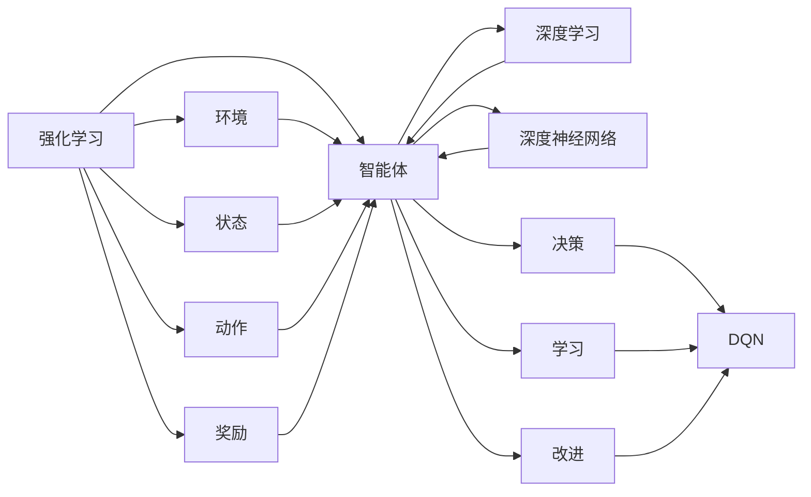

# 一切皆是映射：构建你的第一个DQN模型：步骤和实践

作者：禅与计算机程序设计艺术 / Zen and the Art of Computer Programming

## 关键词：

强化学习，DQN，深度Q网络，深度学习，深度强化学习，游戏AI，蒙特卡洛方法，价值迭代，epsilon贪婪策略

## 1. 背景介绍

### 1.1 问题的由来

随着深度学习技术的飞速发展，机器学习领域涌现出了许多令人瞩目的成果。其中，强化学习（Reinforcement Learning，RL）作为一种重要的机器学习范式，因其独特的决策制定机制和在实际应用中的广泛前景，受到了广泛关注。深度强化学习（Deep Reinforcement Learning，DRL）结合了深度学习和强化学习的优势，在游戏AI、机器人控制、自动驾驶等领域取得了显著的进展。

DQN（Deep Q-Network）作为深度强化学习中的经典算法，以其简单高效的实现方式，成为了学习DRL的入门首选。本文将带你一步步构建你的第一个DQN模型，并深入浅出地讲解其原理和实践。

### 1.2 研究现状

近年来，DQN及其变体在多个领域取得了显著成果，如Atari游戏、Go游戏、机器人控制等。随着研究的不断深入，DQN算法也在不断改进和完善，例如加入经验回放（Experience Replay）技术、优先级回放（Priority Replay）技术等，提高了学习效率和收敛速度。

### 1.3 研究意义

DQN作为深度强化学习的入门算法，对于理解强化学习原理、构建实际应用具有重要的指导意义。本文旨在通过构建DQN模型，帮助读者掌握DQN算法的核心思想，为后续深入学习DRL打下坚实基础。

### 1.4 本文结构

本文将分为以下几个部分：
- 2. 核心概念与联系：介绍强化学习、深度学习、DQN等核心概念，并阐述它们之间的关系。
- 3. 核心算法原理 & 具体操作步骤：详细讲解DQN算法的原理和具体操作步骤。
- 4. 数学模型和公式 & 详细讲解 & 举例说明：从数学角度分析DQN算法，并给出实例说明。
- 5. 项目实践：代码实例和详细解释说明：使用Python实现DQN模型，并进行详细的代码解读和分析。
- 6. 实际应用场景：探讨DQN模型在游戏AI、机器人控制等领域的应用。
- 7. 工具和资源推荐：推荐学习资源、开发工具和参考文献。
- 8. 总结：未来发展趋势与挑战：总结DQN算法的研究成果和未来发展趋势。
- 9. 附录：常见问题与解答：解答读者可能遇到的一些常见问题。

## 2. 核心概念与联系

为了更好地理解DQN算法，首先我们需要了解以下几个核心概念：

### 2.1 强化学习

强化学习是一种通过与环境交互，不断学习并改进决策策略的机器学习方法。它由智能体（Agent）、环境（Environment）、状态（State）、动作（Action）、奖励（Reward）五个要素构成。

- **智能体**：执行动作并感知环境的实体。
- **环境**：为智能体提供状态信息，并根据智能体的动作给予奖励。
- **状态**：描述环境当前状态的变量集合。
- **动作**：智能体可以选择的操作集合。
- **奖励**：环境对智能体动作的反馈，用于指导智能体的决策。

### 2.2 深度学习

深度学习是一种利用深度神经网络进行特征学习和模式识别的机器学习方法。它通过学习大量数据，自动提取特征，从而实现对复杂任务的建模。

### 2.3 DQN

DQN是一种基于深度神经网络的Q学习算法，它将Q学习与深度学习相结合，通过学习一个深度神经网络来近似Q值函数，从而实现智能体的决策。

### 2.4 核心概念联系

强化学习、深度学习和DQN之间的关系如下：



## 3. 核心算法原理 & 具体操作步骤

### 3.1 算法原理概述

DQN算法通过学习一个深度神经网络来近似Q值函数，从而实现智能体的决策。Q值函数是一个映射，将状态-动作对映射到一个实数值，表示在某个状态下执行某个动作所能获得的最大预期奖励。

### 3.2 算法步骤详解

DQN算法的具体步骤如下：

1. 初始化Q网络和目标Q网络，并设置经验回放缓冲区。
2. 随机选择初始状态，执行动作，并观察奖励和下一个状态。
3. 将当前状态、动作、奖励、下一个状态存储到经验回放缓冲区。
4. 从经验回放缓冲区随机抽取一批经验样本。
5. 计算Q网络输出和目标Q网络输出的差值，并更新目标Q网络参数。
6. 重复步骤2-5，直至达到预设的训练轮数或满足终止条件。

### 3.3 算法优缺点

**优点**：

- 简单高效：DQN算法的实现简单，易于理解。
- 模型泛化能力强：DQN算法能够学习到较为通用的策略，适用于各种环境。
- 自适应性强：DQN算法能够根据环境的变化自适应地调整策略。

**缺点**：

- 训练过程耗时：DQN算法需要大量的训练样本和计算资源。
- 可能陷入局部最优：DQN算法可能陷入局部最优，导致学习效果不佳。
- 难以处理连续动作空间：DQN算法难以处理具有连续动作空间的任务。

### 3.4 算法应用领域

DQN算法在多个领域取得了显著的成果，如：

- 游戏AI：使用DQN算法构建的游戏AI能够战胜人类选手。
- 机器人控制：使用DQN算法控制机器人完成复杂的任务。
- 自动驾驶：使用DQN算法实现自动驾驶汽车。

## 4. 数学模型和公式 & 详细讲解 & 举例说明

### 4.1 数学模型构建

DQN算法的数学模型如下：

$$
Q(s,a) = \mathbb{E}[R + \gamma \max_{a'} Q(s',a') | s, a]
$$

其中：
- $Q(s,a)$ 表示在状态 $s$ 下执行动作 $a$ 的Q值。
- $R$ 表示在状态 $s$ 下执行动作 $a$ 获得的奖励。
- $\gamma$ 表示折扣因子，用于计算未来奖励的现值。
- $\max_{a'} Q(s',a')$ 表示在下一个状态 $s'$ 下执行所有可能动作的Q值中的最大值。

### 4.2 公式推导过程

DQN算法的目标是学习一个Q值函数 $Q(s,a)$，使得智能体能够选择最优动作。为了求解Q值函数，我们需要定义一个损失函数来衡量Q值函数的预测值与真实值的差距。

假设我们使用均方误差（MSE）作为损失函数，则有：

$$
L(\theta) = \frac{1}{N} \sum_{i=1}^N (Q(s_i,a_i) - Q(s_i,a_i; \theta))^2
$$

其中：
- $N$ 表示样本数量。
- $Q(s_i,a_i)$ 表示真实Q值。
- $Q(s_i,a_i; \theta)$ 表示预测Q值。

为了最小化损失函数，我们需要对Q网络参数 $\theta$ 求导，并更新参数：

$$
\theta \leftarrow \theta - \alpha \nabla_{\theta} L(\theta)
$$

其中：
- $\alpha$ 表示学习率。

### 4.3 案例分析与讲解

假设有一个简单的游戏环境，智能体可以选择上下左右四个动作，环境会根据动作给予奖励。我们可以使用DQN算法训练智能体，使其学会在游戏环境中获取最大奖励。

首先，我们需要定义状态空间、动作空间和奖励函数。状态空间可以表示为当前游戏角色的位置，动作空间可以表示为上下左右四个动作，奖励函数可以表示为每移动一步获得1分。

接下来，我们需要初始化Q网络和目标Q网络，并设置经验回放缓冲区。这里我们使用PyTorch框架实现DQN算法。

```python
import torch
import torch.nn as nn
import torch.optim as optim

# 定义Q网络
class QNetwork(nn.Module):
    def __init__(self, input_dim, output_dim):
        super(QNetwork, self).__init__()
        self.fc1 = nn.Linear(input_dim, 128)
        self.fc2 = nn.Linear(128, output_dim)

    def forward(self, x):
        x = torch.relu(self.fc1(x))
        x = self.fc2(x)
        return x

# 初始化Q网络和目标Q网络
input_dim = 4  # 状态维度
output_dim = 4  # 动作维度
q_network = QNetwork(input_dim, output_dim)
target_q_network = QNetwork(input_dim, output_dim)
target_q_network.load_state_dict(q_network.state_dict())
target_q_network.eval()

# 设置经验回放缓冲区
replay_buffer = []

# 定义损失函数和优化器
criterion = nn.MSELoss()
optimizer = optim.Adam(q_network.parameters(), lr=0.001)

# 训练模型
for episode in range(1000):
    state = torch.tensor([0, 0])  # 初始化状态
    done = False
    while not done:
        # 执行动作
        with torch.no_grad():
            q_values = q_network(state)
            action = torch.argmax(q_values)
        next_state, reward, done, _ = env.step(action.item())

        # 存储经验
        replay_buffer.append((state, action, reward, next_state, done))

        # 从经验回放缓冲区中抽取样本
        if len(replay_buffer) > 32:
            state_batch, action_batch, reward_batch, next_state_batch, done_batch = \
                zip(*random.sample(replay_buffer, 32))

            state_batch = torch.stack(state_batch)
            action_batch = torch.stack(action_batch)
            reward_batch = torch.stack(reward_batch)
            next_state_batch = torch.stack(next_state_batch)
            done_batch = torch.stack(done_batch)

            # 计算Q值
            next_state_q_values = target_q_network(next_state_batch)
            next_max_q_value = next_state_q_values.max(1)[0]
            expected_q_values = reward_batch + (1 - done_batch) * next_max_q_value

            # 计算损失函数
            q_values = q_network(state_batch)
            q_values[range(len(state_batch)), action_batch] = expected_q_values

            # 更新Q网络参数
            optimizer.zero_grad()
            loss = criterion(q_values, expected_q_values)
            loss.backward()
            optimizer.step()

        # 更新目标Q网络参数
        if episode % 10 == 0:
            target_q_network.load_state_dict(q_network.state_dict())
```

通过以上代码，我们可以训练一个能够获取最大奖励的智能体。在实际应用中，我们可以将DQN算法应用于更复杂的游戏环境和机器人控制任务。

### 4.4 常见问题解答

**Q1：DQN算法如何解决样本偏差问题？**

A1：DQN算法通过使用经验回放缓冲区来缓解样本偏差问题。经验回放缓冲区存储了智能体在不同状态下执行不同动作的经验，从而使得每次从缓冲区中抽取样本时，样本分布更加均匀，避免了长期依赖某个状态的样本，从而缓解了样本偏差问题。

**Q2：DQN算法如何避免过拟合？**

A2：DQN算法通过以下几种方法来避免过拟合：

- 使用经验回放缓冲区，使得每次抽取样本时样本分布更加均匀。
- 使用正则化技术，如L2正则化，限制模型复杂度。
- 使用Dropout技术，降低模型对特定样本的依赖。

**Q3：DQN算法如何处理连续动作空间？**

A3：DQN算法通过将连续动作空间离散化来处理连续动作空间。具体来说，可以将连续动作空间划分为多个区间，每个区间对应一个离散动作。例如，可以将机器人关节的角度划分为多个区间，每个区间对应一个具体的动作。

## 5. 项目实践：代码实例和详细解释说明

### 5.1 开发环境搭建

为了实现DQN算法，我们需要以下开发环境：

- 操作系统：Windows、macOS或Linux
- 编程语言：Python
- 深度学习框架：PyTorch
- 游戏引擎：OpenAI Gym

以下是安装上述环境的步骤：

1. 安装Anaconda：
```bash
conda create -n dqn-env python=3.8
conda activate dqn-env
```

2. 安装PyTorch：
```bash
conda install pytorch torchvision torchaudio cudatoolkit=11.3 -c pytorch -c conda-forge
```

3. 安装OpenAI Gym：
```bash
pip install gym
```

### 5.2 源代码详细实现

以下是一个使用PyTorch实现DQN算法的简单示例：

```python
import torch
import torch.nn as nn
import torch.optim as optim
from torch.autograd import Variable
import numpy as np
import random

# 定义DQN网络
class DQN(nn.Module):
    def __init__(self, state_dim, action_dim, hidden_dim):
        super(DQN, self).__init__()
        self.fc1 = nn.Linear(state_dim, hidden_dim)
        self.fc2 = nn.Linear(hidden_dim, hidden_dim)
        self.fc3 = nn.Linear(hidden_dim, action_dim)

    def forward(self, x):
        x = torch.relu(self.fc1(x))
        x = torch.relu(self.fc2(x))
        return self.fc3(x)

# 初始化DQN网络、目标DQN网络和优化器
state_dim = 4  # 状态维度
action_dim = 4  # 动作维度
hidden_dim = 128  # 隐藏层维度
dqn = DQN(state_dim, action_dim, hidden_dim)
target_dqn = DQN(state_dim, action_dim, hidden_dim)
target_dqn.load_state_dict(dqn.state_dict())
target_dqn.eval()

optimizer = optim.Adam(dqn.parameters(), lr=0.001)

# 定义损失函数
criterion = nn.MSELoss()

# 初始化经验回放缓冲区
replay_buffer = []

# 训练DQN网络
num_episodes = 1000
epsilon = 0.9  # ε-贪婪策略
epsilon_min = 0.1  # ε的最小值
epsilon_decay = 0.995  # ε的衰减系数

for episode in range(num_episodes):
    state = env.reset()
    done = False
    while not done:
        # ε-贪婪策略
        if random.random() < epsilon:
            action = random.randrange(action_dim)
        else:
            with torch.no_grad():
                action = dqn(Variable(state)).argmax().item()

        # 执行动作
        next_state, reward, done, _ = env.step(action)

        # 存储经验
        replay_buffer.append((state, action, reward, next_state, done))

        # 从经验回放缓冲区中抽取样本
        if len(replay_buffer) > 32:
            sample = random.sample(replay_buffer, 32)
            state_batch, action_batch, reward_batch, next_state_batch, done_batch = \
                zip(*sample)

            state_batch = torch.stack(state_batch)
            action_batch = torch.stack(action_batch)
            reward_batch = torch.stack(reward_batch)
            next_state_batch = torch.stack(next_state_batch)
            done_batch = torch.stack(done_batch)

            # 计算Q值
            q_values = dqn(state_batch)
            with torch.no_grad():
                next_state_q_values = target_dqn(next_state_batch).max(1)[0]
                expected_q_values = reward_batch + (1 - done_batch) * next_state_q_values

            # 计算损失函数
            q_values[range(len(state_batch)), action_batch] = expected_q_values

            # 更新DQN网络参数
            optimizer.zero_grad()
            loss = criterion(q_values, expected_q_values)
            loss.backward()
            optimizer.step()

        # 更新目标DQN网络参数
        if episode % 100 == 0:
            target_dqn.load_state_dict(dqn.state_dict())

        # 更新ε值
        epsilon = max(epsilon_min, epsilon_decay * epsilon)

    # 打印训练进度
    print('Episode:', episode, 'Reward:', reward)
```

### 5.3 代码解读与分析

上述代码演示了如何使用PyTorch实现DQN算法。以下是代码的关键部分：

- **DQN网络**：定义了一个简单的DQN网络，包含两个隐藏层和一个输出层。
- **初始化DQN网络、目标DQN网络和优化器**：初始化DQN网络、目标DQN网络和优化器。
- **定义损失函数**：使用均方误差作为损失函数。
- **初始化经验回放缓冲区**：初始化经验回放缓冲区，用于存储经验样本。
- **训练DQN网络**：使用ε-贪婪策略选择动作，执行动作，并观察奖励和下一个状态。然后，将当前状态、动作、奖励、下一个状态存储到经验回放缓冲区。从经验回放缓冲区中抽取样本，计算Q值，并更新DQN网络参数。最后，更新目标DQN网络参数。

### 5.4 运行结果展示

运行上述代码，我们可以看到训练进度和奖励信息。随着训练的进行，奖励值会逐渐增加，表明智能体在游戏环境中获得了更好的表现。

## 6. 实际应用场景

### 6.1 游戏AI

DQN算法在游戏AI领域取得了显著的成果。例如，DeepMind的AlphaGo使用DQN算法击败了世界围棋冠军李世石。此外，DQN算法也被应用于其他游戏，如Atari游戏、Pong游戏等。

### 6.2 机器人控制

DQN算法可以用于控制机器人完成各种任务，如导航、抓取、搬运等。例如，DeepMind的DeepStack算法使用DQN算法控制机器人进行多智能体协作。

### 6.3 自动驾驶

DQN算法可以用于自动驾驶汽车的控制，使汽车能够自主驾驶，避免碰撞和交通事故。

### 6.4 未来应用展望

随着DQN算法的不断发展，未来其在更多领域的应用前景十分广阔。例如：

- 金融领域：用于股票交易、风险管理等任务。
- 医疗领域：用于疾病诊断、药物研发等任务。
- 教育领域：用于个性化教学、学习辅助等任务。

## 7. 工具和资源推荐

### 7.1 学习资源推荐

- 《深度学习》系列书籍：由Ian Goodfellow、Yoshua Bengio和Aaron Courville合著，全面介绍了深度学习的基本概念、算法和模型。
- 《强化学习：原理与案例》书籍：由Richard S. Sutton和Barto合著，详细讲解了强化学习的基本原理、算法和案例。
- OpenAI Gym：一个开源游戏环境库，提供了丰富的游戏环境，方便研究者进行DQN算法的研究和应用。

### 7.2 开发工具推荐

- PyTorch：一个开源的深度学习框架，易于使用，功能强大。
- TensorFlow：另一个开源的深度学习框架，提供了丰富的工具和资源。
- OpenAI Gym：一个开源游戏环境库，提供了丰富的游戏环境，方便研究者进行DQN算法的研究和应用。

### 7.3 相关论文推荐

- Deep Q-Networks：介绍DQN算法的经典论文。
- Prioritized Experience Replay：介绍优先级回放技术的论文。
- Deep Deterministic Policy Gradient：介绍DDPG算法的论文。

### 7.4 其他资源推荐

- arXiv论文预印本：人工智能领域最新研究成果的发布平台。
- Google Colab：谷歌提供的在线Jupyter Notebook环境，免费提供GPU/TPU算力。
- GitHub：开源代码托管平台，可以找到许多DQN算法的代码实现。

## 8. 总结：未来发展趋势与挑战

### 8.1 研究成果总结

本文从理论到实践，详细介绍了DQN算法的核心思想、实现步骤和实际应用。通过构建DQN模型，读者可以更好地理解深度强化学习的基本原理。

### 8.2 未来发展趋势

随着深度学习技术的不断发展，DQN算法在未来将呈现以下发展趋势：

- 模型参数优化：通过改进网络结构、优化算法等手段，提高DQN算法的性能和效率。
- 离线学习：研究离线学习算法，降低DQN算法对在线数据的需求。
- 多智能体强化学习：研究多智能体强化学习算法，实现多智能体协同完成任务。
- 混合强化学习：将强化学习与其他机器学习范式相结合，提高算法的适应性和鲁棒性。

### 8.3 面临的挑战

DQN算法在实际应用中仍面临以下挑战：

- 训练难度：DQN算法的训练过程较为复杂，需要大量的数据和计算资源。
- 过拟合：DQN算法容易过拟合，需要采用正则化等技术进行缓解。
- 样本偏差：DQN算法对样本偏差比较敏感，需要采用经验回放等技术进行缓解。

### 8.4 研究展望

为了解决DQN算法面临的挑战，未来需要在以下方面进行深入研究：

- 算法优化：改进DQN算法的参数优化和训练过程，提高算法的性能和效率。
- 多智能体强化学习：研究多智能体强化学习算法，实现多智能体协同完成任务。
- 混合强化学习：将强化学习与其他机器学习范式相结合，提高算法的适应性和鲁棒性。
- 离线学习：研究离线学习算法，降低DQN算法对在线数据的需求。

通过不断研究和改进，相信DQN算法将会在未来取得更大的突破，为人工智能的发展做出更大的贡献。

## 9. 附录：常见问题与解答

**Q1：DQN算法适用于哪些类型的强化学习任务？**

A1：DQN算法适用于大多数基于值函数的强化学习任务，如Q学习、深度Q学习、SARSA等。

**Q2：DQN算法如何解决样本偏差问题？**

A2：DQN算法通过使用经验回放缓冲区来缓解样本偏差问题。经验回放缓冲区存储了智能体在不同状态下执行不同动作的经验，从而使得每次从缓冲区中抽取样本时，样本分布更加均匀，避免了长期依赖某个状态的样本，从而缓解了样本偏差问题。

**Q3：DQN算法如何避免过拟合？**

A3：DQN算法通过以下几种方法来避免过拟合：

- 使用经验回放缓冲区，使得每次抽取样本时样本分布更加均匀。
- 使用正则化技术，如L2正则化，限制模型复杂度。
- 使用Dropout技术，降低模型对特定样本的依赖。

**Q4：DQN算法如何处理连续动作空间？**

A4：DQN算法通过将连续动作空间离散化来处理连续动作空间。具体来说，可以将连续动作空间划分为多个区间，每个区间对应一个具体的动作。例如，可以将机器人关节的角度划分为多个区间，每个区间对应一个具体的动作。

**Q5：DQN算法与深度强化学习中的其他算法相比有哪些优势？**

A5：DQN算法的优势在于其简单高效的实现方式和较高的性能。相比于其他深度强化学习算法，DQN算法更容易理解和实现，且在实际应用中取得了较好的效果。

**Q6：DQN算法在实际应用中需要注意哪些问题？**

A6：在实际应用中，DQN算法需要注意以下问题：

- 训练难度：DQN算法的训练过程较为复杂，需要大量的数据和计算资源。
- 过拟合：DQN算法容易过拟合，需要采用正则化等技术进行缓解。
- 样本偏差：DQN算法对样本偏差比较敏感，需要采用经验回放等技术进行缓解。

通过解决上述问题，DQN算法在实际应用中将发挥更大的作用。