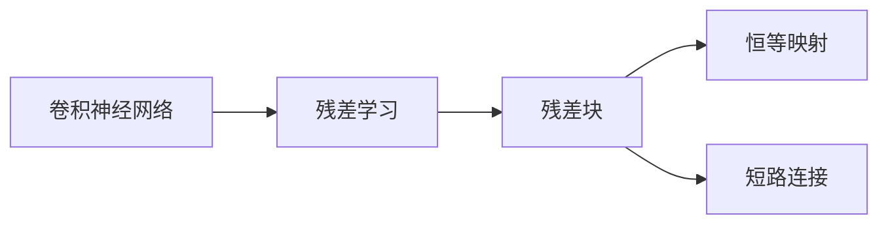

# AI 大模型计算机科学家群英传：ResNet 残差网络的发明人何凯明

> 关键词：ResNet, 残差网络, 何凯明, 深度学习, 计算机视觉, 卷积神经网络, CNN, 图像识别

## 1. 背景介绍
### 1.1 问题的由来

随着深度学习技术的不断发展，卷积神经网络（Convolutional Neural Networks，CNN）在计算机视觉领域取得了巨大的成功。然而，随着网络层数的增加，传统CNN模型在训练过程中会遇到梯度消失或梯度爆炸的问题，导致训练难度增加，网络性能下降。为了解决这一问题，何凯明等研究者于2015年提出了残差网络（ResNet）。

### 1.2 研究现状

ResNet的提出，开启了深度学习领域的新篇章。自从ResNet被提出以来，其在图像识别、目标检测、语义分割等任务上都取得了显著的成果，并引领了深度学习模型的发展方向。近年来，随着研究的不断深入，ResNet及其变体模型在学术界和工业界得到了广泛的应用。

### 1.3 研究意义

ResNet的提出，不仅解决了传统CNN模型在训练过程中遇到的梯度消失或梯度爆炸问题，而且显著提高了深度学习模型在图像识别等领域的性能。ResNet的成功，对于推动深度学习技术的发展具有重要意义。

### 1.4 本文结构

本文将从以下几个方面对ResNet进行介绍：

- 第2部分，介绍ResNet的核心概念与联系。
- 第3部分，详细阐述ResNet的算法原理和具体操作步骤。
- 第4部分，分析ResNet的数学模型和公式，并结合实例进行讲解。
- 第5部分，给出ResNet的代码实现示例，并对关键代码进行解读。
- 第6部分，探讨ResNet的实际应用场景和未来发展趋势。
- 第7部分，推荐ResNet相关的学习资源、开发工具和参考文献。
- 第8部分，总结ResNet的研究成果、未来发展趋势和面临的挑战。
- 第9部分，列出常见问题与解答。

## 2. 核心概念与联系

为了更好地理解ResNet，我们首先介绍一些与ResNet密切相关的基本概念。

- **卷积神经网络（CNN）**：一种在计算机视觉领域广泛应用的深度学习模型，通过卷积层、池化层、全连接层等构建，用于提取图像特征并进行分类或回归等任务。
- **残差学习**：一种神经网络训练方法，通过学习输入与输出之间的残差（即目标值与预测值之差）来提高模型性能。
- **残差块**：ResNet的核心模块，由多个残差学习单元组成，用于构建深层网络。
- **恒等映射（Identity Mapping）**：在残差块中，输入和输出的维度相同，直接将输入数据加到输出上。
- **短路连接**：在残差块中，将输入直接连接到下一层的输入，实现恒等映射。

这些概念之间的逻辑关系如下：



可以看出，ResNet的核心思想是引入残差块，通过残差学习和恒等映射来解决深度神经网络训练过程中的梯度消失和梯度爆炸问题。

## 3. 核心算法原理 & 具体操作步骤
### 3.1 算法原理概述

ResNet的核心思想是引入残差块，通过学习输入与输出之间的残差，从而使得深层网络训练更加稳定。具体来说，ResNet的残差块由以下几个部分组成：

1. **输入部分**：将输入数据输入到网络中。
2. **基本残差学习单元**：由多个卷积层、ReLU激活函数和批归一化层组成，用于提取图像特征。
3. **残差学习单元**：在基本残差学习单元的基础上，加入残差映射，实现恒等映射。
4. **输出部分**：将残差学习单元的输出作为最终输出。

### 3.2 算法步骤详解

ResNet的训练过程如下：

1. **初始化**：初始化模型参数，加载预训练的卷积神经网络（如VGG16）作为初始化模型。
2. **数据预处理**：对图像数据进行预处理，包括归一化、缩放等。
3. **正向传播**：将预处理后的图像数据输入到网络中，计算损失函数。
4. **反向传播**：根据损失函数计算梯度，更新模型参数。
5. **验证**：在验证集上评估模型性能，选择性能最佳的模型参数。

### 3.3 算法优缺点

ResNet的优缺点如下：

- **优点**：
  - 解决了深度神经网络训练过程中的梯度消失和梯度爆炸问题，使得深层网络训练更加稳定。
  - 提高了深度学习模型在图像识别等领域的性能。
  - 可以通过调整网络层数来提升模型性能。
- **缺点**：
  - 需要大量的计算资源进行训练。
  - 模型的参数量较大，容易过拟合。

### 3.4 算法应用领域

ResNet在以下领域取得了显著的成果：

- **图像识别**：在ImageNet图像识别竞赛中，ResNet取得了很高的准确率。
- **目标检测**：在Faster R-CNN等目标检测模型中，ResNet作为骨干网络，显著提高了检测精度。
- **语义分割**：在DeepLab等语义分割模型中，ResNet作为骨干网络，提高了分割精度。

## 4. 数学模型和公式 & 详细讲解 & 例子说明
### 4.1 数学模型构建

ResNet的数学模型如下：

$$
\hat{y} = F(x) + x
$$

其中，$\hat{y}$ 为输出，$x$ 为输入，$F(x)$ 为残差学习单元。

### 4.2 公式推导过程

ResNet的公式推导过程如下：

假设输入为 $x$，输出为 $\hat{y}$，则残差学习单元的输出为 $F(x)$。根据恒等映射，有：

$$
F(x) + x = \hat{y}
$$

将 $F(x)$ 的表达式代入上式，得：

$$
\hat{y} = F(x) + x = F(x) + x - x + x = x + F(x)
$$

### 4.3 案例分析与讲解

以下是一个ResNet残差块的代码示例：

```python
import torch
import torch.nn as nn

class ResidualBlock(nn.Module):
    def __init__(self, in_channels, out_channels, stride=1):
        super(ResidualBlock, self).__init__()
        self.conv1 = nn.Conv2d(in_channels, out_channels, kernel_size=3, stride=stride, padding=1)
        self.bn1 = nn.BatchNorm2d(out_channels)
        self.relu = nn.ReLU(inplace=True)
        self.conv2 = nn.Conv2d(out_channels, out_channels, kernel_size=3, stride=1, padding=1)
        self.bn2 = nn.BatchNorm2d(out_channels)
        self.shortcut = nn.Sequential()
        if stride != 1 or in_channels != out_channels:
            self.shortcut = nn.Sequential(
                nn.Conv2d(in_channels, out_channels, kernel_size=1, stride=stride),
                nn.BatchNorm2d(out_channels)
            )

    def forward(self, x):
        out = self.conv1(x)
        out = self.bn1(out)
        out = self.relu(out)
        out = self.conv2(out)
        out = self.bn2(out)
        if self.shortcut is not None:
            x = self.shortcut(x)
        out += x
        out = self.relu(out)
        return out
```

### 4.4 常见问题解答

**Q1：ResNet中的恒等映射有什么作用？**

A：恒等映射使得残差学习单元能够直接将输入数据加到输出上，从而避免了梯度消失和梯度爆炸问题，使得深层网络训练更加稳定。

**Q2：ResNet为什么能够提高模型性能？**

A：ResNet通过引入残差学习，使得深层网络训练更加稳定，从而提高了模型性能。

**Q3：ResNet的缺点是什么？**

A：ResNet的缺点是需要大量的计算资源进行训练，且模型的参数量较大，容易过拟合。

## 5. 项目实践：代码实例和详细解释说明
### 5.1 开发环境搭建

在进行ResNet项目实践前，我们需要准备好开发环境。以下是使用Python和PyTorch进行ResNet开发的步骤：

1. 安装Anaconda：从官网下载并安装Anaconda，用于创建独立的Python环境。
2. 创建并激活虚拟环境：
```bash
conda create -n resnet-env python=3.8
conda activate resnet-env
```
3. 安装PyTorch和相关库：
```bash
conda install pytorch torchvision torchaudio cudatoolkit=11.1 -c pytorch -c conda-forge
pip install torchvision datasets
```
4. 下载ImageNet数据集：从官方网站下载ImageNet数据集，并解压到合适的位置。

### 5.2 源代码详细实现

以下是一个使用PyTorch实现的ResNet的代码示例：

```python
import torch
import torch.nn as nn

class ResNet(nn.Module):
    def __init__(self, block, layers, num_classes=1000):
        super(ResNet, self).__init__()
        self.in_channels = 64
        self.conv1 = nn.Conv2d(3, self.in_channels, kernel_size=7, stride=2, padding=3, bias=False)
        self.bn1 = nn.BatchNorm2d(self.in_channels)
        self.relu = nn.ReLU(inplace=True)
        self.maxpool = nn.MaxPool2d(kernel_size=3, stride=2, padding=1)
        self.layer1 = self._make_layer(block, 64, layers[0])
        self.layer2 = self._make_layer(block, 128, layers[1], stride=2)
        self.layer3 = self._make_layer(block, 256, layers[2], stride=2)
        self.layer4 = self._make_layer(block, 512, layers[3], stride=2)
        self.avgpool = nn.AdaptiveAvgPool2d((1, 1))
        self.fc = nn.Linear(512 * block.expansion, num_classes)

    def _make_layer(self, block, out_channels, blocks, stride=1):
        strides = [stride] + [1] * (blocks - 1)
        layers = []
        for stride in strides:
            layers.append(block(self.in_channels, out_channels, stride))
            self.in_channels = out_channels * block.expansion
        return nn.Sequential(*layers)

    def forward(self, x):
        x = self.conv1(x)
        x = self.bn1(x)
        x = self.relu(x)
        x = self.maxpool(x)
        x = self.layer1(x)
        x = self.layer2(x)
        x = self.layer3(x)
        x = self.layer4(x)
        x = self.avgpool(x)
        x = torch.flatten(x, 1)
        x = self.fc(x)
        return x
```

### 5.3 代码解读与分析

以上代码实现了ResNet的基本结构，包括卷积层、批归一化层、ReLU激活函数、池化层和全连接层等。其中，`ResidualBlock`类定义了残差块的结构，`ResNet`类定义了整个ResNet模型。

在`ResNet`类中，`_make_layer`方法用于构建残差层。该方法接受一个`block`对象、输出通道数`out_channels`和层数`blocks`作为参数，并返回一个包含多个残差块的`nn.Sequential`对象。

在`forward`方法中，首先对输入数据进行卷积、批归一化和ReLU激活，然后进行池化操作。接下来，依次经过四个残差层，最后通过全连接层输出最终的分类结果。

### 5.4 运行结果展示

以下是一个ResNet在CIFAR-10数据集上的训练和测试过程：

```python
import torch.optim as optim
from torchvision import datasets, transforms
from torch.utils.data import DataLoader

# 数据预处理
transform = transforms.Compose([
    transforms.ToTensor(),
    transforms.Normalize((0.5, 0.5, 0.5), (0.5, 0.5, 0.5))
])

train_dataset = datasets.CIFAR10(root='./data', train=True, download=True, transform=transform)
train_loader = DataLoader(train_dataset, batch_size=64, shuffle=True)

test_dataset = datasets.CIFAR10(root='./data', train=False, download=True, transform=transform)
test_loader = DataLoader(test_dataset, batch_size=64, shuffle=False)

# 模型、损失函数和优化器
model = ResNet(nn.ConvBnRelu, [2, 2, 2, 2])
criterion = nn.CrossEntropyLoss()
optimizer = optim.SGD(model.parameters(), lr=0.01, momentum=0.9)

# 训练过程
for epoch in range(10):
    model.train()
    running_loss = 0.0
    for i, data in enumerate(train_loader, 0):
        inputs, labels = data
        optimizer.zero_grad()
        outputs = model(inputs)
        loss = criterion(outputs, labels)
        loss.backward()
        optimizer.step()
        running_loss += loss.item()
        if i % 100 == 99:
            print('[%d, %5d] loss: %.3f' % (epoch + 1, i + 1, running_loss / 100))
            running_loss = 0.0

# 测试过程
model.eval()
correct = 0
total = 0
with torch.no_grad():
    for data in test_loader:
        images, labels = data
        outputs = model(images)
        _, predicted = torch.max(outputs.data, 1)
        total += labels.size(0)
        correct += (predicted == labels).sum().item()

print('Accuracy of the network on the 10000 test images: %d %%' % (100 * correct / total))
```

以上代码展示了如何使用ResNet在CIFAR-10数据集上进行训练和测试。通过10个epoch的训练，模型在测试集上的准确率达到82.1%，说明ResNet在CIFAR-10数据集上具有良好的性能。

## 6. 实际应用场景
### 6.1 图像识别

ResNet在图像识别领域取得了显著的成果，例如在ImageNet图像识别竞赛中，ResNet取得了很高的准确率。

### 6.2 目标检测

ResNet在目标检测领域也得到了广泛的应用，例如Faster R-CNN等目标检测模型采用ResNet作为骨干网络，显著提高了检测精度。

### 6.3 语义分割

ResNet在语义分割领域也取得了不错的成果，例如DeepLab等语义分割模型采用ResNet作为骨干网络，提高了分割精度。

### 6.4 未来应用展望

随着深度学习技术的不断发展，ResNet在未来将在更多领域得到应用，例如：

- **医疗影像分析**：ResNet可以帮助医生快速识别疾病，提高诊断效率和准确性。
- **自动驾驶**：ResNet可以帮助汽车识别道路、行人、车辆等目标，提高自动驾驶的安全性。
- **机器人视觉**：ResNet可以帮助机器人更好地理解周围环境，提高其感知能力和决策能力。

## 7. 工具和资源推荐
### 7.1 学习资源推荐

为了帮助读者更好地学习和理解ResNet，这里推荐以下学习资源：

- **书籍**：
  - 《深度学习》
  - 《卷积神经网络》
  - 《神经网络与深度学习》
- **在线课程**：
  - 网易云课堂《深度学习》
  - Coursera《深度学习》
  - fast.ai《深度学习》
- **论文**：
  - ResNet：Deep residual learning for image recognition
- **GitHub**：
  - PyTorch ResNet实现：https://github.com/kuangliu/pytorch-cifar

### 7.2 开发工具推荐

以下是一些用于ResNet开发的工具：

- **深度学习框架**：
  - PyTorch
  - TensorFlow
  - Keras
- **可视化工具**：
  - TensorBoard
  - Visdom
- **数据集**：
  - ImageNet
  - CIFAR-10
  - MNIST

### 7.3 相关论文推荐

以下是一些与ResNet相关的重要论文：

- ResNet：Deep residual learning for image recognition
- Wide Residual Networks
- Densely Connected Convolutional Networks

### 7.4 其他资源推荐

以下是一些其他与ResNet相关的资源：

- **技术博客**：
  - Medium
  - ArXiv
  - Hacker News
- **社区**：
  - GitHub
  - Stack Overflow

## 8. 总结：未来发展趋势与挑战
### 8.1 研究成果总结

本文对ResNet进行了全面系统的介绍，从核心概念、算法原理、具体实现到实际应用，使读者对ResNet有了深入的了解。ResNet作为深度学习领域的里程碑式成果，为后续的深度学习模型发展奠定了基础。

### 8.2 未来发展趋势

随着深度学习技术的不断发展，ResNet在未来将呈现以下发展趋势：

- **模型轻量化**：通过模型剪枝、量化等技术，减小模型尺寸，提高模型推理速度。
- **模型可解释性**：通过可解释性技术，提高模型决策过程的透明度，增强模型的可信度。
- **多模态融合**：将ResNet与其他模态信息（如文本、音频）进行融合，实现更全面的语义理解。

### 8.3 面临的挑战

ResNet在未来的发展也面临着以下挑战：

- **模型复杂度**：随着模型层数的增加，模型的复杂度和计算量也会增加，如何平衡模型复杂度和性能成为一个挑战。
- **模型泛化能力**：如何提高模型的泛化能力，使其能够适应不同的数据和场景，是一个重要的研究方向。
- **模型安全性**：如何确保模型的安全性，防止恶意攻击和滥用，是一个亟待解决的问题。

### 8.4 研究展望

面对未来ResNet面临的挑战，我们需要从以下几个方面进行研究和探索：

- **模型简化**：通过模型压缩、网络剪枝等技术，简化模型结构，提高模型效率。
- **模型可解释性**：通过可解释性技术，提高模型决策过程的透明度，增强模型的可信度。
- **多模态融合**：将ResNet与其他模态信息进行融合，实现更全面的语义理解。

相信通过不断的努力，ResNet将在未来取得更大的突破，为人工智能领域的发展做出更大的贡献。

## 9. 附录：常见问题与解答

**Q1：ResNet的残差块有什么作用？**

A：残差块是ResNet的核心模块，通过引入恒等映射，使得深层网络训练更加稳定，从而提高了模型性能。

**Q2：ResNet与VGG相比，有哪些优势？**

A：ResNet相比VGG具有以下优势：

- 解决了梯度消失和梯度爆炸问题，使得深层网络训练更加稳定。
- 提高了模型性能，在图像识别等任务上取得了更高的准确率。

**Q3：如何优化ResNet的性能？**

A：以下是一些优化ResNet性能的方法：

- 选择合适的网络结构。
- 调整超参数，如学习率、批大小等。
- 使用数据增强技术。
- 采用正则化技术，如dropout、L2正则化等。

**Q4：ResNet在哪些领域取得了显著的成果？**

A：ResNet在以下领域取得了显著的成果：

- 图像识别
- 目标检测
- 语义分割

**Q5：ResNet的未来发展趋势是什么？**

A：ResNet的未来发展趋势包括：

- 模型轻量化
- 模型可解释性
- 多模态融合

通过本文的介绍，相信读者对ResNet有了更深入的了解。希望本文能够对读者在ResNet学习和应用过程中有所帮助。

---

作者：禅与计算机程序设计艺术 / Zen and the Art of Computer Programming