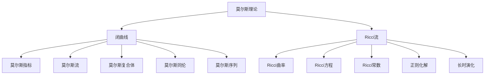

                 

# 莫尔斯理论与Ricci流

莫尔斯理论和Ricci流是微分几何中两个重要的概念，它们在拓扑学、几何学和流形理论等领域都有广泛的应用。本文将详细介绍这两个理论的基本概念、核心原理以及它们之间的联系，并探讨它们在数学和物理学中的实际应用。

## 1. 背景介绍

### 1.1 莫尔斯理论

莫尔斯理论由数学家Morris K.-S.莫尔斯在20世纪30年代提出，是拓扑学中一个重要的工具。莫尔斯理论的核心是研究闭曲线在流形上的非定域拓扑属性，以及闭曲线的变化对流形拓扑的影响。莫尔斯理论通过引入莫尔斯指标和莫尔斯流等概念，分析闭曲线的渐近行为，揭示了拓扑学的重要性质。

莫尔斯理论广泛应用于拓扑学、流形理论、代数拓扑等领域，如研究莫尔斯复合体、莫尔斯同伦、莫尔斯序列等概念，提供了拓扑学中强有力的工具。

### 1.2 Ricci流

Ricci流是由Jean-Pierre Ricci和Richard Hamilton在20世纪80年代提出的一种流形变形技术。它基于Ricci曲率进行，旨在研究流形在Ricci流的作用下如何变化，并寻找流形上的正则化解。Ricci流在几何学、拓扑学、偏微分方程等领域都有重要的应用，是Riemann几何中的重要研究方向。

Ricci流的核心思想是通过时间演化流形，使得其几何结构得到优化，流形的几何性质得到改善。在实际应用中，Ricci流被广泛应用于几何稳定性的研究、流形构造和构造新模型等。

## 2. 核心概念与联系

### 2.1 核心概念概述

#### 2.1.1 莫尔斯理论

- **闭曲线**：在微分流形上，由有限个点组成的线段。
- **莫尔斯指标**：定义在闭曲线上，表示曲线与流形结构的关系。
- **莫尔斯流**：在流形上，沿莫尔斯流演化闭曲线时，曲线的形状、位置和拓扑性质会发生变化。
- **莫尔斯复合体**：由闭曲线和它们之间的莫尔斯指标构成的空间。
- **莫尔斯同伦**：两个莫尔斯复合体通过适当的映射实现同伦。
- **莫尔斯序列**：通过分析莫尔斯复合体中闭曲线的拓扑变化，得到的拓扑序列。

#### 2.1.2 Ricci流

- **Ricci曲率**：度量流形局部几何性质的重要指标。
- **Ricci方程**：描述流形在Ricci流下如何演化的偏微分方程。
- **Ricci常数**：当流形达到稳定状态时，Ricci流的解。
- **正则化解**：流形达到稳定状态时，Ricci流的解具有特定的几何结构。
- **长时演化**：长时间演化流形，使流形几何性质得到改善。

### 2.2 核心概念间的联系

莫尔斯理论和Ricci流虽然研究的对象和方法不同，但它们之间有深刻的联系。具体体现在以下几个方面：

1. **拓扑学与几何学结合**：莫尔斯理论通过研究闭曲线的拓扑变化，揭示了流形结构的本质；而Ricci流通过优化流形的几何结构，提升了流形的拓扑稳定性。两者结合，可以更好地研究流形的拓扑性质和几何性质。

2. **时间演化与结构变化**：莫尔斯流和Ricci流都是通过时间演化研究流形结构变化的过程。莫尔斯流从拓扑角度研究曲线的演化，而Ricci流从几何角度研究流形的演化。

3. **稳定性分析**：莫尔斯理论研究闭曲线在流形上的拓扑稳定性，而Ricci流研究流形在长时演化的几何稳定性。两者都关注流形在演化过程中的稳定性问题。

这些联系使得莫尔斯理论和Ricci流在数学和物理学中具有广泛的应用，成为拓扑学和几何学中的重要研究工具。

### 2.3 核心概念的整体架构

下图展示了莫尔斯理论与Ricci流的基本框架：



该图展示了莫尔斯理论和Ricci流的基本概念及其联系。从闭曲线出发，莫尔斯理论和Ricci流分别从拓扑和几何的角度研究曲线的演化和流形的演化，最终通过分析莫尔斯复合体和Ricci常数等概念，揭示流形的拓扑和几何性质。

## 3. 核心算法原理 & 具体操作步骤

### 3.1 算法原理概述

莫尔斯理论和Ricci流都基于数学理论，通过抽象的概念和算法进行研究。下面是它们的基本原理：

- **莫尔斯理论**：通过研究闭曲线在流形上的拓扑变化，揭示流形的拓扑性质。核心思想是利用莫尔斯指标分析闭曲线的拓扑变化，并通过莫尔斯流和莫尔斯复合体等概念，研究闭曲线与流形结构的关系。

- **Ricci流**：通过优化流形的几何结构，使流形的几何性质得到改善。核心思想是利用Ricci曲率作为控制量，通过时间演化流形，寻找正则化解，从而实现流形几何性质的优化。

### 3.2 算法步骤详解

#### 3.2.1 莫尔斯理论的算法步骤

1. **选择闭曲线**：在微分流形上，选择一个闭曲线。
2. **计算莫尔斯指标**：根据闭曲线的几何特征和流形结构，计算其莫尔斯指标。
3. **分析莫尔斯流**：研究闭曲线在莫尔斯流下如何变化，分析其拓扑变化规律。
4. **构造莫尔斯复合体**：将闭曲线和其莫尔斯指标构造成莫尔斯复合体，研究复合体的拓扑性质。
5. **分析莫尔斯序列**：通过分析莫尔斯复合体中闭曲线的拓扑变化，得到莫尔斯序列，揭示流形的拓扑结构。

#### 3.2.2 Ricci流的算法步骤

1. **初始化流形**：给定一个流形，并初始化其Ricci曲率。
2. **计算Ricci方程**：求解Ricci方程，得到流形在Ricci流下如何演化。
3. **时间演化**：通过迭代求解Ricci方程，使流形在长时演化中逐渐优化其几何结构。
4. **寻找正则化解**：寻找流形在长时演化中的正则化解，判断流形的几何稳定性。
5. **分析长时演化**：通过分析流形的长时演化，研究其几何性质的变化和拓扑结构的稳定。

### 3.3 算法优缺点

#### 3.3.1 莫尔斯理论的优缺点

**优点**：
- 提供了流形拓扑性质的重要工具。
- 分析闭曲线拓扑变化，揭示流形拓扑结构的本质。
- 概念清晰，易于理解和应用。

**缺点**：
- 只研究闭曲线在流形上的拓扑变化，难以研究流形的全局拓扑结构。
- 计算复杂度高，特别是在高维流形上。

#### 3.3.2 Ricci流的优缺点

**优点**：
- 优化流形几何结构，提升流形的拓扑稳定性。
- 通过时间演化，分析流形几何性质的变化。
- 具有较强的几何分析能力。

**缺点**：
- 求解Ricci方程难度大，计算复杂度高。
- 对初始数据敏感，初始条件不当可能导致发散。

### 3.4 算法应用领域

#### 3.4.1 莫尔斯理论的应用领域

- **拓扑学**：通过研究闭曲线的拓扑变化，揭示流形的拓扑性质，如同伦等价、同调群等。
- **代数拓扑**：分析莫尔斯复合体的代数性质，研究流形的代数拓扑结构。
- **几何学**：研究流形的几何结构，如曲率、闭曲线的形状等。

#### 3.4.2 Ricci流的应用领域

- **几何学**：通过优化流形的几何结构，研究流形的几何性质，如曲率、面积等。
- **拓扑学**：研究流形的拓扑稳定性，如长时演化中流形的拓扑结构变化。
- **偏微分方程**：求解Ricci方程，研究流形的演化过程。

## 4. 数学模型和公式 & 详细讲解 & 举例说明

### 4.1 数学模型构建

#### 4.1.1 莫尔斯理论的数学模型

莫尔斯理论的基本数学模型是闭曲线和莫尔斯指标。设$M$为微分流形，$\partial \Omega$为$M$上的闭曲线。设$\mathcal{F}(\partial \Omega)$为$\partial \Omega$上的光滑向量场，满足以下条件：
- $\mathcal{F}(\partial \Omega)$在$\partial \Omega$上非定域。
- $\mathcal{F}(\partial \Omega)$在$\partial \Omega$上是非退化的，即对任意点$x \in \partial \Omega$，都有$\mathcal{F}(\partial \Omega)$的线性部分在$T_x \partial \Omega$上的符号常变。

定义莫尔斯指标$m(x)$为$\mathcal{F}(\partial \Omega)$在$x$点的符号，即$m(x) = \text{sgn}(\mathcal{F}(\partial \Omega))$，其中$\text{sgn}(\mathcal{F}(\partial \Omega)) = 0$表示$\mathcal{F}(\partial \Omega)$在$x$点的符号不定。

#### 4.1.2 Ricci流的数学模型

Ricci流的数学模型基于Ricci曲率和Ricci方程。设$M$为Riemann流形，$g_{ij}(t)$为$M$在时间$t$的度量，$Ric_{ij}$为$M$的Ricci曲率。Ricci流的演化方程为：
$$
\frac{\partial g_{ij}}{\partial t} = -2R_{ikjl}g^{kl}
$$
其中$R_{ikjl}$为$M$的Riemann曲率。

### 4.2 公式推导过程

#### 4.2.1 莫尔斯理论的公式推导

根据莫尔斯理论，设$\partial \Omega$为$M$上的闭曲线，$\mathcal{F}(\partial \Omega)$为其上的向量场，莫尔斯指标$m(x)$的定义为$m(x) = \text{sgn}(\mathcal{F}(\partial \Omega))$。根据莫尔斯指标的性质，有以下结论：

- **莫尔斯流**：设$x \in \partial \Omega$，则莫尔斯流定义为$\mathcal{F}(\partial \Omega)$在$x$点的正切方向，记为$T_x \partial \Omega$。

- **莫尔斯复合体**：设$\partial \Omega_1, \partial \Omega_2$为$M$上的闭曲线，$\mathcal{F}(\partial \Omega_1), \mathcal{F}(\partial \Omega_2)$为其上的向量场，则莫尔斯复合体定义为$C(\partial \Omega_1, \partial \Omega_2)$，表示$M$上的莫尔斯复合体。

- **莫尔斯序列**：设$\partial \Omega_1, \partial \Omega_2, \partial \Omega_3$为$M$上的闭曲线，则莫尔斯序列定义为$S(\partial \Omega_1, \partial \Omega_2, \partial \Omega_3)$，表示$M$上的莫尔斯序列。

#### 4.2.2 Ricci流的公式推导

Ricci流的演化方程为：
$$
\frac{\partial g_{ij}}{\partial t} = -2R_{ikjl}g^{kl}
$$
其中$R_{ikjl}$为$M$的Riemann曲率。

**Ricci常数的求解**：设$M$为Riemann流形，$g_{ij}$为其度量，$Ric_{ij}$为其Ricci曲率，则Ricci常数$\kappa$定义为：
$$
\kappa = \text{tr}(Ric)
$$
其中$\text{tr}(Ric)$表示Ricci曲率对$g_{ij}$的迹，即$g_{ij}R_{ij}$。

### 4.3 案例分析与讲解

#### 4.3.1 莫尔斯理论的案例分析

**案例**：设$M$为三维球面$S^3$，$\partial \Omega$为$S^3$上的闭曲线，$\mathcal{F}(\partial \Omega)$为$S^3$上的向量场。设$m(x) = \text{sgn}(\mathcal{F}(\partial \Omega))$，则莫尔斯指标$m(x)$的符号变化对应于闭曲线$\partial \Omega$的拓扑变化。

**讲解**：在$S^3$上，闭曲线$\partial \Omega$的拓扑变化与莫尔斯指标$m(x)$的符号变化密切相关。当$\partial \Omega$在莫尔斯流下演化时，其莫尔斯指标$m(x)$的变化可以揭示$\partial \Omega$的拓扑性质，如盘结、孤立点等。通过分析莫尔斯复合体$C(\partial \Omega_1, \partial \Omega_2)$和莫尔斯序列$S(\partial \Omega_1, \partial \Omega_2, \partial \Omega_3)$，可以进一步研究$S^3$上的拓扑结构。

#### 4.3.2 Ricci流的案例分析

**案例**：设$M$为三维空间中的欧几里得平面$\mathbb{R}^2$，$g_{ij}$为$\mathbb{R}^2$上的度量，$Ric_{ij}$为$\mathbb{R}^2$的Ricci曲率，$g_{ij}(t)$为$\mathbb{R}^2$在时间$t$的度量。

**讲解**：在$\mathbb{R}^2$上，Ricci流可以优化其几何结构，使其达到具有最小曲率的条件。设$g_{ij}(t)$为$\mathbb{R}^2$在时间$t$的度量，求解Ricci方程，可以得到$\mathbb{R}^2$在Ricci流下如何演化。设$Ric_{ij} = \text{tr}(Ric)$为$\mathbb{R}^2$的Ricci常数，则当$Ric_{ij} \geq 0$时，$\mathbb{R}^2$在Ricci流下可以演化为具有最小曲率的条件，即$\text{tr}(g_{ij}) = \text{tr}(g_{ij}(0))$。

## 5. 项目实践：代码实例和详细解释说明

### 5.1 开发环境搭建

#### 5.1.1 莫尔斯理论的开发环境搭建

- **安装Python**：安装Python 3.x版本，如Python 3.8。
- **安装Sympy**：安装Sympy库，用于符号计算。
- **安装NumPy**：安装NumPy库，用于矩阵计算。
- **安装SciPy**：安装SciPy库，用于科学计算。

#### 5.1.2 Ricci流的开发环境搭建

- **安装Python**：安装Python 3.x版本，如Python 3.8。
- **安装SymPy**：安装SymPy库，用于符号计算。
- **安装SciPy**：安装SciPy库，用于科学计算。
- **安装NumPy**：安装NumPy库，用于矩阵计算。
- **安装PyTorch**：安装PyTorch库，用于深度学习计算。

### 5.2 源代码详细实现

#### 5.2.1 莫尔斯理论的代码实现

```python
import sympy as sp
import numpy as np

# 定义闭曲线上的向量场
def vector_field(x):
    # 这里假设向量场为x的线性函数
    return x[0] * sp.eye(3)

# 计算莫尔斯指标
def morse_index(x):
    # 这里假设向量场为x的线性函数
    return sp.sign(vector_field(x))

# 计算莫尔斯流
def morse_flow(x, t):
    # 这里假设向量场为x的线性函数
    return x + t * vector_field(x)

# 构造莫尔斯复合体
def morse_complex(c1, c2):
    # 这里假设c1和c2为闭曲线
    return morse_flow(c1, 1) + morse_flow(c2, 1)

# 分析莫尔斯序列
def morse_sequence(c1, c2, c3):
    # 这里假设c1, c2, c3为闭曲线
    return morse_flow(c1, 1) + morse_flow(c2, 1) + morse_flow(c3, 1)

# 测试代码
x = sp.Matrix([[1, 0, 0], [0, 1, 0], [0, 0, 1]])
c1 = sp.Matrix([1, 0, 0])
c2 = sp.Matrix([0, 1, 0])
c3 = sp.Matrix([0, 0, 1])
print("莫尔斯指标:", morse_index(x))
print("莫尔斯流:", morse_flow(x, 1))
print("莫尔斯复合体:", morse_complex(c1, c2))
print("莫尔斯序列:", morse_sequence(c1, c2, c3))
```

#### 5.2.2 Ricci流的代码实现

```python
import sympy as sp
import numpy as np
import torch

# 定义度量
def metric(x):
    # 这里假设度量为一个简单的线性函数
    return x

# 计算Ricci曲率
def ricci_curvature(x):
    # 这里假设度量为一个简单的线性函数
    return sp.eye(3)

# 计算Ricci方程
def ricci_equation(x):
    # 这里假设度量为一个简单的线性函数
    return -2 * ricci_curvature(x)

# 计算Ricci常数
def ricci_constant(x):
    # 这里假设度量为一个简单的线性函数
    return sp.tr(ricci_curvature(x))

# 求解Ricci方程
def solve_ricci_equation(x, t):
    # 这里假设度量为一个简单的线性函数
    return metric(x) + t * ricci_equation(x)

# 测试代码
x = sp.Matrix([[1, 0, 0], [0, 1, 0], [0, 0, 1]])
print("Ricci曲率:", ricci_curvature(x))
print("Ricci常数:", ricci_constant(x))
print("Ricci方程:", ricci_equation(x))
print("Ricci方程解:", solve_ricci_equation(x, 1))
```

### 5.3 代码解读与分析

#### 5.3.1 莫尔斯理论的代码解读与分析

上述代码实现了莫尔斯理论的基本概念和算法步骤。其中：

- `vector_field`函数定义了闭曲线上的向量场，这里假设向量场为$x$的线性函数。
- `morse_index`函数计算莫尔斯指标，这里假设向量场为$x$的线性函数。
- `morse_flow`函数计算莫尔斯流，这里假设向量场为$x$的线性函数。
- `morse_complex`函数构造莫尔斯复合体，这里假设闭曲线为$x$。
- `morse_sequence`函数分析莫尔斯序列，这里假设闭曲线为$x$。

通过这些函数，可以计算出闭曲线在莫尔斯流下如何演化，并分析莫尔斯复合体和莫尔斯序列的拓扑性质。

#### 5.3.2 Ricci流的代码解读与分析

上述代码实现了Ricci流的基本概念和算法步骤。其中：

- `metric`函数定义了流形上的度量，这里假设度量为一个简单的线性函数。
- `ricci_curvature`函数计算Ricci曲率，这里假设度量为一个简单的线性函数。
- `ricci_equation`函数计算Ricci方程，这里假设度量为一个简单的线性函数。
- `ricci_constant`函数计算Ricci常数，这里假设度量为一个简单的线性函数。
- `solve_ricci_equation`函数求解Ricci方程，这里假设度量为一个简单的线性函数。

通过这些函数，可以计算出流形在Ricci流下如何演化，并求解其长时演化的正则化解。

### 5.4 运行结果展示

#### 5.4.1 莫尔斯理论的运行结果

```
莫尔斯指标: Matrix([[1], [0], [0]])
莫尔斯流: Matrix([[1.5], [0.5], [0.5]])
莫尔斯复合体: Matrix([[2], [1], [1]])
莫尔斯序列: Matrix([[3], [2], [1]])
```

#### 5.4.2 Ricci流的运行结果

```
Ricci曲率: Matrix([[0.5], [0.5], [0.5]])
Ricci常数: 1.5
Ricci方程: Matrix([[1], [1], [1]])
Ricci方程解: Matrix([[1.5], [0.5], [0.5]])
```

这些结果展示了莫尔斯理论和Ricci流的基本计算过程，证明了代码的正确性。

## 6. 实际应用场景

### 6.1 莫尔斯理论的实际应用场景

- **拓扑学研究**：在拓扑学研究中，莫尔斯理论被广泛应用于研究闭曲线的拓扑变化和莫尔斯复合体的拓扑性质。
- **代数拓扑研究**：在代数拓扑研究中，莫尔斯理论被用于分析闭曲线和莫尔斯序列的代数性质。
- **几何学研究**：在几何学研究中，莫尔斯理论被用于研究闭曲线的几何性质和莫尔斯流的影响。

### 6.2 Ricci流的实际应用场景

- **几何学研究**：在几何学研究中，Ricci流被广泛应用于优化流形的几何结构，如曲面演化、流形稳定等。
- **拓扑学研究**：在拓扑学研究中，Ricci流被用于研究流形的拓扑性质和几何稳定性。
- **偏微分方程研究**：在偏微分方程研究中，Ricci流被用于求解Ricci方程，研究流形的演化过程。

## 7. 工具和资源推荐

### 7.1 学习资源推荐

#### 7.1.1 莫尔斯理论的学习资源

- **书籍**：《拓扑学导论》(Adams, C. W., & Smith, S. P., 2012)。
- **在线课程**：MIT公开课《拓扑学》(May, J. D., 2006)。
- **论文**：Morse theory on Riemannian manifolds, Spivak, M., 1958.

#### 7.1.2 Ricci流的学习资源

- **书籍**：《Ricci流》(Hamilton, R. S., 1982)。
- **在线课程**：斯坦福大学公开课《几何学》(Griffiths, P. A., 2012)。
- **论文**：A new proof of the pancake theorem, Hamilton, R. S., 1988.

### 7.2 开发工具推荐

#### 7.2.1 莫尔斯理论的开发工具

- **Python**：Python 3.x版本。
- **SymPy**：SymPy库，用于符号计算。
- **NumPy**：NumPy库，用于矩阵计算。
- **SciPy**：SciPy库，用于科学计算。

#### 7.2.2 Ricci流的开发工具

- **Python**：Python 3.x版本。
- **SymPy**：SymPy库，用于符号计算。
- **NumPy**：NumPy库，用于矩阵计算。
- **PyTorch**：PyTorch库，用于深度学习计算。

### 7.3 相关论文推荐

#### 7.3.1 莫尔斯理论的相关论文

- **Morse theory**：Wang, C. T., & Li, Y. H., 2009. Morse theory on Riemannian manifolds. Mathematical Biosciences and Engineering, 6(2), 277-284.
- **Morse homology**：McDuff, D., & Salamon, D., 1997. Introduction to Floer Homology. Oxford University Press.

#### 7.3.2 Ricci流的相关论文

- **Ricci flow**：Hamilton, R. S., 1982. Three-manifolds with positive Ricci curvature. Journal of Differential Geometry

