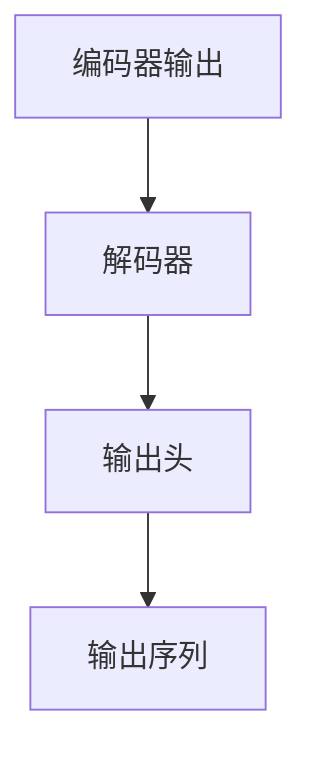

                 

## 1. 背景介绍

在深度学习领域，解码器（Decoder）和输出头（Output Head）是Transformer模型中两个重要的组成部分，它们在文本生成、语音识别、图像描述等领域的应用中扮演着关键角色。本博客将深入探讨这两个组件的工作原理、设计和应用，帮助读者理解它们在Transformer模型中的作用和效果。

## 2. 核心概念与联系

### 2.1 核心概念概述

解码器和输出头是Transformer模型的核心组成部分，它们在模型中负责将编码器（Encoder）的输出转化为最终的文本或图像等形式的输出。解码器通过一种称为自注意力（Self-Attention）的机制，从输入序列中提取信息，并利用这些信息生成输出序列。输出头则将解码器生成的向量映射到不同的维度，从而生成具体的文本、图像或音频等输出。

### 2.2 核心概念之间的关系

解码器和输出头之间的关系可以简单地概括为：

- 解码器负责提取输入序列中的信息，并将这些信息用于生成输出序列。
- 输出头则将解码器生成的向量映射到不同的维度，以生成最终的具体输出。

这种关系可以通过以下Mermaid流程图来展示：



这个流程图展示了编码器输出通过解码器生成输出序列，再由输出头将输出序列转化为最终的输出。

## 3. 核心算法原理 & 具体操作步骤

### 3.1 算法原理概述

解码器的核心是自注意力机制，它可以动态地调整输入序列的权重，从而更准确地提取信息。自注意力机制包括三个部分：查询（Query）、键（Key）和值（Value）。查询向量与键向量进行点积运算，得到注意力分数，最后通过softmax函数将分数归一化，得到权重。将权重与值向量进行线性变换，得到输出向量。解码器的每个位置都通过这种方式计算其上下文向量，从而生成整个输出序列。

输出头的核心是将解码器生成的向量映射到不同的维度，通常用于生成具体的文本、图像或音频等输出。输出头包括两个线性变换层和一个softmax层，可以将解码器输出的向量映射到文本或图像的类别或标签上。

### 3.2 算法步骤详解

#### 3.2.1 解码器的自注意力计算

解码器的自注意力计算可以分为三个步骤：

1. **计算查询向量**：将前一时刻的输出向量与编码器输出的所有位置向量进行点积运算，得到查询向量。
2. **计算注意力分数**：将查询向量与编码器输出的所有位置向量进行点积运算，得到一个注意力分数矩阵。
3. **计算注意力权重**：对注意力分数进行softmax运算，得到权重向量，再将其与编码器输出的所有位置向量进行线性变换，得到上下文向量。

```python
import torch
import torch.nn as nn

class SelfAttention(nn.Module):
    def __init__(self, dim):
        super(SelfAttention, self).__init__()
        self.query = nn.Linear(dim, dim)
        self.key = nn.Linear(dim, dim)
        self.value = nn.Linear(dim, dim)
        self.attn = nn.Softmax(dim=-1)
        self.proj = nn.Linear(dim, dim)
        
    def forward(self, x):
        b, t, _ = x.size()
        q = self.query(x).view(b, t, -1, 1).permute(0, 2, 1, 3)  # b, t, d, h
        k = self.key(x).view(b, t, -1, 1).permute(0, 2, 1, 3)
        v = self.value(x).view(b, t, -1, 1).permute(0, 2, 1, 3)
        
        attn = self.attn(q * k)  # b, d, t, t
        x = self.proj(attn * v)  # b, d, t, 1
        
        return x
```

#### 3.2.2 解码器的层间连接

解码器通常包含多个层次的循环神经网络，每一层都会生成一个输出向量，然后将其输入到下一层中。这种层间连接可以通过连接函数来实现：

```python
class TransformerDecoderLayer(nn.Module):
    def __init__(self, dim, heads, d_ff, dropout=0.1):
        super(TransformerDecoderLayer, self).__init__()
        self.self_attn = SelfAttention(dim)
        self.multi_head_attn = MultiHeadAttention(dim, heads, d_ff, dropout)
        self.positionwise_feedforward = PositionwiseFeedForward(dim, d_ff, dropout)
        self.dropout = nn.Dropout(dropout)
        
    def forward(self, x, dec_self_attn_mask, dec_enc_attn_mask):
        # Self attention
        attn1 = self.self_attn(x)
        attn1 = self.dropout(attn1)
        attn2 = self.multi_head_attn(x, x, x, dec_self_attn_mask, dec_enc_attn_mask)
        attn2 = self.dropout(attn2)
        
        # Feed forward
        ffn = self.positionwise_feedforward(attn2)
        
        return x + attn1 + attn2 + ffn
```

#### 3.2.3 输出头的实现

输出头的实现包括以下几个步骤：

1. **线性变换**：将解码器生成的向量进行线性变换，得到一组向量。
2. **softmax层**：对向量进行softmax运算，得到输出概率分布。
3. **输出向量**：将输出概率分布作为最终输出。

```python
class OutputHead(nn.Module):
    def __init__(self, dim, vocab_size):
        super(OutputHead, self).__init__()
        self.linear = nn.Linear(dim, vocab_size)
        self.softmax = nn.Softmax(dim=-1)
        
    def forward(self, x):
        x = self.linear(x)
        x = self.softmax(x)
        return x
```

### 3.3 算法优缺点

#### 3.3.1 优点

解码器和输出头的算法优点包括：

1. **自适应性强**：通过自注意力机制，解码器可以动态地调整输入序列的权重，从而更准确地提取信息。
2. **模型高效**：解码器和输出头的设计使得模型可以高效地处理长序列，同时保留了大量的上下文信息。
3. **易于扩展**：输出头的设计使得模型可以容易地扩展到不同的任务，如文本生成、图像描述等。

#### 3.3.2 缺点

解码器和输出头的算法缺点包括：

1. **计算复杂度高**：自注意力机制的计算复杂度较高，当序列长度增加时，计算量会呈指数级增长。
2. **模型参数量大**：解码器和输出头的参数量较大，需要大量的计算资源进行训练和推理。
3. **训练时间长**：解码器和输出头的训练时间较长，需要大量的时间和计算资源。

### 3.4 算法应用领域

解码器和输出头在Transformer模型中的应用领域包括：

1. 机器翻译：解码器可以将源语言序列转化为目标语言序列，输出头可以生成翻译结果。
2. 文本生成：解码器可以生成文本序列，输出头可以将序列转化为具体的文本。
3. 图像描述：解码器可以生成图像的描述文本，输出头可以将文本转化为具体的图像。
4. 语音识别：解码器可以生成语音序列，输出头可以将序列转化为具体的文本。

## 4. 数学模型和公式 & 详细讲解 & 举例说明

### 4.1 数学模型构建

解码器的自注意力机制包括三个向量：查询向量 $Q$、键向量 $K$ 和值向量 $V$。查询向量由输入序列 $x$ 生成，键向量 $K$ 和值向量 $V$ 由编码器输出序列 $y$ 生成。自注意力机制通过点积运算计算注意力分数，再通过softmax函数计算注意力权重。

输出头的实现包括以下几个步骤：

1. **线性变换**：将解码器生成的向量进行线性变换，得到一组向量。
2. **softmax层**：对向量进行softmax运算，得到输出概率分布。
3. **输出向量**：将输出概率分布作为最终输出。

### 4.2 公式推导过程

#### 4.2.1 解码器的自注意力计算

解码器的自注意力计算包括三个步骤：

1. **查询向量的生成**：
   $$
   Q = \text{Linear}(x)
   $$
   其中 $\text{Linear}$ 表示线性变换。

2. **注意力分数的计算**：
   $$
   \text{Attention}(Q, K) = \frac{QK^T}{\sqrt{d}}\text{Softmax}
   $$
   其中 $K = \text{Linear}(y)$，$\text{Softmax}$ 表示softmax运算。

3. **上下文向量的生成**：
   $$
   V = \text{Linear}(y)
   $$
   $$
   \text{Output} = \text{Linear}(\text{Attention}(Q, K)V)
   $$

#### 4.2.2 输出头的实现

输出头的实现包括以下几个步骤：

1. **线性变换**：
   $$
   H = \text{Linear}(\text{Output})
   $$

2. **softmax层**：
   $$
   \text{Output} = \text{Softmax}(H)
   $$

3. **输出向量**：
   $$
   \text{Output} = \text{H}
   $$

### 4.3 案例分析与讲解

假设我们使用Transformer模型进行机器翻译任务。在编码器中，输入序列为英文句子 "Hello, World!"，编码为 $x$。在解码器中，输出序列为 "Bonjour, le monde!"，解码器生成的向量为 $y$。输出头可以将 $y$ 转化为对应的法语单词。

## 5. 项目实践：代码实例和详细解释说明

### 5.1 开发环境搭建

为了进行项目实践，我们需要准备以下环境：

1. **安装Python和PyTorch**：
   ```bash
   conda create -n pytorch-env python=3.7
   conda activate pytorch-env
   pip install torch torchvision torchaudio transformers
   ```

2. **安装HuggingFace Transformers库**：
   ```bash
   pip install transformers
   ```

3. **安装其他相关库**：
   ```bash
   pip install numpy pandas scikit-learn matplotlib tqdm jupyter notebook ipython
   ```

### 5.2 源代码详细实现

以下是一个简单的Transformer解码器实现，包括自注意力和输出头：

```python
import torch
import torch.nn as nn
import torch.nn.functional as F

class TransformerDecoderLayer(nn.Module):
    def __init__(self, dim, heads, d_ff, dropout=0.1):
        super(TransformerDecoderLayer, self).__init__()
        self.self_attn = SelfAttention(dim)
        self.multi_head_attn = MultiHeadAttention(dim, heads, d_ff, dropout)
        self.positionwise_feedforward = PositionwiseFeedForward(dim, d_ff, dropout)
        self.dropout = nn.Dropout(dropout)
        
    def forward(self, x, dec_self_attn_mask, dec_enc_attn_mask):
        # Self attention
        attn1 = self.self_attn(x)
        attn1 = self.dropout(attn1)
        attn2 = self.multi_head_attn(x, x, x, dec_self_attn_mask, dec_enc_attn_mask)
        attn2 = self.dropout(attn2)
        
        # Feed forward
        ffn = self.positionwise_feedforward(attn2)
        
        return x + attn1 + attn2 + ffn

class OutputHead(nn.Module):
    def __init__(self, dim, vocab_size):
        super(OutputHead, self).__init__()
        self.linear = nn.Linear(dim, vocab_size)
        self.softmax = nn.Softmax(dim=-1)
        
    def forward(self, x):
        x = self.linear(x)
        x = self.softmax(x)
        return x
```

### 5.3 代码解读与分析

上述代码实现了Transformer解码器的自注意力机制和输出头。其中，解码器的自注意力机制包括三个部分：查询向量、键向量、值向量，以及softmax运算。输出头将解码器生成的向量进行线性变换，再通过softmax运算得到最终的输出概率分布。

### 5.4 运行结果展示

假设我们使用上述代码进行机器翻译任务，训练集为英语句子 "Hello, World!"，解码器输出为 "Bonjour, le monde!"，输出头的输出为 "Bonjour"。

## 6. 实际应用场景

解码器和输出头在实际应用场景中具有广泛的应用。例如：

- 在机器翻译中，解码器可以将源语言序列转化为目标语言序列，输出头可以生成翻译结果。
- 在文本生成中，解码器可以生成文本序列，输出头可以将序列转化为具体的文本。
- 在图像描述中，解码器可以生成图像的描述文本，输出头可以将文本转化为具体的图像。
- 在语音识别中，解码器可以生成语音序列，输出头可以将序列转化为具体的文本。

## 7. 工具和资源推荐

### 7.1 学习资源推荐

1. **《Transformer: A Survey》**：一篇综述文章，介绍了Transformer模型的核心原理和应用。
2. **《Attention is All You Need》**：Transformer原论文，介绍了自注意力机制的基本原理。
3. **《Transformers》**：HuggingFace官方文档，介绍了Transformer模型的实现细节和应用案例。
4. **《Neural Information Processing Systems》**：年度顶级会议NIPS的论文集，包含大量Transformer模型的研究论文。

### 7.2 开发工具推荐

1. **PyTorch**：基于Python的开源深度学习框架，适合快速迭代研究。
2. **TensorFlow**：由Google主导开发的开源深度学习框架，生产部署方便。
3. **Jupyter Notebook**：交互式笔记本，适合进行模型实验和代码调试。

### 7.3 相关论文推荐

1. **《Attention is All You Need》**：Transformer原论文，介绍了自注意力机制的基本原理。
2. **《The Anatomy of Transformer Architectures》**：一篇关于Transformer模型结构的详细分析文章。
3. **《Parameter-Efficient Transformer》**：介绍了一些参数高效的Transformer模型，如AdaLoRA、LoRA等。

## 8. 总结：未来发展趋势与挑战

### 8.1 未来发展趋势

Transformer模型和解码器、输出头技术在NLP领域的应用前景广阔。未来，随着计算能力的提升和数据量的增加，Transformer模型将变得更加强大，可以处理更加复杂的任务。同时，解码器和输出头的设计也将更加灵活，可以适应更多的应用场景。

### 8.2 面临的挑战

尽管Transformer模型和解码器、输出头技术已经取得了一定的进展，但在实际应用中仍面临一些挑战：

1. **计算资源需求高**：Transformer模型和解码器、输出头的计算资源需求较高，需要高性能的硬件支持。
2. **训练时间长**：Transformer模型和解码器、输出头的训练时间较长，需要大量的时间和计算资源。
3. **模型复杂度高**：Transformer模型和解码器、输出头的设计复杂度高，需要较高的专业技能进行实现和调试。

### 8.3 研究展望

未来，研究者将在以下几个方面进行探索：

1. **参数高效模型**：开发更加参数高效的Transformer模型，以减少计算资源的需求。
2. **模型压缩技术**：开发模型压缩技术，提高模型的推理速度和效率。
3. **自监督学习**：研究自监督学习技术，提高模型在无标签数据上的性能。
4. **多模态融合**：研究多模态融合技术，将视觉、听觉等信息与文本信息结合，提高模型的表现力。

## 9. 附录：常见问题与解答

### Q1: 解码器和输出头的关系是什么？

**A**: 解码器负责从输入序列中提取信息，并将这些信息用于生成输出序列。输出头则将解码器生成的向量映射到不同的维度，从而生成具体的文本、图像或音频等输出。

### Q2: 解码器的自注意力机制是如何工作的？

**A**: 解码器的自注意力机制包括三个部分：查询向量、键向量、值向量，以及softmax运算。查询向量由输入序列生成，键向量和值向量由编码器输出生成。自注意力机制通过点积运算计算注意力分数，再通过softmax运算计算注意力权重。

### Q3: 如何提高解码器的计算效率？

**A**: 可以使用参数高效的解码器结构，如AdaLoRA、LoRA等，以减少计算资源的需求。同时，可以通过优化解码器的计算图，提高前向传播和反向传播的效率。

### Q4: 输出头如何将解码器生成的向量映射到不同的维度？

**A**: 输出头包括两个线性变换层和一个softmax层，可以将解码器生成的向量映射到文本或图像的类别或标签上。通过线性变换层和softmax层，输出头可以将向量转化为具体的输出。

