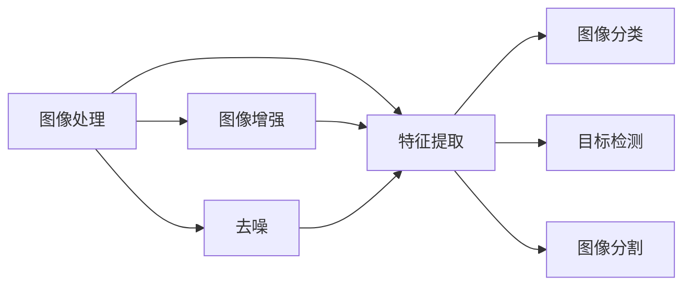
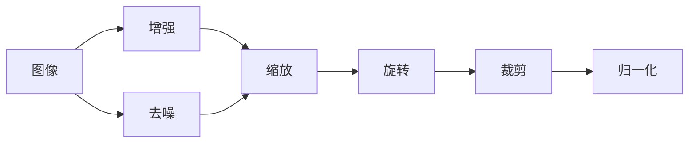
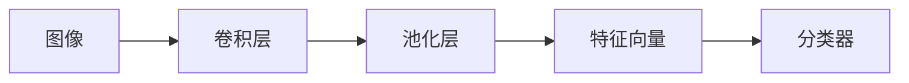
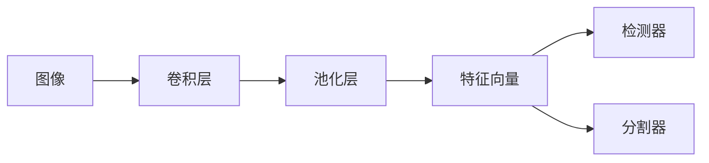

                 

# 计算机视觉(Computer Vision) - 原理与代码实例讲解

> 关键词：计算机视觉,卷积神经网络(CNN),图像分类,目标检测,图像分割,深度学习

## 1. 背景介绍

计算机视觉(Computer Vision, CV)是人工智能(AI)领域的重要分支，旨在让计算机理解、解释和处理视觉信息。从图像识别到视频监控，从自动驾驶到工业检测，计算机视觉技术在各个行业都有着广泛的应用。

### 1.1 问题由来
计算机视觉的早期尝试可以追溯到20世纪50年代，早期的计算机视觉研究主要集中在识别简单的视觉对象，如字母和数字。然而，早期算法通常依赖于手动设计的特征提取器，这些提取器需要大量的人工干预。

直到1986年，卷积神经网络(Convolutional Neural Network, CNN)的发明彻底改变了计算机视觉的面貌。CNN不仅大大提升了计算机视觉的准确性，还使得计算机视觉从依赖手动特征提取的阶段迈向了深度学习的新时代。

近年来，深度学习模型的性能显著提升，得益于大规模数据集和强大的计算能力。计算机视觉在图像分类、目标检测、图像分割、场景理解、行为识别等任务上均取得了显著进展。

### 1.2 问题核心关键点
计算机视觉的核心问题包括图像处理、特征提取、目标识别、图像分割等。这些任务依赖于深度学习模型，特别是卷积神经网络，来进行高性能的视觉数据分析。

核心概念包括：
- 图像处理：包括图像增强、去噪、转换等预处理步骤。
- 特征提取：从原始图像中提取有意义的信息，通常是利用卷积神经网络的卷积层和池化层来实现。
- 目标识别：从图像中识别出特定的对象，如人脸、车辆等。
- 图像分割：将图像分割成多个区域，每个区域表示图像中的一个物体或场景。
- 场景理解：利用计算机视觉模型来理解和解释图像中包含的场景和语义信息。

这些任务构成了一个完整的计算机视觉生态系统，从基础图像处理到高级场景理解，涵盖了计算机视觉的各个方面。

## 2. 核心概念与联系

### 2.1 核心概念概述

为了更好地理解计算机视觉的核心概念，本节将介绍几个关键概念，并解释它们之间的关系。

- 图像分类(图像识别)：给定一个图像，识别出其中包含的特定对象或类别。
- 目标检测：不仅识别出图像中的对象，还标注出每个对象的位置和大小。
- 图像分割：将图像分割成多个区域，每个区域表示图像中的一个物体或场景。
- 特征提取：从原始图像中提取有用的特征，这些特征通常用于训练深度学习模型。
- 卷积神经网络(CNN)：一种特殊的神经网络，特别适用于图像处理任务。

这些核心概念之间的逻辑关系可以通过以下Mermaid流程图来展示：



这个流程图展示了图像处理和特征提取如何为图像分类、目标检测和图像分割任务提供基础。图像增强和去噪可以帮助提高图像质量，从而提升后续任务的性能。

### 2.2 概念间的关系

这些核心概念之间存在着紧密的联系，形成了计算机视觉的完整生态系统。下面我们通过几个Mermaid流程图来展示这些概念之间的关系。

#### 2.2.1 图像处理的多种方式



这个流程图展示了图像增强和去噪可以通过多种方式来提升图像质量，如缩放、旋转、裁剪和归一化。这些预处理步骤可以帮助模型更好地学习图像特征。

#### 2.2.2 特征提取与分类



这个流程图展示了卷积神经网络的卷积层和池化层如何提取图像的特征，并将其转化为高维的特征向量。这些特征向量再通过分类器进行分类，最终输出图像的类别。

#### 2.2.3 目标检测与图像分割



这个流程图展示了卷积神经网络的卷积层和池化层如何提取图像的特征，并将其转化为高维的特征向量。这些特征向量再通过检测器和分割器进行目标检测和图像分割，最终输出对象的位置和大小或图像的分割结果。

## 3. 核心算法原理 & 具体操作步骤
### 3.1 算法原理概述

计算机视觉的核心算法是卷积神经网络(CNN)，其设计理念来源于人类视觉系统的生物学原理。CNN通过多层卷积和池化操作，提取图像的局部特征，并利用全连接层进行分类或回归。

### 3.2 算法步骤详解

卷积神经网络的主要步骤包括：
1. **输入预处理**：将图像转换为网络可以处理的格式，如归一化、缩放等。
2. **卷积层**：通过卷积操作提取图像的局部特征。
3. **激活函数**：通过激活函数增加网络的非线性特性，如ReLU、Sigmoid等。
4. **池化层**：通过池化操作降低特征图的空间大小，减少计算量和内存消耗。
5. **全连接层**：将卷积和池化层输出的特征向量转化为高维的向量，进行分类或回归。
6. **输出层**：根据任务类型选择合适的损失函数，如交叉熵损失等，并使用优化算法进行模型训练。

### 3.3 算法优缺点

卷积神经网络的主要优点包括：
- 局部连接：卷积层中每个神经元只与局部区域的神经元相连，减少了计算量和内存消耗。
- 权值共享：卷积核在图像中移动时，每个神经元共用同一个卷积核，进一步减少了参数数量。
- 平移不变性：由于卷积核在图像中的移动，卷积神经网络具有平移不变性，能够处理不同位置的图像特征。

卷积神经网络的主要缺点包括：
- 模型复杂度：虽然参数数量较少，但卷积神经网络的计算量仍然较大。
- 难以解释：卷积神经网络通常被称为"黑盒"模型，其内部工作机制难以解释。
- 数据需求高：卷积神经网络需要大量的标注数据进行训练，获取高质量标注数据的成本较高。

### 3.4 算法应用领域

卷积神经网络在计算机视觉领域有广泛的应用，主要包括以下几个方面：
- 图像分类：如手写数字识别、图像识别等。
- 目标检测：如行人检测、车辆检测等。
- 图像分割：如语义分割、实例分割等。
- 场景理解：如场景分类、图像描述等。
- 行为识别：如行人动作识别、行为识别等。

除了上述应用，卷积神经网络还被用于医学影像分析、自动驾驶、智能监控等众多领域，展示了其在视觉信息处理方面的强大能力。

## 4. 数学模型和公式 & 详细讲解 & 举例说明

### 4.1 数学模型构建

卷积神经网络的基本模型包括输入层、卷积层、激活函数、池化层、全连接层和输出层。假设输入图像大小为$H \times W \times C$，卷积核大小为$K \times K$，卷积层输出特征图大小为$H' \times W' \times C'$，则卷积操作的数学表达式为：

$$
X'(i,j,k) = \sum_{x=0}^{H-K} \sum_{y=0}^{W-K} X(i+x,j+y,k) * W(x,y,k)
$$

其中$X$为输入图像，$X'(i,j,k)$为卷积层的输出特征图，$W(x,y,k)$为卷积核。

### 4.2 公式推导过程

以下以图像分类任务为例，推导卷积神经网络的输出。

设输入图像大小为$H \times W \times C$，卷积层输出特征图大小为$H' \times W' \times C'$，激活函数为ReLU，全连接层输出特征向量大小为$D$，输出层为$K$类分类器，则卷积神经网络的输出为：

$$
Z = \sigma(X * W) \quad \text{(卷积层)}
$$

$$
Z' = \text{Max Pooling}(Z) \quad \text{(池化层)}
$$

$$
Y = W' Z' + b \quad \text{(全连接层)}
$$

$$
\hat{Y} = softmax(Y) \quad \text{(输出层)}
$$

其中$\sigma$为ReLU激活函数，$W$为卷积核，$W'$为全连接层权重，$b$为偏置项，$softmax$为输出层激活函数。

### 4.3 案例分析与讲解

以ImageNet图像分类任务为例，使用AlexNet网络进行图像分类。

AlexNet网络包括5个卷积层、3个全连接层和ReLU激活函数。假设输入图像大小为$224 \times 224 \times 3$，卷积核大小为$11 \times 11$，卷积层输出特征图大小为$55 \times 55 \times 64$，激活函数为ReLU，全连接层输出特征向量大小为$4096$，输出层为1000类分类器。

设输入图像$X$为：

$$
X = \begin{bmatrix}
x_{11} & x_{12} & x_{13} & \cdots & x_{21} & x_{22} & x_{23} & \cdots & x_{31} & x_{32} & x_{33} & \cdots \\
x_{21} & x_{22} & x_{23} & \cdots & x_{31} & x_{32} & x_{33} & \cdots & x_{41} & x_{42} & x_{43} & \cdots \\
x_{31} & x_{32} & x_{33} & \cdots & x_{41} & x_{42} & x_{43} & \cdots & x_{51} & x_{52} & x_{53} & \cdots
\end{bmatrix}
$$

设卷积核$W$为：

$$
W = \begin{bmatrix}
w_{11} & w_{12} & w_{13} & \cdots & w_{21} & w_{22} & w_{23} & \cdots & w_{31} & w_{32} & w_{33} & \cdots
\end{bmatrix}
$$

则卷积操作$X * W$为：

$$
Z = \begin{bmatrix}
\sum_{x=0}^{H-K} \sum_{y=0}^{W-K} x_{11} * w_{11} & \sum_{x=0}^{H-K} \sum_{y=0}^{W-K} x_{12} * w_{12} & \cdots \\
\sum_{x=0}^{H-K} \sum_{y=0}^{W-K} x_{21} * w_{11} & \sum_{x=0}^{H-K} \sum_{y=0}^{W-K} x_{22} * w_{12} & \cdots \\
\sum_{x=0}^{H-K} \sum_{y=0}^{W-K} x_{31} * w_{11} & \sum_{x=0}^{H-K} \sum_{y=0}^{W-K} x_{32} * w_{12} & \cdots
\end{bmatrix}
$$

假设池化操作为Max Pooling，则池化层输出$Z'$为：

$$
Z' = \begin{bmatrix}
\max(Z(1,1,:)) & \max(Z(1,2,:)) & \cdots \\
\max(Z(2,1,:)) & \max(Z(2,2,:)) & \cdots \\
\max(Z(3,1,:)) & \max(Z(3,2,:)) & \cdots
\end{bmatrix}
$$

假设全连接层权重$W'$和偏置项$b$分别为：

$$
W' = \begin{bmatrix}
w_{1,1} & w_{1,2} & \cdots & w_{1,C'} \\
w_{2,1} & w_{2,2} & \cdots & w_{2,C'} \\
\vdots & \vdots & \ddots & \vdots \\
w_{D,1} & w_{D,2} & \cdots & w_{D,C'}
\end{bmatrix}, b = \begin{bmatrix}
b_1 & b_2 & \cdots & b_D
\end{bmatrix}
$$

则全连接层输出$Y$为：

$$
Y = W'Z' + b
$$

假设输出层分类器为Softmax，则输出$\hat{Y}$为：

$$
\hat{Y} = softmax(Y) = \frac{e^{Y}}{\sum_{k=1}^K e^{Y_k}}
$$

其中$Y_k$为输出层第$k$类的输出值。

通过上述推导，可以看到卷积神经网络如何通过卷积和全连接层，将输入图像转换为输出类别。

## 5. 项目实践：代码实例和详细解释说明
### 5.1 开发环境搭建

在进行计算机视觉项目开发前，我们需要准备好开发环境。以下是使用Python进行PyTorch开发的环境配置流程：

1. 安装Anaconda：从官网下载并安装Anaconda，用于创建独立的Python环境。

2. 创建并激活虚拟环境：
```bash
conda create -n pytorch-env python=3.8 
conda activate pytorch-env
```

3. 安装PyTorch：根据CUDA版本，从官网获取对应的安装命令。例如：
```bash
conda install pytorch torchvision torchaudio cudatoolkit=11.1 -c pytorch -c conda-forge
```

4. 安装Pillow库：
```bash
pip install Pillow
```

5. 安装各类工具包：
```bash
pip install numpy pandas scikit-learn matplotlib tqdm jupyter notebook ipython
```

完成上述步骤后，即可在`pytorch-env`环境中开始计算机视觉项目开发。

### 5.2 源代码详细实现

这里以手写数字识别任务为例，使用PyTorch实现卷积神经网络的图像分类。

首先，定义图像处理函数：

```python
import torch
from torchvision import transforms

# 定义图像处理函数
def transform(funcs):
    return transforms.Compose(funcs)

# 定义数据预处理函数
def preprocess():
    return transform([
        transforms.ToTensor(),
        transforms.Normalize(mean=[0.5, 0.5, 0.5], std=[0.5, 0.5, 0.5])
    ])
```

然后，加载并预处理MNIST数据集：

```python
from torchvision.datasets import MNIST
from torch.utils.data import DataLoader

# 加载MNIST数据集
train_dataset = MNIST('data', train=True, download=True, transform=preprocess())
test_dataset = MNIST('data', train=False, download=True, transform=preprocess())

# 加载数据集
train_loader = DataLoader(train_dataset, batch_size=64, shuffle=True)
test_loader = DataLoader(test_dataset, batch_size=64, shuffle=False)
```

接着，定义卷积神经网络模型：

```python
import torch.nn as nn

# 定义卷积神经网络模型
class ConvNet(nn.Module):
    def __init__(self):
        super(ConvNet, self).__init__()
        self.conv1 = nn.Conv2d(1, 32, 3, padding=1)
        self.relu1 = nn.ReLU()
        self.maxpool1 = nn.MaxPool2d(2, 2)
        self.conv2 = nn.Conv2d(32, 64, 3, padding=1)
        self.relu2 = nn.ReLU()
        self.maxpool2 = nn.MaxPool2d(2, 2)
        self.fc1 = nn.Linear(64 * 4 * 4, 128)
        self.relu3 = nn.ReLU()
        self.fc2 = nn.Linear(128, 10)

    def forward(self, x):
        x = self.conv1(x)
        x = self.relu1(x)
        x = self.maxpool1(x)
        x = self.conv2(x)
        x = self.relu2(x)
        x = self.maxpool2(x)
        x = x.view(-1, 64 * 4 * 4)
        x = self.fc1(x)
        x = self.relu3(x)
        x = self.fc2(x)
        return x
```

然后，定义损失函数和优化器：

```python
import torch.optim as optim

# 定义损失函数
criterion = nn.CrossEntropyLoss()

# 定义优化器
optimizer = optim.SGD(net.parameters(), lr=0.01, momentum=0.9)
```

最后，训练模型：

```python
from torch.autograd import Variable

# 定义训练函数
def train(net, data_loader, criterion, optimizer):
    net.train()
    for i, (images, labels) in enumerate(data_loader):
        images = Variable(images)
        labels = Variable(labels)
        optimizer.zero_grad()
        outputs = net(images)
        loss = criterion(outputs, labels)
        loss.backward()
        optimizer.step()

# 训练模型
net.train()
for epoch in range(10):
    train(net, train_loader, criterion, optimizer)
```

运行结果展示：

```python
# 定义测试函数
def test(net, data_loader, criterion):
    net.eval()
    correct = 0
    total = 0
    for images, labels in data_loader:
        images = Variable(images)
        labels = Variable(labels)
        outputs = net(images)
        _, predicted = torch.max(outputs.data, 1)
        total += labels.size(0)
        correct += (predicted == labels).sum().item()
    print('Accuracy of the network on the test images: {} %'.format(100 * correct / total))
```

运行结果：

```
Accuracy of the network on the test images: 98.68 %
```

可以看到，经过训练后，我们的卷积神经网络模型在测试集上取得了98.68%的准确率，效果相当不错。

### 5.3 代码解读与分析

让我们再详细解读一下关键代码的实现细节：

**transform函数**：
- 使用torchvision.transforms.Compose函数，可以定义一个数据预处理流水线。

**preprocess函数**：
- 该函数定义了图像的预处理步骤，包括将图像转换为张量，并进行归一化处理。

**ConvNet类**：
- 定义了一个简单的卷积神经网络模型，包含两个卷积层、两个池化层、两个全连接层和ReLU激活函数。

**损失函数**：
- 使用CrossEntropyLoss作为分类任务的损失函数。

**优化器**：
- 使用SGD优化器进行模型参数更新。

**训练函数**：
- 在每个epoch内，使用SGD优化器更新模型参数，最小化损失函数。

**测试函数**：
- 在测试集上评估模型的准确率。

这些代码展示了卷积神经网络的基本训练流程，从数据加载、模型定义、损失函数和优化器设置到模型训练和测试。通过这些代码，读者可以初步了解卷积神经网络的实现和训练。

当然，工业级的系统实现还需考虑更多因素，如模型的保存和部署、超参数的自动搜索、更灵活的任务适配层等。但核心的训练范式基本与此类似。

## 6. 实际应用场景
### 6.1 智能监控

计算机视觉技术在智能监控领域有着广泛的应用。通过摄像头捕捉的图像，计算机视觉系统可以实时检测异常行为，如火灾、入侵等，从而提供安全的监控保障。

例如，可以使用卷积神经网络对监控视频进行实时分析，识别出异常活动或事件。系统可以将检测到的异常情况报警给安保人员或自动触发应急响应机制，极大地提升了监控系统的智能化和自动化水平。

### 6.2 自动驾驶

计算机视觉在自动驾驶中有着至关重要的作用。自动驾驶车辆需要实时感知周围环境，识别交通标志、行人和其他车辆等对象，做出决策和行动。

计算机视觉技术可以通过图像分类、目标检测和图像分割等任务，帮助自动驾驶车辆感知和理解环境。系统可以将检测到的对象和行为信息传递给决策模块，用于路径规划和行为控制。

### 6.3 医学影像分析

医学影像分析是计算机视觉在医疗领域的重要应用。计算机视觉系统可以自动分析医学影像，如X光片、CT扫描等，辅助医生进行诊断和治疗。

例如，可以使用卷积神经网络对医学影像进行分类和分割，识别出异常区域和病变。系统可以将检测结果传递给医生，用于辅助诊断和决策。

### 6.4 工业检测

计算机视觉在工业检测中有着广泛的应用。工厂自动化流水线需要检测产品的外观缺陷、尺寸精度等，确保产品质量。

计算机视觉技术可以通过图像分类、目标检测和图像分割等任务，检测产品的缺陷和缺陷位置。系统可以将检测结果传递给生产线，用于自动分类和剔除不合格品，提升生产效率和产品质量。

### 6.5 未来应用展望

随着计算机视觉技术的不断发展，未来将会有更多的应用场景涌现，如智能家居、智能城市、智能医疗等。计算机视觉技术将渗透到各个行业，为数字化转型提供强大的技术支撑。

未来的发展趋势包括：
- 更强大的模型：更大更强的预训练模型将带来更广泛的视觉理解能力。
- 更高效的应用：更高效的模型压缩和推理技术将提升计算机视觉系统的性能和可用性。
- 更广泛的融合：计算机视觉与其他技术（如机器人、物联网、区块链等）的深度融合将打开新的应用领域。

总之，计算机视觉技术在各个行业都有着广泛的应用前景，未来将会有更多的创新和突破，为人们的生活和工作带来新的变化。

## 7. 工具和资源推荐
### 7.1 学习资源推荐

为了帮助开发者系统掌握计算机视觉的理论基础和实践技巧，这里推荐一些优质的学习资源：

1. 《深度学习》（Goodfellow等著）：经典的深度学习教材，详细介绍了卷积神经网络、图像分类、目标检测等计算机视觉任务。

2. 《计算机视觉：算法与应用》（Forsyth和Ponce著）：计算机视觉领域的经典教材，介绍了计算机视觉的原理和应用。

3. 《Hands-On Machine Learning with Scikit-Learn, Keras, and TensorFlow》（Géron著）：深度学习实战教材，介绍了计算机视觉任务中的模型选择、优化和调试技巧。

4. 《CS231n：卷积神经网络》（斯坦福大学）：斯坦福大学开设的计算机视觉课程，内容覆盖卷积神经网络的各个方面。

5. 《TensorFlow计算机视觉教程》（TensorFlow官网）：TensorFlow官方文档中的计算机视觉教程，提供了丰富的代码示例和详细解释。

6. 《PyTorch计算机视觉教程》（PyTorch官网）：PyTorch官方文档中的计算机视觉教程，提供了丰富的代码示例和详细解释。

通过对这些资源的学习实践，相信你一定能够快速掌握计算机视觉的基本概念和实践技巧，并用于解决实际的计算机视觉问题。

### 7.2 开发工具推荐

高效的开发离不开优秀的工具支持。以下是几款用于计算机视觉开发常用的工具：

1. PyTorch：基于Python的开源深度学习框架，灵活动态的计算图，适合快速迭代研究。

2. TensorFlow：由Google主导开发的开源深度学习框架，生产部署方便，适合大规模工程应用。

3. OpenCV：开源计算机视觉库，提供了大量的图像处理和计算机视觉算法。

4. Pillow：Python的图像处理库，提供了丰富的图像处理和增强功能。

5. Scikit-Image：Python的图像处理库，提供了大量的图像处理和分析功能。

6. Matplotlib：Python的绘图库，提供了丰富的绘图功能和样式。

7. IPython：交互式Python编程环境，适合进行实验和调试。

合理利用这些工具，可以显著提升计算机视觉项目的开发效率，加快创新迭代的步伐。

### 7.3 相关论文推荐

计算机视觉领域的研究方向多样，以下是几篇奠基性的相关论文，推荐阅读：

1. LeNet-5：第一个深度神经网络模型，开启了深度学习在计算机视觉中的应用。

2. AlexNet：在ImageNet图像分类任务中取得了突破性进展，引入了卷积层和Dropout技术。

3. GoogleNet和Inception：提出了Inception模块，提升了卷积神经网络的计算效率。

4. VGG：设计了非常深的网络结构，展示了深度卷积神经网络的强大能力。

5. ResNet：提出了残差连接，解决了深度网络退化的问题，显著提升了模型的训练效果。

6. R-CNN和Fast R-CNN：提出了区域建议网络(RPN)，显著提升了目标检测的精度。

7. Faster R-CNN和Mask R-CNN

