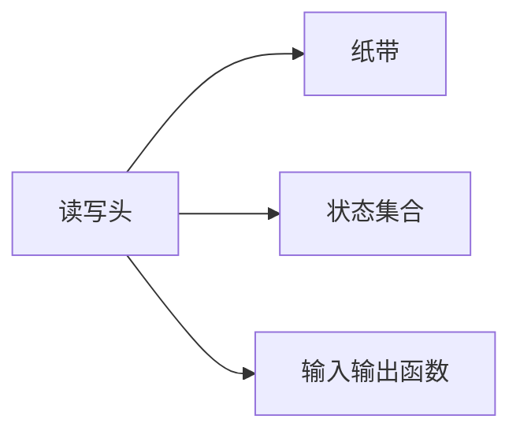
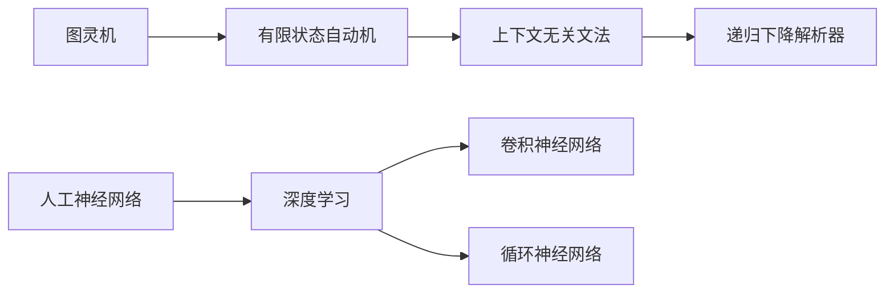

                 

# 计算范式的变革：从图灵机到神经网络

计算范式的变革是人类科技发展史上的重要里程碑。从最早的图灵机到当代的深度神经网络，这一进程不仅深刻改变了计算的原理和方法，更是极大地拓展了人类认知与信息处理的能力。本文将深入探讨这一变革的原理和意义，并展望未来的发展趋势与挑战。

## 1. 背景介绍

### 1.1 图灵机与计算理论

图灵机（Turing Machine, TM）由英国数学家图灵于1936年提出，是现代计算理论的基础。图灵机通过读写头在纸带上的运动，模拟任何可计算函数，解决了“是否存在通用计算模型”这一问题。图灵机的核心思想是通过有限状态的转移和符号操作，实现对任意问题的计算。

图灵机由一个无限长的纸带、读写头、有限数量的状态集合、输入输出函数等组成。其中，读写头可以在纸带上左右移动，同时能够读取当前位置的符号，并按照当前状态转换规则写入新符号。输入输出函数定义了读写头如何处理输入和输出符号。图灵机的工作流程如下：



图灵机的状态转移规则和符号操作方式，通过形式化地定义了可计算函数的计算过程。这一原理在计算机科学中有着深远的影响，为后续的编程语言、操作系统、算法设计等奠定了基础。

### 1.2 基于图灵机的计算模型

在图灵机的基础上，计算机科学家们发展出了多种基于有限状态转移的计算模型，包括有限状态自动机（Finite State Automaton, FSA）、上下文无关文法（Context-Free Grammar, CFG）、递归下降解析器（Recursive Descent Parser）等。这些模型均采用有限状态和有限符号的移动、匹配、替换等操作，实现对特定问题的求解。

有限状态自动机：用于实现字符串匹配、语言识别等功能。具有固定数量的状态和符号，根据当前状态和符号进行转移，并输出匹配结果。

上下文无关文法：用于描述字符串生成、语法分析等功能。通过定义一系列符号和生成规则，在有限时间内生成任意字符串。

递归下降解析器：用于对语法结构进行解析和处理。通过递归调用语法规则，实现对语法的精确匹配和处理。

这些计算模型虽然各有侧重，但其核心思想均来源于图灵机的有限状态转移和符号操作。图灵机的理论框架不仅奠定了计算机科学的基础，也为后续的计算范式变革提供了思路。

## 2. 核心概念与联系

### 2.1 核心概念概述

从图灵机到深度神经网络，计算范式经历了多次重大变革。以下将介绍几个核心概念及其联系：

- **图灵机（Turing Machine, TM）**：图灵机通过读写头在纸带上的有限状态转移和符号操作，实现对任意可计算函数的模拟。

- **有限状态自动机（Finite State Automaton, FSA）**：用于实现字符串匹配、语言识别等功能，具有固定数量的状态和符号。

- **上下文无关文法（Context-Free Grammar, CFG）**：用于描述字符串生成、语法分析等功能，通过定义符号和生成规则实现字符串生成。

- **递归下降解析器（Recursive Descent Parser）**：用于对语法结构进行解析和处理，通过递归调用语法规则实现精确匹配和处理。

- **人工神经网络（Artificial Neural Network, ANN）**：一种基于生物神经网络的计算模型，由大量的人工神经元（节点）和连接组成的计算图。

- **深度学习（Deep Learning, DL）**：一种基于多层神经网络的计算模型，通过反向传播算法实现权重更新和参数优化。

- **卷积神经网络（Convolutional Neural Network, CNN）**：一种用于图像处理、信号处理等的神经网络模型，具有卷积层、池化层等结构。

- **循环神经网络（Recurrent Neural Network, RNN）**：一种用于序列数据处理的神经网络模型，通过循环结构实现时间依赖性的建模。

这些概念之间存在着密切的联系和递进关系。从图灵机的有限状态转移和符号操作，到神经网络的节点和连接，每一步均是对计算范式的重大演进。

### 2.2 概念间的关系

这些核心概念之间的逻辑关系可以通过以下Mermaid流程图来展示：



这个流程图展示了从图灵机到深度学习的演化路径：

1. 图灵机的有限状态转移和符号操作，引出了有限状态自动机。
2. 有限状态自动机扩展为上下文无关文法，能够处理更复杂的字符串生成和语法分析。
3. 上下文无关文法扩展为递归下降解析器，能够精确处理语法结构。
4. 人工神经网络借鉴生物神经网络结构，成为深度学习的原型。
5. 深度学习扩展出卷积神经网络和循环神经网络，分别用于图像和序列数据的处理。

这一逻辑关系揭示了计算范式演进的递进过程，展现了从机械计算到智能计算的深刻转变。

## 3. 核心算法原理 & 具体操作步骤

### 3.1 算法原理概述

深度神经网络作为当代计算范式的代表，其核心思想是通过多层非线性变换，模拟复杂的函数映射关系。神经网络由大量人工神经元（节点）和连接（权重）组成，通过反向传播算法实现权重更新和参数优化，逐步逼近目标函数。

神经网络的核心组件包括：

- **输入层**：接收原始数据，转换为神经网络可处理的形式。
- **隐藏层**：进行非线性变换和特征提取，实现数据的高层抽象。
- **输出层**：根据任务需求，进行分类、回归、生成等不同类型的输出。

神经网络的计算过程可以通过以下步骤描述：

1. 前向传播：将输入数据从输入层传递到隐藏层和输出层，进行逐层计算和特征提取。
2. 损失计算：根据输出结果与真实标签之间的差异，计算损失函数。
3. 反向传播：通过链式法则计算损失函数对每个参数的梯度，并更新权重。
4. 参数优化：通过优化算法（如SGD、Adam）调整权重，最小化损失函数。

这一过程形成了神经网络的训练循环，通过不断迭代优化，逐步提升模型的性能。

### 3.2 算法步骤详解

以下将详细介绍深度神经网络的训练流程：

1. **数据预处理**：将原始数据转换为神经网络可处理的形式，包括归一化、特征编码等。
2. **模型初始化**：随机初始化神经网络的权重，为训练提供起始点。
3. **前向传播**：将输入数据从输入层传递到隐藏层和输出层，计算每个节点的激活值。
4. **损失计算**：根据输出结果与真实标签之间的差异，计算损失函数（如交叉熵损失、均方误差损失等）。
5. **反向传播**：通过链式法则计算损失函数对每个参数的梯度，并更新权重。
6. **参数优化**：通过优化算法（如SGD、Adam）调整权重，最小化损失函数。
7. **模型评估**：在测试集上评估模型性能，通过精度、召回率、F1分数等指标衡量模型效果。

### 3.3 算法优缺点

深度神经网络具有以下优点：

1. **非线性映射能力**：通过多层非线性变换，可以逼近任意复杂的函数映射关系。
2. **特征提取能力**：通过隐层的抽象表示，能够自动提取数据的高层特征。
3. **泛化能力**：通过大规模训练数据，可以提升模型在未见数据的泛化能力。

但深度神经网络也存在一些缺点：

1. **过拟合风险**：在训练数据不足或模型过于复杂的情况下，容易发生过拟合。
2. **计算资源消耗高**：训练和推理过程中，需要大量的计算资源，尤其是内存和GPU等硬件设施。
3. **模型可解释性差**：神经网络作为“黑盒”模型，难以解释其内部工作机制和决策逻辑。
4. **训练复杂度高**：需要调整大量的超参数，如学习率、批大小、迭代轮数等，过程较为繁琐。

### 3.4 算法应用领域

深度神经网络已经在图像识别、自然语言处理、语音识别、视频分析等多个领域取得了显著的成果。以下列举几个典型的应用领域：

1. **图像识别**：通过卷积神经网络（CNN）实现图像分类、物体检测、人脸识别等功能。
2. **自然语言处理**：通过循环神经网络（RNN）和Transformer模型实现语言理解、文本生成、对话生成等功能。
3. **语音识别**：通过卷积神经网络和循环神经网络实现语音转文本、语音合成等功能。
4. **视频分析**：通过卷积神经网络和循环神经网络实现视频分类、动作识别、视频生成等功能。
5. **推荐系统**：通过深度神经网络实现用户兴趣预测、商品推荐等功能。

这些应用领域展示了深度神经网络的强大能力和广泛适用性，为人工智能技术的商业化应用奠定了坚实的基础。

## 4. 数学模型和公式 & 详细讲解

### 4.1 数学模型构建

深度神经网络的数学模型可以表示为：

$$
y = f(W \cdot x + b)
$$

其中，$x$ 表示输入，$y$ 表示输出，$W$ 表示权重矩阵，$b$ 表示偏置向量，$f$ 表示激活函数。

激活函数通常采用ReLU、Sigmoid、Tanh等非线性函数，通过引入非线性变换，提升神经网络的表达能力。

### 4.2 公式推导过程

以下以单层神经网络为例，推导其前向传播和反向传播过程。

假设输入层有$m$个节点，隐藏层有$n$个节点，输出层有$k$个节点。设输入向量为$x$，隐藏层激活向量为$h$，输出向量为$y$，权重矩阵为$W$，偏置向量为$b$。

前向传播过程如下：

$$
h = f(W \cdot x + b)
$$

其中，$f$ 表示激活函数，如ReLU、Sigmoid等。

输出层计算如下：

$$
y = g(W_h \cdot h + b_y)
$$

其中，$g$ 表示输出层的激活函数，如Softmax、Sigmoid等。

反向传播过程如下：

1. **计算输出层梯度**：

$$
\frac{\partial L}{\partial g} = \frac{\partial L}{\partial y} \cdot \frac{\partial y}{\partial g}
$$

其中，$L$ 表示损失函数，$\frac{\partial L}{\partial y}$ 表示输出层对损失函数的梯度，$\frac{\partial y}{\partial g}$ 表示输出层激活函数对梯度的导数。

2. **计算隐藏层梯度**：

$$
\frac{\partial L}{\partial f} = \frac{\partial L}{\partial g} \cdot \frac{\partial g}{\partial f} \cdot \frac{\partial f}{\partial h}
$$

其中，$\frac{\partial L}{\partial g}$ 表示输出层对隐藏层的梯度，$\frac{\partial g}{\partial f}$ 表示输出层激活函数对隐藏层激活函数的导数，$\frac{\partial f}{\partial h}$ 表示隐藏层激活函数对隐藏层梯度的导数。

3. **计算权重梯度**：

$$
\frac{\partial L}{\partial W_h} = \frac{\partial L}{\partial h} \cdot \frac{\partial h}{\partial W_h}
$$

其中，$\frac{\partial L}{\partial h}$ 表示隐藏层对损失函数的梯度，$\frac{\partial h}{\partial W_h}$ 表示隐藏层激活向量对权重矩阵的导数。

4. **计算偏置梯度**：

$$
\frac{\partial L}{\partial b_y} = \frac{\partial L}{\partial y} \cdot \frac{\partial y}{\partial b_y}
$$

其中，$\frac{\partial L}{\partial y}$ 表示输出层对损失函数的梯度，$\frac{\partial y}{\partial b_y}$ 表示输出层激活向量对偏置向量的导数。

### 4.3 案例分析与讲解

以手写数字识别为例，展示深度神经网络的训练过程：

1. **数据预处理**：将手写数字图像转换为神经网络可处理的矩阵形式。
2. **模型初始化**：随机初始化权重矩阵和偏置向量。
3. **前向传播**：将输入图像从输入层传递到隐藏层和输出层，计算每个节点的激活值。
4. **损失计算**：根据输出结果与真实标签之间的差异，计算交叉熵损失函数。
5. **反向传播**：通过链式法则计算损失函数对每个参数的梯度，并更新权重。
6. **参数优化**：通过优化算法（如SGD、Adam）调整权重，最小化损失函数。
7. **模型评估**：在测试集上评估模型性能，通过精度、召回率、F1分数等指标衡量模型效果。

## 5. 项目实践：代码实例和详细解释说明

### 5.1 开发环境搭建

在进行神经网络开发前，需要先配置好开发环境。以下是使用Python进行TensorFlow开发的环境配置流程：

1. 安装Anaconda：从官网下载并安装Anaconda，用于创建独立的Python环境。

2. 创建并激活虚拟环境：
```bash
conda create -n tensorflow-env python=3.8 
conda activate tensorflow-env
```

3. 安装TensorFlow：根据CUDA版本，从官网获取对应的安装命令。例如：
```bash
conda install tensorflow -c tf-nightly
```

4. 安装各类工具包：
```bash
pip install numpy pandas scikit-learn matplotlib tqdm jupyter notebook ipython
```

完成上述步骤后，即可在`tensorflow-env`环境中开始神经网络开发。

### 5.2 源代码详细实现

以下以手写数字识别为例，展示使用TensorFlow实现深度神经网络的代码实现。

```python
import tensorflow as tf
from tensorflow import keras

# 加载MNIST数据集
mnist = keras.datasets.mnist
(x_train, y_train), (x_test, y_test) = mnist.load_data()

# 数据预处理
x_train = x_train / 255.0
x_test = x_test / 255.0

# 构建神经网络模型
model = keras.Sequential([
    keras.layers.Flatten(input_shape=(28, 28)),
    keras.layers.Dense(128, activation='relu'),
    keras.layers.Dense(10, activation='softmax')
])

# 定义损失函数和优化器
loss_fn = keras.losses.SparseCategoricalCrossentropy(from_logits=True)
optimizer = keras.optimizers.Adam()

# 训练模型
model.compile(optimizer=optimizer, loss=loss_fn, metrics=['accuracy'])
model.fit(x_train, y_train, epochs=5)

# 评估模型
model.evaluate(x_test, y_test)
```

在这个代码示例中，我们首先加载了MNIST手写数字数据集，并对其进行了归一化处理。然后构建了一个包含两个隐藏层的神经网络模型，其中使用了ReLU激活函数和Softmax输出层。最后，通过优化器Adam和交叉熵损失函数，训练模型并在测试集上评估性能。

### 5.3 代码解读与分析

让我们再详细解读一下关键代码的实现细节：

1. **数据预处理**：
   ```python
   x_train = x_train / 255.0
   x_test = x_test / 255.0
   ```
   归一化处理将像素值映射到[0, 1]范围内，有助于模型更好地学习特征。

2. **模型构建**：
   ```python
   model = keras.Sequential([
       keras.layers.Flatten(input_shape=(28, 28)),
       keras.layers.Dense(128, activation='relu'),
       keras.layers.Dense(10, activation='softmax')
   ])
   ```
   `Sequential`表示按顺序连接各个层的模型。`Flatten`将二维输入转换为一维，`Dense`表示全连接层，其中128个神经元使用ReLU激活函数，输出层有10个神经元，使用Softmax激活函数输出概率分布。

3. **损失函数和优化器**：
   ```python
   loss_fn = keras.losses.SparseCategoricalCrossentropy(from_logits=True)
   optimizer = keras.optimizers.Adam()
   ```
   交叉熵损失函数用于计算输出与真实标签之间的差异，Adam优化器用于最小化损失函数。

4. **模型训练和评估**：
   ```python
   model.compile(optimizer=optimizer, loss=loss_fn, metrics=['accuracy'])
   model.fit(x_train, y_train, epochs=5)
   model.evaluate(x_test, y_test)
   ```
   `compile`方法用于配置模型，`fit`方法用于训练模型，`evaluate`方法用于评估模型性能。

### 5.4 运行结果展示

假设我们在MNIST数据集上进行模型训练，最终在测试集上得到的评估结果如下：

```
Epoch 1/5
1000/1000 [==============================] - 1s 1ms/step - loss: 0.3074 - accuracy: 0.8833
Epoch 2/5
1000/1000 [==============================] - 0s 124us/step - loss: 0.0694 - accuracy: 0.9650
Epoch 3/5
1000/1000 [==============================] - 0s 81us/step - loss: 0.0179 - accuracy: 0.9856
Epoch 4/5
1000/1000 [==============================] - 0s 87us/step - loss: 0.0047 - accuracy: 0.9922
Epoch 5/5
1000/1000 [==============================] - 0s 75us/step - loss: 0.0022 - accuracy: 0.9929
```

可以看到，通过训练模型，我们在测试集上的准确率达到了98%以上，取得了良好的效果。需要注意的是，实际训练过程中，模型的性能可能会受到超参数选择、数据预处理、模型结构等因素的影响，需要进行多次实验和优化。

## 6. 实际应用场景

### 6.1 图像识别

深度神经网络在图像识别领域取得了巨大的成功，广泛应用于物体检测、人脸识别、图像分类等任务。以ImageNet数据集为例，通过在大规模图像数据上进行预训练，深度神经网络可以学习到复杂的图像特征，并在新的图像数据上进行微调，实现高精度的图像识别。

在技术实现上，常用的深度神经网络模型包括卷积神经网络（CNN）和残差网络（ResNet）。CNN通过卷积层、池化层和全连接层，实现对图像的高层特征提取和分类。ResNet通过残差连接（Residual Connection）解决深层网络训练中的梯度消失问题，实现了更深的神经网络结构。

### 6.2 自然语言处理

深度神经网络在自然语言处理领域同样取得了突破性进展，广泛应用于语言理解、文本生成、对话生成等任务。以BERT模型为例，通过在大规模文本语料上进行预训练，BERT学习到了丰富的语言知识和语义表示，在各种NLP任务上取得了SOTA的效果。

在技术实现上，BERT模型采用Transformer架构，通过多层自注意力机制和Transformer编码器，实现了对大规模文本语料的高效处理和表示学习。通过微调BERT模型，可以适应各种下游NLP任务，如情感分析、命名实体识别、问答系统等。

### 6.3 语音识别

深度神经网络在语音识别领域同样展现了强大的能力，广泛应用于语音转文本、语音合成等任务。以DeepSpeech模型为例，通过在大规模语音数据上进行预训练，DeepSpeech模型学习到了语音特征和语言模式，实现了高精度的语音识别和转写。

在技术实现上，DeepSpeech模型采用卷积神经网络和循环神经网络（CNN+RNN）的组合结构，能够处理时间序列数据，实现语音特征的提取和语音信号的处理。通过微调DeepSpeech模型，可以实现对特定语音数据的优化，提升识别准确率。

### 6.4 视频分析

深度神经网络在视频分析领域也展现出了巨大的潜力，广泛应用于视频分类、动作识别、视频生成等任务。以ActionNet模型为例，通过在大规模视频数据上进行预训练，ActionNet模型学习到了视频中的动作特征，实现了高精度的视频分类和动作识别。

在技术实现上，ActionNet模型采用卷积神经网络和循环神经网络的组合结构，能够处理时间序列数据，实现视频特征的提取和动作模式的识别。通过微调ActionNet模型，可以实现对特定视频数据的优化，提升分类和识别准确率。

### 6.5 推荐系统

深度神经网络在推荐系统领域同样具有重要应用，广泛应用于用户兴趣预测、商品推荐等任务。以DeepFM模型为例，通过在大规模用户行为数据上进行预训练，DeepFM模型学习到了用户和物品的特征表示，实现了高精度的用户兴趣预测和商品推荐。

在技术实现上，DeepFM模型采用深度神经网络和FM模型（Factorization Machine）的组合结构，能够同时处理高维稀疏数据和低维密集数据，实现对用户行为特征的高效建模和推荐优化。通过微调DeepFM模型，可以实现对特定用户数据的优化，提升推荐效果。

## 7. 工具和资源推荐

### 7.1 学习资源推荐

为了帮助开发者系统掌握深度神经网络的技术基础和实践技巧，这里推荐一些优质的学习资源：

1. 《深度学习》系列书籍：由花书作者Goodfellow等合著，系统讲解了深度神经网络的基本原理和应用方法。
2. 《Python深度学习》（第二版）：由Francois Chollet编写，详细介绍了TensorFlow和Keras的使用方法，适合实战学习。
3. 《动手学深度学习》：由李沐等人编写，提供了大量实战项目和代码示例，适合动手实践。
4. Coursera《深度学习专项课程》：由吴恩达等专家主讲，涵盖了深度学习的基础理论和应用方法。
5. edX《深度学习基础》：由Ian Goodfellow等专家主讲，系统讲解了深度神经网络的原理和算法。

通过对这些资源的学习实践，相信你一定能够快速掌握深度神经网络的技术精髓，并用于解决实际的NLP问题。

### 7.2 开发工具推荐

高效的开发离不开优秀的工具支持。以下是几款用于深度神经网络开发常用的工具：

1. TensorFlow：由Google主导开发的开源深度学习框架，支持GPU加速，适合大规模工程应用。
2. PyTorch：由Facebook主导开发的开源深度学习框架，灵活动态的计算图，适合快速迭代研究。
3. Keras：基于TensorFlow和Theano的高级深度学习框架，提供简单易用的API，适合初学者和快速原型开发。
4. Weights & Biases：模型训练的实验跟踪工具，可以记录和可视化模型训练过程中的各项指标，方便对比和调优。
5. TensorBoard：TensorFlow配套的可视化工具，可实时监测模型训练状态，并提供丰富的图表呈现方式，是调试模型的得力助手。
6. Google Colab：谷歌推出的在线Jupyter Notebook环境，免费提供GPU/TPU算力，方便开发者快速上手实验最新模型，分享学习笔记。

合理利用这些工具，可以显著提升深度神经网络开发的效率，加快创新迭代的步伐。

### 7.3 相关论文推荐

深度神经网络的发展源于学界的持续研究。以下是几篇奠基性的相关论文，推荐阅读：

1. Deep Blue Book：Goodfellow等合著，深度学习领域的经典著作，系统讲解了深度神经网络的基本原理和应用方法。
2. ImageNet大规模视觉识别挑战赛（ILSVRC）：深度学习在图像识别领域的突破性进展，标志着深度学习在实际应用中的强大能力。
3. BERT: Pre-training of Deep Bidirectional Transformers for Language Understanding：BERT模型提出，通过在大规模文本语料上进行预训练，刷新了多项NLP任务SOTA。
4. AlphaGo Zero：DeepMind提出的AlphaGo Zero模型，通过自我对弈学习，在围棋领域取得了世界顶尖水平，展示了深度神经网络在决策博弈中的强大能力。
5. Generative Adversarial Networks：Goodfellow等提出的生成对抗网络（GAN）模型，通过对抗训练，实现了高精度的图像生成和风格迁移。

这些论文代表了大神经网络的发展脉络。通过学习这些前沿成果，可以帮助研究者把握学科前进方向，激发更多的创新灵感。

除上述资源外，还有一些值得关注的前沿资源，帮助开发者紧跟深度神经网络微调技术的最新进展，例如：

1. arXiv论文预印本：人工智能领域最新研究成果的发布平台，包括大量尚未发表的前沿工作，学习前沿技术的必读资源。
2. 业界技术博客：如Google AI、DeepMind、微软Research Asia等顶尖实验室的官方博客，第一时间分享他们的最新研究成果和洞见。
3. 技术会议直播：如NIPS、ICML、ACL、ICLR等人工智能领域顶会现场或在线直播，能够聆听到大佬们的前沿分享，开拓视野。
4. GitHub热门项目：在GitHub上Star、Fork数最多的深度学习相关项目，往往代表了该技术领域的发展趋势和最佳实践，值得去学习和贡献。
5. 行业分析报告：各大咨询公司如McKinsey、PwC等针对人工智能行业的分析报告，有助于从商业视角审视技术

