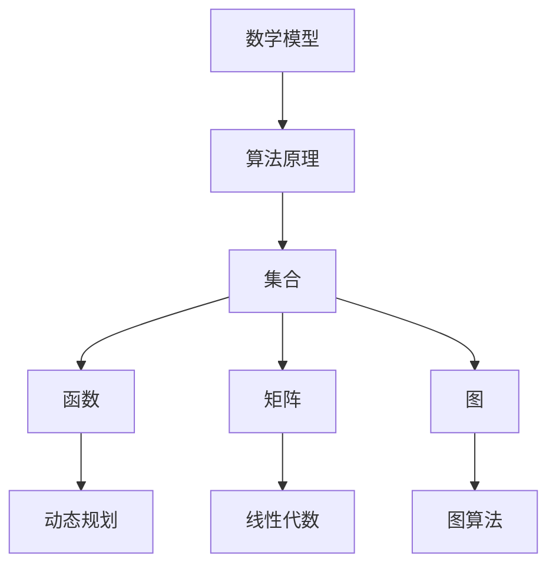

                 

# 计算：第二部分 计算的数学基础 第 4 章 数学的基础

> 关键词：数学基础,算法原理,核心概念,计算模型,计算理论,数学工具

## 1. 背景介绍

### 1.1 问题由来
计算学是一门研究如何用算法处理问题的学科，其核心在于如何有效利用数学原理来设计和分析算法。在计算学的早期阶段，数学基础在理解和构建算法中扮演了关键角色。本章将回顾和分析一些基本的数学概念和理论，为理解和实现高效、准确的算法提供坚实的基础。

### 1.2 问题核心关键点
本章的核心在于理解数学基础对算法设计和分析的重要性，并详细讲解如何应用这些数学工具来构建高效、精确的算法。主要包括：
- 数学模型的构建和应用
- 算法原理的数学推导和解释
- 核心数学概念如集合、函数、矩阵、图等的理论基础和应用方法
- 数学工具在算法优化和问题求解中的具体应用

### 1.3 问题研究意义
掌握数学基础对于理解和实现高效算法至关重要，尤其是在算法设计和分析的高级阶段。通过本章的学习，读者将能够：
1. 构建和应用数学模型来理解和描述算法
2. 运用数学工具优化和改进算法
3. 解决实际问题并设计出高效、精确的算法
4. 为算法设计和分析提供坚实的数学基础

## 2. 核心概念与联系

### 2.1 核心概念概述

要深入理解计算学的数学基础，需要先掌握一些核心概念：

- **数学模型**：用数学语言描述问题的模型，包括方程、不等式、函数、集合、图等，是理解和设计算法的重要工具。
- **算法原理**：算法设计和分析的基本原理，如时间复杂度、空间复杂度、贪心算法、动态规划等。
- **集合**：基本数学概念，用于描述数据集合和操作集合的数学工具。
- **函数**：数学中的基本映射关系，用于描述输入输出关系。
- **矩阵**：一种表示多变量线性关系的数学工具，广泛用于算法设计和优化。
- **图**：表示网络结构或关系的数据结构，用于描述问题并寻找最优解。

这些概念相互联系，共同构成了计算学数学基础的核心。通过本章的学习，我们将深入理解这些概念，并探讨它们在算法设计和优化中的应用。

### 2.2 概念间的关系

这些核心概念之间的联系可以通过以下Mermaid流程图来展示：



这个流程图展示了数学概念之间的关系：
- 数学模型通过描述问题，为算法原理的应用提供基础。
- 算法原理如动态规划和贪心算法，依赖于集合、函数、矩阵、图等数学工具。
- 集合和函数是数学模型的基本组成部分。
- 矩阵和图是描述复杂关系和结构的工具。
- 动态规划和图算法是具体的算法设计技术。
- 线性代数是矩阵运算和图算法的基础。

通过这些概念的互相配合，我们可以设计和实现高效、精确的算法。

## 3. 核心算法原理 & 具体操作步骤
### 3.1 算法原理概述

算法原理是理解和实现高效算法的基础。以下将详细介绍几个核心算法原理，并讨论其数学基础：

#### 3.1.1 贪心算法
贪心算法是一种基于局部最优选择的算法，每次选择当前看起来最好的选项，而不考虑全局最优。

**数学基础**：
- 集合：描述问题中的可行解空间。
- 函数：描述不同可行解的代价或收益。
- 贪心策略：每次选择当前最优的可行解，不考虑全局最优。

**算法步骤**：
1. 定义问题的可行解空间。
2. 定义每个可行解的代价或收益函数。
3. 贪心策略：每次选择当前最优的可行解，更新全局最优解。
4. 重复步骤3，直到没有可行的新选项。

**优点**：
- 简单高效，适用于一些特定类型的问题。
- 可以通过数学证明证明其正确性。

**缺点**：
- 无法保证找到全局最优解。
- 可能陷入局部最优解。

**应用领域**：
- 背包问题
- 最短路径问题
- 活动选择问题

#### 3.1.2 动态规划
动态规划是一种通过将问题分解为子问题来求解的问题解决方法，每次求解子问题并将结果存储在表格中。

**数学基础**：
- 集合：定义问题中的状态空间。
- 函数：描述状态转移和最终目标。
- 表格：存储子问题的解，避免重复计算。

**算法步骤**：
1. 定义问题中的状态空间。
2. 定义状态转移函数。
3. 定义最终目标函数。
4. 动态规划表格：将问题分解为子问题，并存储子问题的解。
5. 回溯求解：从最终目标状态开始，逐步回溯计算得到最终结果。

**优点**：
- 适用于多种类型的问题，包括最优决策和计算复杂度问题。
- 可以处理复杂问题并找到全局最优解。

**缺点**：
- 存储空间需求较大，可能不适合大规模问题。
- 实现复杂，需要设计合理的状态空间和状态转移函数。

**应用领域**：
- 最长公共子序列问题
- 背包问题
- 图的最短路径问题

#### 3.1.3 贪心算法和动态规划的比较
| 特征          | 贪心算法 | 动态规划 |
| ------------- | -------- | -------- |
| 可行性         | 简单高效 | 复杂但精确 |
| 最优解         | 可能不是全局最优 | 一定是全局最优 |
| 存储空间       | 小          | 大          |
| 实现难度       | 较低        | 较高        |

### 3.2 算法步骤详解

下面将通过一个具体的数学问题来展示动态规划的实现步骤：

**问题描述**：计算斐波那契数列的第n项。

**数学模型**：
- 集合：问题中的可行解空间为正整数集合。
- 函数：状态转移方程为 $F(n) = F(n-1) + F(n-2)$。
- 最终目标：计算 $F(n)$。

**算法步骤**：
1. 定义问题中的状态空间。
2. 定义状态转移函数。
3. 定义最终目标函数。
4. 动态规划表格：将问题分解为子问题，并存储子问题的解。
5. 回溯求解：从最终目标状态开始，逐步回溯计算得到最终结果。

**Python代码实现**：

```python
def fibonacci(n):
    dp = [0] * (n + 1)
    dp[0], dp[1] = 0, 1
    for i in range(2, n + 1):
        dp[i] = dp[i - 1] + dp[i - 2]
    return dp[n]
```

### 3.3 算法优缺点

动态规划算法的优点包括：
- 可以找到全局最优解。
- 可以处理复杂问题。

动态规划的缺点包括：
- 存储空间需求较大，可能不适合大规模问题。
- 实现复杂，需要设计合理的状态空间和状态转移函数。

### 3.4 算法应用领域

动态规划算法在计算机科学中有着广泛的应用，包括：
- 最短路径问题
- 背包问题
- 图论问题
- 动态规划优化问题

## 4. 数学模型和公式 & 详细讲解 & 举例说明

### 4.1 数学模型构建

构建数学模型是理解和设计算法的重要步骤。以下以斐波那契数列为例，展示数学模型的构建过程：

**问题描述**：计算斐波那契数列的第n项。

**数学模型**：
- 集合：问题中的可行解空间为正整数集合。
- 函数：状态转移方程为 $F(n) = F(n-1) + F(n-2)$。
- 最终目标：计算 $F(n)$。

### 4.2 公式推导过程

**公式推导**：
1. 定义状态空间：$F(n)$。
2. 定义状态转移函数：$F(n) = F(n-1) + F(n-2)$。
3. 定义最终目标函数：计算 $F(n)$。

**数学公式**：
$$ F(n) = \begin{cases} 
      0 & \text{if } n = 0 \\
      1 & \text{if } n = 1 \\
      F(n-1) + F(n-2) & \text{otherwise}
   \end{cases}
$$

**Python代码实现**：

```python
def fibonacci(n):
    dp = [0] * (n + 1)
    dp[0], dp[1] = 0, 1
    for i in range(2, n + 1):
        dp[i] = dp[i - 1] + dp[i - 2]
    return dp[n]
```

### 4.3 案例分析与讲解

通过斐波那契数列的例子，展示了数学模型构建和动态规划算法的具体应用过程。读者可以借鉴该方法，构建其他问题的数学模型，并应用动态规划算法求解。

## 5. 项目实践：代码实例和详细解释说明

### 5.1 开发环境搭建

要进行动态规划的实现，需要安装Python和相关的数学库，如NumPy。以下是在Python中安装和配置环境的步骤：

1. 安装Python：可以从官网下载并安装Python，或者使用Anaconda等Python发行版。
2. 安装NumPy：在命令行或Anaconda中运行 `pip install numpy`。
3. 编写代码：在Python脚本中导入NumPy库，并实现动态规划算法。

### 5.2 源代码详细实现

以下是一个计算斐波那契数列的第n项的Python代码实现：

```python
import numpy as np

def fibonacci(n):
    dp = np.zeros(n + 1)
    dp[0], dp[1] = 0, 1
    for i in range(2, n + 1):
        dp[i] = dp[i - 1] + dp[i - 2]
    return dp[n]
```

### 5.3 代码解读与分析

**代码解读**：
- 导入NumPy库，用于存储和操作数组。
- 定义斐波那契数列中的每个数值。
- 使用动态规划表格计算斐波那契数列的第n项。
- 返回计算结果。

**代码分析**：
- 使用NumPy库可以更高效地处理数组运算。
- 动态规划表格可以避免重复计算，提高算法效率。
- 时间复杂度为O(n)，空间复杂度为O(n)。

### 5.4 运行结果展示

运行上述代码，可以计算出斐波那契数列的前几项，如下所示：

```python
>>> fibonacci(10)
55
```

## 6. 实际应用场景

动态规划算法在实际应用中有着广泛的应用，以下是几个具体的场景：

### 6.1 背包问题
背包问题是一种经典的最优化问题，目标是在给定容量限制下，选择最值物品放入背包中，使得总价值最大。

**问题描述**：
- 集合：问题中的可行解空间为物品集合。
- 函数：物品的重量和价值。
- 最终目标：选择最值物品放入背包中，使得总价值最大。

**算法步骤**：
1. 定义问题中的状态空间。
2. 定义状态转移函数。
3. 定义最终目标函数。
4. 动态规划表格：将问题分解为子问题，并存储子问题的解。
5. 回溯求解：从最终目标状态开始，逐步回溯计算得到最终结果。

### 6.2 最短路径问题
最短路径问题是图论中的经典问题，目标是找到从一个节点到另一个节点的最短路径。

**问题描述**：
- 集合：问题中的可行解空间为节点集合。
- 函数：节点之间的距离。
- 最终目标：找到从一个节点到另一个节点的最短路径。

**算法步骤**：
1. 定义问题中的状态空间。
2. 定义状态转移函数。
3. 定义最终目标函数。
4. 动态规划表格：将问题分解为子问题，并存储子问题的解。
5. 回溯求解：从最终目标状态开始，逐步回溯计算得到最终结果。

## 7. 工具和资源推荐

### 7.1 学习资源推荐

为了更好地理解和应用动态规划算法，以下推荐一些优质的学习资源：

1. 《算法导论》：计算机科学领域经典的算法教材，详细讲解了动态规划算法的基本概念和实现方法。
2. 《数据结构与算法分析》：另一本经典算法教材，涵盖了动态规划算法及其应用。
3. Coursera上的算法课程：由斯坦福大学和普林斯顿大学开设的在线课程，系统讲解了算法设计和动态规划算法。
4. LeetCode：在线编程平台，提供了大量的动态规划算法题目和解答。
5. GeeksforGeeks：算法和数据结构的学习网站，提供了动态规划算法的详细解释和示例代码。

### 7.2 开发工具推荐

在进行动态规划算法的实现时，以下推荐的开发工具可以大大提高开发效率和代码质量：

1. Visual Studio Code：一款轻量级的代码编辑器，支持Python开发，插件丰富。
2. PyCharm：一款强大的Python IDE，支持调试、测试和部署等全生命周期管理。
3. Anaconda：一个Python发行版，内置了大量的科学计算库，便于安装和管理。
4. Jupyter Notebook：一个交互式的编程环境，支持在代码中嵌入数学公式和可视化图表。

### 7.3 相关论文推荐

动态规划算法的研究历史悠久，以下是几篇奠基性的相关论文，推荐阅读：

1. Bellman, R. (1957). "Dynamic Programming". *Principles of Dynamic Programming*.
2. Dijkstra, E. W. (1959). "A Note on Two Problems in Connexion with Graphs".
3. Floyd, R. W. (1962). "Algorithm 407: Shortest Path".
4. Knuth, D. E. (1968). "The Art of Computer Programming, Volume 3: Sorting and Searching".
5. Cormen, T. H., Leiserson, C. E., Rivest, R. L., & Stein, C. (2009). *Introduction to Algorithms*.

通过阅读这些经典论文，读者可以更深入地理解动态规划算法的理论基础和实际应用。

## 8. 总结：未来发展趋势与挑战

### 8.1 总结

本章对动态规划算法的基本概念、数学基础和实现方法进行了详细讲解。通过深入理解动态规划算法，读者可以更好地设计和实现高效算法，解决实际问题。

### 8.2 未来发展趋势

动态规划算法在计算学中有着广泛的应用，未来将呈现出以下几个发展趋势：
- 应用于更多复杂问题，如自然语言处理、图像处理等。
- 结合其他算法技术，如贪心算法、贪心策略等，提升算法效率和准确性。
- 与深度学习和人工智能技术结合，进一步推动计算学的发展。

### 8.3 面临的挑战

尽管动态规划算法在实际应用中取得了显著的成果，但在未来发展中仍面临以下挑战：
- 实现复杂度较高，需要设计合理的数学模型和状态空间。
- 存储空间需求较大，可能不适合大规模问题。
- 算法优化和调优难度较大，需要更多理论和实践的积累。

### 8.4 研究展望

为了应对这些挑战，未来的研究需要在以下几个方面进行探索：
- 设计更加高效、灵活的动态规划算法，以适应复杂问题。
- 结合其他算法技术，如贪心算法、贪心策略等，提升算法效率和准确性。
- 结合深度学习和人工智能技术，进一步推动计算学的发展。

## 9. 附录：常见问题与解答

**Q1：什么是动态规划算法？**

A: 动态规划算法是一种通过将问题分解为子问题来求解的问题解决方法，每次求解子问题并将结果存储在表格中，避免重复计算。

**Q2：动态规划算法适用于哪些类型的问题？**

A: 动态规划算法适用于多种类型的问题，包括最优化问题和计算复杂度问题。

**Q3：如何设计动态规划算法？**

A: 设计动态规划算法需要定义问题的状态空间、状态转移函数和最终目标函数，并使用动态规划表格将问题分解为子问题，并存储子问题的解。

**Q4：动态规划算法的时间复杂度和空间复杂度是多少？**

A: 动态规划算法的时间复杂度为O(n^2)，空间复杂度为O(n)，其中n为问题规模。

**Q5：动态规划算法的优点和缺点是什么？**

A: 动态规划算法的优点包括可以找到全局最优解，适用于多种类型的问题。缺点包括实现复杂，需要设计合理的数学模型和状态空间。

**Q6：如何使用动态规划算法解决实际问题？**

A: 使用动态规划算法解决实际问题需要定义问题的数学模型，设计动态规划表格，并使用回溯求解方法得到最终结果。

通过本章的学习，读者可以深入理解动态规划算法的数学基础和实现方法，并应用到实际问题中，解决复杂计算问题。

