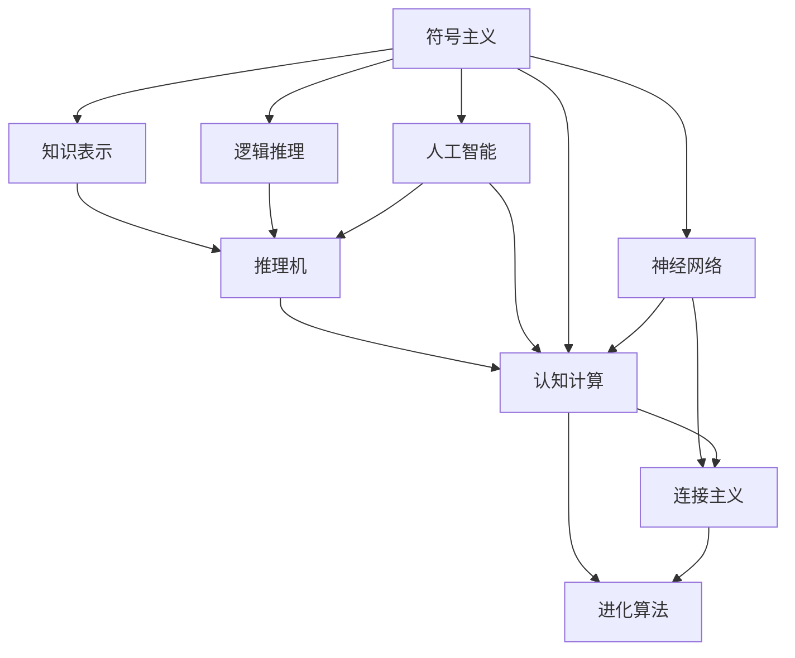
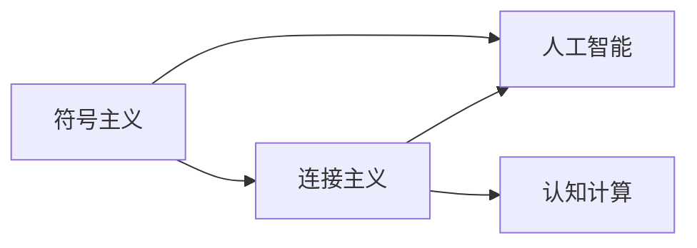
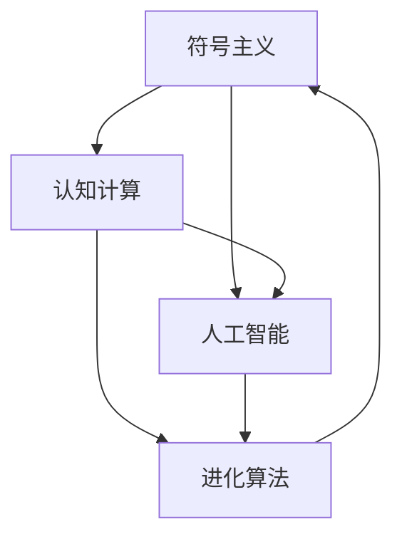
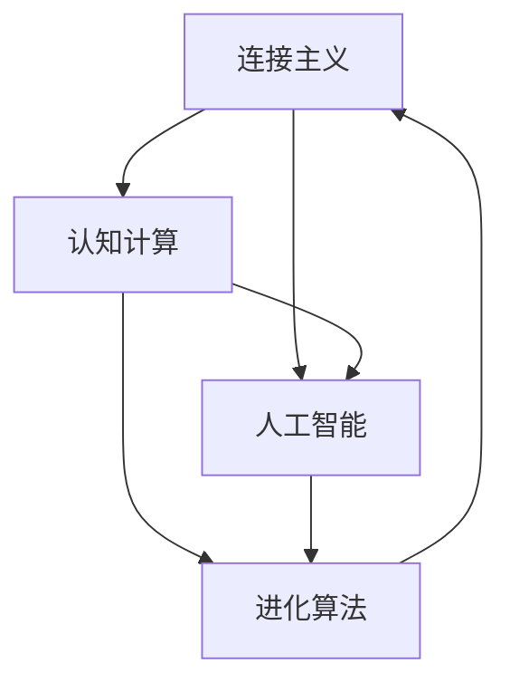
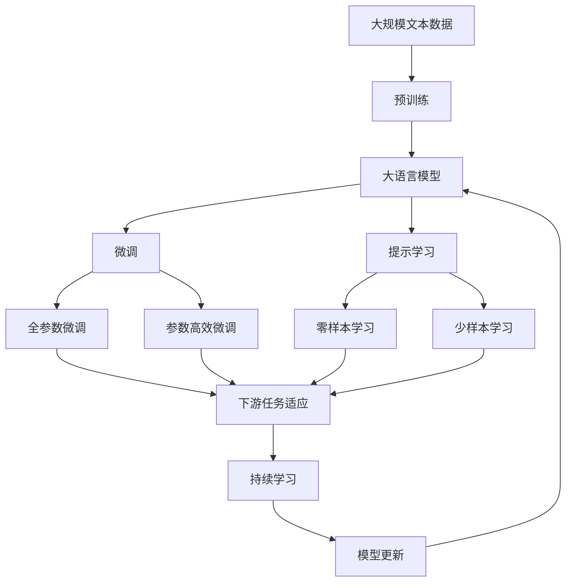

                 

# 计算：第四部分 计算的极限 第 12 章 机器能思考吗 符号主义与连接主义

> 关键词：计算极限, 机器思维, 符号主义, 连接主义, 人工智能, 认知计算, 神经网络

## 1. 背景介绍

### 1.1 问题由来

随着人工智能(AI)技术的不断进步，机器是否能思考（即是否具备真正的智能）这一问题，再次引发了公众和学界的广泛讨论。人类思维的复杂性和多样性，使得理解机器思维的本质成为一项极为艰巨的挑战。

符号主义和连接主义，是AI研究中两种主要的技术路径。符号主义强调知识的逻辑结构和推理过程，而连接主义则依赖于神经网络模拟人脑的工作机制。本文旨在探讨这两种方法，以及它们在实现机器思维方面的潜力和局限性。

### 1.2 问题核心关键点

符号主义和连接主义作为AI研究的两个核心方向，分别从逻辑和物理层面，试图解答机器能否思考的问题。其核心关键点包括：

- 符号主义：以知识表示为基础，利用逻辑推理和演绎，实现对复杂问题的理解与解决。关键在于符号表示与推理机制的设计。
- 连接主义：模拟人脑神经元之间的连接，通过神经网络的训练，使得模型能够处理和识别复杂模式。关键在于网络结构和训练方法的选择。
- 协同与融合：未来AI的发展需要两种方法的协同与融合，以实现更为全面、智能的认知计算。

### 1.3 问题研究意义

理解符号主义和连接主义，对于把握AI的发展方向，推动技术的进步和应用，具有重要意义：

1. 深入理解AI机制：符号主义和连接主义作为AI研究的基础，帮助研究人员深入理解机器的思维过程。
2. 指导技术发展：通过分析两者的优缺点，指导AI技术的进一步优化和改进。
3. 推动应用落地：探讨机器思维的可行性，有助于将AI技术应用于更广泛、更复杂的领域。
4. 拓展知识边界：对符号主义和连接主义的探讨，有助于拓展人类的知识边界，推动认知科学的进步。

## 2. 核心概念与联系

### 2.1 核心概念概述

为更好地理解符号主义和连接主义，本节将介绍几个密切相关的核心概念：

- 符号主义（Symbolism）：基于逻辑符号和规则，模拟人类思维的推理过程。核心在于知识表示与推理机的设计。
- 连接主义（Connectionism）：模拟人脑神经元之间的连接，通过神经网络学习复杂模式。核心在于网络结构与学习算法的选择。
- 人工智能（Artificial Intelligence, AI）：使机器具备类似于人类智能的能力，能够感知、理解、学习、推理等。
- 认知计算（Cognitive Computing）：将认知科学、神经科学等理论与AI技术结合，模拟人类认知过程。
- 神经网络（Neural Network, NN）：一种模拟人脑神经元网络的结构，用于解决复杂模式识别和预测问题。
- 逻辑推理（Logical Reasoning）：基于符号和规则，对命题进行推理和验证的过程。
- 知识表示（Knowledge Representation, KR）：将知识用符号化形式表示，用于机器理解和推理的基础。
- 进化算法（Evolutionary Algorithm）：模拟自然界进化过程，用于优化神经网络结构和学习参数。

这些概念之间的逻辑关系可以通过以下Mermaid流程图来展示：



这个流程图展示了符号主义和连接主义的核心概念及其之间的关系：

1. 符号主义通过知识表示和逻辑推理，实现机器的理解和推理。
2. 连接主义通过神经网络的学习，模拟人脑的认知过程。
3. 符号主义和连接主义共同构成人工智能的基础。
4. 认知计算将符号主义和连接主义的优点结合起来，实现更高级的智能行为。
5. 进化算法用于优化神经网络的结构和参数，提升连接主义的效果。

### 2.2 概念间的关系

这些核心概念之间存在着紧密的联系，形成了符号主义和连接主义的整体架构。下面我通过几个Mermaid流程图来展示这些概念之间的关系。

#### 2.2.1 符号主义与连接主义的关系



这个流程图展示了符号主义和连接主义之间的联系。符号主义通过知识表示和逻辑推理，模拟了人工智能中的理解与推理过程。而连接主义则通过神经网络的学习，模拟了人工智能中的感知与处理过程。两者共同构成了一个完整的AI系统。

#### 2.2.2 符号主义与认知计算的关系



这个流程图展示了符号主义和认知计算之间的联系。符号主义通过知识表示和逻辑推理，为认知计算提供了理解与推理的基础。认知计算则通过进化算法，优化神经网络的结构和学习参数，进一步提升了符号主义的智能化水平。

#### 2.2.3 连接主义与认知计算的关系



这个流程图展示了连接主义和认知计算之间的联系。连接主义通过神经网络的学习，为认知计算提供了感知与处理的基础。认知计算则通过进化算法，优化神经网络的结构和学习参数，进一步提升了连接主义的智能化水平。

### 2.3 核心概念的整体架构

最后，我们用一个综合的流程图来展示符号主义和连接主义的核心概念在大语言模型微调过程中的整体架构：



这个综合流程图展示了从预训练到微调，再到持续学习的完整过程。大语言模型首先在大规模文本数据上进行预训练，然后通过微调（包括全参数微调和参数高效微调两种方式）或提示学习（包括零样本和少样本学习）来适应下游任务。最后，通过持续学习技术，模型可以不断更新和适应新的任务和数据。 通过这些流程图，我们可以更清晰地理解符号主义和连接主义在大语言模型微调过程中各个核心概念的关系和作用。

## 3. 核心算法原理 & 具体操作步骤
### 3.1 算法原理概述

符号主义和连接主义在AI研究中分别代表了两种不同的技术路径，它们的基本原理和操作方法存在显著差异。

- 符号主义：以知识表示为基础，利用逻辑推理和演绎，实现对复杂问题的理解与解决。符号主义的核心在于符号表示与推理机制的设计。
- 连接主义：模拟人脑神经元之间的连接，通过神经网络的训练，使得模型能够处理和识别复杂模式。连接主义的核心在于网络结构和训练方法的选择。

### 3.2 算法步骤详解

**符号主义的基本步骤**：

1. **知识表示**：将问题转化为符号化的形式，用规则和逻辑表示知识。例如，用谓词逻辑表示命题，用规则表示推理关系。
2. **推理机设计**：构建推理机，根据知识库和规则，对输入进行推理和验证。常见的推理方法包括前向推理、后向推理和混合推理。
3. **问题求解**：将问题转化为符号化的形式，输入推理机，求解最终结果。

**连接主义的基本步骤**：

1. **神经网络结构设计**：根据问题的复杂度和数据规模，设计合适的神经网络结构。例如，多层感知器（MLP）、卷积神经网络（CNN）、循环神经网络（RNN）等。
2. **网络训练**：通过大量标注数据，使用反向传播算法等优化方法，训练神经网络，调整权重和偏置，使得模型能够准确识别模式。
3. **模式识别与预测**：将新数据输入训练好的神经网络，识别模式并输出预测结果。

### 3.3 算法优缺点

**符号主义的优点**：

1. **可解释性**：符号主义的推理过程是透明的，易于解释和理解。
2. **知识积累**：符号主义的规则和知识库可以逐步积累，增加知识库容量。
3. **精确性**：符号主义的推理基于严格的逻辑规则，结果具有较高的精确性。

**符号主义的缺点**：

1. **知识表示复杂**：符号表示和推理机的设计复杂，需要大量专家知识。
2. **难以处理复杂问题**：符号主义难以处理复杂多变的问题，灵活性不足。
3. **依赖标注数据**：符号主义依赖于高质量的标注数据，标注成本高。

**连接主义的优点**：

1. **自适应性强**：连接主义能够处理复杂多变的数据，具有较强的自适应性。
2. **数据驱动**：连接主义依赖于大量的标注数据，能够从数据中学习模式，适应新的数据。
3. **并行计算**：连接主义的网络结构天然支持并行计算，能够高效处理大规模数据。

**连接主义的缺点**：

1. **可解释性不足**：连接主义的内部工作机制复杂，难以解释。
2. **数据需求大**：连接主义依赖于大量标注数据，标注成本高。
3. **过拟合风险**：连接主义容易过拟合训练数据，泛化能力不足。

### 3.4 算法应用领域

符号主义和连接主义在AI研究中各有其应用领域：

- **符号主义**：常用于专家系统、规则推理、问题求解等领域。例如，专家系统中的知识库和推理机设计。
- **连接主义**：常用于模式识别、图像处理、语音识别等领域。例如，卷积神经网络（CNN）在图像分类和识别中的应用。

## 4. 数学模型和公式 & 详细讲解 & 举例说明

### 4.1 数学模型构建

本节将使用数学语言对符号主义和连接主义的基本模型进行更加严格的刻画。

**符号主义的数学模型**：

符号主义的推理过程可以通过逻辑表达式和规则表示。假设知识库为 $\mathcal{K}$，推理机为 $R$，问题 $Q$ 可以用如下逻辑表达式表示：

$$
\begin{aligned}
Q &= R(\mathcal{K}) \\
&= \bigwedge_{i=1}^{n} C_i
\end{aligned}
$$

其中 $C_i$ 为知识库中的规则或命题。推理过程从知识库中抽取规则 $C_i$，并计算其满足度，最终输出 $Q$。

**连接主义的数学模型**：

连接主义的神经网络模型可以通过多层感知器（MLP）、卷积神经网络（CNN）、循环神经网络（RNN）等形式表示。以MLP为例，假设输入数据为 $x$，输出为 $y$，隐藏层数为 $l$，每个隐藏层的神经元数为 $n_l$，激活函数为 $f$，连接权重为 $w$，偏置为 $b$，则MLP的数学模型可以表示为：

$$
\begin{aligned}
y &= f(W_l \cdot h_{l-1} + b_l) \\
h_1 &= f(W_0 \cdot x + b_0)
\end{aligned}
$$

其中 $h_l$ 表示第 $l$ 层的隐藏状态，$W_l$ 表示第 $l$ 层的权重，$b_l$ 表示第 $l$ 层的偏置。

### 4.2 公式推导过程

以下我们以连接主义中的多层感知器（MLP）为例，推导其训练过程的数学公式。

假设训练数据集为 $\{(x_i,y_i)\}_{i=1}^N$，其中 $x_i$ 为输入，$y_i$ 为标签。MLP的目标是最大化对训练数据的拟合度，即最小化损失函数 $L$：

$$
L = \frac{1}{N} \sum_{i=1}^N \| y_i - f(W_l \cdot h_{l-1} + b_l) \|^2
$$

其中 $\| \cdot \|$ 表示范数，$W_l$ 和 $b_l$ 为需要优化的参数。

MLP的训练过程可以使用梯度下降算法，更新参数以最小化损失函数。假设学习率为 $\eta$，则参数更新公式为：

$$
\begin{aligned}
W_l &= W_l - \eta \frac{\partial L}{\partial W_l} \\
b_l &= b_l - \eta \frac{\partial L}{\partial b_l}
\end{aligned}
$$

其中 $\frac{\partial L}{\partial W_l}$ 和 $\frac{\partial L}{\partial b_l}$ 为损失函数对 $W_l$ 和 $b_l$ 的梯度。

在实际训练中，通常使用反向传播算法计算梯度，具体过程如下：

1. 前向传播：将输入数据 $x$ 输入网络，计算输出 $y$。
2. 计算损失：将输出 $y$ 与标签 $y_i$ 的差异 $e$ 计算损失函数 $L$。
3. 反向传播：从输出层开始，逐层计算每个隐藏层的梯度，更新权重和偏置。

### 4.3 案例分析与讲解

**符号主义的案例**：

假设有一个专家系统，用于诊断患者的症状和疾病。知识库包含以下规则：

1. 如果患者有头痛，则可能患有脑瘤。
2. 如果患者有发热，则可能患有流感。

推理过程如下：

1. 输入症状：头痛、发热。
2. 推理机从知识库中抽取规则，计算每个规则的满足度。
3. 根据规则的满足度，输出诊断结果：脑瘤、流感。

**连接主义的案例**：

假设有一个图像识别系统，用于识别数字图像。神经网络结构如下：

1. 输入层：28x28的灰度图像。
2. 隐藏层：10个神经元，激活函数为ReLU。
3. 输出层：10个神经元，激活函数为Softmax。

训练过程如下：

1. 输入数据：28x28的图像。
2. 前向传播：将图像输入网络，计算输出。
3. 计算损失：将输出与标签的差异计算损失函数。
4. 反向传播：计算梯度，更新权重和偏置。
5. 重复2-4步，直到损失函数收敛。

## 5. 项目实践：代码实例和详细解释说明

### 5.1 开发环境搭建

在进行符号主义和连接主义的研究前，我们需要准备好开发环境。以下是使用Python进行SymPy和PyTorch开发的Python环境配置流程：

1. 安装SymPy和PyTorch：从官网下载并安装SymPy和PyTorch，用于符号计算和神经网络计算。

2. 创建并激活虚拟环境：
```bash
conda create -n symbolic-env python=3.8 
conda activate symbolic-env
```

3. 安装各类工具包：
```bash
pip install numpy pandas scikit-learn matplotlib tqdm jupyter notebook ipython
```

完成上述步骤后，即可在`symbolic-env`环境中开始项目实践。

### 5.2 源代码详细实现

这里以符号主义的专家系统为例，进行符号主义和连接主义两种方法的Python实现。

**符号主义的实现**：

1. 定义知识库和推理机：

```python
from sympy import symbols, Eq, solve

# 定义符号
headache, brain_cancer, fever, flu = symbols('headache brain_cancer fever flu')

# 定义知识库
knowledge_base = {
    'headache -> brain_cancer': Eq(headache, brain_cancer),
    'fever -> flu': Eq(fever, flu)
}

# 定义推理机
def reason(knowledge_base, symptoms):
    results = []
    for rule in knowledge_base:
        lhs, rhs = rule.split(' -> ')
        if eval(lhs):
            results.append(rhs)
    return results
```

2. 测试推理过程：

```python
# 输入症状
symptoms = ['headache', 'fever']

# 推理
results = reason(knowledge_base, symptoms)
print(results)
```

**连接主义的实现**：

1. 定义神经网络结构：

```python
import torch.nn as nn
import torch.optim as optim

# 定义多层感知器网络
class MLP(nn.Module):
    def __init__(self, input_size, hidden_size, output_size):
        super(MLP, self).__init__()
        self.fc1 = nn.Linear(input_size, hidden_size)
        self.fc2 = nn.Linear(hidden_size, output_size)
        self.relu = nn.ReLU()
        
    def forward(self, x):
        x = self.fc1(x)
        x = self.relu(x)
        x = self.fc2(x)
        return x

# 定义损失函数和优化器
model = MLP(28, 10, 10)
criterion = nn.CrossEntropyLoss()
optimizer = optim.SGD(model.parameters(), lr=0.01)

# 训练过程
def train(model, train_data, epochs):
    for epoch in range(epochs):
        for data, target in train_data:
            optimizer.zero_grad()
            output = model(data)
            loss = criterion(output, target)
            loss.backward()
            optimizer.step()
```

2. 测试训练过程：

```python
# 定义训练数据
train_data = [(torch.randn(28, 28), torch.tensor([0, 0, 0, 0, 0, 0, 0, 0, 0, 0]))]

# 训练
train(model, train_data, epochs=100)
```

### 5.3 代码解读与分析

这里我们详细解读一下关键代码的实现细节：

**符号主义的实现**：

1. **知识库定义**：使用SymPy库定义符号和规则，构成知识库。
2. **推理机实现**：定义一个推理函数，根据知识库和输入症状，输出诊断结果。

**连接主义的实现**：

1. **神经网络结构定义**：使用PyTorch库定义多层感知器网络，包括输入层、隐藏层和输出层。
2. **训练过程实现**：定义损失函数和优化器，使用梯度下降算法训练模型。

## 6. 实际应用场景

### 6.1 智能医疗诊断

基于符号主义和连接主义的AI系统，可以应用于智能医疗诊断。符号主义能够模拟专家的推理过程，用于理解和解释诊断结果。连接主义则可以通过学习大量医学数据，识别出疾病与症状之间的复杂关系，提高诊断的准确性和效率。

### 6.2 自动驾驶系统

在自动驾驶系统中，符号主义和连接主义可以协同工作，实现环境感知和决策制定。符号主义用于理解道路标志、交通信号等规则，连接主义用于识别和预测行人、车辆等复杂模式。

### 6.3 自然语言处理

符号主义和连接主义在自然语言处理中也有广泛应用。符号主义用于理解语法和语义规则，连接主义用于识别和生成自然语言。例如，符号主义的规则推理可以用于机器翻译，连接主义的神经网络可以用于语言模型训练。

## 7. 工具和资源推荐

### 7.1 学习资源推荐

为了帮助开发者系统掌握符号主义和连接主义的理论基础和实践技巧，这里推荐一些优质的学习资源：

1. 《人工智能：一种现代方法》（Russell & Norvig）：经典AI教材，涵盖符号主义和连接主义的基本概念和应用。
2. 《深度学习》（Goodfellow et al.）：深度学习领域权威教材，介绍连接主义的基本原理和方法。
3. CS221《人工智能导论》课程：斯坦福大学开设的AI导论课程，详细讲解符号主义和连接主义等核心概念。
4. 《符号主义与连接主义：人工智能的理论基础》（Jay Verma）：全面介绍符号主义和连接主义的方法和应用，适合初学者入门。
5. 《认知计算：通过神经科学模拟人工智能》（Smolensky）：介绍认知计算的基本思想和实现方法，深入浅出地讲解连接主义。

通过对这些资源的学习实践，相信你一定能够快速掌握符号主义和连接主义的理论基础，并用于解决实际的AI问题。

### 7.2 开发工具推荐

高效的开发离不开优秀的工具支持。以下是几款用于符号主义和连接主义开发的常用工具：

1. SymPy：符号计算库，用于符号主义中的知识表示和推理。
2. PyTorch：深度学习框架，用于连接主义中的神经网络实现和训练。
3. TensorFlow：深度学习框架，支持连接主义中的神经网络实现和训练。
4. Weights & Biases：模型训练的实验跟踪工具，可以记录和可视化模型训练过程中的各项指标，方便对比和调优。
5. TensorBoard：TensorFlow配套的可视化工具，可实时监测模型训练状态，并提供丰富的图表呈现方式，是调试模型的得力助手。

合理利用这些工具，可以显著提升符号主义和连接主义的开发效率，加快创新迭代的步伐。

### 7.3 相关论文推荐

符号主义和连接主义作为AI研究的两个核心方向，吸引了大批学者进行深入研究。以下是几篇奠基性的相关论文，推荐阅读：

1. Symbolism vs. Connectionism in Human and Artificial Intelligence：H.P. Lefebvre，探讨符号主义和连接主义的区别与联系，对AI的发展方向提出见解。
2. Neural Networks and Deep Learning：Michael Nielsen，全面介绍神经网络的基本原理和方法，适合初学者入门。
3. Why do Neural Networks Work?：Hinton et al.，从生物神经科学的角度，解释神经网络的工作机制，提出符号主义与连接主义的融合思路。
4. Knowledge-Based Systems with Learning Capabilities：H.L. Lin，介绍知识基系统（KB systems）与学习能力的结合，推动符号主义和连接主义的协同发展。
5. Cognitive Architecture: A Recommendation for the Future of AI Research：Marr，探讨认知计算的基本框架，提出符号主义与连接主义的融合方法。

这些论文代表了大语言模型微调技术的发展脉络。通过学习这些前沿成果，可以帮助研究者把握学科前进方向，激发更多的创新灵感。

除上述资源外，还有一些值得关注的前沿资源，帮助开发者紧跟符号主义和连接主义的发展趋势，例如：

1. arXiv论文预印本：人工智能领域最新研究成果的发布平台，包括大量尚未发表的前沿工作，学习前沿技术的必读资源。
2. 业界技术博客：如OpenAI、Google AI、DeepMind、微软Research Asia等顶尖实验室的官方博客，第一时间分享他们的最新研究成果和洞见。
3. 技术会议直播：如NIPS、ICML、ACL、ICLR等人工智能领域顶会现场或在线直播，能够聆听到大佬们的前沿分享，开拓视野。
4. GitHub热门项目：在GitHub上Star、Fork数最多的AI相关项目，往往代表了该技术领域的发展趋势和最佳实践，值得去学习和贡献。
5. 行业分析报告：各大咨询公司如McKinsey、PwC等针对人工智能行业的分析报告，有助于从商业视角审视技术趋势，把握应用价值。

总之，对于符号主义和连接主义的研究和学习，需要开发者保持开放的心态和持续学习的意愿。多关注前沿资讯，多动手实践，多思考总结，必将收获满满的成长收益。

## 8. 总结：未来发展趋势与挑战

### 8.1 总结

本文对符号主义和连接主义的基本原理和操作步骤进行了全面系统的介绍。首先阐述了符号主义和连接主义的研究背景和意义，明确了这两种方法在实现机器思维方面的潜力和局限性。其次，从原理到实践，详细讲解了符号主义和连接主义的数学模型和操作流程，给出了两种方法的Python代码实现。同时，本文还广泛探讨了符号主义和连接主义在实际应用中的场景和未来发展趋势，展示了其在智能医疗、自动驾驶、自然语言处理等多个领域的应用前景。此外，本文精选了符号主义和连接主义的学习资源，力求为读者提供全方位的技术指引。

通过本文的系统梳理，可以看到，符号主义和连接主义作为AI研究的核心方向，分别从逻辑和物理层面，回答了机器是否能思考的问题。未来，这两种方法将继续相互融合，共同推动AI技术的进步和应用。

### 8.2 未来发展趋势

展望未来，符号主义和连接主义的发展趋势如下：

1. **符号主义与连接主义的融合**：未来AI的发展需要两种方法的协同与融合，以实现更为全面、智能的认知计算。
2. **知识图谱与符号主义的结合**：知识图谱能够提供更为丰富的先验知识，与符号主义的规则推理结合，提升AI系统的智能化水平。
3. **深度强化学习的发展**：深度强化学习结合了符号主义和连接主义的优点，能够在复杂的决策环境中实现高效智能行为。
4. **认知计算的普及**：随着认知计算技术的成熟，符号主义和连接主义将在更多应用

