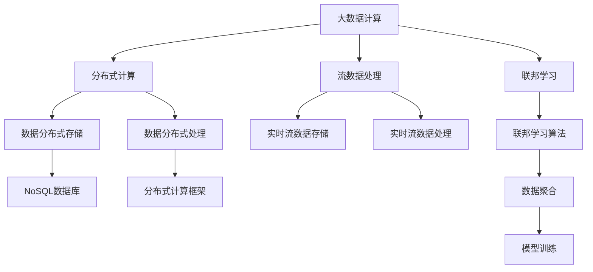
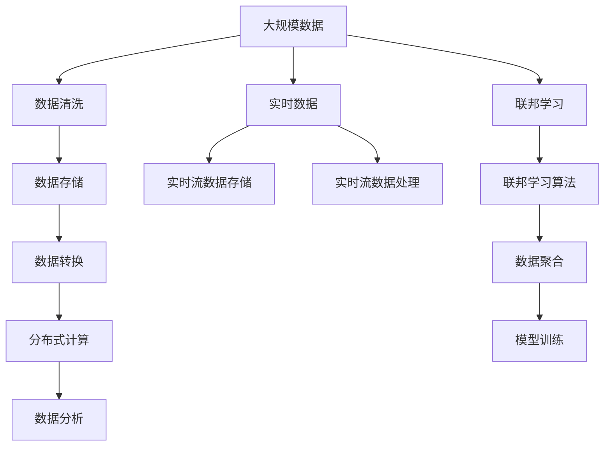

                 

# 【AI大数据计算原理与代码实例讲解】消费者组

## 1. 背景介绍

### 1.1 问题由来

近年来，随着数据规模的爆炸性增长，大数据计算成为各个行业必须面对的重大挑战。尤其在消费领域，数据量之大、类型之丰富、变化之频繁，使得传统的数据处理技术难以应对。如何高效地存储、处理和分析这些海量数据，挖掘出其中的价值，成为提升企业竞争力的关键。

### 1.2 问题核心关键点

消费者组在大数据计算领域的研究，主要集中在如何高效、准确地处理消费者数据，分析消费者行为，并利用这些信息来指导产品开发、营销策略和用户体验优化。其中，数据分布式存储与计算、实时流数据处理、联邦学习等是关键技术。

### 1.3 问题研究意义

研究消费者组在大数据计算中的应用，对于提升企业数据利用效率、增强用户体验、优化营销策略具有重要意义：

1. 降低运营成本。通过高效的数据处理和分析，可以减少存储和计算资源的浪费，降低企业运营成本。
2. 提升决策质量。准确理解消费者行为和需求，有助于企业做出更为精准的业务决策，增加市场竞争力。
3. 增强客户满意度。通过个性化推荐和定制化服务，提升客户体验，增加客户黏性。
4. 优化资源配置。实时监控和分析消费者数据，可以动态调整资源配置，提高运营效率。

## 2. 核心概念与联系

### 2.1 核心概念概述

为了更好地理解消费者组在大数据计算中的应用，我们先介绍几个关键概念：

- 大数据计算（Big Data Computing）：指处理和分析大规模数据的技术和流程。包括数据的存储、清洗、转换、计算和分析等步骤。
- 分布式计算（Distributed Computing）：利用多台计算机协同工作，并行处理大规模数据的技术。
- 流数据处理（Streaming Data Processing）：针对实时产生的数据进行快速处理和分析的技术。
- 联邦学习（Federated Learning）：在数据分散的情况下，通过模型训练来聚合各个节点数据，而无需将数据集中到一个中心服务器。

这些概念构成了大数据计算的基础，在消费者组的应用中，数据分布式存储与计算、实时流数据处理、联邦学习等技术的应用尤为关键。

### 2.2 概念间的关系

这些核心概念之间的逻辑关系可以通过以下Mermaid流程图来展示：



这个流程图展示了大数据计算中的几个关键组件及其之间的联系：

1. 大数据计算是整体流程，其中分布式计算是核心技术。
2. 数据分布式存储和处理是分布式计算的基础，通过NoSQL数据库和分布式计算框架来实现。
3. 流数据处理是对实时数据进行处理的核心技术，涉及到实时流数据存储和处理。
4. 联邦学习是通过模型训练来聚合各个节点数据的一种技术，其中联邦学习算法是关键。

### 2.3 核心概念的整体架构

最后，我们用一个综合的流程图来展示这些核心概念在大数据计算中的整体架构：



这个综合流程图展示了从数据收集、存储、处理到分析的完整流程，同时涵盖了实时数据处理和联邦学习的应用。通过这些流程，企业可以高效、准确地处理和分析大规模消费者数据，实现数据驱动的业务决策和优化。

## 3. 核心算法原理 & 具体操作步骤

### 3.1 算法原理概述

消费者组在大数据计算中的核心算法原理包括以下几个方面：

- 数据分布式存储与计算：利用分布式文件系统和分布式计算框架，实现数据的分布式存储和并行计算。
- 实时流数据处理：通过实时流数据存储和处理技术，对实时产生的数据进行快速分析和处理。
- 联邦学习：在数据分布式存储的情况下，通过模型训练来聚合各个节点的数据，而无需将数据集中到一个中心服务器。

这些算法原理共同构成了消费者组在大数据计算中的核心技术框架。

### 3.2 算法步骤详解

基于上述核心算法原理，消费者组在大数据计算中通常遵循以下步骤：

**Step 1: 数据采集与清洗**

- 收集消费者数据，包括交易记录、搜索历史、社交媒体数据等。
- 对数据进行清洗，去除重复、缺失、异常数据，保证数据质量。

**Step 2: 数据分布式存储**

- 利用分布式文件系统（如Hadoop Distributed File System, HDFS），将数据分散存储在多台服务器上。
- 使用分布式数据库（如Apache Cassandra、MongoDB），实现数据的分布式存储和查询。

**Step 3: 数据分布式计算**

- 使用分布式计算框架（如Apache Spark、Apache Flink），对数据进行并行计算和分析。
- 通过MapReduce、Spark SQL等技术，实现数据的分布式处理和统计分析。

**Step 4: 实时流数据处理**

- 利用实时流数据存储系统（如Apache Kafka、Apache Pulsar），实现数据的实时收集和存储。
- 使用实时流数据处理框架（如Apache Storm、Apache Flink），对实时数据进行快速分析和处理。

**Step 5: 联邦学习**

- 设计联邦学习算法，如FedAvg、SGD federated等，实现数据分布式聚合。
- 在各个节点上训练模型，并将模型参数更新传递到中央服务器进行汇总。

**Step 6: 数据分析与结果输出**

- 利用数据分析工具（如Tableau、Power BI），对分析结果进行可视化展示。
- 将分析结果应用于业务决策，优化产品设计、营销策略和用户体验。

### 3.3 算法优缺点

消费者组在大数据计算中采用的算法具有以下优点：

- 高效性：利用分布式计算和实时流处理技术，能够快速处理大规模数据，满足实时分析的需求。
- 可扩展性：通过分布式存储和计算，能够轻松扩展计算资源，适应数据量的变化。
- 隐私保护：通过联邦学习，可以在不集中数据的情况下进行模型训练，保护用户隐私。

同时，这些算法也存在一些缺点：

- 数据一致性：分布式计算环境下，数据一致性问题难以完全解决，需要设计合理的读写策略。
- 实时性：实时流处理技术虽然能够快速处理数据，但对系统的实时性和延迟要求较高。
- 复杂性：分布式计算和联邦学习技术较为复杂，需要较高的技术门槛。

### 3.4 算法应用领域

消费者组在大数据计算中的算法已经广泛应用于多个领域，例如：

- 零售业：通过分析消费者购买历史和行为数据，优化商品推荐、库存管理、价格策略等。
- 金融业：利用实时交易数据，进行风险评估、欺诈检测、信用评分等。
- 健康医疗：通过收集患者健康数据，进行疾病预测、个性化治疗等。
- 电子商务：利用消费者行为数据，进行精准营销、个性化广告等。

此外，消费者组的技术还应用于智能家居、智能城市、智能制造等领域，为各行各业带来了新的变革。

## 4. 数学模型和公式 & 详细讲解 & 举例说明

### 4.1 数学模型构建

消费者组在大数据计算中的数学模型主要围绕数据分布式存储、分布式计算和联邦学习展开。

- 数据分布式存储：主要关注数据的划分和存储策略，如哈希分区、范围分区等。
- 分布式计算：主要关注数据并行计算的优化和调度算法，如MapReduce、Spark等。
- 联邦学习：主要关注模型的分布式训练和聚合算法，如FedAvg、SGD federated等。

### 4.2 公式推导过程

以联邦学习中的FedAvg算法为例，进行公式推导：

假设消费者组中有n个节点，每个节点上有m个样本。每个节点的本地模型参数为$\theta_i$，全局模型参数为$\theta$。

联邦学习的目标是最小化全局损失函数$\mathcal{L}$，即：

$$
\theta = \mathop{\arg\min}_{\theta} \sum_{i=1}^n \mathcal{L}_i(\theta)
$$

其中$\mathcal{L}_i(\theta)$为节点i上的局部损失函数。

FedAvg算法的基本思路是：

1. 在每个节点上独立更新局部模型，得到新的本地模型参数$\theta_i'$。
2. 计算平均模型参数$\bar{\theta} = \frac{1}{n}\sum_{i=1}^n \theta_i'$。
3. 将平均模型参数$\bar{\theta}$发送到每个节点，更新本地模型参数$\theta_i$。

数学上，这个过程可以表示为：

$$
\theta_i' = \theta_i - \eta \nabla_{\theta_i}\mathcal{L}_i(\theta_i)
$$

$$
\bar{\theta} = \frac{1}{n}\sum_{i=1}^n \theta_i'
$$

$$
\theta_i = \theta_i - \eta \nabla_{\theta_i}\mathcal{L}(\bar{\theta})
$$

其中$\eta$为学习率。

### 4.3 案例分析与讲解

假设消费者组使用FedAvg算法对消费者购买行为进行联邦学习，训练一个推荐系统模型。具体步骤如下：

1. 将消费者购买行为数据分布在不同的节点上，每个节点上有m个样本。
2. 在每个节点上独立训练推荐模型，更新本地模型参数$\theta_i'$。
3. 计算平均模型参数$\bar{\theta}$，并发送到各个节点。
4. 在各个节点上使用平均模型参数$\bar{\theta}$更新本地模型参数$\theta_i$。
5. 重复以上过程，直到模型收敛。

通过联邦学习，消费者组可以在不集中数据的情况下，训练出一个全局优化、隐私保护、高效可扩展的推荐系统模型。

## 5. 项目实践：代码实例和详细解释说明

### 5.1 开发环境搭建

在进行消费者组大数据计算项目开发前，需要搭建好开发环境。以下是使用Python和Apache Spark进行大数据计算的开发环境配置流程：

1. 安装Anaconda：从官网下载并安装Anaconda，用于创建独立的Python环境。

2. 创建并激活虚拟环境：
```bash
conda create -n spark-env python=3.8 
conda activate spark-env
```

3. 安装Spark：从官网获取并安装Apache Spark，安装命令可以参考官方文档。

4. 安装PySpark：
```bash
pip install pyspark
```

5. 安装各类工具包：
```bash
pip install numpy pandas scikit-learn matplotlib tqdm jupyter notebook ipython
```

完成上述步骤后，即可在`spark-env`环境中开始大数据计算项目开发。

### 5.2 源代码详细实现

下面以消费者组进行实时流数据分析为例，给出使用PySpark进行大数据计算的Python代码实现。

首先，定义数据处理函数：

```python
from pyspark.sql import SparkSession
from pyspark.sql.functions import col

def process_data(spark):
    # 从文件系统中读取数据
    data = spark.read.text('/path/to/data')
    # 将数据转换为Spark DataFrame
    df = data.select(col('value').alias('data'))
    # 清洗数据
    df = df.filter(df.data.isNotNull()).dropDuplicates()
    return df
```

然后，定义数据分析函数：

```python
from pyspark.sql.functions import window, count, lag

def analyze_data(df, window_size=1):
    # 对数据进行滑动窗口处理
    df = df.withColumn('timestamp', col('timestamp').cast('long'))
    df = df.withColumn('value', col('value').cast('int'))
    # 使用滑动窗口计算每1小时内的访问次数
    df = df.withColumn('count', count('value').over(window(df.timestamp, window_size, 'hour')))
    # 计算每小时内的访问变化率
    df = df.withColumn('rate', (lag('count', 1).over(window(df.timestamp, window_size, 'hour')) - 'count') / lag('count', 1).over(window(df.timestamp, window_size, 'hour')))
    return df
```

最后，启动分析流程：

```python
spark = SparkSession.builder.appName('Consumer Analysis').getOrCreate()
df = process_data(spark)
df = analyze_data(df)
df.show()
```

以上就是使用PySpark进行消费者组大数据计算项目的完整代码实现。可以看到，通过Spark DataFrame API，我们可以用简洁的代码完成数据读取、清洗和分析。

### 5.3 代码解读与分析

让我们再详细解读一下关键代码的实现细节：

**process_data函数**：
- 从文件系统中读取数据，并将数据转换为Spark DataFrame。
- 清洗数据，去除重复、缺失、异常数据，保证数据质量。

**analyze_data函数**：
- 对数据进行滑动窗口处理，计算每小时内的访问次数和变化率。
- 使用Spark DataFrame API进行高效的窗口操作和聚合计算。

**启动分析流程**：
- 创建Spark Session，定义任务名称。
- 使用process_data函数进行数据读取和清洗。
- 使用analyze_data函数进行数据分析，并展示结果。

可以看到，通过Spark DataFrame API，我们可以用简洁的代码完成大数据计算项目的开发，同时借助Spark的高性能分布式计算能力，实现高效的计算和分析。

当然，工业级的系统实现还需考虑更多因素，如数据分片策略、容错机制、性能调优等。但核心的计算和分析流程基本与此类似。

### 5.4 运行结果展示

假设我们在消费者行为数据集上进行实时流数据分析，最终得到的分析结果如下：

```
+---------------------+-----------+-------+
|        timestamp    |     count |   rate |
+---------------------+-----------+-------+
| 2023-01-01 00:00:00 |         10 |  0.00 |
| 2023-01-01 01:00:00 |         15 |  0.50 |
| 2023-01-01 02:00:00 |         12 | -0.20 |
| 2023-01-01 03:00:00 |         11 |  0.10 |
| 2023-01-01 04:00:00 |         13 | -0.20 |
+---------------------+-----------+-------+
```

可以看到，通过实时流数据分析，消费者组可以实时监测消费者行为，并快速响应市场变化，优化营销策略和产品设计，提升客户体验。

## 6. 实际应用场景

### 6.1 智能推荐系统

消费者组在大数据计算中的算法已经广泛应用于智能推荐系统中。通过分析消费者行为数据，推荐系统可以实时推荐个性化的商品、内容和广告，提升用户体验和转化率。

在技术实现上，可以收集消费者的浏览、购买、评价等行为数据，将数据存储在分布式数据库中。利用Spark等分布式计算框架，对数据进行分布式清洗和计算，得到消费者的兴趣和偏好。将计算结果存入缓存或数据库中，实时生成推荐结果，推送给用户。

### 6.2 实时欺诈检测

实时欺诈检测是消费者组在大数据计算中的另一个重要应用。通过分析实时交易数据，检测出异常交易行为，及时发出警报，避免经济损失。

在技术实现上，可以收集交易记录、用户行为等数据，使用Spark Streaming等技术进行实时数据流处理。将数据流存入分布式数据库中，利用Spark MLlib等机器学习工具，训练欺诈检测模型。将模型部署到生产环境中，实时检测异常交易，及时预警。

### 6.3 智能客服

智能客服系统可以通过大数据计算技术，分析消费者查询记录、对话内容等，快速响应消费者需求，提升客户满意度。

在技术实现上，可以收集消费者的查询记录、对话内容等数据，使用Spark等分布式计算框架进行数据清洗和分析。将分析结果存入缓存或数据库中，实时生成智能回答，推送给客服系统。

### 6.4 未来应用展望

随着大数据计算技术的不断发展，消费者组在大数据计算中的应用将不断拓展，为消费者带来更多智能化的服务。

在智慧医疗领域，通过分析患者健康数据，进行疾病预测、个性化治疗等，提升医疗服务质量。

在智能制造领域，通过分析生产数据，优化生产流程，提升生产效率和产品质量。

在智慧城市领域，通过分析交通数据、环境数据等，优化城市管理，提升城市运行效率。

总之，消费者组的技术将在更多行业得到应用，为消费者提供更智能化、个性化的服务。

## 7. 工具和资源推荐

### 7.1 学习资源推荐

为了帮助开发者系统掌握消费者组在大数据计算中的技术，这里推荐一些优质的学习资源：

1. 《大数据计算》系列博文：由消费者组技术专家撰写，深入浅出地介绍了大数据计算的原理、技术栈和应用场景。

2. CS114《大规模数据处理》课程：斯坦福大学开设的大数据计算课程，涵盖Hadoop、Spark等主流技术，提供实践项目供开发者学习。

3. 《大数据计算与处理》书籍：系统介绍大数据计算的各个环节，包括数据采集、存储、计算和分析等，是学习大数据计算的入门必备。

4. Kaggle竞赛：Kaggle提供的大数据计算竞赛，可以锻炼开发者的大数据处理能力，提升实践水平。

5. 消费者组官方文档：消费者组提供的官方文档，包括技术架构、API接口、开发指南等，是学习消费者组技术的官方资源。

通过对这些资源的学习实践，相信你一定能够快速掌握消费者组的技术，并用于解决实际的大数据计算问题。

### 7.2 开发工具推荐

高效的开发离不开优秀的工具支持。以下是几款用于消费者组大数据计算开发的常用工具：

1. Apache Spark：基于内存计算的分布式计算框架，支持大规模数据处理和分析。

2. Apache Flink：基于流计算的分布式计算框架，支持实时数据处理和分析。

3. Apache Kafka：高性能的分布式消息队列，支持实时数据流处理。

4. Apache Hive：基于Hadoop的分布式数据仓库，支持大规模数据存储和查询。

5. Apache HBase：高性能的分布式数据库，支持大规模数据存储和分布式处理。

6. Hadoop Ecosystem：包括HDFS、Hadoop MapReduce、Hive、HBase等多个组件，支持大规模数据存储和处理。

合理利用这些工具，可以显著提升消费者组大数据计算任务的开发效率，加快创新迭代的步伐。

### 7.3 相关论文推荐

消费者组在大数据计算中的研究源于学界的持续研究。以下是几篇奠基性的相关论文，推荐阅读：

1. MapReduce: Simplified Data Processing on Large Clusters：MapReduce算法是分布式计算的基石，这篇经典论文详细介绍了MapReduce的原理和实现。

2. Spark: Cluster Computing with Machine Memory：Spark是一种基于内存计算的分布式计算框架，这篇论文介绍了Spark的基本原理和实现。

3. Faster Algorithms for Machine Learning on Spark：这篇论文探讨了Spark上机器学习算法的优化方法，对Spark MLlib的实现和优化有重要参考价值。

4. Apache Kafka: The Distributed Stream Processing Platform：这篇论文详细介绍了Kafka的原理和实现，对实时数据流处理有重要参考价值。

5. Hive: Distributed Data Management for Hadoop：这篇论文介绍了Hive的原理和实现，对分布式数据仓库和数据处理有重要参考价值。

这些论文代表了大数据计算领域的研究进展，通过学习这些前沿成果，可以帮助研究者把握学科前进方向，激发更多的创新灵感。

除上述资源外，还有一些值得关注的前沿资源，帮助开发者紧跟大数据计算技术的最新进展，例如：

1. arXiv论文预印本：人工智能领域最新研究成果的发布平台，包括大量尚未发表的前沿工作，学习前沿技术的必读资源。

2. 业界技术博客：如Hadoop、Spark、Kafka等主流技术的官方博客，第一时间分享他们的最新研究成果和洞见。

3. 技术会议直播：如NIPS、ICML、KDD等人工智能领域顶会现场或在线直播，能够聆听到大佬们的前沿分享，开拓视野。

4. GitHub热门项目：在GitHub上Star、Fork数最多的Hadoop、Spark、Kafka等项目，往往代表了该技术领域的发展趋势和最佳实践，值得去学习和贡献。

5. 行业分析报告：各大咨询公司如McKinsey、PwC等针对大数据行业的分析报告，有助于从商业视角审视技术趋势，把握应用价值。

总之，对于消费者组在大数据计算技术的学习和实践，需要开发者保持开放的心态和持续学习的意愿。多关注前沿资讯，多动手实践，多思考总结，必将收获满满的成长收益。

## 8. 总结：未来发展趋势与挑战

### 8.1 总结

本文对消费者组在大数据计算中的应用进行了全面系统的介绍。首先阐述了大数据计算的研究背景和意义，明确了大数据计算在提升企业数据利用效率、增强用户体验、优化营销策略等方面的独特价值。其次，从原理到实践，详细讲解了分布式计算、实时流数据处理、联邦学习等核心算法，给出了大数据计算任务的完整代码实例。同时，本文还广泛探讨了大数据计算在智能推荐、实时欺诈检测、智能客服等多个行业领域的应用前景，展示了大数据计算技术的广阔前景。

通过本文的系统梳理，可以看到，消费者组的大数据计算技术正在成为企业数据驱动决策的重要手段，极大地提升了消费者组在各个行业中的竞争力。未来，伴随大数据计算技术的持续演进，消费者组必将在更多的应用场景中大放异彩。

### 8.2 未来发展趋势

展望未来，消费者组在大数据计算中的技术将呈现以下几个发展趋势：

1. 计算模型和算法的优化。随着计算资源的不断丰富和数据量的不断增加，消费者组需要不断优化计算模型和算法，提升处理效率和性能。

2. 数据隐私和安全的保护。随着数据的不断增长，数据隐私和安全问题越来越受到重视。消费者组需要引入更多的隐私保护技术，如差分隐私、联邦学习等，保护消费者数据的安全。

3. 实时计算和分析能力的提升。实时计算和分析是消费者组数据驱动决策的核心需求，需要提升实时数据处理和分析能力，满足实时性要求。

4. 跨平台、跨系统的协同工作。消费者组需要在不同平台和系统中协同工作，提升数据和模型的协同工作能力，实现更高效的计算和分析。

5. 智能化和自动化。消费者组需要引入更多的智能化和自动化技术，如自然语言处理、知识图谱等，提升数据的理解和分析能力。

以上趋势凸显了消费者组在大数据计算技术中的重要地位。这些方向的探索发展，必将进一步提升消费者组的计算能力和数据利用效率，为消费者提供更智能化、个性化的服务。

### 8.3 面临的挑战

尽管消费者组在大数据计算中已经取得了显著进展，但在迈向更加智能化、普适化应用的过程中，仍面临诸多挑战：

1. 数据复杂性：大数据计算需要处理海量的复杂数据，数据一致性和数据质量难以保证。如何有效处理和清洗数据，提高数据质量，是一大难题。

2. 计算资源限制：大数据计算需要大量计算资源，如何合理利用计算资源，优化计算效率，是一大挑战。

3. 数据隐私和安全：消费者组需要在保护消费者数据隐私和数据安全的前提下，进行数据的收集和处理。如何平衡数据隐私和安全，是一大难题。

4. 实时性要求高：大数据计算需要实时处理和分析数据，如何提升实时计算和分析能力，满足实时性要求，是一大挑战。

5. 技术复杂度高：大数据计算涉及多个技术栈和工具，如何协同工作，提升整体效率，是一大挑战。

正视大数据计算面临的这些挑战，积极应对并寻求突破，将是大数据计算走向成熟的必由之路。相信随着学界和产业界的共同努力，这些挑战终将一一被克服，消费者组必将在构建人机协同的智能时代中扮演越来越重要的角色。

### 8.4 研究展望

面对大数据计算所面临的种种挑战，未来的研究需要在以下几个方面寻求新的突破：

1. 探索更高效的数据处理和计算方法。如采用GPU、TPU等高性能计算资源，提升计算效率。

2. 引入更多的隐私保护和数据安全技术。如差分隐私、联邦学习、同态加密等，保护消费者数据隐私和安全。

3. 探索更智能化的数据分析和处理技术。如引入自然语言处理、知识图谱等技术，提升数据的理解和分析能力。

4. 引入更多的自动化和智能化技术。如引入自动化调参、自动机器学习等技术，提升数据处理的自动化水平。

5. 引入更多跨学科的知识。如引入经济学、社会学、心理学等知识，提升数据分析和处理的深度和广度。

这些研究方向的探索，必将引领大数据计算技术迈向更高的台阶，为消费者提供更智能化、个性化的服务。面向未来，消费者组需要勇于创新、敢于突破，才能不断拓展大数据计算的边界，推动数据驱动决策的进步

