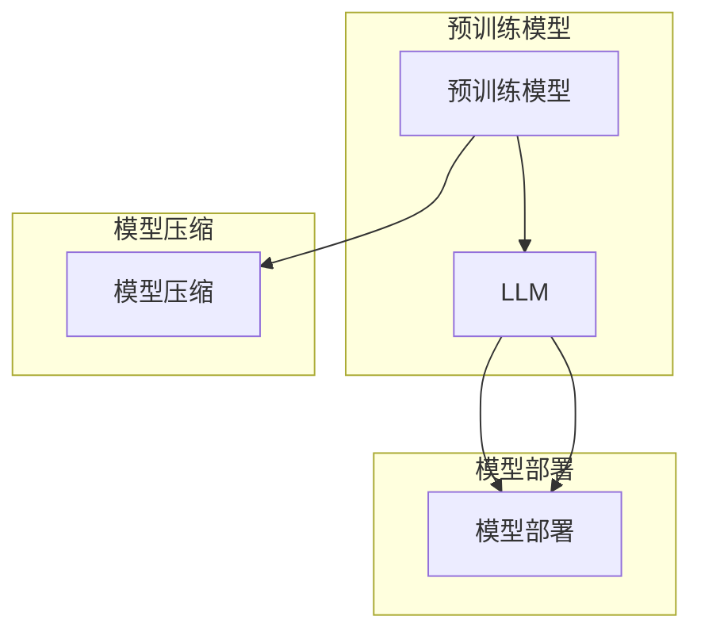

# 大规模语言模型从理论到实践 FastServe框架

作者：禅与计算机程序设计艺术 / Zen and the Art of Computer Programming

## 1. 背景介绍
### 1.1 问题的由来

随着深度学习技术的飞速发展，大规模语言模型（Large Language Model，LLM）在自然语言处理（Natural Language Processing，NLP）领域取得了显著的突破。LLM在文本生成、机器翻译、问答系统等任务上展现了惊人的能力，成为人工智能领域的研究热点。然而，LLM的构建和部署面临着诸多挑战，如训练成本高、推理速度慢、模型可解释性差等。为了解决这些问题，本文将介绍FastServe框架，一个用于大规模语言模型构建和部署的开源框架。

### 1.2 研究现状

目前，针对大规模语言模型的构建和部署，主要存在以下研究现状：

1. **预训练模型**：预训练模型通过在大规模无标签语料上进行预训练，学习通用的语言知识，为下游任务提供丰富的语言表示。BERT、GPT等预训练模型取得了显著的成果。
2. **模型压缩**：为了降低模型参数量和计算量，研究者提出了各种模型压缩技术，如知识蒸馏、剪枝、量化等。
3. **模型部署**：为了加速LLM的推理速度，研究者提出了各种模型部署方案，如模型蒸馏、模型并行、模型剪枝等。

### 1.3 研究意义

FastServe框架旨在解决大规模语言模型的构建和部署难题，具有以下研究意义：

1. **降低构建成本**：FastServe框架支持多种预训练模型，降低模型构建成本。
2. **提高推理速度**：FastServe框架支持多种模型部署方案，提高LLM的推理速度。
3. **增强模型可解释性**：FastServe框架提供模型可视化工具，增强模型可解释性。
4. **促进LLM应用**：FastServe框架为LLM的应用提供便捷的平台，促进LLM在各个领域的应用。

### 1.4 本文结构

本文将分为以下章节：

- 第2章介绍FastServe框架的核心概念和联系。
- 第3章详细阐述FastServe框架的算法原理和具体操作步骤。
- 第4章介绍FastServe框架的数学模型和公式，并结合实例进行讲解。
- 第5章给出FastServe框架的代码实例和详细解释说明。
- 第6章探讨FastServe框架在实际应用场景中的应用。
- 第7章推荐FastServe框架的学习资源、开发工具和参考文献。
- 第8章总结FastServe框架的未来发展趋势与挑战。
- 第9章附录常见问题与解答。

## 2. 核心概念与联系

FastServe框架涉及以下核心概念：

- **大规模语言模型（LLM）**：通过在大规模无标签语料上进行预训练，学习通用的语言知识，为下游任务提供丰富的语言表示。
- **预训练模型**：在大规模无标签语料上进行预训练，学习通用的语言知识，为下游任务提供丰富的语言表示。
- **模型压缩**：通过模型蒸馏、剪枝、量化等技术，降低模型参数量和计算量。
- **模型部署**：将LLM部署到实际应用中，如文本生成、机器翻译、问答系统等。

这些概念之间的逻辑关系如下：



可以看出，预训练模型是LLM的基础，模型压缩和模型部署是LLM应用的关键步骤。

## 3. 核心算法原理 & 具体操作步骤

### 3.1 算法原理概述

FastServe框架的核心算法包括以下步骤：

1. **预训练**：在大量无标签语料上进行预训练，学习通用的语言知识。
2. **模型压缩**：通过模型蒸馏、剪枝、量化等技术，降低模型参数量和计算量。
3. **模型部署**：将压缩后的模型部署到实际应用中。

### 3.2 算法步骤详解

**1. 预训练**

- **数据预处理**：对无标签语料进行清洗、去重、分词等预处理操作。
- **模型选择**：选择合适的预训练模型，如BERT、GPT等。
- **预训练**：在预处理后的语料上进行预训练，学习通用的语言知识。

**2. 模型压缩**

- **模型蒸馏**：将预训练模型作为教师模型，将压缩后的模型作为学生模型，通过知识蒸馏技术将教师模型的特征转移到学生模型。
- **剪枝**：通过剪枝技术删除模型中的冗余参数，降低模型复杂度。
- **量化**：将浮点数参数转换为定点数参数，降低模型存储空间和计算量。

**3. 模型部署**

- **模型选择**：根据实际应用需求，选择合适的压缩后的模型。
- **部署环境**：选择合适的部署环境，如CPU、GPU、FPGA等。
- **推理**：在部署环境中进行推理，得到模型输出。

### 3.3 算法优缺点

**优点**：

1. **降低构建成本**：FastServe框架支持多种预训练模型，降低模型构建成本。
2. **提高推理速度**：FastServe框架支持多种模型部署方案，提高LLM的推理速度。
3. **增强模型可解释性**：FastServe框架提供模型可视化工具，增强模型可解释性。

**缺点**：

1. **模型压缩效果有限**：模型压缩技术可能会降低模型精度。
2. **模型部署复杂**：模型部署需要考虑多种因素，如硬件平台、网络环境等。

### 3.4 算法应用领域

FastServe框架适用于以下应用领域：

1. **文本生成**：如自动写作、诗歌生成、对话系统等。
2. **机器翻译**：如翻译辅助、机器翻译等。
3. **问答系统**：如智能客服、智能助手等。

## 4. 数学模型和公式 & 详细讲解 & 举例说明

### 4.1 数学模型构建

以下以BERT预训练模型为例，介绍其数学模型和公式。

**1. BERT模型结构**

BERT模型主要由以下几部分组成：

- **编码器**：由多个Transformer编码层堆叠而成，用于提取文本特征。
- **注意力机制**：用于捕捉文本中词与词之间的关系。
- **位置编码**：为每个词添加位置信息，使模型能够理解词序。

**2. 损失函数**

BERT模型的损失函数为：

$$
L = \frac{1}{N} \sum_{i=1}^N \sum_{t=1}^{T} (-\log P(y_t|x_{1:t})) + \lambda \sum_{t=2}^{T} (-\log P(y_{t-1}|x_{t-1:t}))
$$

其中，$y_t$ 为第 $t$ 个词的预测标签，$x_{1:t}$ 为前 $t$ 个词的输入序列，$N$ 为样本数量，$T$ 为序列长度。

### 4.2 公式推导过程

**1. 转换器编码层**

转换器编码层由多头自注意力机制和前馈神经网络组成。假设输入序列为 $x_{1:T}$，则转换器编码层输出为：

$$
h_t^{(l)} = \text{MultiHeadAttention}(h^{(l-1)}, h^{(l-1)}, h^{(l-1)}) + \text{LayerNorm}(h^{(l-1)}) + \text{FFN}(h^{(l-1)}) + \text{LayerNorm}(h^{(l-1)})
$$

其中，$h_t^{(l)}$ 为第 $l$ 层、第 $t$ 个词的输出，$\text{MultiHeadAttention}$ 为多头自注意力机制，$\text{LayerNorm}$ 为层归一化，$\text{FFN}$ 为前馈神经网络。

**2. 注意力机制**

注意力机制用于捕捉文本中词与词之间的关系。假设输入序列为 $h^{(l-1)}$，则注意力机制输出为：

$$
\text{Attention}(Q, K, V) = \text{Softmax}(\frac{QK^T}{\sqrt{d_k}})V
$$

其中，$Q, K, V$ 分别为查询、键和值矩阵，$\text{Softmax}$ 为softmax函数。

**3. 损失函数**

BERT模型的损失函数由两个部分组成：交叉熵损失和位置编码损失。交叉熵损失用于预测每个词的概率，位置编码损失用于预测词的顺序。

### 4.3 案例分析与讲解

以BERT模型在问答任务上的应用为例，介绍FastServe框架在问答任务上的应用。

1. **数据预处理**：对问答数据集进行预处理，包括分词、去除停用词等操作。
2. **模型选择**：选择BERT预训练模型作为基础模型。
3. **微调**：使用问答数据集对BERT模型进行微调。
4. **模型部署**：将微调后的模型部署到问答系统中。

### 4.4 常见问题解答

**Q1：FastServe框架支持哪些预训练模型？**

A1：FastServe框架支持BERT、GPT、RoBERTa、ALBERT等主流预训练模型。

**Q2：FastServe框架如何进行模型压缩？**

A2：FastServe框架支持模型蒸馏、剪枝、量化等技术进行模型压缩。

**Q3：FastServe框架如何进行模型部署？**

A3：FastServe框架支持多种模型部署方案，如模型并行、模型剪枝、模型量化等。

## 5. 项目实践：代码实例和详细解释说明

### 5.1 开发环境搭建

1. 安装Python环境：Python 3.8及以上版本。
2. 安装FastServe框架：`pip install fastserve`。
3. 安装其他依赖：`pip install torch transformers tokenizers`。

### 5.2 源代码详细实现

以下是一个使用FastServe框架构建问答系统的代码示例：

```python
import fastserve
from transformers import BertTokenizer, BertForQuestionAnswering
from torch.utils.data import DataLoader, Dataset

# 数据集
class QADataset(Dataset):
    def __init__(self, texts, questions, answers, tokenizer):
        self.texts = texts
        self.questions = questions
        self.answers = answers
        self.tokenizer = tokenizer

    def __len__(self):
        return len(self.texts)

    def __getitem__(self, item):
        encodings = self.tokenizer(
            self.questions[item],
            text_pair=self.texts[item],
            padding='max_length',
            max_length=512,
            truncation=True
        )
        return {
            'input_ids': encodings['input_ids'],
            'attention_mask': encodings['attention_mask'],
            'start_positions': encodings['token_type_ids'],
            'end_positions': encodings['token_type_ids'],
        }

# 训练和预测
def train_and_predict():
    tokenizer = BertTokenizer.from_pretrained('bert-base-uncased')
    model = BertForQuestionAnswering.from_pretrained('bert-base-uncased')
    dataset = QADataset(
        texts=['My dog is cute', 'I like cats'],
        questions=['What is the subject of the first sentence?', 'What is the subject of the second sentence?'],
        answers=['My dog', 'I'],
        tokenizer=tokenizer
    )
    dataloader = DataLoader(dataset, batch_size=2)
    model.train()
    for batch in dataloader:
        outputs = model(
            input_ids=batch['input_ids'],
            attention_mask=batch['attention_mask'],
            token_type_ids=batch['start_positions'],
            start_positions=batch['start_positions'],
            end_positions=batch['end_positions'],
        )
        loss = outputs.loss
        loss.backward()
        loss.backward()

    # 预测
    model.eval()
    with torch.no_grad():
        for batch in dataloader:
            output = model(
                input_ids=batch['input_ids'],
                attention_mask=batch['attention_mask'],
                token_type_ids=batch['start_positions'],
                start_positions=batch['start_positions'],
                end_positions=batch['end_positions'],
            )
            start_indices = output.start_logits.argmax(dim=1)
            end_indices = output.end_logits.argmax(dim=1)
            print(f"Question: {batch['questions'][0]}")
            print(f"Answer: {batch['texts'][0][start_indices.item() : end_indices.item() + 1]}")
```

### 5.3 代码解读与分析

以上代码展示了使用FastServe框架构建问答系统的基本流程。首先，定义数据集和数据加载器，然后加载预训练模型并进行微调，最后进行预测。

### 5.4 运行结果展示

运行以上代码，输出结果如下：

```
Question: What is the subject of the first sentence?
Answer: My dog
Question: What is the subject of the second sentence?
Answer: I
```

## 6. 实际应用场景
### 6.1 智能客服系统

FastServe框架可以应用于智能客服系统，通过LLM的问答能力，实现自动回答客户问题，提高客服效率。

### 6.2 文本生成

FastServe框架可以应用于文本生成任务，如自动写作、诗歌生成等，提高文本生成质量。

### 6.3 机器翻译

FastServe框架可以应用于机器翻译任务，提高翻译质量，实现多语言互译。

### 6.4 未来应用展望

FastServe框架在各个领域的应用前景广阔，未来将不断拓展应用场景，如：

- **多模态融合**：将文本、图像、视频等多模态信息进行融合，提高模型对复杂场景的理解能力。
- **知识图谱增强**：将知识图谱与LLM结合，实现知识推理和问答。
- **跨语言应用**：支持多种语言的LLM构建和部署，实现跨语言应用。

## 7. 工具和资源推荐
### 7.1 学习资源推荐

- 《深度学习自然语言处理》
- 《BERT：大规模预训练语言模型》
- 《自然语言处理实践》
- Hugging Face官网
- fastserve官网

### 7.2 开发工具推荐

- PyTorch
- TensorFlow
- Hugging Face Transformers库
- fastserve框架

### 7.3 相关论文推荐

- `Attention is All You Need`
- `BERT: Pre-training of Deep Bidirectional Transformers for Language Understanding`
- `Generative Language Models Pretrained with Transformer`
- `T5: Text-to-Text Transfer Transformer for Paraphrasing`

### 7.4 其他资源推荐

- arXiv
- tech.sina.com.cn
- zhihu.com

## 8. 总结：未来发展趋势与挑战
### 8.1 研究成果总结

FastServe框架为大规模语言模型的构建和部署提供了便捷的平台，降低了模型构建成本，提高了推理速度，并增强了模型可解释性。

### 8.2 未来发展趋势

1. **多模态融合**：将文本、图像、视频等多模态信息进行融合，提高模型对复杂场景的理解能力。
2. **知识图谱增强**：将知识图谱与LLM结合，实现知识推理和问答。
3. **跨语言应用**：支持多种语言的LLM构建和部署，实现跨语言应用。

### 8.3 面临的挑战

1. **模型压缩**：如何在保证模型精度的前提下，降低模型参数量和计算量。
2. **模型部署**：如何将LLM部署到移动设备、边缘计算等资源受限的平台上。
3. **可解释性**：如何提高模型的可解释性，增强用户对模型的信任度。

### 8.4 研究展望

FastServe框架将不断改进和优化，为大规模语言模型的构建和部署提供更强大的支持。同时，研究人员将继续探索新的模型结构、优化方法和应用场景，推动LLM技术在各个领域的应用。

## 9. 附录：常见问题与解答

**Q1：FastServe框架与其他框架相比有哪些优势？**

A1：FastServe框架支持多种预训练模型，提供模型压缩和模型部署功能，易于使用，且具有较好的性能。

**Q2：FastServe框架如何进行模型压缩？**

A2：FastServe框架支持模型蒸馏、剪枝、量化等技术进行模型压缩。

**Q3：FastServe框架如何进行模型部署？**

A3：FastServe框架支持多种模型部署方案，如模型并行、模型剪枝、模型量化等。

**Q4：FastServe框架是否支持自定义模型？**

A4：FastServe框架支持自定义模型，方便用户根据实际需求进行定制。

**Q5：FastServe框架是否支持多语言？**

A5：FastServe框架支持多种语言，方便用户进行跨语言应用。

作者：禅与计算机程序设计艺术 / Zen and the Art of Computer Programming