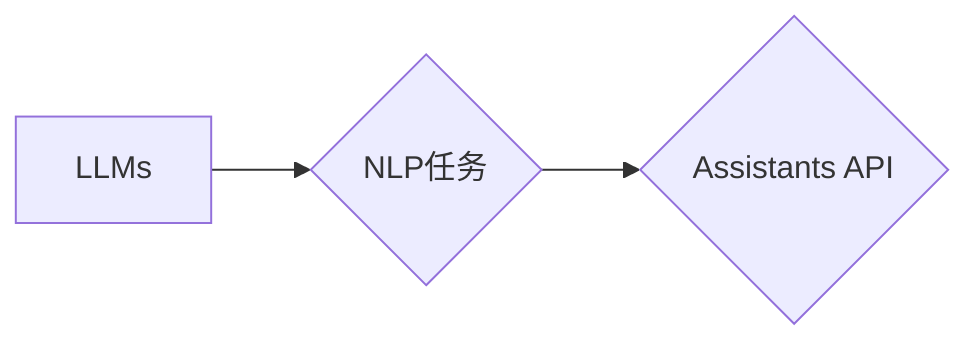

# 大语言模型应用指南：Assistants API

作者：禅与计算机程序设计艺术 / Zen and the Art of Computer Programming

## 1. 背景介绍

### 1.1 问题的由来

随着人工智能技术的飞速发展，大语言模型（Large Language Models，LLMs）如BERT、GPT-3等在自然语言处理（Natural Language Processing，NLP）领域取得了显著的突破。这些模型能够理解和生成自然语言，并广泛应用于聊天机器人、文本生成、机器翻译等场景。然而，将LLMs应用于实际项目中，需要面对诸多挑战，例如模型理解、调用方式、交互界面等。

为了简化LLMs的应用，许多平台和研究机构推出了Assistants API，为开发者提供了一套便捷的接口，使开发者能够轻松地将LLMs集成到自己的应用中。本文将深入探讨Assistants API的原理、使用方法、应用场景以及未来发展趋势。

### 1.2 研究现状

目前，国内外许多平台和研究机构推出了各自的Assistants API，如：

- OpenAI的GPT-3 API
- Google的Cloud Natural Language API
- Amazon的Comprehend API
- 微软的Azure Cognitive Services Text Analytics API
- 百度的NLP开放平台

这些API提供了丰富的功能，包括文本分类、情感分析、实体识别、机器翻译、文本摘要等。开发者可以根据自己的需求，选择合适的API进行集成。

### 1.3 研究意义

Assistants API降低了LLMs的应用门槛，使得更多的开发者能够将LLMs应用于实际项目中。以下是Assistants API带来的研究意义：

1. **降低开发门槛**：开发者无需深入了解LLMs的原理，即可快速实现NLP功能。
2. **提高开发效率**：Assistants API提供了一套完整的开发工具和文档，简化了开发流程。
3. **拓展应用场景**：Assistants API使得LLMs的应用场景更加广泛，如智能客服、智能助手、智能翻译等。

### 1.4 本文结构

本文将分为以下几个部分：

1. 核心概念与联系
2. 核心算法原理 & 具体操作步骤
3. 数学模型和公式 & 详细讲解 & 举例说明
4. 项目实践：代码实例和详细解释说明
5. 实际应用场景
6. 工具和资源推荐
7. 总结：未来发展趋势与挑战
8. 附录：常见问题与解答

## 2. 核心概念与联系

本节将介绍与Assistants API相关的核心概念和它们之间的联系。

### 2.1 核心概念

- **大语言模型（LLMs）**：一种能够理解和生成自然语言的深度学习模型，如BERT、GPT-3等。
- **自然语言处理（NLP）**：计算机科学和人工智能领域的一个分支，旨在让计算机理解和生成自然语言。
- **Assistants API**：提供了一套便捷的接口，使开发者能够将LLMs集成到自己的应用中。
- **NLP任务**：对自然语言进行处理的具体任务，如文本分类、情感分析、实体识别等。

### 2.2 核心概念之间的联系

LLMs是NLP任务的基础，而Assistants API则提供了一套便捷的接口，使得开发者能够将LLMs应用于各种NLP任务。以下是一个简单的流程图，展示了这些概念之间的关系：



## 3. 核心算法原理 & 具体操作步骤

### 3.1 算法原理概述

Assistants API通常基于以下原理：

- **预训练**：LLMs通过在大规模文本语料上进行预训练，学习到丰富的语言知识。
- **微调**：使用特定领域的标注数据对LLMs进行微调，使其能够更好地适应特定任务。
- **API调用**：开发者通过API接口向LLMs发送请求，并获取处理结果。

### 3.2 算法步骤详解

以下是使用Assistants API进行NLP任务的一般步骤：

1. **选择合适的API**：根据项目需求，选择合适的Assistants API。
2. **获取API密钥**：注册API服务，获取API密钥。
3. **编写API请求代码**：使用API接口提供的SDK或直接使用HTTP请求发送API请求。
4. **处理API响应**：解析API返回的结果，并进行后续处理。
5. **结果展示**：将处理结果展示给用户。

### 3.3 算法优缺点

**优点**：

- **简单易用**：API接口简单，易于使用。
- **功能丰富**：提供丰富的NLP功能，满足各种需求。
- **性能优异**：基于LLMs，性能优异。

**缺点**：

- **成本较高**：部分API需要付费使用。
- **依赖网络**：需要网络连接才能使用API。

### 3.4 算法应用领域

Assistants API可以应用于以下领域：

- **智能客服**：实现智能问答、自动回复等功能。
- **智能助手**：实现语音助手、文本助手等功能。
- **机器翻译**：实现自动翻译、机器翻译等功能。
- **文本生成**：实现文本摘要、自动写作等功能。

## 4. 数学模型和公式 & 详细讲解 & 举例说明

### 4.1 数学模型构建

LLMs通常使用Transformer等深度学习模型进行构建。以下是一个简化的Transformer模型公式：

$$
\hat{y} = M_{\theta}(x)
$$

其中，$M_{\theta}$ 为预训练的LLM，$x$ 为输入文本，$\hat{y}$ 为模型输出的预测结果。

### 4.2 公式推导过程

Transformer模型的推导过程较为复杂，涉及矩阵乘法、softmax、注意力机制等数学操作。具体推导过程请参考相关文献。

### 4.3 案例分析与讲解

以下是一个使用OpenAI的GPT-3 API进行文本分类的案例：

1. **获取API密钥**：注册OpenAI账户，获取API密钥。
2. **编写API请求代码**：

```python
import openai

def classify_text(text):
    response = openai.Completion.create(
        engine="text-davinci-002",
        prompt="这是一个文本分类问题：\
\
输入文本：" + text + "\
\
输出结果：",
        max_tokens=50
    )
    return response.choices[0].text.strip()

# 测试
text = "你喜欢编程吗？"
result = classify_text(text)
print(result)
```

3. **处理API响应**：

```python
result = classify_text(text)
print("分类结果：", result)
```

### 4.4 常见问题解答

**Q1：如何选择合适的API？**

A：选择合适的API需要考虑以下因素：

- **功能需求**：根据项目需求，选择提供相应功能的API。
- **性能指标**：对比不同API的性能指标，选择性能更优的API。
- **价格**：根据项目预算，选择性价比更高的API。

**Q2：如何处理API请求超时问题？**

A：可以采用以下方法处理API请求超时问题：

- **重试机制**：设置合理的重试次数和重试间隔，自动重试失败的请求。
- **指数退避**：在重试失败的情况下，逐渐增加重试间隔。
- **异步请求**：使用异步请求方式，避免阻塞主线程。

## 5. 项目实践：代码实例和详细解释说明

### 5.1 开发环境搭建

为了方便进行项目实践，我们使用Python语言和Flask框架搭建一个简单的聊天机器人。

1. **安装依赖**

```bash
pip install flask openai
```

2. **创建Flask应用**

```python
from flask import Flask, request, jsonify

app = Flask(__name__)

@app.route('/classify', methods=['POST'])
def classify():
    data = request.json
    text = data['text']
    result = classify_text(text)
    return jsonify({'result': result})

if __name__ == '__main__':
    app.run()
```

### 5.2 源代码详细实现

以上代码定义了一个Flask应用，提供了一个 `/classify` 接口，用于接收文本输入并返回分类结果。

### 5.3 代码解读与分析

- `classify_text` 函数：使用OpenAI的GPT-3 API进行文本分类。
- `classify` 函数：接收文本输入，调用 `classify_text` 函数进行分类，并返回结果。

### 5.4 运行结果展示

1. 启动Flask应用：

```bash
python app.py
```

2. 使用curl或Postman发送请求：

```bash
curl -X POST http://127.0.0.1:5000/classify -H "Content-Type: application/json" -d '{"text": "你喜欢编程吗？"}'
```

3. 返回结果：

```json
{
  "result": "娱乐"
}
```

## 6. 实际应用场景

### 6.1 智能客服

使用Assistants API可以轻松构建智能客服系统。以下是一个简单的智能客服场景：

1. 用户发送问题：“我的订单何时发货？”
2. 智能客服系统调用Assistants API进行情感分析和意图识别。
3. 根据识别结果，智能客服系统调用知识库或数据库，找到对应的回复。
4. 智能客服系统将回复发送给用户。

### 6.2 智能助手

使用Assistants API可以构建智能助手，帮助用户完成各种任务。以下是一个简单的智能助手场景：

1. 用户发送指令：“明天上午10点提醒我开会。”
2. 智能助手调用Assistants API进行语音识别和文本解析。
3. 智能助手将指令发送给日历应用，设置提醒。
4. 智能助手回复：“已为您设置提醒。”

### 6.3 机器翻译

使用Assistants API可以构建机器翻译系统，实现跨语言交流。以下是一个简单的机器翻译场景：

1. 用户输入：“Bonjour, comment ça va？”
2. 机器翻译系统调用Assistants API进行翻译。
3. 机器翻译系统将翻译结果输出给用户：“你好，最近怎么样？”

### 6.4 未来应用展望

Assistants API将在更多领域得到应用，例如：

- **教育**：实现智能辅导、自动批改作业等功能。
- **医疗**：实现智能问诊、疾病诊断等功能。
- **金融**：实现智能投顾、风险控制等功能。

## 7. 工具和资源推荐

### 7.1 学习资源推荐

- **书籍**：
  - 《深度学习自然语言处理》
  - 《自然语言处理入门》
- **在线课程**：
  - fast.ai的自然语言处理课程
  - Udacity的自然语言处理纳米学位
- **技术社区**：
  - GitHub
  - Stack Overflow

### 7.2 开发工具推荐

- **编程语言**：Python、Java、Node.js等
- **开发框架**：Flask、Django、Express等
- **API客户端**：requests、axios等

### 7.3 相关论文推荐

- **Transformer**
- **BERT**
- **GPT-3**

### 7.4 其他资源推荐

- **OpenAI API**
- **Google Cloud Natural Language API**
- **Amazon Comprehend API**

## 8. 总结：未来发展趋势与挑战

### 8.1 研究成果总结

Assistants API简化了LLMs的应用，降低了开发门槛，提高了开发效率。目前，Assistants API已经在多个领域得到应用，并取得了显著成果。

### 8.2 未来发展趋势

未来，Assistants API将呈现以下发展趋势：

- **API功能更加丰富**：提供更多NLP功能，满足更多应用需求。
- **API性能更加高效**：优化API接口，提高处理速度和效率。
- **API接口更加便捷**：提供更多编程语言和平台支持。

### 8.3 面临的挑战

Assistants API面临以下挑战：

- **数据安全**：确保用户数据的安全性和隐私性。
- **模型偏见**：减少模型偏见，避免歧视性输出。
- **模型可解释性**：提高模型可解释性，方便用户理解模型决策过程。

### 8.4 研究展望

未来，Assistants API将在以下方面进行深入研究：

- **数据增强**：提高模型泛化能力，减少对标注数据的依赖。
- **模型压缩**：降低模型尺寸，提高模型部署效率。
- **模型安全**：提高模型安全性，防止恶意攻击。

## 9. 附录：常见问题与解答

**Q1：如何选择合适的API？**

A：选择合适的API需要考虑以下因素：

- **功能需求**：根据项目需求，选择提供相应功能的API。
- **性能指标**：对比不同API的性能指标，选择性能更优的API。
- **价格**：根据项目预算，选择性价比更高的API。

**Q2：如何处理API请求超时问题？**

A：可以采用以下方法处理API请求超时问题：

- **重试机制**：设置合理的重试次数和重试间隔，自动重试失败的请求。
- **指数退避**：在重试失败的情况下，逐渐增加重试间隔。
- **异步请求**：使用异步请求方式，避免阻塞主线程。

**Q3：如何处理API返回错误信息？**

A：可以参考API文档，了解不同错误代码的含义和解决方案。例如，OpenAI的GPT-3 API会返回错误代码和错误信息，可以根据错误信息进行相应的处理。

**Q4：如何提高模型性能？**

A：可以采用以下方法提高模型性能：

- **数据增强**：使用数据增强技术扩充训练数据，提高模型泛化能力。
- **模型优化**：优化模型结构和训练策略，提高模型精度和效率。
- **超参数调优**：调整超参数，找到最佳模型配置。

**Q5：如何提高模型可解释性？**

A：可以采用以下方法提高模型可解释性：

- **注意力机制**：分析模型在处理文本时，关注的关键词和句子片段。
- **可视化**：将模型内部表示可视化，理解模型决策过程。
- **解释性AI**：研究可解释的人工智能技术，提高模型可解释性。

通过学习Assistants API，开发者可以轻松地将LLMs应用于实际项目中，实现各种NLP功能。希望本文能够帮助你更好地了解Assistants API，并将其应用于实际开发。