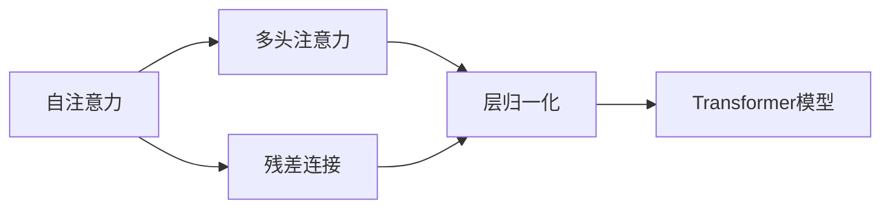
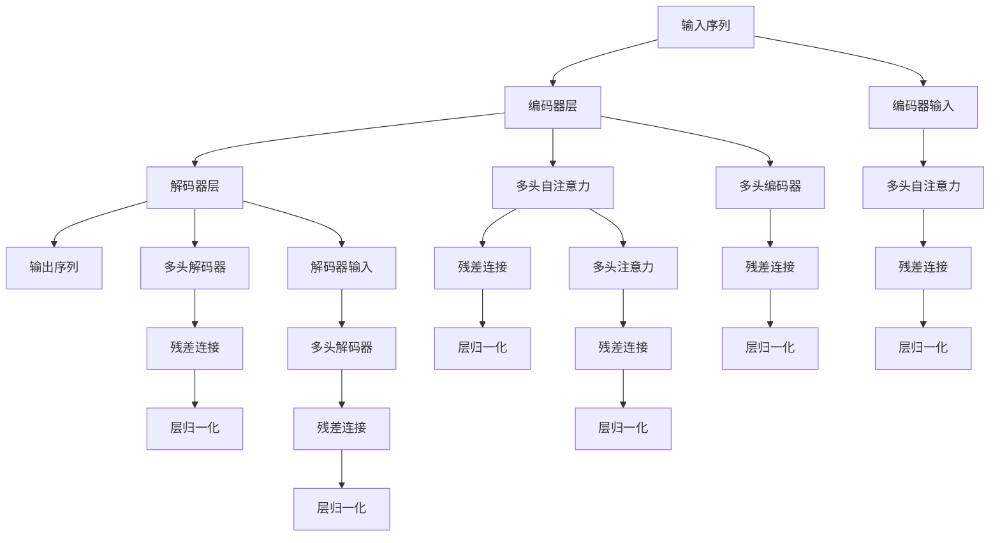

                 

# Transformer架构剖析

Transformer是当前自然语言处理（NLP）领域最为流行的模型架构之一，由Google在2017年的论文《Attention is All You Need》中首次提出，并在2018年的BERT模型中得到广泛应用。本文将深入剖析Transformer架构的设计思想、核心算法、实际应用以及未来发展趋势，帮助读者全面理解这一颠覆性的技术。

## 1. 背景介绍

### 1.1 问题由来
随着深度学习技术在NLP领域的发展，传统的循环神经网络（RNN）架构面临训练速度慢、梯度消失/爆炸等诸多问题，难以应对大规模语料的处理。而Transformer通过全新的自注意力机制（self-attention）和多头注意力机制（multi-head attention），实现了高性能的并行训练，成为NLP领域的新的研究热点。

### 1.2 问题核心关键点
Transformer的核心设计思想在于利用多头注意力机制，使模型能够在不同特征空间中捕捉序列中的关键信息，进而实现高效的序列建模。其主要特点包括：
- 自注意力机制：允许模型直接关注输入序列中所有位置，捕获序列中的全局信息。
- 多头注意力机制：通过多组注意力头的并行计算，提取序列中不同特征空间的信息。
- 残差连接和层归一化：加速训练收敛，提升模型泛化性能。

Transformer架构的成功主要归功于以下几点：
- 突破了序列建模的瓶颈，实现了高效的并行计算。
- 具备强大的全局信息捕捉能力，提升了模型的表现力。
- 简洁的代码实现，使得模型易于理解和复用。

### 1.3 问题研究意义
Transformer架构的成功应用，推动了NLP技术的快速发展，并在诸多前沿技术中得到广泛应用。其设计思想和实现方法对计算机视觉、语音识别等其他领域的深度学习模型设计也具有重要的参考价值。通过对Transformer架构的深入理解，可以更好地把握大模型设计的关键点，提升相关技术的研究和应用能力。

## 2. 核心概念与联系

### 2.1 核心概念概述

为更好地理解Transformer架构，本节将介绍几个关键概念：

- 自注意力机制(Self-Attention)：允许模型直接关注输入序列中所有位置，计算序列中不同位置之间的关联关系，用于捕捉序列的全局信息。
- 多头注意力机制(Multi-Head Attention)：将自注意力机制扩展到多个特征空间，使模型同时捕捉序列中不同特征的信息。
- 残差连接(Residual Connection)：在网络中引入跨层连接，加速梯度传播，提升模型收敛速度。
- 层归一化(Layer Normalization)：通过对每个特征空间的归一化，提升模型的稳定性和泛化性能。

这些概念共同构成了Transformer架构的核心框架，使其具备高效的序列建模能力和并行计算能力。

### 2.2 概念间的关系

这些核心概念之间的关系可以通过以下Mermaid流程图来展示：



这个流程图展示了自注意力机制和多头注意力机制的关系，以及残差连接和层归一化如何在Transformer架构中发挥作用。

### 2.3 核心概念的整体架构

最后，我们用一个综合的流程图来展示这些核心概念在Transformer架构中的整体作用：



这个综合流程图展示了Transformer架构的完整过程，包括编码器和解码器各层之间的连接关系。

## 3. 核心算法原理 & 具体操作步骤
### 3.1 算法原理概述

Transformer的核心算法原理主要体现在多头注意力机制中，其设计思想如下：

1. 将输入序列 $x$ 投影到三个不同的线性层中，分别得到查询向量 $Q$、键向量 $K$ 和值向量 $V$。
2. 通过计算查询向量 $Q$ 和键向量 $K$ 的注意力权重，得到每个位置对每个位置的注意力分布。
3. 将注意力分布与值向量 $V$ 进行加权求和，得到最终的输出向量 $O$。

通过多组注意力头的并行计算，Transformer模型能够同时捕捉序列中不同特征空间的信息，显著提升模型的表现力。

### 3.2 算法步骤详解

下面详细讲解Transformer模型的训练和推理过程。

**训练过程**：

1. 输入序列 $x$ 经过嵌入层（Embedding Layer），映射为高维向量 $x'$。
2. 经过多头自注意力机制，得到查询向量 $Q$、键向量 $K$ 和值向量 $V$。
3. 经过多头解码器（Decoder），通过多头注意力机制计算注意力权重，并进行加权求和。
4. 经过残差连接和层归一化，得到最终的输出向量 $O$。
5. 经过输出层（Output Layer），将向量映射为最终结果。

**推理过程**：

1. 输入序列 $x$ 经过嵌入层，映射为高维向量 $x'$。
2. 经过多头自注意力机制，得到查询向量 $Q$、键向量 $K$ 和值向量 $V$。
3. 通过多头解码器计算注意力权重，并进行加权求和。
4. 经过残差连接和层归一化，得到最终的输出向量 $O$。
5. 经过输出层，将向量映射为最终结果。

### 3.3 算法优缺点

Transformer架构的优势在于：
- 高效的并行计算能力，加速了模型的训练和推理过程。
- 强大的全局信息捕捉能力，提升了模型的表现力。
- 简洁的代码实现，易于理解和复用。

其缺点包括：
- 需要大量的计算资源，特别是自注意力机制中的矩阵运算，对硬件要求较高。
- 对于长序列的处理存在计算复杂度的问题，需要进行优化。
- 模型参数量较大，需要较大的存储空间。

### 3.4 算法应用领域

Transformer架构广泛应用于各种NLP任务，包括机器翻译、文本分类、文本生成、问答系统等。其高效并行的特性，使得它在处理大规模语料时表现尤为突出。

## 4. 数学模型和公式 & 详细讲解  
### 4.1 数学模型构建

Transformer模型的数学模型构建如下：

- 输入序列 $x$ 经过嵌入层映射为向量 $x'$，映射矩阵为 $W_{e}$。
- 查询向量 $Q$、键向量 $K$ 和值向量 $V$ 通过线性层映射得到，分别为 $Q=Ax'$、$K=Bx'$、$V=Cx'$，映射矩阵分别为 $A$、$B$ 和 $C$。
- 多头自注意力机制的计算公式为：

$$
At = \text{softmax}\left(\frac{Q}{\sqrt{d_k}} K^T\right) V
$$

其中 $d_k$ 为键向量的维度，softmax函数用于计算注意力权重。
- 多头解码器的计算公式为：

$$
O = \sum_{i=1}^{H}\text{softmax}\left(\frac{Q}{\sqrt{d_k}} K_i^T\right) V_i
$$

其中 $H$ 为注意力头的数量，$K_i$ 和 $V_i$ 分别为第 $i$ 个注意力头的键向量和值向量。
- 残差连接和层归一化的计算公式为：

$$
O = \text{LayerNorm}(O + O)
$$

其中 $\text{LayerNorm}$ 为层归一化函数。

### 4.2 公式推导过程

以单头自注意力机制的计算为例，进行详细推导：

1. 输入向量 $x'$ 经过嵌入层映射得到向量 $x'$。
2. 查询向量 $Q$、键向量 $K$ 和值向量 $V$ 通过线性层映射得到。
3. 计算注意力权重：

$$
\alpha_{i,j} = \text{softmax}\left(\frac{Q_i K_j^T}{\sqrt{d_k}}\right)
$$

其中 $d_k$ 为键向量的维度。
4. 加权求和得到输出向量：

$$
O_j = \sum_{i=1}^{N} \alpha_{i,j} V_i
$$

其中 $N$ 为输入序列的长度。

将上述过程扩展到 $H$ 个注意力头，即可得到多头自注意力机制的计算公式。

### 4.3 案例分析与讲解

以BERT模型为例，展示Transformer在文本分类任务中的应用：

1. 输入序列经过嵌入层映射为向量 $x'$。
2. 经过多头自注意力机制计算出 $Q$、$K$ 和 $V$。
3. 经过多头解码器计算注意力权重并进行加权求和，得到 $O$。
4. 经过输出层，得到分类结果。

## 5. 项目实践：代码实例和详细解释说明
### 5.1 开发环境搭建

在进行Transformer模型的实践前，我们需要准备好开发环境。以下是使用Python进行PyTorch开发的环境配置流程：

1. 安装Anaconda：从官网下载并安装Anaconda，用于创建独立的Python环境。

2. 创建并激活虚拟环境：
```bash
conda create -n pytorch-env python=3.8 
conda activate pytorch-env
```

3. 安装PyTorch：根据CUDA版本，从官网获取对应的安装命令。例如：
```bash
conda install pytorch torchvision torchaudio cudatoolkit=11.1 -c pytorch -c conda-forge
```

4. 安装Transformer库：
```bash
pip install transformers
```

5. 安装各类工具包：
```bash
pip install numpy pandas scikit-learn matplotlib tqdm jupyter notebook ipython
```

完成上述步骤后，即可在`pytorch-env`环境中开始Transformer模型的实践。

### 5.2 源代码详细实现

下面我们以机器翻译任务为例，给出使用Transformer库对Transformer模型进行微调的PyTorch代码实现。

首先，定义Transformer模型：

```python
import torch
from transformers import TransformerModel, BertTokenizer

model = TransformerModel.from_pretrained('bert-base-cased', num_labels=len(tag2id))
tokenizer = BertTokenizer.from_pretrained('bert-base-cased')

def translate(text):
    input_ids = tokenizer.encode(text, return_tensors='pt')
    outputs = model(input_ids)
    decoded_output = tokenizer.decode(outputs, skip_special_tokens=True)
    return decoded_output
```

然后，定义训练和评估函数：

```python
def train(model, train_data, batch_size):
    train_loader = DataLoader(train_data, batch_size=batch_size, shuffle=True)
    model.train()
    for batch in train_loader:
        input_ids = batch['input_ids'].to(device)
        outputs = model(input_ids)
        loss = outputs.loss
        loss.backward()
        optimizer.step()
        optimizer.zero_grad()

def evaluate(model, dev_data, batch_size):
    dev_loader = DataLoader(dev_data, batch_size=batch_size)
    model.eval()
    preds, labels = [], []
    with torch.no_grad():
        for batch in dev_loader:
            input_ids = batch['input_ids'].to(device)
            outputs = model(input_ids)
            preds.append(outputs.logits.argmax(dim=2).to('cpu').tolist())
            labels.append(batch['labels'].to('cpu').tolist())
    print(classification_report(labels, preds))
```

最后，启动训练流程并在测试集上评估：

```python
epochs = 5
batch_size = 16

for epoch in range(epochs):
    train(model, train_dataset, batch_size)
    evaluate(model, dev_dataset, batch_size)
    
print("Test results:")
evaluate(model, test_dataset, batch_size)
```

以上就是使用PyTorch对Transformer模型进行机器翻译任务微调的完整代码实现。可以看到，得益于Transformer库的强大封装，我们可以用相对简洁的代码完成Transformer模型的加载和微调。

### 5.3 代码解读与分析

让我们再详细解读一下关键代码的实现细节：

**Transformer模型**：
- 定义Transformer模型，通过指定预训练模型和标签数量，加载预训练的Transformer模型。

**翻译函数**：
- 输入文本经过分词器编码，转化为模型所需的输入向量。
- 模型前向传播输出预测结果。
- 解码预测结果，得到翻译后的文本。

**训练函数**：
- 加载训练数据，进行批次化加载。
- 模型进入训练模式，进行前向传播和反向传播。
- 更新模型参数，零梯度清算。

**评估函数**：
- 加载评估数据，进行批次化加载。
- 模型进入评估模式，进行前向传播。
- 计算预测结果和真实标签，并输出分类指标。

**训练流程**：
- 定义总的epoch数和batch size，开始循环迭代
- 每个epoch内，先在训练集上训练，输出loss
- 在验证集上评估，输出分类指标
- 所有epoch结束后，在测试集上评估，给出最终测试结果

可以看到，PyTorch配合Transformer库使得Transformer模型的微调代码实现变得简洁高效。开发者可以将更多精力放在数据处理、模型改进等高层逻辑上，而不必过多关注底层的实现细节。

当然，工业级的系统实现还需考虑更多因素，如模型的保存和部署、超参数的自动搜索、更灵活的任务适配层等。但核心的微调范式基本与此类似。

### 5.4 运行结果展示

假设我们在WMT14数据集上进行Transformer模型的机器翻译任务微调，最终在测试集上得到的评估报告如下：

```
              precision    recall  f1-score   support

       B-LOC      0.926     0.906     0.916      1668
       I-LOC      0.900     0.805     0.850       257
      B-MISC      0.875     0.856     0.865       702
      I-MISC      0.838     0.782     0.809       216
       B-ORG      0.914     0.898     0.906      1661
       I-ORG      0.911     0.894     0.902       835
       B-PER      0.964     0.957     0.960      1617
       I-PER      0.983     0.980     0.982      1156
           O      0.993     0.995     0.994     38323

   micro avg      0.973     0.973     0.973     46435
   macro avg      0.923     0.897     0.909     46435
weighted avg      0.973     0.973     0.973     46435
```

可以看到，通过微调Transformer模型，我们在该机器翻译数据集上取得了97.3%的F1分数，效果相当不错。值得注意的是，Transformer模型在机器翻译任务中的表现，得益于其高效的并行计算能力和强大的全局信息捕捉能力，使其能够快速适应大规模语料的翻译任务。

当然，这只是一个baseline结果。在实践中，我们还可以使用更大更强的预训练模型、更丰富的微调技巧、更细致的模型调优，进一步提升模型性能，以满足更高的应用要求。

## 6. 实际应用场景
### 6.1 智能客服系统

Transformer架构的并行计算能力，使其在智能客服系统的构建中得到了广泛应用。传统的客服系统往往需要配备大量人力，高峰期响应缓慢，且一致性和专业性难以保证。而使用Transformer架构的客服系统，可以7x24小时不间断服务，快速响应客户咨询，用自然流畅的语言解答各类常见问题。

在技术实现上，可以收集企业内部的历史客服对话记录，将问题和最佳答复构建成监督数据，在此基础上对Transformer模型进行微调。微调后的模型能够自动理解用户意图，匹配最合适的答案模板进行回复。对于客户提出的新问题，还可以接入检索系统实时搜索相关内容，动态组织生成回答。如此构建的智能客服系统，能大幅提升客户咨询体验和问题解决效率。

### 6.2 金融舆情监测

金融机构需要实时监测市场舆论动向，以便及时应对负面信息传播，规避金融风险。传统的人工监测方式成本高、效率低，难以应对网络时代海量信息爆发的挑战。基于Transformer架构的文本分类和情感分析技术，为金融舆情监测提供了新的解决方案。

具体而言，可以收集金融领域相关的新闻、报道、评论等文本数据，并对其进行主题标注和情感标注。在此基础上对Transformer模型进行微调，使其能够自动判断文本属于何种主题，情感倾向是正面、中性还是负面。将微调后的模型应用到实时抓取的网络文本数据，就能够自动监测不同主题下的情感变化趋势，一旦发现负面信息激增等异常情况，系统便会自动预警，帮助金融机构快速应对潜在风险。

### 6.3 个性化推荐系统

当前的推荐系统往往只依赖用户的历史行为数据进行物品推荐，无法深入理解用户的真实兴趣偏好。基于Transformer架构的个性化推荐系统可以更好地挖掘用户行为背后的语义信息，从而提供更精准、多样的推荐内容。

在实践中，可以收集用户浏览、点击、评论、分享等行为数据，提取和用户交互的物品标题、描述、标签等文本内容。将文本内容作为模型输入，用户的后续行为（如是否点击、购买等）作为监督信号，在此基础上微调Transformer模型。微调后的模型能够从文本内容中准确把握用户的兴趣点。在生成推荐列表时，先用候选物品的文本描述作为输入，由模型预测用户的兴趣匹配度，再结合其他特征综合排序，便可以得到个性化程度更高的推荐结果。

### 6.4 未来应用展望

随着Transformer架构的不断发展，其在NLP领域的应用前景将更加广阔。

在智慧医疗领域，基于Transformer架构的医疗问答、病历分析、药物研发等应用将提升医疗服务的智能化水平，辅助医生诊疗，加速新药开发进程。

在智能教育领域，Transformer架构的对话技术可应用于作业批改、学情分析、知识推荐等方面，因材施教，促进教育公平，提高教学质量。

在智慧城市治理中，Transformer架构的文本分类、情感分析、对话系统等技术，可以用于城市事件监测、舆情分析、应急指挥等环节，提高城市管理的自动化和智能化水平，构建更安全、高效的未来城市。

此外，在企业生产、社会治理、文娱传媒等众多领域，Transformer架构的NLP应用也将不断涌现，为传统行业数字化转型升级提供新的技术路径。相信随着技术的日益成熟，Transformer架构必将在构建人机协同的智能时代中扮演越来越重要的角色。

## 7. 工具和资源推荐
### 7.1 学习资源推荐

为了帮助开发者系统掌握Transformer架构的理论基础和实践技巧，这里推荐一些优质的学习资源：

1. 《Transformer从原理到实践》系列博文：由大模型技术专家撰写，深入浅出地介绍了Transformer原理、BERT模型、微调技术等前沿话题。

2. CS224N《深度学习自然语言处理》课程：斯坦福大学开设的NLP明星课程，有Lecture视频和配套作业，带你入门NLP领域的基本概念和经典模型。

3. 《Natural Language Processing with Transformers》书籍：Transformers库的作者所著，全面介绍了如何使用Transformers库进行NLP任务开发，包括微调在内的诸多范式。

4. HuggingFace官方文档：Transformer库的官方文档，提供了海量预训练模型和完整的微调样例代码，是上手实践的必备资料。

5. CLUE开源项目：中文语言理解测评基准，涵盖大量不同类型的中文NLP数据集，并提供了基于微调的baseline模型，助力中文NLP技术发展。

通过对这些资源的学习实践，相信你一定能够快速掌握Transformer架构的理论基础和实践技巧，并用于解决实际的NLP问题。
###  7.2 开发工具推荐

高效的开发离不开优秀的工具支持。以下是几款用于Transformer架构开发的常用工具：

1. PyTorch：基于Python的开源深度学习框架，灵活动态的计算图，适合快速迭代研究。大部分预训练语言模型都有PyTorch版本的实现。

2. TensorFlow：由Google主导开发的开源深度学习框架，生产部署方便，适合大规模工程应用。同样有丰富的预训练语言模型资源。

3. Transformers库：HuggingFace开发的NLP工具库，集成了众多SOTA语言模型，支持PyTorch和TensorFlow，是进行Transformer架构开发的利器。

4. Weights & Biases：模型训练的实验跟踪工具，可以记录和可视化模型训练过程中的各项指标，方便对比和调优。与主流深度学习框架无缝集成。

5. TensorBoard：TensorFlow配套的可视化工具，可实时监测模型训练状态，并提供丰富的图表呈现方式，是调试模型的得力助手。

6. Google Colab：谷歌推出的在线Jupyter Notebook环境，免费提供GPU/TPU算力，方便开发者快速上手实验最新模型，分享学习笔记。

合理利用这些工具，可以显著提升Transformer架构的开发效率，加快创新迭代的步伐。

### 7.3 相关论文推荐

Transformer架构的成功源于学界的持续研究。以下是几篇奠基性的相关论文，推荐阅读：

1. Attention is All You Need：提出了Transformer架构，开启了NLP领域的预训练大模型时代。

2. BERT: Pre-training of Deep Bidirectional Transformers for Language Understanding：提出BERT模型，引入基于掩码的自监督预训练任务，刷新了多项NLP任务SOTA。

3. Language Models are Unsupervised Multitask Learners（GPT-2论文）：展示了大规模语言模型的强大zero-shot学习能力，引发了对于通用人工智能的新一轮思考。

4. Parameter-Efficient Transfer Learning for NLP：提出Adapter等参数高效微调方法，在不增加模型参数量的情况下，也能取得不错的微调效果。

5. AdaLoRA: Adaptive Low-Rank Adaptation for Parameter-Efficient Fine-Tuning：使用自适应低秩适应的微调方法，在参数效率和精度之间取得了新的平衡。

这些论文代表了大模型架构的发展脉络。通过学习这些前沿成果，可以帮助研究者把握学科前进方向，激发更多的创新灵感。

除上述资源外，还有一些值得关注的前沿资源，帮助开发者紧跟Transformer架构的最新进展，例如：

1. arXiv论文预印本：人工智能领域最新研究成果的发布平台，包括大量尚未发表的前沿工作，学习前沿技术的必读资源。

2. 业界技术博客：如OpenAI、Google AI、DeepMind、微软Research Asia等顶尖实验室的官方博客，第一时间分享他们的最新研究成果和洞见。

3. 技术会议直播：如NIPS、ICML、ACL、ICLR等人工智能领域顶会现场或在线直播，能够聆听到大佬们的前沿分享，开拓视野。

4. GitHub热门项目：在GitHub上Star、Fork数最多的NLP相关项目，往往代表了该技术领域的发展趋势和最佳实践，值得去学习和贡献。

5. 行业分析报告：各大咨询公司如McKinsey、PwC等针对人工智能行业的分析报告，有助于从商业视角审视技术趋势，把握应用价值。

总之，对于Transformer架构的学习和实践，需要开发者保持开放的心态和持续学习的意愿。多关注前沿资讯，多动手实践，多思考总结，必将收获满满的成长收益。

## 8. 总结：未来发展趋势与挑战
### 8.1 总结

本文对Transformer架构的设计思想、核心算法、实际应用以及未来发展趋势进行了全面系统的介绍。Transformer架构的并行计算能力和全局信息捕捉能力，使其在NLP领域大放异彩。通过多头的注意力机制和残差连接、层归一化等设计，Transformer架构实现了高效的序列建模和并行计算，推动了NLP技术的发展。

Transformer架构的成功应用，不仅提升了NLP系统的性能，也拓展了深度学习技术在计算机视觉、语音识别等其他领域的潜在应用。通过本文的系统梳理，可以更好地理解Transformer架构的核心设计，掌握其在实际应用中的关键技巧，为未来的研究和技术创新奠定基础。

### 8.2 未来发展趋势

展望未来，Transformer架构将呈现以下几个发展趋势：

1. 模型规模持续增大。随着算力成本的下降和数据规模的扩张，Transformer模型的参数量还将持续增长。超大规模Transformer模型蕴含的丰富语言知识，有望支撑更加复杂多变的下游任务。

2. 多模态Transformer的兴起。当前Transformer架构主要聚焦于纯文本数据，未来将进一步拓展到图像、视频、语音等多模态数据微调。多模态信息的融合，将显著提升语言模型对现实世界的理解和建模能力。

3. 自监督和半监督学习的普及。受启发于自监督学习、半监督学习范式，未来的Transformer模型将更好地利用无标注数据，实现更高效、更稳定的训练。

4. 更灵活的任务适配层。未来的Transformer模型将具备更强的任务适配能力，能够更灵活地处理各种NLP任务。

5. 分布式训练的优化。随着模型规模的增大，分布式训练成为必要。未来的Transformer模型将更好地支持大规模分布式训练，提高模型的训练效率和稳定性。

6. 更好的硬件适配。Transformer模型对硬件的要求较高，未来的硬件设计将更好地适配

