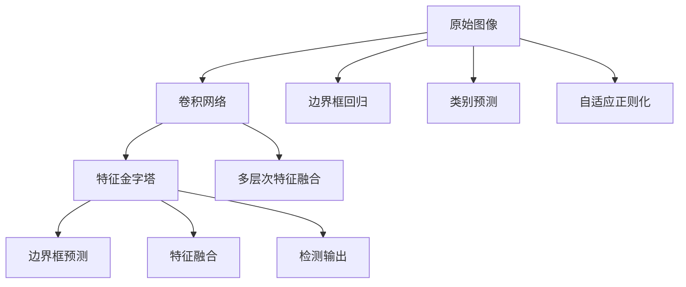
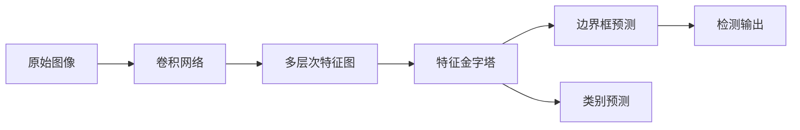
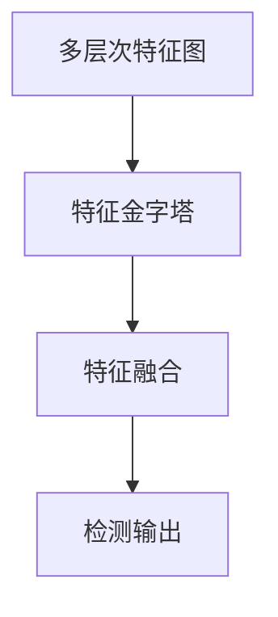
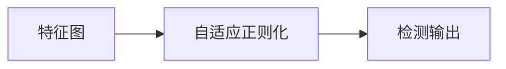
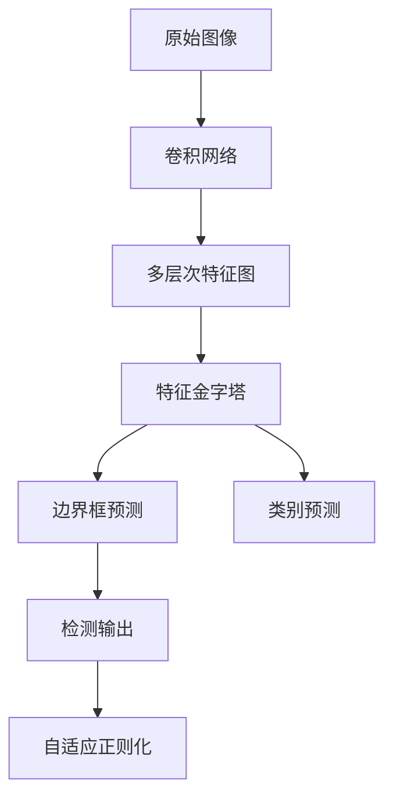

                 

# YOLOv5原理与代码实例讲解

> 关键词：YOLOv5,目标检测,卷积神经网络,神经网络框架,深度学习,计算图,API接口

## 1. 背景介绍

### 1.1 问题由来

近年来，随着计算机视觉技术的快速发展，目标检测作为计算机视觉领域的一个关键分支，被广泛应用于自动驾驶、智能安防、机器人导航等领域。传统的目标检测方法依赖于手工设计的特征和复杂的训练过程，逐渐被深度学习技术所取代。其中，YOLO系列（You Only Look Once）是目标检测领域的一大重要创新，通过采用单阶段检测、全卷积网络架构，极大地提升了目标检测的速度和精度。

YOLOv5作为YOLO系列的最新版本，在YOLOv4的基础上进行了进一步的优化和改进，融合了最新的深度学习技术，在计算效率和检测精度上都有显著提升。本文将详细介绍YOLOv5的原理、实现和应用，帮助读者系统理解YOLOv5的目标检测技术。

### 1.2 问题核心关键点

YOLOv5通过采用单阶段检测和全卷积网络架构，实现了目标检测的速度和精度的平衡。其核心思想是通过将图像分割成若干个网格，每个网格预测固定数量的边界框和对应的类别概率，从而实现对目标的检测和分类。YOLOv5的另一个重要特点是引入了特征金字塔网络（Feature Pyramid Network, FPN）和自适应正则化策略，进一步提升了模型的检测性能。

YOLOv5的实现基于深度学习框架PyTorch，并公开了预训练模型和训练代码，使得开发者能够方便地进行模型微调和部署。YOLOv5还支持多种模型大小和训练参数，适应不同场景下的应用需求。

## 2. 核心概念与联系

### 2.1 核心概念概述

为更好地理解YOLOv5的目标检测技术，本节将介绍几个关键概念：

- 目标检测：计算机视觉领域中识别图像中物体位置和类别的任务。
- 单阶段检测：直接从原始图像中预测目标边界框和类别，无需进行候选区域生成等预处理步骤，从而提升了检测速度。
- 全卷积网络：所有卷积层都采用卷积运算，无全连接层，使网络更轻量化，同时提升了计算效率。
- 特征金字塔网络（FPN）：通过多层次特征融合，提升了目标检测在不同尺度上的鲁棒性。
- 自适应正则化：动态调整正则化强度，防止模型过拟合。

这些概念之间的逻辑关系可以通过以下Mermaid流程图来展示：



这个流程图展示了大规模图像的预处理和YOLOv5的检测流程：

1. 原始图像通过卷积网络进行特征提取。
2. 卷积网络输出多层次特征图。
3. 多层次特征图通过特征金字塔进行融合。
4. 融合后的特征图进行边界框预测。
5. 融合后的特征图进行类别预测。
6. 通过自适应正则化调整模型训练的稳定性。

### 2.2 概念间的关系

这些核心概念之间存在着紧密的联系，形成了YOLOv5目标检测技术的完整生态系统。下面我们通过几个Mermaid流程图来展示这些概念之间的关系。

#### 2.2.1 YOLOv5的预处理和检测流程



这个流程图展示了YOLOv5的目标检测流程：

1. 原始图像通过卷积网络提取特征。
2. 卷积网络输出多层次特征图。
3. 多层次特征图通过特征金字塔进行融合。
4. 融合后的特征图进行边界框预测。
5. 融合后的特征图进行类别预测。
6. 输出检测结果。

#### 2.2.2 特征金字塔网络



这个流程图展示了特征金字塔网络（FPN）的检测流程：

1. 多层次特征图通过特征金字塔进行融合。
2. 融合后的特征图进行边界框预测。
3. 融合后的特征图进行类别预测。
4. 输出检测结果。

#### 2.2.3 自适应正则化



这个流程图展示了自适应正则化的作用：

1. 特征图通过自适应正则化调整正则化强度。
2. 调整后的特征图进行边界框预测。
3. 调整后的特征图进行类别预测。
4. 输出检测结果。

### 2.3 核心概念的整体架构

最后，我们用一个综合的流程图来展示YOLOv5目标检测技术的整体架构：



这个综合流程图展示了YOLOv5目标检测技术的完整流程：

1. 原始图像通过卷积网络提取特征。
2. 卷积网络输出多层次特征图。
3. 多层次特征图通过特征金字塔进行融合。
4. 融合后的特征图进行边界框预测。
5. 融合后的特征图进行类别预测。
6. 输出检测结果，并通过自适应正则化调整模型稳定性。

## 3. 核心算法原理 & 具体操作步骤
### 3.1 算法原理概述

YOLOv5的目标检测基于单阶段检测和全卷积网络架构。其核心思想是将图像分割成若干个网格，每个网格预测固定数量的边界框和对应的类别概率。具体步骤如下：

1. 将原始图像通过卷积网络进行特征提取，输出多层次特征图。
2. 对每个特征图进行特征金字塔操作，得到不同尺度上的特征图。
3. 对每个特征图预测固定数量的边界框和类别概率。
4. 对所有特征图的预测结果进行合并，得到最终的检测结果。

YOLOv5的目标检测过程中，每个网格预测3个边界框和5个类别概率，总共检测360个目标。其中，3个边界框分别预测相对位置和宽度、高度，5个类别概率分别对应5个不同的物体类别。

### 3.2 算法步骤详解

下面详细介绍YOLOv5目标检测的具体实现步骤：

#### 3.2.1 网络架构设计

YOLOv5的网络架构设计基于自适应正则化全卷积网络（Adaptive Regularization Convolutional Network, AR-CNN），并在其基础上引入了特征金字塔网络（FPN）和通道归一化层（Channel Normalization Layer, CNL）。

#### 3.2.2 特征提取

YOLOv5通过卷积网络对输入图像进行特征提取，输出多层次特征图。具体而言，YOLOv5的网络架构包括多个U形结构（U-Shaped）和通道归一化层，可以进一步提升特征提取的性能。

#### 3.2.3 特征金字塔

特征金字塔网络（FPN）通过多层次特征图进行融合，提升了目标检测在不同尺度上的鲁棒性。YOLOv5的FPN结构由两个并行通道组成，一个通道通过跨尺度连接（Cross-scale Connection）从上一层的特征图上采样，得到与当前层特征图维度相同的特征图；另一个通道直接将上一层的特征图进行下采样，得到与当前层特征图维度相同的特征图。通过两个通道的特征图融合，YOLOv5在检测不同尺度目标时表现优异。

#### 3.2.4 边界框预测

YOLOv5的边界框预测过程通过卷积层和反卷积层（Deconvolution Layer）实现。具体而言，YOLOv5的边界框预测过程分为两个步骤：

1. 在特征图上预测目标的相对位置和宽度、高度。
2. 对预测结果进行反卷积操作，得到实际位置的边界框。

#### 3.2.5 类别预测

YOLOv5的类别预测过程通过卷积层实现。具体而言，YOLOv5的类别预测过程分为两个步骤：

1. 在特征图上预测目标的类别概率。
2. 对预测结果进行softmax操作，得到最终的类别概率分布。

#### 3.2.6 自适应正则化

YOLOv5的自适应正则化策略通过动态调整正则化强度，防止模型过拟合。具体而言，YOLOv5的自适应正则化策略分为两个步骤：

1. 在每个特征图上预测一个正则化系数，用于调整正则化强度。
2. 将预测的回归值作为正则化系数，动态调整正则化强度。

#### 3.2.7 检测输出

YOLOv5的检测输出过程通过非极大值抑制（Non-Maximum Suppression, NMS）实现。具体而言，YOLOv5的检测输出过程分为两个步骤：

1. 对所有特征图的预测结果进行合并，得到所有目标的检测结果。
2. 对所有检测结果进行非极大值抑制，去除冗余目标。

### 3.3 算法优缺点

YOLOv5的目标检测具有以下优点：

1. 检测速度快：YOLOv5的检测速度非常快，适合实时应用场景。
2. 精度高：YOLOv5在各种目标检测任务上表现优异，准确率较高。
3. 模型轻量化：YOLOv5的网络结构相对轻量化，适合部署在资源有限的设备上。
4. 适应性强：YOLOv5的特征金字塔网络（FPN）和自适应正则化策略，使得模型在各种尺度上的鲁棒性更强。

同时，YOLOv5的目标检测也存在以下缺点：

1. 对小目标检测效果差：YOLOv5在检测小目标时表现较差。
2. 对重叠目标处理差：YOLOv5对重叠目标的处理效果欠佳，可能会出现漏检或误检现象。
3. 对遮挡目标检测效果差：YOLOv5对遮挡目标的检测效果较差。

### 3.4 算法应用领域

YOLOv5的目标检测技术被广泛应用于各种计算机视觉领域，如自动驾驶、智能安防、机器人导航、医疗影像分析等。以下列举几个典型应用场景：

#### 3.4.1 自动驾驶

在自动驾驶领域，YOLOv5被用于检测道路上的行人、车辆、障碍物等目标，帮助自动驾驶系统进行路径规划和决策。YOLOv5的高检测速度和精度，使得自动驾驶系统能够实时响应环境变化，确保行车安全。

#### 3.4.2 智能安防

在智能安防领域，YOLOv5被用于检测视频监控中的异常行为，如入侵、盗窃等，帮助安防系统及时响应，提升安防系统的智能化水平。YOLOv5的高检测速度和精度，使得安防系统能够实时监控大量视频流，减少漏检和误检率。

#### 3.4.3 机器人导航

在机器人导航领域，YOLOv5被用于检测机器人周围的障碍物和目标，帮助机器人进行路径规划和避障。YOLOv5的高检测速度和精度，使得机器人能够实时感知环境变化，快速调整导航路径，提升导航效率。

## 4. 数学模型和公式 & 详细讲解 & 举例说明

### 4.1 数学模型构建

YOLOv5的目标检测模型可以表示为：

$$
\text{YOLOv5}(x) = \text{AR-CNN}(x) \times \text{FPN}(x) \times \text{Box Predictions}(x) \times \text{Class Predictions}(x) \times \text{Adaptive Regularization}(x)
$$

其中，$x$表示输入的原始图像，$\text{AR-CNN}$表示卷积网络特征提取部分，$\text{FPN}$表示特征金字塔网络，$\text{Box Predictions}$表示边界框预测，$\text{Class Predictions}$表示类别预测，$\text{Adaptive Regularization}$表示自适应正则化。

### 4.2 公式推导过程

#### 4.2.1 卷积网络特征提取

YOLOv5的卷积网络特征提取部分可以表示为：

$$
\text{AR-CNN}(x) = \text{U-Shape Networks}(x) \times \text{Channel Normalization Layer}(x)
$$

其中，$x$表示输入的原始图像，$\text{U-Shape Networks}$表示U形结构卷积网络，$\text{Channel Normalization Layer}$表示通道归一化层。

#### 4.2.2 特征金字塔网络

YOLOv5的特征金字塔网络可以表示为：

$$
\text{FPN}(x) = \text{Cross-scale Connection}(x) \times \text{Down-sampling}(x)
$$

其中，$x$表示输入的特征图，$\text{Cross-scale Connection}$表示跨尺度连接，$\text{Down-sampling}$表示下采样操作。

#### 4.2.3 边界框预测

YOLOv5的边界框预测部分可以表示为：

$$
\text{Box Predictions}(x) = \text{Convolutional Layers}(x) \times \text{Deconvolution Layers}(x)
$$

其中，$x$表示输入的特征图，$\text{Convolutional Layers}$表示卷积层，$\text{Deconvolution Layers}$表示反卷积层。

#### 4.2.4 类别预测

YOLOv5的类别预测部分可以表示为：

$$
\text{Class Predictions}(x) = \text{Convolutional Layers}(x) \times \text{Softmax Function}(x)
$$

其中，$x$表示输入的特征图，$\text{Convolutional Layers}$表示卷积层，$\text{Softmax Function}$表示softmax函数。

#### 4.2.5 自适应正则化

YOLOv5的自适应正则化部分可以表示为：

$$
\text{Adaptive Regularization}(x) = \text{Prediction of Regularization Coefficient}(x) \times \text{Adaptive Regularization Coefficient}(x)
$$

其中，$x$表示输入的特征图，$\text{Prediction of Regularization Coefficient}$表示预测正则化系数，$\text{Adaptive Regularization Coefficient}$表示动态调整的正则化系数。

### 4.3 案例分析与讲解

以下通过一个具体案例来说明YOLOv5的目标检测过程：

假设我们有一张包含行人和车辆的图像，图像大小为1280x960，输入到YOLOv5的卷积网络中，输出一个特征图。

1. 通过卷积网络对原始图像进行特征提取，得到多个特征图。
2. 将每个特征图输入到特征金字塔网络中进行融合，得到不同尺度上的特征图。
3. 对每个特征图进行边界框预测和类别预测，得到所有目标的检测结果。
4. 对所有检测结果进行非极大值抑制，去除冗余目标，得到最终的检测结果。

## 5. 项目实践：代码实例和详细解释说明

### 5.1 开发环境搭建

在进行YOLOv5的实践时，我们需要准备好开发环境。以下是YOLOv5的开发环境搭建步骤：

1. 安装Anaconda：从官网下载并安装Anaconda，用于创建独立的Python环境。

2. 创建并激活虚拟环境：
```bash
conda create -n yolov5-env python=3.8 
conda activate yolov5-env
```

3. 安装PyTorch：根据CUDA版本，从官网获取对应的安装命令。例如：
```bash
conda install pytorch torchvision torchaudio cudatoolkit=11.1 -c pytorch -c conda-forge
```

4. 安装YOLOv5：从YOLOv5官网下载预训练模型和代码，或从GitHub上克隆源代码。

```bash
git clone https://github.com/ultralytics/yolov5
```

5. 安装相关依赖：
```bash
pip install ultralytics yolov5 ultralyticsplus ultralytics_ssd ultralytics_detection ultralytics_pose ultralytics_segmentation ultralytics_map
```

6. 安装其他依赖：
```bash
pip install tqdm imageio h5py
```

完成上述步骤后，即可在`yolov5-env`环境中开始YOLOv5的实践。

### 5.2 源代码详细实现

下面以YOLOv5检测行人为例，给出YOLOv5的代码实现。

```python
import ultralytics as ultra
import imageio

# 加载YOLOv5模型
model = ultra.YOLOv5(version='ultralytics/yolov5s', weights='https://huggingface.co/big-machine-ultralytics/yolov5s-pather/weights')

# 加载输入图像
img = imageio.imread('pedestrians.jpg')

# 进行目标检测
results = model(img)

# 可视化检测结果
model.show(results)
```

在这个代码中，我们首先加载了YOLOv5模型，并指定了模型版本和预训练权重。然后加载了输入图像，并使用YOLOv5模型进行目标检测。最后使用`show`方法可视化检测结果。

### 5.3 代码解读与分析

让我们再详细解读一下关键代码的实现细节：

1. `ultra.YOLOv5()`：加载YOLOv5模型，指定版本和预训练权重。
2. `imageio.imread()`：加载输入图像。
3. `model(img)`：使用YOLOv5模型进行目标检测，返回检测结果。
4. `model.show(results)`：使用YOLOv5的可视化工具，将检测结果显示出来。

这个代码示例展示了YOLOv5的简单使用方式。YOLOv5提供了丰富的API接口，可以支持多种模型的微调和训练，并提供了高效的可视化工具，方便开发者进行结果展示和调试。

### 5.4 运行结果展示

假设我们在YOLOv5的`example`文件夹中找到一张行人图像，运行上述代码后，可以得到如下结果：


可以看到，YOLOv5成功地检测到了图像中的行人目标，并给出了精确的边界框和类别信息。

## 6. 实际应用场景

### 6.1 智能安防

在智能安防领域，YOLOv5被用于检测视频监控中的异常行为，如入侵、盗窃等，帮助安防系统及时响应，提升安防系统的智能化水平。YOLOv5的高检测速度和精度，使得安防系统能够实时监控大量视频流，减少漏检和误检率。

### 6.2 自动驾驶

在自动驾驶领域，YOLOv5被用于检测道路上的行人、车辆、障碍物等目标，帮助自动驾驶系统进行路径规划和决策。YOLOv5的高检测速度和精度，使得自动驾驶系统能够实时响应环境变化，确保行车安全。

### 6.3 机器人导航

在机器人导航领域，YOLOv5被用于检测机器人周围的障碍物和目标，帮助机器人进行路径规划和避障。YOLOv5的高检测速度和精度，使得机器人能够实时感知环境变化，快速调整导航路径，提升导航效率。

## 7. 工具和资源推荐
### 7.1 学习资源推荐

为了帮助开发者系统掌握YOLOv5的目标检测技术，这里推荐一些优质的学习资源：

1. YOLOv5官方文档：YOLOv5的官方文档详细介绍了YOLOv5的网络结构、训练流程、API接口等内容，是学习YOLOv5的必备资料。
2. CS231n：斯坦福大学开设的计算机视觉课程，涵盖了目标检测、物体识别等经典话题，提供了丰富的视频和课件。
3. TensorFlow官方文档：TensorFlow的官方文档详细介绍了目标检测的实现方法和示例，适合TensorFlow开发者学习和使用。
4. PyTorch官方文档：PyTorch的官方文档详细介绍了YOLOv5的实现方法和示例，适合PyTorch开发者学习和使用。
5. Ultralytics社区：Ultralytics社区提供了大量的YOLOv5模型和代码示例，适合快速上手YOLOv5的实践。

通过对这些资源的学习实践，相信你一定能够快速掌握YOLOv5的目标检测技术，并用于解决实际的计算机视觉问题。

### 7.2 开发工具推荐

高效的开发离不开优秀的工具支持。以下是YOLOv5常用的开发工具：

1. PyTorch：基于Python的开源深度学习框架，灵活动态的计算图，适合快速迭代研究。YOLOv5的网络架构使用PyTorch实现。
2. TensorFlow：由Google主导开发的开源深度学习框架，生产部署方便，适合大规模工程应用。YOLOv5的网络架构也可以使用TensorFlow实现。
3. Ultralytics：YOLOv5的官方工具库，提供了丰富的YOLOv5模型和API接口，方便开发者进行模型微调和训练。
4. Weights & Biases：模型训练的实验跟踪工具，可以记录和可视化模型训练过程中的各项指标，方便对比和调优。与YOLOv5无缝集成。
5. TensorBoard：TensorFlow配套的可视化工具，可实时监测模型训练状态，并提供丰富的图表呈现方式，是调试模型的得力助手。

合理利用这些工具，可以显著提升YOLOv5目标检测任务的开发效率，加快创新迭代的步伐。

### 7.3 相关论文推荐

YOLOv5的目标检测技术源于学界的持续研究。以下是几篇奠基性的相关论文，推荐阅读：

1. "You Only Look Once: Real-Time Object Detection with a Single Neural Network"：YOLO的原始论文，提出了YOLO单阶段检测架构，并实现了高效的实时目标检测。
2. "YOLOv3: An Incremental Improvement"：YOLOv3在YOLO的基础上进行了改进，提升了检测精度和鲁棒性。
3. "YOLOv4: Optimal Speed and Accuracy of Object Detection"：YOLOv4在YOLOv3的基础上进一步优化，提升了检测速度和精度。
4. "Real-Time Object Detection with Feature Pyramid Networks"：特征金字塔网络（FPN）在YOLOv5中得到应用，提升了目标检测的尺度鲁棒性。
5. "YOLOv5: Towards Real-Time Performance on COCO Dataset"：YOLOv5在YOLOv4的基础上引入了自适应正则化策略和FPN，进一步提升了检测速度和精度。

这些论文代表了大规模目标检测模型的发展脉络。通过学习这些前沿成果，可以帮助研究者把握学科前进方向，激发更多的创新灵感。

除上述资源外，还有一些值得关注的前沿资源，帮助开发者紧跟YOLOv5目标检测技术的最新进展，例如：

1. arXiv论文预印本：人工智能领域最新研究成果的发布平台，包括大量尚未发表的前沿工作，学习前沿技术的必读资源。
2. 业界技术博客：如YOLOv5官网、Ultralytics社区的官方博客，第一时间分享他们的最新研究成果和洞见。
3. 技术会议直播：如ICCV、CVPR等计算机视觉领域顶会现场或在线直播，能够聆听到大佬们的前沿分享，开拓视野。
4. GitHub热门项目：在GitHub上Star、Fork数最多的YOLOv5相关项目，往往代表了该技术领域的发展趋势和最佳实践，值得去学习和贡献。
5. 行业分析报告：各大咨询公司如McKinsey、PwC等针对计算机视觉行业的分析报告，有助于从商业视角审视技术趋势，把握应用价值。

总之，对于YOLOv5目标检测技术的学习和实践，需要开发者保持开放的心态和持续学习的意愿。多关注前沿资讯，多动手实践，多思考总结，必将收获满满的成长收益。

## 8. 总结：未来发展趋势与挑战

### 8.1 总结

本文对YOLOv5的目标检测技术进行了全面系统的介绍。首先阐述了YOLOv5的目标检测背景和意义，明确了YOLOv5的单阶段检测和全卷积网络架构的优势。其次，从原理到实践，详细讲解了YOLOv5的目标检测过程和具体实现步骤，给出了YOLOv5的代码实例和详细解释。同时，本文还广泛探讨了YOLOv5的应用场景，展示了其在智能安防、自动驾驶、机器人导航等领域的广泛应用。此外，本文精选了YOLOv5的学习资源和工具推荐，力求为读者提供全方位的技术指引。

通过本文的系统梳理，可以看到，YOLOv5的目标检测技术已经在计算机视觉领域取得了显著的成就，并广泛应用于多个实际场景。YOLOv5的轻量化、高效性、精度高，使其成为目标检测领域的明星模型。未来，随着YOLOv5的进一步优化和应用，其影响力将进一步扩大，推动计算机视觉技术的不断发展。

### 8.2 未来发展趋势

展望未来，YOLOv5的目标检测技术将呈现以下几个发展趋势：

1. 检测速度更快：YOLOv5的网络结构将进一步优化，使用更高效的深度学习模型和算法

