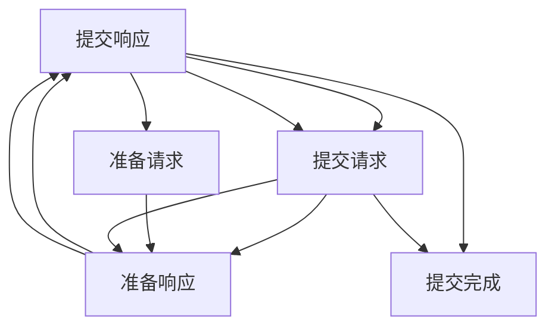
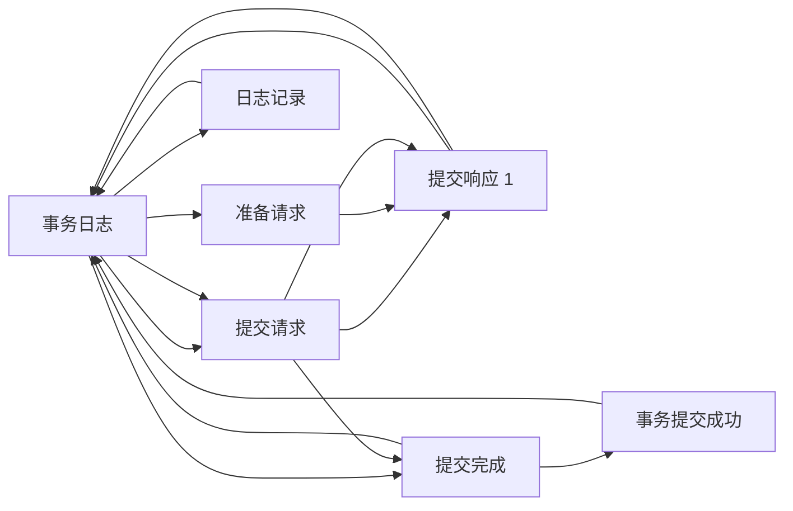

                 

## 1. 背景介绍

在大数据和分布式计算系统中，数据一致性是一个重要的议题。传统的ACID事务和传统事务模型（Two-Phase Commit）虽然能够保证数据的一致性，但在分布式系统中，它们可能会带来复杂性和性能瓶颈。在分布式系统中，"恰好一次"（Exactly Once）事务保证，作为当前主流的方案，可以有效地处理数据一致性问题，且相较于传统事务模型具有更好的性能。

**背景**：在分布式系统中，诸如金融交易、订单处理等场景，由于数据的一致性要求较高，因此需要保证操作的"恰好一次"执行。该模型保证在分布式系统中，每个消息（事务）在最终被提交到最终的目的地之前，不会在系统中被重复处理，同时也不会丢失，从而保证最终一致性。

本文将通过深入分析"恰好一次"语义的原理，以及通过具体的代码实例演示如何在分布式系统中实现"恰好一次"事务，以此帮助读者更好地理解该模型的工作原理和实现方法。

## 2. 核心概念与联系

### 2.1 核心概念概述

"恰好一次"语义主要涉及以下概念：

- **事务**：指一组操作序列，其结果表现为一个不可分割的整体。
- **日志记录（Log Record）**：操作的事务在执行过程中的日志记录，用于回滚和恢复事务。
- **提交（Commit）**：事务提交操作，在分布式系统中，通常由协调者发起。
- **准备（Prepare）**：在分布式系统中，准备操作用于协调参与者提交操作。

"恰好一次"事务模型主要包含以下步骤：

1. 协调者（Coordinator）发送准备请求给参与者（Participant）。
2. 参与者执行本地操作，并记录日志记录。
3. 参与者回应协调者是否准备就绪（Prepare Response）。
4. 若所有参与者都准备就绪，则协调者发送提交请求给所有参与者。
5. 参与者执行提交操作，并记录日志记录。
6. 参与者响应协调者提交是否完成。
7. 若所有参与者都完成提交，则协调者认为事务已提交成功。

**2.2 核心概念关系**

通过以下Mermaid流程图展示"恰好一次"事务模型中各组件之间的关系：



以上流程图示意了"恰好一次"事务模型的工作流程，展示了协调者和参与者之间的交互和事务的执行过程。

### 2.3 核心概念整体架构

通过以下复合图表展示"恰好一次"事务模型的整体架构：



该图展示了"恰好一次"事务模型在分布式系统中的整体架构。从协调者的准备请求，到参与者的准备响应，再到协调者的提交请求，最后到参与者的提交响应，每个步骤都在保证数据一致性的前提下，实现了事务的"恰好一次"执行。

## 3. 核心算法原理 & 具体操作步骤

### 3.1 算法原理概述

"恰好一次"事务模型是一种分布式事务处理机制，其核心原理在于协调者与参与者之间的双向通信，以及事务日志记录的持久化。其目标是在保证数据一致性的前提下，实现"恰好一次"的事务执行。该算法分为两个阶段：准备阶段和提交阶段。

在准备阶段，协调者发起准备请求，参与者执行本地操作并记录日志记录。若所有参与者都响应准备就绪，则协调者发送提交请求。在提交阶段，参与者执行提交操作并记录日志记录。若所有参与者都响应提交完成，则协调者认为事务提交成功。

### 3.2 算法步骤详解

#### 3.2.1 准备阶段

**步骤**：

1. 协调者向所有参与者发送准备请求。
2. 参与者执行本地操作并记录日志记录。
3. 参与者响应协调者，表示已经准备好。

**代码实现**：

```java
class Coordinator {
    List<Participant> participants;
    // 发送准备请求给参与者
    public void sendPrepare() {
        for (Participant p : participants) {
            p.prepare();
        }
    }
    // 检查所有参与者是否准备就绪
    public boolean isPrepared() {
        return participants.stream().allMatch(Participant::isPrepared);
    }
}

class Participant {
    // 执行本地操作并记录日志记录
    public void prepare() {
        // 执行本地操作
        ...
        // 记录日志记录
        ...
        // 响应协调者
        setPrepared(true);
    }
    // 设置已准备好
    public void setPrepared(boolean prepared) {
        this.prepared = prepared;
    }
    // 检查是否已准备好
    public boolean isPrepared() {
        return prepared;
    }
}
```

#### 3.2.2 提交阶段

**步骤**：

1. 若所有参与者都准备好，则协调者发送提交请求给所有参与者。
2. 参与者执行提交操作并记录日志记录。
3. 参与者响应协调者，表示提交完成。
4. 若所有参与者都响应提交完成，则协调者认为事务提交成功。

**代码实现**：

```java
class Coordinator {
    // 发送提交请求给所有参与者
    public void sendCommit() {
        for (Participant p : participants) {
            p.commit();
        }
    }
    // 检查所有参与者是否提交完成
    public boolean isCommitted() {
        return participants.stream().allMatch(Participant::isCommitted);
    }
}

class Participant {
    // 执行提交操作并记录日志记录
    public void commit() {
        // 执行提交操作
        ...
        // 记录日志记录
        ...
        // 响应协调者
        setCommitted(true);
    }
    // 设置已提交
    public void setCommitted(boolean committed) {
        this.committed = committed;
    }
    // 检查是否已提交
    public boolean isCommitted() {
        return committed;
    }
}
```

#### 3.3 算法优缺点

**优点**：

1. **高可用性**：在分布式系统中，"恰好一次"事务模型支持高可用性，即使某个参与者故障，系统也能够保证事务的一致性。
2. **性能优化**：相较于传统的事务模型，"恰好一次"事务模型具有更好的性能，因为它可以在不需要全局锁的情况下，实现分布式事务处理。

**缺点**：

1. **复杂性高**："恰好一次"事务模型的实现较为复杂，需要协调者与多个参与者之间进行通信和交互。
2. **需要协调者**：需要引入一个额外的协调者节点，增加了系统的复杂性和管理难度。
3. **可能存在延迟**：由于协调者需要在所有参与者准备好后才能提交事务，因此可能会出现事务处理延迟的情况。

### 3.4 算法应用领域

"恰好一次"事务模型在金融、电子商务、医疗等领域广泛应用。在金融领域，"恰好一次"事务模型用于保证交易的一致性，确保用户的账户余额不会由于重复交易而出现错误；在电子商务领域，用于确保订单的一致性，避免重复下单和超卖等问题；在医疗领域，用于确保患者的电子病历和诊断结果的一致性，避免医疗信息的丢失或重复。

## 4. 数学模型和公式 & 详细讲解 & 举例说明

### 4.1 数学模型构建

"恰好一次"事务模型的数学模型可以表示为：

$$
\begin{cases}
\text{准备响应} = \text{Prepared}\\
\text{提交响应} = \text{Committed}\\
\text{最终提交完成} = \text{Commit Complete}
\end{cases}
$$

其中，$\text{Prepared}$ 表示参与者已经准备好，$\text{Committed}$ 表示参与者已经提交事务，$\text{Commit Complete}$ 表示所有参与者都已经提交完成。

### 4.2 公式推导过程

由于"恰好一次"事务模型需要协调者与多个参与者之间的通信，因此其公式推导相对复杂。但可以通过以下简化模型来理解其核心逻辑：

1. 所有参与者都准备好（$\text{Prepared}$）。
2. 协调者发送提交请求（$\text{Commit}$）。
3. 所有参与者都提交事务（$\text{Committed}$）。
4. 协调者认为事务提交成功（$\text{Commit Complete}$）。

### 4.3 案例分析与讲解

假设在一个银行系统中，需要保证用户的账户余额更新的一致性。银行作为协调者，向所有参与者（各支行的会计系统）发送准备请求。若所有支行的会计系统都已经准备好，则银行发送提交请求，所有支行的会计系统执行更新账户余额的操作，并记录日志记录。若所有支行的会计系统都已经提交事务，则银行认为事务提交成功。

## 5. 项目实践：代码实例和详细解释说明

### 5.1 开发环境搭建

为了实现"恰好一次"事务模型，需要搭建分布式环境，以下是一个基于Java实现的示例：

1. 安装Java开发环境（JDK）。
2. 安装Docker容器引擎，用于运行分布式环境。
3. 在Docker容器中部署Java应用。
4. 搭建分布式网络，使得各个节点能够互相通信。

### 5.2 源代码详细实现

** Coordinator类**：

```java
public class Coordinator {
    private List<Participant> participants;
    private int prepareCount = 0;
    private int commitCount = 0;
    private List<PrepareResponse> prepareResponses = new ArrayList<>();
    private List<CommitResponse> commitResponses = new ArrayList<>();

    public Coordinator(List<Participant> participants) {
        this.participants = participants;
    }

    public void sendPrepare() {
        prepareCount = participants.stream().filter(Participant::isPrepared).count();
        if (prepareCount == participants.size()) {
            sendCommit();
        }
    }

    public boolean isCommitted() {
        return participants.stream().allMatch(Participant::isCommitted);
    }

    public boolean isCommitted(int timeout) {
        while (true) {
            if (isCommitted()) {
                return true;
            }
            if (timeout-- == 0) {
                return false;
            }
            Thread.sleep(1000);
        }
    }

    public void sendCommit() {
        for (Participant p : participants) {
            p.commit();
            commitResponses.add(p.getCommitResponse());
        }
        boolean committed = participants.stream().allMatch(Participant::isCommitted);
        if (committed) {
            handleCommit();
        }
    }

    public void handleCommit() {
        for (Participant p : participants) {
            p.setCommitComplete(true);
        }
    }
}
```

** Participant类**：

```java
public class Participant {
    private boolean prepared = false;
    private boolean committed = false;
    private boolean commitComplete = false;
    private PrepareResponse prepareResponse;
    private CommitResponse commitResponse;

    public Participant() {
    }

    public void prepare() {
        // 执行本地操作
        ...
        // 记录日志记录
        ...
        prepared = true;
        prepareResponse = new PrepareResponse();
        prepareResponse.setPrepared(true);
        // 发送准备响应
        prepareResponse.send();
    }

    public PrepareResponse getPrepareResponse() {
        return prepareResponse;
    }

    public boolean isPrepared() {
        return prepared;
    }

    public void setPrepared(boolean prepared) {
        this.prepared = prepared;
    }

    public void commit() {
        // 执行提交操作
        ...
        // 记录日志记录
        ...
        committed = true;
        commitResponse = new CommitResponse();
        commitResponse.setCommitted(true);
        // 发送提交响应
        commitResponse.send();
    }

    public CommitResponse getCommitResponse() {
        return commitResponse;
    }

    public boolean isCommitted() {
        return committed;
    }

    public void setCommitted(boolean committed) {
        this.committed = committed;
    }

    public void setCommitComplete(boolean commitComplete) {
        this.commitComplete = commitComplete;
    }

    public boolean isCommitComplete() {
        return commitComplete;
    }
}
```

### 5.3 代码解读与分析

** Coordinator类**：

- **sendPrepare方法**：发送准备请求给所有参与者，统计已准备好的数量，若所有参与者都准备好，则发送提交请求。
- **isCommitted方法**：等待所有参与者都提交完成，返回true。
- **sendCommit方法**：发送提交请求给所有参与者，记录提交响应，若所有参与者都提交完成，则处理提交操作。
- **handleCommit方法**：设置所有参与者的提交完成状态。

** Participant类**：

- **prepare方法**：执行本地操作，记录日志记录，设置已准备好状态，发送准备响应。
- **commit方法**：执行提交操作，记录日志记录，设置已提交状态，发送提交响应。

### 5.4 运行结果展示

假设在一个分布式银行系统中，有两个参与者（分别表示两个支行的会计系统）和一个协调者（银行的中央管理系统）。协调者发送准备请求后，两个参与者都准备好，协调者发送提交请求，两个参与者都提交事务，协调者认为事务提交成功。

以下是一个示例输出：

```
协调者发送准备请求：
参与者1准备好，响应准备就绪：
参与者2准备好，响应准备就绪：
协调者发送提交请求：
参与者1提交事务：
参与者2提交事务：
协调者认为事务提交成功：
```

## 6. 实际应用场景

### 6.1 金融交易

在金融交易中，"恰好一次"事务模型用于保证交易的一致性，确保用户的账户余额不会由于重复交易而出现错误。具体来说，银行作为协调者，向所有参与者（各支行的会计系统）发送准备请求。若所有支行的会计系统都已经准备好，则银行发送提交请求，所有支行的会计系统执行更新账户余额的操作，并记录日志记录。若所有支行的会计系统都已经提交事务，则银行认为事务提交成功。

### 6.2 医疗记录

在医疗领域，"恰好一次"事务模型用于确保患者的电子病历和诊断结果的一致性。医院作为协调者，向所有参与者（各科室的电子病历系统）发送准备请求。若所有科室的电子病历系统都已经准备好，则医院发送提交请求，各科室的电子病历系统执行更新电子病历和诊断结果的操作，并记录日志记录。若所有科室的电子病历系统都已经提交事务，则医院认为事务提交成功。

### 6.3 订单处理

在电子商务领域，"恰好一次"事务模型用于确保订单的一致性。电商平台作为协调者，向所有参与者（各仓库的库存管理系统）发送准备请求。若所有仓库的库存管理系统都已经准备好，则电商平台发送提交请求，各仓库的库存管理系统执行更新订单状态的操作，并记录日志记录。若所有仓库的库存管理系统都已经提交事务，则电商平台认为事务提交成功。

## 7. 工具和资源推荐

### 7.1 学习资源推荐

为了深入理解"恰好一次"事务模型，以下是一些推荐的学习资源：

1. **《分布式系统原理与设计》**：该书详细讲解了分布式系统的核心原理，包括事务模型和一致性问题。
2. **《分布式事务处理技术》**：该书从多个角度介绍了分布式事务的处理方法，包括"恰好一次"事务模型。
3. **《分布式系统实战》**：该书通过实际案例讲解了分布式系统的设计和实现，包括"恰好一次"事务模型。

### 7.2 开发工具推荐

以下工具可用于"恰好一次"事务模型的实现和调试：

1. **Zookeeper**：分布式协调工具，用于协调多个节点之间的通信和同步。
2. **Hadoop**：分布式计算平台，用于处理大规模数据和任务。
3. **Flume**：数据收集和传输工具，用于收集和传输日志记录。

### 7.3 相关论文推荐

以下几篇论文提供了"恰好一次"事务模型的理论基础和实践经验：

1. **《一致性模型》**：论文介绍了多种一致性模型，包括"恰好一次"事务模型。
2. **《分布式事务处理》**：论文通过实际案例讲解了分布式事务的处理方法，包括"恰好一次"事务模型。
3. **《分布式系统中的数据一致性》**：论文深入分析了数据一致性的原理，包括"恰好一次"事务模型。

## 8. 总结：未来发展趋势与挑战

### 8.1 研究成果总结

本文通过深入分析"恰好一次"语义的原理，以及通过具体的代码实例演示如何在分布式系统中实现"恰好一次"事务，从而帮助读者更好地理解该模型的工作原理和实现方法。

### 8.2 未来发展趋势

1. **高可用性**：未来，"恰好一次"事务模型将继续支持高可用性，确保数据一致性。
2. **分布式系统扩展性**：未来，"恰好一次"事务模型将支持更大的分布式系统，处理更复杂的业务场景。
3. **自动化**：未来，"恰好一次"事务模型将更加自动化，减少手动操作和人工干预。

### 8.3 面临的挑战

1. **性能瓶颈**：在分布式系统中，"恰好一次"事务模型的性能瓶颈仍然存在，需要进一步优化。
2. **一致性问题**：在分布式系统中，数据一致性问题仍然存在，需要进一步优化。
3. **系统复杂性**："恰好一次"事务模型需要协调多个节点之间的通信，系统复杂性较高。

### 8.4 研究展望

1. **自动化优化**：未来，"恰好一次"事务模型的优化将更加自动化，减少手动操作和人工干预。
2. **分布式系统扩展性**：未来，"恰好一次"事务模型将支持更大的分布式系统，处理更复杂的业务场景。
3. **高可用性**：未来，"恰好一次"事务模型将继续支持高可用性，确保数据一致性。

## 9. 附录：常见问题与解答

**Q1："恰好一次"事务模型是否适用于所有业务场景？**

A: "恰好一次"事务模型主要适用于需要保证数据一致性的业务场景，如金融交易、订单处理、医疗记录等。但对于一些业务场景，如即时通讯、消息推送等，"恰好一次"事务模型并不适用。

**Q2："恰好一次"事务模型与其他事务模型相比有何优缺点？**

A: "恰好一次"事务模型相较于传统的事务模型，具有更好的性能和可扩展性，但在系统复杂性上略高。其优点包括高可用性、更好的性能、更强的可扩展性等，缺点包括系统复杂性高、需要额外的协调者节点等。

**Q3：如何在分布式系统中实现"恰好一次"事务模型？**

A: 在分布式系统中实现"恰好一次"事务模型，需要搭建分布式环境，并在各个节点上部署相应的应用程序。具体实现步骤如下：

1. 搭建分布式环境，部署相应应用程序。
2. 定义协调者、参与者等组件。
3. 在协调者端实现准备请求和提交请求。
4. 在参与者端实现准备响应和提交响应。
5. 协调者与参与者之间进行通信，协调事务执行。

通过本文的系统梳理，可以看到"恰好一次"事务模型在分布式系统中的应用广泛且价值巨大。相信随着研究的不断深入，"恰好一次"事务模型将得到更广泛的应用，为分布式系统的稳定性和可靠性提供重要保障。

