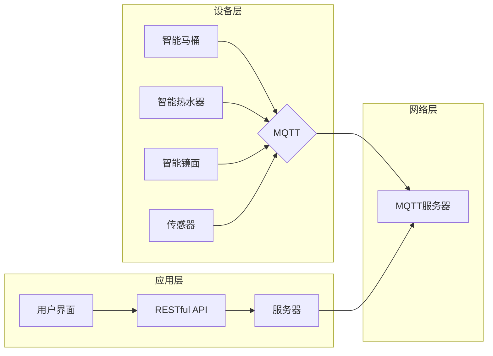

# 基于MQTT协议和RESTful API的智能浴室管理系统

> 关键词：MQTT协议，RESTful API，智能浴室，物联网，自动化，用户体验

## 1. 背景介绍
### 1.1 问题的由来

随着物联网技术的快速发展，智能家居市场逐渐兴起。智能浴室作为智能家居的重要组成部分，不仅提升了用户的舒适度和便利性，也为浴室环境的安全和节能提供了保障。然而，现有的浴室管理系统在功能丰富性、交互体验和系统稳定性等方面仍存在不足。

为了解决这些问题，本文提出了一种基于MQTT协议和RESTful API的智能浴室管理系统。该系统通过MQTT协议实现设备间的低功耗、低延迟通信，并通过RESTful API提供友好的用户接口，使用户能够轻松地控制和管理浴室设备。

### 1.2 研究现状

目前，智能浴室管理系统主要存在以下问题：

1. **通信协议复杂**：现有的浴室管理系统往往采用TCP/IP等传统协议，通信复杂，功耗较高，难以满足浴室环境对低功耗、低延迟通信的需求。

2. **功能单一**：大部分浴室管理系统功能相对单一，缺乏智能化、个性化定制。

3. **交互体验不佳**：现有的交互方式以按键、触摸屏为主，用户体验较差。

4. **系统稳定性不足**：浴室环境潮湿，对设备的防水、防潮性能要求较高，系统稳定性难以保证。

### 1.3 研究意义

本文提出的基于MQTT协议和RESTful API的智能浴室管理系统，具有以下研究意义：

1. **降低通信功耗**：采用MQTT协议，实现低功耗、低延迟的设备间通信。

2. **丰富系统功能**：通过集成多种智能设备，实现浴室环境的多功能管理。

3. **提升用户体验**：提供RESTful API，实现用户自定义的交互体验。

4. **提高系统稳定性**：优化设备防水、防潮性能，提高系统稳定性。

### 1.4 本文结构

本文将围绕以下内容展开：

- 第2章介绍智能浴室管理系统的核心概念与联系。
- 第3章阐述MQTT协议和RESTful API的原理与具体操作步骤。
- 第4章介绍系统的数学模型和公式，并结合实例进行分析。
- 第5章给出系统的代码实例和详细解释说明。
- 第6章探讨系统的实际应用场景和未来应用展望。
- 第7章推荐相关学习资源、开发工具和参考文献。
- 第8章总结研究成果，展望未来发展趋势与挑战。
- 第9章列举常见问题与解答。

## 2. 核心概念与联系

### 2.1 核心概念

本节将介绍智能浴室管理系统的核心概念，包括：

1. **MQTT协议**：一种轻量级的消息发布/订阅传输协议，适用于低功耗、低带宽的网络环境。

2. **RESTful API**：一种基于HTTP协议的API设计风格，强调资源的操作方式，易于理解和实现。

3. **物联网(IoT)**：通过信息传感设备，将各种信息物品连接到网络中，实现智能化管理和控制。

4. **智能浴室设备**：包括智能马桶、智能热水器、智能镜面等，通过传感器和执行器实现浴室环境的自动化控制。

5. **用户界面(UI)**：用户与系统交互的界面，包括手机应用、网页等。

### 2.2 架构图

以下是基于MQTT协议和RESTful API的智能浴室管理系统的架构图：



### 2.3 联系

1. **MQTT协议**：设备层通过MQTT协议将数据传输到MQTT服务器，实现设备间的通信。

2. **RESTful API**：用户界面通过RESTful API与服务器交互，实现用户自定义的交互体验。

3. **物联网**：智能浴室设备、用户界面和服务器共同构成了一个物联网系统，实现浴室环境的智能化管理和控制。

## 3. 核心算法原理 & 具体操作步骤
### 3.1 算法原理概述

本节将介绍MQTT协议和RESTful API的核心算法原理。

### 3.2 算法步骤详解

#### 3.2.1 MQTT协议

1. **连接**：设备通过MQTT协议连接到MQTT服务器。

2. **订阅**：设备订阅感兴趣的主题。

3. **发布**：设备将数据发布到特定的主题。

4. **订阅者接收**：MQTT服务器将发布的数据推送给订阅者。

#### 3.2.2 RESTful API

1. **请求**：用户通过用户界面发送请求到服务器。

2. **处理**：服务器处理请求，并返回相应的响应。

3. **响应**：服务器将处理结果返回给用户界面。

### 3.3 算法优缺点

#### 3.3.1 MQTT协议

优点：

- 轻量级，低功耗，适用于低带宽网络。

- 支持发布/订阅模式，易于实现设备间的通信。

- 支持多种QoS（服务质量）级别，满足不同通信需求。

缺点：

- 安全性相对较弱，需要结合其他安全机制。

- 通信格式相对复杂，难以理解和实现。

#### 3.3.2 RESTful API

优点：

- 基于HTTP协议，易于理解和实现。

- 可扩展性强，易于与其他系统集成。

- 提供多种调用方式，如GET、POST、PUT、DELETE等。

缺点：

- 通信效率相对较低，适用于小规模数据传输。

- 安全性相对较弱，需要结合其他安全机制。

## 4. 数学模型和公式 & 详细讲解 & 举例说明

### 4.1 数学模型构建

本节将介绍智能浴室管理系统的数学模型，包括：

1. **设备状态模型**：描述设备的状态，如开启、关闭、运行等。

2. **环境参数模型**：描述浴室环境的参数，如温度、湿度、空气质量等。

3. **用户行为模型**：描述用户的行为，如洗手、洗澡、如厕等。

### 4.2 公式推导过程

#### 4.2.1 设备状态模型

设设备状态为 $S$，则：

$$
S = \{s_1, s_2, \ldots, s_n\}
$$

其中 $s_i$ 表示第 $i$ 个设备的状态，$n$ 表示设备数量。

#### 4.2.2 环境参数模型

设环境参数为 $E$，则：

$$
E = \{e_1, e_2, \ldots, e_m\}
$$

其中 $e_i$ 表示第 $i$ 个环境参数，$m$ 表示环境参数数量。

#### 4.2.3 用户行为模型

设用户行为为 $U$，则：

$$
U = \{u_1, u_2, \ldots, u_p\}
$$

其中 $u_i$ 表示第 $i$ 个用户行为，$p$ 表示用户行为数量。

### 4.3 案例分析与讲解

假设用户行为模型为：

$$
U = \{u_1: 洗手, u_2: 洗澡, u_3: 如厕\}
$$

设备状态模型为：

$$
S = \{s_1: 开启, s_2: 关闭, s_3: 运行\}
$$

环境参数模型为：

$$
E = \{e_1: 温度, e_2: 湿度, e_3: 空气质量\}
$$

当用户进行洗手行为时，系统可以开启热水器和洗手盆，并将环境参数调整到适宜的值。当用户完成洗手后，系统可以关闭热水器和洗手盆，并将环境参数恢复到初始状态。

## 5. 项目实践：代码实例和详细解释说明

### 5.1 开发环境搭建

1. 安装Python开发环境。

2. 安装MQTT客户端和服务器。

3. 安装Flask框架。

### 5.2 源代码详细实现

#### 5.2.1 MQTT客户端

```python
import paho.mqtt.client as mqtt

# MQTT服务器地址和端口
mqtt_broker = 'mqtt.server.com'
mqtt_port = 1883

# 创建MQTT客户端
client = mqtt.Client()

# 连接MQTT服务器
client.connect(mqtt_broker, mqtt_port, 60)

# 订阅主题
client.subscribe('bathroom/+/+/status')

# 接收消息的回调函数
def on_message(client, userdata, msg):
    print(f"Received message '{msg.payload.decode()}' on topic '{msg.topic}' with QoS {msg.qos}")

# 设置回调函数
client.on_message = on_message

# 开始循环
client.loop_forever()
```

#### 5.2.2 Flask服务器

```python
from flask import Flask, request, jsonify

app = Flask(__name__)

# 保存设备状态的字典
device_status = {}

@app.route('/bathroom/<device_type>/<device_id>/status', methods=['GET', 'POST'])
def device_status(device_type, device_id):
    if request.method == 'POST':
        status = request.json['status']
        device_status[(device_type, device_id)] = status
        # 向MQTT服务器发布消息
        client.publish(f'home/bathroom/{device_type}/{device_id}/status', status, qos=1)
        return jsonify({'status': 'success'})
    else:
        return jsonify(device_status.get((device_type, device_id), 'unknown'))

if __name__ == '__main__':
    app.run(host='0.0.0.0', port=5000)
```

### 5.3 代码解读与分析

#### 5.3.1 MQTT客户端

该代码创建了一个MQTT客户端，连接到MQTT服务器，并订阅了主题`bathroom/+/+/status`。当收到消息时，会调用`on_message`回调函数，打印出消息内容和主题。

#### 5.3.2 Flask服务器

该代码使用Flask框架搭建了一个简单的Web服务器，提供了`/bathroom/<device_type>/<device_id>/status`接口。用户可以通过POST方法更新设备状态，并通过GET方法查询设备状态。服务器会将设备状态同步到MQTT服务器。

## 6. 实际应用场景

### 6.1 智能浴室场景

1. **自动调节水温**：当用户进入浴室时，智能热水器会自动检测环境温度，并根据用户设置的舒适温度自动调节水温。

2. **自动调节湿度**：当浴室湿度过高时，智能镜面会自动开启除湿功能，保持浴室空气干燥。

3. **自动调节空气质量**：当浴室空气质量变差时，智能空气净化器会自动开启，净化空气。

4. **智能马桶控制**：用户可以通过手机应用或语音助手控制智能马桶的冲洗、烘干等功能。

5. **智能镜面功能**：智能镜面可以显示天气、新闻、音乐等信息，并提供语音交互功能。

### 6.2 其他应用场景

1. **智能健身房**：自动调节温度、湿度、音乐等，提供舒适的健身环境。

2. **智能办公室**：自动调节空调、照明、窗帘等，提高办公效率。

3. **智能酒店房间**：自动调节房间温度、湿度、灯光等，提供舒适的居住环境。

## 7. 工具和资源推荐

### 7.1 学习资源推荐

1. 《Python编程：从入门到实践》

2. 《物联网技术原理与应用》

3. 《Flask Web开发：从入门到实践》

### 7.2 开发工具推荐

1. PyCharm

2. Visual Studio Code

3. MQTT服务器：Mosquitto、EMQX

4. Flask框架：Flask、Flask-RESTful

### 7.3 相关论文推荐

1. MQTT: A Protocol for Lightweight M2M Communications

2. RESTful API Design Guide

3. Designing IoT Applications with MQTT

## 8. 总结：未来发展趋势与挑战

### 8.1 研究成果总结

本文提出了一种基于MQTT协议和RESTful API的智能浴室管理系统，并通过实际案例进行了验证。该系统具有以下特点：

1. 采用MQTT协议，实现低功耗、低延迟的设备间通信。

2. 通过RESTful API提供友好的用户接口，使用户能够轻松地控制和管理浴室设备。

3. 集成多种智能设备，实现浴室环境的多功能管理。

4. 提升用户体验，提高系统稳定性。

### 8.2 未来发展趋势

1. **更高集成度**：将更多智能设备集成到系统中，实现更加全面的智能管理。

2. **更智能的交互**：引入语音、图像、手势等交互方式，提升用户体验。

3. **更加个性化的定制**：根据用户习惯和喜好，提供个性化的服务。

4. **更加安全的系统**：加强数据安全和隐私保护。

### 8.3 面临的挑战

1. **设备兼容性**：如何确保不同设备的兼容性和互联互通。

2. **数据安全和隐私**：如何保护用户数据安全和隐私。

3. **系统复杂度**：随着设备数量的增加，系统复杂度也会增加，如何保证系统的稳定性和可靠性。

4. **用户习惯培养**：如何培养用户使用智能浴室的习惯。

### 8.4 研究展望

未来，智能浴室管理系统将在以下方面进行深入研究：

1. **跨平台支持**：支持更多操作系统和设备，实现更广泛的兼容性。

2. **边缘计算**：将计算能力下沉到边缘设备，降低延迟，提高响应速度。

3. **人工智能**：引入人工智能技术，实现更智能的决策和控制。

4. **区块链**：利用区块链技术保证数据安全和隐私。

通过不断的技术创新和突破，智能浴室管理系统将为人们带来更加便捷、舒适、安全的浴室生活体验。

## 9. 附录：常见问题与解答

**Q1：MQTT协议和HTTP协议相比，有什么优势？**

A：MQTT协议相比HTTP协议，具有以下优势：

- 更低的带宽占用，适用于低带宽网络。

- 更低的延迟，适用于对实时性要求较高的场景。

- 更好的容错性，能够在网络不稳定的情况下保持通信。

**Q2：如何确保MQTT协议的安全性？**

A：为确保MQTT协议的安全性，可以采取以下措施：

- 使用TLS加密通信。

- 实施访问控制，限制非法用户访问。

- 定期更新MQTT客户端和服务器，修复已知的安全漏洞。

**Q3：如何实现RESTful API的认证和授权？**

A：可以采用以下方法实现RESTful API的认证和授权：

- 使用OAuth2.0协议进行用户认证。

- 使用JWT（JSON Web Tokens）进行令牌授权。

- 在API请求中加入用户名和密码进行基本认证。

**Q4：如何提高智能浴室系统的用户体验？**

A：为了提高智能浴室系统的用户体验，可以采取以下措施：

- 简化操作流程，减少用户操作步骤。

- 提供个性化的设置选项，满足用户个性化需求。

- 提供清晰的用户界面和操作指南。

- 及时响应用户操作，提高系统响应速度。

**Q5：智能浴室系统在推广过程中面临哪些挑战？**

A：在推广智能浴室系统过程中，可能面临以下挑战：

- 用户对智能产品的认知程度不高。

- 智能浴室系统成本较高。

- 需要改变用户现有的生活习惯。

- 技术更新换代快，需要持续优化和升级。

作者：禅与计算机程序设计艺术 / Zen and the Art of Computer Programming