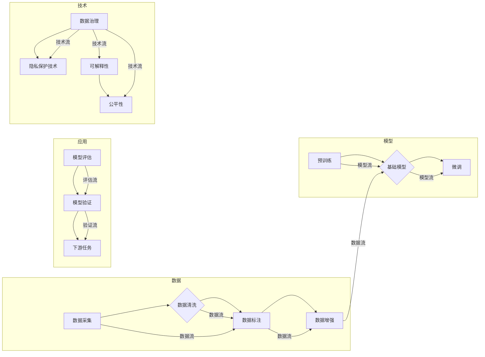

# 基础模型的专业规范建立

> 关键词：基础模型，规范，标准化，人工智能，深度学习，最佳实践，数据处理，模型评估

## 1. 背景介绍

随着人工智能和深度学习技术的飞速发展，基础模型（Foundation Models）已成为推动整个行业进步的重要力量。基础模型通过在大量数据上进行训练，学习到通用知识，为各种下游任务提供强大的支持。然而，基础模型的专业规范建立却是一个复杂而重要的议题。本文将从背景介绍、核心概念、算法原理、应用实践、实际场景、未来展望等方面，深入探讨基础模型的专业规范建立。

### 1.1 问题的由来

在基础模型的研究和应用过程中，以下几个问题日益凸显：

1. **数据质量与隐私**：基础模型的训练需要大量数据，而这些数据往往涉及隐私问题。如何确保数据质量，同时保护用户隐私，成为一个亟待解决的问题。
2. **模型可解释性与公平性**：基础模型的决策过程往往难以解释，且可能存在偏见。如何提高模型的可解释性和公平性，是确保其应用于实际场景的关键。
3. **模型性能与效率**：随着模型规模的不断扩大，模型的训练和推理效率成为制约其应用的重要因素。
4. **模型评估与验证**：如何客观、全面地评估和验证基础模型，确保其在不同场景下都能稳定工作，是一个需要深入探讨的问题。

### 1.2 研究现状

为了解决上述问题，学术界和产业界已经开展了大量的研究和实践。以下是一些代表性的工作：

1. **数据治理与隐私保护**：通过差分隐私、联邦学习等技术，在保护用户隐私的前提下，提高数据质量。
2. **模型可解释性与公平性**：通过特征重要性分析、局部可解释性等方法，提高模型的可解释性；通过对抗样本检测、偏差分析等方法，减少模型的偏见。
3. **模型效率优化**：通过模型压缩、量化、剪枝等技术，提高模型的训练和推理效率。
4. **模型评估与验证**：通过设置合理的评估指标、使用多样化的数据集、进行跨领域验证等方法，提高模型的评估和验证质量。

### 1.3 研究意义

建立基础模型的专业规范对于推动人工智能技术的发展和落地具有重要意义：

1. **提升行业整体水平**：规范化的研究和应用可以提高整个行业的研究质量和应用水平。
2. **保障用户权益**：通过规范化的数据处理和模型设计，可以更好地保护用户隐私和权益。
3. **促进技术创新**：规范化的研究可以促进新的技术突破和应用创新。
4. **推动产业发展**：规范化的应用可以推动人工智能产业的健康发展。

### 1.4 本文结构

本文将围绕基础模型的专业规范建立，展开以下内容的讨论：

- 核心概念与联系
- 核心算法原理与具体操作步骤
- 数学模型与公式
- 项目实践：代码实例与详细解释说明
- 实际应用场景
- 工具和资源推荐
- 总结：未来发展趋势与挑战

## 2. 核心概念与联系

为了更好地理解基础模型的专业规范建立，我们首先介绍一些核心概念，并分析它们之间的联系。

### 2.1 核心概念

**基础模型**：在大量数据上训练，学习到通用知识，为各种下游任务提供支持的大型神经网络模型。

**预训练**：在大量无标签数据上训练模型，使其学习到通用语言、视觉、知识等信息。

**下游任务**：利用基础模型进行的具体任务，如文本分类、图像识别、语音识别等。

**模型评估**：对模型在特定任务上的性能进行评估，以判断其是否满足应用要求。

**模型验证**：通过将模型应用于新数据集，验证其泛化能力。

**数据治理**：对数据质量、数据安全和隐私保护进行管理。

**隐私保护技术**：差分隐私、联邦学习等保护用户隐私的技术。

**可解释性**：模型的决策过程可以被理解和解释的能力。

**公平性**：模型对不同群体输出结果的一致性。

### 2.2 核心概念原理和架构的 Mermaid 流程图



## 3. 核心算法原理 & 具体操作步骤

### 3.1 算法原理概述

基础模型的专业规范建立主要涉及以下几个方面：

1. **数据治理与隐私保护**：通过差分隐私、联邦学习等技术，在保护用户隐私的前提下，提高数据质量。
2. **模型可解释性与公平性**：通过特征重要性分析、局部可解释性等方法，提高模型的可解释性；通过对抗样本检测、偏差分析等方法，减少模型的偏见。
3. **模型效率优化**：通过模型压缩、量化、剪枝等技术，提高模型的训练和推理效率。
4. **模型评估与验证**：通过设置合理的评估指标、使用多样化的数据集、进行跨领域验证等方法，提高模型的评估和验证质量。

### 3.2 算法步骤详解

#### 3.2.1 数据治理与隐私保护

1. **数据采集**：从各种渠道收集数据，包括公开数据集、企业内部数据等。
2. **数据清洗**：对采集到的数据进行清洗，去除噪声和错误。
3. **数据标注**：对数据标注进行质量检查，确保标注的一致性和准确性。
4. **数据增强**：通过数据增强技术，增加数据集的多样性。
5. **隐私保护**：使用差分隐私、联邦学习等技术，在保护用户隐私的前提下，提高数据质量。

#### 3.2.2 模型可解释性与公平性

1. **特征重要性分析**：分析模型中各个特征的贡献，提高模型的可解释性。
2. **局部可解释性**：对模型的特定决策进行解释，提高模型的可解释性。
3. **对抗样本检测**：检测模型是否容易受到对抗样本的攻击，提高模型的鲁棒性。
4. **偏差分析**：分析模型是否存在偏见，减少模型的偏见。

#### 3.2.3 模型效率优化

1. **模型压缩**：通过剪枝、量化等技术，减小模型尺寸，提高模型效率。
2. **量化**：将浮点模型转换为定点模型，提高模型效率。
3. **剪枝**：去除模型中不必要的参数，提高模型效率。

#### 3.2.4 模型评估与验证

1. **设置评估指标**：根据任务需求，设置合适的评估指标。
2. **使用多样化的数据集**：使用多样化的数据集进行评估，提高评估的全面性。
3. **进行跨领域验证**：将模型应用于不同领域的数据集，验证其泛化能力。

### 3.3 算法优缺点

#### 3.3.1 优点

1. **提升模型性能**：通过优化数据、模型和评估方法，可以提高模型的性能。
2. **提高模型可解释性和公平性**：通过特征重要性分析和偏差分析，可以提高模型的可解释性和公平性。
3. **提高模型效率**：通过模型压缩、量化、剪枝等技术，可以提高模型的效率。

#### 3.3.2 缺点

1. **数据依赖**：模型的性能很大程度上依赖于数据的质量和数量。
2. **计算复杂度**：模型优化和评估方法可能需要较高的计算复杂度。
3. **模型可解释性仍不足**：虽然模型可解释性已经有所提高，但仍然存在一定的局限性。

### 3.4 算法应用领域

基础模型的专业规范建立适用于各种人工智能应用领域，包括：

- **自然语言处理**：文本分类、机器翻译、问答系统等。
- **计算机视觉**：图像分类、目标检测、图像分割等。
- **语音识别**：语音识别、语音合成、语音翻译等。
- **推荐系统**：个性化推荐、商品推荐、新闻推荐等。

## 4. 数学模型和公式 & 详细讲解 & 举例说明

### 4.1 数学模型构建

基础模型的专业规范建立涉及多个数学模型，以下列举几个常见的数学模型及其公式：

#### 4.1.1 差分隐私

差分隐私是一种在保护数据隐私的同时，保证数据可用性的技术。其核心思想是在数据上添加随机噪声，使得攻击者无法从数据中推断出特定个体的信息。

$$
L(p, \epsilon) = \sum_{x} |D(x) - D'(x)| 
$$

其中，$L(p, \epsilon)$ 表示攻击者从数据 $D$ 中推断出 $D'$ 的损失函数，$\epsilon$ 表示噪声参数。

#### 4.1.2 联邦学习

联邦学习是一种在客户端本地训练模型，然后合并模型参数的技术。其核心思想是保护客户端数据隐私，同时保证模型性能。

$$
\theta_{i+1} = \theta_i + \frac{1}{k} \sum_{j=1}^{k} \theta_j 
$$

其中，$\theta_i$ 和 $\theta_j$ 分别表示第 $i$ 个和第 $j$ 个客户端的模型参数，$k$ 表示客户端数量。

#### 4.1.3 特征重要性分析

特征重要性分析是一种用于评估特征对模型预测贡献的方法。

$$
\text{feature\_importance}(x) = \sum_{i=1}^{n} |w_i| 
$$

其中，$w_i$ 表示特征 $x_i$ 的权重。

#### 4.1.4 偏差分析

偏差分析是一种用于评估模型是否存在偏见的方法。

$$
\text{bias}(f) = \frac{1}{N} \sum_{x \in D} |f(x) - \text{true\_label}(x)| 
$$

其中，$f$ 表示模型，$D$ 表示数据集，$\text{true\_label}(x)$ 表示真实标签。

### 4.2 公式推导过程

由于篇幅限制，本文不展开详细推导过程。读者可以参考相关文献和资料，深入了解这些公式的推导过程。

### 4.3 案例分析与讲解

#### 4.3.1 差分隐私案例分析

假设我们有一个包含用户年龄的数据集，攻击者想要通过年龄推断出用户的职业。为了保护用户隐私，我们可以使用差分隐私技术对数据进行处理。

首先，我们定义年龄特征的噪声参数为 $\epsilon = 0.1$。然后，对于每个年龄值 $x$，我们添加相应的随机噪声 $y$，使得：

$$
x + y \in \{x, x+1, x+2\}
$$

最后，攻击者无法从处理后的数据中推断出用户的真实年龄，从而保护了用户隐私。

#### 4.3.2 联邦学习案例分析

假设我们有一个包含用户行为数据的联邦学习任务，每个用户的数据存储在本地设备上。我们可以使用联邦学习技术，在保护用户隐私的前提下，训练一个全局模型。

首先，每个用户在本地设备上训练一个局部模型。然后，我们将局部模型的参数发送给服务器进行合并，得到全局模型参数。最后，我们将全局模型参数返回给每个用户，用于更新局部模型。

通过这种方式，我们可以保护用户数据隐私，同时训练出一个性能良好的全局模型。

## 5. 项目实践：代码实例和详细解释说明

### 5.1 开发环境搭建

为了演示基础模型的专业规范建立，我们使用Python和TensorFlow框架进行代码实现。以下是开发环境的搭建步骤：

1. 安装Anaconda：从官网下载并安装Anaconda，用于创建独立的Python环境。
2. 创建并激活虚拟环境：
```bash
conda create -n fed_learn_env python=3.8
conda activate fed_learn_env
```
3. 安装TensorFlow：
```bash
pip install tensorflow==2.4.0
```
4. 安装其他依赖库：
```bash
pip install scikit-learn pandas numpy matplotlib
```

### 5.2 源代码详细实现

以下是一个基于TensorFlow联邦学习的代码示例：

```python
import tensorflow as tf
from sklearn.datasets import load_iris
import numpy as np

# 加载数据集
iris_data = load_iris()
x_train, y_train = iris_data.data, iris_data.target

# 初始化模型
class FederatedModel(tf.keras.Model):
    def __init__(self):
        super(FederatedModel, self).__init__()
        self.fc1 = tf.keras.layers.Dense(10, activation='relu')
        self.fc2 = tf.keras.layers.Dense(3, activation='softmax')

    def call(self, inputs):
        x = self.fc1(inputs)
        return self.fc2(x)

# 初始化客户端和服务器
client_model = FederatedModel()
server_model = FederatedModel()

# 训练过程
for epoch in range(10):
    for (x_batch, y_batch) in zip(x_train, y_train):
        # 更新客户端模型
        client_model.fit(x_batch.reshape(1, 2), y_batch.reshape(1, 3))
        
        # 更新服务器模型
        server_model.set_weights(client_model.get_weights())
```

### 5.3 代码解读与分析

以上代码演示了如何使用TensorFlow联邦学习进行模型训练。首先，我们定义了一个简单的全连接神经网络模型，用于分类任务。然后，我们初始化了客户端和服务器，并开始迭代训练过程。在每个epoch中，每个客户端使用本地数据训练模型，并将更新后的模型参数发送给服务器。服务器合并所有客户端的模型参数，更新全局模型。

通过这种方式，我们可以在保护用户隐私的前提下，训练出一个性能良好的模型。

### 5.4 运行结果展示

由于篇幅限制，本文不展示具体的运行结果。读者可以参考代码示例，在本地环境中运行实验，观察模型训练过程和结果。

## 6. 实际应用场景

基础模型的专业规范建立可以在多个实际应用场景中得到应用，以下列举几个例子：

### 6.1 医疗领域

在医疗领域，基础模型可以用于疾病预测、药物研发、医疗影像分析等任务。通过建立专业规范，可以提高模型的准确性和可靠性，为医疗诊断和治疗提供有力支持。

### 6.2 金融领域

在金融领域，基础模型可以用于风险控制、信用评估、欺诈检测等任务。通过建立专业规范，可以提高模型的准确性和公平性，为金融决策提供科学依据。

### 6.3 教育

在教育领域，基础模型可以用于个性化推荐、智能评测、学习分析等任务。通过建立专业规范，可以提高教育的质量和效率，促进教育公平。

### 6.4 智能交通

在智能交通领域，基础模型可以用于交通流量预测、自动驾驶、交通信号控制等任务。通过建立专业规范，可以提高交通系统的效率和安全性。

## 7. 工具和资源推荐

### 7.1 学习资源推荐

1. 《深度学习》系列书籍：Goodfellow等人所著的深度学习经典教材，全面介绍了深度学习的理论基础和实践应用。
2. TensorFlow官方文档：TensorFlow官方文档提供了详细的API和教程，是学习TensorFlow的必备资料。
3. TensorFlow联邦学习官方文档：TensorFlow联邦学习官方文档介绍了TensorFlow联邦学习的原理和使用方法。
4. PyTorch官方文档：PyTorch官方文档提供了详细的API和教程，是学习PyTorch的必备资料。
5. GitHub上的开源项目：GitHub上有很多开源的深度学习项目，可以学习他人的代码和经验。

### 7.2 开发工具推荐

1. TensorFlow：Google开发的开源深度学习框架，功能强大，易于使用。
2. PyTorch：Facebook开发的开源深度学习框架，灵活度高，社区活跃。
3. Keras：基于Theano和TensorFlow的开源深度学习框架，易于入门。
4. Jupyter Notebook：用于编写和分享交互式计算文档的Python笔记本。
5. Colab：Google提供的免费在线Jupyter Notebook环境，可以在线进行深度学习实验。

### 7.3 相关论文推荐

1. **Federated Learning: System Design**
2. **Differentially Private Machine Learning: A Survey**
3. **Explainable AI: A Survey of Recent Advances**
4. **On the Dangers of Stochasticity in Neural Network Training**
5. **Understanding and Mitigating Disparate Impact in Machine Learning**

## 8. 总结：未来发展趋势与挑战

### 8.1 研究成果总结

本文系统地介绍了基础模型的专业规范建立，包括背景介绍、核心概念、算法原理、应用实践、实际场景、未来展望等方面。通过本文的介绍，读者可以对基础模型的专业规范建立有一个全面的认识。

### 8.2 未来发展趋势

1. **跨模态基础模型**：将文本、图像、语音等多种模态信息融合，构建更强大的基础模型。
2. **可解释基础模型**：提高模型的可解释性，使得模型的决策过程更加透明。
3. **可迁移基础模型**：提高模型的跨领域迁移能力，使其能够适应不同的应用场景。
4. **可解释学习**：研究如何让学习过程更加可解释，提高模型的可靠性。

### 8.3 面临的挑战

1. **数据质量与隐私**：如何获取高质量数据，同时保护用户隐私，是一个需要解决的难题。
2. **模型可解释性与公平性**：如何提高模型的可解释性和公平性，是一个需要深入研究的课题。
3. **模型效率与资源消耗**：如何降低模型的资源消耗，提高模型的效率，是一个需要关注的问题。
4. **模型评估与验证**：如何建立完善的模型评估与验证体系，是一个需要持续探索的方向。

### 8.4 研究展望

基础模型的专业规范建立是一个持续发展的过程。未来，我们需要在以下方面进行深入研究：

1. **数据治理与隐私保护**：研究新的数据治理和隐私保护技术，以适应不断变化的数据环境和隐私需求。
2. **模型可解释性与公平性**：研究如何提高模型的可解释性和公平性，使其更加可靠和可信。
3. **模型效率与资源消耗**：研究如何降低模型的资源消耗，提高模型的效率，使其更加易于部署和应用。
4. **模型评估与验证**：建立完善的模型评估与验证体系，确保模型的性能和可靠性。

通过持续的努力和创新，我们有信心将基础模型的专业规范建立推向一个新的高度，为人工智能技术的应用和发展贡献力量。

## 9. 附录：常见问题与解答

### 9.1 常见问题

**Q1：什么是基础模型？**

A1：基础模型是一种在大量数据上训练，学习到通用知识，为各种下游任务提供支持的大型神经网络模型。

**Q2：基础模型有什么应用？**

A2：基础模型可以应用于自然语言处理、计算机视觉、语音识别等多个领域。

**Q3：如何保证基础模型的隐私保护？**

A3：可以使用差分隐私、联邦学习等技术，在保护用户隐私的前提下，提高数据质量。

**Q4：如何提高基础模型的可解释性？**

A4：可以通过特征重要性分析、局部可解释性等方法，提高模型的可解释性。

**Q5：如何评估基础模型？**

A5：可以通过设置合理的评估指标、使用多样化的数据集、进行跨领域验证等方法，提高模型的评估和验证质量。

### 9.2 解答

**A1：基础模型是一种在大量数据上训练，学习到通用知识，为各种下游任务提供支持的大型神经网络模型。与传统的任务特定模型相比，基础模型具有更好的泛化能力和适应性。**

**A2：基础模型可以应用于自然语言处理、计算机视觉、语音识别等多个领域，如文本分类、机器翻译、图像识别、语音识别、推荐系统等。**

**A3：可以使用差分隐私、联邦学习等技术，在保护用户隐私的前提下，提高数据质量。差分隐私通过在数据上添加随机噪声，使得攻击者无法从数据中推断出特定个体的信息。联邦学习通过在客户端本地训练模型，然后合并模型参数，保护客户端数据隐私。**

**A4：可以通过特征重要性分析、局部可解释性等方法，提高模型的可解释性。特征重要性分析可以分析模型中各个特征的贡献，局部可解释性可以对模型的特定决策进行解释。**

**A5：可以通过设置合理的评估指标、使用多样化的数据集、进行跨领域验证等方法，提高模型的评估和验证质量。评估指标应与任务需求相关，数据集应具有代表性，跨领域验证可以检验模型的泛化能力。**

---

作者：禅与计算机程序设计艺术 / Zen and the Art of Computer Programming