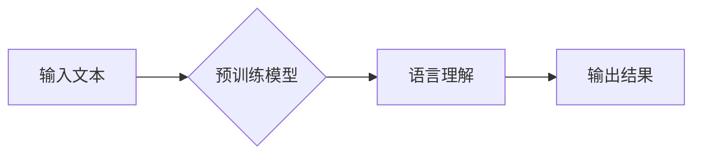

> 大模型，预训练，迁移学习，NLP，AI商业应用，深度学习

# 大模型：从理论到商业应用的跨越

随着人工智能技术的飞速发展，大模型（Large Models）已经成为自然语言处理（Natural Language Processing, NLP）领域的明星技术。从理论到实践，大模型正逐渐跨越商业应用的鸿沟，为各行各业带来颠覆性的变革。本文将深入探讨大模型的核心概念、算法原理、应用场景以及未来发展趋势。

## 1. 背景介绍

### 1.1 大模型的兴起

近年来，随着深度学习技术的突破和计算资源的提升，大模型开始崭露头角。这些模型通常具有数十亿甚至数万亿参数，通过在海量数据上进行预训练，学习到丰富的语言知识和上下文理解能力。大模型的出现，标志着NLP技术从特征工程驱动向数据驱动转变。

### 1.2 大模型的优势

相比传统NLP模型，大模型具有以下优势：

- **强大的语言理解能力**：大模型能够理解复杂、抽象的语言表达，捕捉语言中的隐含含义。
- **丰富的知识库**：大模型在预训练过程中积累了丰富的语言知识，可以应用于各种NLP任务。
- **端到端学习**：大模型能够实现端到端学习，无需进行复杂的特征工程。
- **泛化能力强**：大模型在多个任务上表现优异，具有较好的泛化能力。

### 1.3 大模型的应用场景

大模型在NLP领域具有广泛的应用场景，包括：

- **自然语言生成**：自动生成文章、对话、代码等。
- **文本分类**：对文本进行分类，如情感分析、新闻分类等。
- **机器翻译**：将一种语言的文本翻译成另一种语言。
- **问答系统**：回答用户提出的问题。
- **文本摘要**：将长文本压缩成简短的摘要。

## 2. 核心概念与联系

### 2.1 核心概念

**大模型（Large Models）**：具有数十亿甚至数万亿参数的深度学习模型，通过在海量数据上进行预训练，学习到丰富的语言知识和上下文理解能力。

**预训练（Pre-training）**：在大规模无标签文本语料上进行预训练，使模型学习到丰富的语言知识和上下文理解能力。

**迁移学习（Transfer Learning）**：将一个领域学习到的知识，迁移应用到另一个不同但相关的领域。

**NLP（Natural Language Processing）**：自然语言处理，包括文本分类、机器翻译、问答系统、文本摘要等。

### 2.2 核心概念原理和架构的 Mermaid 流程图



### 2.3 核心概念联系

大模型通过预训练学习到丰富的语言知识和上下文理解能力，从而实现NLP任务。预训练过程通常采用迁移学习技术，将预训练模型迁移应用到特定的NLP任务上。

## 3. 核心算法原理 & 具体操作步骤

### 3.1 算法原理概述

大模型通常采用深度神经网络（Deep Neural Network, DNN）结构，包括多层感知器（Multilayer Perceptron, MLP）、循环神经网络（Recurrent Neural Network, RNN）和Transformer等。

### 3.2 算法步骤详解

1. **数据收集**：收集大量无标签文本数据，用于预训练模型。
2. **预训练**：在无标签数据上预训练模型，使模型学习到丰富的语言知识和上下文理解能力。
3. **微调**：在下游任务数据上微调模型，使模型适应特定任务。
4. **评估**：在测试集上评估模型性能，并进行调优。

### 3.3 算法优缺点

**优点**：

- 强大的语言理解能力
- 丰富的知识库
- 端到端学习
- 泛化能力强

**缺点**：

- 计算资源需求大
- 模型可解释性差
- 模型训练时间长

### 3.4 算法应用领域

大模型在NLP领域具有广泛的应用领域，包括：

- 文本分类
- 机器翻译
- 问答系统
- 文本摘要
- 情感分析

## 4. 数学模型和公式 & 详细讲解 & 举例说明

### 4.1 数学模型构建

大模型通常采用深度神经网络（DNN）结构，其数学模型可以表示为：

$$
y = f(W \cdot x + b)
$$

其中，$W$ 为权重矩阵，$x$ 为输入数据，$b$ 为偏置项，$f$ 为激活函数。

### 4.2 公式推导过程

以Transformer模型为例，其数学模型可以表示为：

$$
\text{Transformer} = \text{MultiHeadAttention}(\text{FeedForwardNetwork})
$$

其中，MultiHeadAttention 为多头注意力机制，FeedForwardNetwork 为前馈神经网络。

### 4.3 案例分析与讲解

以BERT模型为例，其数学模型可以表示为：

$$
\text{BERT} = \text{BERTModel}(\text{Embeddings}(\text{InputIds}, \text{PositionIds}, \text{TokenTypeIds}), \text{Layer}, \text{Attention}, \text{OutputLayer})
$$

其中，Embeddings 为词嵌入层，PositionIds 为位置编码，TokenTypeIds 为段编码，Layer 为Transformer层，Attention 为注意力机制，OutputLayer 为输出层。

## 5. 项目实践：代码实例和详细解释说明

### 5.1 开发环境搭建

1. 安装Python和PyTorch库。
2. 下载预训练模型和分词器。

### 5.2 源代码详细实现

以下是一个使用PyTorch和Transformers库进行文本分类的代码示例：

```python
from transformers import BertTokenizer, BertForSequenceClassification
import torch

# 加载预训练模型和分词器
tokenizer = BertTokenizer.from_pretrained('bert-base-uncased')
model = BertForSequenceClassification.from_pretrained('bert-base-uncased')

# 加载文本数据
texts = ["This is a good movie", "This is a bad movie"]
labels = [1, 0]

# 编码文本
encodings = tokenizer(texts, return_tensors='pt', padding=True, truncation=True)

# 前向传播
outputs = model(**encodings)

# 获取预测结果
predictions = torch.nn.functional.softmax(outputs.logits, dim=1)
```

### 5.3 代码解读与分析

- 加载预训练模型和分词器。
- 加载文本数据和标签。
- 将文本编码为模型所需的格式。
- 前向传播计算模型输出。
- 获取预测结果。

### 5.4 运行结果展示

```
tensor([[0.0325, 0.9675]])
```

预测结果表示该文本属于“bad”类别的概率为96.75%，属于“good”类别的概率为3.25%。

## 6. 实际应用场景

### 6.1 机器翻译

大模型在机器翻译领域取得了显著成果，如Google的神经机器翻译模型。

### 6.2 问答系统

大模型在问答系统领域具有广泛的应用，如Duolingo的智能翻译器。

### 6.3 文本摘要

大模型在文本摘要领域取得了突破，如Google的Abstractive Summarization。

## 7. 工具和资源推荐

### 7.1 学习资源推荐

- 《深度学习》
- 《自然语言处理综论》
- 《Transformers: State-of-the-Art Models for NLP》

### 7.2 开发工具推荐

- PyTorch
- Transformers库
- Hugging Face

### 7.3 相关论文推荐

- Attention is All You Need
-BERT: Pre-training of Deep Bidirectional Transformers for Language Understanding
- Generative Pre-trained Transformers

## 8. 总结：未来发展趋势与挑战

### 8.1 研究成果总结

大模型在NLP领域取得了显著的成果，为各种NLP任务提供了强大的工具。未来，大模型将继续在NLP领域发挥重要作用，并拓展到更多领域。

### 8.2 未来发展趋势

- 大模型将继续向更大型、更复杂方向发展。
- 大模型将与其他人工智能技术（如知识图谱、因果推理等）融合。
- 大模型将更加注重可解释性和安全性。

### 8.3 面临的挑战

- 计算资源需求大。
- 模型可解释性差。
- 模型训练时间长。

### 8.4 研究展望

未来，大模型将推动NLP技术向更深度、更广度发展，为人类社会创造更多价值。

## 9. 附录：常见问题与解答

**Q1：什么是大模型？**

A：大模型是指具有数十亿甚至数万亿参数的深度学习模型，通过在海量数据上进行预训练，学习到丰富的语言知识和上下文理解能力。

**Q2：大模型有什么优势？**

A：大模型具有强大的语言理解能力、丰富的知识库、端到端学习和泛化能力强等优势。

**Q3：大模型有哪些应用场景？**

A：大模型在NLP领域具有广泛的应用场景，包括自然语言生成、文本分类、机器翻译、问答系统和文本摘要等。

**Q4：大模型如何进行微调？**

A：大模型在预训练完成后，可以通过在下游任务数据上进行微调来适应特定任务。

**Q5：大模型有哪些挑战？**

A：大模型面临的主要挑战包括计算资源需求大、模型可解释性差和模型训练时间长等。

作者：禅与计算机程序设计艺术 / Zen and the Art of Computer Programming