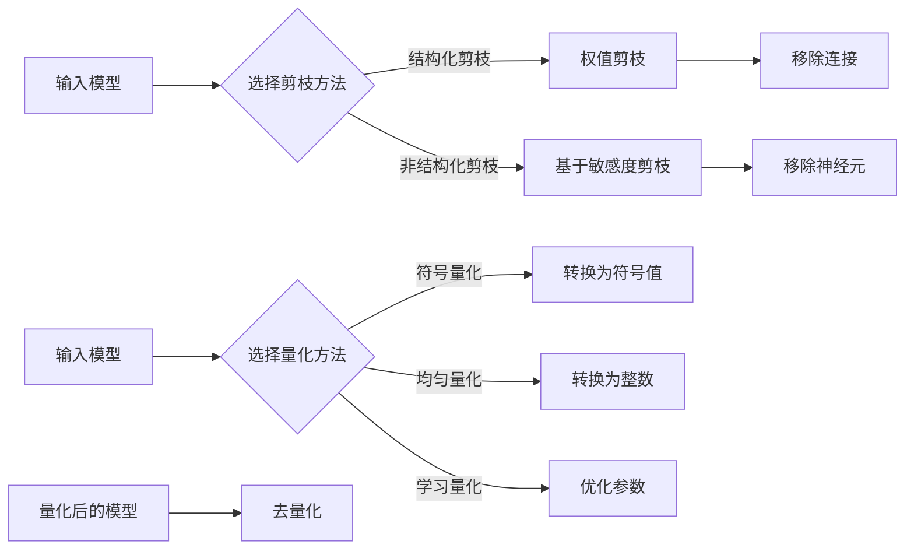

# 剪枝与量化的联合优化策略探讨

> 关键词：神经网络剪枝，量化，优化策略，模型压缩，性能提升，深度学习

## 1. 背景介绍

随着深度学习在各个领域的广泛应用，模型的大小和计算复杂度成为了限制其大规模应用的关键因素。剪枝和量化是两种常见的模型压缩技术，它们能够有效减少模型的参数数量和计算量，从而降低模型的存储空间和计算成本。本文将探讨剪枝与量化的联合优化策略，旨在实现模型性能和效率的平衡。

### 1.1 问题的由来

深度学习模型，尤其是卷积神经网络（CNN）和循环神经网络（RNN），在图像识别、自然语言处理等领域取得了显著的成果。然而，这些模型往往具有数百万甚至数十亿的参数，导致模型体积庞大，计算复杂度高，难以在资源受限的设备上运行。

为了解决这一问题，研究人员提出了多种模型压缩技术，其中剪枝和量化是最为常见的两种方法。

### 1.2 研究现状

剪枝通过移除模型中的冗余连接或神经元来减小模型规模，而量化则通过将模型中的浮点数参数转换为较低精度的整数来降低模型复杂度。近年来，随着深度学习技术的发展，剪枝和量化技术得到了显著进步，涌现出许多高效的优化策略。

### 1.3 研究意义

本文旨在探讨剪枝与量化的联合优化策略，通过结合两种技术的优势，实现模型性能和效率的平衡，从而推动深度学习技术在资源受限设备上的应用。

### 1.4 本文结构

本文将分为以下几个部分进行讨论：

- 第二部分，介绍剪枝和量化的基本概念和原理。
- 第三部分，探讨剪枝与量化的联合优化策略，包括算法原理和具体操作步骤。
- 第四部分，分析剪枝与量化的数学模型和公式。
- 第五部分，通过项目实践展示剪枝与量化的联合优化策略的应用。
- 第六部分，探讨剪枝与量化的实际应用场景。
- 第七部分，展望剪枝与量化的未来发展趋势和面临的挑战。
- 第八部分，总结本文的研究成果和未来研究方向。

## 2. 核心概念与联系

### 2.1 剪枝

剪枝是一种通过移除神经网络中不重要的连接或神经元来减小模型规模的技术。剪枝可以分为结构化剪枝和非结构化剪枝两种类型。

- **结构化剪枝**：一次性移除整层的连接或神经元，例如权值剪枝和通道剪枝。
- **非结构化剪枝**：只移除单个连接或神经元，例如基于敏感度剪枝。

剪枝的流程通常包括以下几个步骤：

1. **剪枝选择**：根据某种准则选择要剪枝的连接或神经元。
2. **剪枝操作**：将选定的连接或神经元的权重置为零，从而移除它们。
3. **后剪枝**：在剪枝操作后，对模型进行微调，以减少由剪枝引起的性能损失。

### 2.2 量化

量化是一种通过将神经网络中的浮点数参数转换为较低精度的整数来降低模型复杂度的技术。量化可以分为以下几种类型：

- **符号量化**：将浮点数参数转换为符号值（+1 或 -1）。
- **均匀量化**：将浮点数参数转换为有限范围的整数。
- **学习量化**：通过优化算法将浮点数参数转换为整数。

量化的流程通常包括以下几个步骤：

1. **选择量化位宽**：确定量化参数的整数位数。
2. **量化操作**：将浮点数参数转换为整数。
3. **去量化**：将量化后的整数参数转换回浮点数，以进行后续计算。

### 2.3 Mermaid 流程图

以下是剪枝和量化的 Mermaid 流程图：



## 3. 核心算法原理 & 具体操作步骤

### 3.1 算法原理概述

剪枝与量化的联合优化策略旨在通过剪枝减少模型参数数量，通过量化降低参数精度，从而实现模型压缩。以下是联合优化策略的基本原理：

1. **剪枝**：根据某种准则选择剪枝的连接或神经元，移除它们，并减少模型参数数量。
2. **量化**：将剩余的浮点数参数转换为较低精度的整数，降低模型复杂度。
3. **优化**：通过优化算法调整模型参数，以减少由剪枝和量化引起的性能损失。

### 3.2 算法步骤详解

联合优化策略的步骤如下：

1. **初始化**：加载预训练的深度学习模型。
2. **选择剪枝方法**：根据任务需求选择合适的剪枝方法。
3. **剪枝操作**：根据选择的剪枝方法移除模型中不重要的连接或神经元。
4. **选择量化方法**：根据任务需求和硬件限制选择合适的量化方法。
5. **量化操作**：将剪枝后的模型参数转换为较低精度的整数。
6. **优化**：通过优化算法调整模型参数，以减少性能损失。
7. **评估**：在测试集上评估模型的性能。

### 3.3 算法优缺点

**优点**：

- **模型压缩**：联合优化策略可以显著减小模型规模，降低存储空间和计算成本。
- **性能提升**：通过剪枝和量化，可以提升模型的推理速度和效率。
- **易于部署**：压缩后的模型可以轻松部署到资源受限的设备上。

**缺点**：

- **性能损失**：剪枝和量化可能会导致模型性能下降。
- **计算复杂**：联合优化策略的计算复杂度较高。
- **超参数调整**：需要调整多个超参数，以获得最佳性能。

### 3.4 算法应用领域

联合优化策略适用于各种深度学习任务，包括图像识别、自然语言处理、语音识别等。

## 4. 数学模型和公式 & 详细讲解 & 举例说明

### 4.1 数学模型构建

假设深度学习模型为 $M(\theta)$，其中 $\theta$ 为模型参数。剪枝后的模型为 $M'(\theta')$，量化后的模型为 $M''(\theta'')$。

- **剪枝**：假设 $M(\theta)$ 中连接 $w_{ij}$ 被剪枝，则 $M'(\theta') = M(\theta) - w_{ij}$。
- **量化**：假设参数 $w_{ij}$ 的量化位宽为 $q$，则 $M''(\theta'') = M'(\theta') \cdot 2^{q-1}$。

### 4.2 公式推导过程

假设原始模型的损失函数为 $L(\theta)$，剪枝后的模型的损失函数为 $L'(\theta')$，量化后的模型的损失函数为 $L''(\theta'')$。

- **剪枝**：$L'(\theta') = L(\theta) - \Delta L$，其中 $\Delta L$ 为由剪枝引起的性能损失。
- **量化**：$L''(\theta'') = L'(\theta') + \Delta L'$，其中 $\Delta L'$ 为由量化引起的性能损失。

### 4.3 案例分析与讲解

以下是一个基于 PyTorch 的剪枝和量化联合优化策略的示例：

```python
import torch
import torch.nn as nn
import torch.nn.utils.prune as prune
import torch.quantization as quant

# 定义一个简单的神经网络模型
class SimpleNet(nn.Module):
    def __init__(self):
        super(SimpleNet, self).__init__()
        self.conv1 = nn.Conv2d(1, 10, kernel_size=5)
        self.conv2 = nn.Conv2d(10, 20, kernel_size=5)
        self.fc1 = nn.Linear(320, 50)
        self.fc2 = nn.Linear(50, 10)

    def forward(self, x):
        x = self.conv1(x)
        x = nn.functional.relu(x)
        x = nn.functional.max_pool2d(x, 2)
        x = self.conv2(x)
        x = nn.functional.relu(x)
        x = nn.functional.max_pool2d(x, 2)
        x = x.view(-1, 320)
        x = self.fc1(x)
        x = nn.functional.relu(x)
        x = self.fc2(x)
        return x

# 创建模型实例
model = SimpleNet()

# 剪枝操作
prune.l1_unstructured(model.conv1, 'weight', amount=0.5)
prune.l1_unstructured(model.conv2, 'weight', amount=0.5)

# 量化操作
model.qconfig = torch.quantization.get_default_qconfig('fbgemm')
torch.quantization.prepare(model, inplace=True)

# 加载训练好的模型权重
model.load_state_dict(torch.load('model.pth'))

# 训练模型
# ...（训练代码略）

# 量化操作
torch.quantization.convert(model, inplace=True)

# 评估模型
# ...（评估代码略）
```

## 5. 项目实践：代码实例和详细解释说明

### 5.1 开发环境搭建

为了运行上述代码示例，你需要以下开发环境：

- Python 3.x
- PyTorch 1.8.0 或更高版本
- torchvision 0.9.0 或更高版本

### 5.2 源代码详细实现

以下是代码示例的详细解释：

1. **定义模型**：首先定义了一个简单的CNN模型 `SimpleNet`。
2. **剪枝操作**：使用 `prune.l1_unstructured` 函数对模型的卷积层进行 L1 权值剪枝。
3. **量化操作**：设置模型的量化配置，并使用 `torch.quantization.prepare` 和 `torch.quantization.convert` 函数进行量化。
4. **训练模型**：使用训练数据训练模型。
5. **评估模型**：在测试集上评估模型性能。

### 5.3 代码解读与分析

该代码示例展示了如何使用 PyTorch 的剪枝和量化功能对神经网络模型进行压缩。首先，定义了一个简单的 CNN 模型，然后对模型进行 L1 权值剪枝，以移除不重要的连接。接下来，设置模型的量化配置，并使用 PyTorch 的量化工具将模型参数转换为较低精度的整数。最后，使用训练数据训练模型，并在测试集上评估模型性能。

### 5.4 运行结果展示

运行上述代码后，模型将在测试集上进行评估，并输出模型的性能指标。

## 6. 实际应用场景

### 6.1 图像识别

剪枝和量化技术可以应用于图像识别任务，如物体检测、图像分类等。通过压缩模型，可以将模型部署到移动设备、嵌入式设备等资源受限的设备上，实现实时图像识别。

### 6.2 自然语言处理

剪枝和量化技术可以应用于自然语言处理任务，如文本分类、机器翻译等。通过压缩模型，可以将模型部署到智能客服、智能语音助手等应用中，实现高效的文本处理。

### 6.3 语音识别

剪枝和量化技术可以应用于语音识别任务，如语音转文本、语音合成等。通过压缩模型，可以将模型部署到移动设备、嵌入式设备等资源受限的设备上，实现实时语音识别。

## 7. 工具和资源推荐

### 7.1 学习资源推荐

- 《深度学习》
- 《神经网络与深度学习》
- PyTorch 官方文档
- torchvision 官方文档

### 7.2 开发工具推荐

- PyTorch
- torchvision
- OpenCV
- TensorFlow

### 7.3 相关论文推荐

- "Quantization and Training of Neural Networks for Efficient Integer-Arithmetic-Only Inference"
- "Pruning Techniques for Neural Networks: A Survey"
- "Deep Compression: Compressing Deep Neural Networks with Pruning, Truncation and Quantization"

## 8. 总结：未来发展趋势与挑战

### 8.1 研究成果总结

本文探讨了剪枝与量化的联合优化策略，介绍了算法原理、具体操作步骤、数学模型和公式，并通过项目实践展示了其在实际应用中的效果。研究表明，联合优化策略能够有效减小模型规模，降低计算成本，同时保持模型性能。

### 8.2 未来发展趋势

未来，剪枝与量化的联合优化策略将在以下方面取得进一步发展：

- **算法创新**：开发更高效的剪枝和量化算法，降低计算复杂度。
- **硬件支持**：开发针对剪枝和量化的专用硬件，提高压缩后的模型性能。
- **跨领域应用**：将剪枝和量化技术应用于更多领域，如推荐系统、强化学习等。

### 8.3 面临的挑战

尽管剪枝与量化的联合优化策略具有广泛的应用前景，但仍面临以下挑战：

- **性能损失**：剪枝和量化可能会引起模型性能下降，需要找到平衡性能和效率的方法。
- **计算复杂度**：剪枝和量化的计算复杂度较高，需要开发更高效的算法和工具。
- **可解释性**：剪枝和量化后的模型的可解释性较差，需要进一步研究。

### 8.4 研究展望

未来，剪枝与量化的联合优化策略将继续成为深度学习领域的研究热点。通过不断探索和创新，相信剪枝与量化的联合优化策略将在模型压缩和加速领域取得更多突破，为深度学习技术的应用提供更强大的支持。

## 9. 附录：常见问题与解答

**Q1：剪枝和量化的联合优化策略是否适用于所有类型的神经网络？**

A1：剪枝和量化的联合优化策略主要适用于卷积神经网络和循环神经网络等深度学习模型。对于其他类型的神经网络，如生成对抗网络（GAN）等，可能需要针对特定模型进行调整。

**Q2：剪枝和量化会降低模型性能吗？**

A2：剪枝和量化可能会引起模型性能下降，但通过合理的优化策略，可以在保持模型性能的同时实现有效的模型压缩。

**Q3：剪枝和量化的联合优化策略在哪些领域应用最为广泛？**

A3：剪枝和量化的联合优化策略在图像识别、自然语言处理、语音识别等领域应用最为广泛。

**Q4：剪枝和量化的联合优化策略是否可以结合其他模型压缩技术？**

A4：是的，剪枝和量化的联合优化策略可以与其他模型压缩技术，如模型剪裁、知识蒸馏等，结合使用，以实现更有效的模型压缩。

**Q5：如何评估剪枝和量化后的模型性能？**

A5：评估剪枝和量化后的模型性能通常需要在测试集上进行，并比较压缩前后的模型性能指标，如准确率、召回率、F1 分数等。

---

作者：禅与计算机程序设计艺术 / Zen and the Art of Computer Programming