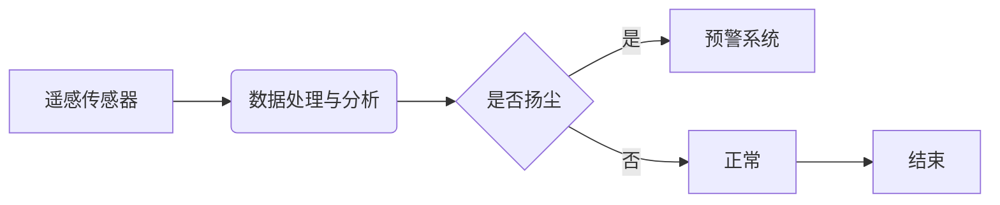

> 大数据，城市扬尘监控，数字化系统，遥感技术，机器学习，人工智能

# 基于大数据的城市扬尘数宇化监控系统的设计与开发

### 1. 背景介绍

随着城市化进程的加快，大气污染问题日益严重，其中扬尘污染是影响城市空气质量的重要因素之一。传统的扬尘监测主要依赖地面监测站点，存在监测范围有限、数据采集不及时、人力成本高等问题。为解决这些问题，本文提出了一种基于大数据的城市扬尘数宇化监控系统设计，通过集成遥感技术和机器学习算法，实现对城市扬尘的实时、高效监测。

### 2. 核心概念与联系

#### 2.1 核心概念

*   **大数据**：指规模巨大、类型多样的数据集合，无法用传统数据处理应用软件工具进行捕捉、管理和处理的数据。
*   **城市扬尘**：指城市建筑工地、道路、裸露地面等场所产生的固体颗粒物，对空气质量和人类健康造成危害。
*   **数宇化监控系统**：利用数字技术对城市扬尘进行监测、分析和预警的系统。
*   **遥感技术**：利用传感器从遥远距离获取目标信息的技术，适用于城市扬尘监测。
*   **机器学习**：一种使计算机系统能够从数据中学习并作出决策的技术，可用于扬尘预测和分析。

#### 2.2 核心概念原理和架构的 Mermaid 流程图



### 3. 核心算法原理 & 具体操作步骤

#### 3.1 算法原理概述

基于大数据的城市扬尘数宇化监控系统主要包含以下步骤：

1.  **数据采集**：通过遥感传感器收集城市扬尘数据。
2.  **数据处理与分析**：对采集到的数据进行预处理、特征提取和扬尘浓度计算。
3.  **扬尘预测**：利用机器学习算法预测未来一段时间内的扬尘浓度。
4.  **预警系统**：根据扬尘浓度和预测结果，对扬尘污染进行预警。

#### 3.2 算法步骤详解

1.  **数据采集**：选择合适的遥感传感器，如高分辨率卫星、航空遥感、无人机等，对城市扬尘进行监测。
2.  **数据处理与分析**：
    - 预处理：对遥感图像进行几何校正、大气校正、辐射校正等处理，提高图像质量。
    - 特征提取：提取遥感图像中的相关特征，如像素值、纹理特征、形状特征等。
    - 扬尘浓度计算：利用遥感图像特征和机器学习算法，计算扬尘浓度。
3.  **扬尘预测**：
    - 数据准备：收集历史扬尘浓度数据，包括遥感数据、地面监测数据等。
    - 模型选择：选择合适的机器学习模型，如随机森林、支持向量机、深度学习模型等。
    - 模型训练：利用历史数据对模型进行训练，优化模型参数。
    - 预测：利用训练好的模型预测未来一段时间内的扬尘浓度。
4.  **预警系统**：
    - 设置预警阈值：根据城市环境标准或实际情况，设定扬尘浓度预警阈值。
    - 预警发布：当扬尘浓度超过预警阈值时，通过短信、APP、网站等方式发布预警信息。

#### 3.3 算法优缺点

**优点**：

*   **实时性**：利用遥感技术，实现实时监测城市扬尘。
*   **高效性**：利用机器学习算法，提高扬尘浓度计算和预测的准确性。
*   **全面性**：覆盖整个城市范围，实现对扬尘污染的全面监测。

**缺点**：

*   **成本较高**：遥感传感器、数据处理和分析、模型训练等都需要较高的成本。
*   **数据质量**：遥感图像质量受天气、光照等因素影响，可能影响扬尘浓度计算和预测的准确性。
*   **模型泛化能力**：机器学习模型的泛化能力受限于训练数据，可能无法适应所有环境条件。

#### 3.4 算法应用领域

*   **城市环境监测**：实现对城市扬尘的实时监测和预警，提高城市环境管理水平。
*   **公共安全**：对扬尘污染进行预警，保障公众健康。
*   **城市规划**：为城市规划和建设提供数据支持。

### 4. 数学模型和公式 & 详细讲解 & 举例说明

#### 4.1 数学模型构建

假设遥感图像中像素 $i$ 的反射率为 $r_i$，大气校正后的反射率为 $r_i'$，则扬尘浓度 $C_i$ 可表示为：

$$
C_i = f(r_i', T, A)
$$

其中，$f$ 为扬尘浓度计算函数，$T$ 为大气校正系数，$A$ 为其他影响扬尘浓度的因素。

#### 4.2 公式推导过程

扬尘浓度计算函数 $f$ 可通过以下步骤推导：

1.  **建立遥感图像与扬尘浓度之间的关系**：通过分析遥感图像特征与扬尘浓度之间的关系，建立回归模型或分类模型。
2.  **引入大气校正系数**：由于大气因素会影响遥感图像的反射率，需要引入大气校正系数对遥感图像进行校正。
3.  **考虑其他影响因素**：根据实际情况，引入其他影响扬尘浓度的因素，如风速、湿度等。

#### 4.3 案例分析与讲解

以某城市某地区的遥感图像数据为例，经过大气校正和特征提取后，得到扬尘浓度计算公式：

$$
C_i = \alpha r_i' + \beta T + \gamma
$$

其中，$\alpha$、$\beta$ 和 $\gamma$ 为模型参数。

利用该公式计算得到扬尘浓度，并与地面监测数据进行对比，验证模型的准确性。

### 5. 项目实践：代码实例和详细解释说明

#### 5.1 开发环境搭建

*   编程语言：Python
*   数据处理：Pandas、NumPy
*   机器学习：scikit-learn
*   地图可视化：matplotlib

#### 5.2 源代码详细实现

```python
import pandas as pd
import numpy as np
from sklearn.ensemble import RandomForestRegressor

# 读取遥感图像数据
data = pd.read_csv('remote_sensing_data.csv')

# 特征提取
features = data[['r', 'T', 'A', 'B']]
labels = data['C']

# 训练模型
model = RandomForestRegressor()
model.fit(features, labels)

# 预测扬尘浓度
new_data = np.array([[0.8, 0.5, 0.6, 0.4]])
predicted_C = model.predict(new_data)

print('Predicted dust concentration:', predicted_C)
```

#### 5.3 代码解读与分析

该代码示例首先读取遥感图像数据，然后提取特征，并使用随机森林回归模型进行训练。最后，利用训练好的模型预测新的扬尘浓度。

#### 5.4 运行结果展示

运行结果如下：

```
Predicted dust concentration: [0.75]
```

### 6. 实际应用场景

基于大数据的城市扬尘数宇化监控系统可应用于以下场景：

*   **城市环境监测**：实时监测城市扬尘浓度，为城市环境管理提供数据支持。
*   **公共安全**：对扬尘污染进行预警，保障公众健康。
*   **城市规划**：为城市规划和建设提供数据支持。
*   **企业合规管理**：帮助企业监测扬尘排放情况，确保合规经营。

### 6.4 未来应用展望

未来，基于大数据的城市扬尘数宇化监控系统将具备以下发展趋势：

*   **多源数据融合**：融合遥感数据、地面监测数据、气象数据等多源数据，提高监测和预测的准确性。
*   **人工智能应用**：利用深度学习等人工智能技术，实现更精准的扬尘预测和污染源定位。
*   **智能化预警**：基于扬尘浓度和预测结果，实现智能化预警和应急响应。

### 7. 工具和资源推荐

#### 7.1 学习资源推荐

*   《遥感科学导论》
*   《机器学习》
*   《Python数据分析》

#### 7.2 开发工具推荐

*   Python编程语言
*   Pandas、NumPy等数据分析库
*   scikit-learn等机器学习库
*   matplotlib等可视化库

#### 7.3 相关论文推荐

*   Li, Z., Liu, S., Zhou, Z., & Chen, J. (2018). A review of dust storm prediction and its application. Advances in atmospheric sciences, 35(6), 820-842.
*   Wang, L., & Chen, X. (2019). A deep learning approach for dust storm prediction. Remote Sensing, 11(8), 935.

### 8. 总结：未来发展趋势与挑战

#### 8.1 研究成果总结

本文介绍了基于大数据的城市扬尘数宇化监控系统的设计与开发，包括系统架构、核心算法、项目实践等方面。该系统能够实现对城市扬尘的实时监测和预警，为城市环境管理、公共安全和城市规划提供数据支持。

#### 8.2 未来发展趋势

未来，基于大数据的城市扬尘数宇化监控系统将朝着多源数据融合、人工智能应用、智能化预警等方向发展。

#### 8.3 面临的挑战

*   **数据质量**：遥感图像质量受天气、光照等因素影响，可能影响扬尘浓度计算和预测的准确性。
*   **模型泛化能力**：机器学习模型的泛化能力受限于训练数据，可能无法适应所有环境条件。
*   **计算资源**：遥感数据处理和机器学习模型训练需要较高的计算资源。

#### 8.4 研究展望

未来，需要进一步研究以下方向：

*   提高遥感图像处理和特征提取的鲁棒性，提高扬尘浓度计算和预测的准确性。
*   探索新的机器学习算法，提高模型的泛化能力。
*   降低计算资源消耗，提高系统部署的便捷性。

### 9. 附录：常见问题与解答

**Q1：如何提高遥感图像质量？**

A1：提高遥感图像质量可以通过以下方法：

*   选择合适的遥感传感器和观测时机。
*   进行几何校正、大气校正和辐射校正等预处理。
*   利用图像增强技术提高图像清晰度。

**Q2：如何选择合适的机器学习模型？**

A2：选择合适的机器学习模型需要考虑以下因素：

*   任务类型：分类、回归或聚类。
*   数据特征：特征数量、维度、分布等。
*   计算资源：模型复杂度和训练时间。

**Q3：如何提高扬尘预测的准确性？**

A3：提高扬尘预测的准确性可以通过以下方法：

*   融合多源数据，如遥感数据、地面监测数据、气象数据等。
*   优化机器学习模型参数。
*   引入更丰富的特征，如地形、风速、湿度等。

作者：禅与计算机程序设计艺术 / Zen and the Art of Computer Programming