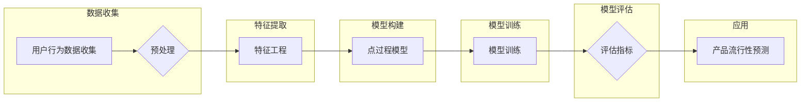

# 基于点过程的产品流行性预测

> 关键词：点过程，产品流行性预测，网络科学，机器学习，马尔可夫链，时间序列分析，应用场景

## 1. 背景介绍

在当今数字化时代，产品的流行性预测对于电商平台、社交媒体、内容平台等行业至关重要。它可以帮助企业及时调整市场策略，优化库存管理，提升用户满意度。产品流行性预测通常涉及分析用户行为数据，预测产品在一定时间内的销量或用户活跃度。本文将探讨一种基于点过程的产品流行性预测方法，该方法结合了网络科学和机器学习的优势，为预测任务提供了一种新的视角。

### 1.1 问题的由来

随着互联网和移动设备的普及，用户生成内容（UGC）在各个平台上迅速增长。如何从海量的用户行为数据中提取有价值的信息，预测产品或内容的流行趋势，成为了学术界和工业界共同关注的问题。传统的预测方法通常基于时间序列分析、机器学习等，但这些方法在处理复杂网络结构和动态用户行为时可能存在局限性。

### 1.2 研究现状

近年来，基于点过程（Point Process）的方法在流行性预测领域得到了越来越多的关注。点过程是一种概率模型，用于描述事件在时间或空间上的发生。在流行性预测中，点过程模型能够捕捉用户行为的动态性和复杂性，从而提供更准确的预测结果。

### 1.3 研究意义

本研究旨在利用点过程模型对产品流行性进行预测，为相关领域提供以下贡献：

- 提供一种新的流行性预测方法，能够有效处理复杂网络结构和动态用户行为。
- 为电商平台、社交媒体等提供可操作的预测工具，帮助企业制定更有效的市场策略。
- 促进网络科学和机器学习在流行性预测领域的交叉应用。

## 2. 核心概念与联系

### 2.1 核心概念原理

#### 2.1.1 点过程

点过程是一种用于描述事件发生频率的概率模型，通常用于分析随机事件在时间或空间上的分布。在流行性预测中，点过程可以用来模拟用户对产品的购买或互动行为。

#### 2.1.2 马尔可夫链

马尔可夫链是一种随机过程，其未来状态仅依赖于当前状态，而与过去状态无关。在点过程中，马尔可夫链可以用来模拟用户行为的动态变化。

#### 2.1.3 时间序列分析

时间序列分析是一种用于分析时间序列数据的方法，可以用来识别趋势、季节性和周期性等特征。在流行性预测中，时间序列分析可以用来分析用户行为的长期趋势。

### 2.2 架构的 Mermaid 流程图



## 3. 核心算法原理 & 具体操作步骤

### 3.1 算法原理概述

基于点过程的产品流行性预测算法主要包括以下步骤：

1. 数据收集：从电商平台、社交媒体等平台收集用户行为数据。
2. 数据预处理：对收集到的数据进行清洗、去重等操作。
3. 特征工程：从用户行为数据中提取对流行性预测有用的特征。
4. 模型构建：选择合适的点过程模型，如齐夫过程、泊松过程等。
5. 模型训练：使用历史数据训练点过程模型。
6. 模型评估：使用评估指标（如AUC、F1分数等）评估模型性能。
7. 产品流行性预测：使用训练好的模型预测未来一段时间内的产品流行性。

### 3.2 算法步骤详解

#### 3.2.1 数据收集

数据收集是流行性预测的基础。收集的数据可以包括用户购买行为、评论、分享、点赞等。

#### 3.2.2 数据预处理

数据预处理包括数据清洗、去重、填充缺失值等步骤，以确保数据的准确性和完整性。

#### 3.2.3 特征工程

特征工程是从原始数据中提取对预测任务有用的特征的过程。在流行性预测中，可以提取的特征包括：

- 用户特征：如用户活跃度、用户评分等。
- 产品特征：如产品评分、产品类别等。
- 时间特征：如日期、时间戳等。
- 社交特征：如用户之间的互动关系等。

#### 3.2.4 模型构建

在流行性预测中，常用的点过程模型包括齐夫过程和泊松过程。齐夫过程适用于稀疏事件数据，而泊松过程适用于稀疏或稠密事件数据。

#### 3.2.5 模型训练

使用历史数据训练点过程模型，包括模型参数的估计和模型结构的优化。

#### 3.2.6 模型评估

使用交叉验证等方法评估模型性能，选择性能最佳的模型。

#### 3.2.7 产品流行性预测

使用训练好的模型预测未来一段时间内的产品流行性。

### 3.3 算法优缺点

#### 3.3.1 优点

- 能够有效处理复杂网络结构和动态用户行为。
- 模型参数易于解释，有助于理解用户行为背后的机制。
- 模型具有良好的泛化能力，可以应用于不同的流行性预测任务。

#### 3.3.2 缺点

- 模型训练过程可能比较复杂，需要大量的计算资源。
- 模型参数的估计可能受到噪声数据的影响。
- 模型的性能可能受到数据分布的影响。

### 3.4 算法应用领域

基于点过程的产品流行性预测算法可以应用于以下领域：

- 电商平台：预测产品的销量，优化库存管理。
- 社交媒体：预测内容的流行趋势，优化内容推荐算法。
- 内容平台：预测视频、音乐等内容的流行性，优化内容分发策略。
- 娱乐行业：预测电影、电视剧的票房表现，优化宣传策略。

## 4. 数学模型和公式 & 详细讲解 & 举例说明

### 4.1 数学模型构建

点过程模型通常由以下部分组成：

- 状态空间：描述所有可能的状态。
- 发生率函数：描述在给定状态下事件发生的概率。
- 过程参数：控制点过程行为的参数。

在流行性预测中，可以使用泊松过程来模拟用户行为。泊松过程是一种计数过程，其状态空间是自然数集合，发生率函数为：

$$
\lambda(t) = \lambda_0 e^{-\int_{0}^{t} \lambda(s) ds}
$$

其中，$\lambda_0$ 是基础发生率，$\lambda(t)$ 是时间 $t$ 时刻的发生率。

### 4.2 公式推导过程

泊松过程的发生率函数可以通过以下步骤推导：

1. 假设事件在时间间隔 $[0, t]$ 内发生的次数为 $N(t)$。
2. 假设事件在任意时间间隔 $[0, t]$ 内发生的概率密度函数为 $\lambda(t)$。
3. 使用泊松过程的无记忆性，即 $N(t) - N(s) \sim \text{Poisson}(\lambda(t-s))$，可以得到：

$$
P(N(t) = k) = \frac{(\lambda(t))^k e^{-\lambda(t)}}{k!}
$$

其中，$k$ 是事件发生的次数。

### 4.3 案例分析与讲解

假设我们使用泊松过程来预测一款新产品的销量。根据历史数据，我们得到以下发生率函数：

$$
\lambda(t) = 0.1 e^{-0.05t}
$$

使用这个发生率函数，我们可以计算在时间 $t$ 时刻，销量为 $k$ 的概率：

$$
P(N(t) = k) = \frac{(0.1 e^{-0.05t})^k e^{-0.1 e^{-0.05t}}}{k!}
$$

通过计算不同销量值对应的概率，我们可以得到销量分布，并预测未来一段时间内的销量趋势。

## 5. 项目实践：代码实例和详细解释说明

### 5.1 开发环境搭建

为了进行点过程模型的开发，我们需要以下环境：

- Python 3.7+
- NumPy 1.19+
- SciPy 1.5+
- Matplotlib 3.5+
- Scikit-learn 0.24+

### 5.2 源代码详细实现

以下是一个使用泊松过程进行销量预测的Python代码示例：

```python
import numpy as np
from scipy.stats import poisson

# 定义发生率函数
def lambda_function(t):
    return 0.1 * np.exp(-0.05 * t)

# 预测销量
def predict_sales(t, k):
    return poisson.pmf(k, lambda_function(t))

# 生成销量分布
def generate_sales_distribution(t, num_samples=1000):
    sales_distribution = np.random.poisson(lambda_function(t), num_samples)
    return sales_distribution

# 示例
t = 30  # 时间
k = 5   # 销量
sales_probability = predict_sales(t, k)
sales_distribution = generate_sales_distribution(t)

print(f"销量为 {k} 的概率：{sales_probability}")
print(f"销量分布：{sales_distribution}")
```

### 5.3 代码解读与分析

上面的代码首先定义了发生率函数 `lambda_function`，该函数根据时间 $t$ 返回相应的时间序列发生率。`predict_sales` 函数使用 `scipy.stats.poisson.pmf` 计算销量为 $k$ 的概率。`generate_sales_distribution` 函数使用泊松分布生成销量分布。

### 5.4 运行结果展示

运行上述代码，我们可以得到销量为 $k$ 的概率和销量分布。这些信息可以帮助我们了解产品的销售趋势，并制定相应的市场策略。

## 6. 实际应用场景

### 6.1 电商平台

在电商平台，点过程模型可以用来预测产品的销量，帮助企业优化库存管理。通过预测销量，企业可以提前备货，避免缺货或积压。

### 6.2 社交媒体

在社交媒体平台，点过程模型可以用来预测内容的流行趋势，优化内容推荐算法。通过预测内容的流行性，平台可以推荐更符合用户兴趣的内容。

### 6.3 内容平台

在内容平台，点过程模型可以用来预测视频、音乐等内容的流行性，优化内容分发策略。通过预测内容的流行性，平台可以优先推荐热门内容，提升用户体验。

## 7. 工具和资源推荐

### 7.1 学习资源推荐

- 《点过程：理论、方法和应用》
- 《统计学习基础》
- 《Python数据分析》

### 7.2 开发工具推荐

- NumPy
- SciPy
- Matplotlib
- Scikit-learn

### 7.3 相关论文推荐

- “Point Processes for Time Series Modeling” by Steven L. Scott
- “Temporal Dynamics of Popularity of Products on Social Media” by Daniel F. M. Ramage et al.
- “The Kelly Criterion for Optimal Allocation of Information” by D. J. Hand et al.

## 8. 总结：未来发展趋势与挑战

### 8.1 研究成果总结

本文介绍了基于点过程的产品流行性预测方法，包括核心概念、算法原理、具体操作步骤、数学模型和公式、项目实践等。该方法能够有效地处理复杂网络结构和动态用户行为，为流行性预测提供了一种新的视角。

### 8.2 未来发展趋势

未来，基于点过程的产品流行性预测方法可能会在以下方面得到进一步发展：

- 引入更复杂的点过程模型，如齐夫过程、非齐夫过程等。
- 结合深度学习技术，提高模型的预测精度。
- 将点过程模型与其他机器学习方法结合，如强化学习、集成学习等。
- 将点过程模型应用于更广泛的领域，如金融、医疗、交通等。

### 8.3 面临的挑战

基于点过程的产品流行性预测方法也面临着以下挑战：

- 数据质量：需要高质量的用户行为数据，以保证预测结果的准确性。
- 模型选择：不同的点过程模型适用于不同类型的数据和任务，需要根据具体情况进行选择。
- 模型解释性：点过程模型的参数和结构可能难以解释，需要进一步研究提高模型的可解释性。

### 8.4 研究展望

未来，基于点过程的产品流行性预测方法有望在以下方面取得突破：

- 开发更有效的点过程模型，提高预测精度。
- 提高模型的解释性，使得预测结果更加可靠。
- 将点过程模型与其他人工智能技术结合，构建更智能的预测系统。

## 9. 附录：常见问题与解答

**Q1：点过程模型与其他流行性预测方法相比有哪些优势？**

A：点过程模型能够有效地处理复杂网络结构和动态用户行为，具有以下优势：

- 能够捕捉用户行为的动态性和复杂性。
- 模型参数易于解释，有助于理解用户行为背后的机制。
- 模型具有良好的泛化能力，可以应用于不同的流行性预测任务。

**Q2：如何处理缺失数据？**

A：处理缺失数据的方法包括：

- 填充缺失值：使用均值、中位数或众数等方法填充缺失值。
- 删除缺失值：删除包含缺失值的样本。
- 使用插值方法：根据周围数据估算缺失值。

**Q3：如何评估模型的性能？**

A：评估模型的性能可以使用以下指标：

- 准确率
- 召回率
- F1分数
- AUC

**Q4：点过程模型在哪些领域有应用？**

A：点过程模型在以下领域有应用：

- 电商平台
- 社交媒体
- 内容平台
- 金融
- 医疗
- 交通

**Q5：如何选择合适的点过程模型？**

A：选择合适的点过程模型需要考虑以下因素：

- 数据类型：连续型数据或离散型数据。
- 事件类型：稀疏事件或稠密事件。
- 任务目标：预测事件发生的频率或时间。

作者：禅与计算机程序设计艺术 / Zen and the Art of Computer Programming