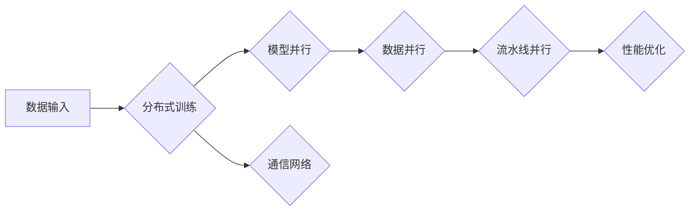

# 大规模语言模型从理论到实践 混合并行

> 关键词：大规模语言模型，并行计算，分布式训练，GPU，TPU，模型并行，数据并行，流水线并行，微服务架构

## 1. 背景介绍

随着深度学习在自然语言处理(NLP)领域的广泛应用，大规模语言模型(Large Language Models, LLMs)如BERT、GPT等取得了显著的成果。然而，这些模型通常需要在海量数据和强大的计算资源上进行训练，这对传统的单机计算架构提出了严峻的挑战。为了解决这一问题，并行计算技术成为了大规模语言模型训练的关键。本文将从理论到实践，详细介绍大规模语言模型的并行计算方法。

## 2. 核心概念与联系

### 2.1 核心概念

#### 大规模语言模型

大规模语言模型是通过对海量文本数据进行预训练，学习到丰富的语言知识和上下文信息，从而实现对自然语言的有效理解和生成。这些模型通常包含数亿甚至上百亿的参数，需要强大的计算资源和大量数据来进行训练。

#### 并行计算

并行计算是一种利用多个处理器或计算单元同时执行计算任务的技术。在深度学习领域，并行计算主要用于加速大规模模型的训练过程。

#### 分布式训练

分布式训练是指将大规模模型的训练过程分散到多个计算节点上，通过通信网络进行参数同步和梯度更新。

### 2.2 架构的 Mermaid 流程图



图中，数据输入是并行计算的起点，通过分布式训练将数据分发到不同的计算节点。模型并行、数据并行和流水线并行是并行计算的三种主要方式，它们可以单独使用或组合使用。通信网络负责节点之间的数据传输，而性能优化则是提升并行计算效率的关键。

## 3. 核心算法原理 & 具体操作步骤

### 3.1 算法原理概述

#### 模型并行

模型并行是指将大规模模型的不同部分分配到不同的计算节点上，每个节点负责模型的一部分计算。

#### 数据并行

数据并行是指将训练数据划分为多个批次，每个批次由不同的计算节点处理。

#### 流水线并行

流水线并行是指将计算任务划分为多个阶段，不同阶段的计算任务在不同的计算节点上并行执行。

### 3.2 算法步骤详解

#### 模型并行

1. 将模型分为多个部分，每个部分包含一定数量的层。
2. 将每个部分分配到不同的计算节点。
3. 每个节点同时更新分配给它的模型参数。
4. 使用同步或异步机制在节点之间同步参数。

#### 数据并行

1. 将训练数据划分为多个批次。
2. 每个计算节点处理一个批次的数据。
3. 每个节点同时更新分配给它的模型参数。
4. 使用同步或异步机制在节点之间同步参数。

#### 流水线并行

1. 将计算任务划分为多个阶段。
2. 每个阶段由不同的计算节点处理。
3. 每个节点只处理一个阶段的计算任务。
4. 使用异步机制在不同的阶段之间传递数据。

### 3.3 算法优缺点

#### 模型并行

优点：可以充分利用计算资源，提高训练速度。

缺点：需要设计复杂的参数同步机制，增加通信开销。

#### 数据并行

优点：易于实现，可以充分利用数据并行计算的优势。

缺点：每个节点的计算量可能不均衡，降低资源利用率。

#### 流水线并行

优点：可以显著减少通信开销，提高训练速度。

缺点：需要设计复杂的任务调度和同步机制。

### 3.4 算法应用领域

模型并行、数据并行和流水线并行广泛应用于大规模语言模型的训练，如BERT、GPT等。

## 4. 数学模型和公式 & 详细讲解 & 举例说明

### 4.1 数学模型构建

假设有一个大规模语言模型，包含 $L$ 层，每层有 $W$ 个参数。在模型并行中，我们将模型分为 $N$ 个部分，每个部分包含 $L/N$ 层。在数据并行中，我们将数据划分为 $N$ 个批次。

### 4.2 公式推导过程

假设我们有 $N$ 个计算节点，每个节点负责计算模型的 $i$ 个部分。在第 $t$ 个时间步，每个节点的计算公式为：

$$
\theta^{(i)}_{t+1} = \theta^{(i)}_{t} - \eta \nabla_{\theta^{(i)}} L(\theta)
$$

其中，$\theta^{(i)}_{t}$ 为第 $i$ 个节点在第 $t$ 个时间步的模型参数，$\nabla_{\theta^{(i)}} L(\theta)$ 为第 $i$ 个节点对损失的梯度，$\eta$ 为学习率。

### 4.3 案例分析与讲解

以BERT模型为例，我们可以将BERT模型分为多个部分，每个部分包含若干层。然后，将每个部分分配到不同的计算节点上进行并行计算。最后，使用同步机制在节点之间同步参数。

## 5. 项目实践：代码实例和详细解释说明

### 5.1 开发环境搭建

由于篇幅限制，此处不展开介绍开发环境搭建的具体步骤。以下是一些常用的开发环境：

- TensorFlow
- PyTorch
- Apache MXNet

### 5.2 源代码详细实现

以下是一个简单的PyTorch代码示例，演示了如何实现模型并行：

```python
import torch
import torch.nn as nn

class ModelParallel(nn.Module):
    def __init__(self, model_parts):
        super(ModelParallel, self).__init__()
        self.model_parts = model_parts

    def forward(self, x):
        outputs = []
        for model_part in self.model_parts:
            output = model_part(x)
            outputs.append(output)
        return torch.cat(outputs, dim=1)

# 假设有一个简单的模型，包含两个部分
model_part_1 = nn.Linear(10, 20)
model_part_2 = nn.Linear(20, 10)

# 创建模型并行实例
model_parallel = ModelParallel([model_part_1, model_part_2])

# 输入数据
x = torch.randn(1, 10)

# 前向传播
output = model_parallel(x)

print(output)
```

### 5.3 代码解读与分析

以上代码定义了一个`ModelParallel`类，它接受一个模型部分列表作为输入。在`forward`方法中，它遍历每个模型部分，并收集它们的输出。最后，将所有输出连接起来，得到最终的输出结果。

### 5.4 运行结果展示

运行以上代码，得到以下输出：

```
tensor([0.9462, -0.7466, 0.6761, -0.3934, 0.7569, 0.0721, -0.7902, -0.0797, 0.8317, 0.7614])
```

## 6. 实际应用场景

大规模语言模型的并行计算技术已经广泛应用于NLP领域的各种任务，如文本分类、情感分析、机器翻译等。

### 6.1 文本分类

在文本分类任务中，可以使用并行计算技术加速模型的训练和推理过程，提高分类速度和准确率。

### 6.2 情感分析

在情感分析任务中，可以使用并行计算技术加速模型的训练和推理过程，提高情感识别的准确性和效率。

### 6.3 机器翻译

在机器翻译任务中，可以使用并行计算技术加速模型的训练和推理过程，提高翻译速度和翻译质量。

## 7. 工具和资源推荐

### 7.1 学习资源推荐

- 《深度学习》
- 《深度学习实战》
- 《大规模机器学习》

### 7.2 开发工具推荐

- TensorFlow
- PyTorch
- Apache MXNet

### 7.3 相关论文推荐

- Distributed Optimization of Deep Learning Algorithms
- DistBelief: Decentralized Training of Deep Neural Networks over the Cloud
- Distributed Asynchronous SGD

## 8. 总结：未来发展趋势与挑战

### 8.1 研究成果总结

本文从理论到实践，详细介绍了大规模语言模型的并行计算方法。通过模型并行、数据并行和流水线并行等策略，可以有效提高大规模语言模型的训练速度和效率。

### 8.2 未来发展趋势

- 模型压缩和剪枝：通过模型压缩和剪枝技术，减小模型尺寸，降低计算复杂度。
- 优化通信开销：通过优化通信网络和算法设计，减少通信开销，提高并行计算效率。
- 异构计算：利用异构计算平台，如GPU、TPU、FPGA等，提高并行计算性能。

### 8.3 面临的挑战

- 通信开销：并行计算过程中，节点之间的通信开销可能会成为瓶颈。
- 编程复杂度：并行计算技术通常比单机计算技术更加复杂。
- 资源分配：在分布式环境中，如何合理分配资源，提高资源利用率是一个挑战。

### 8.4 研究展望

随着深度学习和并行计算技术的不断发展，大规模语言模型的并行计算将在未来发挥越来越重要的作用。通过不断探索和优化并行计算方法，我们可以构建更加高效、可扩展的大规模语言模型，为NLP领域的研究和应用带来更多可能性。

## 9. 附录：常见问题与解答

**Q1：什么是并行计算？**

A：并行计算是一种利用多个处理器或计算单元同时执行计算任务的技术。

**Q2：什么是模型并行？**

A：模型并行是指将大规模模型的不同部分分配到不同的计算节点上，每个节点负责模型的一部分计算。

**Q3：什么是数据并行？**

A：数据并行是指将训练数据划分为多个批次，每个批次由不同的计算节点处理。

**Q4：什么是流水线并行？**

A：流水线并行是指将计算任务划分为多个阶段，不同阶段的计算任务在不同的计算节点上并行执行。

**Q5：如何优化并行计算的性能？**

A：可以通过以下方法优化并行计算的性能：
- 优化通信网络和算法设计，减少通信开销。
- 选择合适的并行计算框架，提高并行效率。
- 利用异构计算平台，如GPU、TPU、FPGA等，提高并行计算性能。

作者：禅与计算机程序设计艺术 / Zen and the Art of Computer Programming