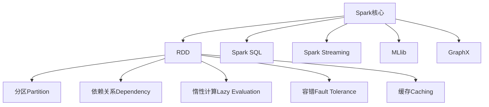
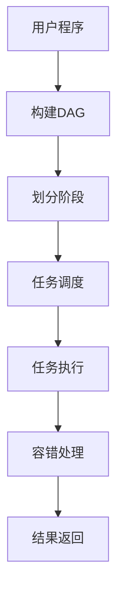

# Spark RDD弹性分布式数据集原理与代码实例讲解

## 1. 背景介绍

### 1.1 问题的由来

在大数据时代，海量数据的存储和计算成为了一个巨大的挑战。传统的单机系统已经无法满足现代数据密集型应用的需求。为了解决这一问题,分布式计算框架应运而生。Apache Spark作为一种通用的分布式计算引擎,凭借其优秀的性能和易用性,迅速成为大数据处理的首选方案之一。

Spark的核心抽象是RDD(Resilient Distributed Dataset,弹性分布式数据集)。RDD是一种分布式内存数据结构,能够容错地存储数据,并支持并行操作。RDD为Spark提供了高度的容错性和可伸缩性,使其能够高效地处理海量数据。

### 1.2 研究现状

目前,RDD已经成为Spark中最常用的数据抽象,广泛应用于各种数据处理场景,如批处理、流处理、机器学习和图计算等。然而,由于RDD的概念和实现涉及到分布式系统、并行计算等多个领域的知识,对于初学者来说,理解RDD的原理和使用方法仍然是一个挑战。

### 1.3 研究意义

深入理解RDD的原理和实现细节,对于掌握Spark的核心概念、提高数据处理效率、优化代码性能都有重要意义。本文将从RDD的设计理念出发,详细介绍其核心概念、算法原理、数学模型,并通过代码示例和实际应用场景,帮助读者全面掌握RDD的使用方法和最佳实践。

### 1.4 本文结构

本文将按照以下结构展开:

1. 背景介绍
2. RDD核心概念与联系
3. RDD核心算法原理与具体操作步骤
4. RDD数学模型和公式详细讲解与举例说明
5. RDD项目实践:代码实例和详细解释说明
6. RDD实际应用场景
7. RDD相关工具和资源推荐
8. 总结:RDD未来发展趋势与挑战
9. 附录:RDD常见问题与解答

## 2. 核心概念与联系

RDD(Resilient Distributed Dataset)是Spark中最核心的数据抽象。它是一种分布式的、不可变的、可重用的、容错的数据集合。RDD可以看作是分布在集群中多个节点上的元素的逻辑集合。

RDD的核心概念包括:

1. **分区(Partition)**: RDD中的数据是分区存储的,每个分区存储在集群中的一个节点上。

2. **依赖关系(Dependency)**: RDD之间存在依赖关系,新的RDD可以通过对现有RDD应用转换操作而构建。

3. **惰性计算(Lazy Evaluation)**: Spark中的计算是惰性的,只有在需要计算结果时,才会真正触发计算。

4. **容错(Fault Tolerance)**: RDD支持容错,如果某个节点出现故障,可以通过重新计算丢失的分区数据来恢复。

5. **缓存(Caching)**: RDD支持将数据缓存在内存中,以加速迭代计算。

RDD的核心概念与Spark的其他核心概念密切相关,如下图所示:

上图展示了RDD与Spark其他核心概念之间的关系。RDD是Spark的核心数据抽象,支持分区、依赖关系、惰性计算、容错和缓存等特性。而Spark SQL、Spark Streaming、MLlib和GraphX等模块都是基于RDD构建的,它们利用RDD提供的功能来实现各自的数据处理任务。

## 3. 核心算法原理与具体操作步骤

### 3.1 算法原理概述

RDD的核心算法原理是基于**有向无环图(DAG)**和**阶段划分**。

1. **有向无环图(DAG)**

   Spark将RDD之间的依赖关系表示为一个有向无环图(DAG),其中每个RDD表示为一个节点,而RDD之间的转换操作则表示为有向边。这种DAG结构使得Spark能够高效地调度和执行任务。

2. **阶段划分**

   Spark将DAG中的操作划分为不同的阶段(Stage)。每个阶段由一个或多个任务(Task)组成,这些任务在集群的不同节点上并行执行。阶段之间存在着依赖关系,后一个阶段需要等待前一个阶段的计算结果作为输入。

### 3.2 算法步骤详解

RDD的计算过程可以概括为以下几个步骤:

1. **构建DAG**

   当用户编写Spark程序时,Spark会根据RDD之间的转换操作构建一个DAG。

2. **划分阶段**

   Spark会将DAG划分为多个阶段,每个阶段由一系列相互依赖的任务组成。

3. **任务调度**

   Spark的任务调度器会根据集群资源情况,将任务分发到不同的节点上执行。

4. **任务执行**

   每个节点上的Executor会执行分配给它的任务,并将计算结果返回给Driver。

5. **容错处理**

   如果某个节点出现故障,Spark会根据RDD的依赖关系重新计算丢失的分区数据。

6. **结果返回**

   最后一个阶段的计算结果会被返回给Driver,作为程序的最终输出。

下图展示了RDD计算过程的流程:

### 3.3 算法优缺点

RDD算法的优点包括:

1. **容错性强**: 由于RDD的不可变性和依赖关系跟踪,Spark可以在节点故障时重新计算丢失的分区数据,从而实现容错。

2. **延迟计算**: 由于惰性计算的特性,Spark只在需要计算结果时才会真正执行计算,从而避免了不必要的计算开销。

3. **内存计算**: RDD支持将中间结果缓存在内存中,从而加速迭代计算。

4. **高度并行**: Spark可以将计算任务分发到集群中的多个节点上并行执行,充分利用集群资源。

RDD算法的缺点包括:

1. **不支持增量计算**: RDD是不可变的,每次转换操作都会生成一个新的RDD,无法对现有RDD进行修改,因此不支持增量计算。

2. **内存开销大**:由于RDD的不可变性,每次转换操作都会生成新的RDD,导致内存开销较大。

3. **调优复杂**: RDD的性能调优需要考虑多个因素,如分区数量、内存缓存策略等,调优过程较为复杂。

### 3.4 算法应用领域

RDD算法广泛应用于以下领域:

1. **批处理**: RDD非常适合用于大数据批处理场景,如日志分析、网页排名等。

2. **迭代计算**: RDD支持将中间结果缓存在内存中,因此非常适合迭代计算场景,如机器学习、图计算等。

3. **流处理**: Spark Streaming基于RDD实现,可以用于实时流数据处理。

4. **交互式分析**: Spark SQL和Spark DataFrame基于RDD构建,支持交互式数据分析。

## 4. 数学模型和公式详细讲解与举例说明

### 4.1 数学模型构建

为了更好地理解RDD的工作原理,我们可以构建一个数学模型来描述RDD的计算过程。

假设我们有一个RDD `R`,它包含了一系列元素 `e1, e2, ..., en`。我们可以将 `R` 表示为一个有序集合:

$$R = \{e_1, e_2, \ldots, e_n\}$$

RDD `R` 被划分为 `m` 个分区 `P1, P2, ..., Pm`。每个分区 `Pi` 包含了一部分元素,且所有分区的并集等于 `R`:

$$R = P_1 \cup P_2 \cup \ldots \cup P_m$$

我们可以将RDD `R` 上的转换操作表示为一个函数 `f`。通过对 `R` 应用函数 `f`,我们可以得到一个新的RDD `R'`:

$$R' = f(R)$$

由于RDD是不可变的,因此 `R'` 是一个全新的RDD,与 `R` 不同。`R'` 也被划分为多个分区,每个分区上的元素是通过对 `R` 中相应分区的元素应用函数 `f` 而得到的。

如果函数 `f` 是一个转换操作,如 `map` 或 `filter`,那么 `R'` 中每个分区的元素数量可能与 `R` 中相应分区的元素数量不同。如果函数 `f` 是一个行动操作,如 `reduce` 或 `collect`,那么 `R'` 可能只包含一个元素,即聚合后的结果。

### 4.2 公式推导过程

我们可以将RDD的转换操作表示为一系列函数的组合。假设我们有一个RDD `R`,经过一系列转换操作 `f1, f2, ..., fn`,得到最终的RDD `R'`:

$$R' = f_n(f_{n-1}(\ldots f_2(f_1(R))\ldots))$$

由于RDD的不可变性,每次转换操作都会生成一个新的RDD。因此,我们可以引入中间RDD `R1, R2, ..., Rn`,将上式重写为:

$$
\begin{aligned}
R_1 &= f_1(R) \
R_2 &= f_2(R_1) \
&\vdots \
R_n &= f_n(R_{n-1}) \
R' &= R_n
\end{aligned}
$$

这种表示方式更加清晰地展示了RDD之间的依赖关系。每个RDD `Ri` 都依赖于前一个RDD `Ri-1`,并通过应用函数 `fi` 而得到。

### 4.3 案例分析与讲解

为了更好地理解RDD的数学模型,我们来看一个具体的案例。假设我们有一个包含整数的RDD `R`,我们希望对其进行以下转换操作:

1. 过滤掉小于5的元素
2. 对每个元素平方
3. 对所有元素求和

我们可以将这个过程表示为以下数学公式:

$$
\begin{aligned}
R_1 &= \{x \in R \mid x \geq 5\} \
R_2 &= \{x^2 \mid x \in R_1\} \
R' &= \sum_{x \in R_2} x
\end{aligned}
$$

其中,`R1` 是通过过滤操作得到的RDD,`R2` 是通过映射操作得到的RDD,`R'` 是最终的求和结果。

我们可以看到,RDD的转换操作可以用数学公式清晰地表示出来,这有助于我们理解RDD的工作原理。

### 4.4 常见问题解答

**Q: RDD的分区数量是如何确定的?**

A: RDD的分区数量通常由Spark自动确定,但也可以由用户手动设置。Spark会根据输入数据的大小、集群资源情况等因素来决定合适的分区数量。一般来说,分区数量越多,并行度越高,但也会带来更多的开销。因此,需要在并行度和开销之间权衡。

**Q: RDD的缓存策略有哪些?**

A: Spark提供了多种缓存策略,包括:

- `MEMORY_ONLY`: 只将RDD缓存在内存中,如果内存不足,则部分分区将不会缓存。
- `MEMORY_AND_DISK`: 将RDD缓存在内存中,如果内存不足,则将部分分区存储在磁盘上。
- `DISK_ONLY`: 将RDD完全存储在磁盘上。
- `MEMORY_ONLY_SER`/`MEMORY_AND_DISK_SER`: 与前两种策略类似,但会先对RDD进行序列化,从而节省内存空间。

选择合适的缓存策略可