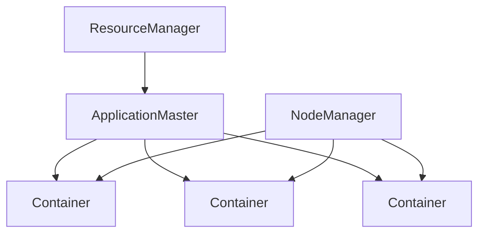
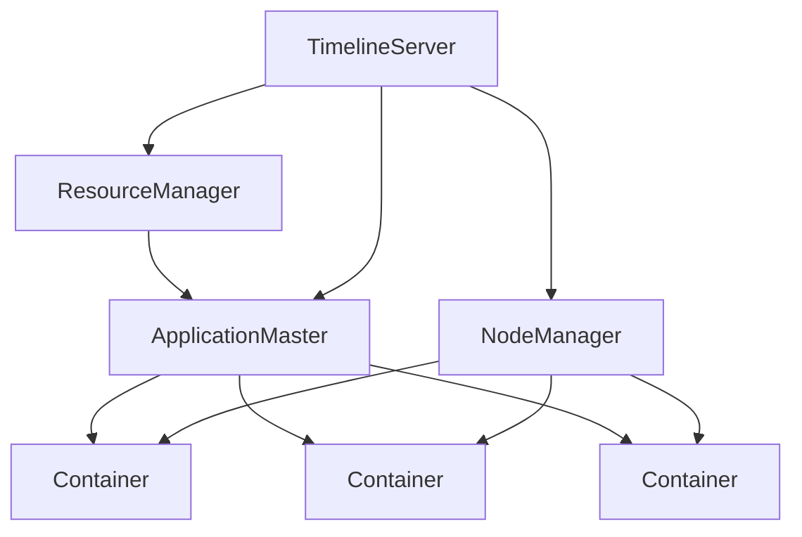

# YARN Timeline Server原理与代码实例讲解

## 1. 背景介绍

### 1.1 问题的由来

在大数据时代，海量数据的存储和处理成为了一个巨大的挑战。Apache Hadoop作为一个分布式计算框架,为解决这一问题提供了有力的支持。然而,随着集群规模和作业数量的不断增长,对作业的监控、调度和管理变得越来越复杂。为了更好地管理和监控Hadoop集群,YARN(Yet Another Resource Negotiator)应运而生。

YARN Timeline Server作为YARN的一个重要组件,旨在提供一个集中式的存储和检索机制,用于记录和查询YARN应用程序的历史数据。它解决了传统Hadoop作业历史服务器(Job History Server)的一些限制,如只能存储MapReduce作业的历史数据、存储能力有限等问题。

### 1.2 研究现状

目前,YARN Timeline Server已经成为Hadoop生态系统中不可或缺的一部分。它广泛应用于各种大数据场景,如作业监控、调度优化、故障诊断等。然而,由于其复杂的架构和实现细节,对于许多开发人员和运维人员来说,理解和使用YARN Timeline Server仍然是一个挑战。

### 1.3 研究意义

深入理解YARN Timeline Server的原理和实现细节,对于优化和维护大数据系统至关重要。本文旨在为读者提供一个全面的指南,帮助他们掌握YARN Timeline Server的核心概念、算法原理、数学模型、代码实现等方面的知识。通过实践案例和详细解释,读者可以更好地理解和应用YARN Timeline Server,从而提高大数据系统的性能和可靠性。

### 1.4 本文结构

本文将分为以下几个部分:

1. 背景介绍
2. 核心概念与联系
3. 核心算法原理与具体操作步骤
4. 数学模型和公式详细讲解及举例说明
5. 项目实践:代码实例和详细解释说明
6. 实际应用场景
7. 工具和资源推荐
8. 总结:未来发展趋势与挑战
9. 附录:常见问题与解答

## 2. 核心概念与联系

在深入探讨YARN Timeline Server的原理和实现之前,让我们先了解一些核心概念及它们之间的联系。

### 2.1 YARN (Yet Another Resource Negotiator)

YARN是Hadoop 2.x版本中引入的一个全新的资源管理和调度框架,旨在解决Hadoop 1.x版本中存在的一些限制。它将资源管理和作业调度/监控分离,提供了更好的资源利用率、可扩展性和多工作负载支持。

上图展示了YARN的基本架构。ResourceManager负责全局资源管理和调度,ApplicationMaster负责单个应用程序的生命周期管理,NodeManager负责单个节点上的资源管理和容器(Container)执行。

### 2.2 YARN Timeline Server

YARN Timeline Server是YARN的一个关键组件,它提供了一个集中式的存储和检索机制,用于记录和查询YARN应用程序的历史数据。它解决了传统Hadoop作业历史服务器(Job History Server)的一些限制,如只能存储MapReduce作业的历史数据、存储能力有限等问题。

YARN Timeline Server的主要功能包括:

- 存储和检索应用程序的历史数据,如作业配置、状态、指标等
- 提供RESTful API,方便查询和分析历史数据
- 支持插件机制,可以扩展存储和检索功能

### 2.3 YARN Timeline Server与其他组件的关系

YARN Timeline Server与YARN的其他组件密切相关,如下图所示:

- ResourceManager和ApplicationMaster会将应用程序的历史数据推送到YARN Timeline Server
- NodeManager会将容器(Container)的历史数据推送到YARN Timeline Server
- YARN Timeline Server提供RESTful API,供其他工具和系统查询和分析历史数据

通过YARN Timeline Server,我们可以获取整个YARN集群的全面历史数据,从而更好地监控、调度和优化大数据系统。

## 3. 核心算法原理与具体操作步骤

### 3.1 算法原理概述

YARN Timeline Server的核心算法原理可以概括为以下几个方面:

1. **数据存储与检索**:YARN Timeline Server采用了高效的数据存储和检索机制,能够快速地存储和查询大量的历史数据。它使用了基于LevelDB的键值存储,并且支持插件机制,可以扩展存储和检索功能。

2. **数据缓存**:为了提高查询性能,YARN Timeline Server采用了智能缓存策略,将热数据缓存在内存中,从而加快访问速度。

3. **数据压缩**:为了节省存储空间,YARN Timeline Server对存储的历史数据进行了压缩,减小了数据体积。

4. **数据分区**:为了提高并发性能,YARN Timeline Server将数据分成多个分区,每个分区独立存储和检索数据,从而实现了高并发访问。

5. **数据生命周期管理**:YARN Timeline Server会根据配置的数据保留策略,定期清理过期的历史数据,释放存储空间。

6. **安全性**:YARN Timeline Server支持基于Kerberos的身份认证和基于Apache Ranger的细粒度访问控制,保证了数据的安全性。

### 3.2 算法步骤详解

下面我们将详细介绍YARN Timeline Server的核心算法步骤:

#### 3.2.1 数据存储

YARN Timeline Server采用了基于LevelDB的键值存储机制,将历史数据存储为键值对。键由以下几部分组成:

- 集群ID
-用户ID
- 流水线ID(Timeline ID)
- 实体类型(如应用程序、容器等)
- 实体ID
- 起始时间

值则是一个Protobuf编码的数据对象,包含了实体的各种属性和指标数据。

为了提高存储效率,YARN Timeline Server会对数据进行压缩和分区。压缩算法采用了高效的Snappy压缩算法,而分区则是基于Timeline ID进行的,每个Timeline ID对应一个独立的分区。

数据存储的具体步骤如下:

1. 收集历史数据
2. 构建键值对
3. 压缩数据
4. 根据Timeline ID确定分区
5. 将键值对写入对应分区

#### 3.2.2 数据检索

YARN Timeline Server提供了RESTful API,供其他工具和系统查询历史数据。查询请求会被转换为对应的LevelDB查询操作,然后执行查询并返回结果。

为了提高查询性能,YARN Timeline Server采用了智能缓存策略,将热数据缓存在内存中。缓存策略基于LRU(Least Recently Used)算法,即最近最少使用的数据会被淘汰出缓存。

数据检索的具体步骤如下:

1. 接收查询请求
2. 解析查询条件
3. 检查缓存,命中则直接返回结果
4. 未命中则执行LevelDB查询
5. 将查询结果缓存到内存
6. 返回查询结果

#### 3.2.3 数据生命周期管理

为了控制存储空间的使用,YARN Timeline Server会定期清理过期的历史数据。数据的保留时间可以通过配置文件进行设置,默认为7天。

数据清理的具体步骤如下:

1. 计算过期时间点
2. 扫描所有分区
3. 删除时间戳早于过期时间点的数据
4. 压缩LevelDB数据文件

#### 3.2.4 安全性

YARN Timeline Server支持基于Kerberos的身份认证和基于Apache Ranger的细粒度访问控制,保证了数据的安全性。

身份认证的步骤如下:

1. 客户端向Kerberos KDC获取票据(Ticket)
2. 客户端将票据附加到请求头中
3. YARN Timeline Server验证票据的有效性

访问控制的步骤如下:

1. 定义访问策略(如只读、读写等)
2. 将策略存储到Apache Ranger
3. YARN Timeline Server在处理请求时,会向Apache Ranger验证请求者的权限

### 3.3 算法优缺点

#### 优点:

1. **高效存储和检索**:基于LevelDB的键值存储机制,结合数据压缩和分区策略,能够高效地存储和检索大量历史数据。
2. **良好的查询性能**:智能缓存策略和LRU算法,能够加快热数据的访问速度。
3. **可扩展性**:支持插件机制,可以扩展存储和检索功能。
4. **安全性**:支持基于Kerberos的身份认证和基于Apache Ranger的细粒度访问控制,保证了数据的安全性。

#### 缺点:

1. **单点故障**:YARN Timeline Server是一个单节点服务,存在单点故障的风险。
2. **存储空间限制**:虽然采用了数据压缩和清理策略,但是随着时间推移,存储空间仍然会被耗尽。
3. **查询灵活性**:基于LevelDB的键值存储,查询灵活性有一定限制,无法像关系型数据库那样进行复杂的联合查询。

### 3.4 算法应用领域

YARN Timeline Server的算法原理可以应用于以下领域:

1. **大数据监控和调度**:通过存储和查询YARN应用程序的历史数据,可以更好地监控和调度大数据系统。
2. **故障诊断和分析**:历史数据可以帮助分析和诊断系统故障,提高系统的可靠性。
3. **资源优化**:基于历史数据,可以优化资源分配和利用率。
4. **安全审计**:基于Apache Ranger的访问控制机制,可以对数据访问进行审计,提高安全性。
5. **其他领域**:YARN Timeline Server的算法原理也可以应用于其他需要高效存储和检索大量数据的场景,如物联网、日志分析等。

## 4. 数学模型和公式详细讲解及举例说明

在YARN Timeline Server的实现中,涉及到了一些数学模型和公式,下面我们将详细讲解并举例说明。

### 4.1 数学模型构建

#### 4.1.1 数据压缩模型

为了节省存储空间,YARN Timeline Server采用了数据压缩策略。常见的数据压缩算法包括Huffman编码、LZW编码、算术编码等。YARN Timeline Server选择了Snappy压缩算法,它是一种快速的无损压缩算法,具有较高的压缩速度和较好的压缩比。

Snappy压缩算法的核心思想是基于字典编码,将重复出现的数据块替换为较短的编码。具体来说,它将输入数据分成若干个数据块,每个数据块的大小为64KB。对于每个数据块,Snappy会在一个滑动窗口内查找重复的数据片段,并将这些重复的数据片段替换为指向字典中相应条目的索引。

设输入数据为$X$,压缩后的数据为$Y$,则Snappy压缩算法可以表示为:

$$Y = f(X)$$

其中$f$是Snappy压缩函数,具体实现过程较为复杂,这里不再赘述。

Snappy压缩算法的优点是速度快、压缩比较好,缺点是压缩率不如其他算法高。但对于YARN Timeline Server这种场景,Snappy算法已经足够高效。

#### 4.1.2 数据分区模型

为了提高并发性能,YARN Timeline Server将数据分成多个分区,每个分区独立存储和检索数据。分区策略采用了基于Timeline ID的哈希分区算法。

设有$n$个分区,Timeline ID为$t$,则分区编号$p$可以计算为:

$$p = hash(t) \bmod n$$

其中$hash$是一个哈希函数,可以选择MD5、SHA-1等。

通过这种分区策略,不同的Timeline ID会被均匀地分布到不同的分区中,从而实现了负载均衡和高并发访问。

### 4.2 公式推导过程

#### 4.2.1 LRU缓存命中率

为了提高查询性能,YARN Timeline Server采用了