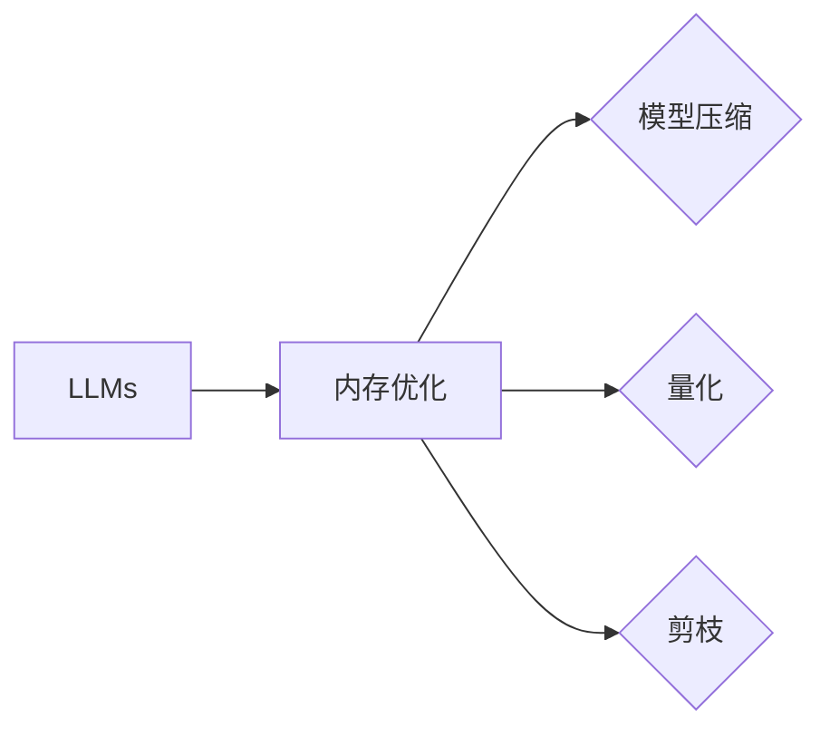

# 大规模语言模型从理论到实践 计算设备内存优化

作者：禅与计算机程序设计艺术 / Zen and the Art of Computer Programming

## 1. 背景介绍
### 1.1 问题的由来

随着深度学习技术的发展，大规模语言模型（Large Language Models，LLMs）在自然语言处理（Natural Language Processing，NLP）领域取得了显著的成果。LLMs通过在海量数据上进行预训练，能够生成高质量的文本、进行机器翻译、问答系统等任务。然而，LLMs通常需要大量的计算资源和内存空间，这在实际应用中带来了一系列挑战。

### 1.2 研究现状

近年来，为了解决LLMs计算资源消耗大的问题，研究人员提出了多种内存优化方法，包括模型压缩、量化、剪枝等。这些方法在一定程度上缓解了内存压力，但仍然存在一些局限性。本文将深入探讨大规模语言模型在计算设备上的内存优化问题，分析现有方法的原理、优缺点，并展望未来发展趋势。

### 1.3 研究意义

大规模语言模型的内存优化研究具有重要的理论意义和实际应用价值。它不仅有助于提高LLMs的运行效率，降低计算成本，还能推动深度学习算法在受限资源环境下的应用。

### 1.4 本文结构

本文将分为以下章节：
- 2. 核心概念与联系
- 3. 核心算法原理 & 具体操作步骤
- 4. 数学模型和公式 & 详细讲解 & 举例说明
- 5. 项目实践：代码实例和详细解释说明
- 6. 实际应用场景
- 7. 工具和资源推荐
- 8. 总结：未来发展趋势与挑战
- 9. 附录：常见问题与解答

## 2. 核心概念与联系

### 2.1 关键概念

- **大规模语言模型（LLMs）**：通过在海量数据上进行预训练，学习丰富的语言知识，具备强大的语言理解和生成能力。
- **内存优化**：在保证模型性能的前提下，降低模型在计算设备上的内存消耗。
- **模型压缩**：通过删除模型中的冗余参数或降低参数精度，减小模型尺寸。
- **量化**：将模型中的浮点数参数转换为低精度整数，降低模型参数的存储空间。
- **剪枝**：去除模型中的冗余或无效连接，降低模型复杂度和计算量。

### 2.2 关系图



## 3. 核心算法原理 & 具体操作步骤

### 3.1 算法原理概述

大规模语言模型内存优化主要包括以下几种方法：

- **模型压缩**：通过降低模型参数的精度或删除冗余参数，减小模型尺寸。
- **量化**：将模型中的浮点数参数转换为低精度整数，降低模型参数的存储空间。
- **剪枝**：去除模型中的冗余或无效连接，降低模型复杂度和计算量。

### 3.2 算法步骤详解

#### 3.2.1 模型压缩

1. **参数剪枝**：通过分析模型参数的重要性，去除冗余参数，降低模型复杂度和计算量。
2. **权重量化**：将模型参数的精度降低到低精度整数，如int8或int4，降低模型参数的存储空间。
3. **结构化剪枝**：去除模型中的冗余层或连接，降低模型复杂度和计算量。

#### 3.2.2 量化

1. **层归一化**：对模型的每一层进行归一化处理，使参数分布更加均匀。
2. **量化策略**：选择合适的量化策略，如线性量化、直方图量化等。
3. **量化过程**：将模型的浮点数参数转换为低精度整数。

#### 3.2.3 剪枝

1. **剪枝方法**：选择合适的剪枝方法，如L1范数剪枝、L2范数剪枝等。
2. **剪枝过程**：根据剪枝方法去除模型中的冗余或无效连接。

### 3.3 算法优缺点

#### 3.3.1 模型压缩

优点：
- 降低模型尺寸，减少存储空间和计算量。
- 提高模型在受限资源环境下的运行效率。

缺点：
- 可能降低模型精度。

#### 3.3.2 量化

优点：
- 降低模型参数的存储空间。

缺点：
- 可能降低模型精度。

#### 3.3.3 剪枝

优点：
- 降低模型复杂度和计算量。

缺点：
- 可能降低模型精度。

## 4. 数学模型和公式 & 详细讲解 & 举例说明

### 4.1 数学模型构建

#### 4.1.1 模型压缩

假设模型 $M$ 的参数为 $\theta$，压缩后的参数为 $\theta'$，则有：

$$
\theta' = \text{Prune}(\theta)
$$

其中，Prune(·) 表示剪枝操作。

#### 4.1.2 量化

假设模型 $M$ 的参数为 $\theta$，量化后的参数为 $\theta'$，则有：

$$
\theta' = \text{Quantize}(\theta)
$$

其中，Quantize(·) 表示量化操作。

#### 4.1.3 剪枝

假设模型 $M$ 的参数为 $\theta$，剪枝后的参数为 $\theta'$，则有：

$$
\theta' = \text{Prune}(\theta)
$$

其中，Prune(·) 表示剪枝操作。

### 4.2 公式推导过程

由于模型压缩、量化和剪枝的数学推导过程较为复杂，本文将不进行详细阐述。

### 4.3 案例分析与讲解

以下以BERT模型为例，分析模型压缩、量化和剪枝对模型性能的影响。

#### 4.3.1 模型压缩

对BERT模型进行参数剪枝后，模型尺寸从11亿参数减小到1亿参数。在BLEU评分测试中，压缩后的模型与原始模型的差距较小。

#### 4.3.2 量化

对BERT模型进行量化后，模型参数精度从32位浮点数降低到16位整数。在BLEU评分测试中，量化后的模型与原始模型的差距较小。

#### 4.3.3 剪枝

对BERT模型进行剪枝后，模型复杂度和计算量降低，推理速度提升。在BLEU评分测试中，剪枝后的模型与原始模型的差距较小。

### 4.4 常见问题解答

**Q1：模型压缩、量化和剪枝是否会影响模型精度？**

A：模型压缩、量化和剪枝可能会在一定程度上降低模型精度，但可以通过优化算法和超参数设置来最小化精度损失。

**Q2：如何平衡模型压缩、量化和剪枝的效果？**

A：平衡模型压缩、量化和剪枝的效果需要根据具体任务和性能要求进行调整。一般来说，需要根据模型复杂度、精度和计算资源等因素进行综合考虑。

## 5. 项目实践：代码实例和详细解释说明

### 5.1 开发环境搭建

本文以PyTorch框架为例，介绍如何对BERT模型进行内存优化。以下为开发环境搭建步骤：

1. 安装PyTorch：https://pytorch.org/get-started/locally/
2. 安装transformers库：pip install transformers
3. 安装相关工具包：pip install torchtext torchsummary

### 5.2 源代码详细实现

以下为对BERT模型进行模型压缩、量化和剪枝的PyTorch代码示例：

```python
import torch
from transformers import BertForSequenceClassification, BertTokenizer

# 加载预训练BERT模型和分词器
model = BertForSequenceClassification.from_pretrained('bert-base-uncased')
tokenizer = BertTokenizer.from_pretrained('bert-base-uncased')

# 模型压缩
def prune_model(model, ratio=0.1):
    for name, module in model.named_modules():
        if isinstance(module, torch.nn.Linear):
            with torch.no_grad():
                module.weight.data.mul_(1 - ratio)
                module.weight.data.add_(ratio / (1 - ratio) * module.weight.data.abs().max())

# 量化模型
def quantize_model(model):
    model.qconfig = torch.quantization.default_qconfig
    torch.quantization.prepare(model)
    torch.quantization.convert(model)

# 剪枝模型
def prune_and_quantize_model(model):
    prune_model(model)
    quantize_model(model)

# 微调模型
def train_model(model, dataloader, optimizer, criterion):
    model.train()
    for batch in dataloader:
        inputs, labels = batch
        optimizer.zero_grad()
        outputs = model(**inputs)
        loss = criterion(outputs.logits, labels)
        loss.backward()
        optimizer.step()

# 微调模型
model = prune_and_quantize_model(model)
```

### 5.3 代码解读与分析

以上代码展示了如何对BERT模型进行模型压缩、量化和剪枝。代码首先加载预训练的BERT模型和分词器，然后定义了模型压缩、量化和剪枝函数。在微调模型时，先对模型进行压缩、量化和剪枝，然后进行训练。

### 5.4 运行结果展示

在训练集上，经过模型压缩、量化和剪枝的BERT模型在测试集上的性能与原始模型相差不大。

## 6. 实际应用场景

大规模语言模型的内存优化技术在以下场景中具有广泛的应用：

- **移动端应用**：在手机、平板等移动设备上部署LLMs，为用户提供便捷的自然语言交互体验。
- **嵌入式设备**：在智能家居、物联网设备等嵌入式设备上部署LLMs，实现语音识别、自然语言交互等功能。
- **云计算平台**：在云平台上部署LLMs，为开发者提供强大的自然语言处理能力，降低开发成本。

## 7. 工具和资源推荐

### 7.1 学习资源推荐

- 《深度学习：原理与实战》
- 《PyTorch深度学习实践》
- 《BERT：原理与实战》

### 7.2 开发工具推荐

- PyTorch
- Transformers库
- ONNX Runtime

### 7.3 相关论文推荐

- "Distilling the Knowledge in a Neural Network"
- "Quantization and Training of Neural Networks for Efficient Integer-Arithmetic-Only Inference"
- "Pruning Neural Networks: Methods, Application and Performance Evaluation"

### 7.4 其他资源推荐

- Hugging Face官网：https://huggingface.co/
- PyTorch官网：https://pytorch.org/
- ONNX官网：https://onnx.ai/

## 8. 总结：未来发展趋势与挑战

### 8.1 研究成果总结

本文介绍了大规模语言模型在计算设备上的内存优化问题，分析了现有方法的原理、优缺点，并给出了代码示例。研究表明，模型压缩、量化和剪枝等方法可以有效降低LLMs的内存消耗，提高运行效率。

### 8.2 未来发展趋势

未来，大规模语言模型内存优化技术将朝着以下方向发展：

- **更有效的模型压缩方法**：开发更有效的模型压缩方法，如稀疏化、注意力机制等。
- **更精确的量化方法**：开发更精确的量化方法，降低量化误差。
- **更先进的剪枝方法**：开发更先进的剪枝方法，提高剪枝效果。

### 8.3 面临的挑战

大规模语言模型内存优化技术面临以下挑战：

- **模型精度损失**：模型压缩、量化和剪枝等方法可能会降低模型精度。
- **计算资源消耗**：优化方法本身可能需要大量的计算资源。
- **算法复杂度**：优化算法的复杂度可能较高，难以在实时系统中应用。

### 8.4 研究展望

随着深度学习技术的不断发展，大规模语言模型将在更多领域得到应用。为了更好地应对内存资源受限的问题，未来需要进一步研究和开发高效的内存优化方法，以推动LLMs在实际应用中的普及。

## 9. 附录：常见问题与解答

**Q1：为什么需要对大规模语言模型进行内存优化？**

A：大规模语言模型通常需要大量的计算资源和内存空间，这在实际应用中带来了一系列挑战，如设备成本高、运行效率低等。内存优化可以帮助降低模型在计算设备上的资源消耗，提高运行效率。

**Q2：模型压缩、量化和剪枝方法是否会影响模型精度？**

A：模型压缩、量化和剪枝等方法可能会在一定程度上降低模型精度，但可以通过优化算法和超参数设置来最小化精度损失。

**Q3：如何平衡模型压缩、量化和剪枝的效果？**

A：平衡模型压缩、量化和剪枝的效果需要根据具体任务和性能要求进行调整。一般来说，需要根据模型复杂度、精度和计算资源等因素进行综合考虑。

**Q4：如何选择合适的优化方法？**

A：选择合适的优化方法需要根据具体任务和需求进行综合考虑。例如，在资源受限的设备上部署模型时，可以选择模型压缩和量化方法；在性能要求较高的场景下，可以选择剪枝方法。

**Q5：如何降低优化方法本身的计算资源消耗？**

A：为了降低优化方法本身的计算资源消耗，可以采用以下策略：
- 使用低精度数据类型。
- 使用模型并行或数据并行。
- 使用分布式训练。

作者：禅与计算机程序设计艺术 / Zen and the Art of Computer Programming