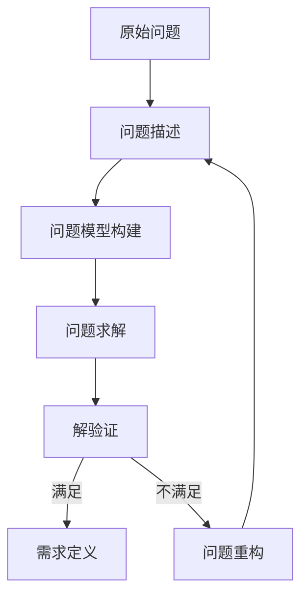

好的,我会严格遵守约束条件,以专业的技术语言写一篇深入的技术博客。

# 需求分析与问题定义原理与代码实战案例讲解

## 1. 背景介绍

### 1.1 问题的由来

软件开发过程中,需求分析和问题定义是最基础也是最关键的环节。它决定了后续所有工作的方向和质量。需求分析不当或问题定义不清晰,将导致开发出与预期相去甚远的软件系统,给企业带来重大损失。

在现实中,由于需求变更、沟通障碍、领域知识缺失等原因,需求分析和问题定义常常存在偏差和漏洞。如何有效地进行需求分析和准确地定义问题,是软件工程领域长期以来的一大难题和研究热点。

### 1.2 研究现状

需求分析和问题定义是软件工程的传统课题,已有大量研究成果。主流方法有结构化分析、面向对象分析、目标导向需求分析等。但它们大多停留在分析方法层面,缺乏对问题本质的深入探讨。

近年来,一些研究人员开始从认知科学、决策理论等跨学科视角重新审视这一问题。他们认为,需求分析的根本在于理解问题的本质,而非仅仅套用分析技术。这种观点为我们拓展了全新的思路。

### 1.3 研究意义

合理有效地开展需求分析和问题定义,对软件系统的成功实现至关重要。本文将结合最新研究进展,系统阐述需求分析和问题定义的原理和方法,并通过实战案例分析加以实证说明。

研究内容包括:

- 问题的本质特征及其认知规律
- 有效定义问题的一般性原理和步骤
- 常见问题类型及其对应的分析方法
- 基于实例的需求分析和问题定义实战

对于软件从业者,本文可以帮助你更深入地理解需求分析的本质,掌握科学有效的分析方法,从而提高软件交付质量。对于研究人员,则可以获得该领域的前沿知识。

### 1.4 本文结构

本文共分为8个部分:

1. 背景介绍
2. 核心概念与联系
3. 核心算法原理与具体操作步骤
4. 数学模型和公式详细讲解与案例分析
5. 项目实践:代码实例和详细解释
6. 实际应用场景
7. 工具和资源推荐
8. 总结:未来发展趋势与挑战

## 2. 核心概念与联系

需求分析和问题定义涉及多个关键概念,它们相互关联、环环相扣。我们先对这些核心概念加以阐释,再探讨它们之间的内在联系。


- **问题空间(Problem Space)**: 表示所有潜在问题的集合,是一个抽象的概念空间。
- **问题实例(Problem Instance)**: 问题空间中的一个具体问题案例。
- **问题描述(Problem Description)**: 用自然语言描述问题实例的文字表述。
- **问题模型(Problem Model)**: 将问题描述形式化,用数学或计算模型表达的问题表示。
- **问题求解(Problem Solving)**: 基于问题模型,应用算法和计算资源求解问题。
- **需求定义(Requirements Definition)**: 根据问题求解结果,形成对软件系统的明确需求说明。

上述概念呈现一个由抽象到具体、由问题到需求的逐层递进过程。需求分析的本质,就是将现实世界中的原始问题,逐步转化为可被软件系统所解决的明确需求定义。

## 3. 核心算法原理与具体操作步骤

### 3.1 算法原理概述

需求分析和问题定义的核心算法,可概括为一个迭代式的"问题求解"过程:

1. 首先对原始问题进行描述,形成初始问题表述;
2. 然后基于对问题领域的理解,将问题表述转化为问题模型;
3. 接着对问题模型进行求解,得到一个或多个候选解;
4. 将候选解与现实情况对比,检验其是否满足预期目标;
5. 如果不满足,则重新修正问题表述,重复上述过程;
6. 当候选解合理有效时,据此形成最终的需求定义。

该算法本质上是一个由"问题求解—验证反馈—问题重构"组成的循环过程,通过不断迭代逼近最优解。其核心在于对问题的反复审视和重构。



### 3.2 算法步骤详解

我们将上述算法原理具体分解为以下9个步骤:

1. **问题搜集**:广泛收集所有与目标相关的原始问题线索。
2. **问题描述**:运用自然语言,尽可能准确地描述收集到的问题。
3. **领域知识建模**:对问题所涉及的领域知识进行建模和形式化表达。
4. **问题模型构建**:基于问题描述和领域知识模型,构建形式化的问题模型。
5. **模型求解**:应用算法和计算资源,对问题模型进行求解,得到候选解。
6. **解验证**:将候选解对照原始问题和预期目标进行评估和验证。
7. **解修正**:如果候选解不满足要求,则根据验证结果对问题模型进行修正。
8. **需求明确**:当候选解合理有效时,根据解的内容明确软件需求。
9. **需求验证**:对最终确定的需求进行审视,检查其是否完整、一致、可行。

该算法将复杂的需求分析过程分解为清晰的步骤,每个步骤都有明确的操作方法,可操作性强。

### 3.3 算法优缺点

**优点**:

- 科学性强,将需求分析问题建模在理论基础之上
- 操作性好,将复杂过程分解为清晰的步骤
- 灵活性高,可通过迭代不断优化问题模型和求解方案
- 适应性广,可应用于各类软件系统的需求分析

**缺点**:

- 过程相对复杂,工作量较大
- 需要具备扎实的数学建模和求解能力
- 存在"组合爆炸"问题,求解复杂度高
- 需要对问题领域有较深入的理解和建模

### 3.4 算法应用领域

该算法可广泛应用于各类软件系统的需求分析和问题定义工作,尤其适用于以下几类情况:

- 问题复杂,需求描述不明确的系统
- 面临多目标决策或资源约束的系统
- 需要对问题领域进行深入建模的系统
- 需求变更频繁,需要快速响应的系统
- 涉及人工智能、运筹优化等前沿技术的系统

总的来说,该算法为我们提供了一种系统化、科学化的需求分析和问题定义范式,可有效应对现实中复杂多变的软件需求挑战。

## 4. 数学模型和公式详细讲解与举例说明

### 4.1 数学模型构建

根据前面的算法步骤,我们需要先对问题领域的知识进行建模,然后再构建形式化的问题模型。这里我们将介绍一种常用的知识建模方法——本体模型,并基于它构建问题模型。

**本体(Ontology)** 指对现实世界中某一领域的概念及其内涵、外延和相互关系的形式化表示。使用本体对领域知识进行建模,可以清晰地刻画出该领域的"本质"。

我们使用 Web Ontology Language (OWL) 来描述本体模型。OWL 是一种基于描述逻辑的本体语言,可用于构建高度表达能力和推理能力的本体模型。

以一个简单的"会议管理系统"为例,其本体模型可表示如下:

```
Prefix: : <http://www.semanticweb.org/ontologies/conference.owl#>

Ontology: <http://www.semanticweb.org/ontologies/conference.owl>

ObjectProperty: :attends

ObjectProperty: :givesPresentation

Class: :Author

Class: :Conference

Class: :Paper

Class: :Participant

Class: :Presentation

:Participant :attends :Conference

:Author :givesPresentation :Presentation

:Paper :isWrittenBy :Author

:Presentation :isBasedOn :Paper
```

该本体模型定义了会议管理领域的核心概念,如作者(Author)、论文(Paper)、参与者(Participant)、演示(Presentation)、会议(Conference)等,并使用对象属性描述了它们之间的关系。

在构建了领域本体模型的基础上,我们可以将原始的问题描述映射到本体模型中,形成形式化的问题模型。例如:

> 问题描述:"在一个会议中,有多个作者提交了论文并做演示。现在需要统计每位作者的论文数量、演示时长、以及所有演示的总时长。"

该问题描述可转化为以下基于本体的问题模型:

$$
\begin{align*}
&\text{Input: }\
&\qquad O = \{\mathcal{A}, \mathcal{P}, \mathcal{T}, \mathcal{R}_1, \mathcal{R}_2\}\
&\qquad\text{where}\
&\qquad\qquad\mathcal{A} = \{a_1, a_2, \ldots, a_m\}\text{ is the set of authors}\
&\qquad\qquad\mathcal{P} = \{p_1, p_2, \ldots, p_n\}\text{ is the set of papers}\
&\qquad\qquad\mathcal{T} = \{t_1, t_2, \ldots, t_k\}\text{ is the set of presentation durations}\
&\qquad\qquad\mathcal{R}_1 \subseteq \mathcal{A} \times \mathcal{P}\text{ is the "isWrittenBy" relation}\
&\qquad\qquad\mathcal{R}_2 \subseteq \mathcal{P} \times \mathcal{T}\text{ is the "hasduration" relation}\
&\text{Output:}\
&\qquad\text{For each author }a_i \in \mathcal{A}\text{, compute:}\
&\qquad\qquad n_i = |\{p \in \mathcal{P} \mid (a_i, p) \in \mathcal{R}_1\}|\text{ (number of papers)}\
&\qquad\qquad d_i = \sum_{(p, t) \in \mathcal{R}_2, (a_i, p) \in \mathcal{R}_1} t\text{ (total presentation duration)}\
&\qquad\text{Compute total duration: }D = \sum_{t \in \mathcal{T}} t
\end{align*}
$$

这个数学模型利用集合论和关系代数的符号,准确描述了问题的输入、输出和目标。基于该模型,我们就可以设计求解算法,计算每位作者的论文数量、演示时长,以及所有演示的总时长。

### 4.2 公式推导过程

在上一节中,我们直接给出了问题的数学模型表示。现在我们来看看这个模型是如何被推导出来的。

设定如下符号:

- $\mathcal{A}$: 作者集合
- $\mathcal{P}$: 论文集合
- $\mathcal{T}$: 演示时长集合
- $R_1 \subseteq \mathcal{A} \times \mathcal{P}$: 作者与论文之间的"撰写"关系
- $R_2 \subseteq \mathcal{P} \times \mathcal{T}$: 论文与演示时长之间的关系

我们需要计算的目标是:

1. 对每个作者 $a \in \mathcal{A}$, 计算他/她撰写的论文数量 $n_a$
2. 对每个作者 $a \in \mathcal{A}$, 计算他/她所有论文对应的总演示时长 $d_a$
3. 计算所有演示的总时长 $D$

第一个目标可以这样表示:

$$n_a = |\{p