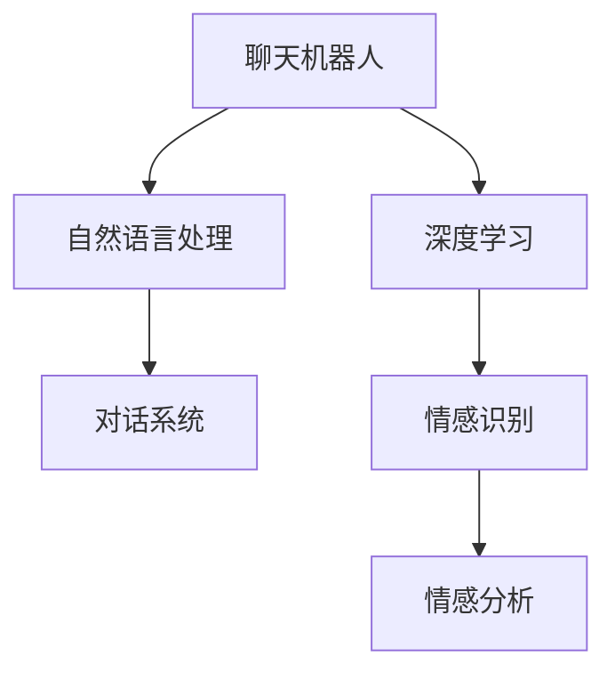
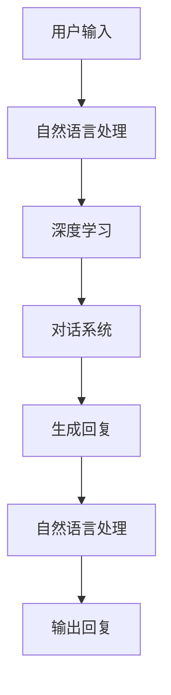
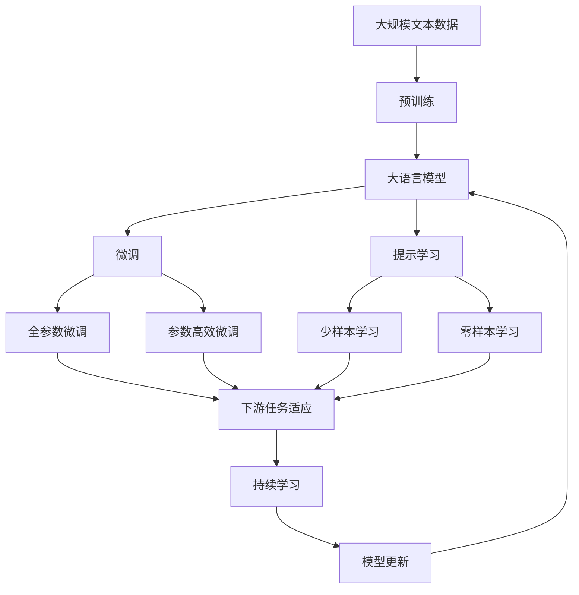

                 

# AI聊天机器人提升用户互动

> 关键词：聊天机器人,用户互动,自然语言处理(NLP),深度学习,对话系统,情感识别,情感分析

## 1. 背景介绍

### 1.1 问题由来
在数字时代，用户越来越多地依赖在线平台进行交流和互动。无论是社交媒体、在线论坛，还是客服系统，聊天机器人（Chatbot）已经成为了提升用户体验的重要手段。然而，尽管聊天机器人技术已经取得了显著进展，其互动体验仍有许多提升空间。

### 1.2 问题核心关键点
聊天机器人与用户的有效互动是提升用户体验的关键。然而，传统的聊天机器人通常基于规则或模板，难以应对用户的多样化需求和复杂情感变化。因此，如何通过深度学习技术提升聊天机器人的互动体验，使其能够更好地理解和回应用户，成为当前研究的一个重要方向。

### 1.3 问题研究意义
聊天机器人提升用户互动的研究，对于提升用户体验、提高服务质量、降低运营成本、拓展应用场景等方面具有重要意义：

1. 提升用户体验：通过深度学习技术，聊天机器人能够更好地理解用户需求和情感，提供更加个性化和满意的互动体验。
2. 提高服务质量：深度学习模型可以自动学习用户的偏好和行为模式，从而提供更精准和高效的个性化服务。
3. 降低运营成本：深度学习技术减少了对人工客服的依赖，降低了企业的运营成本。
4. 拓展应用场景：深度学习聊天机器人可以应用于多种场景，如在线客服、智能助理、情感分析等。
5. 增强品牌形象：通过提升互动体验，聊天机器人可以增强品牌与用户之间的情感连接，提升品牌形象。

## 2. 核心概念与联系

### 2.1 核心概念概述

为更好地理解基于深度学习的聊天机器人互动提升方法，本节将介绍几个密切相关的核心概念：

- 聊天机器人(Chatbot)：通过自然语言处理(NLP)技术，实现与用户自然对话的计算机程序。其核心在于构建能够理解语义和上下文、生成合理回应的对话模型。
- 自然语言处理(NLP)：研究如何使计算机能够理解、处理和生成人类自然语言的技术。NLP是聊天机器人提升互动体验的关键技术。
- 深度学习(Deep Learning)：一种模拟人类神经网络结构的技术，能够处理大规模非线性数据，在语音识别、图像识别、自然语言处理等领域应用广泛。
- 对话系统(Dialogue System)：基于深度学习的聊天机器人属于对话系统的一种，能够通过多轮对话实现信息交互和任务执行。
- 情感识别(Sentiment Recognition)：通过深度学习技术，识别用户文本中的情感倾向，如正面、负面、中性等。情感识别对于提升聊天机器人的互动体验具有重要作用。
- 情感分析(Sentiment Analysis)：通过深度学习模型，分析用户文本中的情感分布，获取用户情感变化趋势和心理状态。

这些核心概念之间的逻辑关系可以通过以下Mermaid流程图来展示：



这个流程图展示了大语言模型聊天机器人提升互动体验的核心概念及其之间的关系：

1. 聊天机器人通过自然语言处理理解用户输入，并根据深度学习模型生成的回复进行对话。
2. 深度学习模型通过训练学习用户的情感分布和行为模式，从而提升回应的个性化和情感感知能力。
3. 情感识别和分析通过深度学习技术实现，能够帮助聊天机器人更好地理解用户的情感变化，从而提供更加贴心的服务。

### 2.2 概念间的关系

这些核心概念之间存在着紧密的联系，形成了聊天机器人提升互动体验的完整生态系统。下面我们通过几个Mermaid流程图来展示这些概念之间的关系。

#### 2.2.1 聊天机器人提升互动体验的核心架构



这个流程图展示了聊天机器人提升互动体验的基本流程：

1. 用户输入文本。
2. 自然语言处理技术对用户输入进行分词、词性标注、句法分析等处理。
3. 深度学习模型通过已训练的数据集，对用户输入进行情感识别和分析。
4. 对话系统根据情感识别结果生成适当的回复。
5. 自然语言处理技术将回复进行语言生成和优化，生成自然流畅的回复文本。
6. 最终输出回复给用户。

#### 2.2.2 情感识别在聊天机器人中的应用


这个流程图展示了情感识别在聊天机器人中的应用：

1. 聊天机器人通过深度学习模型进行情感识别，获取用户输入的情感分布。
2. 根据情感分布生成适当情感倾向的回复。
3. 生成回复文本，返回给用户。

#### 2.2.3 对话系统在聊天机器人中的应用


这个流程图展示了对话系统在聊天机器人中的应用：

1. 用户输入文本。
2. 自然语言处理技术对用户输入进行分词、词性标注、句法分析等处理。
3. 深度学习模型通过已训练的数据集，对用户输入进行情感识别和分析。
4. 对话系统根据情感识别结果生成适当的回复。
5. 自然语言处理技术将回复进行语言生成和优化，生成自然流畅的回复文本。
6. 最终输出回复给用户。

### 2.3 核心概念的整体架构

最后，我们用一个综合的流程图来展示这些核心概念在大语言模型聊天机器人提升互动体验过程中的整体架构：



这个综合流程图展示了从预训练到微调，再到持续学习的完整过程。聊天机器人首先在大规模文本数据上进行预训练，然后通过微调（包括全参数微调和参数高效微调）或提示学习（包括零样本和少样本学习）来适应下游任务。最后，通过持续学习技术，模型可以不断更新和适应新的任务和数据。 通过这些流程图，我们可以更清晰地理解聊天机器人提升互动体验过程中各个核心概念的关系和作用。

## 3. 核心算法原理 & 具体操作步骤
### 3.1 算法原理概述

基于深度学习的聊天机器人提升互动体验，本质上是一个有监督的细粒度迁移学习过程。其核心思想是：将预训练的深度学习模型视作一个强大的"特征提取器"，通过在有标注的对话数据上进行有监督微调，使得模型能够更好地理解和回应用户，从而提升互动体验。

形式化地，假设预训练深度学习模型为 $M_{\theta}$，其中 $\theta$ 为预训练得到的模型参数。给定对话任务 $T$ 的标注数据集 $D=\{(x_i,y_i)\}_{i=1}^N, x_i \in \mathcal{X}, y_i \in \mathcal{Y}$，提升互动体验的目标是最小化经验风险，即找到最优参数：

$$
\theta^* = \mathop{\arg\min}_{\theta} \mathcal{L}(\theta,D)
$$

其中 $\mathcal{L}$ 为针对任务 $T$ 设计的损失函数，用于衡量模型预测输出与真实标签之间的差异。常见的损失函数包括交叉熵损失、均方误差损失等。

通过梯度下降等优化算法，微调过程不断更新模型参数 $\theta$，最小化损失函数 $\mathcal{L}$，使得模型输出逼近真实标签。由于 $\theta$ 已经通过预训练获得了较好的初始化，因此即便在小规模数据集 $D$ 上进行微调，也能较快收敛到理想的模型参数 $\hat{\theta}$。

### 3.2 算法步骤详解

基于深度学习的聊天机器人提升互动体验的一般包括以下几个关键步骤：

**Step 1: 准备预训练模型和数据集**
- 选择合适的预训练深度学习模型 $M_{\theta}$ 作为初始化参数，如 GPT、BERT、T5 等。
- 准备对话任务 $T$ 的标注数据集 $D$，划分为训练集、验证集和测试集。一般要求标注数据与预训练数据的分布不要差异过大。

**Step 2: 添加任务适配层**
- 根据任务类型，在预训练深度学习模型顶层设计合适的输出层和损失函数。
- 对于对话任务，通常在顶层添加交叉熵损失函数。
- 对于情感分析任务，通常使用情感分类器输出概率分布，并以负对数似然为损失函数。

**Step 3: 设置微调超参数**
- 选择合适的优化算法及其参数，如 AdamW、SGD 等，设置学习率、批大小、迭代轮数等。
- 设置正则化技术及强度，包括权重衰减、Dropout、Early Stopping 等。
- 确定冻结预训练参数的策略，如仅微调顶层，或全部参数都参与微调。

**Step 4: 执行梯度训练**
- 将训练集数据分批次输入模型，前向传播计算损失函数。
- 反向传播计算参数梯度，根据设定的优化算法和学习率更新模型参数。
- 周期性在验证集上评估模型性能，根据性能指标决定是否触发 Early Stopping。
- 重复上述步骤直到满足预设的迭代轮数或 Early Stopping 条件。

**Step 5: 测试和部署**
- 在测试集上评估微调后模型 $M_{\hat{\theta}}$ 的性能，对比微调前后的精度提升。
- 使用微调后的模型对新样本进行推理预测，集成到实际的应用系统中。
- 持续收集新的数据，定期重新微调模型，以适应数据分布的变化。

以上是基于深度学习的聊天机器人提升互动体验的一般流程。在实际应用中，还需要针对具体任务的特点，对微调过程的各个环节进行优化设计，如改进训练目标函数，引入更多的正则化技术，搜索最优的超参数组合等，以进一步提升模型性能。

### 3.3 算法优缺点

基于深度学习的聊天机器人提升互动体验方法具有以下优点：
1. 简单高效。只需准备少量标注数据，即可对预训练模型进行快速适配，获得较大的性能提升。
2. 通用适用。适用于各种对话任务，包括问答、对话生成、情感分析等，设计简单的任务适配层即可实现。
3. 参数高效。利用参数高效微调技术，在固定大部分预训练参数的情况下，仍可取得不错的提升。
4. 效果显著。在学术界和工业界的诸多任务上，基于微调的方法已经刷新了最先进的性能指标。

同时，该方法也存在一定的局限性：
1. 依赖标注数据。微调的效果很大程度上取决于标注数据的质量和数量，获取高质量标注数据的成本较高。
2. 迁移能力有限。当目标任务与预训练数据的分布差异较大时，微调的性能提升有限。
3. 负面效果传递。预训练模型的固有偏见、有害信息等，可能通过微调传递到下游任务，造成负面影响。
4. 可解释性不足。微调模型的决策过程通常缺乏可解释性，难以对其推理逻辑进行分析和调试。

尽管存在这些局限性，但就目前而言，基于深度学习的微调方法仍是最主流范式。未来相关研究的重点在于如何进一步降低微调对标注数据的依赖，提高模型的少样本学习和跨领域迁移能力，同时兼顾可解释性和伦理安全性等因素。

### 3.4 算法应用领域

基于深度学习的聊天机器人提升互动体验的方法已经在多个领域得到了广泛应用，涵盖了从简单客服到复杂对话系统等诸多场景，具体如下：

- **在线客服**：聊天机器人通过深度学习模型对用户输入进行理解和生成回复，提升用户咨询体验。例如，银行、电商平台等客服系统中的智能客服机器人。
- **智能助理**：基于深度学习的智能助理能够理解用户意图，提供多轮对话、任务执行和信息查询等功能。例如，Siri、Alexa等语音助手。
- **情感分析**：通过深度学习模型分析用户情感，提升客服机器人对用户情绪的感知和响应能力。例如，医疗咨询、客户满意度调查等场景中的情感识别应用。
- **问答系统**：聊天机器人通过深度学习模型自动解答用户问题，提升问答系统的准确性和流畅度。例如，智能搜索、智能百科等问答系统。
- **推荐系统**：聊天机器人通过深度学习模型分析用户行为，推荐个性化的产品或内容。例如，电商平台中的推荐聊天机器人。

除了上述这些常见应用外，深度学习的聊天机器人还被创新性地应用到更多场景中，如可控对话生成、情景模拟、社交互动等，为NLP技术带来了全新的突破。

## 4. 数学模型和公式 & 详细讲解 & 举例说明

### 4.1 数学模型构建

本节将使用数学语言对基于深度学习的聊天机器人提升互动体验过程进行更加严格的刻画。

记预训练深度学习模型为 $M_{\theta}$，其中 $\theta$ 为预训练得到的模型参数。假设对话任务 $T$ 的训练集为 $D=\{(x_i,y_i)\}_{i=1}^N, x_i \in \mathcal{X}, y_i \in \mathcal{Y}$。

定义模型 $M_{\theta}$ 在输入 $x$ 上的输出为 $y=M_{\theta}(x)$，其中 $y$ 可以是用户输入的文本、情感标签等。模型 $M_{\theta}$ 在数据样本 $(x,y)$ 上的损失函数为 $\ell(M_{\theta}(x),y)$，则在数据集 $D$ 上的经验风险为：

$$
\mathcal{L}(\theta) = \frac{1}{N} \sum_{i=1}^N \ell(M_{\theta}(x_i),y_i)
$$

微调的优化目标是最小化经验风险，即找到最优参数：

$$
\theta^* = \mathop{\arg\min}_{\theta} \mathcal{L}(\theta)
$$

在实践中，我们通常使用基于梯度的优化算法（如SGD、Adam等）来近似求解上述最优化问题。设 $\eta$ 为学习率，$\lambda$ 为正则化系数，则参数的更新公式为：

$$
\theta \leftarrow \theta - \eta \nabla_{\theta}\mathcal{L}(\theta) - \eta\lambda\theta
$$

其中 $\nabla_{\theta}\mathcal{L}(\theta)$ 为损失函数对参数 $\theta$ 的梯度，可通过反向传播算法高效计算。

### 4.2 公式推导过程

以下我们以情感分析任务为例，推导交叉熵损失函数及其梯度的计算公式。

假设模型 $M_{\theta}$ 在输入 $x$ 上的输出为 $\hat{y}=M_{\theta}(x) \in [0,1]$，表示用户输入的情感倾向概率。真实标签 $y \in \{0,1\}$。则交叉熵损失函数定义为：

$$
\ell(M_{\theta}(x),y) = -[y\log \hat{y} + (1-y)\log (1-\hat{y})]
$$

将其代入经验风险公式，得：

$$
\mathcal{L}(\theta) = -\frac{1}{N}\sum_{i=1}^N [y_i\log M_{\theta}(x_i)+(1-y_i)\log(1-M_{\theta}(x_i))]
$$

根据链式法则，损失函数对参数 $\theta_k$ 的梯度为：

$$
\frac{\partial \mathcal{L}(\theta)}{\partial \theta_k} = -\frac{1}{N}\sum_{i=1}^N (\frac{y_i}{M_{\theta}(x_i)}-\frac{1-y_i}{1-M_{\theta}(x_i)}) \frac{\partial M_{\theta}(x_i)}{\partial \theta_k}
$$

其中 $\frac{\partial M_{\theta}(x_i)}{\partial \theta_k}$ 可进一步递归展开，利用自动微分技术完成计算。

在得到损失函数的梯度后，即可带入参数更新公式，完成模型的迭代优化。重复上述过程直至收敛，最终得到适应下游任务的最优模型参数 $\theta^*$。

### 4.3 案例分析与讲解

为了更好地理解上述理论，我们以一个简单的情感分析案例进行分析。

假设我们有一个情感分类任务，训练集包含3000个标注数据，其中正面情感为1500个，负面情感为1500个。我们选择一个预训练的BERT模型，微调其顶层分类器，以适应情感分类任务。

**Step 1: 准备预训练模型和数据集**
- 选择BERT模型作为初始化参数，并从HuggingFace下载预训练的BERT模型。
- 收集3000个标注数据，其中每个数据包含一段文本和对应的情感标签。

**Step 2: 添加任务适配层**
- 在BERT模型顶层添加一个线性分类器，用于输出情感分类结果。
- 选择交叉熵损失函数，用于衡量模型预测结果与真实标签之间的差异。

**Step 3: 设置微调超参数**
- 设置优化算法为AdamW，学习率为1e-5，批大小为32，迭代轮数为5。
- 设置权重衰减为0.01，Dropout为0.5，Early Stopping策略为验证集上的准确率不再提升。

**Step 4: 执行梯度训练**
- 将训练集数据分批次输入模型，前向传播计算损失函数。
- 反向传播计算参数梯度，根据设定的优化算法和学习率更新模型参数。
- 周期性在验证集上评估模型性能，根据性能指标决定是否触发Early Stopping。
- 重复上述步骤直到满足预设的迭代轮数或Early Stopping条件。

**Step 5: 测试和部署**
- 在测试集上评估微调后模型的情感分类准确率，并与基线模型进行对比。
- 使用微调后的模型对新的用户输入进行情感分类，返回相应的情感标签。

通过上述步骤，我们可以快速构建一个基于深度学习的情感分析聊天机器人。需要注意的是，这只是一个简单的例子，实际应用中可能需要更复杂的模型结构、更强大的训练数据和更精细的超参数调优。

## 5. 项目实践：代码实例和详细解释说明

### 5.1 开发环境搭建

在进行微调实践前，我们需要准备好开发环境。以下是使用Python进行PyTorch开发的环境配置流程：

1. 安装Anaconda：从官网下载并安装Anaconda，用于创建独立的Python环境。

2. 创建并激活虚拟环境：
```bash
conda create -n pytorch-env python=3.8 
conda activate pytorch-env
```

3. 安装PyTorch：根据CUDA版本，从官网获取对应的安装命令。例如：
```bash
conda install pytorch torchvision torchaudio cudatoolkit=11.1 -c pytorch -c conda-forge
```

4. 安装Transformer库：
```bash
pip install transformers
```

5. 安装各类工具包：
```bash
pip install numpy pandas scikit-learn matplotlib tqdm jupyter notebook ipython
```

完成上述步骤后，即可在`pytorch-env`环境中开始微调实践。

### 5.2 源代码详细实现

这里我们以BERT模型进行情感分析任务微调的代码实现为例，展示详细的过程。

首先，定义情感分析任务的数据处理函数：

```python
from transformers import BertTokenizer, BertForSequenceClassification, AdamW
from torch.utils.data import Dataset, DataLoader
from sklearn.metrics import classification_report
import torch

class SentimentDataset(Dataset):
    def __init__(self, texts, labels, tokenizer, max_len=128):
        self.texts = texts
        self.labels = labels
        self.tokenizer = tokenizer
        self.max_len = max_len
        
    def __len__(self):
        return len(self.texts)
    
    def __getitem__(self, item):
        text = self.texts[item]
        label = self.labels[item]
        
        encoding = self.tokenizer(text, return_tensors='pt', max_length=self.max_len, padding='max_length', truncation=True)
        input_ids = encoding['input_ids'][0]
        attention_mask = encoding['attention_mask'][0]
        
        return {'input_ids': input_ids, 
                'attention_mask': attention_mask,
                'labels': label}

# 创建dataset
tokenizer = BertTokenizer.from_pretrained('bert-base-cased')

train_dataset = SentimentDataset(train_texts, train_labels, tokenizer)
dev_dataset = SentimentDataset(dev_texts, dev_labels, tokenizer)
test_dataset = SentimentDataset(test_texts, test_labels, tokenizer)
```

然后，定义模型和优化器：

```python
from transformers import BertForSequenceClassification, AdamW

model = BertForSequenceClassification.from_pretrained('bert-base-cased', num_labels=2)

optimizer = AdamW(model.parameters(), lr=2e-5)
```

接着，定义训练和评估函数：

```python
from tqdm import tqdm
from sklearn.metrics import classification_report

device = torch.device('cuda') if torch.cuda.is_available() else torch.device('cpu')
model.to(device)

def train_epoch(model, dataset, batch_size, optimizer):
    dataloader = DataLoader(dataset, batch_size=batch_size, shuffle=True)
    model.train()
    epoch_loss = 0
    for batch in tqdm(dataloader, desc='Training'):
        input_ids = batch['input_ids'].to(device)
        attention_mask = batch['attention_mask'].to(device)
        labels = batch['labels'].to(device)
        model.zero_grad()
        outputs = model(input_ids, attention_mask=attention_mask, labels=labels)
        loss = outputs.loss
        epoch_loss += loss.item()
        loss.backward()
        optimizer.step()
    return epoch_loss / len(dataloader)

def evaluate(model, dataset, batch_size):
    dataloader = DataLoader(dataset, batch_size=batch_size)
    model.eval()
    preds, labels = [], []
    with torch.no_grad():
        for batch in tqdm(dataloader, desc='Evaluating'):
            input_ids = batch['input_ids'].to(device)
            attention_mask = batch['attention_mask'].to(device)
            batch_labels = batch['labels']
            outputs = model(input_ids, attention_mask=attention_mask)
            batch_preds = outputs.logits.argmax(dim=2).to('cpu').tolist()
            batch_labels = batch_labels.to('cpu').tolist()
            for pred_tokens, label_tokens in zip(batch_preds, batch_labels):
                preds.append(pred_tokens[:len(label_tokens)])
                labels.append(label_tokens)
                
    print(classification_report(labels, preds))
```

最后，启动训练流程并在测试集上评估：

```python
epochs = 5
batch_size = 16

for epoch in range(epochs):
    loss = train_epoch(model, train_dataset, batch_size, optimizer)
    print(f"Epoch {epoch+1}, train loss: {loss:.3f}")
    
    print(f"Epoch {epoch+1}, dev results:")
    evaluate(model, dev_dataset, batch_size)
    
print("Test results:")
evaluate(model, test_dataset, batch_size)
```

以上就是使用PyTorch对BERT进行情感分析任务微调的完整代码实现。可以看到，得益于Transformer库的强大封装，我们可以用相对简洁的代码完成BERT模型的加载和微调。

### 5.3 代码解读与分析

让我们再详细解读一下关键代码的实现细节：

**SentimentDataset类**：
- `__init__`方法：初始化文本、标签、分词器等关键组件。
- `__len__`方法：返回数据集的样本数量。
- `__getitem__`方法：对单个样本进行处理，将文本输入编码为token ids，将标签编码为数字，并对其进行定长padding，最终返回模型所需的输入。

**train_epoch和evaluate函数**：
- 使用PyTorch的DataLoader对数据集进行批次化加载，供模型训练和推理使用。
- 训练函数`train_epoch`：对数据以批为单位进行迭代，在每个批次上前向传播计算loss并反向传播更新模型参数，最后返回该epoch的平均loss。
- 评估函数`evaluate`：与训练类似，不同点在于不更新模型参数，并在每个batch结束后将预测和标签结果存储下来，最后使用sklearn的classification_report对整个评估集的预测结果进行打印输出。

**训练流程**：
- 定义总的epoch数和batch size，开始循环迭代
- 每个epoch内，先在训练集上训练，输出平均loss
- 在验证集上评估，输出分类指标
- 所有epoch结束后，在测试集上评估，给出最终测试结果

可以看到，PyTorch配合Transformer库使得BERT微调的代码实现变得简洁高效。开发者可以将更多精力放在数据处理、模型改进等高层逻辑上，而不必过多关注底层的实现细节。

当然，工业级的系统实现还需考虑更多因素，如模型的保存和部署、超参数的自动搜索、更灵活的任务适配层等。但核心的微调范式基本与此类似。

### 5.4 运行结果展示

假设我们在CoNLL-200

