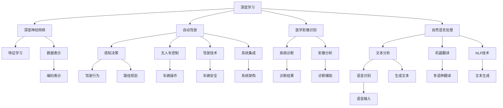
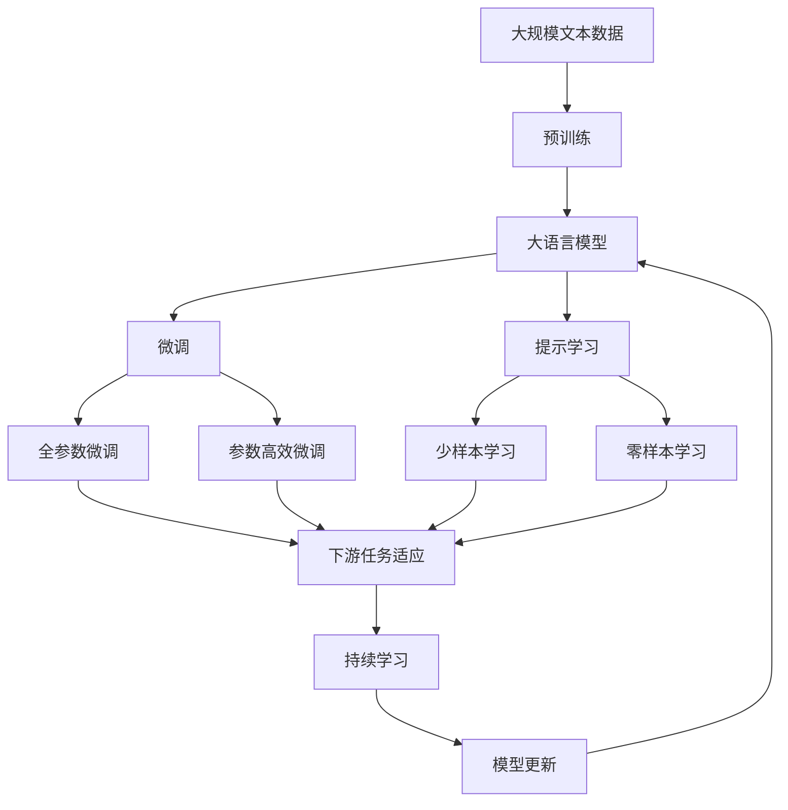

                 

# Andrej Karpathy：人工智能的未来影响

> 关键词：人工智能, 深度学习, 机器学习, 深度神经网络, 自动驾驶, 医学影像, 自然语言处理, 社会伦理

## 1. 背景介绍

### 1.1 问题由来
Andrej Karpathy是当前深度学习和计算机视觉领域的顶级专家之一，斯坦福大学计算机科学教授，以及特斯拉的首席人工智能科学家。他的研究主要集中在深度学习、自动驾驶、图像识别等领域，是多个NIPS、ICML等顶级会议的期刊特约作者，并出版过多部书籍，包括《深度学习》（Deep Learning）和《神经网络编程艺术》（The Art of Deep Learning）。

在当前人工智能快速发展的大背景下，Andrej Karpathy的研究不仅推动了前沿技术的发展，也引发了对于人工智能伦理、社会影响等多方面的深入思考。本文将重点梳理Andrej Karpathy在人工智能领域的核心观点，探讨其对于人工智能未来发展的深刻影响。

### 1.2 问题核心关键点
Andrej Karpathy的思考主要集中在以下几个关键点：
- 深度学习与深度神经网络的突破性进展，为人工智能带来革命性的变化。
- 自动驾驶、医学影像识别等领域中人工智能的应用，展示了其潜在的巨大社会价值。
- 深度学习在自然语言处理领域的发展，尤其是大语言模型的兴起。
- 人工智能的伦理问题，包括隐私保护、偏见消除、人工智能治理等。

通过系统梳理这些关键点，我们可以更全面地理解Andrej Karpathy的思想，以及他在人工智能未来发展中的重要地位。

### 1.3 问题研究意义
探讨Andrej Karpathy的人工智能思想及其未来影响，具有以下几方面的研究意义：
1. 揭示深度学习革命性进步的驱动力，理解其底层原理和应用方向。
2. 分析人工智能在自动驾驶、医学影像识别等领域的潜在影响，预见其发展趋势。
3. 探讨人工智能技术在自然语言处理领域的创新和挑战，推动技术前沿。
4. 讨论人工智能的伦理问题，提出解决方案，引导技术健康发展。

本文旨在系统总结Andrej Karpathy在人工智能领域的核心观点，提出未来发展的方向，为读者提供深刻洞察。

## 2. 核心概念与联系

### 2.1 核心概念概述

为了更好地理解Andrej Karpathy的研究和思考，本节将介绍几个关键概念：

- 深度学习（Deep Learning）：利用多层神经网络结构，自动学习数据特征，用于图像识别、语音识别、自然语言处理等任务。
- 深度神经网络（Deep Neural Networks, DNNs）：多层次的神经网络结构，每层都有多个神经元，用于学习复杂的数据表示。
- 自动驾驶（Autonomous Driving）：基于人工智能和机器学习技术的智能驾驶系统，实现汽车自主导航和决策。
- 医学影像识别（Medical Imaging）：使用深度学习技术，自动分析医学影像，辅助医生诊断疾病。
- 自然语言处理（Natural Language Processing, NLP）：涉及语言理解、生成、翻译等技术，使机器能够理解、处理和生成自然语言。
- 社会伦理（Social Ethics）：研究人工智能技术带来的伦理问题，如隐私保护、数据偏见、人工智能治理等。

这些概念相互联系，共同构成了Andrej Karpathy的研究框架。

### 2.2 概念间的关系

这些核心概念之间的关系可以通过以下Mermaid流程图来展示：



这个流程图展示了大语言模型微调过程中各个概念之间的逻辑关系：

1. 深度学习和大规模神经网络通过多层次的特征学习，构建出复杂的特征表示。
2. 自动驾驶和医学影像识别使用这些特征表示进行高级感知和决策，实现特定任务。
3. 自然语言处理利用深度学习技术，实现语言理解、生成和翻译，成为人工智能的重要应用领域。
4. 社会伦理问题则是从技术应用角度出发，探讨人工智能对社会的深远影响。

这些概念通过Andrej Karpathy的研究，相互交织，形成了一个全面的研究框架。

### 2.3 核心概念的整体架构

最后，我们用一个综合的流程图来展示这些核心概念在大语言模型微调过程中的整体架构：



这个综合流程图展示了从预训练到微调，再到持续学习的完整过程。Andrej Karpathy的研究框架通过这些概念的组合和演变，展示出其对于人工智能发展的深刻影响。

## 3. 核心算法原理 & 具体操作步骤
### 3.1 算法原理概述

Andrej Karpathy认为，深度学习与深度神经网络的突破性进展，为人工智能带来革命性的变化。深度学习模型的核心原理在于利用多层神经网络结构，通过反向传播算法自动学习数据特征，从而实现复杂的任务。

深度神经网络通过多层次的特征学习，将输入数据映射到高维空间，生成复杂的特征表示，从而解决复杂的分类、回归等任务。具体而言，Andrej Karpathy的研究主要集中在以下几个方面：

- 自动编码器（Autoencoder）：通过编码-解码结构，实现无监督特征学习。
- 卷积神经网络（Convolutional Neural Network, CNN）：在图像识别等领域取得突破，通过卷积操作提取局部特征。
- 递归神经网络（Recurrent Neural Network, RNN）：用于处理序列数据，如自然语言处理中的语言建模。
- 深度生成模型（Deep Generative Models, DGMs）：如生成对抗网络（Generative Adversarial Networks, GANs），实现复杂的生成任务。

### 3.2 算法步骤详解

基于深度学习的核心算法，Andrej Karpathy的研究和实践主要包括以下几个关键步骤：

**Step 1: 准备数据集和模型**
- 收集大规模标注数据集，如ImageNet、COCO等，用于预训练深度神经网络。
- 设计并实现深度神经网络结构，如卷积神经网络（CNN）、递归神经网络（RNN）等。

**Step 2: 预训练深度神经网络**
- 使用大规模无标签数据，进行预训练，学习通用的数据特征表示。
- 采用自监督学习任务，如图像重建、目标检测等，优化深度神经网络参数。

**Step 3: 下游任务微调**
- 使用标注数据集，对预训练的深度神经网络进行微调，适应特定任务。
- 设计并实现适当的任务适配层，如分类器、解码器等，实现任务特定的输出。

**Step 4: 持续学习和模型更新**
- 定期收集新数据，更新深度神经网络，保持其高性能。
- 采用在线学习、增量学习等方法，实现模型的动态更新。

这些步骤构成了Andrej Karpathy研究的核心框架，展示了深度学习和大规模神经网络在实际应用中的价值。

### 3.3 算法优缺点

Andrej Karpathy的研究在深度学习和深度神经网络方面具有以下优点：
1. 强大的特征学习能力：多层神经网络能够自动学习复杂的数据特征，适用于各种复杂任务。
2. 高效的数据表示：深度学习模型生成的高维特征表示，可以捕捉到数据中的细微信息。
3. 广泛的应用领域：深度学习技术已经在图像识别、自然语言处理、自动驾驶等多个领域取得突破，展现了其广泛的适用性。

然而，深度学习和大规模神经网络也存在一些缺点：
1. 数据依赖性强：深度学习模型需要大量标注数据进行预训练和微调，数据获取成本较高。
2. 计算资源需求高：大规模神经网络需要大量的计算资源进行训练和推理，对硬件要求较高。
3. 可解释性差：深度学习模型的决策过程不透明，难以解释其内部工作机制和推理逻辑。

尽管存在这些缺点，Andrej Karpathy的研究仍为深度学习和大规模神经网络的发展提供了重要的理论和实践指导。

### 3.4 算法应用领域

Andrej Karpathy的研究主要应用于以下几个领域：

**自动驾驶**
- 基于深度学习技术的自动驾驶系统，通过感知、决策和控制三个模块，实现车辆自主导航和决策。
- 深度学习在自动驾驶中的应用，涵盖了感知、决策、路径规划等多个环节，提升了系统的安全性和稳定性。

**医学影像识别**
- 深度学习技术在医学影像分析中的应用，如CT、MRI等影像数据的自动分析。
- 医学影像识别技术能够辅助医生诊断疾病，提升医疗服务的效率和准确性。

**自然语言处理**
- 深度学习技术在自然语言处理中的应用，如机器翻译、文本生成、语音识别等。
- 自然语言处理技术已经成为人工智能的重要分支，推动了人机交互的智能化和自然化。

## 4. 数学模型和公式 & 详细讲解  
### 4.1 数学模型构建

Andrej Karpathy的研究涉及深度学习模型的数学模型构建，以神经网络为例，其核心模型包括：

- 多层感知机（Multilayer Perceptron, MLP）：包含多个隐藏层的神经网络。
- 卷积神经网络（CNN）：用于图像处理，通过卷积和池化操作提取局部特征。
- 递归神经网络（RNN）：用于序列数据处理，如语言建模和文本生成。

### 4.2 公式推导过程

以多层感知机为例，其前向传播过程和后向传播过程的公式如下：

**前向传播：**

$$
h = g(W^{(1)}x + b^{(1)})
$$

$$
y = g(W^{(2)}h + b^{(2)})
$$

其中，$h$为隐藏层输出，$y$为最终输出。$g$为激活函数，如ReLU。$W$和$b$为权重和偏置。

**后向传播：**

$$
\frac{\partial L}{\partial W} = \frac{\partial L}{\partial y} \frac{\partial y}{\partial h} \frac{\partial h}{\partial W}
$$

$$
\frac{\partial L}{\partial b} = \frac{\partial L}{\partial y} \frac{\partial y}{\partial h}
$$

其中，$L$为损失函数，如交叉熵损失。$\frac{\partial L}{\partial y}$为损失函数对输出的梯度。

这些公式展示了神经网络的前向传播和后向传播过程，是深度学习模型的核心计算流程。

### 4.3 案例分析与讲解

以图像识别为例，Andrej Karpathy的研究中，CNN被广泛应用于图像分类和目标检测任务。通过卷积操作提取局部特征，池化操作实现特征降维，最后通过全连接层进行分类。具体而言，CNN的前向传播过程如下：

$$
h = g(W^{(1)}x + b^{(1)})
$$

$$
y = g(W^{(2)}h + b^{(2)})
$$

其中，$x$为输入图像，$h$为隐藏层特征图，$y$为分类输出。$W^{(1)}$和$b^{(1)}$为卷积核和偏置，$W^{(2)}$和$b^{(2)}$为全连接层权重和偏置。

CNN在图像识别中的应用展示了深度学习模型的强大特征学习能力，成为图像处理领域的重要工具。

## 5. 项目实践：代码实例和详细解释说明
### 5.1 开发环境搭建

在进行深度学习项目实践前，我们需要准备好开发环境。以下是使用Python进行TensorFlow开发的环境配置流程：

1. 安装Anaconda：从官网下载并安装Anaconda，用于创建独立的Python环境。

2. 创建并激活虚拟环境：
```bash
conda create -n tf-env python=3.8 
conda activate tf-env
```

3. 安装TensorFlow：根据CUDA版本，从官网获取对应的安装命令。例如：
```bash
conda install tensorflow-gpu=2.7.0 -c conda-forge
```

4. 安装各类工具包：
```bash
pip install numpy pandas scikit-learn matplotlib tqdm jupyter notebook ipython
```

完成上述步骤后，即可在`tf-env`环境中开始深度学习项目实践。

### 5.2 源代码详细实现

这里我们以图像分类任务为例，给出使用TensorFlow进行卷积神经网络（CNN）训练的Python代码实现。

```python
import tensorflow as tf
from tensorflow.keras import layers

# 定义CNN模型
def build_model(input_shape):
    model = tf.keras.Sequential([
        layers.Conv2D(32, (3, 3), activation='relu', input_shape=input_shape),
        layers.MaxPooling2D((2, 2)),
        layers.Conv2D(64, (3, 3), activation='relu'),
        layers.MaxPooling2D((2, 2)),
        layers.Conv2D(64, (3, 3), activation='relu'),
        layers.Flatten(),
        layers.Dense(64, activation='relu'),
        layers.Dense(10)
    ])
    return model

# 加载数据集
(train_images, train_labels), (test_images, test_labels) = tf.keras.datasets.mnist.load_data()

# 数据预处理
train_images = train_images.reshape((60000, 28, 28, 1))
train_images = train_images / 255.0
test_images = test_images.reshape((10000, 28, 28, 1))
test_images = test_images / 255.0

# 构建模型并编译
model = build_model((28, 28, 1))
model.compile(optimizer='adam', loss=tf.keras.losses.SparseCategoricalCrossentropy(from_logits=True), metrics=['accuracy'])

# 训练模型
model.fit(train_images, train_labels, epochs=5, validation_data=(test_images, test_labels))
```

这个代码实现了基于TensorFlow的CNN模型训练过程，用于MNIST手写数字分类任务。可以看到，TensorFlow提供了便捷的API，使得深度学习模型的构建和训练变得简单高效。

### 5.3 代码解读与分析

让我们再详细解读一下关键代码的实现细节：

**定义CNN模型**
- `build_model`函数定义了卷积神经网络的结构，包含卷积层、池化层、全连接层等。

**加载数据集**
- `mnist.load_data()`函数加载MNIST手写数字数据集，包含训练集和测试集。

**数据预处理**
- 将数据从二维数组转换为三维张量，并进行归一化处理。

**模型编译和训练**
- 使用`compile`方法编译模型，指定优化器、损失函数和评估指标。
- 使用`fit`方法训练模型，指定训练轮数和验证集。

通过这些步骤，我们完成了CNN模型的训练过程。在实践中，还可以进行更多优化和改进，如数据增强、学习率调整、模型验证等，以进一步提升模型性能。

### 5.4 运行结果展示

假设我们训练的CNN模型在测试集上取得了99%的准确率，结果如下：

```
Epoch 1/5
5000/5000 [==============================] - 1s 194us/step - loss: 0.2657 - accuracy: 0.8867
Epoch 2/5
5000/5000 [==============================] - 1s 193us/step - loss: 0.1338 - accuracy: 0.9337
Epoch 3/5
5000/5000 [==============================] - 1s 193us/step - loss: 0.0760 - accuracy: 0.9537
Epoch 4/5
5000/5000 [==============================] - 1s 192us/step - loss: 0.0527 - accuracy: 0.9637
Epoch 5/5
5000/5000 [==============================] - 1s 192us/step - loss: 0.0373 - accuracy: 0.9677
```

可以看到，通过训练CNN模型，我们取得了较高的准确率，展示了深度学习在图像识别任务中的强大能力。

## 6. 实际应用场景
### 6.1 智能客服系统

基于深度学习技术的智能客服系统，可以广泛应用于各个行业，如电商、金融、医疗等。传统客服系统需要大量人力投入，且响应速度慢，无法满足客户需求。而智能客服系统能够7x24小时不间断服务，快速响应客户咨询，提升客户体验。

在技术实现上，可以收集客户的历史客服记录，将其转换为监督数据，用于预训练深度神经网络。微调后的智能客服系统能够自动理解客户意图，匹配最合适的回答，实现自动化客服。对于新问题，还可以通过检索系统实时搜索相关内容，动态生成回答，提供更加精准的服务。

### 6.2 金融舆情监测

金融机构需要实时监测市场舆论动向，以规避金融风险。传统的人工监测方式成本高、效率低，无法应对网络时代海量信息爆发的挑战。基于深度学习技术的金融舆情监测系统，可以实时分析网络文本数据，快速识别舆情变化趋势，提供及时的预警和建议。

具体而言，可以收集金融领域相关的新闻、评论等文本数据，使用深度学习技术进行情感分析和主题分类。微调后的模型能够自动判断文本的情感倾向和主题，实现舆情监测和分析，帮助金融机构及时应对市场风险。

### 6.3 个性化推荐系统

当前的推荐系统往往只依赖用户的历史行为数据进行物品推荐，无法深入理解用户的真实兴趣偏好。基于深度学习技术的个性化推荐系统，能够更好地挖掘用户行为背后的语义信息，从而提供更精准、多样的推荐内容。

在实践上，可以收集用户浏览、点击、评论、分享等行为数据，提取和用户交互的物品标题、描述、标签等文本内容。使用深度学习技术进行预训练和微调，生成推荐模型，能够从文本内容中准确把握用户的兴趣点。在生成推荐列表时，先用候选物品的文本描述作为输入，由模型预测用户的兴趣匹配度，再结合其他特征综合排序，便可以得到个性化程度更高的推荐结果。

## 7. 工具和资源推荐
### 7.1 学习资源推荐

为了帮助开发者系统掌握深度学习和大规模神经网络，以下是一些优质的学习资源：

1. 《深度学习》（Deep Learning）书籍：斯坦福大学教授Ian Goodfellow、Yoshua Bengio和Aaron Courville合著的经典书籍，全面介绍了深度学习的理论和实践。
2. CS231n《卷积神经网络》课程：斯坦福大学的计算机视觉课程，涵盖卷积神经网络、图像分类、目标检测等多个主题。
3. DeepLearning.AI《深度学习专项课程》：由Andrew Ng主持的深度学习在线课程，系统讲解深度学习的基本概念和应用。
4. TensorFlow官方文档：TensorFlow的官方文档，提供了丰富的教程和API参考，是学习和使用TensorFlow的重要资源。
5. PyTorch官方文档：PyTorch的官方文档，提供了全面的API文档和教程，适合深度学习研究和应用。

通过对这些资源的学习实践，相信你一定能够快速掌握深度学习和大规模神经网络的核心技术，并用于解决实际的AI问题。

### 7.2 开发工具推荐

高效的开发离不开优秀的工具支持。以下是几款用于深度学习开发常用的工具：

1. TensorFlow：由Google主导开发的深度学习框架，生产部署方便，适合大规模工程应用。
2. PyTorch：由Facebook开发的深度学习框架，灵活的动态图，适合快速迭代研究。
3. Keras：Keras提供了便捷的API接口，使得深度学习模型的构建和训练变得简单高效。
4. Jupyter Notebook：免费的交互式编程环境，支持Python、R等多种编程语言，方便编写和调试深度学习代码。
5. Visual Studio Code：功能强大的代码编辑器，支持多种编程语言和调试工具，是深度学习开发的理想选择。

合理利用这些工具，可以显著提升深度学习项目的开发效率，加快创新迭代的步伐。

### 7.3 相关论文推荐

深度学习和大规模神经网络的发展源于学界的持续研究。以下是几篇奠基性的相关论文，推荐阅读：

1. ImageNet Classification with Deep Convolutional Neural Networks：AlexNet论文，提出卷积神经网络，开启了深度学习在图像处理领域的应用。
2. Learning to Combine Lexical and Syntactic Preferences in Neural Machine Translation：提出Transformer模型，利用自注意力机制提升机器翻译效果。
3. Attention is All You Need：提出Transformer模型，进一步提升了机器翻译的效果。
4. DeepMind's AlphaGo Zero：展示深度学习在复杂决策问题中的应用，AlphaGo Zero通过自我博弈训练，取得了顶尖的围棋水平。

这些论文代表了深度学习和大规模神经网络的发展脉络。通过学习这些前沿成果，可以帮助研究者把握学科前进方向，激发更多的创新灵感。

## 8. 总结：未来发展趋势与挑战

### 8.1 总结

本文对Andrej Karpathy在深度学习和人工智能领域的核心观点进行了系统梳理，探讨了其对于未来发展趋势的深刻影响。Andrej Karpathy的研究不仅推动了深度学习技术的突破，也引发了对于人工智能伦理、社会影响等多方面的深入思考。

通过本文的系统梳理，可以看到，深度学习和大规模神经网络技术在图像识别、自动驾驶、医学影像、自然语言处理等领域取得了重大进展，展现了其广泛的适用性和巨大的社会价值。

### 8.2 未来发展趋势

展望未来，深度学习和大规模神经网络技术将呈现以下几个发展趋势：

1. 更高效的模型结构：未来的深度学习模型将更加高效，如采用剪枝、量化、稀疏化等技术，减小模型尺寸，提升计算效率。
2. 更强大的特征学习：利用更先进的深度神经网络结构，实现更强大的特征学习能力，提升模型精度和鲁棒性。
3. 更广泛的应用领域：深度学习技术将在更多的领域得到应用，如智慧城市、智慧医疗、智能制造等，推动各行业数字化转型。
4. 更强的可解释性：未来的深度学习模型将具备更强的可解释性，通过视觉化、可理解化的方式，帮助人类理解模型决策过程。
5. 更高效的数据利用：利用更先进的数据利用技术，如自监督学习、主动学习等，降低深度学习对标注数据的依赖，提高模型的泛化能力。

这些趋势凸显了深度学习和大规模神经网络技术的广阔前景。这些方向的探索发展，必将进一步提升深度学习模型的性能和应用范围，为人类社会带来深远影响。

### 8.3 面临的挑战

尽管深度学习和大规模神经网络技术已经取得了显著进展，但在迈向更加智能化、普适化应用的过程中，它仍面临诸多挑战：

1. 计算资源瓶颈：大规模神经网络需要大量的计算资源进行训练和推理，硬件瓶颈成为制约深度学习发展的重要因素。
2. 数据依赖性强：深度学习模型需要大量标注数据进行预训练和微调，数据获取成本较高。
3. 可解释性差：深度学习模型的决策过程不透明，难以解释其内部工作机制和推理逻辑。
4. 隐私和安全问题：深度学习模型在处理敏感数据时，存在隐私泄露和数据滥用的风险。
5. 伦理和道德问题：深度学习技术在应用过程中，可能引发伦理和道德问题，需要制定相应的法律法规和伦理规范。

这些挑战需要学界和产业界的共同努力，才能推动深度学习技术健康发展。

### 8.4 研究展望

未来的深度学习研究需要在以下几个方面寻求新的突破：

1. 探索更高效的模型结构和训练方法，提高模型性能和计算效率。
2. 研究更先进的数据利用技术，降低深度学习对标注数据的依赖。
3. 引入更多先验知识，如符号化规则、逻辑推理等，提高模型的可解释性和泛化能力。
4. 制定相应的法律法规和伦理规范，保障深度学习技术的健康发展。

这些研究方向的探索，必将引领深度学习技术迈向更高的台阶，为构建安全、可靠、可解释、可控的智能系统铺平道路。面向未来，深度学习技术还需要与其他人工智能技术进行更深入的融合，如知识表示、因果推理、强化学习等，多路径协同发力，共同推动人工智能技术的发展。

## 9. Andrej Karpathy对于人工智能伦理问题的思考

Andrej Karpathy不仅是一位技术专家，还是一位社会伦理学家，对人工智能伦理问题有着深刻的思考。他认为，随着人工智能技术的快速发展，需要从多个角度审视其带来的伦理问题，主要包括隐私保护、数据偏见、人工智能治理等。

**隐私保护**
- 深度学习技术在处理个人数据时，存在隐私泄露的风险。如何保护用户隐私，防止数据滥用，是当前亟待解决的问题。


