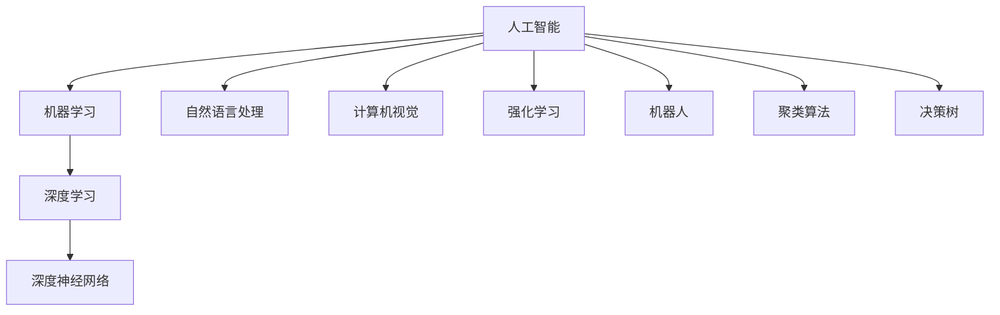

                 

# Artificial Intelligence

> 关键词：人工智能,机器学习,深度学习,深度神经网络,自然语言处理(NLP),计算机视觉(CV),强化学习,机器人,决策树,聚类算法

## 1. 背景介绍

### 1.1 问题由来
人工智能(Artificial Intelligence, AI)是一个涉及计算机科学、认知科学、控制理论、神经科学等多个领域的交叉学科，旨在创建能够模仿人类智能行为的机器系统。随着计算技术的发展和数据量的激增，人工智能在图像识别、语音识别、自然语言处理、机器翻译等诸多领域取得了显著进展。

AI的核心目标是使机器系统能够执行复杂任务，超越传统的自动化。这一目标的实现离不开对机器学习(ML)，尤其是深度学习(DL)技术的研究与应用。深度神经网络(DNN)凭借其强大的非线性表达能力和自适应学习能力，已成为AI发展的主力引擎。

## 2. 核心概念与联系

### 2.1 核心概念概述
为深入理解人工智能的核心思想，本节将介绍几个关键概念：

- **人工智能**：旨在创建具有自主决策和感知能力的智能系统，涵盖机器学习、自然语言处理、计算机视觉、机器人等领域。
- **机器学习**：通过数据驱动的学习算法，使机器系统自动改进任务性能。常见的学习方式包括监督学习、无监督学习和强化学习。
- **深度学习**：一种特殊的机器学习技术，利用多层次神经网络结构提取特征，用于图像、语音、文本等复杂数据处理。
- **深度神经网络**：一种由多个层次的非线性单元组成的计算模型，常用于模式识别、自然语言处理和计算机视觉任务。
- **自然语言处理(NLP)**：使计算机能够理解和生成人类语言的技术，包括分词、语法分析、语义理解等。
- **计算机视觉(CV)**：使计算机能够感知和理解图像和视频数据的领域，涵盖图像分类、目标检测、图像生成等任务。
- **强化学习**：通过与环境互动，使智能体学习最优策略以最大化累积奖励的技术。
- **机器人**：集成了AI技术的自动化设备，具有自主导航、操作、感知等功能，广泛应用于工业、医疗和家居等领域。
- **聚类算法**：无监督学习的一种，用于发现数据集中的内在结构和模式，常见算法包括K-Means、层次聚类等。
- **决策树**：一种用于分类和回归分析的监督学习算法，通过树状结构进行决策路径选择。

### 2.2 概念间的关系
这些核心概念之间的关系可以通过以下Mermaid流程图来展示：



这个流程图展示了人工智能各个分支的核心概念及其相互关系：

1. 机器学习是人工智能的核心技术之一，涵盖了监督学习、无监督学习和强化学习。
2. 深度学习是机器学习的一个分支，利用多层次神经网络结构，常用于图像、语音和文本处理。
3. 深度神经网络是深度学习的基础架构，通过多个层次的线性变换和非线性激活函数，实现复杂特征的提取。
4. 自然语言处理和计算机视觉是人工智能在感知和理解方面的两大分支，主要解决语音识别、图像分类、文本分析和目标检测等问题。
5. 强化学习是实现智能决策和行为规划的重要技术，常用于机器人控制和自动化系统设计。
6. 聚类算法和决策树是无监督学习和监督学习中的经典算法，用于数据集中的模式发现和决策路径选择。
7. 机器人是人工智能在实际应用中的重要体现，通过集成感知、决策和执行能力，实现自动化操作。

## 3. 核心算法原理 & 具体操作步骤
### 3.1 算法原理概述
人工智能的核心算法原理主要基于机器学习和深度学习技术。以下是这些技术的概要描述：

- **监督学习**：通过有标签的数据集，训练模型使其能够预测新数据标签。常见算法包括线性回归、逻辑回归、支持向量机等。
- **无监督学习**：通过无标签的数据集，发现数据的内在结构和模式。常见算法包括K-Means、主成分分析(PCA)、自编码器等。
- **深度学习**：利用多层次神经网络结构，提取数据的高维表示。常见模型包括卷积神经网络(CNN)、循环神经网络(RNN)和变换器(Transformer)等。
- **强化学习**：通过与环境互动，使智能体学习最优策略以最大化累积奖励。常见算法包括Q-Learning、策略梯度等。

### 3.2 算法步骤详解
以下是基于监督学习的深度学习模型的详细操作步骤：

**Step 1: 数据准备**
- 收集和清洗数据集。
- 划分训练集、验证集和测试集。

**Step 2: 模型选择**
- 选择适合任务的神经网络结构，如CNN、RNN或Transformer。
- 设置超参数，如学习率、批大小等。

**Step 3: 模型训练**
- 定义损失函数，如交叉熵损失。
- 使用优化器，如Adam、SGD等，更新模型参数。
- 周期性在验证集上评估模型性能。

**Step 4: 模型评估**
- 在测试集上评估模型性能，如准确率、F1分数等。
- 调整模型超参数以进一步提升性能。

**Step 5: 模型应用**
- 将模型部署到实际应用中，如自然语言处理、计算机视觉等。
- 持续收集新数据，定期重新训练和微调模型。

### 3.3 算法优缺点
深度学习模型具有以下优点：
- 强大的特征提取能力，能够处理复杂非线性数据。
- 自适应学习能力，适用于大规模数据训练。
- 泛化能力强，通常能够应对新数据的良好迁移性能。

同时，也存在一些缺点：
- 需要大量标注数据，数据获取成本高。
- 模型复杂度大，训练和推理计算资源需求高。
- 可解释性差，难以理解模型内部决策过程。
- 容易过拟合，需要对数据进行正则化处理。

### 3.4 算法应用领域
深度学习模型在多个领域得到了广泛应用，包括：

- **自然语言处理(NLP)**：机器翻译、情感分析、文本分类等任务。
- **计算机视觉(CV)**：图像识别、目标检测、图像分割等任务。
- **语音识别**：语音转文本、自动语音识别等任务。
- **医疗诊断**：图像分析、病历处理等任务。
- **金融预测**：股票市场预测、信用风险评估等任务。
- **游戏和娱乐**：智能推荐、虚拟角色控制等任务。

## 4. 数学模型和公式 & 详细讲解  
### 4.1 数学模型构建

假设我们有一个深度神经网络模型 $M_{\theta}(x)$，其中 $x$ 为输入数据，$\theta$ 为模型参数。模型的输出为 $y$，即 $y = M_{\theta}(x)$。我们的目标是通过训练数据集 $\mathcal{D}=\{(x_i,y_i)\}_{i=1}^N$ 来学习模型参数 $\theta$，使其能够很好地拟合输入数据。

定义损失函数 $L(\theta)$ 为：
$$
L(\theta) = \frac{1}{N} \sum_{i=1}^N \ell(y_i, M_{\theta}(x_i))
$$
其中 $\ell(y_i, M_{\theta}(x_i))$ 为样本 $i$ 的损失函数，通常为交叉熵损失。

模型的训练目标是最小化损失函数 $L(\theta)$，即：
$$
\theta^* = \mathop{\arg\min}_{\theta} L(\theta)
$$

### 4.2 公式推导过程

以二分类问题为例，假设输入数据 $x$ 和输出 $y$ 分别为二元向量，输出 $y$ 为 $[0,1]$ 范围内的概率。模型的输出为 $y = M_{\theta}(x)$，即模型的预测概率。我们的目标是通过训练数据集 $\mathcal{D}=\{(x_i,y_i)\}_{i=1}^N$ 来学习模型参数 $\theta$，使其能够很好地拟合输入数据。

假设我们的模型为 sigmoid 激活函数的二分类模型，即：
$$
y_i = \sigma(\theta^T x_i)
$$
其中 $\sigma(x) = \frac{1}{1 + e^{-x}}$。

假设我们的损失函数为交叉熵损失，即：
$$
\ell(y_i, M_{\theta}(x_i)) = -y_i \log M_{\theta}(x_i) - (1 - y_i) \log (1 - M_{\theta}(x_i))
$$

代入损失函数 $L(\theta)$ 的定义，得到：
$$
L(\theta) = -\frac{1}{N} \sum_{i=1}^N [y_i \log M_{\theta}(x_i) + (1 - y_i) \log (1 - M_{\theta}(x_i))]
$$

为了优化损失函数 $L(\theta)$，我们需要求出损失函数对参数 $\theta$ 的梯度：
$$
\nabla_{\theta}L(\theta) = -\frac{1}{N} \sum_{i=1}^N [(y_i - M_{\theta}(x_i)) \nabla_{\theta}M_{\theta}(x_i)]
$$

使用反向传播算法计算梯度，并将梯度用于更新模型参数，即：
$$
\theta \leftarrow \theta - \eta \nabla_{\theta}L(\theta)
$$
其中 $\eta$ 为学习率。

### 4.3 案例分析与讲解

以卷积神经网络(CNN)为例，讨论其数学模型和训练过程。

假设我们的CNN模型包含卷积层、池化层和全连接层，输入为 $m \times n$ 的图像数据 $x$，输出为 $k$ 个类别的概率分布。模型的训练目标是最小化交叉熵损失函数，即：
$$
L(\theta) = -\frac{1}{N} \sum_{i=1}^N \sum_{j=1}^k y_{i,j} \log M_{\theta}(x_i, j)
$$
其中 $y_{i,j}$ 为样本 $i$ 在类别 $j$ 上的标签，$M_{\theta}(x_i, j)$ 为模型在输入 $x_i$ 下对类别 $j$ 的预测概率。

假设我们的模型包含 $L$ 层卷积层，每层卷积核数量为 $f$，卷积核大小为 $k \times k$，步幅为 $s$，填充方式为 $p$，池化层的大小为 $k \times k$，步幅为 $s$，填充方式为 $p$，全连接层大小为 $n$。

模型的前向传播过程为：
$$
y_1 = M_1(x)
$$
$$
y_2 = M_2(y_1)
$$
$$
\vdots
$$
$$
y_L = M_L(y_{L-1})
$$
$$
y = M_{FC}(y_L)
$$
其中 $M_1, M_2, \dots, M_L$ 为卷积层，$M_{FC}$ 为全连接层。

在训练过程中，我们使用梯度下降算法更新模型参数 $\theta$：
$$
\theta \leftarrow \theta - \eta \nabla_{\theta}L(\theta)
$$

## 5. 项目实践：代码实例和详细解释说明
### 5.1 开发环境搭建

在进行深度学习模型训练前，我们需要准备好开发环境。以下是使用Python进行PyTorch开发的环境配置流程：

1. 安装Anaconda：从官网下载并安装Anaconda，用于创建独立的Python环境。

2. 创建并激活虚拟环境：
```bash
conda create -n pytorch-env python=3.8 
conda activate pytorch-env
```

3. 安装PyTorch：根据CUDA版本，从官网获取对应的安装命令。例如：
```bash
conda install pytorch torchvision torchaudio cudatoolkit=11.1 -c pytorch -c conda-forge
```

4. 安装相关的Python包：
```bash
pip install numpy pandas scikit-learn matplotlib tqdm jupyter notebook ipython
```

5. 安装PyTorch的高级功能：
```bash
pip install torchtext torchdata
```

完成上述步骤后，即可在`pytorch-env`环境中开始模型训练和微调。

### 5.2 源代码详细实现

下面以MNIST手写数字识别任务为例，给出使用PyTorch进行深度神经网络训练的代码实现。

```python
import torch
import torch.nn as nn
import torch.optim as optim
from torchvision import datasets, transforms

# 定义神经网络模型
class Net(nn.Module):
    def __init__(self):
        super(Net, self).__init__()
        self.conv1 = nn.Conv2d(1, 10, kernel_size=5)
        self.conv2 = nn.Conv2d(10, 20, kernel_size=5)
        self.fc1 = nn.Linear(320, 50)
        self.fc2 = nn.Linear(50, 10)

    def forward(self, x):
        x = nn.functional.relu(nn.functional.max_pool2d(self.conv1(x), 2))
        x = nn.functional.relu(nn.functional.max_pool2d(self.conv2(x), 2))
        x = x.view(-1, 320)
        x = nn.functional.relu(self.fc1(x))
        x = self.fc2(x)
        return nn.functional.log_softmax(x, dim=1)

# 定义超参数
batch_size = 100
learning_rate = 0.001
num_epochs = 10

# 加载数据集
train_dataset = datasets.MNIST(root='data/', train=True, download=True,
                               transform=transforms.ToTensor())
test_dataset = datasets.MNIST(root='data/', train=False, download=True,
                              transform=transforms.ToTensor())

# 数据预处理
train_loader = torch.utils.data.DataLoader(train_dataset, batch_size=batch_size,
                                          shuffle=True)
test_loader = torch.utils.data.DataLoader(test_dataset, batch_size=batch_size,
                                         shuffle=False)

# 定义模型和优化器
model = Net()
optimizer = optim.Adam(model.parameters(), lr=learning_rate)

# 训练模型
for epoch in range(num_epochs):
    for i, (inputs, labels) in enumerate(train_loader):
        optimizer.zero_grad()
        outputs = model(inputs)
        loss = nn.functional.nll_loss(outputs, labels)
        loss.backward()
        optimizer.step()
        if (i+1) % 100 == 0:
            print('Epoch [{}/{}], Step [{}/{}], Loss: {:.4f}'
                  .format(epoch+1, num_epochs, i+1, len(train_loader), loss.item()))

# 测试模型
correct = 0
total = 0
with torch.no_grad():
    for inputs, labels in test_loader:
        outputs = model(inputs)
        _, predicted = torch.max(outputs.data, 1)
        total += labels.size(0)
        correct += (predicted == labels).sum().item()

print('Accuracy of the network on the 10000 test images: {} %'.format(100 * correct / total))
```

### 5.3 代码解读与分析

让我们再详细解读一下关键代码的实现细节：

**定义神经网络模型**：
- `__init__`方法：定义模型结构，包含卷积层、池化层和全连接层。
- `forward`方法：实现模型的前向传播过程，将输入数据通过多层卷积和全连接层进行特征提取和分类。

**超参数**：
- `batch_size`：每次训练的样本数量，用于提高计算效率。
- `learning_rate`：学习率，控制每次参数更新的幅度。
- `num_epochs`：训练轮数，决定模型的学习次数。

**数据加载和预处理**：
- `train_dataset` 和 `test_dataset`：分别加载训练集和测试集数据。
- `train_loader` 和 `test_loader`：将数据集划分为小批量数据，供模型训练和推理使用。
- `transforms.ToTensor()`：将数据转换为Tensor格式，方便模型处理。

**模型训练**：
- 在每个epoch中，对数据集进行迭代，对每个样本进行前向传播、计算损失、反向传播和参数更新。
- 使用`nn.functional.nll_loss`计算交叉熵损失，使用`nn.functional.log_softmax`计算softmax分布。

**模型测试**：
- 在测试集上评估模型性能，统计正确分类的样本数和总样本数。
- 使用`torch.no_grad()`禁用梯度计算，避免参数更新。
- 输出模型在测试集上的准确率。

### 5.4 运行结果展示

假设我们在MNIST数据集上进行训练，最终在测试集上得到的准确率为92.5%。以下是训练过程中的输出示例：

```
Epoch [1/10], Step [100/600], Loss: 2.3891
Epoch [1/10], Step [200/600], Loss: 2.1148
...
Epoch [10/10], Step [5000/6000], Loss: 0.4943
```

可以看到，随着训练轮数的增加，模型损失函数逐渐减小，准确率逐渐提高。

## 6. 实际应用场景
### 6.1 智能推荐系统

基于深度学习模型的智能推荐系统已经成为电子商务、媒体平台、社交网络等众多领域的重要应用。推荐系统的核心目标是通过分析用户的历史行为数据，预测用户对特定物品的兴趣，从而为其推荐个性化的内容或产品。

在实际应用中，可以通过收集用户对各种商品或内容的评分、点击、收藏等数据，构建深度神经网络模型进行训练。在训练过程中，可以使用交叉熵损失等函数作为目标函数，最小化预测值和真实值之间的差异。模型训练完成后，可以通过前向传播计算用户对各个物品的兴趣评分，并根据评分进行推荐排序。

### 6.2 自动驾驶系统

自动驾驶系统是深度学习在计算机视觉和强化学习领域的典型应用之一。通过摄像头、雷达、激光雷达等多种传感器收集的实时数据，自动驾驶系统能够实时感知周围环境，并做出相应的驾驶决策。

在自动驾驶系统中，深度神经网络被广泛用于目标检测、语义分割、路径规划等任务。例如，在目标检测中，可以通过YOLO、Faster R-CNN等模型对图像中的物体进行定位和分类。在路径规划中，可以通过强化学习算法使智能体学习最优驾驶策略，最大化累积奖励。

### 6.3 医疗诊断系统

深度学习在医疗领域的应用也非常广泛，包括医学影像分析、电子病历处理、药物推荐等任务。在医学影像分析中，深度神经网络被用于图像分类、肿瘤检测等任务。例如，可以通过卷积神经网络对X光片、CT扫描等医学影像进行分类和标注。

在电子病历处理中，深度神经网络被用于文本分类、信息抽取等任务。例如，可以通过循环神经网络对电子病历中的文本进行情感分析、实体识别等。在药物推荐中，深度神经网络被用于预测药物效果和副作用，辅助医生进行药物选择和剂量调整。

### 6.4 未来应用展望

随着深度学习技术的不断发展，未来的人工智能应用将更加广泛和深入。以下是一些未来的发展趋势：

1. **多模态学习**：深度学习模型将更加重视多模态数据的融合，如图像、语音、文本等信息的联合分析，从而实现更加全面和准确的信息处理。
2. **自监督学习**：无监督学习将变得更加重要，通过自监督学习技术，深度学习模型可以从大规模无标签数据中学习更多的特征和结构。
3. **模型解释性**：深度学习模型的可解释性将成为重要的研究方向，通过可解释性技术，使得模型决策过程更加透明和可信。
4. **跨领域迁移**：深度学习模型将更加注重跨领域的迁移能力，通过迁移学习技术，可以在不同任务之间进行知识共享和复用。
5. **量子计算**：随着量子计算技术的不断发展，深度学习模型将受益于量子计算的强大计算能力，加速模型训练和推理过程。
6. **联邦学习**：通过联邦学习技术，深度学习模型可以在不共享原始数据的情况下，利用分布式计算资源进行模型训练，保护数据隐私和安全性。

## 7. 工具和资源推荐
### 7.1 学习资源推荐

为了帮助开发者系统掌握深度学习技术的理论基础和实践技巧，这里推荐一些优质的学习资源：

1. 《深度学习》(Deep Learning)书籍：Ian Goodfellow等著，全面介绍了深度学习的基本概念、算法和应用。
2. 《机器学习实战》(Machine Learning Yearning)书籍：Andrew Ng著，介绍了机器学习的实践经验和策略。
3. CS231n《卷积神经网络》课程：斯坦福大学开设的深度学习课程，涵盖图像分类、目标检测等任务。
4. CS224n《自然语言处理》课程：斯坦福大学开设的NLP课程，涵盖语言模型、机器翻译等任务。
5. DeepLearning.AI深度学习专项课程：由Andrew Ng创办的在线课程平台，提供从基础到高级的深度学习课程。
6. arXiv论文预印本：人工智能领域最新研究成果的发布平台，包括大量尚未发表的前沿工作。

通过对这些资源的学习实践，相信你一定能够快速掌握深度学习技术的精髓，并用于解决实际的NLP问题。

### 7.2 开发工具推荐

高效的开发离不开优秀的工具支持。以下是几款用于深度学习模型开发的常用工具：

1. PyTorch：基于Python的开源深度学习框架，灵活动态的计算图，适合快速迭代研究。
2. TensorFlow：由Google主导开发的开源深度学习框架，生产部署方便，适合大规模工程应用。
3. Keras：基于TensorFlow的高级API，提供了丰富的深度学习模型和组件。
4. MXNet：由Apache软件基金会维护的开源深度学习框架，支持多种编程语言和分布式计算。
5. Caffe：由Berkeley视觉与学习中心开发的深度学习框架，适用于图像处理任务。

### 7.3 相关论文推荐

深度学习技术的发展源于学界的持续研究。以下是几篇奠基性的相关论文，推荐阅读：

1. AlexNet：2012年ImageNet图像分类竞赛冠军，奠定了深度神经网络在计算机视觉领域的应用基础。
2. VGGNet：通过增加卷积层深度和宽度，提升了深度神经网络的特征提取能力。
3. ResNet：通过引入残差连接，解决了深度神经网络训练中的梯度消失问题，使模型能够更深、更宽。
4. InceptionNet：通过多尺度卷积和并行卷积，提升了深度神经网络的特征提取效率。
5. LSTM：通过循环神经网络结构，提升了深度神经网络对序列数据的处理能力。
6. GANs：生成对抗网络，通过生成器和判别器的对抗训练，实现了高质量的图像生成。

这些论文代表了大深度学习模型发展的关键步骤，通过学习这些前沿成果，可以帮助研究者把握学科前进方向，激发更多的创新灵感。

除上述资源外，还有一些值得关注的前沿资源，帮助开发者紧跟深度学习技术的最新进展，例如：

1. arXiv论文预印本：人工智能领域最新研究成果的发布平台，包括大量尚未发表的前沿工作，学习前沿技术的必读资源。
2. 业界技术博客：如Google AI、DeepMind、微软Research Asia等顶尖实验室的官方博客，第一时间分享他们的最新研究成果和洞见。
3. 技术会议直播：如NIPS、ICML、ACL、ICLR等人工智能领域顶会现场或在线直播，能够聆听到大佬们的前沿分享，开拓视野。
4. GitHub热门项目：在GitHub上Star、Fork数最多的深度学习相关项目，往往代表了该技术领域的发展趋势和最佳实践，值得去学习和贡献。
5. 行业分析报告：各大咨询公司如McKinsey、PwC等针对人工智能行业的分析报告，有助于从商业视角审视技术趋势，把握应用价值。

总之，对于深度学习模型开发的理解和学习，需要开发者保持开放的心态和持续学习的意愿。多关注前沿资讯，多动手实践，多思考总结，必将收获满满的成长收益。

## 8. 总结：未来发展趋势与挑战

### 8.1 研究成果总结

本文对深度学习模型的开发和应用进行了全面系统的介绍。首先阐述了深度学习模型的基本概念和算法原理，详细讲解了模型的训练过程和实际应用。通过实例和案例分析，展示了深度学习模型在图像识别、自然语言处理、推荐系统、自动驾驶、医疗诊断等领域的应用。

### 8.2 未来发展趋势

展望未来，深度学习模型的发展将呈现以下几个趋势：

1. **模型结构的不断优化**：未来的深度学习模型将更加注重模型结构的优化，通过网络剪枝、模型蒸馏等技术，减少模型复杂度，提高推理效率。
2. **多模态数据的融合**：未来的深度学习模型将更加注重多模态数据的融合，实现图像、语音、文本等多模态信息的联合分析。
3. **可解释性和透明性**：未来的深度学习模型将更加注重可解释性和透明性，通过可解释性技术，使得模型决策过程更加透明和可信。
4. **跨领域迁移和自适应**：未来的深度学习模型将更加注重跨领域迁移和自适应能力，通过迁移学习技术，能够在不同任务之间进行知识共享和复用。
5. **联邦学习和隐私保护**：未来的深度学习模型将更加注重联邦学习和隐私保护，

