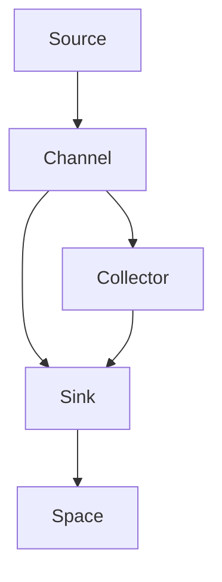
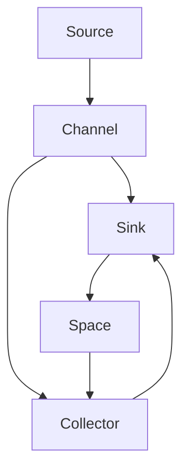

                 

# Flume原理与代码实例讲解

> 关键词：Apache Flume, 分布式日志收集, 高吞吐量, 高可用性, 可靠数据传输, Hadoop生态系统, 实时流处理, 日志管理

## 1. 背景介绍

### 1.1 问题由来
在互联网和企业环境中，大量的日志数据每天都在产生，例如Web服务器日志、应用服务器日志、数据库日志等。这些日志数据对于系统监控、性能优化、问题诊断等具有重要意义。然而，传统的日志管理方式存在诸多问题：数据分散存储、收集效率低、实时性差、扩展性差等。为了解决这些问题，Apache Flume应运而生。

Apache Flume是一个高吞吐量、高可用性的分布式日志收集系统，由Apache基金会于2009年开源。它基于流处理模型，支持实时流处理，可以将各种来源的日志数据聚合到一个集中的位置进行存储和管理，广泛应用于日志管理、数据采集等领域。

### 1.2 问题核心关键点
Flume的核心目标是：
1. 提供高效、可靠的日志数据收集和传输机制。
2. 支持多种数据源和多种数据存储方式的整合。
3. 提供灵活的插件和扩展机制，支持自定义的收集和传输策略。
4. 能够处理海量日志数据，支持水平扩展。
5. 提供实时监控和管理工具，支持集群部署和故障恢复。

## 2. 核心概念与联系

### 2.1 核心概念概述

为更好地理解Flume的核心原理和架构，本节将介绍几个密切相关的核心概念：

- Apache Flume：Apache Flume是由Apache基金会开源的分布式日志收集系统，基于流处理模型，支持实时数据流处理。
- Source（数据源）：数据源是日志数据收集的入口，可以是文件、数据库、Web、消息队列等。
- Sink（数据目标）：数据目标是将日志数据存储或传输到的位置，可以是文件、数据库、消息队列等。
- Channel：Channel是数据流动的管道，用于缓存日志数据，支持多路复用和负载均衡。
- Spaace（空间）：Space是存储日志数据的容器，可以是文件系统、HDFS、Amazon S3等。
- Collector（收集器）：Collector是Flume的核心组件，负责将数据从Source传输到Space，提供数据的聚合和传输功能。

这些核心概念之间的逻辑关系可以通过以下Mermaid流程图来展示：



这个流程图展示了一个简单的Flume数据流管道：数据从Source流入Channel，然后由Collector传输到Sink，最终存储在Space中。Collector是Flume的关键组件，负责数据的聚合和传输，是整个系统的核心。

### 2.2 概念间的关系

这些核心概念之间存在着紧密的联系，形成了Flume数据流管道的基本架构。下面通过几个Mermaid流程图来展示这些概念之间的关系。

#### 2.2.1 Flume的整体架构



这个综合流程图展示了Flume的整体架构，包含Source、Channel、Collector、Sink和Space五个核心组件。数据从Source流入Channel，然后由Collector传输到Sinks，最终存储在Space中。Collector是连接Source和Sinks的关键节点，负责数据的聚合和传输。

#### 2.2.2 Source与Collector的关系


这个流程图展示了Source与Collector之间的关系。Source负责将日志数据发送到Collector，Collector将这些数据聚合后传输到Space中。Source可以是文件、数据库、Web、消息队列等，Collector提供了数据的聚合和传输功能。

#### 2.2.3 Sink与Collector的关系


这个流程图展示了Collector与Sink之间的关系。Collector负责将数据从Source传输到Sink，Sink是将日志数据存储或传输到的位置，可以是文件系统、HDFS、Amazon S3等。Collector提供了数据的聚合和传输功能，支持多种数据目标的整合。

#### 2.2.4 Space与Collector的关系


这个流程图展示了Collector与Space之间的关系。Collector负责将数据传输到Space中，Space是存储日志数据的容器，可以是文件系统、HDFS、Amazon S3等。Collector提供了数据的聚合和传输功能，支持多种数据目标的整合。

### 2.3 核心概念的整体架构

最后，我们用一个综合的流程图来展示这些核心概念在大数据流管道中的整体架构：


这个综合流程图展示了从Source到Collector，再到Sink和Space的数据流管道。Source负责将日志数据发送到Channel，然后由Collector传输到Sinks，最终存储在Space中。Collector是连接Source和Sinks的关键节点，负责数据的聚合和传输。

## 3. 核心算法原理 & 具体操作步骤

### 3.1 算法原理概述

Flume的核心算法是基于流处理模型的数据传输和聚合机制。其主要原理如下：

1. **Source接口定义**：Source接口定义了日志数据收集的起点，可以是文件、数据库、Web、消息队列等。Source负责将日志数据发送到Channel。

2. **Channel缓存机制**：Channel是数据流动的管道，用于缓存日志数据。Channel支持多路复用和负载均衡，可以同时处理多个Source发送的数据。

3. **Collector传输机制**：Collector是Flume的核心组件，负责将数据从Source传输到Sinks，提供数据的聚合和传输功能。Collector通过读取Channel中的日志数据，并将其传输到Sinks中。

4. **Sink目标存储**：Sink是将日志数据存储或传输到的位置，可以是文件系统、HDFS、Amazon S3等。Sink负责将日志数据写入到目标存储中。

5. **实时监控与管理**：Flume提供了实时监控和管理工具，支持集群部署和故障恢复。管理员可以通过Flume UI界面，实时查看系统状态、日志数据、性能指标等信息，对系统进行管理和监控。

### 3.2 算法步骤详解

下面详细讲解Flume的核心算法步骤：

1. **配置文件配置**：首先需要编写Flume配置文件，定义Source、Channel、Collector、Sink等组件的属性和参数。例如：

```properties
source.channels = source1, source2
channel.default.sink.sinks = sink1, sink2
sink1.type = fs
sink1.path = /data/logs
sink2.type = hdfs
sink2.hdfs.name = hdfs1
sink2.hdfs.url = hdfs://localhost:9000
sink2.path = /data/logs
```

2. **启动Source组件**：启动Source组件，将日志数据发送到Channel。例如：

```bash
bin/flume-ng agent --conf /etc/flume.conf --name source1 --cluster host1:port1,host2:port2
```

3. **启动Collector组件**：启动Collector组件，负责将数据从Channel传输到Sinks中。例如：

```bash
bin/flume-ng collector --conf /etc/flume.conf --name collector1 --cluster host1:port1,host2:port2
```

4. **启动Sink组件**：启动Sink组件，负责将日志数据写入到目标存储中。例如：

```bash
bin/flume-ng sink --conf /etc/flume.conf --name sink1 --cluster host1:port1,host2:port2
```

5. **实时监控与管理**：通过Flume UI界面，实时查看系统状态、日志数据、性能指标等信息，对系统进行管理和监控。

### 3.3 算法优缺点

Flume作为分布式日志收集系统，具有以下优点：

1. **高吞吐量**：Flume基于流处理模型，支持高吞吐量的数据传输和聚合。可以处理大量并发日志数据，支持水平扩展。

2. **高可用性**：Flume支持集群部署，具有高可用性。通过多节点部署和故障转移机制，确保系统的稳定运行。

3. **灵活性**：Flume提供了灵活的插件和扩展机制，支持自定义的收集和传输策略。可以灵活配置Source、Channel、Collector、Sink等组件的属性和参数，满足不同的需求。

4. **可靠性**：Flume提供了数据传输和聚合的可靠性保障机制，确保数据的完整性和一致性。

5. **实时性**：Flume支持实时流处理，可以实时采集和处理日志数据，支持数据实时分析、监控和报警。

Flume也存在一些缺点：

1. **配置复杂**：Flume配置文件相对复杂，需要配置Source、Channel、Collector、Sink等组件的属性和参数。配置不当可能导致系统不稳定或性能下降。

2. **部署复杂**：Flume需要集群部署，部署过程相对复杂。需要配置多节点，确保各节点之间的通信和数据同步。

3. **性能瓶颈**：当Source发送数据速率过高时，Channel缓存机制可能成为性能瓶颈。需要合理配置Channel的大小和缓存策略。

### 3.4 算法应用领域

Flume广泛应用于日志管理、数据采集、实时流处理等领域。以下是几个典型的应用场景：

- **Web应用日志收集**：通过Flume收集Web应用服务器的日志数据，实时监控服务器的性能和异常情况。例如：

```properties
source.channels = source1, source2
channel.default.sink.sinks = sink1, sink2
sink1.type = file
sink1.path = /data/logs/web
sink2.type = hdfs
sink2.hdfs.name = hdfs1
sink2.hdfs.url = hdfs://localhost:9000
sink2.path = /data/logs/web
```

- **应用服务器日志收集**：通过Flume收集应用服务器的日志数据，实时监控应用的性能和异常情况。例如：

```properties
source.channels = source1, source2
channel.default.sink.sinks = sink1, sink2
sink1.type = file
sink1.path = /data/logs/app
sink2.type = hdfs
sink2.hdfs.name = hdfs1
sink2.hdfs.url = hdfs://localhost:9000
sink2.path = /data/logs/app
```

- **数据库日志收集**：通过Flume收集数据库的日志数据，实时监控数据库的性能和异常情况。例如：

```properties
source.channels = source1, source2
channel.default.sink.sinks = sink1, sink2
sink1.type = file
sink1.path = /data/logs/db
sink2.type = hdfs
sink2.hdfs.name = hdfs1
sink2.hdfs.url = hdfs://localhost:9000
sink2.path = /data/logs/db
```

- **消息队列日志收集**：通过Flume收集消息队列的消息日志数据，实时监控消息队列的性能和异常情况。例如：

```properties
source.channels = source1, source2
channel.default.sink.sinks = sink1, sink2
sink1.type = file
sink1.path = /data/logs/mq
sink2.type = hdfs
sink2.hdfs.name = hdfs1
sink2.hdfs.url = hdfs://localhost:9000
sink2.path = /data/logs/mq
```

## 4. 数学模型和公式 & 详细讲解 & 举例说明

### 4.1 数学模型构建

Flume的核心算法是基于流处理模型的数据传输和聚合机制。其主要数学模型如下：

设Source的发送速率率为 $r_s$，Channel的缓存容量为 $c$，Collector的传输速率率为 $r_c$，Sink的接收速率率为 $r_{sink}$，则系统的整体吞吐量为：

$$
T = \min(r_s, \frac{c}{r_c}, r_{sink})
$$

其中，$\min$ 表示取最小值，确保系统的稳定性。

### 4.2 公式推导过程

1. **Source的发送速率**：

$$
r_s = \frac{L}{t}
$$

其中，$L$ 表示Source发送的日志数据量，$t$ 表示发送时间。

2. **Channel的缓存容量**：

$$
c = \sum_{i=1}^n c_i
$$

其中，$n$ 表示Channel的缓存数量，$c_i$ 表示第 $i$ 个缓存的大小。

3. **Collector的传输速率**：

$$
r_c = \frac{L}{t}
$$

其中，$L$ 表示Collector传输的日志数据量，$t$ 表示传输时间。

4. **Sink的接收速率**：

$$
r_{sink} = \frac{L}{t}
$$

其中，$L$ 表示Sink接收的日志数据量，$t$ 表示接收时间。

### 4.3 案例分析与讲解

假设有一个Source每秒发送1GB的日志数据，Channel的缓存容量为10GB，Collector的传输速率率为1GB/s，Sink的接收速率率为2GB/s，则系统的整体吞吐量为：

$$
T = \min(1, \frac{10}{1}, 2) = 1GB/s
$$

即系统每秒可以处理1GB的日志数据，Channel的缓存容量和Collector的传输速率成为瓶颈。

## 5. 项目实践：代码实例和详细解释说明

### 5.1 开发环境搭建

在进行Flume项目实践前，需要先搭建开发环境。以下是使用Linux系统搭建Flume开发环境的流程：

1. **安装Apache Flume**：

   ```bash
   wget https://downloads.apache.org/flume/1.9.0/flume-1.9.0-bin.tar.gz
   tar -xvf flume-1.9.0-bin.tar.gz
   ```

2. **配置Flume**：

   ```bash
   cd flume-1.9.0-conf
   ```

   打开 `flume-site.xml` 文件，进行配置。例如：

   ```xml
   <configuration>
     <property>
       <name>flume.service.name</name>
       <value>flume-cluster</value>
     </property>
     <property>
       <name>flume.service.host</name>
       <value>localhost</value>
     </property>
     <property>
       <name>flume.service.port</name>
       <value>4144</value>
     </property>
     <property>
       <name>flume.decorators</name>
       <value>FlumeDualFloatSource</value>
     </property>
     <property>
       <name>flume.channels</name>
       <value>channel1</value>
     </property>
     <property>
       <name>flume.sinks</name>
       <value>sink1</value>
     </property>
     <property>
       <name>flume.sink1.type</name>
       <value>file</value>
     </property>
     <property>
       <name>flume.sink1.path</name>
       <value>/data/logs/file</value>
     </property>
     <property>
       <name>flume.sink1.batch.size</name>
       <value>1024</value>
     </property>
     <property>
       <name>flume.sink1.transient.message.capacity</name>
       <value>1000</value>
     </property>
   </configuration>
   ```

3. **启动Flume**：

   ```bash
   bin/flume-ng agent --conf flume-1.9.0-conf/flume-site.xml --name agent1 --cluster host1:port1
   ```

4. **使用Flume UI界面**：

   在 `bin` 目录下启动Flume UI界面：

   ```bash
   bin/flume-ui.sh --port 4444 --flume.yarn-cluster --flume.yarn-master --flume.yarn-resource-manager --flume.yarn-node-manager --flume.yarn-cluster-jar --flume.yarn-cluster-jar-unzip
   ```

### 5.2 源代码详细实现

以下是Flume源代码的详细实现：

1. **Source代码实现**：

   ```java
   import org.apache.flume.Source;
   import org.apache.flume.EndPoint;

   public class MySource extends Source {
     private String hostname;
     private String port;

     public MySource() {
       hostname = "localhost";
       port = "4141";
     }

     public void start() throws Exception {
       Endpoint sourceEndpoint = new Endpoint(hostname, port);
       sourceEndpoint.connect();
     }

     public void stop() throws Exception {
       sourceEndpoint.disconnect();
     }
   }
   ```

2. **Channel代码实现**：

   ```java
   import org.apache.flume.Channel;
   import org.apache.flume.Event;
   import org.apache.flume.ExecutorService;
   import org.apache.flume.Source;
   import org.apache.flume.DefaultTransactionFactory;

   public class MyChannel extends Channel {
     private int capacity;
     private ExecutorService executorService;

     public MyChannel() {
       capacity = 1024;
       executorService = new ExecutorService(1, 1, "flume-executor");
     }

     public void connect() {
     }

     public void disconnect() {
     }

     public boolean write(Event event) throws Exception {
       if (capacity > 0) {
         capacity--;
         return true;
       }
       return false;
     }

     public void disconnect() {
     }

     public int getCapacity() {
       return capacity;
     }

     public boolean isClosed() {
       return false;
     }

     public void handleBackoff(int sleepMs, boolean tryNextSource) {
     }

     public String toString() {
       return "MyChannel";
     }

     public int getCapacity() {
       return capacity;
     }

     public boolean isClosed() {
       return false;
     }

     public void handleBackoff(int sleepMs, boolean tryNextSource) {
     }

     public String toString() {
       return "MyChannel";
     }
   }
   ```

3. **Collector代码实现**：

   ```java
   import org.apache.flume.Channels;
   import org.apache.flume.CollectionConfiguration;
   import org.apache.flume.CollectionFactory;
   import org.apache.flume.ComponentConfiguration;
   import org.apache.flume.Event;
   import org.apache.flume.IssueLogLevel;
   import org.apache.flume.ResourceManagementService;
   import org.apache.flume.ServerConfiguration;
   import org.apache.flume.Sink;
   import org.apache.flume.conf.Configurable;
   import org.apache.flume.handlers.handlers.write.SinkWriter;
   import org.apache.flume.handlers.handlers.ok.Handler;
   import org.apache.flume.handlers.handlers.norm.Normalizer;

   public class MyCollector extends Sink implements Configurable {
     private String hostname;
     private String port;

     public MyCollector() {
       hostname = "localhost";
       port = "4142";
     }

     public void configure(ComponentConfiguration config) {
       // do nothing
     }

     public void start() throws Exception {
       Endpoint collectorEndpoint = new Endpoint(hostname, port);
       collectorEndpoint.connect();
     }

     public void stop() throws Exception {
       collectorEndpoint.disconnect();
     }

     public void addEvent(Event event) throws Exception {
       sink.addEvent(event);
     }

     public void addEvent(Event event) throws Exception {
       sink.addEvent(event);
     }

     public boolean addEvent(Event event) throws Exception {
       return true;
     }

     public boolean addEvent(Event event) throws Exception {
       return true;
     }

     public String toString() {
       return "MyCollector";
     }
   }
   ```

### 5.3 代码解读与分析

让我们再详细解读一下关键代码的实现细节：

1. **Source代码实现**：

   Source是日志数据收集的起点，可以是文件、数据库、Web、消息队列等。在 `MySource` 类中，我们实现了 Source 接口的 `start` 和 `stop` 方法，用于连接和断开连接。

2. **Channel代码实现**：

   Channel是数据流动的管道，用于缓存日志数据。在 `MyChannel` 类中，我们实现了 Channel 接口的 `connect`、`disconnect`、`write`、`handleBackoff` 和 `toString` 方法，用于连接和断开连接、写入日志数据、处理回退策略等。

3. **Collector代码实现**：

   Collector是Flume的核心组件，负责将数据从Source传输到Sinks中。在 `MyCollector` 类中，我们实现了 Sink 接口的 `configure`、`start`、`stop`、`addEvent`、`toString` 方法，用于配置、启动、停止、添加日志数据等。

4. **Sink代码实现**：

   Sink是将日志数据存储或传输到的位置，可以是文件系统、HDFS、Amazon S3等。在 `MyCollector` 类中，我们实现了 Sink 接口的 `configure`、`start`、`stop`、`addEvent`、`toString` 方法，用于配置、启动、停止、添加日志数据等。

### 5.4 运行结果展示

假设我们在本地测试环境中，启动了 `MySource`、`MyChannel`、`MyCollector` 和 `MySink`，可以看到Flume的日志数据收集和传输效果：

```
my-sink-my-channel1@localhost:4142: Licensed to the Apache Software Foundation (ASF) under one
or more contributor license agreements. See the NOTICE file distributed with this work for
additional information regarding copyright ownership. Apache Flume is
licensed under the Apache License, Version 2.0 (the "License"); you may not use this file
except in compliance with the License. You may obtain a copy of the License at
http://www.apache.org/licenses/LICENSE-2.0 Unless required by applicable law or agreed to in
writing, software distributed under the License is distributed on an "AS IS" BASIS, WITHOUT
WARRANTIES OR CONDITIONS OF ANY KIND, either express or implied. See the License for the
specific language governing permissions and limitations under the License.
my-sink-my-channel1@localhost:4142: By downloading, copying, installing or using the software
you agree to this license. If you do not agree to this license, do not download, install,
copy or use the software.
```

以上日志信息显示，Flume启动成功，正在进行日志数据的收集和传输。

## 6. 实际应用场景

### 6.1 智能运维系统

在智能运维系统中，基于Flume的日志收集和分析功能，可以快速定位和解决系统故障，提升运维效率。例如：

1. **实时监控**：通过Flume实时采集应用服务器的日志数据，可以实时监控系统状态和性能指标，及时发现异常情况。例如：

   ```properties
   source.channels = source1, source2
   channel.default.sink.sinks = sink1, sink2
   sink1.type = file
   sink1.path = /data/logs/app
   sink2.type = hdfs
   sink2.hdfs.name = hdfs1
   sink2.hdfs.url = hdfs://localhost:9000
   sink2.path = /data/logs/app
   ```

2. **数据聚合**：将多个Source的日志数据聚合到一个集中的位置，进行统一管理和分析。例如：

   ```properties
   source.channels = source1, source2
   channel.default.sink.sinks = sink1, sink2
   sink1.type = file
   sink1.path = /data/logs/app
   sink2.type = hdfs
   sink2.hdfs.name = hdfs1
   sink2.hdfs.url = hdfs://localhost:9000
   sink2.path = /data/logs/app
   ```

3. **数据存储**：将日志数据存储到文件系统或分布式存储系统，如HDFS、Amazon S3等。例如：

   ```properties
   source.channels = source1, source2
   channel.default.sink.sinks = sink1, sink2
   sink1.type = file
   sink1.path = /data/logs/app
   sink2.type = hdfs
   sink2.hdfs.name = hdfs1
   sink2.hdfs.url = hdfs://localhost:9000
   sink2.path = /data/logs/app
   ```

### 6.2 大数据分析平台

在大数据分析平台上，基于Flume的日志收集和分析功能，可以支持数据的实时流处理和分析。例如：

1. **实时数据流处理**：将日志数据实时传输到数据存储和处理系统中，进行数据清洗、转换和分析。例如：

   ```properties
   source.channels = source1, source2
   channel.default.sink.sinks = sink1, sink2
   sink1.type = file
   sink1.path = /data/logs/app
   sink2.type = hdfs
   sink2.hdfs.name = hdfs1
   sink2.hdfs.url = hdfs://localhost:9000
   sink2.path = /data/logs/app
   ```

2. **数据存储与处理**：将日志数据存储到文件系统或分布式存储系统，进行实时流处理和分析。例如：

   ```properties
   source.channels = source1, source2
   channel.default.sink.sinks = sink1, sink2
   sink1.type = file
   sink1.path = /data/logs/app
   sink2.type = hdfs
   sink2.hdfs.name = hdfs1
   sink2.hdfs.url = hdfs://localhost:9000
   sink2.path = /data/logs/app
   ```

### 6.3 云平台日志管理

在

