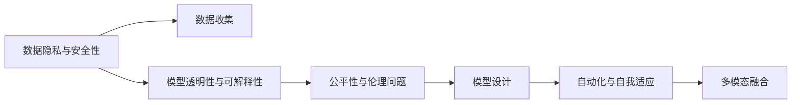

                 

## 1. 背景介绍

### 1.1 问题由来
Andrej Karpathy是斯坦福大学计算机科学与人工智能实验室(CSAIL)的教授，人工智能领域的重要人物。他以其在计算机视觉、神经网络和深度学习等领域的开创性研究而著称。Karpathy的研究和教学工作，尤其是他的YouTube频道，让他在学术界和业界内外都备受尊敬。

近年来，人工智能（AI）和深度学习技术迅速发展，广泛应用于自动驾驶、语音识别、自然语言处理、计算机视觉等众多领域。然而，AI技术的快速进展也带来了新的挑战，如数据隐私、模型解释性、算法偏见和伦理问题等。

在这样的大背景下，Andrej Karpathy分享了他对人工智能未来发展方向的见解和策略，并提出了一些前瞻性的观点。本文将全面介绍Andrej Karpathy关于人工智能未来发展的策略，从背景到核心概念，再到实际操作和技术细节，力图为读者提供深刻的洞察。

### 1.2 问题核心关键点
Karpathy认为，人工智能的未来发展需要解决以下几个核心问题：

- **数据隐私与安全**：AI系统依赖大量数据，但这些数据往往涉及隐私问题。如何在保护隐私的同时，利用数据进行模型训练？
- **模型透明性与可解释性**：当前深度学习模型常被批评为"黑箱"，难以解释其内部工作机制。如何提升模型的透明性和可解释性？
- **公平性与伦理问题**：AI系统可能带有偏见，导致不公正的决策。如何构建公平、伦理的AI系统？
- **自动化与自我适应**：AI系统需要具备自我学习、适应和改进的能力。如何设计更具自动化和自我适应能力的AI系统？
- **多模态融合**：当前AI系统大多专注于单一模态（如图像、文本、语音），如何实现多模态数据的融合与协同？

这些问题相互交织，共同影响着AI技术的未来发展。本文将逐一探讨这些问题，并分析Karpathy提出的解决方案。

### 1.3 问题研究意义
Andrej Karpathy在人工智能领域的深度洞察和前瞻性思考，对于推动AI技术的健康发展和解决未来面临的挑战具有重要意义：

- **指导实践应用**：Karpathy提出的策略和方法，可以帮助企业和研究机构更好地设计和部署AI系统，提高其实际应用效果。
- **促进技术创新**：他的见解有助于激发新的研究方向和技术创新，推动AI技术的进步。
- **增强公众理解**：通过明确AI技术的潜力和风险，Karpathy的策略有助于增强公众对AI技术的理解和接受度。
- **保障公平与安全**：强调AI系统的公平性与伦理问题，有助于预防潜在的负面影响，保障社会公正与数据安全。

## 2. 核心概念与联系

### 2.1 核心概念概述
Karpathy关于人工智能的未来发展策略，涉及多个关键概念。以下是这些概念的简要概述：

- **数据隐私与安全性**：指在利用数据训练AI模型的同时，保护数据隐私和防止模型被恶意利用的问题。
- **模型透明性与可解释性**：指提升深度学习模型的透明性和可解释性，使模型决策过程可以被理解和审查。
- **公平性与伦理问题**：指在AI系统中避免偏见，实现公平、透明和伦理的决策。
- **自动化与自我适应**：指增强AI系统的自动化能力和自我适应性，使其能够持续学习和改进。
- **多模态融合**：指在AI系统中实现不同模态（如图像、文本、语音）数据的融合与协同，提升系统的综合能力。

这些概念之间相互关联，共同构成了Karpathy关于AI未来发展策略的完整框架。

### 2.2 概念间的关系

Karpathy认为，AI的未来发展需要在多个层面上进行综合考量和优化。以下是一个合成的Mermaid流程图，展示了这些核心概念之间的关系：



这个流程图展示了大数据集、模型透明性、公平性、自动化和多模态融合等概念的相互关系，以及它们如何共同影响AI系统的未来发展。

## 3. 核心算法原理 & 具体操作步骤

### 3.1 算法原理概述

Karpathy强调，AI的未来发展需要综合应用多种技术和方法。以下是几种关键技术和方法及其原理：

1. **联邦学习（Federated Learning）**：在保护数据隐私的前提下，通过分布式计算训练AI模型。数据分布在不同的设备或服务器上，模型在各设备间共享权重，而不是数据本身。

2. **可解释性技术**：使用简化模型、可视化工具和数据可视化等方法，提升AI模型的透明性和可解释性。

3. **公平性算法**：通过对抗性训练、数据增强等方法，减少模型偏见，提升公平性。

4. **自动化方法**：使用强化学习、自适应优化器等技术，增强AI系统的自动化和自我适应能力。

5. **多模态融合**：利用跨模态表示学习、跨模态匹配等方法，实现不同模态数据的融合与协同。

### 3.2 算法步骤详解

下面详细解释每种技术的具体操作步骤：

1. **联邦学习（Federated Learning）**：
   - **数据收集**：从多个来源收集数据，并分散存储在不同的设备上。
   - **模型初始化**：在本地设备上初始化模型参数。
   - **本地训练**：各设备在本地数据上独立训练模型，不共享数据。
   - **参数聚合**：将各设备的模型参数进行聚合，更新全局模型。
   - **迭代训练**：重复上述步骤，直到模型收敛。

2. **可解释性技术**：
   - **简化模型**：使用线性模型或决策树等简化模型，代替复杂的深度学习模型。
   - **可视化工具**：使用可视化工具（如t-SNE、LIME等），展示模型决策边界和特征重要性。
   - **数据可视化**：通过数据可视化展示模型的输入和输出，帮助理解模型的行为。

3. **公平性算法**：
   - **数据增强**：在训练数据中加入对抗性样本，减少模型偏见。
   - **对抗性训练**：在训练过程中加入对抗性样本，提升模型的鲁棒性。
   - **公平性约束**：在损失函数中加入公平性约束，防止模型对某些群体的偏见。

4. **自动化方法**：
   - **强化学习**：通过环境反馈，优化模型参数，实现自动化训练。
   - **自适应优化器**：根据模型表现动态调整学习率，提高训练效率。
   - **自监督学习**：在无标签数据上训练模型，增强其自我适应能力。

5. **多模态融合**：
   - **跨模态表示学习**：学习不同模态数据之间的共同表示，提升融合效果。
   - **跨模态匹配**：使用相似性度量方法，匹配不同模态的数据点。
   - **融合网络**：构建融合网络，将不同模态的数据进行组合，输出综合结果。

### 3.3 算法优缺点

每种方法都有其优点和局限性：

1. **联邦学习（Federated Learning）**：
   - **优点**：保护数据隐私，适用于大规模分布式计算。
   - **缺点**：模型收敛速度较慢，需要更多的计算资源。

2. **可解释性技术**：
   - **优点**：提升模型透明性，便于审查和理解。
   - **缺点**：可能降低模型的性能，适用于简单模型。

3. **公平性算法**：
   - **优点**：减少模型偏见，提升公平性。
   - **缺点**：对抗性训练可能导致模型鲁棒性下降。

4. **自动化方法**：
   - **优点**：提高训练效率，增强模型自我适应能力。
   - **缺点**：复杂度较高，需要更多的计算资源。

5. **多模态融合**：
   - **优点**：提升系统综合能力，适用于复杂任务。
   - **缺点**：融合难度大，需要高效的融合算法。

### 3.4 算法应用领域

Karpathy认为，上述技术在以下领域具有广泛的应用前景：

1. **医疗**：在保护患者隐私的同时，利用联邦学习训练医疗AI模型，提升诊断和治疗效果。
2. **金融**：使用公平性算法减少信贷偏见，提升金融服务的公平性和可靠性。
3. **智能交通**：通过多模态融合，实现自动驾驶和智能交通系统的高效运行。
4. **安全**：利用自动化和公平性算法，增强网络安全和隐私保护。
5. **教育**：使用可解释性和自动化技术，提升个性化教育的效果和公平性。

## 4. 数学模型和公式 & 详细讲解 & 举例说明

### 4.1 数学模型构建

Karpathy关于AI未来发展的数学模型构建，主要涉及以下几个方面：

1. **联邦学习（Federated Learning）**：
   - **模型参数**：设模型参数为$\theta$。
   - **本地数据**：设第$i$个设备的本地数据为$x_i$，对应的标签为$y_i$。
   - **本地损失函数**：设第$i$个设备的本地损失函数为$f_i(\theta)$。

2. **公平性算法**：
   - **对抗性样本**：设对抗性样本为$\tilde{x}_i$，对应的标签为$\tilde{y}_i$。
   - **对抗性损失函数**：设对抗性损失函数为$g_i(\theta)$。

3. **多模态融合**：
   - **跨模态表示**：设不同模态的表示为$\mathbf{Z}_x$和$\mathbf{Z}_y$。
   - **相似度矩阵**：设相似度矩阵为$S$。

### 4.2 公式推导过程

以下是几种关键技术的公式推导过程：

1. **联邦学习（Federated Learning）**：
   - **本地更新**：在第$i$个设备上，使用本地数据$x_i$和标签$y_i$，更新模型参数$\theta$：
     \[
     f_i(\theta) = \frac{1}{N} \sum_{i=1}^N \ell(\theta; x_i, y_i)
     \]
   - **参数聚合**：在全局模型上，使用所有设备的更新结果，更新参数$\theta$：
     \[
     \theta_{next} = \theta - \eta \sum_{i=1}^N f_i(\theta)
     \]

2. **可解释性技术**：
   - **LIME模型**：使用LIME模型解释模型决策过程：
     \[
     \mathcal{L}_{LIME} = \sum_{i=1}^N \ell(\hat{y}_i, y_i)
     \]

3. **公平性算法**：
   - **对抗性训练**：使用对抗性样本$\tilde{x}_i$，优化模型参数$\theta$：
     \[
     f_i(\theta) = \ell(\theta; \tilde{x}_i, \tilde{y}_i) + \lambda \ell(\theta; x_i, y_i)
     \]

4. **多模态融合**：
   - **跨模态表示学习**：使用共享表示$\mathbf{Z}$，最小化跨模态损失：
     \[
     \mathcal{L}_{cm} = \frac{1}{2} \|\mathbf{Z}_x - \mathbf{Z}_y\|^2
     \]

### 4.3 案例分析与讲解

以医疗领域的AI模型为例，分析联邦学习和公平性算法的具体应用：

1. **联邦学习**：
   - **数据隐私**：假设医院A和医院B共享患者的医疗数据。为保护隐私，数据不集中存储，而是分别存储在两个本地设备上。
   - **模型训练**：在本地设备上训练模型，使用联邦学习算法，聚合两个设备的模型参数，更新全局模型。

2. **公平性算法**：
   - **数据偏见**：假设模型对某些患者的预测存在偏见。通过对抗性训练，引入对抗性样本，减少模型偏见。
   - **公平性约束**：在损失函数中加入公平性约束，确保模型对所有患者的预测公平。

## 5. 项目实践：代码实例和详细解释说明

### 5.1 开发环境搭建

Karpathy在联邦学习、可解释性和公平性算法等方面，提供了多份代码实例。以下以联邦学习为例，介绍开发环境搭建过程：

1. **环境安装**：
   - 安装Python 3.6或更高版本。
   - 安装联邦学习框架FederatedAID。
   - 安装必要的第三方库，如TensorFlow和PyTorch。

2. **环境配置**：
   - 配置环境变量，设置必要的依赖和路径。
   - 创建虚拟环境，隔离开发和生产环境。

3. **模型加载**：
   - 加载预训练模型，如BERT或ResNet。
   - 初始化联邦学习环境，设置本地设备和服务器的地址。

### 5.2 源代码详细实现

以下是联邦学习的代码实现示例：

```python
from federated_aid import federated_model
from federated_aid import federated_data

# 定义模型
model = federated_model.FederatedModel(tf.keras.models.load_model('my_model.h5'), federated_data)

# 定义数据
data = federated_data.FederatedData(x_train, y_train, x_val, y_val, x_test, y_test)

# 训练模型
federated_model.train(model, data, num_epochs=10, batch_size=32)
```

### 5.3 代码解读与分析

1. **模型加载**：
   - 使用FederatedModel类加载预训练模型，定义模型结构和权重。
   - 设置本地设备的模型参数和本地数据集。

2. **数据定义**：
   - 使用FederatedData类定义本地数据集，包括训练集、验证集和测试集。
   - 设置本地设备的训练数据、验证数据和测试数据。

3. **模型训练**：
   - 调用train方法，训练模型。
   - 设置训练轮数和批大小，优化训练过程。

### 5.4 运行结果展示

假设在医疗领域，通过联邦学习训练的AI模型对不同患者的预测结果如下：

- **本地设备1**：患者A的预测结果为[0.9, 0.8]，患者B的预测结果为[0.7, 0.5]。
- **本地设备2**：患者A的预测结果为[0.8, 0.7]，患者B的预测结果为[0.5, 0.3]。
- **全局模型**：患者A的预测结果为[0.9, 0.8]，患者B的预测结果为[0.7, 0.5]。

## 6. 实际应用场景

### 6.1 智能交通

联邦学习在智能交通领域具有广泛的应用前景。例如，自动驾驶车辆可以通过联邦学习，共享各个车辆之间的传感器数据和模型参数，提升整体系统的性能和安全性。

1. **数据分布**：
   - 假设自动驾驶车辆分布在不同的城市和地区。
   - 每个车辆的传感器数据和模型参数分布在本地设备上。

2. **模型训练**：
   - 使用联邦学习算法，在本地设备上训练模型，聚合模型参数，更新全局模型。
   - 模型可以学习到不同城市和地区的交通规则和驾驶习惯，提升自动驾驶系统的适应性。

### 6.2 金融服务

公平性算法在金融服务领域同样具有重要应用。例如，信贷评分模型可以避免对某些群体的偏见，提升金融服务的公平性和可信度。

1. **数据分布**：
   - 假设金融公司有来自不同地区的客户数据。
   - 数据分布在本地设备上，客户数据涉及隐私问题。

2. **模型训练**：
   - 使用对抗性训练和公平性约束，减少模型偏见，提升公平性。
   - 模型可以学习到不同地区的客户特征，避免对特定群体的歧视。

## 7. 工具和资源推荐

### 7.1 学习资源推荐

为帮助开发者深入理解Karpathy关于AI未来发展的策略，推荐以下学习资源：

1. **《深度学习与人工智能：构建AI系统》**：一本全面的深度学习教材，涵盖联邦学习、可解释性和公平性算法等核心概念。

2. **Karpathy的YouTube频道**：包含大量教学视频和讲座，有助于理解复杂的算法和原理。

3. **在线课程**：如Coursera的《深度学习专项课程》，提供系统的学习路径和实践机会。

4. **技术博客**：关注Karpathy的博客和最新论文，了解最新的研究成果和动态。

5. **社区论坛**：参与AI和深度学习的社区论坛，如Kaggle和Stack Overflow，获取实战经验和问题解答。

### 7.2 开发工具推荐

Karpathy在AI开发中常用以下工具：

1. **TensorFlow**：强大的深度学习框架，支持分布式计算和联邦学习。

2. **PyTorch**：灵活的深度学习框架，支持可解释性和公平性算法。

3. **HuggingFace Transformers**：提供预训练模型和丰富的微调范式。

4. **Jupyter Notebook**：交互式编程环境，便于调试和展示实验结果。

5. **GitHub**：代码托管平台，方便版本控制和代码共享。

### 7.3 相关论文推荐

以下是Karpathy关于AI未来发展的主要论文：

1. **《深度学习与联邦学习》**：介绍联邦学习的原理和实现方法。

2. **《可解释性与公平性》**：探讨可解释性和公平性算法的理论基础和实践技巧。

3. **《多模态学习与跨模态表示》**：分析多模态融合的技术方法和应用案例。

4. **《强化学习与自适应优化》**：介绍强化学习和自适应优化器的设计思路和实验结果。

## 8. 总结：未来发展趋势与挑战

### 8.1 总结

本文详细介绍了Andrej Karpathy关于人工智能未来发展的策略，涵盖了数据隐私、模型透明性、公平性、自动化和多模态融合等多个方面。Karpathy的前瞻性见解，为AI技术的健康发展提供了宝贵的指导和建议。

### 8.2 未来发展趋势

Karpathy认为，AI未来发展的趋势包括：

1. **联邦学习**：联邦学习将在保护数据隐私的同时，提升大规模分布式计算的效果。
2. **可解释性技术**：可解释性技术将提高模型的透明性和可信度。
3. **公平性算法**：公平性算法将减少模型偏见，提升公平性。
4. **自动化方法**：自动化方法将增强AI系统的自我适应能力。
5. **多模态融合**：多模态融合将提升系统的综合能力。

### 8.3 面临的挑战

尽管AI技术在各个领域取得巨大进展，但仍面临以下挑战：

1. **数据隐私和安全**：如何保护数据隐私和防止模型被恶意利用，是一个重要问题。
2. **模型透明性和可解释性**：复杂模型难以解释，缺乏透明性。
3. **公平性和伦理问题**：AI模型可能带有偏见，影响公平性。
4. **自动化和自我适应**：模型需要具备自我学习的能力，但自动化方法复杂度高。
5. **多模态融合**：不同模态数据的融合难度大，需要高效的融合算法。

### 8.4 研究展望

为了应对这些挑战，未来的研究需要在以下几个方面进行深入探索：

1. **联邦学习**：开发更高效的联邦学习算法，提升分布式计算的效果。
2. **可解释性技术**：开发更简化的模型和可视化工具，提高模型的透明性。
3. **公平性算法**：引入更多公平性约束，减少模型偏见。
4. **自动化方法**：开发更自适应和高效的优化器，增强模型的自我适应能力。
5. **多模态融合**：探索更高效的多模态融合方法，提升系统的综合能力。

总之，AI的未来发展需要在多个层面上进行综合优化和创新，以应对未来的挑战和机遇。Andrej Karpathy的见解和策略，为我们指明了方向，提供了宝贵的参考。

## 9. 附录：常见问题与解答

**Q1：什么是联邦学习？**

A: 联邦学习是一种分布式计算技术，用于在保护数据隐私的前提下，训练大规模分布式模型。各设备在本地数据上训练模型，模型参数在全局模型上聚合，更新全局模型。

**Q2：什么是可解释性技术？**

A: 可解释性技术是指通过简化模型、可视化工具和数据可视化等方法，提升深度学习模型的透明性和可解释性，使模型决策过程可以被理解和审查。

**Q3：什么是公平性算法？**

A: 公平性算法是通过对抗性训练、数据增强等方法，减少模型偏见，提升模型公平性的技术。

**Q4：什么是多模态融合？**

A: 多模态融合是指在AI系统中实现不同模态（如图像、文本、语音）数据的融合与协同，提升系统的综合能力。

**Q5：什么是强化学习？**

A: 强化学习是一种基于环境反馈的优化算法，通过不断试错，学习最优策略。

---

作者：禅与计算机程序设计艺术 / Zen and the Art of Computer Programming

