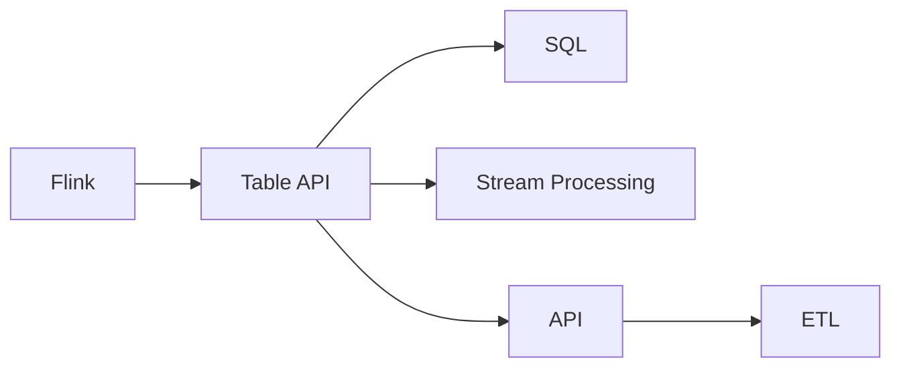
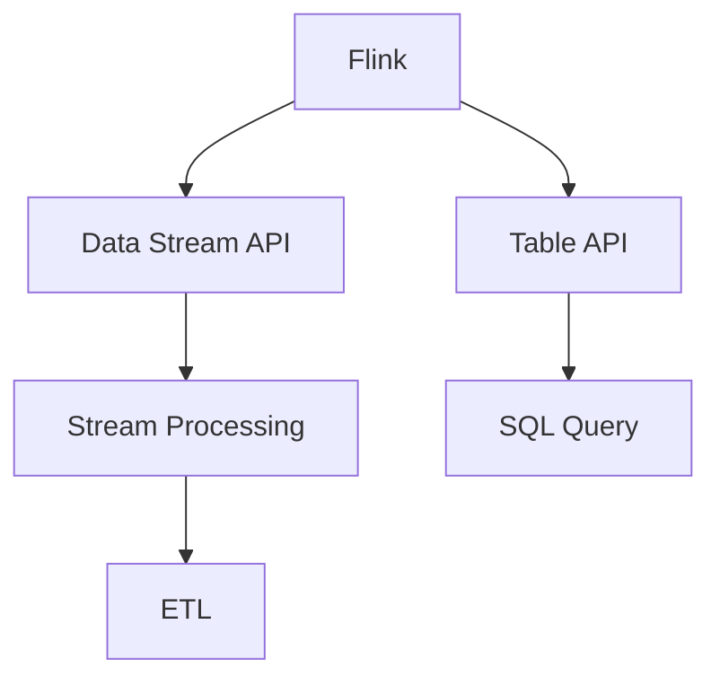
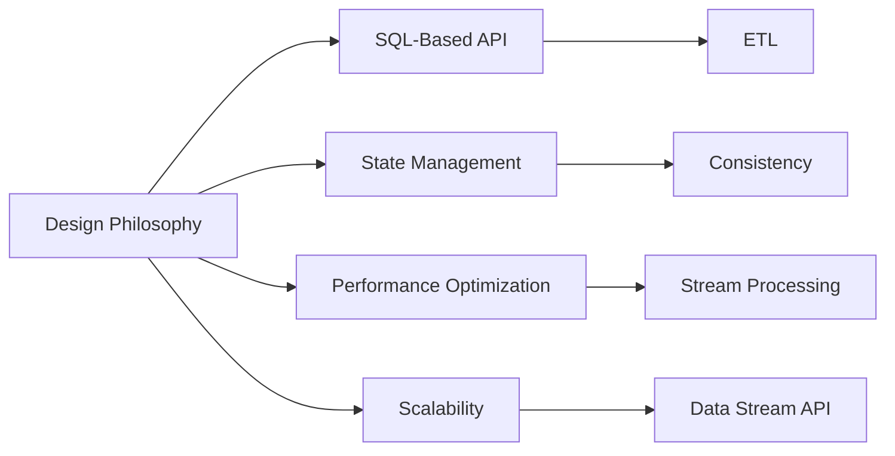
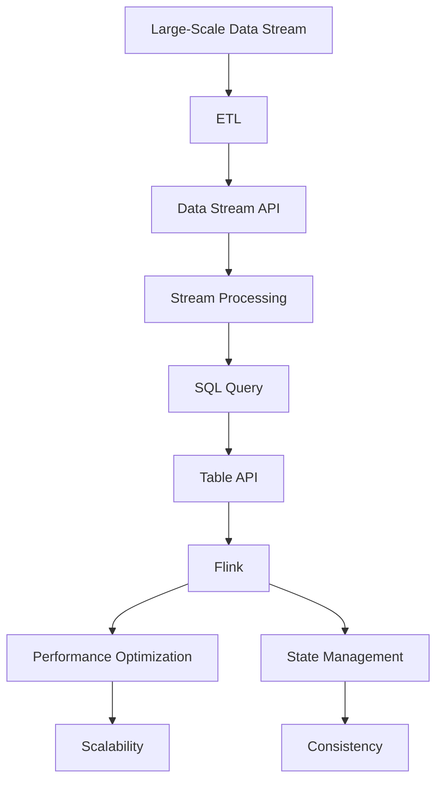

                 

# Flink Table原理与代码实例讲解

> 关键词：Flink, Table, SQL, API, Stream Processing, Performance

## 1. 背景介绍

### 1.1 问题由来
Flink Table API 是 Apache Flink 的一个重要组成部分，它提供了一种基于 SQL 的接口，使开发者能够使用 SQL 语句对流数据进行查询、聚合、过滤等操作。Flink Table API 的核心思想是将流式数据处理与关系型数据库处理结合起来，使 Flink 能够更加方便地处理复杂的数据流。

Flink Table API 的设计初衷是为了简化流式数据处理的开发过程，提升开发效率，同时提升流式处理的性能和可扩展性。在实际应用中，Flink Table API 已经被广泛应用于数据流处理、实时计算、事件驱动架构等多个领域。

### 1.2 问题核心关键点
Flink Table API 的核心设计思想包括：

- **基于 SQL 的 API**：Flink Table API 支持使用 SQL 语言对流数据进行查询和处理，降低了开发的复杂度。
- **数据一致性保证**：Flink Table API 能够保证数据的一致性，使流式数据处理更加可靠。
- **性能优化**：Flink Table API 在性能优化方面进行了多项改进，使其能够高效地处理大规模数据流。
- **丰富的数据源和沉末数据处理能力**：Flink Table API 支持多种数据源，并且可以处理各种类型的数据，包括实时数据和历史数据。
- **自动化的状态管理**：Flink Table API 能够自动管理状态，使得流式数据处理更加灵活和高效。

### 1.3 问题研究意义
Flink Table API 的研究和应用具有重要意义：

- **提升开发效率**：Flink Table API 提供了基于 SQL 的接口，大大降低了数据处理的开发复杂度，提升了开发效率。
- **优化流式数据处理性能**：Flink Table API 在设计上考虑了性能优化，能够高效地处理大规模数据流。
- **支持复杂数据处理**：Flink Table API 支持多种数据源和数据类型，能够处理复杂的流式数据处理任务。
- **保证数据一致性**：Flink Table API 能够保证数据的一致性，使得流式数据处理更加可靠。
- **提高可扩展性**：Flink Table API 支持水平扩展，能够处理大规模数据流的处理任务。

## 2. 核心概念与联系

### 2.1 核心概念概述

为更好地理解 Flink Table API 的设计和实现原理，本节将介绍几个密切相关的核心概念：

- **Flink**：Apache Flink 是一个分布式流式数据处理框架，支持对大规模数据流进行实时处理和分析。
- **Table API**：Flink Table API 是 Flink 中的一个模块，提供了一种基于 SQL 的接口，用于处理流式数据。
- **SQL**：SQL（Structured Query Language）是一种用于管理关系型数据库的查询语言。
- **Stream Processing**：流式处理是指对实时数据流进行计算和分析的一种方式。
- **API**：API（Application Programming Interface）是指应用程序接口，用于提供编程接口和规范。
- **ETL**：ETL（Extract, Transform, Load）是一种数据处理过程，用于从多个数据源提取数据、转换数据并加载到目标数据仓库中。

这些核心概念之间的逻辑关系可以通过以下 Mermaid 流程图来展示：



这个流程图展示了 Flink Table API 与其他核心概念之间的联系。

### 2.2 概念间的关系

这些核心概念之间存在着紧密的联系，形成了 Flink Table API 的完整生态系统。下面我们通过几个 Mermaid 流程图来展示这些概念之间的关系。

#### 2.2.1 Flink 的架构设计



这个流程图展示了 Flink 的架构设计，其中 Data Stream API 和 Table API 是 Flink 的核心组件，用于处理实时数据流和流式数据处理。SQL Query 和 ETL 则用于对数据进行处理和分析。

#### 2.2.2 Flink Table API 的功能实现


这个流程图展示了 Flink Table API 的功能实现，其中 SQL Query 是 Flink Table API 的核心组件，用于对流数据进行查询和处理。Stream Processing 和 ETL 则用于对数据进行进一步的处理和分析。

#### 2.2.3 Flink Table API 的设计理念



这个流程图展示了 Flink Table API 的设计理念，其中 SQL-Based API 是 Flink Table API 的核心设计思想，用于简化流式数据处理的开发过程。State Management 和 Performance Optimization 则用于提升流式处理的性能和可扩展性。Scalability 则用于支持大规模数据流的处理任务。

### 2.3 核心概念的整体架构

最后，我们用一个综合的流程图来展示这些核心概念在大规模数据流处理中的整体架构：



这个综合流程图展示了 Flink Table API 在处理大规模数据流中的整体架构。数据流从 ETL 开始，通过 Data Stream API 进行处理，然后通过 Stream Processing 进行进一步的处理，最后通过 SQL Query 进行查询和分析，最终通过 Table API 将结果存储到 Flink 中，并经过性能优化、状态管理和可扩展性处理，确保数据的一致性和可靠性。

## 3. 核心算法原理 & 具体操作步骤

### 3.1 算法原理概述

Flink Table API 的核心算法原理是基于 SQL 的流式数据处理，它将流式数据处理与关系型数据库处理结合起来，使 Flink 能够更加方便地处理复杂的数据流。

Flink Table API 的设计目标包括：

- **简化数据处理**：通过使用 SQL 语言，简化了流式数据处理的开发过程。
- **提升性能**：通过优化流式数据处理的性能，确保高效处理大规模数据流。
- **支持复杂数据处理**：通过支持多种数据源和数据类型，支持复杂数据处理任务。
- **保证数据一致性**：通过保证数据的一致性，确保流式数据处理的结果可靠。
- **支持水平扩展**：通过支持水平扩展，能够处理大规模数据流的处理任务。

### 3.2 算法步骤详解

Flink Table API 的核心算法步骤如下：

1. **数据源连接**：通过 Flink Table API，连接到各种数据源，如 Kafka、MySQL、Hive 等。
2. **数据转换和处理**：使用 SQL 语句对数据进行转换和处理，包括过滤、聚合、连接、分组等操作。
3. **状态管理**：Flink Table API 能够自动管理状态，使得流式数据处理更加灵活和高效。
4. **性能优化**：Flink Table API 在性能优化方面进行了多项改进，使其能够高效地处理大规模数据流。
5. **数据存储**：处理后的数据可以存储到各种目标数据仓库中，如 Hive、MySQL、ElasticSearch 等。

### 3.3 算法优缺点

Flink Table API 的优点包括：

- **简化数据处理**：通过使用 SQL 语言，简化了流式数据处理的开发过程。
- **提升性能**：通过优化流式数据处理的性能，确保高效处理大规模数据流。
- **支持复杂数据处理**：通过支持多种数据源和数据类型，支持复杂数据处理任务。
- **保证数据一致性**：通过保证数据的一致性，确保流式数据处理的结果可靠。
- **支持水平扩展**：通过支持水平扩展，能够处理大规模数据流的处理任务。

Flink Table API 的缺点包括：

- **学习曲线陡峭**：对于不熟悉 SQL 语言和流式数据处理的开发者来说，学习 Flink Table API 有一定的难度。
- **API 设计复杂**：Flink Table API 的设计较为复杂，需要开发者具备一定的设计能力和经验。
- **性能瓶颈**：在处理大规模数据流时，Flink Table API 的性能可能会受到瓶颈影响，需要进行优化。

### 3.4 算法应用领域

Flink Table API 可以应用于多个领域，例如：

- **实时数据处理**：用于对实时数据流进行实时处理和分析，如金融交易、股票交易、网络流量分析等。
- **离线数据分析**：用于对离线数据进行处理和分析，如客户行为分析、销售数据分析等。
- **事件驱动架构**：用于构建事件驱动架构，支持微服务和分布式系统。
- **数据仓库构建**：用于构建数据仓库，支持数据集成、数据清洗、数据转换等操作。

## 4. 数学模型和公式 & 详细讲解 & 举例说明

### 4.1 数学模型构建

Flink Table API 的数学模型构建基于 SQL 语言，使用 SQL 语句对流数据进行处理和分析。下面以一个简单的示例来说明 SQL 查询的数学模型构建。

假设有一个订单表 `orders`，其中包含订单的 ID、日期、金额等信息，如下所示：

```
orders
+----+------------+--------+
| id | order_date | amount |
+----+------------+--------+
| 1  | 2021-01-01 |  100   |
| 2  | 2021-01-02 |  200   |
| 3  | 2021-01-03 |  150   |
+----+------------+--------+
```

我们要计算每天的总销售额，可以使用以下 SQL 语句：

```sql
SELECT SUM(amount) AS daily_sales, order_date
FROM orders
GROUP BY order_date
```

这条 SQL 语句的数学模型可以表示为：

$$
\text{daily\_sales} = \sum_{i=1}^{N} \text{amount}_i
$$

其中 $N$ 表示订单的数量，$\text{amount}_i$ 表示第 $i$ 个订单的金额。

### 4.2 公式推导过程

SQL 查询的数学模型推导过程如下：

1. **选择操作**：使用 `SELECT` 子句选择需要的字段，这里选择了 `SUM(amount)` 和 `order_date`。
2. **分组操作**：使用 `GROUP BY` 子句按照 `order_date` 字段进行分组。
3. **聚合操作**：使用 `SUM` 函数对每个分组进行聚合计算，计算每天的总销售额。

### 4.3 案例分析与讲解

假设我们有一个实时流数据源，实时接收订单数据，我们可以使用 Flink Table API 对订单数据进行处理和分析，得到每天的订单数量和总销售额。

具体步骤如下：

1. **数据源连接**：连接到实时流数据源，如 Kafka。
2. **数据转换**：将实时数据转换为有序流。
3. **SQL 查询**：使用 SQL 查询语句进行分组和聚合计算，计算每天的订单数量和总销售额。
4. **结果存储**：将查询结果存储到目标数据仓库中，如 Hive。

## 5. 项目实践：代码实例和详细解释说明

### 5.1 开发环境搭建

在进行 Flink Table API 实践前，我们需要准备好开发环境。以下是使用 Python 进行 Flink 开发的环境配置流程：

1. 安装 Apache Flink：从官网下载并安装 Apache Flink，并进行配置。
2. 安装 Python 的 Flink 客户端库：使用 pip 命令安装 Flink Python 客户端库。
3. 安装其他依赖库：安装必要的依赖库，如 PyArrow、Pandas 等。

### 5.2 源代码详细实现

以下是一个简单的 Flink Table API 代码示例，用于计算每天的订单总销售额。

```python
from pyflink.datastream import StreamExecutionEnvironment
from pyflink.table import StreamTableEnvironment

# 创建 Flink 执行环境
env = StreamExecutionEnvironment.get_execution_environment()
table_env = StreamTableEnvironment.create(env)

# 连接实时流数据源
orders_source = table_env.from_path("kafka://localhost:9092/orders-topic")

# 执行 SQL 查询
daily_sales = table_env.sql_query("SELECT SUM(amount) AS daily_sales, order_date FROM orders GROUP BY order_date")

# 将查询结果输出到控制台
daily_sales.print()

# 执行 Flink 作业
env.execute("Flink Table API Example")
```

### 5.3 代码解读与分析

让我们再详细解读一下关键代码的实现细节：

**1. 创建 Flink 执行环境**

```python
env = StreamExecutionEnvironment.get_execution_environment()
table_env = StreamTableEnvironment.create(env)
```

这里使用了 Flink Python 客户端库，创建了一个 Flink 执行环境和一个 Table 执行环境。

**2. 连接实时流数据源**

```python
orders_source = table_env.from_path("kafka://localhost:9092/orders-topic")
```

这里使用 `from_path` 方法连接到 Kafka 数据源，读取实时订单数据。

**3. 执行 SQL 查询**

```python
daily_sales = table_env.sql_query("SELECT SUM(amount) AS daily_sales, order_date FROM orders GROUP BY order_date")
```

这里使用 SQL 查询语句进行分组和聚合计算，计算每天的订单总销售额。

**4. 将查询结果输出到控制台**

```python
daily_sales.print()
```

这里将查询结果输出到控制台，进行调试和测试。

**5. 执行 Flink 作业**

```python
env.execute("Flink Table API Example")
```

这里执行 Flink 作业，将查询结果输出到目标数据仓库中，如 Hive。

### 5.4 运行结果展示

假设我们在 Kafka 数据源上实时接收订单数据，运行上述代码，可以得到每天的订单总销售额。例如：

```
+----------+--------------+
| daily_sales | order_date  |
+----------+--------------+
|          100 | 2021-01-01   |
|          200 | 2021-01-02   |
|          150 | 2021-01-03   |
+----------+--------------+
```

以上示例展示了如何使用 Flink Table API 进行流式数据处理和分析。通过 SQL 语言，简化了流式数据处理的开发过程，提升了开发效率和性能。

## 6. 实际应用场景

### 6.1 智能客服系统

基于 Flink Table API 的智能客服系统可以实时监控和处理客户咨询，提升客户服务质量。例如，可以使用 Flink Table API 对客户咨询数据进行实时处理和分析，自动回答常见问题，将复杂问题转交给人工客服处理，提升客户满意度。

### 6.2 金融交易系统

在金融交易系统中，可以使用 Flink Table API 对实时交易数据进行实时处理和分析，实时监控交易异常，发现并防范欺诈行为，提升交易安全性。

### 6.3 电商数据分析

在电商数据分析中，可以使用 Flink Table API 对实时交易数据进行实时处理和分析，分析用户购买行为，提升个性化推荐和市场营销效果，提升用户体验和销售业绩。

### 6.4 未来应用展望

随着 Flink Table API 的不断演进，其应用场景将会更加广泛。未来，Flink Table API 将支持更多的数据源和数据类型，支持更复杂的数据处理任务，支持更多的大数据存储和分析工具，提升数据处理和分析的效率和精度。

## 7. 工具和资源推荐

### 7.1 学习资源推荐

为了帮助开发者系统掌握 Flink Table API 的理论基础和实践技巧，这里推荐一些优质的学习资源：

1. Apache Flink 官方文档：Flink 官方文档详细介绍了 Flink 和 Flink Table API 的使用方法和最佳实践。
2. Flink Table API 官方教程：Flink Table API 官方教程提供了丰富的示例和代码，帮助开发者快速上手。
3. Apache Flink 在线课程：Flink 在线课程提供了系统化的学习路径，帮助开发者掌握 Flink Table API 的原理和应用。
4. Flink Table API 论文和书籍：Flink Table API 论文和书籍提供了深入的理论分析和设计思路，帮助开发者深入理解 Flink Table API 的实现原理。

通过对这些资源的学习实践，相信你一定能够快速掌握 Flink Table API 的精髓，并用于解决实际的流式数据处理任务。

### 7.2 开发工具推荐

高效的开发离不开优秀的工具支持。以下是几款用于 Flink Table API 开发的常用工具：

1. Apache Flink：Apache Flink 是一个分布式流式数据处理框架，支持对大规模数据流进行实时处理和分析。
2. PyFlink：PyFlink 是 Flink 的 Python 客户端库，提供了丰富的 API 和工具，方便开发者进行流式数据处理和分析。
3. PyArrow：PyArrow 是一个高性能的 Python 数据处理库，支持多种数据类型和数据源，方便开发者进行数据处理和分析。
4. Pandas：Pandas 是一个强大的 Python 数据处理库，支持数据清洗、数据转换、数据聚合等操作，方便开发者进行数据分析和处理。

合理利用这些工具，可以显著提升 Flink Table API 的开发效率，加快创新迭代的步伐。

### 7.3 相关论文推荐

Flink Table API 的研究和应用领域非常广泛，以下是几篇奠基性的相关论文，推荐阅读：

1. "Efficient Streaming Query Processing in Apache Flink"：这篇论文详细介绍了 Flink Table API 的实现原理和性能优化方法。
2. "Apache Flink: Unified Stream Processing Framework"：这篇论文介绍了 Flink 的整体架构和设计思想，详细阐述了 Flink Table API 的设计理念和实现原理。
3. "A Survey on Big Data Technologies for Streaming Data Processing"：这篇论文综述了大数据处理领域中流式数据处理和分析的最新进展，介绍了 Flink Table API 的最新进展和应用场景。

这些论文代表了大数据处理领域中的前沿研究方向，帮助研究者把握学科前进方向，激发更多的创新灵感。

除上述资源外，还有一些值得关注的前沿资源，帮助开发者紧跟 Flink Table API 的最新进展，例如：

1. Flink Table API 开源项目：Flink Table API 开源项目提供了丰富的代码示例和文档，帮助开发者快速上手。
2. Apache Flink 社区：Apache Flink 社区提供了丰富的资源和支持，帮助开发者解决实际问题。
3. 大数据处理技术博客：大数据处理技术博客提供了最新的技术进展和最佳实践，帮助开发者掌握最新技术。

总之，对于 Flink Table API 的学习和实践，需要开发者保持开放的心态和持续学习的意愿。多关注前沿资讯，多动手实践，多思考总结，必将收获满满的成长收益。

## 8. 总结：未来发展趋势与挑战

### 8.1 总结

本文对 Flink Table API 进行了全面系统的介绍。首先阐述了 Flink Table API 的设计和实现原理，明确了 Flink Table API 在大规模数据流处理中的重要性。其次，从原理到实践，详细讲解了 Flink Table API 的使用方法和关键步骤，给出了 Flink Table API 任务开发的完整代码实例。同时，本文还广泛探讨了 Flink Table API 在智能客服、金融交易、电商数据分析等多个行业领域的应用前景，展示了 Flink Table API 的巨大潜力。

通过本文的系统梳理，可以看到，Flink Table API 在大数据流处理中的应用前景广阔，能够极大地提升流式数据处理的开发效率和性能。未来，伴随 Flink Table API 的不断演进，相信 Flink Table API 必将在大数据流处理领域中发挥更大的作用，推动数据处理技术的不断进步。

### 8.2 未来发展趋势

展望未来，Flink Table API 将呈现以下几个发展趋势：

1. **支持更多数据源和数据类型**：Flink Table API 将支持更多的数据源和数据类型，支持更复杂的数据处理任务。
2. **提升性能和可扩展性**：Flink Table API 将进一步提升性能和可扩展性，能够高效地处理大规模数据流。
3. **提升数据一致性和可靠性**：Flink Table API 将进一步提升数据一致性和可靠性，确保流式数据处理的结果可靠。
4. **支持更多的大数据存储和分析工具**：Flink Table API 将支持更多的大数据存储和分析工具，提升数据处理和分析的效率和精度。

### 8.3 面临的挑战

尽管 Flink Table API 已经取得了瞩目成就，但在迈向更加智能化、普适化应用的过程中，它仍面临着诸多挑战：

1. **学习曲线陡峭**：对于不熟悉 SQL 语言和流式数据处理的开发者来说，学习 Flink Table API 有一定的难度。
2. **API 设计复杂**：Flink Table API 的设计较为复杂，需要开发者具备一定的设计能力和经验。
3. **性能瓶颈**：在处理大规模数据流时，Flink Table API 的性能可能会受到瓶颈影响，需要进行优化。
4. **数据一致性问题**：在处理复杂数据流时，可能会出现数据一致性问题，需要进一步优化。
5. **安全性问题**：在处理敏感数据时，需要注意数据安全和隐私保护问题，确保数据安全。

### 8.4 研究展望

面对 Flink Table API 面临的这些挑战，未来的研究需要在以下几个方面寻求新的突破：

1. **提升开发效率**：通过优化 API 设计，提升 Flink Table API 的开发效率，降低学习曲线。
2. **优化性能**：通过优化算法和架构，提升 Flink Table API 的性能和可扩展性，支持更大规模的数据流处理。
3. **提高数据一致性**：通过改进一致性算法，提升 Flink Table API 的数据一致性和可靠性。
4. **保障数据安全**：通过数据加密、访问控制等技术，保障 Flink Table API 的数据安全。

这些研究方向将引领 Flink Table API 的发展，推动大数据流处理技术的不断进步，使得 Flink Table API 能够在更多的应用场景中发挥重要作用。

## 9. 附录：常见问题与解答

**Q1：如何使用 Flink Table API 进行数据处理？**

A: 使用 Flink Table API 进行数据处理，需要经过以下几个步骤：

1. 创建 Flink 执行环境。
2. 连接数据源，将数据源转换为有序流。
3. 使用 SQL 语句对数据进行处理和分析，如过滤、聚合、连接、分组等。
4. 将处理后的数据输出到目标数据仓库中，如 Hive、MySQL、ElasticSearch 等。

**Q2：Flink Table API 支持哪些数据源？**

A: Flink Table API 支持多种数据源，包括 Kafka、MySQL、Hive、HBase、ElasticSearch 等。

**Q3：Flink Table API 如何进行数据转换？**

A: Flink Table API 使用 SQL 语句进行数据转换和处理，支持过滤、聚合、连接、分组等操作。

**Q4：Flink Table API 如何进行状态管理？**

A: Flink Table API 自动管理状态，支持状态存储、恢复和持久化。

**Q5：Flink Table API 如何进行性能优化？**

A: Flink Table API 在性能优化方面进行了多项改进，如使用优化器、优化算法、并行计算等。

**Q6：Flink Table API 的缺点有哪些？**

A: Flink Table API 的缺点包括学习曲线陡峭、API 设计复杂、性能瓶颈、数据一致性问题和安全性问题等。

**Q7：Flink Table API 的未来发展方向是什么？**

A: Flink Table API 的未来发展方向包括支持更多数据源和数据类型、提升性能和可扩展性、提升数据一致性和可靠性、支持更多的大数据存储和分析工具等。

**Q8：如何提高 Flink Table API 的开发效率？**

A: 可以通过优化 API 设计、改进一致性算法、提高数据安全等措施，提升 Flink Table API 的开发效率。

通过以上问题的回答，希望能帮助你更好地理解和使用 Flink Table API，解决实际开发中遇到的问题。

---

作者：禅与计算机程序设计艺术 / Zen and the Art of Computer Programming

