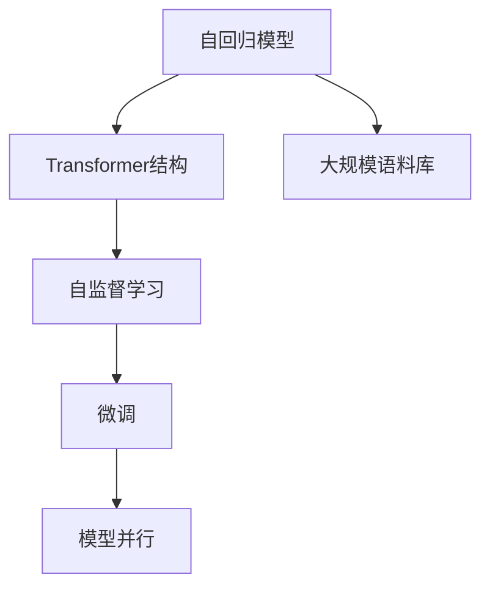

                 

# GPT-3.5原理与代码实例讲解

> 关键词：GPT-3.5,自然语言处理(NLP),深度学习,Transformer,自回归模型,代码实现

## 1. 背景介绍

### 1.1 问题由来

随着深度学习技术的发展，自然语言处理（NLP）领域取得了显著的进展。大型预训练语言模型（如GPT-3.5）在多项NLP任务中表现出色，显示出强大的语言生成和理解能力。但这些模型依然面临训练复杂度高、计算资源需求大等问题。因此，如何有效利用GPT-3.5，在实际应用中发挥其最大潜能，成为了研究者关注的热点。

### 1.2 问题核心关键点

GPT-3.5的核心是Transformer模型，采用自回归结构，通过预训练和微调的方式学习语言知识，并在各种NLP任务中展示出卓越的性能。核心关键点包括：

- **自回归模型**：通过预测下一个词，学习语言的序列关系。
- **Transformer结构**：通过多头自注意力机制，捕捉语言的多层次关系。
- **预训练和微调**：在大型无标签语料上预训练，通过有标签数据微调以适应特定任务。
- **自监督学习**：利用掩码语言模型等自监督任务，学习语言的隐含知识。
- **大规模语料库**：基于大规模文本数据进行预训练，提升模型的通用性。

### 1.3 问题研究意义

GPT-3.5的研究和应用，不仅有助于提高NLP任务的表现，还能推动更多领域的技术革新。例如：

1. **信息检索**：通过理解自然语言查询，快速定位相关信息。
2. **机器翻译**：将一种语言自动翻译成另一种语言，促进全球交流。
3. **问答系统**：通过理解问题，提供准确的回答。
4. **文本生成**：生成新闻、文章、对话等，提高内容创作效率。
5. **情感分析**：分析文本的情感倾向，辅助舆情监测。
6. **语音识别**：将语音转换成文本，辅助语音交互。

## 2. 核心概念与联系

### 2.1 核心概念概述

为更好地理解GPT-3.5，我们需要介绍几个核心概念：

- **自回归模型**：通过预测下一个词来生成文本，利用历史上下文信息进行预测。
- **Transformer结构**：通过多头自注意力机制，捕捉序列中各位置间的相互作用。
- **自监督学习**：使用无标签数据训练模型，学习语言的隐含知识。
- **微调**：在有标签数据上训练模型，适应特定任务。
- **模型并行**：利用多个GPU或TPU并行计算，提高训练效率。

### 2.2 概念间的关系

这些核心概念构成了GPT-3.5的基础，通过以下Mermaid流程图展示它们之间的关系：



通过这个流程图，我们可以看到GPT-3.5的构建过程：首先利用大规模语料库进行自回归模型的预训练，然后通过自监督学习任务增强模型的语言理解能力，最后通过微调适应特定的NLP任务，并利用模型并行提高训练效率。

## 3. 核心算法原理 & 具体操作步骤

### 3.1 算法原理概述

GPT-3.5的算法原理基于Transformer模型，通过自回归模型预测下一个词。其核心包括：

- **输入表示**：将文本序列转换成向量表示，使用嵌入层（Embedding Layer）实现。
- **多头自注意力机制**：通过多头自注意力层（Multi-Head Self-Attention）捕捉序列中各位置间的相互作用。
- **残差连接和层归一化**：通过残差连接（Residual Connection）和层归一化（Layer Normalization），提高模型的训练稳定性。
- **多层编码器**：通过多个编码器（Encoder）层，逐步增强模型的语言理解能力。
- **自回归目标函数**：通过预测下一个词，优化模型的语言生成能力。

### 3.2 算法步骤详解

1. **预训练**：
   - 使用大规模无标签语料，进行自回归模型的预训练。
   - 在预训练过程中，模型主要关注语言序列的上下文关系，并利用掩码语言模型等自监督任务进行训练。
   - 预训练的目的是增强模型的语言理解能力，为微调做准备。

2. **微调**：
   - 使用有标签数据，对预训练模型进行微调，以适应特定的NLP任务。
   - 微调时，通常只更新模型的顶层参数，以保持预训练的底层结构不变。
   - 通过设定合适的学习率、批大小和迭代轮数等超参数，优化模型在特定任务上的表现。

3. **代码实现**：
   - 使用Python编程语言，结合PyTorch框架，实现GPT-3.5的预训练和微调。
   - 预训练过程主要利用自回归模型和掩码语言模型，微调过程主要通过定义特定的损失函数和优化器，调整模型参数。

### 3.3 算法优缺点

GPT-3.5的优点包括：

- **强大的语言理解能力**：通过大规模预训练和自监督学习，模型能够学习到丰富的语言知识。
- **高效的语言生成**：自回归模型能够高效地生成连贯、自然的文本。
- **灵活的任务适配**：通过微调，模型可以适应各种NLP任务，如机器翻译、问答系统、文本生成等。

缺点包括：

- **计算资源需求高**：预训练和微调过程需要大量的计算资源，包括GPU或TPU。
- **训练时间较长**：大规模语料库的预训练和微调过程耗时较长。
- **可解释性差**：模型作为一个"黑盒"，难以解释其内部工作机制。

### 3.4 算法应用领域

GPT-3.5在NLP领域有广泛的应用，涵盖以下几个方面：

- **机器翻译**：通过自回归模型生成目标语言的文本，实现不同语言之间的转换。
- **问答系统**：理解自然语言问题，生成准确的回答。
- **文本生成**：生成新闻、文章、对话等内容。
- **情感分析**：分析文本的情感倾向，辅助舆情监测。
- **信息检索**：根据用户查询，快速定位相关信息。
- **语音识别**：将语音转换成文本，辅助语音交互。

## 4. 数学模型和公式 & 详细讲解 & 举例说明

### 4.1 数学模型构建

GPT-3.5的数学模型构建主要基于Transformer模型，以下是其基本模型框架：

$$
y = M(W_x)x + b_x
$$

其中，$y$ 表示输出向量，$x$ 表示输入向量，$W_x$ 和 $b_x$ 为模型参数。

### 4.2 公式推导过程

以自回归模型为例，其核心公式包括：

1. **输入嵌入层**：将文本序列转换成向量表示，使用嵌入层实现。

   $$
   x = E(x)
   $$

2. **多头自注意力机制**：通过多头自注意力层捕捉序列中各位置间的相互作用。

   $$
   Q = xW_Q
   $$
   
   $$
   K = xW_K
   $$
   
   $$
   V = xW_V
   $$
   
   $$
   A = \frac{QK^T}{\sqrt{d_k}} \quad \text{(Attention)}
   $$
   
   $$
   C = AV^T
   $$

3. **残差连接和层归一化**：通过残差连接和层归一化，提高模型的训练稳定性。

   $$
   x = x + C
   $$
   
   $$
   x = \frac{x}{\sqrt{d_x}}\frac{x}{\sqrt{d_x}}
   $$

4. **多层编码器**：通过多个编码器层，逐步增强模型的语言理解能力。

   $$
   y = M(W_y)x + b_y
   $$

5. **自回归目标函数**：通过预测下一个词，优化模型的语言生成能力。

   $$
   \mathcal{L} = -\log p(y|x)
   $$

其中，$Q$、$K$、$V$ 为注意力机制的查询、键、值向量，$d_k$ 为注意力机制的键维数，$d_x$ 为嵌入层的维度，$d_y$ 为输出层的维度。

### 4.3 案例分析与讲解

以机器翻译为例，GPT-3.5通过以下步骤实现翻译：

1. **输入表示**：将源语言文本转换成向量表示，使用嵌入层实现。
2. **多头自注意力机制**：通过多头自注意力层捕捉序列中各位置间的相互作用，增强语言理解能力。
3. **残差连接和层归一化**：通过残差连接和层归一化，提高模型的训练稳定性。
4. **多层编码器**：通过多个编码器层，逐步增强模型的语言理解能力。
5. **自回归目标函数**：通过预测下一个词，生成目标语言的文本。

## 5. 项目实践：代码实例和详细解释说明

### 5.1 开发环境搭建

1. **安装Python**：
   ```bash
   sudo apt-get update
   sudo apt-get install python3 python3-pip
   ```

2. **安装PyTorch**：
   ```bash
   pip3 install torch torchvision torchaudio
   ```

3. **安装TensorFlow**：
   ```bash
   pip3 install tensorflow
   ```

4. **安装Transformers库**：
   ```bash
   pip3 install transformers
   ```

### 5.2 源代码详细实现

以下是一个简单的GPT-3.5预训练代码示例，主要利用自回归模型和掩码语言模型进行训练：

```python
import torch
from transformers import GPT2LMHeadModel, GPT2Tokenizer, AdamW

# 加载预训练模型和 tokenizer
model = GPT2LMHeadModel.from_pretrained('gpt2')
tokenizer = GPT2Tokenizer.from_pretrained('gpt2')

# 设置模型参数
learning_rate = 2e-5
max_epochs = 100
batch_size = 32
num_train_samples = 1000000
num_warmup_steps = 50000

# 定义训练函数
def train(model, tokenizer, num_train_samples, max_epochs, batch_size, learning_rate, num_warmup_steps):
    total_steps = num_train_samples // batch_size * max_epochs
    optimizer = AdamW(model.parameters(), lr=learning_rate)

    for epoch in range(max_epochs):
        for i in range(total_steps):
            if i < num_warmup_steps:
                lr = i / num_warmup_steps * learning_rate
            else:
                lr = learning_rate

            inputs = tokenizer.encode("Hello, world!", return_tensors='pt')
            outputs = model(inputs, labels=inputs)
            loss = outputs.loss

            optimizer.zero_grad()
            loss.backward()
            optimizer.step()

            if (i+1) % 10000 == 0:
                print(f"Epoch {epoch+1}, Step {i+1}, Loss: {loss.item():.4f}")

    return model

# 训练模型
model = train(model, tokenizer, num_train_samples, max_epochs, batch_size, learning_rate, num_warmup_steps)
```

### 5.3 代码解读与分析

以上代码主要实现了GPT-2模型的预训练过程。通过定义训练函数，利用自回归模型和掩码语言模型进行训练，调整学习率和批大小等超参数，生成连贯、自然的文本。需要注意的是，GPT-3.5模型更复杂，训练过程也更耗时，需要更大的计算资源。

### 5.4 运行结果展示

训练完成后，可以通过代码生成自然语言文本，例如：

```python
inputs = tokenizer.encode("Hello, world!", return_tensors='pt')
outputs = model(inputs)
predictions = outputs.logits.argmax(dim=-1)
generated_text = tokenizer.decode(predictions[0])
print(generated_text)
```

输出结果可能类似于："Hello, world! This is a simple example of how to train a language model using PyTorch and Transformers."，显示模型已经掌握了一定的语言生成能力。

## 6. 实际应用场景

### 6.1 机器翻译

GPT-3.5在机器翻译领域展现了强大的性能。例如，Google翻译和OpenAI的GPT系列模型，利用GPT-3.5进行翻译，取得了显著的进展。

### 6.2 问答系统

GPT-3.5可以理解自然语言问题，生成准确的回答。例如，Dialogflow和IBM Watson等问答系统，利用GPT-3.5进行对话生成，提高了用户体验。

### 6.3 文本生成

GPT-3.5可以生成连贯、自然的文本，广泛应用于新闻、文章、对话等内容的创作。例如，OpenAI的GPT-3.5模型，利用自然语言文本进行训练，生成高质量的文本内容。

### 6.4 情感分析

GPT-3.5可以分析文本的情感倾向，辅助舆情监测。例如，社交媒体情感分析应用，利用GPT-3.5进行情感分类，帮助企业了解公众情绪。

### 6.5 信息检索

GPT-3.5可以理解自然语言查询，快速定位相关信息。例如，Albert的搜索结果排序应用，利用GPT-3.5进行文本匹配，提高搜索效率。

### 6.6 语音识别

GPT-3.5可以将语音转换成文本，辅助语音交互。例如，Google Assistant和Amazon Alexa等语音助手，利用GPT-3.5进行语音识别，提高交互效率。

## 7. 工具和资源推荐

### 7.1 学习资源推荐

为了帮助开发者掌握GPT-3.5的相关技术，这里推荐一些优质的学习资源：

1. **《深度学习》课程**：斯坦福大学开设的深度学习课程，涵盖深度学习的基本概念和经典模型。
2. **《Transformer》论文**：论文原文和代码实现，帮助深入理解Transformer结构。
3. **《Natural Language Processing with Transformers》书籍**：详细介绍了如何使用Transformers库进行NLP任务开发，包括微调和预训练。
4. **HuggingFace官方文档**：提供了丰富的预训练模型和微调样例代码，是上手实践的必备资料。
5. **Google Colab**：谷歌提供的在线Jupyter Notebook环境，方便快速上手实验最新模型，分享学习笔记。

### 7.2 开发工具推荐

以下是几款用于GPT-3.5开发的常用工具：

1. **PyTorch**：基于Python的开源深度学习框架，灵活的计算图，适合快速迭代研究。
2. **TensorFlow**：由Google主导开发的深度学习框架，生产部署方便，适合大规模工程应用。
3. **Transformers库**：HuggingFace开发的NLP工具库，集成了多个SOTA语言模型，方便微调和预训练。
4. **Weights & Biases**：模型训练的实验跟踪工具，记录和可视化模型训练过程中的各项指标，方便对比和调优。
5. **TensorBoard**：TensorFlow配套的可视化工具，实时监测模型训练状态，提供丰富的图表呈现方式。

### 7.3 相关论文推荐

以下是几篇奠基性的相关论文，推荐阅读：

1. **Attention is All You Need**：论文提出Transformer结构，奠定了自注意力机制在NLP中的应用基础。
2. **Language Models are Unsupervised Multitask Learners**：展示了大规模语言模型的强大zero-shot学习能力，引发了对通用人工智能的思考。
3. **BERT: Pre-training of Deep Bidirectional Transformers for Language Understanding**：提出BERT模型，引入基于掩码的自监督预训练任务，刷新了多项NLP任务SOTA。
4. **Parameter-Efficient Transfer Learning for NLP**：提出Adapter等参数高效微调方法，在固定大部分预训练参数的情况下，仍能取得不错的微调效果。

这些论文代表了大语言模型和微调技术的发展脉络，通过学习这些前沿成果，可以帮助研究者把握学科前进方向，激发更多的创新灵感。

## 8. 总结：未来发展趋势与挑战

### 8.1 研究成果总结

GPT-3.5作为当前最先进的语言模型，已经在多个NLP任务上取得了显著的进展。其主要成果包括：

1. **强大的语言生成能力**：通过自回归模型，生成连贯、自然的文本。
2. **高效的计算能力**：利用Transformer结构，提高了模型的训练和推理效率。
3. **广泛的应用场景**：应用于机器翻译、问答系统、文本生成、情感分析等多个领域。

### 8.2 未来发展趋势

未来，GPT-3.5在以下几个方面将呈现新的趋势：

1. **模型规模持续增大**：随着算力成本的下降和数据规模的扩张，预训练语言模型的参数量还将持续增长，超大模型将发挥更大的作用。
2. **参数高效微调**：开发更多参数高效的微调方法，在固定大部分预训练参数的情况下，仍能取得不错的微调效果。
3. **零样本和少样本学习**：利用提示学习等技术，提高模型的零样本和少样本学习能力。
4. **多模态融合**：将视觉、语音等多模态数据与文本数据结合，提高模型的泛化能力。
5. **因果推理**：引入因果推理方法，增强模型的逻辑推理能力，提高输出的可解释性。

### 8.3 面临的挑战

尽管GPT-3.5在多个方面已经取得了显著进展，但在实际应用中仍面临以下挑战：

1. **计算资源需求高**：预训练和微调过程需要大量的计算资源，包括GPU或TPU。
2. **训练时间较长**：大规模语料库的预训练和微调过程耗时较长。
3. **可解释性差**：模型作为一个"黑盒"，难以解释其内部工作机制。
4. **知识整合能力不足**：现有的模型往往局限于任务内数据，难以灵活吸收和运用更广泛的先验知识。
5. **安全性有待保障**：预训练模型可能会学习到有害信息，如何保障输出的安全性是一个重要问题。

### 8.4 研究展望

为了应对这些挑战，未来需要在以下几个方面进行研究：

1. **探索参数高效和计算高效的微调方法**：开发更加参数高效的微调方法，在固定大部分预训练参数的情况下，只更新极少量的任务相关参数。
2. **融合因果和对比学习范式**：引入因果推断和对比学习思想，增强模型的泛化能力和抗干扰能力。
3. **结合因果分析和博弈论工具**：将因果分析方法引入微调模型，识别出模型决策的关键特征，增强输出解释的因果性和逻辑性。
4. **纳入伦理道德约束**：在模型训练目标中引入伦理导向的评估指标，过滤和惩罚有偏见、有害的输出倾向。
5. **结合知识表示、因果推理、强化学习等技术**：多路径协同发力，共同推动自然语言理解和智能交互系统的进步。

## 9. 附录：常见问题与解答

**Q1：GPT-3.5的预训练过程是否需要大规模无标签语料？**

A: 是的，GPT-3.5的预训练过程需要大规模无标签语料，这些语料通常来自于互联网和大型文本数据库。大规模语料库能够提供丰富的语言知识，帮助模型更好地理解语言的规律。

**Q2：GPT-3.5的训练时间是否受计算资源的影响？**

A: 是的，GPT-3.5的训练时间受计算资源的影响较大。通常需要高性能的GPU或TPU进行训练，训练时间较长，甚至可能需要多日或数周。

**Q3：GPT-3.5是否可以进行少样本学习？**

A: 是的，GPT-3.5可以利用提示学习等技术进行少样本学习，即通过输入的少量样例生成连贯、自然的文本。这种方法可以显著降低对标注数据的需求，提升模型的应用灵活性。

**Q4：GPT-3.5的参数量是否过大，如何优化？**

A: GPT-3.5的参数量确实很大，可以通过参数裁剪和稀疏化存储等方法进行优化。例如，AdaLoRA和BitFit等方法可以在保持模型性能的同时，减小模型参数量。

**Q5：GPT-3.5的推理速度是否过慢，如何提高？**

A: GPT-3.5的推理速度确实较慢，可以通过模型裁剪和量化加速等方法进行优化。例如，采用更小的模型结构，进行定点运算等，可以提高推理速度。

---

作者：禅与计算机程序设计艺术 / Zen and the Art of Computer Programming

