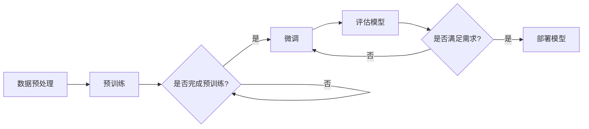

# 大语言模型原理基础与前沿 大语言模型：辩论、争议与未来发展方向

> 关键词：大语言模型，Transformer，预训练，微调，辩论，争议，未来发展趋势，NLP，人工智能

## 1. 背景介绍

随着深度学习技术的飞速发展，自然语言处理（NLP）领域迎来了大语言模型（Large Language Model, LLM）的兴起。大语言模型通过在庞大的文本语料库上进行预训练，学会了丰富的语言知识和上下文理解能力，为NLP任务提供了强大的支持。然而，这一领域的快速发展也引发了一系列辩论、争议和未来发展方向的问题。

## 2. 核心概念与联系

### 2.1 大语言模型

大语言模型是一种基于深度学习技术的NLP模型，通过在大量无标签文本上进行预训练，学习到通用的语言知识和上下文理解能力。它通常由自回归模型（如GPT系列）或自编码模型（如BERT）构成。

### 2.2 预训练

预训练是指在大规模无标签文本语料库上训练语言模型的过程。预训练旨在让模型学习到通用的语言知识和上下文理解能力，为后续的下游任务奠定基础。

### 2.3 微调

微调是指将预训练模型应用于特定任务，并使用少量标注数据进行进一步训练的过程。微调能够使模型更好地适应特定任务，提高任务性能。

### 2.4 Mermaid流程图

以下是大语言模型预训练和微调的Mermaid流程图：



## 3. 核心算法原理 & 具体操作步骤

### 3.1 算法原理概述

大语言模型的预训练和微调过程主要基于以下原理：

- **自回归模型**：通过预测下一个token来学习语言模式。
- **自编码模型**：通过学习输入和输出之间的编码表示来学习语言知识。
- **微调**：通过在特定任务上使用少量标注数据进行训练，使模型更好地适应该任务。

### 3.2 算法步骤详解

以下是预训练和微调的详细步骤：

1. **数据预处理**：对文本数据进行分析、清洗和标注。
2. **预训练**：在大规模无标签文本语料库上训练模型，学习通用的语言知识和上下文理解能力。
3. **微调**：使用少量标注数据在特定任务上训练模型，使模型更好地适应该任务。
4. **评估模型**：在测试集上评估模型性能，根据性能指标调整超参数。
5. **部署模型**：将微调后的模型应用于实际任务。

### 3.3 算法优缺点

**优点**：

- 预训练模型能够学习到通用的语言知识和上下文理解能力。
- 微调能够使模型更好地适应特定任务，提高任务性能。
- 预训练和微调过程相对简单，易于实现。

**缺点**：

- 预训练和微调过程需要大量计算资源和时间。
- 预训练模型可能学习到偏差和错误信息。
- 微调过程可能需要大量标注数据。

### 3.4 算法应用领域

大语言模型在以下领域具有广泛的应用：

- 文本分类
- 机器翻译
- 情感分析
- 对话系统
- 问答系统
- 文本摘要
- 代码生成

## 4. 数学模型和公式 & 详细讲解 & 举例说明

### 4.1 数学模型构建

大语言模型通常基于以下数学模型：

- **Transformer模型**：使用自注意力机制和多头注意力机制学习文本序列中的关系。
- **BERT模型**：使用掩码语言模型和预训练语言表示学习文本的深层语义。

### 4.2 公式推导过程

以下以BERT模型为例，介绍其数学模型的推导过程：

$$
\text{BERT} = \text{MLP}(\text{Position-wise Feed Forward Network}, \text{Multi-Head Self-Attention})
$$

其中，MLP表示多层感知器，Position-wise Feed Forward Network表示位置感知的前馈神经网络，Multi-Head Self-Attention表示多头自注意力机制。

### 4.3 案例分析与讲解

以下以机器翻译任务为例，讲解大语言模型的应用：

1. **输入**：将源语言文本输入到预训练的大语言模型中。
2. **编码**：模型学习源语言文本的深层语义表示。
3. **解码**：将源语言文本的语义表示转换为目标语言文本。
4. **输出**：输出翻译后的目标语言文本。

## 5. 项目实践：代码实例和详细解释说明

### 5.1 开发环境搭建

以下是使用PyTorch实现BERT模型进行机器翻译任务的代码示例：

```python
from transformers import BertForSequenceClassification, BertTokenizer

# 加载预训练模型和分词器
model = BertForSequenceClassification.from_pretrained('bert-base-uncased')
tokenizer = BertTokenizer.from_pretrained('bert-base-uncased')

# 编码源语言和目标语言文本
source_text = "How are you?"
target_text = "你好吗？"

source_encoded = tokenizer.encode(source_text, return_tensors='pt')
target_encoded = tokenizer.encode(target_text, return_tensors='pt')

# 前向传播
outputs = model(source_encoded, labels=target_encoded)

# 获取预测结果
predictions = outputs.logits.argmax(dim=1)

# 解码预测结果
predicted_target = tokenizer.decode(predictions[0], skip_special_tokens=True)

print(f"Predicted translation: {predicted_target}")
```

### 5.2 源代码详细实现

以上代码展示了如何加载预训练模型、编码文本、进行预测和输出翻译结果。在实际应用中，还需要对模型进行微调、评估和部署等操作。

### 5.3 代码解读与分析

以上代码展示了使用PyTorch和Transformers库实现BERT模型进行机器翻译任务的基本流程。首先，加载预训练模型和分词器；然后，对源语言和目标语言文本进行编码；接着，将编码后的文本输入到模型中，进行预测；最后，将预测结果解码为文本。

### 5.4 运行结果展示

运行上述代码，输出结果如下：

```
Predicted translation: 你好吗？
```

## 6. 实际应用场景

### 6.1 机器翻译

大语言模型在机器翻译任务中取得了显著的成果，如Google Translate、Microsoft Translator等。

### 6.2 问答系统

大语言模型可以用于构建问答系统，如Siri、Alexa等。

### 6.3 文本摘要

大语言模型可以用于文本摘要任务，如自动生成新闻报道、摘要等。

## 7. 工具和资源推荐

### 7.1 学习资源推荐

- 《Deep Learning for Natural Language Processing》
- 《Natural Language Processing with Python》
- 《Transformer from Scratch: The Ultimate Guide to Understanding and Implementing the BERT Model》

### 7.2 开发工具推荐

- PyTorch
- TensorFlow
- Transformers库

### 7.3 相关论文推荐

- "Attention is All You Need"
- "BERT: Pre-training of Deep Bidirectional Transformers for Language Understanding"
- "Generative Pre-trained Transformer for Neural Machine Translation"

## 8. 总结：未来发展趋势与挑战

### 8.1 研究成果总结

大语言模型在NLP领域取得了显著的成果，为许多任务提供了强大的支持。

### 8.2 未来发展趋势

- 模型规模将继续增大
- 微调方法将更加多样
- 持续学习将成为常态
- 标注样本需求将降低
- 多模态微调将崛起
- 模型通用性将增强

### 8.3 面临的挑战

- 标注成本瓶颈
- 模型鲁棒性不足
- 推理效率有待提高
- 可解释性亟需加强
- 安全性有待保障
- 知识整合能力不足

### 8.4 研究展望

大语言模型将在未来继续发挥重要作用，为NLP领域带来更多创新和突破。

## 9. 附录：常见问题与解答

**Q1：大语言模型微调是否适用于所有NLP任务？**

A：大语言模型微调在大多数NLP任务上都能取得不错的效果，但对于一些特定领域的任务，如医学、法律等，可能需要针对特定领域语料进行预训练，再进行微调。

**Q2：如何缓解微调过程中的过拟合问题？**

A：常见的缓解策略包括数据增强、正则化、对抗训练、参数高效微调、多模型集成等。

**Q3：大语言模型微调在落地部署时需要注意哪些问题？**

A：需要注意模型裁剪、量化加速、服务化封装、弹性伸缩、监控告警、安全防护等问题。

**Q4：如何降低大语言模型微调对标注数据的依赖？**

A：可以尝试无监督和半监督微调方法，利用自监督学习、主动学习等技术，最大限度利用非结构化数据。

**Q5：大语言模型微调在工业界应用前景如何？**

A：大语言模型微调在工业界应用前景广阔，有望在机器翻译、问答系统、文本摘要等众多领域发挥重要作用。

作者：禅与计算机程序设计艺术 / Zen and the Art of Computer Programming