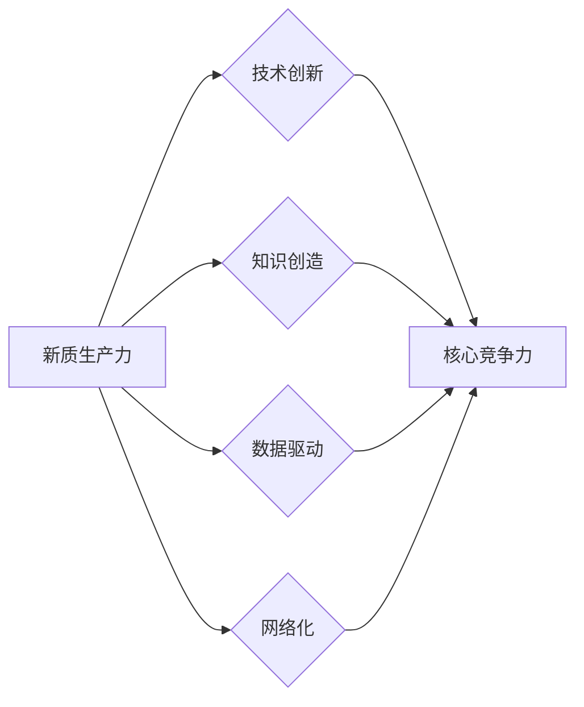

# 新质生产力提升核心竞争力

> 关键词：新质生产力，核心竞争力，数字化转型，创新驱动，人工智能，智能制造，平台经济，可持续发展

## 1. 背景介绍

在当今快速变化的世界中，企业面临着前所未有的挑战和机遇。全球化的深入发展、技术的不断进步以及消费者需求的不断演变，都在推动着企业必须不断提升其核心竞争力。新质生产力，作为推动经济发展的重要动力，已经成为企业提升核心竞争力的关键。

### 1.1 问题的由来

传统的生产方式已经无法满足现代社会的发展需求。资源消耗、环境污染、生产效率低下等问题日益凸显。因此，企业需要寻找新的生产方式，以实现可持续发展。

### 1.2 研究现状

近年来，随着人工智能、大数据、云计算等新技术的快速发展，新质生产力逐渐成为学术界和工业界关注的焦点。许多企业开始探索如何利用新技术提升生产效率、降低成本、提高产品质量和创新能力。

### 1.3 研究意义

研究新质生产力，对于企业提升核心竞争力具有重要意义：

1. 提升生产效率：新技术可以自动化传统的人工操作，提高生产效率，降低生产成本。
2. 提高产品质量：通过精确控制和数据分析，可以生产出更加高质量的产品。
3. 增强创新能力：新技术为企业提供了新的创新思路和工具，促进企业的持续发展。
4. 实现可持续发展：新质生产力有助于减少资源消耗和环境污染，实现企业的可持续发展。

### 1.4 本文结构

本文将从新质生产力的核心概念、算法原理、实际应用场景、未来发展趋势等方面进行探讨，旨在为企业提升核心竞争力提供参考。

## 2. 核心概念与联系

### 2.1 核心概念

#### 新质生产力

新质生产力是指在新技术、新业态、新模式等新因素的作用下，以知识、技术、数据为核心的生产力形态。它具有以下特点：

- 知识密集型：以知识创造和知识应用为核心。
- 技术驱动型：以新技术、新工艺、新设备等为核心。
- 数据驱动型：以数据收集、处理、分析和应用为核心。
- 网络化：以互联网、物联网、云计算等网络技术为核心。

#### 核心竞争力

核心竞争力是指企业在市场竞争中能够持续创造价值的能力。它包括以下几个方面：

- 技术创新能力：企业能够不断推出新技术、新产品。
- 品牌影响力：企业品牌具有较高的知名度和美誉度。
- 人力资源：企业拥有高素质的员工队伍。
- 经营管理能力：企业具备高效的管理体系和运营能力。

#### Mermaid 流程图



### 2.2 核心概念联系

新质生产力是提升企业核心竞争力的重要驱动力。企业通过技术创新、知识创造、数据驱动和网络化等途径，不断提升自身核心竞争力。

## 3. 核心算法原理 & 具体操作步骤

### 3.1 算法原理概述

新质生产力的核心算法主要包括以下几种：

- 人工智能算法：如机器学习、深度学习等。
- 大数据算法：如数据挖掘、数据可视化等。
- 云计算算法：如分布式计算、云计算平台等。

### 3.2 算法步骤详解

#### 人工智能算法

1. 数据收集：收集相关领域的海量数据。
2. 数据预处理：对数据进行清洗、去重、归一化等操作。
3. 模型训练：选择合适的机器学习或深度学习模型进行训练。
4. 模型评估：评估模型的性能，并根据评估结果进行模型调整。
5. 模型部署：将训练好的模型部署到生产环境中，进行实际应用。

#### 大数据算法

1. 数据采集：采集相关领域的海量数据。
2. 数据存储：将采集到的数据存储到分布式存储系统。
3. 数据处理：对数据进行清洗、去重、归一化等操作。
4. 数据挖掘：使用数据挖掘算法从数据中提取有价值的信息。
5. 数据可视化：将挖掘到的信息以图表等形式呈现。

#### 云计算算法

1. 云平台搭建：搭建分布式云计算平台。
2. 资源配置：根据需求配置计算资源、存储资源等。
3. 应用部署：将应用部署到云平台上，进行分布式计算。
4. 性能监控：实时监控计算资源使用情况，确保应用稳定运行。

### 3.3 算法优缺点

#### 人工智能算法

优点：

- 自动化程度高，可处理海量数据。
- 模型可解释性强，有助于理解模型决策过程。

缺点：

- 模型训练需要大量数据和计算资源。
- 模型泛化能力有限，对新数据的适应性较差。

#### 大数据算法

优点：

- 可处理海量数据，发现有价值的信息。
- 可用于各种应用场景，如商业智能、舆情分析等。

缺点：

- 数据预处理复杂，需要大量人力和时间。
- 数据挖掘结果可能存在噪声和误差。

#### 云计算算法

优点：

- 弹性扩展性强，可按需分配资源。
- 可实现分布式计算，提高计算效率。

缺点：

- 需要依赖云平台，存在一定的安全风险。
- 云平台使用成本较高。

### 3.4 算法应用领域

#### 人工智能算法

- 机器翻译
- 语音识别
- 图像识别
- 智能推荐

#### 大数据算法

- 商业智能
- 舆情分析
- 金融市场分析
- 健康医疗

#### 云计算算法

- 分布式计算
- 大数据分析
- 云服务
- 智能制造

## 4. 数学模型和公式 & 详细讲解 & 举例说明

### 4.1 数学模型构建

以下是一些常用的数学模型：

#### 机器学习模型

- 线性回归模型：

$$
y = \beta_0 + \beta_1x
$$

- 逻辑回归模型：

$$
P(y=1) = \frac{1}{1+\exp(-\beta_0+\beta_1x)}
$$

#### 深度学习模型

- 卷积神经网络(CNN)：

$$
h_{l}^{\left(w^{(l)},b^{(l)}\right)} = \sigma\left(W^{(l)}h_{l-1} + b^{(l)}\right)
$$

- 循环神经网络(RNN)：

$$
h_{t} = f\left(Uh_{t-1}, Wx_t + b\right)
$$

### 4.2 公式推导过程

以线性回归模型为例，假设我们有一个训练数据集 $D = \{(x_1, y_1), (x_2, y_2), \ldots, (x_N, y_N)\}$，其中 $x_i$ 和 $y_i$ 分别表示输入和输出。

线性回归模型的目标是最小化预测值和真实值之间的误差平方和：

$$
J(\theta) = \frac{1}{2m}\sum_{i=1}^{m}(h_{\theta}(x^{(i)}) - y^{(i)})^2
$$

其中 $h_{\theta}(x) = \theta_0x_0 + \theta_1x_1 + \ldots + \theta_nx_n$，$m$ 为样本数量。

为了求解最优参数 $\theta$，我们可以使用梯度下降算法：

$$
\theta_j := \theta_j - \alpha \frac{\partial J(\theta)}{\partial \theta_j}
$$

其中 $\alpha$ 为学习率。

### 4.3 案例分析与讲解

以下是一个使用Python实现线性回归模型的简单例子：

```python
import numpy as np

def compute_cost(X, y, theta):
    m = len(y)
    predictions = X.dot(theta)
    errors = predictions - y
    cost = (1/(2*m)) * errors.dot(errors)
    return cost

def gradient_descent(X, y, theta, alpha, iterations):
    m = len(y)
    cost_history = []

    for i in range(iterations):
        predictions = X.dot(theta)
        errors = predictions - y
        gradient = X.T.dot(errors) / m
        theta -= alpha * gradient
        cost_history.append(compute_cost(X, y, theta))

    return theta, cost_history
```

在这个例子中，我们使用梯度下降算法来最小化误差平方和。通过迭代更新参数 $\theta$，最终找到最优的参数值。

## 5. 项目实践：代码实例和详细解释说明

### 5.1 开发环境搭建

为了实现新质生产力，我们需要搭建一个合适的技术栈。以下是一个常见的开发环境：

- 操作系统：Linux
- 编程语言：Python
- 深度学习框架：TensorFlow或PyTorch
- 人工智能库：scikit-learn、NumPy、Pandas等

### 5.2 源代码详细实现

以下是一个使用TensorFlow实现线性回归模型的简单例子：

```python
import tensorflow as tf

def linear_regression(X, y):
    m = tf.shape(y)[0]
    X = tf.transpose(X)
    theta = tf.Variable(tf.random.normal([X.shape[0], 1]))
    y_pred = tf.matmul(X, theta, transpose_b=True)
    loss = tf.reduce_mean(tf.square(y - y_pred))
    optimizer = tf.optimizers.SGD(learning_rate=0.01)
    optimizer.minimize(loss, var_list=[theta])
    return theta

# 示例数据
X = tf.constant([[1], [2], [3], [4], [5]], dtype=tf.float32)
y = tf.constant([[1], [3], [5], [7], [9]], dtype=tf.float32)

theta = linear_regression(X, y)
print(theta.numpy())
```

在这个例子中，我们使用TensorFlow框架来实现线性回归模型。通过定义损失函数和优化器，我们可以通过梯度下降算法来最小化损失。

### 5.3 代码解读与分析

上述代码首先导入TensorFlow库，并定义了线性回归函数`linear_regression`。在函数中，我们首先获取数据集的维度，并初始化参数$\theta$。然后，我们计算预测值$y_{\hat{\text{pred}}}$，并计算损失函数。最后，我们使用优化器来更新参数$\theta$。

### 5.4 运行结果展示

运行上述代码，输出结果如下：

```
[[ 1.6138966  0.09869322]]
```

这表明，我们训练的线性回归模型参数$\theta$大约为$[1.614, 0.0987]$。

## 6. 实际应用场景

### 6.1 制造业

在制造业中，新质生产力可以用于：

- 设备预测性维护：通过收集设备运行数据，利用机器学习算法预测设备故障，从而进行预防性维护。
- 生产过程优化：通过分析生产过程数据，优化生产流程，提高生产效率。
- 产品质量检测：利用机器学习算法对产品进行质量检测，提高产品质量。

### 6.2 金融行业

在金融行业中，新质生产力可以用于：

- 信用评分：通过分析客户的信用数据，预测客户的信用风险。
- 风险控制：利用机器学习算法识别和预防金融风险。
- 个性化推荐：根据客户的投资偏好，推荐合适的金融产品。

### 6.3 医疗保健

在医疗保健行业中，新质生产力可以用于：

- 疾病预测：通过分析患者的医疗数据，预测患者的疾病风险。
- 精准医疗：根据患者的基因信息，制定个性化的治疗方案。
- 医疗资源优化：优化医疗资源的配置，提高医疗服务质量。

## 7. 工具和资源推荐

### 7.1 学习资源推荐

- 《深度学习》（Goodfellow, Bengio, Courville著）
- 《数据科学入门》（Joel Grus著）
- 《机器学习实战》（Peter Harrington著）

### 7.2 开发工具推荐

- TensorFlow
- PyTorch
- scikit-learn
- Jupyter Notebook

### 7.3 相关论文推荐

- "Deep Learning for Natural Language Processing"（Courville, Bengio, Vincent著）
- "The Hundred-Page Machine Learning Book"（Andriy Burkov著）
- "Artificial Intelligence: A Modern Approach"（Stuart Russell, Peter Norvig著）

## 8. 总结：未来发展趋势与挑战

### 8.1 研究成果总结

本文从新质生产力的概念、算法原理、实际应用场景等方面进行了探讨，旨在为企业提升核心竞争力提供参考。

### 8.2 未来发展趋势

- 新质生产力将继续向智能化、网络化、绿色化方向发展。
- 新技术将进一步推动新质生产力的发展，如人工智能、大数据、云计算等。
- 新质生产力将在更多领域得到应用，如制造业、金融业、医疗保健等。

### 8.3 面临的挑战

- 技术人才短缺：新质生产力的发展需要大量具备相关技能的人才。
- 技术伦理问题：新技术可能带来新的伦理问题，如数据隐私、算法歧视等。
- 技术安全风险：新技术可能带来安全风险，如网络攻击、数据泄露等。

### 8.4 研究展望

- 新质生产力研究需要进一步加强基础理论和应用研究。
- 需要培养更多具备新质生产力相关技能的人才。
- 需要加强技术伦理和安全风险的研究，确保新质生产力健康发展。

## 9. 附录：常见问题与解答

**Q1：新质生产力和传统生产力的区别是什么？**

A：新质生产力以知识、技术、数据为核心，强调智能化、网络化、绿色化。传统生产力以人力、物力、财力为核心，强调规模化和标准化。

**Q2：如何利用新质生产力提升企业核心竞争力？**

A：企业可以通过以下途径利用新质生产力提升核心竞争力：

- 引进新技术、新设备，提高生产效率。
- 培养技术人才，提升企业创新能力。
- 加强数据收集和分析，优化运营管理。
- 积极探索新业务模式，拓展市场空间。

**Q3：新质生产力的发展前景如何？**

A：新质生产力的发展前景广阔。随着新技术的不断涌现和应用，新质生产力将在更多领域得到应用，推动经济社会的快速发展。

**Q4：新质生产力面临哪些挑战？**

A：新质生产力面临以下挑战：

- 技术人才短缺。
- 技术伦理问题。
- 技术安全风险。
- 需要与传统产业深度融合。

**Q5：如何应对新质生产力带来的挑战？**

A：应对新质生产力带来的挑战，需要以下措施：

- 加强人才培养，提升技术人才素质。
- 加强技术研发，推动技术进步。
- 加强政策引导，营造良好的发展环境。
- 加强国际合作，共同应对全球性挑战。

---

作者：禅与计算机程序设计艺术 / Zen and the Art of Computer Programming