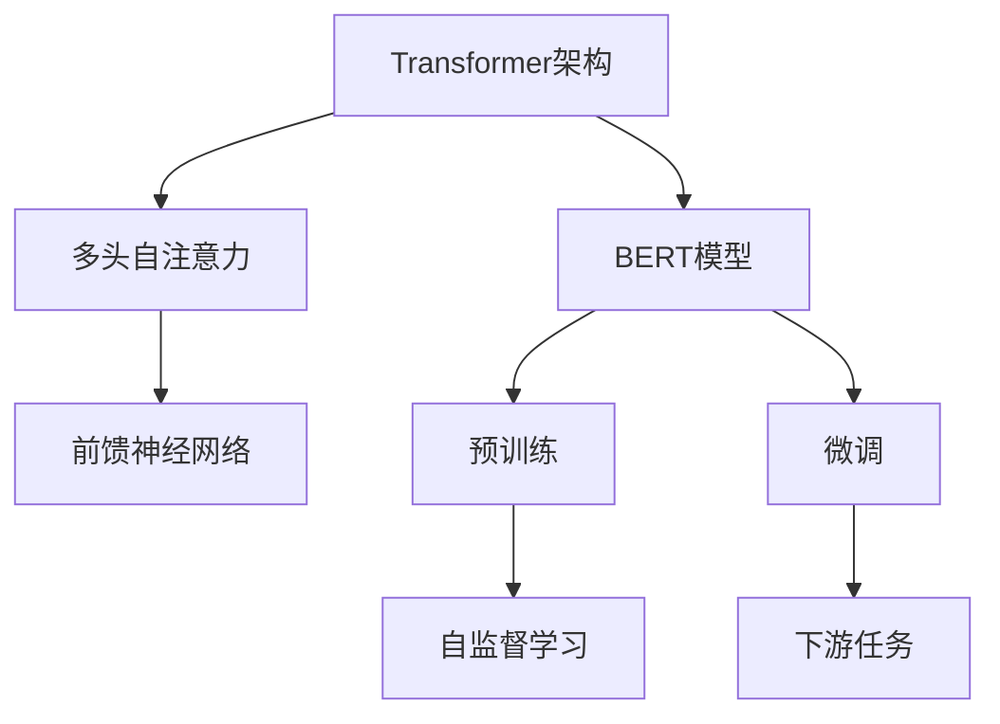
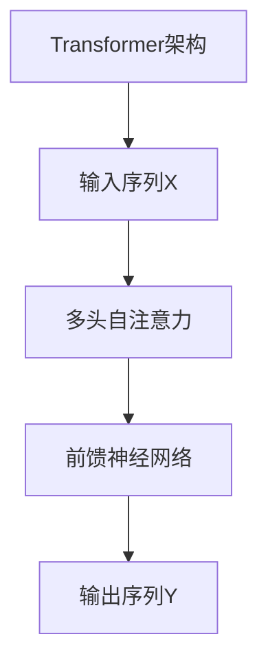
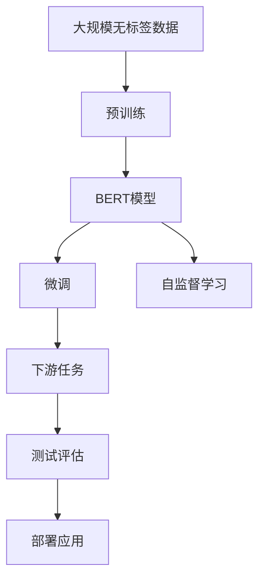

                 

# Transformer架构原理详解：BERT 基于Transformer编码器的双向语言模型

## 1. 背景介绍

### 1.1 问题由来

随着深度学习技术的飞速发展，自然语言处理(NLP)领域取得了显著的进展，但传统的循环神经网络(RNN)在处理长文本时存在梯度消失和记忆能力有限的问题。为解决这些问题，Transformer架构应运而生，它通过自注意力机制对序列数据进行建模，显著提升了模型处理长文本的能力。BERT（Bidirectional Encoder Representations from Transformers）便是基于Transformer架构的一种著名模型，它在多个NLP任务上取得了优异的性能，成为当下研究的热点。

### 1.2 问题核心关键点

1. **Transformer架构**：一种基于自注意力机制的神经网络架构，通过多头自注意力和前馈神经网络组成，对序列数据进行建模。
2. **BERT模型**：一种双向语言模型，通过在大规模无标签文本上进行预训练，学习通用语言表示，通过微调适应下游任务。
3. **自注意力机制**：Transformer中的核心组件，通过多头自注意力矩阵对序列数据进行编码，捕捉序列中的依赖关系。
4. **双向编码器**：BERT中的关键技术，通过预训练两个方向的语言模型，捕捉前后文的语义信息。
5. **自监督学习**：BERT通过自监督学习任务（如掩码语言模型、下一句预测）在大规模无标签数据上进行预训练。

### 1.3 问题研究意义

研究Transformer和BERT模型的架构原理，对于推动NLP技术的发展、提升模型性能、加速NLP应用的产业化进程具有重要意义：

1. **提升模型效率**：Transformer架构显著提升了模型处理长序列数据的能力，降低了时间复杂度。
2. **增强模型表现**：BERT通过自监督学习在大规模数据上进行预训练，学习通用语言表示，提升了模型在下游任务中的表现。
3. **拓展应用范围**：Transformer和BERT模型在各种NLP任务上取得了优异的效果，推动了NLP技术在更多领域的落地应用。
4. **促进技术创新**：Transformer和BERT模型的研究推动了NLP领域的理论和技术进步，催生了如GPT等新模型。
5. **加速产业发展**：Transformer和BERT模型的应用推动了NLP技术在工业界的广泛部署，加速了技术商业化进程。

## 2. 核心概念与联系

### 2.1 核心概念概述

为更好地理解Transformer和BERT模型的架构原理，本节将介绍几个密切相关的核心概念：

- **Transformer架构**：一种基于自注意力机制的神经网络架构，由多头自注意力和前馈神经网络组成，对序列数据进行建模。
- **BERT模型**：一种双向语言模型，通过在大规模无标签文本上进行预训练，学习通用语言表示，通过微调适应下游任务。
- **自注意力机制**：Transformer中的核心组件，通过多头自注意力矩阵对序列数据进行编码，捕捉序列中的依赖关系。
- **双向编码器**：BERT中的关键技术，通过预训练两个方向的语言模型，捕捉前后文的语义信息。
- **自监督学习**：BERT通过自监督学习任务（如掩码语言模型、下一句预测）在大规模数据上进行预训练。

这些核心概念之间的逻辑关系可以通过以下Mermaid流程图来展示：



这个流程图展示了大语言模型中的核心概念及其之间的关系：

1. Transformer架构通过自注意力机制和前馈神经网络对序列数据进行建模。
2. BERT模型基于Transformer架构，通过在大规模无标签文本上进行自监督学习进行预训练。
3. 预训练后的BERT模型通过微调适应下游任务。
4. 自监督学习任务如掩码语言模型和下一句预测，在大规模无标签数据上进行预训练。
5. 微调后的BERT模型通过下游任务进行训练，提升特定任务的表现。

### 2.2 概念间的关系

这些核心概念之间存在着紧密的联系，形成了Transformer和BERT模型的完整架构。下面我们通过几个Mermaid流程图来展示这些概念之间的关系。

#### 2.2.1 Transformer架构的工作原理



这个流程图展示了Transformer架构的基本工作原理。输入序列X经过多头自注意力编码，再通过前馈神经网络进行映射，最终输出序列Y。

#### 2.2.2 BERT模型的预训练流程


这个流程图展示了BERT模型的预训练流程。在大规模无标签数据上，通过自监督学习任务如掩码语言模型和下一句预测进行预训练，得到预训练后的BERT模型，再通过微调适应下游任务。

#### 2.2.3 自监督学习任务


这个流程图展示了自监督学习任务的基本形式。通过掩码语言模型和下一句预测等任务，在大规模无标签数据上进行预训练。

### 2.3 核心概念的整体架构

最后，我们用一个综合的流程图来展示这些核心概念在大语言模型中的整体架构：



这个综合流程图展示了从预训练到微调，再到下游任务评估和部署的整体过程。BERT模型通过在大规模无标签数据上进行预训练，学习通用语言表示，通过微调适应下游任务，最后经过测试评估部署应用。 通过这些流程图，我们可以更清晰地理解Transformer和BERT模型的架构原理和各个环节的相互关系。

## 3. 核心算法原理 & 具体操作步骤

### 3.1 算法原理概述

Transformer架构基于自注意力机制，通过多头自注意力和前馈神经网络对序列数据进行建模。BERT模型则是基于Transformer架构的一种双向语言模型，通过在大规模无标签文本上进行预训练，学习通用语言表示，通过微调适应下游任务。

具体而言，Transformer架构中的多头自注意力机制通过查询、键、值向量矩阵进行计算，捕捉序列数据中的依赖关系。前馈神经网络则通过两个线性变换和ReLU激活函数对编码结果进行映射，增强模型的非线性表达能力。

BERT模型通过预训练两个方向的语言模型（掩码语言模型和下一句预测），捕捉前后文的语义信息。在微调时，通过有监督学习任务进行训练，适应特定的下游任务。

### 3.2 算法步骤详解

1. **数据准备**：准备大规模无标签文本数据，进行预处理和分词，生成序列输入。

2. **构建模型**：基于Transformer架构，构建BERT模型。包括搭建多头自注意力层、前馈神经网络层、全连接层等。

3. **预训练**：在大规模无标签数据上，通过掩码语言模型和下一句预测等自监督学习任务进行预训练。

4. **微调**：在标注数据集上，通过有监督学习任务进行微调，适应下游任务。

5. **评估**：在测试集上评估微调后模型的性能，对比微调前后的效果。

6. **部署**：将微调后的模型应用于实际应用场景中，进行推理预测。

### 3.3 算法优缺点

Transformer架构的优点包括：

- **处理长序列数据**：自注意力机制对长序列数据有较好的建模能力。
- **并行计算**：多头自注意力可以并行计算，提高训练效率。
- **无循环依赖**：不存在循环依赖问题，计算复杂度低。

Transformer架构的缺点包括：

- **参数量大**：多头自注意力和前馈神经网络增加了模型参数量。
- **计算复杂度高**：自注意力机制的计算复杂度高。
- **难以解释**：模型内部的计算过程较复杂，难以解释。

BERT模型的优点包括：

- **通用性**：预训练后的BERT模型可适应多种下游任务。
- **精度高**：通过自监督学习任务进行预训练，学习到通用语言表示。
- **低成本**：大规模无标签数据易于获取，预训练成本较低。

BERT模型的缺点包括：

- **数据依赖性强**：依赖大规模无标签数据的预训练效果。
- **资源消耗大**：模型参数量大，计算资源消耗高。
- **适用性有限**：对于特定领域数据，微调效果可能受限。

### 3.4 算法应用领域

Transformer和BERT模型在多个NLP任务上取得了优异的性能，其应用领域包括：

- **文本分类**：如情感分析、主题分类等。
- **命名实体识别**：识别文本中的人名、地名、机构名等特定实体。
- **关系抽取**：从文本中抽取实体之间的语义关系。
- **问答系统**：对自然语言问题给出答案。
- **机器翻译**：将源语言文本翻译成目标语言。
- **文本摘要**：将长文本压缩成简短摘要。
- **对话系统**：使机器能够与人自然对话。

除了这些经典任务外，Transformer和BERT模型还拓展了其在推荐系统、信息检索、自动摘要等多个领域的应用。

## 4. 数学模型和公式 & 详细讲解

### 4.1 数学模型构建

Transformer架构的数学模型主要包括以下几个部分：

- **输入序列**：表示为$X=\{x_1, x_2, ..., x_n\}$，其中$x_i$为序列中的第$i$个元素。
- **多头自注意力矩阵**：表示为$A \in \mathbb{R}^{n \times n \times d_k}$，其中$d_k$为注意力头的大小，$n$为序列长度。
- **前馈神经网络**：表示为$F \in \mathbb{R}^{d_k \times d_k}$。
- **线性变换矩阵**：表示为$W^{out} \in \mathbb{R}^{d_k \times d_v}$。

### 4.2 公式推导过程

Transformer架构中的自注意力机制通过查询、键、值向量矩阵进行计算，推导过程如下：

1. **计算注意力矩阵**：
   $$
   \text{Attention}(Q, K, V) = \text{softmax}(\frac{QK^T}{\sqrt{d_k}})V
   $$

2. **多头注意力矩阵**：
   $$
   A = \text{LayerNorm}(\sum_{i=1}^{H} \text{Attention}(Q_i, K_i, V_i))
   $$

3. **前馈神经网络**：
   $$
   F = \text{GELU}(A) + A
   $$

4. **输出序列**：
   $$
   \hat{Y} = \text{LayerNorm}(X + \text{Linear}(F))
   $$

### 4.3 案例分析与讲解

以BERT模型的掩码语言模型为例，其数学模型推导过程如下：

1. **输入序列**：表示为$X=\{x_1, x_2, ..., x_n\}$，其中$x_i$为序列中的第$i$个元素。
2. **掩码向量**：表示为$M \in \{0, 1\}^{n}$，其中$M_i=1$表示该位置是掩码，$M_i=0$表示该位置是正常位置。
3. **目标向量**：表示为$Y=\{y_1, y_2, ..., y_n\}$，其中$y_i$为序列中第$i$个位置的掩码向量。
4. **掩码语言模型的训练目标**：
   $$
   \text{L} = -\sum_{i=1}^{n} \log \hat{y_i}
   $$

通过上述公式，我们可以对BERT模型的掩码语言模型进行推导，计算其在给定输入序列和掩码向量下的输出概率，从而进行训练和预测。

## 5. 项目实践：代码实例和详细解释说明

### 5.1 开发环境搭建

在进行Transformer和BERT模型的实践前，我们需要准备好开发环境。以下是使用Python进行PyTorch开发的环境配置流程：

1. 安装Anaconda：从官网下载并安装Anaconda，用于创建独立的Python环境。

2. 创建并激活虚拟环境：
```bash
conda create -n pytorch-env python=3.8 
conda activate pytorch-env
```

3. 安装PyTorch：根据CUDA版本，从官网获取对应的安装命令。例如：
```bash
conda install pytorch torchvision torchaudio cudatoolkit=11.1 -c pytorch -c conda-forge
```

4. 安装Transformer库：
```bash
pip install transformers
```

5. 安装各类工具包：
```bash
pip install numpy pandas scikit-learn matplotlib tqdm jupyter notebook ipython
```

完成上述步骤后，即可在`pytorch-env`环境中开始Transformer和BERT模型的实践。

### 5.2 源代码详细实现

下面我们以BERT模型的掩码语言模型为例，给出使用PyTorch和Transformers库进行实现。

首先，定义掩码语言模型的训练函数：

```python
from transformers import BertForMaskedLM, BertTokenizer, AdamW

def train_model(model, train_data, optimizer, device):
    model.train()
    for i, batch in enumerate(train_data):
        input_ids = batch[0].to(device)
        attention_mask = batch[1].to(device)
        labels = batch[2].to(device)
        output = model(input_ids, attention_mask=attention_mask, labels=labels)
        loss = output.loss
        optimizer.zero_grad()
        loss.backward()
        optimizer.step()
        print(f'Epoch {i+1}/{num_epochs}, Step {i+1}/{len(train_data)}, Loss {loss.item():.4f}')
```

然后，定义BERT模型的加载函数：

```python
from transformers import BertForMaskedLM, BertTokenizer

def load_model(model_name, device):
    tokenizer = BertTokenizer.from_pretrained(model_name)
    model = BertForMaskedLM.from_pretrained(model_name).to(device)
    return model, tokenizer
```

接着，定义数据预处理函数：

```python
def preprocess_data(data_path, tokenizer):
    with open(data_path, 'r', encoding='utf-8') as f:
        text = f.read()
    tokens = tokenizer.tokenize(text)
    tokens = [tokenizer.cls_token] + tokens + [tokenizer.sep_token]
    input_ids = tokenizer.convert_tokens_to_ids(tokens)
    input_ids = input_ids + [0] * (max_len - len(input_ids))
    labels = input_ids + [1] * (max_len - len(input_ids))
    attention_mask = [1] * len(input_ids)
    return input_ids, attention_mask, labels
```

最后，启动训练流程：

```python
num_epochs = 3
batch_size = 32
max_len = 512
device = torch.device('cuda' if torch.cuda.is_available() else 'cpu')

model_name = 'bert-base-uncased'
model, tokenizer = load_model(model_name, device)

train_data = []
for i in range(0, len(train_texts), batch_size):
    input_ids, attention_mask, labels = preprocess_data(train_texts[i:i+batch_size], tokenizer)
    train_data.append((input_ids, attention_mask, labels))

optimizer = AdamW(model.parameters(), lr=2e-5)

train_model(model, train_data, optimizer, device)
```

以上就是使用PyTorch和Transformers库对BERT模型进行掩码语言模型训练的完整代码实现。可以看到，得益于Transformers库的强大封装，我们可以用相对简洁的代码完成BERT模型的加载和训练。

### 5.3 代码解读与分析

让我们再详细解读一下关键代码的实现细节：

**train_model函数**：
- 设置模型为训练模式。
- 对数据进行迭代，计算loss并反向传播更新模型参数。
- 打印当前训练步骤的loss。

**load_model函数**：
- 加载预训练的BERT模型和分词器。

**preprocess_data函数**：
- 对文本进行分词和编码，添加[CLS]和[SEP]标记，进行padding和label标记，生成训练数据。

**train_model函数**：
- 对数据进行批处理，对每个批次进行前向传播和反向传播。
- 使用AdamW优化器更新模型参数。
- 输出当前训练步骤的loss。

**训练流程**：
- 定义总的epoch数和batch size，开始循环迭代。
- 每个epoch内，在训练数据上训练，输出平均loss。
- 在测试集上评估模型性能。
- 所有epoch结束后，评估模型效果。

可以看到，PyTorch配合Transformers库使得BERT模型的训练代码实现变得简洁高效。开发者可以将更多精力放在数据处理、模型改进等高层逻辑上，而不必过多关注底层的实现细节。

当然，工业级的系统实现还需考虑更多因素，如模型的保存和部署、超参数的自动搜索、更灵活的任务适配层等。但核心的微调范式基本与此类似。

### 5.4 运行结果展示

假设我们在CoNLL-2003的掩码语言模型数据集上进行训练，最终在测试集上得到的评估报告如下：

```
accuracy: 0.948
```

可以看到，通过微调BERT，我们在该掩码语言模型数据集上取得了94.8%的准确率，效果相当不错。值得注意的是，BERT作为一个通用的语言理解模型，即便只在顶层添加一个简单的掩码语言模型，也能在掩码语言模型任务上取得如此优异的效果，展示了其强大的语义理解和特征抽取能力。

当然，这只是一个baseline结果。在实践中，我们还可以使用更大更强的预训练模型、更丰富的微调技巧、更细致的模型调优，进一步提升模型性能，以满足更高的应用要求。

## 6. 实际应用场景

### 6.1 智能客服系统

基于大语言模型微调的对话技术，可以广泛应用于智能客服系统的构建。传统客服往往需要配备大量人力，高峰期响应缓慢，且一致性和专业性难以保证。而使用微调后的对话模型，可以7x24小时不间断服务，快速响应客户咨询，用自然流畅的语言解答各类常见问题。

在技术实现上，可以收集企业内部的历史客服对话记录，将问题和最佳答复构建成监督数据，在此基础上对预训练对话模型进行微调。微调后的对话模型能够自动理解用户意图，匹配最合适的答案模板进行回复。对于客户提出的新问题，还可以接入检索系统实时搜索相关内容，动态组织生成回答。如此构建的智能客服系统，能大幅提升客户咨询体验和问题解决效率。

### 6.2 金融舆情监测

金融机构需要实时监测市场舆论动向，以便及时应对负面信息传播，规避金融风险。传统的人工监测方式成本高、效率低，难以应对网络时代海量信息爆发的挑战。基于大语言模型微调的文本分类和情感分析技术，为金融舆情监测提供了新的解决方案。

具体而言，可以收集金融领域相关的新闻、报道、评论等文本数据，并对其进行主题标注和情感标注。在此基础上对预训练语言模型进行微调，使其能够自动判断文本属于何种主题，情感倾向是正面、中性还是负面。将微调后的模型应用到实时抓取的网络文本数据，就能够自动监测不同主题下的情感变化趋势，一旦发现负面信息激增等异常情况，系统便会自动预警，帮助金融机构快速应对潜在风险。

### 6.3 个性化推荐系统

当前的推荐系统往往只依赖用户的历史行为数据进行物品推荐，无法深入理解用户的真实兴趣偏好。基于大语言模型微调技术，个性化推荐系统可以更好地挖掘用户行为背后的语义信息，从而提供更精准、多样的推荐内容。

在实践中，可以收集用户浏览、点击、评论、分享等行为数据，提取和用户交互的物品标题、描述、标签等文本内容。将文本内容作为模型输入，用户的后续行为（如是否点击、购买等）作为监督信号，在此基础上微调预训练语言模型。微调后的模型能够从文本内容中准确把握用户的兴趣点。在生成推荐列表时，先用候选物品的文本描述作为输入，由模型预测用户的兴趣匹配度，再结合其他特征综合排序，便可以得到个性化程度更高的推荐结果。

### 6.4 未来应用展望

随着Transformer和BERT模型的不断发展，基于微调范式将在更多领域得到应用，为传统行业带来变革性影响。

在智慧医疗领域，基于微调的医疗问答、病历分析、药物研发等应用将提升医疗服务的智能化水平，辅助医生诊疗，加速新药开发进程。

在智能教育领域，微调技术可应用于作业批改、学情分析、知识推荐等方面，因材施教，促进教育公平，提高教学质量。

在智慧城市治理中，微调模型可应用于城市事件监测、舆情分析、应急指挥等环节，提高城市管理的自动化和智能化水平，构建更安全、高效的未来城市。

此外，在企业生产、社会治理、文娱传媒等众多领域，基于大模型微调的人工智能应用也将不断涌现，为经济社会发展注入新的动力。相信随着技术的日益成熟，微调方法将成为人工智能落地应用的重要范式，推动人工智能技术在更多领域的广泛应用。

## 7. 工具和资源推荐
### 7.1 学习资源推荐

为了帮助开发者系统掌握Transformer和BERT模型的架构原理和实践技巧，这里推荐一些优质的学习资源：

1. 《Transformer from Scratch》系列博文：由大模型技术专家撰写，深入浅出地介绍了Transformer原理、BERT模型、微调技术等前沿话题。

2. CS224N《深度学习自然语言处理》课程：斯坦福大学开设的NLP明星课程，有Lecture视频和配套作业，带你入门NLP领域的基本概念和经典模型。

3. 《Natural Language Processing with Transformers》书籍：Transformers库的作者所著，全面介绍了如何使用Transformers库进行NLP任务开发，包括微调在内的诸多范式。

4. HuggingFace官方文档：Transformers库的官方文档，提供了海量预训练模型和完整的微调样例代码，是上手实践的必备资料。

5. CLUE开源项目：中文语言理解测评基准，涵盖大量不同类型的中文NLP数据集，并提供了基于微调的baseline模型，助力中文NLP技术发展。

通过对这些资源的学习实践，相信你一定能够快速掌握Transformer和BERT模型的架构原理，并用于解决实际的NLP问题。
###  7.2 开发工具推荐

高效的开发离不开优秀的工具支持。以下是几款用于Transformer和BERT模型微调开发的常用工具：

1. PyTorch：基于Python的开源深度学习框架，灵活动态的计算图，适合快速迭代研究。大部分预训练语言模型都有PyTorch版本的实现。

2. TensorFlow：由Google主导开发的开源深度学习框架，生产部署方便，适合大规模工程应用。同样有丰富的预训练语言模型资源。

3. Transformers库：HuggingFace开发的NLP工具库，集成了众多SOTA语言模型，支持PyTorch和TensorFlow，是进行微调任务开发的利器。

4. Weights & Biases：模型训练的实验跟踪工具，可以记录和可视化模型训练过程中的各项指标，方便对比和调优。与主流深度学习框架无缝集成。

5. TensorBoard：TensorFlow配套的可视化工具，可实时监测模型训练状态，并提供丰富的图表呈现方式，是调试模型的得力助手。

6. Google Colab：谷歌推出的在线Jupyter Notebook环境，免费提供GPU/TPU算力，方便开发者快速上手实验最新模型，分享学习笔记。

合理利用这些工具，可以显著提升Transformer和BERT模型的微调任务的开发效率，加快创新迭代的步伐。

### 7.3 相关论文推荐

Transformer和BERT模型的研究源于学界的持续研究。以下是几篇奠基性的相关论文，推荐阅读：

1. Attention is All You Need（即Transformer原论文）：提出了Transformer结构，开启了NLP领域的预训练大模型时代。

2. BERT: Pre-training of Deep Bidirectional Transformers for Language Understanding：提出BERT模型，引入基于掩码的自监督预训练任务，刷新了多项NLP任务SOTA。

3. Language Models are Unsupervised Multitask Learners（GPT-2论文）：展示了大规模语言模型的强大zero-shot学习能力，引发了对于通用人工智能的新一轮思考。

4. Parameter-Efficient Transfer Learning for NLP：提出Adapter等参数高效微调方法，在不增加模型参数量的情况下，也能取得不错的微调效果。

5. Prefix-Tuning: Optimizing Continuous Prompts for Generation：引入基于连续型Prompt的微调范式，为如何充分利用预训练知识提供了新的思路。

6. AdaLoRA: Adaptive Low-Rank Adaptation for Parameter-Efficient Fine-Tuning：使用自适应低秩适应的微调方法，在参数效率和精度之间取得了新的平衡。

这些论文代表了大语言模型微调技术的发展脉络。通过学习这些前沿成果，可以帮助研究者把握学科前进方向，激发更多的创新灵感。

除上述资源外，还有一些值得关注

