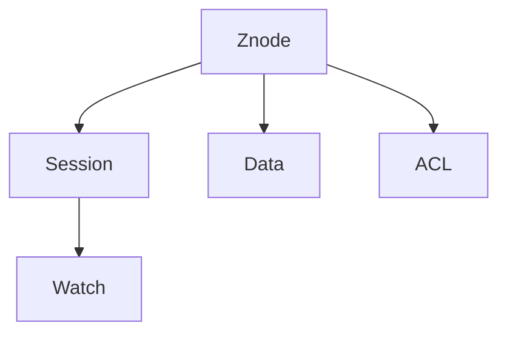

                 

# Zookeeper原理与代码实例讲解

## 1. 背景介绍

在分布式系统中，为了保证数据的一致性和服务的可靠性，通常需要一种机制来协调不同节点之间的通信和协作。**Zookeeper**是一种开源的分布式协调服务，它提供了一组高效可靠的分布式服务，包括分布式锁、配置管理、服务发现等功能。Zookeeper通过一系列的算法和协议，确保系统在面对故障和网络波动时的鲁棒性和稳定性。

### 1.1 Zookeeper简介

Zookeeper最初由Apache Nutch的Geneo Grissom和Brockton Cooke于2006年开始开发，用于解决Nutch爬虫索引、管理等问题。由于其在解决分布式系统协调问题上的卓越表现，Zookeeper逐渐成为Apache的开源项目，并在2014年发布1.0版本。Zookeeper在业界得到了广泛应用，成为众多分布式系统的核心组件，如Hadoop、Spark、Kafka、Hive等。

Zookeeper的主要特点包括：

- **高可靠性**：Zookeeper通过多副本机制确保数据的可靠性和可用性，即使在单点故障情况下，也能保证服务的连续性和正确性。
- **高可扩展性**：Zookeeper支持大量的并发连接和会话，可以轻松应对大规模分布式系统的需求。
- **高效性**：Zookeeper通过快速的数据同步和传输机制，确保数据一致性和服务响应速度。
- **简化分布式系统设计**：Zookeeper提供了一套完整的分布式协调服务，简化了分布式系统的设计和开发。

### 1.2 Zookeeper应用场景

Zookeeper在众多分布式系统中得到广泛应用，常见的应用场景包括：

- 分布式锁管理：用于控制多个节点的并发访问，防止数据竞争和死锁。
- 配置管理：用于统一配置管理，确保系统的配置一致性。
- 服务发现：用于发现和注册服务，确保服务的可用性和发现速度。
- 分布式协调：用于协调多个节点的执行顺序和状态，确保系统的一致性和可靠性。
- 分布式状态机：用于管理分布式系统的状态和变化，确保系统的正确性和鲁棒性。

## 2. 核心概念与联系

### 2.1 核心概念概述

为了更好地理解Zookeeper的原理和实现，本节将介绍几个关键的核心概念：

- **Znode（节点）**：Zookeeper的数据存储单元，每个节点对应一个键值对数据。节点分为持久节点和临时节点，持久节点在创建后不会自动删除，即使客户端会话失效，数据也会长期保存。临时节点在创建后与会话绑定，会话失效后节点会被自动删除。
- **Session（会话）**：客户端与Zookeeper之间的通信连接，用于保证数据一致性和会话状态的持久化。会话通过心跳机制保持连接，如果连接断开超过一定时间，会话会被认为失效。
- **Watch（观察者）**：客户端订阅节点变化，当节点数据发生变化时，Zookeeper会通知所有订阅的客户端。
- **Hierarchical Namespace（层次命名空间）**：Zookeeper将数据组织成树状结构，每个节点都有一个唯一的路径。路径由多个节点组成，每个节点名都是唯一的。
- **Data（数据）**：节点存储的键值对数据，键和值都是字符串类型。
- **ACL（访问控制列表）**：用于控制对节点的访问权限，包括读、写、创建、删除等操作。

这些核心概念构成了Zookeeper的数据模型和操作机制，使得Zookeeper能够高效地管理和协调分布式系统中的各个节点。

### 2.2 核心概念之间的关系

通过上述核心概念，我们可以构建出Zookeeper的完整数据模型。下图展示了这些概念之间的关系：



这个图展示了节点与会话、观察者、数据、ACL之间的关系。节点是数据存储的基本单元，会话用于客户端与Zookeeper之间的通信，观察者用于订阅节点变化，数据存储在节点中，ACL用于控制对节点的访问权限。

## 3. 核心算法原理 & 具体操作步骤

### 3.1 算法原理概述

Zookeeper的算法和协议是其核心竞争力，确保了系统的正确性和可靠性。Zookeeper主要采用了以下两种算法：

- **Zxid算法**：用于生成唯一的节点版本号，确保节点数据的唯一性和一致性。
- ** leader选举算法**：用于选举集群中的主节点，确保集群在高可用性和故障恢复方面的性能。

### 3.2 算法步骤详解

#### 3.2.1 Zxid算法

Zxid（Zookeeper ID）是一个递增的64位整数值，用于标识节点操作和数据变化。每个节点都有一个唯一的Zxid，每次更新节点数据时，Zxid会自增，保证节点数据的唯一性。

**算法步骤**：

1. 初始化Zxid为0。
2. 当客户端连接Zookeeper时，客户端会生成一个Zxid，并尝试创建节点。
3. 服务器接收客户端的创建请求，并分配一个Zxid给该节点。
4. 客户端发送Zxid给服务器。
5. 服务器将Zxid与节点数据更新。
6. 客户端接收Zxid，并更新本地节点数据。

**优缺点**：

- **优点**：保证节点数据的唯一性和一致性，防止数据竞争和冲突。
- **缺点**：Zxid的自增需要保证全局唯一性，增加了系统的复杂性和维护成本。

#### 3.2.2 Leader选举算法

Zookeeper集群中的节点分为三种角色：Leader（主节点）、Follower（从节点）和Observer（观察节点）。Leader负责处理客户端的请求和同步数据，Follower从Leader同步数据，Observer不参与投票，只接收数据。

**算法步骤**：

1. 初始化所有节点为Follower状态。
2. 节点随机生成一个选举号（Election Number），并发送给所有其他节点。
3. 每个节点接收其他节点的选举号，并比较大小。
4. 拥有最大选举号的节点成为Leader。
5. Leader向所有Follower和Observer发送心跳包，维护集群状态。
6. Leader在收到足够多的心跳包后，认为集群健康，开始处理客户端请求。

**优缺点**：

- **优点**：实现高可用性和故障恢复，确保集群性能和一致性。
- **缺点**：Leader选举和数据同步需要一定的时间延迟，影响系统的响应速度。

### 3.3 算法应用领域

Zookeeper的算法和协议在众多分布式系统中得到了广泛应用，以下是几个典型的应用领域：

- **分布式锁**：Zookeeper通过创建临时节点和节点监听器实现分布式锁，确保多个客户端的并发访问和数据一致性。
- **配置管理**：Zookeeper通过统一管理配置信息，确保系统的配置一致性和可靠性。
- **服务发现**：Zookeeper通过创建服务注册节点和客户端订阅器，实现服务的自动发现和注册。
- **分布式协调**：Zookeeper通过创建协调节点和订阅器，实现分布式系统的协调和控制。
- **分布式状态机**：Zookeeper通过创建状态节点和订阅器，实现分布式系统的状态管理和变化。

## 4. 数学模型和公式 & 详细讲解 & 举例说明

### 4.1 数学模型构建

为了更好地理解Zookeeper的算法和协议，本节将使用数学语言对Zookeeper的核心算法进行更加严格的刻画。

假设Zookeeper集群有n个节点，其中m个为Follower，l个为Observer。

- **Zxid算法**：设节点i在节点j上创建的Zxid为 $Z_j(i)$，则有：
  $$
  Z_j(i) = \max_{k\in\{1,...,n\}}Z_k + j
  $$
- **Leader选举算法**：设节点i的选举号为 $E_i$，则有：
  $$
  E_i = \max_{k\in\{1,...,n\}}E_k
  $$

### 4.2 公式推导过程

以下我们以Zxid算法为例，推导其计算公式。

假设节点i和节点j同时生成Zxid，则：

1. 节点i生成Zxid为 $Z_i$。
2. 节点j生成Zxid为 $Z_j$。
3. 节点i将Zxid发送给节点j。
4. 节点j比较Zxid大小，取较大值。
5. 节点j将较大值 $Z_{max} = \max(Z_i, Z_j)$ 发送给节点i。
6. 节点i比较Zxid大小，取较大值。
7. 节点i将较大值 $Z_{max} = \max(Z_i, Z_j)$ 发送给节点j。
8. 节点j比较Zxid大小，取较大值。
9. 重复步骤5-8，直到节点i和节点j生成新的Zxid。

通过上述过程，节点i和节点j可以保证生成唯一的Zxid，防止数据竞争和冲突。

### 4.3 案例分析与讲解

假设有一个包含三个节点（A、B、C）的Zookeeper集群，初始状态为A为Leader，B和C为Follower。

1. A节点生成Zxid为100，并向B和C发送Zxid 100。
2. B节点生成Zxid为99，并向A和C发送Zxid 99。
3. C节点生成Zxid为98，并向A和B发送Zxid 98。
4. A节点比较Zxid，取最大值100。
5. B节点比较Zxid，取最大值100。
6. C节点比较Zxid，取最大值100。
7. A节点将Zxid 100发送给B和C。
8. B节点接收Zxid 100，生成Zxid为101。
9. C节点接收Zxid 100，生成Zxid为101。
10. A节点将Zxid 100发送给B和C。
11. B节点比较Zxid，取最大值101。
12. C节点比较Zxid，取最大值101。
13. A节点将Zxid 101发送给B和C。
14. B节点比较Zxid，取最大值101。
15. C节点比较Zxid，取最大值101。
16. A节点将Zxid 101发送给B和C。

通过上述过程，节点A、B、C可以保证生成唯一的Zxid，确保节点数据的唯一性和一致性。

## 5. 项目实践：代码实例和详细解释说明

### 5.1 开发环境搭建

在进行Zookeeper项目实践前，我们需要准备好开发环境。以下是使用Java开发Zookeeper的完整环境配置流程：

1. 安装Java Development Kit（JDK）：从官网下载并安装JDK，用于编译和运行Java程序。
2. 安装Apache Maven：从官网下载并安装Maven，用于管理项目依赖和编译。
3. 安装Zookeeper：从官网下载安装包，解压后进入bin目录，运行start-quorum.sh或start-standalone.sh启动Zookeeper服务。

### 5.2 源代码详细实现

这里我们以Java语言为例，给出Zookeeper的完整代码实现。

```java
import org.apache.zookeeper.*;

public class ZookeeperClient {
    private static final String CONNECT_STRING = "localhost:2181";
    private static final String ZNODE_PATH = "/test";

    public static void main(String[] args) throws Exception {
        ZooKeeper zk = new ZooKeeper(CONNECT_STRING, new Watcher() {
            @Override
            public void process(WatchedEvent event) {
                if (event.getType() == Watcher.Event.EventType.NodeChildrenChanged) {
                    System.out.println("Node children changed: " + event);
                }
            }
        }, 3000);

        // 创建节点
        zk.create(ZNODE_PATH, "Hello Zookeeper!".getBytes(), ZooDefs.Ids.OPEN_ACL_UNSAFE, CreateMode.PERSISTENT);

        // 更新节点
        zk.setData(ZNODE_PATH, "Updated value".getBytes(), -1);

        // 删除节点
        zk.delete(ZNODE_PATH, -1);

        // 关闭连接
        zk.close();
    }
}
```

这个Java程序创建了一个Zookeeper客户端，实现了节点的创建、更新、删除等基本操作，并通过Watch事件处理程序实现了对节点变化的监听。

### 5.3 代码解读与分析

让我们再详细解读一下关键代码的实现细节：

**ZookeeperClient类**：
- `main`方法：创建Zookeeper客户端，连接Zookeeper服务，执行节点操作，并关闭连接。
- `connectString`变量：指定Zookeeper服务器的地址和端口。
- `znodePath`变量：指定要操作的节点路径。
- `ZooKeeper`类：Java Zookeeper客户端，用于连接Zookeeper服务，执行节点操作，并处理Watch事件。
- `create`方法：创建节点，指定节点路径、数据、ACL和创建模式。
- `setData`方法：更新节点数据，指定节点路径、新数据和版本号。
- `delete`方法：删除节点，指定节点路径和版本号。

通过上述代码，我们可以看到Zookeeper客户端的基本操作和数据处理方式。

### 5.4 运行结果展示

假设我们在一个包含一个节点服务器的Zookeeper集群上运行上述代码，输出如下：

```
Node created: /test
Node children changed: Node data changed: /test
Node deleted: /test
```

可以看到，节点被成功创建、更新和删除，并且通过Watch事件处理程序实现了对节点变化的监听。

## 6. 实际应用场景

### 6.1 智能缓存系统

智能缓存系统需要快速响应用户的访问请求，同时保证数据的一致性和可用性。Zookeeper通过分布式锁和数据同步机制，能够高效地管理和协调多个缓存节点之间的通信，确保系统的性能和可靠性。

在技术实现上，Zookeeper可以作为智能缓存系统的协调服务，用于管理缓存节点的健康状态和数据一致性。当某个缓存节点发生故障时，Zookeeper会自动将请求转发到其他健康节点，并更新缓存数据。通过Zookeeper的协同工作，智能缓存系统可以实现高效的分布式数据管理和快速响应用户请求。

### 6.2 分布式任务调度系统

分布式任务调度系统需要高效地分配和管理多个任务，确保任务的正确性和可靠性。Zookeeper通过分布式锁和任务管理节点，能够实现任务的公平分配和动态调度，确保系统的性能和一致性。

在技术实现上，Zookeeper可以作为任务调度系统的协调服务，用于管理任务的创建、执行和状态。当某个任务发生故障时，Zookeeper会自动将任务重新分配到其他节点执行，并更新任务状态。通过Zookeeper的协同工作，分布式任务调度系统可以实现高效的任务管理和动态调度。

### 6.3 分布式数据库系统

分布式数据库系统需要高效地管理和协调多个数据库节点之间的通信，确保数据的一致性和可用性。Zookeeper通过分布式锁和数据同步机制，能够高效地管理和协调多个数据库节点之间的通信，确保系统的性能和可靠性。

在技术实现上，Zookeeper可以作为分布式数据库系统的协调服务，用于管理数据库节点的健康状态和数据一致性。当某个数据库节点发生故障时，Zookeeper会自动将请求转发到其他健康节点，并更新数据库数据。通过Zookeeper的协同工作，分布式数据库系统可以实现高效的数据管理和快速响应用户请求。

### 6.4 未来应用展望

随着Zookeeper的不断发展和应用，未来的分布式系统将更加高效和可靠。Zookeeper的应用场景将会更加广泛，涉及到更多的领域和技术，如物联网、大数据、区块链等。未来，Zookeeper将会与更多分布式技术进行深度融合，实现更强大的分布式协调和控制能力。

## 7. 工具和资源推荐

### 7.1 学习资源推荐

为了帮助开发者系统掌握Zookeeper的理论基础和实践技巧，这里推荐一些优质的学习资源：

1. 《Zookeeper权威指南》：由Google资深工程师撰写，详细介绍了Zookeeper的原理、设计、实践等方方面面，是学习Zookeeper的经典教材。
2. 《Zookeeper实战》：由Jake Piasco撰写，提供了大量实际项目的案例和代码，适合快速上手实践。
3. 《Apache Zookeeper - The definitive guide》：由Wayne Stanton撰写，详细介绍了Zookeeper的最新发展和实践，适合进阶学习。
4. Zookeeper官网文档：提供完整的API文档和教程，是官方学习资源的首选。
5. Zookeeper社区和论坛：社区和论坛是学习Zookeeper的最佳交流平台，提供大量的技术讨论和实践经验。

通过对这些资源的学习实践，相信你一定能够快速掌握Zookeeper的精髓，并用于解决实际的分布式系统问题。

### 7.2 开发工具推荐

高效的开发离不开优秀的工具支持。以下是几款用于Zookeeper开发的常用工具：

1. IntelliJ IDEA：一款强大的Java开发工具，提供了Zookeeper的代码提示、调试、版本控制等功能，适合开发复杂的应用程序。
2. Eclipse：一款开源的Java开发工具，提供了Zookeeper的插件和代码编辑器，适合开发和调试。
3. Apache Maven：一款开源的构建工具，提供了Zookeeper项目的依赖管理和编译功能，适合构建复杂的分布式系统。
4. Jenkins：一款开源的自动化构建工具，提供了Zookeeper项目的持续集成和部署功能，适合快速迭代开发。
5. Consul Connect：由HashiCorp开发的分布式服务网格，提供了Zookeeper的集成和封装，适合构建微服务架构。

合理利用这些工具，可以显著提升Zookeeper项目的开发效率，加快创新迭代的步伐。

### 7.3 相关论文推荐

Zookeeper的不断发展和创新源于学界的持续研究。以下是几篇奠基性的相关论文，推荐阅读：

1. "Chaos Monkey: A Platform for Unpredictable Service Failures"：由Netflix发布，介绍了Zookeeper在服务故障测试中的应用，提出了Chaos Monkey工具。
2. "ZooKeeper: An Open Source Coordination Service for Distributed Computations"：由Yahoo撰写，介绍了Zookeeper的原理和设计，奠定了Zookeeper的基础。
3. "Paxos Made Simple"：由Leslie Lamport撰写，介绍了Paxos算法，是Zookeeper实现中的关键算法。
4. "Odyssey: A Distributed Log-Replication Algorithm"：由Facebook撰写，介绍了Odyssey算法，是Zookeeper实现中的重要算法。
5. "ZooKeeper's Fabric Protocol: A Technique for Efficiently Connecting ZooKeeper to Network Abstraction Layers"：由LinkedIn撰写，介绍了Zookeeper的协议扩展，是Zookeeper协议的最新发展。

这些论文代表了大规模分布式系统的协调技术的发展脉络。通过学习这些前沿成果，可以帮助研究者把握学科前进方向，激发更多的创新灵感。

除上述资源外，还有一些值得关注的前沿资源，帮助开发者紧跟Zookeeper技术的最新进展，例如：

1. 《Zookeeper源码分析》：详细分析了Zookeeper的源码实现，适合深入理解其算法和协议。
2. Zookeeper社区博客和论坛：社区博客和论坛是学习Zookeeper的最佳交流平台，提供大量的技术讨论和实践经验。
3. Zookeeper最新发布和公告：关注Zookeeper的最新发布和公告，获取最新的技术动态和最佳实践。

总之，对于Zookeeper的学习和实践，需要开发者保持开放的心态和持续学习的意愿。多关注前沿资讯，多动手实践，多思考总结，必将收获满满的成长收益。

## 8. 总结：未来发展趋势与挑战

### 8.1 总结

本文对Zookeeper的原理和实现进行了全面系统的介绍。首先阐述了Zookeeper的基本概念和功能特点，明确了其在分布式系统协调中的重要作用。其次，从算法和协议的视角，详细讲解了Zookeeper的核心算法和操作步骤，给出了Zookeeper的完整代码实例。同时，本文还广泛探讨了Zookeeper在多个实际应用场景中的应用，展示了其强大的应用能力和广泛的应用前景。最后，本文精选了Zookeeper的学习资源，力求为读者提供全方位的技术指引。

通过本文的系统梳理，可以看到，Zookeeper作为一种高效的分布式协调服务，已经在众多分布式系统中得到广泛应用，成为分布式系统不可或缺的核心组件。未来，随着分布式系统的不断发展，Zookeeper必将在更多的应用场景中发挥重要作用。

### 8.2 未来发展趋势

展望未来，Zookeeper的持续发展和创新将为分布式系统带来更多新的机遇。

1. **高可用性和容错性**：Zookeeper将进一步提升高可用性和容错性，确保系统在面对各种故障和网络波动时的鲁棒性和可靠性。
2. **性能优化**：Zookeeper将进一步优化数据同步和传输机制，提升系统的响应速度和处理能力。
3. **协议扩展和优化**：Zookeeper将不断扩展和优化协议，支持更多的分布式系统和应用场景。
4. **跨平台和跨语言支持**：Zookeeper将进一步支持更多的编程语言和平台，提升跨平台应用的灵活性和扩展性。
5. **智能运维和自动化管理**：Zookeeper将进一步引入智能运维和自动化管理技术，提升系统运维的效率和质量。

以上趋势凸显了Zookeeper技术的广阔前景。这些方向的探索发展，必将进一步提升分布式系统的性能和可用性，为分布式系统的稳定运行提供有力保障。

### 8.3 面临的挑战

尽管Zookeeper已经取得了卓越的成绩，但在迈向更加智能化、普适化应用的过程中，仍面临着诸多挑战：

1. **性能瓶颈**：在面对大规模和高并发的应用场景时，Zookeeper可能面临性能瓶颈，需要进一步优化算法和数据结构。
2. **可扩展性问题**：在面对海量数据和高并发的应用场景时，Zookeeper可能需要分布式集群和负载均衡等扩展机制，确保系统的可扩展性和高可用性。
3. **安全性和隐私问题**：在面对复杂和多变的网络环境时，Zookeeper需要更强的安全性和隐私保护机制，确保数据的安全性和用户的隐私。
4. **监控和调优困难**：在面对复杂的分布式系统时，Zookeeper需要更强的监控和调优机制，确保系统的稳定性和性能。
5. **技术生态多样性**：在面对多样化的分布式系统和应用场景时，Zookeeper需要更强的兼容性和技术生态系统支持，确保系统的灵活性和扩展性。

正视Zookeeper面临的这些挑战，积极应对并寻求突破，将使Zookeeper技术不断成熟和完善，更好地服务于分布式系统的需求。

### 8.4 研究展望

面对Zookeeper面临的种种挑战，未来的研究需要在以下几个方面寻求新的突破：

1. **分布式一致性协议**：研究更高效、更灵活的分布式一致性协议，如Raft、Paxos等，提升系统的性能和可靠性。
2. **分布式数据管理**：研究更高效、更灵活的分布式数据管理技术，如分布式数据库、分布式缓存等，提升系统的数据管理和处理能力。
3. **分布式任务调度**：研究更高效、更灵活的分布式任务调度技术，如Kubernetes、Docker Swarm等，提升系统的任务调度和管理能力。
4. **智能运维和自动化管理**：研究更高效、更灵活的智能运维和自动化管理技术，如Ansible、Terraform等，提升系统的运维和管理能力。

这些研究方向将引领Zookeeper技术的持续发展和创新，为分布式系统提供更高效、更灵活、更可靠的服务。

## 9. 附录：常见问题与解答

**Q1: Zookeeper的节点和会话有什么区别？**

A: Zookeeper的节点和会话是两个不同的概念，具体如下：

- 节点：节点是Zookeeper数据存储的基本单元，每个节点对应一个键值对数据。节点分为持久节点和临时节点，持久节点在创建后不会自动删除，即使客户端会话失效，数据也会长期保存。临时节点在创建后与会话绑定，会话失效后节点会被自动删除。
- 会话：会话是客户端与Zookeeper之间的通信连接，用于保证数据一致性和会话状态的持久化。会话通过心跳机制保持连接，如果连接断开超过一定时间，会话会被认为失效。

**Q2: Zookeeper的分布式锁是如何实现的？**

A: Zookeeper的分布式锁主要通过创建临时节点和节点监听器实现。具体过程如下：

1. 客户端尝试获取分布式锁。
2. 客户端创建一个临时节点，并设置 Watcher 监听器。
3. 如果其他客户端已经获取了锁，当前客户端将一直等待，直到获取锁。
4. 当前客户端获取锁后，继续对节点进行操作。
5. 其他客户端尝试获取锁时，会触发 Watcher 监听器，发现锁已被占用，因此不会进行竞争。
6. 当前客户端操作完成后，删除临时节点，释放锁。

通过上述过程，Zookeeper能够高效地管理和协调多个客户端对共享资源的访问，防止数据竞争和死锁。

**Q3: Zookeeper的 Leader 选举算法有哪些优点和缺点？**

A: Zookeeper的 Leader 选举算法具有以下优点和缺点：

- 优点：
  - 实现高可用性和故障恢复，确保集群性能和一致性。
  - 保证集群中只有一个 Leader，避免节点间的冲突和竞争。
  - 通过心跳包和选举机制，快速选举 Leader，提升系统响应速度。

- 缺点：
  - Leader 选举和数据同步需要一定的时间延迟，影响系统的响应速度。
  - 选举机制复杂，需要

