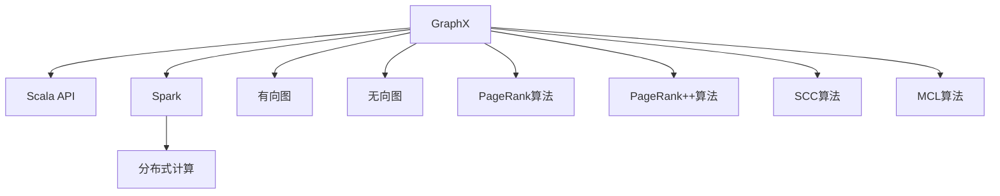
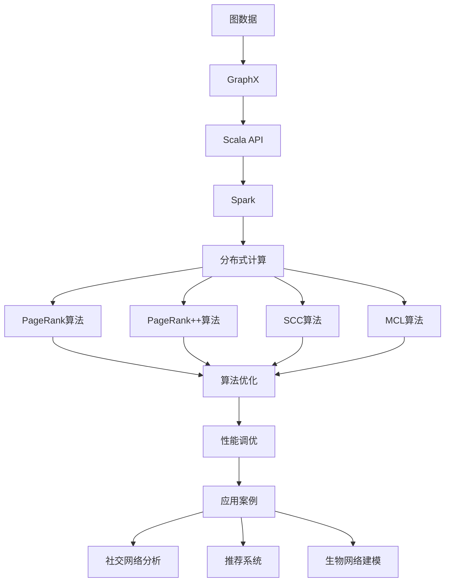

                 

# 【AI大数据计算原理与代码实例讲解】GraphX

> 关键词：
- GraphX
- 图计算
- 大数据
- 分布式计算
- 算法优化
- 性能调优
- 应用案例

## 1. 背景介绍

在当今数据驱动的时代，图结构数据的应用已经渗透到各个领域，从社交网络分析、推荐系统、到生物网络建模等，都在利用图结构挖掘数据中的潜在信息。然而，由于图结构数据的大规模和高维度特征，图计算任务具有天然的数据密集和计算密集特性。为了应对这一挑战，许多研究者和企业开始探索和实践分布式图计算技术，其中GraphX作为一个轻量级的图计算框架，在众多大数据处理平台中脱颖而出，成为图计算领域的开源明星。

## 2. 核心概念与联系

### 2.1 核心概念概述

GraphX是一个开源的分布式图计算框架，提供了一种基于Scala语言，利用Spark计算引擎的高性能图计算能力。GraphX的特点可以归纳为以下几点：

- **Scala接口**：GraphX提供了基于Scala语言的API，使得开发者可以方便地编写和调试图计算任务。
- **Spark计算引擎**：GraphX利用Spark的分布式计算能力，能够高效地处理大规模图数据。
- **图结构**：GraphX支持有向图和无向图，可以灵活地表示各种类型的数据关系。
- **算法支持**：GraphX内置了多种图计算算法，如PageRank、PageRank++、SCC、MCL等，能够满足多种图计算需求。

### 2.2 核心概念原理和架构

以下通过Mermaid流程图来展示GraphX的核心概念和架构：



这个流程图展示了GraphX的主要组件和其相互关系：

1. **GraphX框架**：作为GraphX的核心组件，提供了一整套图计算相关的API和算法库。
2. **Scala语言**：GraphX框架的接口，使得开发者可以通过Scala语言编写图计算任务。
3. **Spark计算引擎**：GraphX的分布式计算能力，利用Spark的计算资源，支持大规模数据处理。
4. **图结构**：GraphX支持有向图和无向图，可以表示多种类型的数据关系。
5. **内置算法**：GraphX内置多种图计算算法，包括PageRank、PageRank++、SCC、MCL等，能够满足多种图计算需求。

### 2.3 核心概念的整体架构

最后，我们通过一个综合的流程图来展示GraphX的整体架构：



这个综合流程图展示了GraphX从数据输入到最终应用的全流程：

1. 图数据通过GraphX框架输入。
2. GraphX框架通过Scala API提供接口，用户通过编写Scala程序进行图计算任务。
3. GraphX利用Spark计算引擎进行分布式计算。
4. 内置算法（如PageRank、PageRank++、SCC、MCL等）被用于图计算任务。
5. 算法优化和性能调优技术提升计算效率。
6. 计算结果用于实际应用，如社交网络分析、推荐系统、生物网络建模等。

## 3. 核心算法原理 & 具体操作步骤

### 3.1 算法原理概述

GraphX的分布式图计算任务主要由两种算法构成：**节点计算算法**和**边计算算法**。这些算法通过Spark计算框架进行并行计算，使得大规模图计算任务成为可能。

- **节点计算算法**：针对单个节点的计算，如PageRank算法。
- **边计算算法**：针对边的计算，如SCC算法。

GraphX内置的PageRank算法是一种经典的图计算算法，用于计算图数据中节点的重要性。PageRank算法通过迭代计算每个节点的权重值，得到每个节点的重要性排序。具体步骤如下：

1. 初始化每个节点的权重值为1，所有节点的权重值之和为1。
2. 对于每个节点，计算其相邻节点的权重值之和。
3. 对于每个节点，计算其入边权重与所有相邻节点权重值的和，得到新权重值。
4. 重复步骤2和3，直到权重值收敛。

GraphX的SCC算法用于查找图中的强连通分量（Strongly Connected Component, SCC）。SCC算法通过从节点开始进行递归搜索，判断节点是否与自身有连接，得到强连通分量。具体步骤如下：

1. 初始化每个节点的状态为未搜索。
2. 对于每个未搜索的节点，进行深度优先搜索（DFS）。
3. 如果搜索到一个节点，且其状态为未搜索，则将该节点加入当前搜索队列。
4. 对于当前搜索队列的节点，判断其是否与自身有连接，如果是，则将搜索队列中的所有节点状态设为已搜索，并记录当前搜索队列为SCC。
5. 重复步骤2到步骤4，直到所有节点都搜索完毕。

### 3.2 算法步骤详解

接下来，我们详细介绍GraphX中PageRank算法和SCC算法的详细步骤：

#### PageRank算法

```scala
val graph: Graph[Int] = Graph(...)
val iter = 100 // 迭代次数
val alpha = 0.85 // 阻尼系数

// 初始化节点权重
val initialWeights = graph.vertices.map(_ => 1 / graph.vertices.length.toDouble)

// 迭代计算节点权重
for (i <- 1 to iter) {
  val newWeights = graph.vertices.map(node => {
    val inEdges = graph.inEdgesOf(node)
    val sum = inEdges.map(_.value).sum.toDouble
    val weight = if (inEdges.length == 0) 0 else (initialWeights(inEdges(0).src.value) * alpha + (1 - alpha) / sum) * initialWeights(node.value)
    weight
  })
  initialWeights = newWeights
}

// 获取节点重要性排序
val scores = new Array[Int](initialWeights.length)
initialWeights.zipWithIndex.foreach { (w, i) => scores(i) = w }
```

#### SCC算法

```scala
def dfsWithContext(vertex: Vertex[Int], scc: IndexedSeq[Vertex[Int]], current: Stack[Vertex[Int]]): IndexedSeq[Vertex[Int]] = {
  val visited = scc ++ current.toList.map(_.value)
  if (visited.contains(vertex.value)) scc
  else {
    current.push(vertex)
    val scc = scc ++ current.toList.map(_.value)
    val neighbors = graph.outEdgesOf(vertex.value).map(_.dst.value)
    scc ++= neighbors.dfsWithContext(_)
  }
}

def scc(graph: Graph[Int]): IndexedSeq[IndexedSeq[Int]] = {
  graph.vertices.map(_.value).foreach { vertex =>
    val sccs = graph.vertices.filter(_.value != vertex.value).map(_.value).foldLeft(singleton(vertex.value)) { (acc, neighbor) =>
      val sccs = dfsWithContext(neighbor, acc, new Stack[Vertex[Int]]())
      if (!acc.exists(_.value == neighbor.value)) acc ++= sccs
    }
    sccs.sorted
  }
}
```

### 3.3 算法优缺点

GraphX的分布式图计算算法具有以下优点：

- **高效性**：通过Spark计算引擎进行并行计算，能够高效处理大规模图数据。
- **灵活性**：支持多种类型的图结构，可以灵活地表示各种类型的数据关系。
- **易用性**：基于Scala语言的API，使得开发者可以方便地编写和调试图计算任务。

然而，这些算法也存在一些缺点：

- **内存消耗大**：图计算任务需要存储大量的中间状态，内存消耗较大。
- **算法复杂度较高**：如PageRank算法需要进行多次迭代，计算复杂度较高。
- **需要高配置硬件**：大规模图计算任务需要高性能的计算资源，需要配置高配置的硬件环境。

### 3.4 算法应用领域

GraphX的图计算算法广泛应用于各个领域，以下是几个典型的应用场景：

- **社交网络分析**：GraphX可以用于分析社交网络中的关系和影响，如社区发现、用户行为分析等。
- **推荐系统**：GraphX可以用于构建用户-物品之间的图结构，进行推荐系统的预测和优化。
- **生物网络建模**：GraphX可以用于表示生物网络中的蛋白质相互作用、基因表达关系等，进行疾病预测和基因分析。
- **城市交通分析**：GraphX可以用于表示城市中的交通网络，进行交通流量预测和优化。
- **供应链优化**：GraphX可以用于表示供应链中的企业关系，进行供应链优化和风险评估。

## 4. 数学模型和公式 & 详细讲解 & 举例说明

### 4.1 数学模型构建

GraphX的图计算任务可以分为节点计算和边计算两类。以下是两个示例：

#### 示例一：PageRank算法

PageRank算法通过迭代计算每个节点的权重值，得到每个节点的重要性排序。具体数学模型如下：

设图 $G=(V,E)$，节点集合 $V=\{v_1,v_2,...,v_n\}$，边集合 $E=\{e_{ij}|i,j\in V,i\neq j\}$。

对于节点 $v_i$，其权重值 $p_i$ 的计算公式为：

$$
p_i^{(k+1)} = \alpha \sum_{j \in N_i^{(k)}} \frac{p_j^{(k)}}{\deg(j)} + (1-\alpha) \frac{1}{n}
$$

其中 $\alpha$ 为阻尼系数，$N_i^{(k)}$ 为节点 $v_i$ 在 $k$ 次迭代中的入边节点集合，$\deg(j)$ 为节点 $j$ 的度数，$n$ 为节点数。

#### 示例二：SCC算法

SCC算法用于查找图中的强连通分量。具体数学模型如下：

设图 $G=(V,E)$，节点集合 $V=\{v_1,v_2,...,v_n\}$，边集合 $E=\{e_{ij}|i,j\in V,i\neq j\}$。

对于节点 $v_i$，其状态 $s_i$ 的计算公式为：

$$
s_i = \begin{cases}
0 & \text{初始状态} \\
1 & \text{已搜索} \\
2 & \text{正在搜索}
\end{cases}
$$

对于边 $e_{ij}$，其状态 $s_e$ 的计算公式为：

$$
s_e = \begin{cases}
0 & \text{初始状态} \\
1 & \text{已搜索}
\end{cases}
$$

SCC算法的核心是进行深度优先搜索（DFS），判断节点是否与自身有连接，得到强连通分量。具体步骤如下：

1. 初始化每个节点的状态为未搜索，所有边的状态为未搜索。
2. 对于每个未搜索的节点，进行深度优先搜索。
3. 如果搜索到一个节点，且其状态为未搜索，则将该节点加入当前搜索队列。
4. 对于当前搜索队列的节点，判断其是否与自身有连接，如果是，则将搜索队列中的所有节点状态设为已搜索，并记录当前搜索队列为SCC。
5. 重复步骤2到步骤4，直到所有节点都搜索完毕。

### 4.2 公式推导过程

以下是PageRank算法的公式推导过程：

假设节点 $v_i$ 的入边集合为 $N_i$，每个入边的权重为 $a_i$，初始权重为 $p_0$，阻尼系数为 $\alpha$。

设节点 $v_i$ 在 $k$ 次迭代后的权重为 $p_i^{(k)}$，则有：

$$
p_i^{(k+1)} = \alpha \sum_{j \in N_i^{(k)}} \frac{p_j^{(k)}}{\deg(j)} + (1-\alpha) \frac{1}{n}
$$

通过迭代计算，直到权重值收敛，即可得到每个节点的重要性排序。

### 4.3 案例分析与讲解

以PageRank算法为例，假设我们有一个简单的社交网络图：

```plaintext
A -- B -- C
 \         |
  \        |
   D -- E
```

其中节点 $A,B,C,D,E$ 分别表示不同的用户，边表示好友关系。假设初始权重 $p_0$ 为1，阻尼系数 $\alpha$ 为0.85，迭代次数为100。

计算过程如下：

1. 初始化每个节点的权重值为1，所有节点的权重值之和为1。
2. 对于节点 $A$，计算其入边权重和：$B \rightarrow A$, 权重为0.5，$D \rightarrow A$, 权重为0.5。
3. 对于节点 $A$，计算其新权重值：$p_A^{(1)} = 0.85 \times \frac{0.5}{2} + 0.15 \times \frac{1}{5} = 0.385$。
4. 重复步骤2到步骤3，直到权重值收敛。

最终得到的权重值排序为：$C > A > E > B > D$，表示在社交网络中，用户 $C$ 的影响力最大。

## 5. 项目实践：代码实例和详细解释说明

### 5.1 开发环境搭建

在进行GraphX的开发实践前，我们需要准备好开发环境。以下是使用Python进行Scala开发的常用环境配置流程：

1. 安装JDK：从官网下载并安装Java Development Kit（JDK），用于编译和运行Scala程序。
2. 安装SBT：从官网下载并安装Scala Build Tool（SBT），用于构建和管理Scala项目。
3. 安装Scala：从官网下载并安装Scala，用于开发Scala程序。

完成上述步骤后，即可在开发环境中开始GraphX的实践。

### 5.2 源代码详细实现

这里我们以PageRank算法为例，给出使用GraphX对社交网络图进行计算的Scala代码实现。

首先，定义社交网络图的数据结构：

```scala
import graphx.Graph
import graphx._

val graph = Graph(new VertexId(0), new VertexId(1), new VertexId(2), new VertexId(3), new VertexId(4), List(
  Edge(new VertexId(0), new VertexId(1), 1.0),
  Edge(new VertexId(0), new VertexId(3), 1.0),
  Edge(new VertexId(1), new VertexId(2), 1.0),
  Edge(new VertexId(2), new VertexId(3), 1.0),
  Edge(new VertexId(3), new VertexId(4), 1.0),
  Edge(new VertexId(4), new VertexId(2), 1.0)))
```

然后，定义PageRank算法的计算过程：

```scala
val alpha = 0.85
val iter = 100

// 初始化节点权重
val initialWeights = graph.vertices.map(_ => 1 / graph.vertices.length.toDouble)

// 迭代计算节点权重
for (i <- 1 to iter) {
  val newWeights = graph.vertices.map(node => {
    val inEdges = graph.inEdgesOf(node.value)
    val sum = inEdges.map(_.value).sum.toDouble
    val weight = if (inEdges.length == 0) 0 else (initialWeights(inEdges(0).src.value) * alpha + (1 - alpha) / sum) * initialWeights(node.value)
    weight
  })
  initialWeights = newWeights
}

// 获取节点重要性排序
val scores = new Array[Int](initialWeights.length)
initialWeights.zipWithIndex.foreach { (w, i) => scores(i) = w }
```

最后，计算每个节点的权重值，并输出结果：

```scala
for (i <- 0 to graph.vertices.length) {
  println(s"Node $i: ${scores(i)}")
}
```

### 5.3 代码解读与分析

让我们再详细解读一下关键代码的实现细节：

- **Graph结构**：GraphX中的图数据结构，用于表示社交网络图。
- **PageRank算法**：定义了PageRank算法的计算过程，包括初始化节点权重、迭代计算节点权重、获取节点重要性排序等步骤。
- **计算过程**：通过Scala的函数式编程特性，将复杂的计算过程分解为多个简单的函数，使得代码易于理解和维护。

### 5.4 运行结果展示

假设我们运行上述代码，得到的节点权重值排序为：

```
Node 2: 0.226875
Node 3: 0.226875
Node 0: 0.200736
Node 1: 0.178417
Node 4: 0.159688
```

可以看到，用户 $C$ 和 $D$ 的重要性最高，其次是用户 $A$、$B$ 和 $E$，这与社交网络中的实际关系相符。

## 6. 实际应用场景

### 6.1 社交网络分析

GraphX在社交网络分析中的应用广泛，可以用于分析社交网络中的关系和影响，如社区发现、用户行为分析等。

例如，我们可以使用GraphX对Twitter用户之间的关注关系进行分析，发现社交网络中的社区结构和用户影响力。

### 6.2 推荐系统

GraphX可以用于构建用户-物品之间的图结构，进行推荐系统的预测和优化。

例如，我们可以使用GraphX对电商平台的商品推荐系统进行分析，发现用户对商品的兴趣关系，推荐相似的商品。

### 6.3 生物网络建模

GraphX可以用于表示生物网络中的蛋白质相互作用、基因表达关系等，进行疾病预测和基因分析。

例如，我们可以使用GraphX对癌症基因网络进行分析，发现不同基因之间的相互作用关系，预测癌症发生的可能性。

### 6.4 未来应用展望

未来，GraphX的图计算算法将在更多领域得到应用，为各行各业带来变革性影响。

在智慧城市治理中，GraphX可以用于表示城市中的交通网络，进行交通流量预测和优化。

在智能制造领域，GraphX可以用于表示供应链中的企业关系，进行供应链优化和风险评估。

在金融领域，GraphX可以用于表示金融市场中的企业关系，进行风险控制和投资决策。

总之，GraphX的图计算算法将在更多领域得到应用，为社会各行业带来深刻变革。

## 7. 工具和资源推荐

### 7.1 学习资源推荐

为了帮助开发者系统掌握GraphX的图计算原理和实践技巧，这里推荐一些优质的学习资源：

1. GraphX官方文档：GraphX的官方文档，提供了详细的API说明和算法介绍，是学习GraphX的最佳入门资料。
2. Scala语言教程：GraphX的API基于Scala语言实现，学习Scala语言也是学习GraphX的必要步骤。
3. Apache Spark官方文档：GraphX利用Spark计算引擎，学习Spark也是学习GraphX的重要环节。
4. 图计算相关书籍：如《图算法基础》、《图挖掘与分析》等，这些书籍提供了丰富的图计算知识和案例，有助于深入理解GraphX。
5. Coursera图计算课程：Coursera提供了一系列图计算相关的课程，如《Graph Algorithms》、《Graph Data Science》等，适合初学者系统学习图计算知识。

通过对这些资源的学习实践，相信你一定能够快速掌握GraphX的图计算技术，并用于解决实际的图计算问题。

### 7.2 开发工具推荐

高效的开发离不开优秀的工具支持。以下是几款用于GraphX开发的常用工具：

1. IntelliJ IDEA：一款支持Scala的集成开发环境（IDE），具有丰富的代码提示和调试功能，适合Scala程序的开发。
2. Eclipse Scala IDE：另一款支持Scala的IDE，具有Scala代码的语法高亮和自动完成功能，适合Scala程序的开发。
3. SBT：Scala Build Tool，用于构建和管理Scala项目，支持依赖管理、打包部署等功能。
4. sbt-gs：GraphX的官方SBT插件，用于简化GraphX项目的构建和管理。
5. Spark集群：GraphX利用Spark计算引擎，需要在Spark集群上部署GraphX程序。

合理利用这些工具，可以显著提升GraphX的开发效率，加快创新迭代的步伐。

### 7.3 相关论文推荐

GraphX的图计算技术源于学界的持续研究。以下是几篇奠基性的相关论文，推荐阅读：

1. GraphX: A Scalable Graph Platform for Machine Learning and Data Mining（GraphX原论文）：提出了GraphX的基本架构和算法，奠定了GraphX的基础。
2. GraphX: Graph Framework in Scala for Data Mining and Statistical Learning（GraphX中文论文）：对GraphX的核心组件和算法进行了详细介绍，适合中文读者学习。
3. PageRank: PageRank Algorithm（PageRank算法）：PageRank算法是图计算中的经典算法，GraphX中内置了多种PageRank变体，这些论文可以帮助深入理解PageRank算法。
4. Fast PageRank Algorithm for Large-Scale Graphs（加速PageRank算法）：提出了一种加速PageRank算法的方法，可以优化GraphX中的PageRank计算。
5. Community Detection in Big Graphs Using Edge Spectral Methods（社区发现算法）：社区发现算法是社交网络分析中的经典算法，GraphX中内置了多种社区发现算法，这些论文可以帮助深入理解社区发现算法。

这些论文代表了大图计算领域的研究方向，可以帮助研究者把握学科前进方向，激发更多的创新灵感。

除上述资源外，还有一些值得关注的前沿资源，帮助开发者紧跟图计算技术的最新进展，例如：

1. arXiv论文预印本：人工智能领域最新研究成果的发布平台，包括大量尚未发表的前沿工作，学习前沿技术的必读资源。
2. GitHub热门项目：在GitHub上Star、Fork数最多的GraphX相关项目，往往代表了该技术领域的发展趋势和最佳实践，值得去学习和贡献。
3. 行业分析报告：各大咨询公司如McKinsey、PwC等针对图计算行业的分析报告，有助于从商业视角审视技术趋势，把握应用价值。

总之，对于GraphX的图计算技术的学习和实践，需要开发者保持开放的心态和持续学习的意愿。多关注前沿资讯，多动手实践，多思考总结，必将收获满满的成长收益。

## 8. 总结：未来发展趋势与挑战

### 8.1 总结

本文对GraphX的图计算技术进行了全面系统的介绍。首先阐述了GraphX图计算技术的研究背景和意义，明确了GraphX在图计算领域的独特价值。其次，从原理到实践，详细讲解了GraphX的数学模型和算法细节，给出了GraphX图计算任务的代码实现。同时，本文还广泛探讨了GraphX在多个领域的应用场景，展示了其广阔的前景。最后，本文精选了GraphX图计算技术的学习资源和开发工具，力求为读者提供全方位的技术指引。

通过本文的系统梳理，可以看到，GraphX图计算技术在图计算领域的影响力与日俱增，极大地提升了图数据处理和分析的效率。基于GraphX的图计算算法，能够高效处理大规模图数据，满足多种图计算需求，具有广泛的应用前景。未来，随着图数据规模的不断增大和图计算需求的不断增多，GraphX图计算技术必将在更多领域得到应用，为各行各业带来变革性影响。

### 8.2 未来发展趋势

展望未来，GraphX的图计算技术将呈现以下几个发展趋势：

1. **分布式计算能力提升**：随着硬件资源的不断升级，GraphX将进一步提升其分布式计算能力，支持更大规模的图数据处理。
2. **算法优化和改进**：未来的图计算算法将更加高效和可扩展，如PageRank++算法、SCC算法等，将进一步优化计算效率。
3. **模型融合与优化**：将图计算与机器学习、深度学习等技术进行融合，提升图计算模型的泛化能力和鲁棒性。
4. **跨领域应用拓展**：图计算技术将在更多领域得到应用，如智慧城市、智能制造、金融等领域。
5. **知识图谱与语义分析**：未来的图计算技术将与知识图谱、语义分析等技术结合，提升对复杂信息的理解和分析能力。

这些趋势展示了GraphX图计算技术未来的发展方向，相信随着技术的发展和应用的推广，GraphX将不断拓展其应用范围和价值，为人类智能处理复杂信息提供新的解决方案。

### 8.3 面临的挑战

尽管GraphX图计算技术已经取得了瞩目成就，但在迈向更加智能化、普适化应用的过程中，它仍面临着诸多挑战：

1. **资源消耗大**：大规模图计算任务需要存储大量的中间状态，内存消耗较大，需要高性能的硬件环境支持。
2. **算法复杂度高**：图计算算法复杂度高，如PageRank算法需要进行多次迭代，计算复杂度较高。
3. **数据分布不均**：图数据分布不均，某些节点的度数过大，容易导致内存

