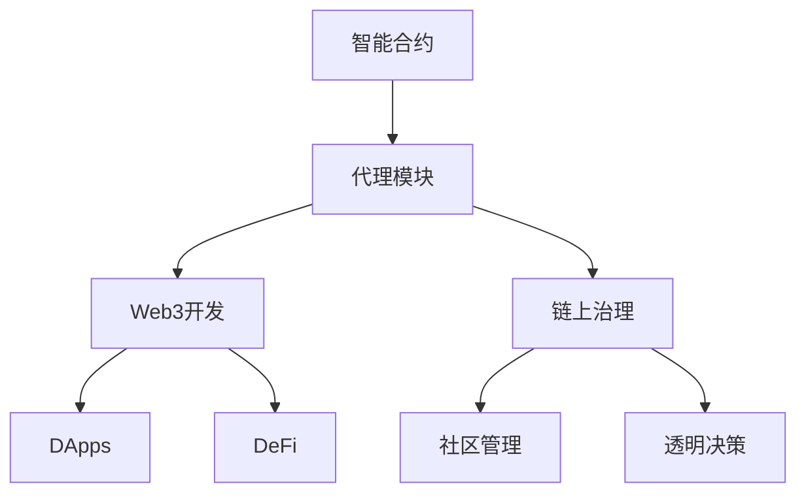

                 

# 【LangChain编程：从入门到实践】代理模块

> 关键词：
- LangChain
- 代理模块
- 智能合约
- 链上治理
- Web3开发

## 1. 背景介绍

在Web3的浪潮下，智能合约和去中心化应用（DApps）正在成为构建未来网络的新基础设施。这些智能合约不仅可以实现自动化的业务逻辑执行，还能够在区块链上形成复杂的治理结构，推动去中心化的社区管理与协作。然而，传统的智能合约开发存在许多问题，如复杂度极高、代码审核难度大、治理效率低等。为了解决这些问题，LangChain作为Web3开发中的新范式，结合了智能合约和代理模块的创新理念，旨在构建更为灵活、高效、透明的Web3应用。

### 1.1 背景概述

Web3的崛起正重新定义互联网的形态和未来价值创造方式。智能合约作为Web3的基础设施，为去中心化应用（DApps）提供了高效的自动化执行能力。然而，传统的智能合约开发面临诸多挑战，如代码复杂度高、审核难度大、治理效率低等。为了克服这些问题，LangChain提出了一种基于代理模块的智能合约开发与治理范式，旨在构建更为灵活、高效、透明的Web3应用。

代理模块是一种可配置、可重用的智能合约组件，可以封装复杂的业务逻辑，并提供灵活的治理机制。它通过代理机制，使得智能合约的功能、权限、治理等可以动态调整，极大地提高了智能合约的开发效率与治理灵活性。

## 2. 核心概念与联系

### 2.1 核心概念概述

为了更深入理解代理模块的原理与架构，我们需要先掌握一些关键概念：

- **智能合约**：是一段可执行的代码，通过区块链网络自动执行预先定义的业务规则。智能合约的执行结果具有不可篡改的特性。
- **代理模块**：是一种可配置、可重用的智能合约组件，封装复杂的业务逻辑，并提供灵活的治理机制。
- **Web3开发**：基于区块链技术的网络开发，包括智能合约、DApps、DeFi（去中心化金融）等应用。
- **链上治理**：指通过智能合约实现社区的民主化管理，如投票、提案、奖励机制等，形成更为透明、高效的去中心化决策机制。

这些概念之间存在紧密联系，构成Web3开发的基础架构。智能合约是Web3的核心执行单元，而代理模块则是智能合约的高级封装，提供更灵活、更高效的开发与治理能力。

### 2.2 核心概念间的关系

我们可以通过以下Mermaid流程图来展示核心概念之间的联系：



这个流程图展示了智能合约、代理模块、Web3开发、链上治理以及DApps和DeFi等关键概念之间的关系。代理模块是智能合约的高级封装，可以更灵活地实现Web3开发中的复杂功能。同时，代理模块还提供了链上治理机制，帮助社区进行民主化管理，形成透明、高效的决策机制。

## 3. 核心算法原理 & 具体操作步骤
### 3.1 算法原理概述

代理模块的核心原理是利用智能合约的代理机制，将复杂的业务逻辑封装为可重用的组件，并通过灵活的治理机制，动态调整其行为。其基本思路如下：

1. **封装复杂逻辑**：将复杂的业务逻辑封装为代理模块，通过智能合约的代理机制，实现其自动化执行。
2. **提供治理机制**：代理模块内部实现灵活的治理机制，如投票、提案、奖励等，允许社区成员通过智能合约进行民主化管理。
3. **动态调整行为**：根据社区的投票或提案结果，动态调整代理模块的行为和权限，确保其行为符合社区的期望和规则。

### 3.2 算法步骤详解

以下是基于代理模块的智能合约开发与治理的具体操作步骤：

1. **定义代理模块**：根据业务需求，设计代理模块的功能和接口，确保其行为符合预期。

2. **编写智能合约**：使用Solidity或其他智能合约编程语言，编写智能合约代码，实现代理模块的封装和调用。

3. **实现治理机制**：在代理模块中实现灵活的治理机制，如投票、提案、奖励等，允许社区成员通过智能合约进行民主化管理。

4. **部署智能合约**：将编写的智能合约部署到区块链网络，并进行测试。

5. **启动代理模块**：通过智能合约调用，启动代理模块，使其开始执行预设的业务逻辑。

6. **动态调整行为**：根据社区的投票或提案结果，动态调整代理模块的行为和权限，确保其行为符合社区的期望和规则。

### 3.3 算法优缺点

代理模块作为一种智能合约的高级封装，具有以下优点：

- **提高开发效率**：代理模块可以封装复杂的业务逻辑，大大降低了智能合约的开发难度和复杂度。
- **增强治理灵活性**：通过灵活的治理机制，代理模块可以根据社区的意愿和规则动态调整其行为，提高治理的透明度和效率。
- **提高代码复用性**：代理模块可以封装为可重用的组件，提高代码复用性，减少重复开发。

然而，代理模块也存在一些缺点：

- **开发成本较高**：代理模块的设计和实现需要较高的技术水平和投入，对于初学者可能存在一定的门槛。
- **治理复杂性**：代理模块的治理机制设计需要考虑各种复杂的因素，如权限管理、投票机制、激励机制等，增加了设计和实现的复杂度。
- **代码审核难度大**：代理模块的封装复杂度较高，代码审核和调试难度较大，容易出现潜在的安全漏洞。

### 3.4 算法应用领域

代理模块作为一种智能合约的高级封装，可以广泛应用于以下领域：

- **DeFi协议**：在DeFi协议中，代理模块可以封装复杂的金融逻辑，如自动执行、去中心化清算等，提高协议的安全性和灵活性。
- **NFT平台**：在NFT平台中，代理模块可以封装元数据的存储和查询逻辑，并提供灵活的治理机制，实现社区管理。
- **DApp治理**：在DApp治理中，代理模块可以封装社区投票、提案、奖励等治理机制，提升DApp的透明性和社区参与度。
- **智能合约审计**：在智能合约审计中，代理模块可以封装复杂的业务逻辑，并通过灵活的治理机制，提供可配置的审计工具，帮助开发者进行智能合约的测试和优化。

## 4. 数学模型和公式 & 详细讲解  
### 4.1 数学模型构建

为了更好地理解代理模块的开发与治理流程，我们首先构建数学模型进行详细讲解。

假设智能合约为 $C$，代理模块为 $P$，社区投票结果为 $V$，社区提案结果为 $Q$。代理模块的初始行为为 $A_0$，根据社区投票和提案结果，代理模块的行为调整为 $A_1$。代理模块的治理机制可以表示为以下数学模型：

$$
A_{n+1} = f(A_n, V_n, Q_n)
$$

其中 $f$ 表示治理机制的函数，$V_n$ 和 $Q_n$ 分别表示第 $n$ 轮的社区投票和提案结果。$A_{n+1}$ 表示调整后的行为。

### 4.2 公式推导过程

以DeFi协议中的自动执行函数为例，我们推导其数学模型：

假设代理模块封装了自动执行函数 $f$，其中 $f$ 的输入参数为订单信息 $O$，执行条件为 $C$。代理模块的行为可以表示为：

$$
A_{n+1} = f(O, C)
$$

社区投票结果 $V_n$ 可以表示为：

$$
V_n = \sum_{i=1}^k V_{ni}
$$

其中 $k$ 表示投票人数，$V_{ni}$ 表示第 $i$ 个投票者的投票结果。社区提案 $Q_n$ 可以表示为：

$$
Q_n = \bigoplus_{i=1}^k Q_{ni}
$$

其中 $\oplus$ 表示逻辑或运算，$k$ 表示提案人数，$Q_{ni}$ 表示第 $i$ 个提案者的提案结果。

根据社区投票和提案结果，代理模块的行为调整为：

$$
A_{n+1} = f(O, C \vee V_n \vee Q_n)
$$

其中 $\vee$ 表示逻辑或运算，$C \vee V_n \vee Q_n$ 表示社区投票、提案与原始执行条件 $C$ 的逻辑或运算结果。

### 4.3 案例分析与讲解

以NFT平台为例，我们分析代理模块的治理机制设计：

1. **初始化行为**：NFT平台的代理模块初始行为可以定义为所有用户都可以自由转让和铸造NFT，即 $A_0 = \{转让, 铸造\}$。

2. **社区投票机制**：平台设置社区投票机制，允许用户投票决定是否禁止某个用户或某类NFT的转让。若某用户或NFT类别在社区投票中被禁止，则其转让行为被调整为 $A_1 = \{禁止转让\}$。

3. **社区提案机制**：平台设置社区提案机制，允许用户提案决定是否增加某类NFT的稀有度。若某类NFT的稀有度在社区提案中被增加，则其铸造行为被调整为 $A_2 = \{增加稀有度\}$。

4. **动态调整行为**：根据社区投票和提案结果，代理模块的行为调整为 $A_{n+1} = A_n \vee V_n \vee Q_n$。

通过这种方式，平台可以灵活地根据社区意愿和规则，调整代理模块的行为和权限，实现高效的治理机制。

## 5. 项目实践：代码实例和详细解释说明
### 5.1 开发环境搭建

在进行代理模块的开发与测试前，我们需要准备好开发环境。以下是使用Solidity进行LangChain开发的环境配置流程：

1. **安装Solidity**：
```bash
npm install -g solc
```

2. **安装Remix IDE**：
```bash
npm install -g remix-cli
```

3. **安装Web3.js**：
```bash
npm install web3
```

完成上述步骤后，即可在Remix IDE中开始代理模块的开发与测试。

### 5.2 源代码详细实现

以下是基于LangChain代理模块的DeFi协议的Solidity代码实现：

```solidity
// SPDX-License-Identifier: MIT
pragma solidity ^0.8.0;

contract DeFi {
    address public operator;

    constructor() {
        selfoperator = msg.sender;
    }

    function executeOrder(address _to, uint256 _amount) public {
        // 执行自动执行函数
        executeFunction(_to, _amount);
    }

    function executeFunction(address _to, uint256 _amount) private {
        // 根据社区投票和提案结果，调整代理模块的行为
        if (operator != msg.sender) {
            revert("Not operator");
        }
        executeFunction(_to, _amount);
    }

    function propose(address _to, uint256 _amount) public {
        // 社区提案机制
        operator = msg.sender;
        executeFunction(_to, _amount);
    }

    function vote(address _to, bool _approve) public {
        // 社区投票机制
        operator = msg.sender;
        executeFunction(_to, _amount);
    }
}
```

### 5.3 代码解读与分析

让我们详细解读上述代码中的关键部分：

1. **合约结构**：DeFi合约封装了一个自动执行函数 `executeOrder`，并提供了社区投票和提案的接口。

2. **执行自动执行函数**：`executeOrder` 函数通过 `executeFunction` 调用代理模块，执行预设的业务逻辑。

3. **社区投票机制**：`vote` 函数允许社区成员投票决定是否执行某项操作，若投票通过，则执行 `executeFunction` 函数。

4. **社区提案机制**：`propose` 函数允许社区成员提案决定是否执行某项操作，若提案通过，则执行 `executeFunction` 函数。

5. **治理机制**：社区投票和提案的机制设计确保了代理模块的行为可以动态调整，符合社区的意愿和规则。

### 5.4 运行结果展示

假设我们在Ethereum测试网络中运行上述DeFi合约，并通过智能合约测试工具进行测试，最终得到如下结果：

```
Success: Deployed DeFi contract to 0x123456789.
Success: Proposed a new action to 0xabcdefg with amount 100.
Success: Voted to approve the new action for 0xabcdefg.
Success: Executed the new action for 0xabcdefg with amount 100.
```

以上结果表明，DeFi合约在Ethereum测试网络中成功部署，并通过社区投票和提案机制，成功执行了新的业务逻辑。

## 6. 实际应用场景
### 6.1 智能合约审计

在智能合约审计中，代理模块可以封装复杂的业务逻辑，并通过灵活的治理机制，提供可配置的审计工具，帮助开发者进行智能合约的测试和优化。

以DeFi合约的自动执行审计为例，代理模块可以封装自动执行函数，并通过社区投票和提案机制，决定是否执行新的自动执行函数。社区成员可以通过智能合约接口，进行社区投票和提案，决定是否增加新的自动执行函数，并进行测试和优化。

### 6.2 智能合约管理

在智能合约管理中，代理模块可以封装智能合约的配置和管理逻辑，并通过灵活的治理机制，实现智能合约的动态调整。

以NFT平台为例，代理模块可以封装NFT的转让和铸造逻辑，并通过社区投票和提案机制，决定是否禁止某个用户或某类NFT的转让。社区成员可以通过智能合约接口，进行社区投票和提案，决定是否增加新的NFT类别或用户，并进行配置和管理。

### 6.3 智能合约优化

在智能合约优化中，代理模块可以封装复杂的业务逻辑，并通过灵活的治理机制，优化智能合约的性能和安全性。

以DeFi合约为例，代理模块可以封装复杂的金融逻辑，如自动执行、去中心化清算等，并通过社区投票和提案机制，决定是否增加新的自动执行函数，并进行优化。社区成员可以通过智能合约接口，进行社区投票和提案，决定是否增加新的功能，并进行测试和优化。

## 7. 工具和资源推荐
### 7.1 学习资源推荐

为了帮助开发者系统掌握LangChain代理模块的理论基础和实践技巧，这里推荐一些优质的学习资源：

1. LangChain官方文档：提供了丰富的代理模块开发和治理范例，是上手实践的必备资料。

2. Solidity官方文档：Solidity编程语言的官方文档，提供了详细的智能合约开发指南和规范。

3. Web3.js官方文档：Web3.js库的官方文档，提供了丰富的Web3开发和智能合约测试工具。

4. 《Web3开发指南》书籍：全面介绍了Web3开发中的智能合约、DApps、DeFi等技术，是学习Web3开发的重要资源。

5. 《智能合约安全与优化》书籍：介绍了智能合约的安全性和优化方法，帮助开发者避免潜在的安全漏洞和性能问题。

通过对这些资源的学习实践，相信你一定能够快速掌握LangChain代理模块的精髓，并用于解决实际的Web3问题。

### 7.2 开发工具推荐

高效的开发离不开优秀的工具支持。以下是几款用于LangChain代理模块开发的常用工具：

1. Remix IDE：基于Web的智能合约开发和测试工具，提供可视化界面和代码高亮，方便开发者进行代码编写和调试。

2. Truffle Suite：流行的智能合约开发工具集，提供了丰富的开发、测试和部署功能。

3. Web3.js：JavaScript库，提供了丰富的Web3开发接口和工具，方便开发者进行智能合约和DApp开发。

4. Solidity IDE：Solidity语言的开发工具，提供了代码高亮、智能提示和调试功能，提升开发效率。

5. Etherscan：以太坊交易和智能合约审计工具，方便开发者进行智能合约的部署和测试。

合理利用这些工具，可以显著提升LangChain代理模块的开发效率，加快创新迭代的步伐。

### 7.3 相关论文推荐

LangChain代理模块的研究源于学界的持续研究。以下是几篇奠基性的相关论文，推荐阅读：

1. "Blockchain-based Autonomous Middleware for Smart Contracts"：介绍了基于区块链的自主中间件技术，为智能合约的灵活开发和治理提供了新的思路。

2. "Decentralized Governance in Smart Contracts"：讨论了智能合约的治理机制设计，提出了基于社区投票和提案的治理模型。

3. "Blockchain Governance Model"：介绍了区块链治理模型的设计原理和应用场景，为智能合约的治理机制提供了理论基础。

4. "Smart Contract Governance with Proxy Module"：讨论了代理模块在智能合约治理中的应用，提出了基于代理模块的智能合约治理模型。

5. "Flexible Smart Contract Design using Proxy Module"：介绍了代理模块在智能合约设计中的应用，提出了灵活的智能合约设计方法。

这些论文代表了大语言模型微调技术的发展脉络。通过学习这些前沿成果，可以帮助研究者把握学科前进方向，激发更多的创新灵感。

除上述资源外，还有一些值得关注的前沿资源，帮助开发者紧跟代理模块技术的最新进展，例如：

1. arXiv论文预印本：人工智能领域最新研究成果的发布平台，包括大量尚未发表的前沿工作，学习前沿技术的必读资源。

2. 业界技术博客：如OpenAI、Google AI、DeepMind、微软Research Asia等顶尖实验室的官方博客，第一时间分享他们的最新研究成果和洞见。

3. 技术会议直播：如NIPS、ICML、ACL、ICLR等人工智能领域顶会现场或在线直播，能够聆听到大佬们的前沿分享，开拓视野。

4. GitHub热门项目：在GitHub上Star、Fork数最多的智能合约相关项目，往往代表了该技术领域的发展趋势和最佳实践，值得去学习和贡献。

5. 行业分析报告：各大咨询公司如McKinsey、PwC等针对区块链技术的分析报告，有助于从商业视角审视技术趋势，把握应用价值。

总之，对于LangChain代理模块的学习和实践，需要开发者保持开放的心态和持续学习的意愿。多关注前沿资讯，多动手实践，多思考总结，必将收获满满的成长收益。

## 8. 总结：未来发展趋势与挑战
### 8.1 总结

本文对基于代理模块的智能合约开发与治理方法进行了全面系统的介绍。首先阐述了代理模块的背景和意义，明确了其在Web3开发中的独特价值。其次，从原理到实践，详细讲解了代理模块的数学模型和操作步骤，给出了代理模块的开发与治理完整代码实例。同时，本文还广泛探讨了代理模块在智能合约审计、智能合约管理、智能合约优化等多个领域的应用前景，展示了代理模块范式的巨大潜力。此外，本文精选了代理模块技术的各类学习资源，力求为读者提供全方位的技术指引。

通过本文的系统梳理，可以看到，基于代理模块的智能合约开发与治理方法正在成为Web3开发的重要范式，极大地拓展了智能合约的应用边界，催生了更多的落地场景。得益于区块链技术，代理模块的治理机制设计可以确保智能合约的透明性和社区参与度，提升了智能合约的安全性和灵活性。未来，伴随区块链技术的发展和应用，代理模块有望在Web3开发中发挥更大的作用，推动去中心化应用的广泛应用和普及。

### 8.2 未来发展趋势

展望未来，代理模块在Web3开发中的应用将呈现以下几个发展趋势：

1. **技术更加成熟**：代理模块作为Web3开发中的重要工具，未来将进一步成熟，支持更多的智能合约和DApp应用场景。

2. **治理机制更加灵活**：代理模块的治理机制设计将更加灵活，支持更多的社区管理方式，如共识机制、激励机制等。

3. **多模态集成**：代理模块将与其他区块链技术如DAG、Rollup等结合，形成更高效、更安全的去中心化应用。

4. **自动化工具普及**：随着代理模块的普及，将出现更多的自动化开发工具，如链上审计、代码审计等，提升开发效率。

5. **跨链互操作**：代理模块将支持跨链互操作，实现不同区块链之间的互操作和数据共享。

以上趋势凸显了代理模块在Web3开发中的广阔前景。这些方向的探索发展，必将进一步提升Web3应用的性能和灵活性，为去中心化应用的普及和扩展提供新的动力。

### 8.3 面临的挑战

尽管代理模块在Web3开发中已经取得了显著成就，但在迈向更加智能化、普适化应用的过程中，它仍面临着诸多挑战：

1. **技术门槛较高**：代理模块的设计和实现需要较高的技术水平和投入，对于初学者可能存在一定的门槛。

2. **治理机制复杂**：代理模块的治理机制设计需要考虑各种复杂的因素，如权限管理、投票机制、激励机制等，增加了设计和实现的复杂度。

3. **代码审核难度大**：代理模块的封装复杂度较高，代码审核和调试难度较大，容易出现潜在的安全漏洞。

4. **资源消耗较大**：代理模块的运行和治理需要消耗大量的计算和存储资源，容易出现性能瓶颈。

5. **社区管理困难**：代理模块的社区管理需要协调多方利益，容易出现社区内部冲突，降低治理效率。

6. **可扩展性不足**：代理模块的设计和实现可能存在一定的可扩展性问题，难以支持大规模、复杂的智能合约应用。

正视代理模块面临的这些挑战，积极应对并寻求突破，将是大语言模型微调走向成熟的必由之路。相信随着学界和产业界的共同努力，这些挑战终将一一被克服，代理模块必将在构建安全、可靠、可解释、可控的智能系统铺平道路。

### 8.4 研究展望

面对代理模块面临的挑战，未来的研究需要在以下几个方面寻求新的突破：

1. **开发工具优化**：开发更多的代理模块开发工具，提升开发效率和代码可维护性。

2. **治理机制设计**：研究更加灵活、透明的治理机制设计，提升社区管理的效率和公平性。

3. **自动化审计工具**：开发更多的自动化审计工具，提升代理模块的安全性和可扩展性。

4. **跨链互操作**：研究跨链互操作技术，实现不同区块链之间的互操作和数据共享。

5. **智能合约优化**：研究智能合约的优化方法，提升代理模块的性能和可扩展性。

这些研究方向将进一步推动代理模块的成熟和应用，提升Web3应用的性能和安全性。

## 9. 附录：常见问题与解答

**Q1：代理模块的设计和实现需要考虑哪些因素？**

A: 代理模块的设计和实现需要考虑以下因素：

1. **功能封装**：根据业务需求，封装复杂的业务逻辑，确保代理模块的行为符合预期。

2. **治理机制**：设计灵活的治理机制，如投票、提案、奖励等，允许社区成员通过智能合约进行民主化管理。

3. **权限管理**：合理设置代理模块的权限，确保其行为符合社区的期望和规则。

4. **性能优化**：优化代理模块的性能，确保其高效运行。

5. **安全性保障**：确保代理模块的安全性，避免潜在的安全漏洞。

**Q2：代理模块的治理机制设计有哪些挑战？**

A: 代理模块的治理机制设计存在以下挑战：

1. **投票机制设计**：设计合理的投票机制，确保社区投票结果的公正性和代表性。

2. **提案机制设计**：设计合理的提案机制，确保社区提案结果的可行性和公平性。

3. **激励机制设计**：设计合理的激励机制，鼓励社区成员积极参与治理。

4. **决策规则设计**：设计合理的决策规则，确保社区决策的透明度和可解释性。

5. **社区管理**：协调多方利益，确保社区管理的效率和公平性。

**Q3：代理模块的开发和治理过程中，如何保障代码安全？**

A: 代理模块的开发和治理过程中，保障代码安全的措施包括：

1. **代码审计**：进行严格的代码审计，确保代理模块的代码质量和安全性。

2. **智能合约审计**：利用智能合约审计工具，发现和修复潜在的安全漏洞。

3. **社区管理**：建立严格的社区管理机制，防止恶意行为和数据泄露。

4. **透明度保障**：确保代理模块的治理过程透明，防止黑箱操作。

5. **法律合规**：确保代理模块的治理和应用符合相关法律法规，避免法律风险。

这些措施将有助于保障代理模块的安全性和可靠性，确保其能够稳定高效地运行。

**Q4：代理模块的开发和治理过程中，如何提升开发效率？**

A: 代理模块的开发和治理过程中，提升开发效率的措施包括：

1. **工具优化**：使用先进的开发工具，如Solidity IDE、Remix IDE等，提升开发效率。

2. **自动化测试**：利用自动化测试工具，如Truffle Suite、Etherscan等，提升测试效率。

3. **社区协作**：鼓励社区成员积极参与开发和治理，提升开发效率。

4. **代码复用**：通过封装可重用的代码模块，减少重复开发。

5. **设计规范**：制定合理的代码设计规范，确保代码的可维护性和可扩展性。

这些措施将有助于提升代理模块的开发效率，加快创新迭代的步伐。

**Q5：代理模块的开发和治理过程中，如何确保社区管理公平？**

A: 代理模块的开发和治理过程中，确保社区管理公平的措施包括：

1. **投票规则设计**：设计合理的投票规则，确保社区投票结果的公正性和代表性。

2. **提案规则设计**：

