# 大语言模型应用指南：防御策略

> 关键词：大语言模型，防御策略，安全风险，攻击手段，安全机制，合规性，伦理道德，隐私保护

## 1. 背景介绍

随着大语言模型（Large Language Models, LLMs）的快速发展，其在自然语言处理（NLP）领域的应用越来越广泛，如文本生成、机器翻译、问答系统等。然而，LLMs的广泛应用也带来了新的安全风险，包括恶意生成虚假信息、侵犯隐私、侵犯知识产权等。因此，构建有效的防御策略，保障LLMs的安全、合规和道德性，成为了一个亟待解决的问题。

## 2. 核心概念与联系

### 2.1 核心概念

- **大语言模型（LLMs）**：指通过海量数据进行训练，具备强大语言理解和生成能力的深度学习模型。
- **安全风险**：指LLMs在应用过程中可能带来的负面影响，如虚假信息传播、隐私泄露、知识产权侵权等。
- **攻击手段**：指攻击者利用LLMs的漏洞或缺陷进行的恶意操作。
- **安全机制**：指用于防范和应对安全风险的措施和手段。
- **合规性**：指LLMs的应用符合相关法律法规和行业标准。
- **伦理道德**：指LLMs的应用符合社会伦理道德规范。

### 2.2 核心概念原理和架构的 Mermaid 流程图

```mermaid
graph LR
    A[大语言模型] --> B{安全风险}
    B --> C{虚假信息}
    B --> D{隐私泄露}
    B --> E{知识产权侵权}
    B --> F{攻击手段}
    F --> G{注入攻击}
    F --> H{对抗攻击}
    F --> I{模型篡改}
    C --> J{检测与过滤}
    D --> K{加密与匿名}
    E --> L{版权保护}
    J --> M{内容审核}
    J --> N{多模态验证}
    K --> O{端到端加密}
    K --> P{差分隐私}
    L --> Q{区块链技术}
    G --> R{自动检测}
    H --> S{对抗样本生成}
    I --> T{模型监控}
    M --> U{人工审核}
    M --> V{机器学习}
    N --> W{生物识别技术}
    O --> P{加密算法}
    P --> Q{隐私保护框架}
```



从图中可以看出，LLMs的安全风险主要来自于虚假信息传播、隐私泄露、知识产权侵权等方面。针对这些风险，需要采取相应的防御策略，包括检测与过滤、加密与匿名、版权保护等。

## 3. 核心算法原理 & 具体操作步骤

### 3.1 算法原理概述

LLMs的防御策略主要包括以下方面：

- **内容审核**：通过人工或机器学习的方式，对LLMs生成的文本进行审核，防止生成虚假信息、有害信息等。
- **加密与匿名**：对LLMs的输入和输出进行加密，保护用户隐私。
- **版权保护**：对LLMs生成的文本进行版权保护，防止知识产权侵权。
- **对抗攻击防御**：通过对抗样本生成、模型监控等技术，防止攻击者对LLMs进行对抗攻击。
- **模型监控**：对LLMs进行实时监控，及时发现异常行为。

### 3.2 算法步骤详解

以下是大语言模型防御策略的具体操作步骤：

**步骤 1：内容审核**

- 设计内容审核规则，包括敏感词库、关键词库、语义分析等。
- 对LLMs生成的文本进行审核，判断是否包含虚假信息、有害信息等。
- 如果发现违规内容，则进行删除、修改或标记。

**步骤 2：加密与匿名**

- 对LLMs的输入和输出进行加密，防止用户隐私泄露。
- 采用差分隐私等技术，降低用户数据的可识别性。

**步骤 3：版权保护**

- 对LLMs生成的文本进行版权保护，防止知识产权侵权。
- 使用区块链技术记录文本生成过程，确保文本的原创性。

**步骤 4：对抗攻击防御**

- 生成对抗样本，对LLMs进行测试，提高其鲁棒性。
- 对LLMs进行实时监控，及时发现异常行为。

**步骤 5：模型监控**

- 对LLMs进行实时监控，包括运行状态、输入输出等。
- 如果发现异常，则进行报警和处理。

## 4. 数学模型和公式 & 详细讲解 & 举例说明

### 4.1 数学模型构建

以下是大语言模型防御策略中涉及的数学模型：

- **内容审核模型**：利用自然语言处理技术，对文本进行语义分析，判断其是否包含违规内容。
- **加密模型**：采用加密算法，对数据进行加密处理。
- **版权保护模型**：利用区块链技术，记录文本生成过程。

### 4.2 公式推导过程

以内容审核模型为例，其基本原理如下：

$$
\text{违规分数} = f(\text{文本}, \text{敏感词库}, \text{关键词库})
$$

其中，$f$ 为文本分类函数，$\text{文本}$ 为待审核文本，$\text{敏感词库}$ 和 $\text{关键词库}$ 为用于判断违规内容的规则库。

### 4.3 案例分析与讲解

以下是一个使用内容审核模型的案例：

**案例**：判断以下文本是否包含违规内容：

> “今天天气真好，我们一起去海边玩吧！”

**分析**：该文本包含以下关键词：“天气真好”、“海边玩”，可能涉及违规内容。

**结论**：该文本可能包含违规内容，需要进行进一步审核。

## 5. 项目实践：代码实例和详细解释说明

### 5.1 开发环境搭建

- 安装 Python 3.8 及以上版本。
- 安装以下库：`transformers`、`torch`、`torchtext`、`sklearn`、`nltk`。

### 5.2 源代码详细实现

以下是一个使用 PyTorch 和 transformers 库进行内容审核的代码实例：

```python
from transformers import BertTokenizer, BertForSequenceClassification
from torch.utils.data import DataLoader
import torch
from sklearn.metrics import accuracy_score

# 加载预训练模型和分词器
tokenizer = BertTokenizer.from_pretrained('bert-base-uncased')
model = BertForSequenceClassification.from_pretrained('bert-base-uncased', num_labels=2)

# 加载数据集
train_texts = [“今天天气真好，我们一起去海边玩吧！”，“今天天气不好，还是在家里休息吧。”]
train_labels = [1, 0]

# 编码数据
encodings = tokenizer(train_texts, truncation=True, padding=True, return_tensors='pt')

# 训练模型
model.train()
optimizer = torch.optim.AdamW(model.parameters(), lr=2e-5)
for epoch in range(5):
    for batch in DataLoader(encodings, batch_size=1):
        optimizer.zero_grad()
        outputs = model(**batch)
        loss = outputs.loss
        loss.backward()
        optimizer.step()

# 评估模型
model.eval()
with torch.no_grad():
    outputs = model(**encodings)
    preds = outputs.logits.argmax(dim=1)
    print("Predicted label:", preds.item(), "True label:", train_labels[0])
```

### 5.3 代码解读与分析

- 加载预训练模型和分词器，用于对文本进行编码。
- 加载数据集，包括文本和对应的标签。
- 编码数据，将文本转换为模型所需的格式。
- 训练模型，通过反向传播算法更新模型参数。
- 评估模型，使用测试数据评估模型的准确率。

### 5.4 运行结果展示

运行上述代码，输出结果如下：

```
Predicted label: 1 True label: 1
```

说明模型能够正确判断文本是否包含违规内容。

## 6. 实际应用场景

### 6.1 社交媒体内容审核

在社交媒体平台上，利用LLMs进行内容审核，可以有效防止虚假信息、有害信息等传播，维护网络环境。

### 6.2 金融风控

在金融领域，利用LLMs进行风险控制，可以有效识别欺诈行为，降低金融风险。

### 6.3 教育领域

在教育领域，利用LLMs进行论文查重、作业批改等，可以提高教育质量，减轻教师负担。

### 6.4 智能客服

在智能客服领域，利用LLMs进行对话生成、意图识别等，可以提高客服效率，提升用户体验。

## 7. 工具和资源推荐

### 7.1 学习资源推荐

- 《深度学习与自然语言处理》
- 《人工智能：一种现代的方法》
- 《自然语言处理综论》

### 7.2 开发工具推荐

- PyTorch
- Transformers
- Hugging Face

### 7.3 相关论文推荐

- "BERT: Pre-training of Deep Bidirectional Transformers for Language Understanding"
- "Generative Language Models: A Survey of Recent Advances"
- "Security and Robustness of Neural Language Models"

## 8. 总结：未来发展趋势与挑战

### 8.1 研究成果总结

本文介绍了大语言模型应用中的防御策略，包括内容审核、加密与匿名、版权保护、对抗攻击防御和模型监控等方面。通过分析相关技术和案例，展示了LLMs在各个领域的应用前景。

### 8.2 未来发展趋势

- LLMs的防御策略将更加多样化，包括更先进的算法、更丰富的安全机制和更严格的伦理道德规范。
- LLMs的防御策略将与人工智能、大数据、区块链等技术深度融合，形成更加完善的安全体系。
- LLMs的防御策略将更加注重用户体验，为用户提供更加安全、可靠的服务。

### 8.3 面临的挑战

- LLMs的防御策略需要面对不断变化的攻击手段和威胁，需要持续更新和改进。
- LLMs的防御策略需要考虑多方面的因素，包括技术、法律、伦理等。
- LLMs的防御策略需要与其他安全技术协同工作，形成综合的安全体系。

### 8.4 研究展望

- 探索更先进的防御技术，如联邦学习、零样本学习等。
- 构建更加完善的安全体系，确保LLMs的安全、合规和道德性。
- 推动LLMs在各个领域的应用，为人类社会创造更多价值。

## 9. 附录：常见问题与解答

**Q1：LLMs的防御策略有哪些？**

A：LLMs的防御策略包括内容审核、加密与匿名、版权保护、对抗攻击防御和模型监控等方面。

**Q2：如何防止LLMs生成虚假信息？**

A：可以通过内容审核、对抗样本生成等技术防止LLMs生成虚假信息。

**Q3：如何保护LLMs的用户隐私？**

A：可以通过加密、匿名等技术保护LLMs的用户隐私。

**Q4：如何防止LLMs侵犯知识产权？**

A：可以通过版权保护、区块链技术等技术防止LLMs侵犯知识产权。

**Q5：LLMs的防御策略有哪些挑战？**

A：LLMs的防御策略面临的挑战包括攻击手段的不断变化、多方面的因素需要考虑、与其他安全技术协同工作等。

作者：禅与计算机程序设计艺术 / Zen and the Art of Computer Programming