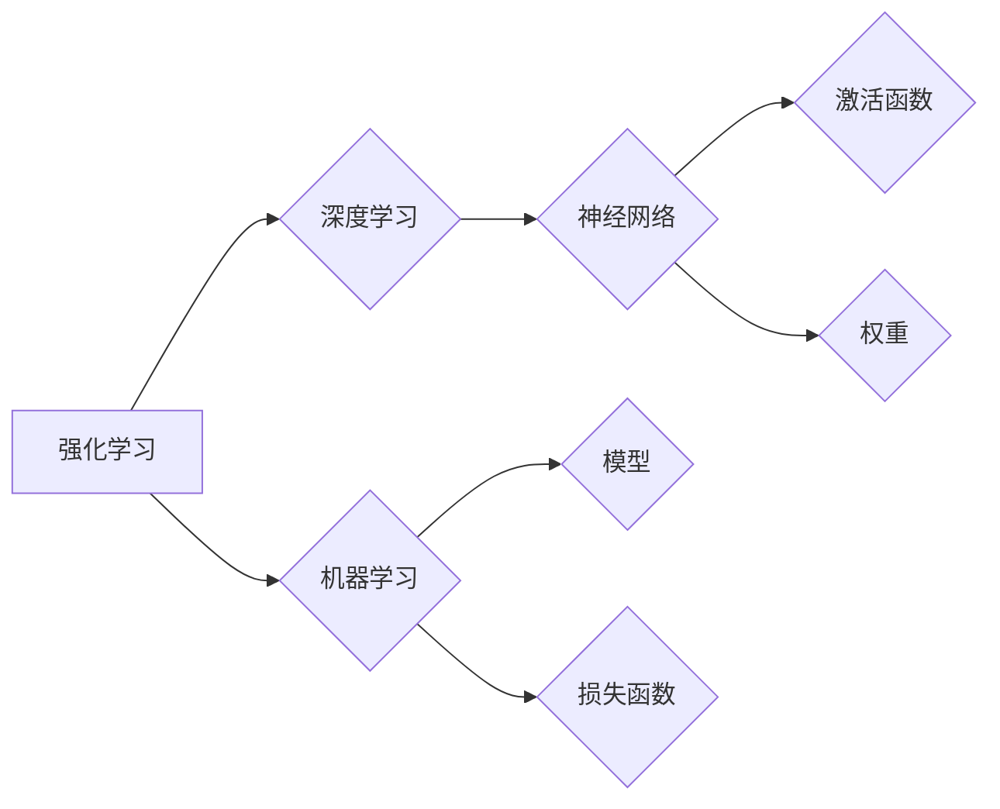

# 强化学习：DL、ML和AI的交集

> 关键词：强化学习，深度学习，机器学习，人工智能，强化学习算法，Q学习，策略梯度，深度强化学习，应用场景

## 1. 背景介绍

强化学习（Reinforcement Learning, RL）作为机器学习（Machine Learning, ML）的一个分支，是人工智能（Artificial Intelligence, AI）领域中一个重要的研究方向。它研究的是如何让机器在环境中通过与环境的交互来学习，从而采取最优的行动策略，以实现特定的目标。近年来，随着深度学习（Deep Learning, DL）的快速发展，深度强化学习（Deep Reinforcement Learning, DRL）逐渐成为了AI领域的热点。

强化学习与深度学习、机器学习有着紧密的联系，它们在算法原理、应用场景等方面相互交叉、相互影响。本文将深入探讨强化学习在DL、ML和AI的交集中的作用，并分析其发展趋势与挑战。

## 2. 核心概念与联系

### 2.1 核心概念

#### 强化学习

强化学习是一种通过试错来学习的方法。在强化学习中，智能体（Agent）通过与环境（Environment）的交互，学习到一系列最优的动作（Action）策略，以实现特定的目标（Reward）。强化学习的主要概念包括：

- 智能体（Agent）：执行动作、感知环境的实体。
- 环境（Environment）：提供状态（State）和奖励（Reward）给智能体。
- 状态（State）：智能体所处的环境状态，通常用向量表示。
- 动作（Action）：智能体可以采取的动作，通常用向量表示。
- 奖励（Reward）：环境对智能体动作的反馈，通常用标量表示。

#### 深度学习

深度学习是机器学习的一个分支，它通过构建深层神经网络来学习数据的复杂表示。深度学习的核心概念包括：

- 神经网络（Neural Network）：由多个神经元组成的层次结构，用于模拟人脑神经元的工作方式。
- 神经元（Neuron）：神经网络的基本单元，负责输入、处理和输出信息。
- 激活函数（Activation Function）：神经网络中的非线性函数，用于引入非线性特性。
- 权重（Weight）：连接神经元之间的参数，用于调节信息传递强度。

#### 机器学习

机器学习是一种使计算机能够从数据中学习的方法。机器学习的主要概念包括：

- 特征（Feature）：用于表示数据的属性或属性组合。
- 模型（Model）：用于从数据中学习规律和模式的数学公式或函数。
- 损失函数（Loss Function）：衡量模型预测值与真实值之间差异的函数。

### 2.2 Mermaid 流程图



### 2.3 核心概念联系

强化学习、深度学习和机器学习三者之间的联系如下：

- 强化学习是机器学习的一种，它通过深度学习来学习复杂的决策策略。
- 深度学习是强化学习的一种实现方式，可以用于学习复杂的决策策略。
- 机器学习为强化学习提供了理论基础和算法框架。

## 3. 核心算法原理 & 具体操作步骤

### 3.1 算法原理概述

强化学习算法的核心是价值函数（Value Function）和策略（Policy）。价值函数用于评估某个状态的价值，策略用于选择最优的动作。

- 价值函数：评估某个状态的价值，表示在当前状态下采取某个动作所能获得的预期奖励。
- 策略：指导智能体选择动作的规则，可以是确定性策略或随机策略。

### 3.2 算法步骤详解

#### Q学习

Q学习是一种基于价值函数的强化学习算法，它通过学习Q值（Q-Value）来评估动作价值。Q学习的主要步骤如下：

1. 初始化Q值表。
2. 选择动作。
3. 执行动作，并获取奖励和下一个状态。
4. 更新Q值。

#### 策略梯度

策略梯度是一种基于策略的强化学习算法，它通过直接优化策略来学习最优动作。策略梯度的主要步骤如下：

1. 选择策略参数。
2. 评估策略参数对应的策略。
3. 根据评估结果更新策略参数。

### 3.3 算法优缺点

#### Q学习

优点：

- 简单易实现。
- 无需显式地定义状态和动作空间。

缺点：

- 学习速度较慢。
- 容易陷入局部最优。

#### 策略梯度

优点：

- 学习速度快。
- 可以直接优化策略。

缺点：

- 需要选择合适的策略参数表示方法。
- 容易陷入梯度消失或梯度爆炸的问题。

### 3.4 算法应用领域

强化学习算法在各个领域都有广泛的应用，例如：

- 游戏AI：如AlphaGo、DeepMind Lab等。
- 机器人：如自动驾驶、无人机等。
- 金融：如股票交易、风险管理等。
- 能源：如智能电网、能源管理等。

## 4. 数学模型和公式 & 详细讲解 & 举例说明

### 4.1 数学模型构建

强化学习的基本数学模型如下：

$$
Q(s,a) = \sum_{s'} \gamma (R + \max_{a'} Q(s',a') - Q(s,a))
$$

其中，$Q(s,a)$ 表示在状态 $s$ 下采取动作 $a$ 的期望回报，$\gamma$ 为折扣因子，$R$ 为即时奖励。

### 4.2 公式推导过程

Q学习的推导过程如下：

1. 定义状态-动作值函数 $Q(s,a)$。
2. 根据贝尔曼方程，将 $Q(s,a)$ 展开为：

$$
Q(s,a) = \sum_{s'} \gamma R(s,a,s') + \gamma \max_{a'} Q(s',a')
$$

3. 令 $R(s,a,s') = r$，得到：

$$
Q(s,a) = \sum_{s'} \gamma r + \gamma \max_{a'} Q(s',a')
$$

### 4.3 案例分析与讲解

以下以Q学习为例，讲解强化学习算法的应用。

假设有一个智能体在玩贪吃蛇游戏，游戏的目标是尽可能地吃掉食物，避免撞墙和撞到自己。智能体在每一帧可以选择向上下左右四个方向移动。

1. 初始化Q值表，随机初始化Q值。
2. 选择动作，如随机选择或根据Q值选择。
3. 执行动作，并获取奖励和下一个状态。
4. 更新Q值，如：

$$
Q(s,a) \leftarrow Q(s,a) + \alpha [R(s,a,s') + \gamma \max_{a'} Q(s',a') - Q(s,a)]
$$

其中，$\alpha$ 为学习率。

通过不断迭代上述步骤，智能体可以学习到最优的移动策略，从而在游戏中获得更高的分数。

## 5. 项目实践：代码实例和详细解释说明

### 5.1 开发环境搭建

1. 安装Python环境。
2. 安装TensorFlow或PyTorch等深度学习框架。
3. 安装 Gym环境，用于创建强化学习环境。

### 5.2 源代码详细实现

以下使用TensorFlow实现Q学习的源代码：

```python
import gym
import numpy as np
import tensorflow as tf

env = gym.make('CartPole-v0')

def build_model(state_shape, action_shape):
    model = tf.keras.Sequential([
        tf.keras.layers.Dense(24, activation='relu', input_shape=state_shape),
        tf.keras.layers.Dense(24, activation='relu'),
        tf.keras.layers.Dense(action_shape, activation='linear')
    ])
    return model

model = build_model(env.observation_space.shape[0], env.action_space.n)

optimizer = tf.keras.optimizers.Adam(lr=0.001)
loss_fn = tf.keras.losses.MeanSquaredError()

def train(model, optimizer, loss_fn, state, action, reward, next_state, done):
    with tf.GradientTape() as tape:
        pred_q_values = model(state)
        action_q_value = pred_q_values[0, action]
        target_q_values = reward + (1.0 - done) * model(next_state).numpy().max()
        loss = loss_fn(tf.cast(target_q_values, tf.float32), tf.cast(action_q_value, tf.float32))
    grads = tape.gradient(loss, model.trainable_variables)
    optimizer.apply_gradients(zip(grads, model.trainable_variables))

# 开始训练
episodes = 1000
for episode in range(episodes):
    state = env.reset()
    done = False
    while not done:
        action = np.argmax(model(state).numpy())
        next_state, reward, done, _ = env.step(action)
        train(model, optimizer, loss_fn, state, action, reward, next_state, done)
        state = next_state
```

### 5.3 代码解读与分析

上述代码实现了一个基于Q学习的CartPole游戏AI。

- `build_model` 函数定义了Q学习的神经网络模型。
- `train` 函数实现Q学习的训练过程，包括计算预测Q值、目标Q值和损失函数，并更新模型参数。
- `episodes` 变量定义了训练的轮数。

通过运行上述代码，训练完成后，CartPole游戏AI可以学会稳定地保持平衡。

### 5.4 运行结果展示

运行上述代码，训练完成后，可以在Gym环境中观察CartPole游戏AI的表现。

## 6. 实际应用场景

强化学习在实际应用场景中取得了显著的成果，以下是一些典型的应用案例：

- 自动驾驶：通过强化学习训练自动驾驶算法，实现无人驾驶汽车。
- 机器人：通过强化学习训练机器人，使其能够完成复杂的任务。
- 游戏AI：通过强化学习训练游戏AI，使其能够与人类玩家进行竞技。
- 金融：通过强化学习训练投资策略，实现智能投资。
- 能源：通过强化学习优化能源系统，提高能源利用效率。

## 7. 工具和资源推荐

### 7.1 学习资源推荐

- 《Reinforcement Learning: An Introduction》
- 《Artificial Intelligence: A Modern Approach》
- TensorFlow官网：https://www.tensorflow.org/
- PyTorch官网：https://pytorch.org/

### 7.2 开发工具推荐

- Gym：https://gym.openai.com/
- OpenAI Baselines：https://github.com/DLR-RM/baselines
- Stable Baselines3：https://github.com/DLR-RM/stable-baselines3

### 7.3 相关论文推荐

- "Deep Reinforcement Learning" by David Silver
- "Playing Atari with Deep Reinforcement Learning" by Volodymyr Mnih et al.
- "Asynchronous Methods for Deep Reinforcement Learning" by John Schulman et al.

## 8. 总结：未来发展趋势与挑战

### 8.1 研究成果总结

本文介绍了强化学习在DL、ML和AI的交集中的作用，分析了强化学习的基本原理、算法和应用场景。通过学习本文，读者可以了解到强化学习的基本概念、核心算法、数学模型以及实际应用。

### 8.2 未来发展趋势

未来，强化学习将在以下方面取得更大的突破：

- 深度强化学习：结合深度学习技术，提高强化学习算法的性能。
- 多智能体强化学习：研究多个智能体协同合作的策略。
- 强化学习与知识表示：将知识表示技术应用于强化学习，提高学习效率和智能体能力。
- 强化学习与安全：研究强化学习算法的安全性和鲁棒性。

### 8.3 面临的挑战

强化学习在发展过程中也面临着一些挑战：

- 数据量：强化学习需要大量的数据进行训练，数据收集和处理成本较高。
- 探索与利用：如何平衡探索和利用，是强化学习中的一个重要问题。
- 可解释性：强化学习算法的决策过程通常难以解释，这限制了其在某些领域中的应用。

### 8.4 研究展望

尽管存在一些挑战，但强化学习仍然具有巨大的发展潜力。随着技术的不断进步，相信强化学习将在未来取得更大的成就，为人工智能的发展做出更大的贡献。

## 9. 附录：常见问题与解答

**Q1：强化学习与深度学习有什么区别？**

A：强化学习和深度学习是两个不同的研究领域。强化学习研究如何让机器通过与环境交互学习，而深度学习研究如何让机器从数据中学习。虽然两者在某些领域存在交集，但它们的研究对象和目标有所不同。

**Q2：Q学习算法的优缺点是什么？**

A：Q学习算法的优点是简单易实现，不需要显式地定义状态和动作空间。缺点是学习速度较慢，容易陷入局部最优。

**Q3：强化学习在实际应用中遇到哪些挑战？**

A：强化学习在实际应用中遇到的主要挑战包括数据量、探索与利用、可解释性等。

**Q4：如何解决强化学习中的数据量问题？**

A：解决强化学习中的数据量问题可以从以下方面入手：
- 使用数据增强技术，如回译、图像翻转等。
- 利用迁移学习，将已有数据应用于新任务。
- 使用强化学习算法，如无模型方法、蒙特卡洛方法等，减少对数据量的依赖。

**Q5：如何提高强化学习算法的可解释性？**

A：提高强化学习算法的可解释性可以从以下方面入手：
- 使用可视化技术，如决策树、注意力机制等。
- 将强化学习与知识表示技术相结合，提取和解释决策过程中的关键信息。

作者：禅与计算机程序设计艺术 / Zen and the Art of Computer Programming