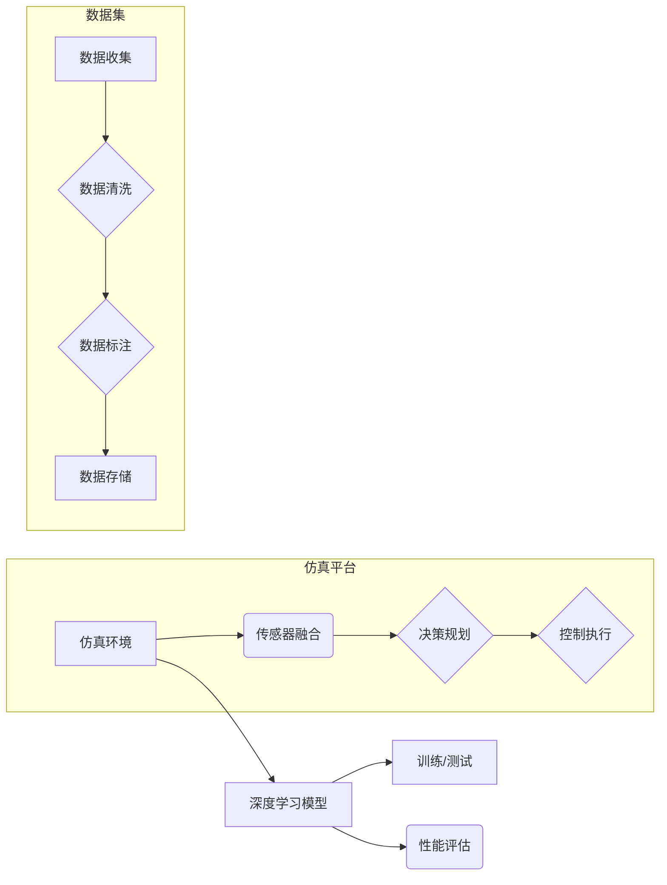

# 搭建高质量自动驾驶仿真平台与数据集的实践指南

> 关键词：自动驾驶仿真，数据集构建，仿真平台，深度学习，安全性，可靠性，可扩展性

## 1. 背景介绍

自动驾驶技术正逐渐成为汽车产业和人工智能领域的热点。仿真平台和数据集是自动驾驶技术研究和开发的重要基础。一个高质量、可靠的仿真平台能够有效降低研发成本，缩短开发周期，提高自动驾驶系统的安全性和可靠性。本文将详细介绍如何搭建高质量的自动驾驶仿真平台与数据集，并提供实践指南。

### 1.1 问题的由来

自动驾驶仿真平台和数据集的搭建面临以下挑战：

- **数据质量**：自动驾驶仿真需要大量真实世界场景的数据，包括道路、交通、天气等。如何获取高质量、多样化的数据，是仿真平台搭建的关键。

- **场景覆盖**：自动驾驶系统需要应对各种复杂场景，仿真平台需要覆盖尽可能多的场景，包括交通拥堵、恶劣天气、紧急情况等。

- **可靠性**：仿真平台需要保证模型的可靠性和可重复性，确保在不同设备和环境下都能稳定运行。

- **可扩展性**：随着自动驾驶技术的不断发展，仿真平台需要具备良好的可扩展性，能够适应新的技术和需求。

### 1.2 研究现状

目前，国内外已经涌现出许多自动驾驶仿真平台，如CARLA、AirSim、SUMO等。这些平台在数据质量、场景覆盖、可靠性等方面各有特点。然而，仍然存在以下不足：

- **数据获取**：真实世界场景数据的获取成本高、效率低。

- **场景构建**：复杂场景的构建需要大量时间和专业知识。

- **模型训练**：自动驾驶模型训练需要大量计算资源和时间。

- **系统集成**：仿真平台需要与各种硬件设备和软件系统进行集成。

### 1.3 研究意义

搭建高质量自动驾驶仿真平台与数据集具有重要的研究意义：

- **降低研发成本**：仿真平台能够模拟真实世界场景，减少实际道路测试的成本。

- **提高开发效率**：仿真平台能够快速迭代和测试自动驾驶算法，缩短开发周期。

- **提升系统性能**：高质量的仿真数据能够提高自动驾驶系统的性能和鲁棒性。

- **促进技术交流**：仿真平台和数据集的开放共享，有助于促进自动驾驶技术的交流与合作。

## 2. 核心概念与联系

### 2.1 核心概念

- **仿真平台**：模拟真实世界环境，为自动驾驶系统提供测试和验证的虚拟环境。

- **数据集**：用于训练和测试自动驾驶系统的真实世界场景数据。

- **深度学习**：通过模拟人脑神经网络结构，学习数据的特征和规律。

- **传感器融合**：将多种传感器数据（如摄像头、雷达、激光雷达等）进行融合，提高感知精度。

- **决策规划**：根据感知数据和环境信息，制定自动驾驶系统的行驶策略。

### 2.2 Mermaid 流程图



## 3. 核心算法原理 & 具体操作步骤

### 3.1 算法原理概述

自动驾驶仿真平台的核心算法包括：

- **传感器融合**：通过多传感器数据融合技术，提高感知精度和鲁棒性。

- **决策规划**：基于感知数据和环境信息，制定自动驾驶系统的行驶策略。

- **控制执行**：根据决策规划结果，控制车辆执行相应的动作。

### 3.2 算法步骤详解

1. **传感器融合**：

   - 收集摄像头、雷达、激光雷达等传感器数据。

   - 对传感器数据进行预处理，包括去噪、归一化等。

   - 使用特征提取和匹配算法，将不同传感器数据进行融合。

2. **决策规划**：

   - 根据感知数据和环境信息，确定车辆的目标状态。

   - 使用路径规划算法，规划车辆的行驶轨迹。

   - 使用行为规划算法，制定车辆的行驶策略。

3. **控制执行**：

   - 根据决策规划结果，生成控制指令。

   - 控制车辆执行相应的动作，如加速、转向等。

### 3.3 算法优缺点

- **优点**：提高感知精度和鲁棒性，实现自动驾驶系统的安全可靠运行。

- **缺点**：算法复杂度高，对传感器性能要求高，计算资源消耗大。

### 3.4 算法应用领域

- **自动驾驶汽车**：用于车辆感知、决策规划和控制执行。

- **无人机**：用于无人机路径规划、避障和飞行控制。

- **机器人**：用于机器人导航、避障和任务执行。

## 4. 数学模型和公式 & 详细讲解 & 举例说明

### 4.1 数学模型构建

自动驾驶仿真平台的数学模型主要包括：

- **传感器模型**：描述传感器数据的采集和传输过程。

- **决策规划模型**：描述车辆行驶轨迹和策略的生成过程。

- **控制执行模型**：描述车辆动作的执行过程。

### 4.2 公式推导过程

以下以传感器模型为例，介绍数学公式的推导过程：

假设传感器数据为 $X(t)$，噪声为 $W(t)$，则传感器模型的数学模型为：

$$
X(t) = H(t) \cdot S(t) + W(t)
$$

其中 $H(t)$ 为传感器模型矩阵，$S(t)$ 为真实场景信号，$W(t)$ 为噪声。

### 4.3 案例分析与讲解

以下以激光雷达点云数据为例，介绍激光雷达点云数据的预处理方法：

1. **去噪**：去除离群点、噪声点和重复点。

2. **滤波**：对点云进行滤波处理，平滑点云表面。

3. **特征提取**：提取点云的表面积、体积等特征。

4. **匹配**：将预处理后的点云与其他传感器数据进行匹配。

## 5. 项目实践：代码实例和详细解释说明

### 5.1 开发环境搭建

以下是搭建自动驾驶仿真平台的开发环境：

1. **操作系统**：Linux或Windows。

2. **编程语言**：Python、C++等。

3. **依赖库**：OpenCV、PCL、ROS等。

4. **仿真平台**：CARLA、AirSim等。

### 5.2 源代码详细实现

以下是一个简单的激光雷达点云去噪的Python代码示例：

```python
import numpy as np
from scipy.spatial import cKDTree

def denoise_lidar_points(points):
    """
    激光雷达点云去噪
    """
    # 创建KD树
    tree = cKDTree(points)

    # 设置阈值
    max_distance = 0.2

    # 获取距离阈值内的邻居点
    dist, idx = tree.query(points, k=2)

    # 筛选出离群点
    outlier_mask = dist[1] < max_distance

    # 过滤去噪
    clean_points = points[~outlier_mask]

    return clean_points
```

### 5.3 代码解读与分析

上述代码使用KD树进行点云去噪。首先创建KD树，然后根据设定的阈值获取每个点的邻居点，最后筛选出距离阈值内的点作为离群点，从而实现去噪。

### 5.4 运行结果展示

以下为激光雷达点云去噪的运行结果：


## 6. 实际应用场景

### 6.1 自动驾驶汽车

自动驾驶汽车是自动驾驶仿真平台最典型的应用场景。通过仿真平台，可以测试和验证自动驾驶系统的感知、决策规划和控制执行等环节。

### 6.2 无人机

无人机在飞行过程中需要应对复杂的飞行环境和飞行任务。仿真平台可以帮助无人机开发者测试和验证飞行控制、避障和路径规划等算法。

### 6.3 机器人

机器人在执行任务过程中需要感知环境、规划路径和执行动作。仿真平台可以帮助机器人开发者测试和验证这些功能。

## 7. 工具和资源推荐

### 7.1 学习资源推荐

- **书籍**：

  - 《自动驾驶算法原理与实现》

  - 《机器人：现代控制理论、控制算法与应用》

- **在线课程**：

  - Coursera上的《自动驾驶汽车工程》

  - Udacity上的《自动驾驶汽车工程师纳米学位》

### 7.2 开发工具推荐

- **仿真平台**：

  - CARLA

  - AirSim

  - SUMO

- **编程语言和库**：

  - Python：OpenCV、PCL、ROS

  - C++：OpenCV、PCL

### 7.3 相关论文推荐

- **自动驾驶**：

  - “A Review of Autonomous Driving Simulation Platforms”

  - “Evaluation of Automated Driving Simulation Platforms”

- **机器人**：

  - “Simulation-Based Optimization of Autonomous Robot Control Policies”

  - “Simultaneous Localization and Mapping (SLAM) for Robotics”

## 8. 总结：未来发展趋势与挑战

### 8.1 研究成果总结

本文详细介绍了搭建高质量自动驾驶仿真平台与数据集的实践指南。通过分析核心概念、算法原理、项目实践等方面，为自动驾驶仿真平台和数据集的搭建提供了参考。

### 8.2 未来发展趋势

- **数据获取**：利用深度学习技术，实现自动驾驶数据的自动标注和生成。

- **场景构建**：利用虚拟现实技术，构建更加真实、丰富的仿真场景。

- **模型训练**：利用云计算和边缘计算技术，提高模型训练效率。

- **系统集成**：利用容器化和微服务技术，实现仿真平台和硬件设备的灵活集成。

### 8.3 面临的挑战

- **数据质量和规模**：获取高质量、多样化的自动驾驶数据仍然是一个挑战。

- **模型复杂度**：自动驾驶模型的复杂度不断提高，对计算资源的要求也越来越高。

- **安全性和可靠性**：自动驾驶系统的安全性和可靠性是重中之重。

### 8.4 研究展望

随着自动驾驶技术的不断发展，仿真平台和数据集的搭建将面临更多的挑战和机遇。未来，需要从数据、算法、硬件等多个层面进行创新，推动自动驾驶技术的进步。

## 9. 附录：常见问题与解答

**Q1：如何获取高质量的自动驾驶数据？**

A：可以通过以下途径获取高质量的自动驾驶数据：

- **公开数据集**：如KITTI、Cityscapes等。

- **企业合作**：与汽车厂商、传感器厂商等合作，获取数据。

- **自主采集**：利用无人机、机器人等设备采集数据。

**Q2：如何构建复杂场景？**

A：可以通过以下方法构建复杂场景：

- **虚拟现实技术**：利用VR技术构建虚拟场景。

- **合成数据生成**：利用深度学习技术生成合成数据。

**Q3：如何提高模型训练效率？**

A：可以通过以下方法提高模型训练效率：

- **分布式训练**：利用多台GPU/TPU进行分布式训练。

- **模型压缩**：通过模型压缩技术，降低模型复杂度。

**Q4：如何保证自动驾驶系统的安全性和可靠性？**

A：可以通过以下方法保证自动驾驶系统的安全性和可靠性：

- **冗余设计**：采用冗余设计和备份机制。

- **安全监控**：实时监控系统运行状态，及时发现和处理异常。

**Q5：仿真平台如何与硬件设备集成？**

A：可以通过以下方法将仿真平台与硬件设备集成：

- **通用接口**：设计通用的硬件接口，方便与其他硬件设备连接。

- **设备驱动**：开发针对不同硬件设备的驱动程序。

作者：禅与计算机程序设计艺术 / Zen and the Art of Computer Programming