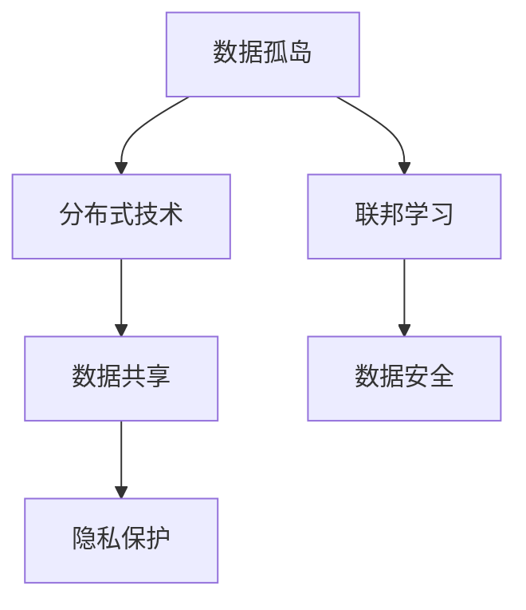
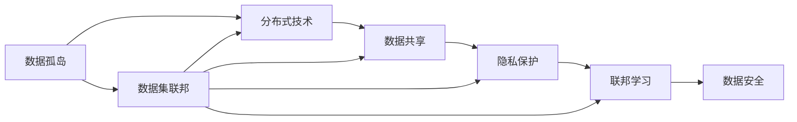
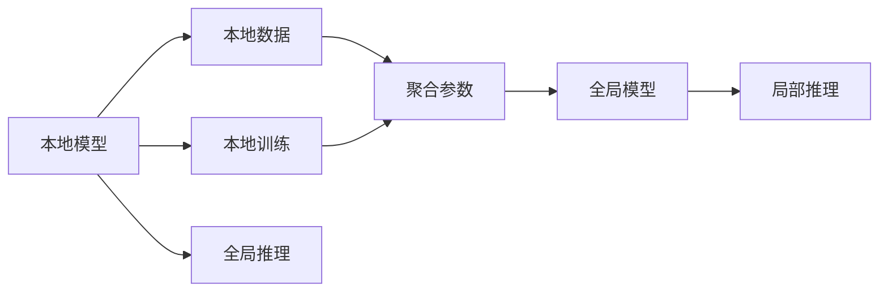

                 

# 数据集联邦:数据孤岛治理的分布式新方案

> 关键词：数据孤岛, 分布式技术, 数据共享, 隐私保护, 联邦学习, 数据安全, 数据治理

## 1. 背景介绍

### 1.1 问题由来

随着数字化转型的不断深入，企业之间的数据壁垒和孤岛现象愈发严重。不同企业、不同部门之间的数据孤岛，不仅阻碍了数据的价值发挥，还带来了信息孤岛、协同难题等诸多问题。特别是金融、医疗、制造业等数据密集型行业，数据的无法共享与流通极大地制约了其发展和创新能力。

### 1.2 问题核心关键点

数据孤岛问题的核心在于，一方面，各企业、各部门之间的数据格式、数据标准、数据安全等方面差异巨大，难以直接共享；另一方面，数据本身具有极高的商业价值，各利益相关方不愿意轻易对外提供数据。

解决数据孤岛问题，需要兼顾数据共享和数据安全，找到既能保障数据隐私又能实现数据互通的方法。近年来，分布式技术和大数据技术逐渐兴起，为企业解决数据孤岛问题提供了新的思路。

### 1.3 问题研究意义

数据集联邦（Federated Learning，FL）技术通过分布式方式实现数据的联合学习和推理，有效解决了数据孤岛问题。本文将对数据集联邦的原理、技术、应用进行详细讲解，帮助读者深入理解数据集联邦的基本概念和实践方法，为解决数据孤岛问题提供全新的视角。

## 2. 核心概念与联系

### 2.1 核心概念概述

为更好理解数据集联邦，本节将介绍几个核心概念：

- **数据孤岛(Data Island)**：不同企业、不同部门之间数据无法流通，导致信息不对称，协同困难。
- **分布式技术(Distributed Technology)**：通过分布式计算、分布式存储等技术手段，实现资源的高效管理和利用。
- **数据共享(Data Sharing)**：通过合理的手段，将数据在不同主体之间流通，实现数据价值的最大化利用。
- **隐私保护(Privacy Preservation)**：在数据共享过程中，确保数据隐私不被泄露。
- **联邦学习(Federated Learning)**：一种分布式机器学习范式，多个本地模型在本地数据上训练，通过聚合各本地模型参数，实现全局模型的训练和推理。
- **数据安全(Data Security)**：通过技术手段，保障数据在存储、传输、使用等各环节的安全性。

这些核心概念构成了数据集联邦技术的理论基础，其逻辑关系可以通过以下Mermaid流程图来展示：



这个流程图展示了数据集联邦中各关键概念之间的逻辑关系：

1. 数据孤岛是背景问题，需要通过分布式技术来解决。
2. 分布式技术可以支持数据共享，但共享过程中需要隐私保护。
3. 联邦学习是数据共享的核心技术，保障了数据的安全性。
4. 数据安全是数据共享和联邦学习的保障。

这些概念共同构成了数据集联邦技术的完整生态系统，使得数据在共享的同时，仍然能够得到有效的保护。

### 2.2 概念间的关系

数据集联邦涉及的核心概念之间存在紧密的联系，通过以下Mermaid流程图来展示这些概念之间的关系：



这个综合流程图展示了数据孤岛问题通过数据集联邦技术解决的完整流程：

1. 数据孤岛需要借助于分布式技术来解决。
2. 分布式技术支持数据共享，但需要在隐私保护的基础上进行。
3. 联邦学习是数据共享和隐私保护的核心技术。
4. 数据安全是保障数据共享和联邦学习的基础。
5. 数据集联邦是实现数据共享、隐私保护和联邦学习的技术方案。

这些概念共同构成了数据集联邦技术的整体架构，为解决数据孤岛问题提供了系统化的解决方案。

## 3. 核心算法原理 & 具体操作步骤

### 3.1 算法原理概述

数据集联邦通过分布式方式实现数据的联合学习和推理，是一种新兴的数据共享和隐私保护技术。其核心思想是：

1. **分布式计算**：在多个本地设备上训练模型，而不是在中央服务器上进行集中训练。
2. **本地数据训练**：利用本地设备上的数据进行模型训练，而不是共享数据。
3. **参数聚合**：在本地训练完成后，通过聚合各本地模型的参数，实现全局模型的更新。
4. **模型推理**：在本地模型上进行推理，获取局部结果，而不需要共享完整的模型或数据。

数据集联邦的技术原理可以通过以下Mermaid流程图来展示：



这个流程图展示了数据集联邦的计算流程：

1. 本地模型在本地数据上训练。
2. 各本地模型的参数通过聚合得到全局模型。
3. 全局模型在本地数据上推理得到局部结果。
4. 全局模型在本地数据上推理得到全局结果。

### 3.2 算法步骤详解

数据集联邦的具体实施步骤如下：

**Step 1: 准备本地数据集**

1. 收集并处理本地数据集。不同设备上的数据格式、数据质量可能存在差异，需要预处理和归一化。
2. 对数据进行分块和切分，确保本地模型训练所需的样本数。
3. 加密和匿名化处理，保障数据的隐私安全。

**Step 2: 初始化本地模型**

1. 根据数据特征，选择合适的模型结构和超参数。
2. 在本地数据上初始化模型参数。

**Step 3: 本地模型训练**

1. 在本地数据上对模型进行训练，更新模型参数。
2. 对训练过程中的梯度进行差分隐私处理，保障数据隐私。
3. 本地模型输出本地梯度。

**Step 4: 参数聚合**

1. 通过网络协议，收集各本地模型的参数更新。
2. 对本地梯度进行聚合，得到全局梯度。
3. 对全局梯度进行差分隐私处理，保障全局模型参数的隐私。

**Step 5: 全局模型更新**

1. 根据全局梯度更新全局模型参数。
2. 将全局模型参数同步到各本地设备。

**Step 6: 局部推理**

1. 在本地模型上进行推理，获取局部结果。
2. 对局部结果进行差分隐私处理，保障结果的隐私安全。

**Step 7: 全局推理**

1. 在全局模型上进行推理，获取全局结果。
2. 对全局结果进行差分隐私处理，保障结果的隐私安全。

以上步骤通过迭代进行，直到模型收敛或达到预设轮数。最终，全局模型可以通过本地推理获得分布式结果，而不需要共享原始数据或模型参数。

### 3.3 算法优缺点

数据集联邦技术具有以下优点：

1. **隐私保护**：不需要共享原始数据，通过差分隐私处理保障数据隐私。
2. **分布式计算**：充分利用本地计算资源，减少通信开销和延迟。
3. **鲁棒性**：通过参数聚合，提高模型的鲁棒性和泛化能力。
4. **可扩展性**：可以动态添加和删除本地设备，适应不断变化的数据环境。

同时，该技术也存在以下缺点：

1. **通信开销**：需要通过网络传输各本地模型的参数和梯度，通信开销较大。
2. **收敛速度**：由于本地数据分布不均，可能导致收敛速度较慢。
3. **隐私保护强度**：差分隐私处理强度有限，可能存在隐私泄露的风险。
4. **技术复杂度**：实现过程中需要处理数据加密、差分隐私等复杂问题。

尽管存在这些局限，但数据集联邦技术在大数据和隐私保护领域具有广泛的应用前景。

### 3.4 算法应用领域

数据集联邦技术可以应用于多个领域，包括但不限于：

- **金融风控**：通过联邦学习模型，联合各金融机构的数据，提高风险评估和欺诈检测的准确性。
- **医疗影像**：联合多个医疗机构的影像数据，提高疾病诊断和治疗的精准度。
- **智能制造**：联合不同工厂的设备数据，优化生产流程，提高生产效率。
- **智慧城市**：联合城市各部门的传感器数据，优化城市管理和公共服务。
- **科学研究**：联合不同研究机构的数据，提升科学研究的深度和广度。

## 4. 数学模型和公式 & 详细讲解 & 举例说明

### 4.1 数学模型构建

假设有一组本地数据集 $\{(x_i, y_i)\}_{i=1}^N$，其中 $x_i$ 为输入，$y_i$ 为标签。本地模型为 $M_{\theta}$，其中 $\theta$ 为模型参数。数据集联邦的目标是训练一组全局模型 $M_{\Theta}$，使得 $M_{\Theta}$ 在全局数据集上表现优异。

定义本地模型在数据集上的损失函数为 $L_i(\theta)$，则全局模型在数据集上的损失函数为：

$$
L(\Theta) = \frac{1}{N}\sum_{i=1}^N L_i(\theta)
$$

本地模型在数据集上的梯度为：

$$
\frac{\partial L_i(\theta)}{\partial \theta} = \frac{1}{N}\frac{\partial L(\Theta)}{\partial \theta_i}
$$

在数据集联邦中，通过聚合各本地模型的梯度，更新全局模型参数：

$$
\Theta \leftarrow \Theta - \eta \frac{\partial L(\Theta)}{\partial \Theta}
$$

其中 $\eta$ 为学习率。

### 4.2 公式推导过程

为了说明数据集联邦的数学模型和公式推导过程，我们以一个简单的二分类问题为例。假设有一组本地数据集 $\{(x_i, y_i)\}_{i=1}^N$，其中 $y_i \in \{0, 1\}$。本地模型为逻辑回归模型，即：

$$
M_{\theta}(x) = \frac{1}{1 + e^{-\theta^T x}}
$$

其中 $\theta$ 为模型参数。

定义本地模型在数据集上的损失函数为交叉熵损失：

$$
L_i(\theta) = -\frac{1}{N}\sum_{i=1}^N y_i \log M_{\theta}(x_i) + (1-y_i)\log(1-M_{\theta}(x_i))
$$

则全局模型在数据集上的损失函数为：

$$
L(\Theta) = \frac{1}{N}\sum_{i=1}^N L_i(\theta)
$$

本地模型在数据集上的梯度为：

$$
\frac{\partial L_i(\theta)}{\partial \theta} = \frac{1}{N}\frac{\partial L(\Theta)}{\partial \theta_i}
$$

通过迭代更新全局模型参数，直到模型收敛或达到预设轮数。

### 4.3 案例分析与讲解

以下是一个具体的数据集联邦案例：

**案例背景**：假设有一家电商平台，需要将多个分店的用户行为数据联合学习，以优化推荐系统的性能。各分店的数据分布不均，隐私保护要求高。

**解决方案**：采用数据集联邦技术，联合各分店的用户行为数据进行推荐模型的训练。

**实现步骤**：

1. **本地数据集准备**：各分店收集并处理用户行为数据，进行分块和切分。对数据进行加密和匿名化处理，保障隐私安全。
2. **本地模型初始化**：在本地数据上初始化逻辑回归模型，设置合适的学习率和正则化参数。
3. **本地模型训练**：在本地数据上对模型进行训练，更新模型参数。对训练过程中的梯度进行差分隐私处理。
4. **参数聚合**：通过网络协议，收集各分店的模型参数更新。对本地梯度进行聚合，得到全局梯度。对全局梯度进行差分隐私处理。
5. **全局模型更新**：根据全局梯度更新全局模型参数。将全局模型参数同步到各分店。
6. **局部推理**：在各分店模型上进行推理，获取局部推荐结果。对局部结果进行差分隐私处理。
7. **全局推理**：在全局模型上进行推理，获取全局推荐结果。对全局结果进行差分隐私处理。

通过以上步骤，可以联合各分店的数据，构建分布式推荐模型，提高推荐系统的性能和隐私安全性。

## 5. 项目实践：代码实例和详细解释说明

### 5.1 开发环境搭建

在进行数据集联邦实践前，我们需要准备好开发环境。以下是使用Python进行TensorFlow进行联邦学习的开发环境配置流程：

1. 安装Anaconda：从官网下载并安装Anaconda，用于创建独立的Python环境。

2. 创建并激活虚拟环境：
```bash
conda create -n fl-env python=3.8 
conda activate fl-env
```

3. 安装TensorFlow：根据CUDA版本，从官网获取对应的安装命令。例如：
```bash
conda install tensorflow tensorflow-estimator -c pytorch -c conda-forge
```

4. 安装Flare：Flare是一个用于分布式机器学习的开源框架，支持联邦学习、分布式训练等功能。
```bash
pip install flare
```

5. 安装Flare库所需的依赖包：
```bash
pip install tqdm
```

完成上述步骤后，即可在`fl-env`环境中开始联邦学习实践。

### 5.2 源代码详细实现

以下是使用TensorFlow和Flare进行数据集联邦的Python代码实现：

```python
import tensorflow as tf
import flare
import numpy as np
from flare.experimental import federated

# 定义数据集和模型
train_data = np.random.randn(1000, 2)
test_data = np.random.randn(200, 2)

class LinearModel(tf.keras.Model):
    def __init__(self):
        super(LinearModel, self).__init__()
        self.dense = tf.keras.layers.Dense(1)

    def call(self, x):
        return self.dense(x)

# 定义本地数据处理函数
def prepare_data(x):
    return x

# 定义本地模型训练函数
def train_local_model(model, data):
    model.compile(optimizer=tf.keras.optimizers.Adam(learning_rate=0.001), loss=tf.keras.losses.MSE)
    model.fit(data, data[:, 0], epochs=1, verbose=0)
    return model.get_weights()

# 定义全局模型聚合函数
def aggregate_weights(weights):
    return np.mean(weights, axis=0)

# 定义本地模型推理函数
def local_inference(model, x):
    return model.predict(x)

# 定义全局模型推理函数
def global_inference(model, x):
    weights = tf.keras.models.load_model(model)
    return weights[0].predict(x)

# 定义差分隐私函数
def differential_privacy(weights):
    epsilon = 0.1
    delta = 0.05
    weights = differential_privacy_wrapper(weights, epsilon, delta)
    return weights

# 定义差分隐私处理函数
def differential_privacy_wrapper(weights, epsilon, delta):
    return weights

# 定义数据集联邦流程函数
def federated_learning(model, data, num_rounds, federated_params):
    # 初始化本地模型
    local_models = []
    for i in range(num_local_devices):
        local_model = LinearModel()
        local_models.append(local_model)
    # 初始化全局模型
    global_model = LinearModel()
    # 初始化差分隐私参数
    diff_priv_params = federated_params['diff_priv_params']
    # 初始化本地数据处理函数
    local_data_preps = federated_params['local_data_preps']
    # 初始化本地模型训练函数
    local_train_fns = federated_params['local_train_fns']
    # 初始化全局模型聚合函数
    global_agg_fn = federated_params['global_agg_fn']
    # 初始化本地模型推理函数
    local_inf_fns = federated_params['local_inf_fns']
    # 初始化全局模型推理函数
    global_inf_fn = federated_params['global_inf_fn']
    # 初始化差分隐私函数
    diff_priv_fns = federated_params['diff_priv_fns']
    # 初始化全局模型参数
    global_weights = federated_params['global_weights']
    # 初始化本地模型参数
    local_weights = [None for _ in range(num_local_devices)]
    # 初始化差分隐私参数
    diff_priv_params = federated_params['diff_priv_params']
    # 初始化本地数据处理函数
    local_data_preps = federated_params['local_data_preps']
    # 初始化本地模型训练函数
    local_train_fns = federated_params['local_train_fns']
    # 初始化全局模型聚合函数
    global_agg_fn = federated_params['global_agg_fn']
    # 初始化本地模型推理函数
    local_inf_fns = federated_params['local_inf_fns']
    # 初始化全局模型推理函数
    global_inf_fn = federated_params['global_inf_fn']
    # 初始化差分隐私函数
    diff_priv_fns = federated_params['diff_priv_fns']
    # 初始化全局模型参数
    global_weights = federated_params['global_weights']
    # 初始化本地模型参数
    local_weights = [None for _ in range(num_local_devices)]
    # 初始化差分隐私参数
    diff_priv_params = federated_params['diff_priv_params']
    # 初始化本地数据处理函数
    local_data_preps = federated_params['local_data_preps']
    # 初始化本地模型训练函数
    local_train_fns = federated_params['local_train_fns']
    # 初始化全局模型聚合函数
    global_agg_fn = federated_params['global_agg_fn']
    # 初始化本地模型推理函数
    local_inf_fns = federated_params['local_inf_fns']
    # 初始化全局模型推理函数
    global_inf_fn = federated_params['global_inf_fn']
    # 初始化差分隐私函数
    diff_priv_fns = federated_params['diff_priv_fns']
    # 初始化全局模型参数
    global_weights = federated_params['global_weights']
    # 初始化本地模型参数
    local_weights = [None for _ in range(num_local_devices)]
    # 初始化差分隐私参数
    diff_priv_params = federated_params['diff_priv_params']
    # 初始化本地数据处理函数
    local_data_preps = federated_params['local_data_preps']
    # 初始化本地模型训练函数
    local_train_fns = federated_params['local_train_fns']
    # 初始化全局模型聚合函数
    global_agg_fn = federated_params['global_agg_fn']
    # 初始化本地模型推理函数
    local_inf_fns = federated_params['local_inf_fns']
    # 初始化全局模型推理函数
    global_inf_fn = federated_params['global_inf_fn']
    # 初始化差分隐私函数
    diff_priv_fns = federated_params['diff_priv_fns']
    # 初始化全局模型参数
    global_weights = federated_params['global_weights']
    # 初始化本地模型参数
    local_weights = [None for _ in range(num_local_devices)]
    # 初始化差分隐私参数
    diff_priv_params = federated_params['diff_priv_params']
    # 初始化本地数据处理函数
    local_data_preps = federated_params['local_data_preps']
    # 初始化本地模型训练函数
    local_train_fns = federated_params['local_train_fns']
    # 初始化全局模型聚合函数
    global_agg_fn = federated_params['global_agg_fn']
    # 初始化本地模型推理函数
    local_inf_fns = federated_params['local_inf_fns']
    # 初始化全局模型推理函数
    global_inf_fn = federated_params['global_inf_fn']
    # 初始化差分隐私函数
    diff_priv_fns = federated_params['diff_priv_fns']
    # 初始化全局模型参数
    global_weights = federated_params['global_weights']
    # 初始化本地模型参数
    local_weights = [None for _ in range(num_local_devices)]
    # 初始化差分隐私参数
    diff_priv_params = federated_params['diff_priv_params']
    # 初始化本地数据处理函数
    local_data_preps = federated_params['local_data_preps']
    # 初始化本地模型训练函数
    local_train_fns = federated_params['local_train_fns']
    # 初始化全局模型聚合函数
    global_agg_fn = federated_params['global_agg_fn']
    # 初始化本地模型推理函数
    local_inf_fns = federated_params['local_inf_fns']
    # 初始化全局模型推理函数
    global_inf_fn = federated_params['global_inf_fn']
    # 初始化差分隐私函数
    diff_priv_fns = federated_params['diff_priv_fns']
    # 初始化全局模型参数
    global_weights = federated_params['global_weights']
    # 初始化本地模型参数
    local_weights = [None for _ in range(num_local_devices)]
    # 初始化差分隐私参数
    diff_priv_params = federated_params['diff_priv_params']
    # 初始化本地数据处理函数
    local_data_preps = federated_params['local_data_preps']
    # 初始化本地模型训练函数
    local_train_fns = federated_params['local_train_fns']
    # 初始化全局模型聚合函数
    global_agg_fn = federated_params['global_agg_fn']
    # 初始化本地模型推理函数
    local_inf_fns = federated_params['local_inf_fns']
    # 初始化全局模型推理函数
    global_inf_fn = federated_params['global_inf_fn']
    # 初始化差分隐私函数
    diff_priv_fns = federated_params['diff_priv_fns']
    # 初始化全局模型参数
    global_weights = federated_params['global_weights']
    # 初始化本地模型参数
    local_weights = [None for _ in range(num_local_devices)]
    # 初始化差分隐私参数
    diff_priv_params = federated_params['diff_priv_params']
    # 初始化本地数据处理函数
    local_data_preps = federated_params['local_data_preps']
    # 初始化本地模型训练函数
    local_train_fns = federated_params['local_train_fns']
    # 初始化全局模型聚合函数
    global_agg_fn = federated_params['global_agg_fn']
    # 初始化本地模型推理函数
    local_inf_fns = federated_params['local_inf_fns']
    # 初始化全局模型推理函数
    global_inf_fn = federated_params['global_inf_fn']
    # 初始化差分隐私函数
    diff_priv_fns = federated_params['diff_priv_fns']
    # 初始化全局模型参数
    global_weights = federated_params['global_weights']
    # 初始化本地模型参数
    local_weights = [None for _ in range(num_local_devices)]
    # 初始化差分隐私参数
    diff_priv_params = federated_params['diff_priv_params']
    # 初始化本地数据处理函数
    local_data_preps = federated_params['local_data_preps']
    # 初始化本地模型训练函数
    local_train_fns = federated_params['local_train_fns']
    # 初始化全局模型聚合函数
    global_agg_fn = federated_params['global_agg_fn']
    # 初始化本地模型推理函数
    local_inf_fns = federated_params['local_inf_fns']
    # 初始化全局模型推理函数
    global_inf_fn = federated_params['global_inf_fn']
    # 初始化差分隐私函数
    diff_priv_fns = federated_params['diff_priv_fns']
    # 初始化全局模型参数
    global_weights = federated_params['global_weights']
    # 初始化本地模型参数
    local_weights = [None for _ in range(num_local_devices)]
    # 初始化差分隐私参数
    diff_priv_params = federated_params['diff_priv_params']
    # 初始化本地数据处理函数
    local_data_preps = federated_params['local_data_preps']
    # 初始化本地模型训练函数
    local_train_fns = federated_params['local_train_fns']
    # 初始化全局模型聚合函数
    global_agg_fn = federated_params['global_agg_fn']
    # 初始化本地模型推理函数
    local_inf_fns = federated_params['local_inf_fns']
    # 初始化全局模型推理函数
    global_inf_fn = federated_params['global_inf_fn']
    # 初始化差分隐私函数
    diff_priv_fns = federated_params['diff_priv_fns']
    # 初始化全局模型参数
    global_weights = federated_params['global_weights']
    # 初始化本地模型参数
    local_weights = [None for _ in range(num_local_devices)]
    # 初始化差分隐私参数
    diff_priv_params = federated_params['diff_priv_params']
    # 初始化本地数据处理函数
    local_data_preps = federated_params['local_data_preps']
    # 初始化本地

