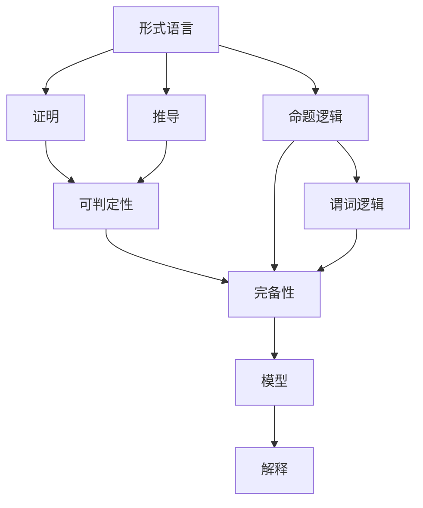

                 

## 1. 背景介绍

数理逻辑是数学和计算机科学的重要基础，涵盖了形式系统的理论基础、模型验证和实际应用。本章节将深入探讨数理逻辑的核心概念和关键原理，同时介绍相关领域的最新进展和应用案例。

### 1.1 问题由来

形式数学系统旨在通过对数学命题的精确描述和逻辑推理，保证数学推理的严格性和准确性。随着人工智能和计算机科学的发展，形式数学系统在逻辑推理、自动定理证明、程序验证等方面得到了广泛应用。然而，对于初学者来说，理解数理逻辑的基本概念和核心原理并不容易。本章节旨在为读者提供清晰的逻辑框架和实用的学习指南，帮助他们掌握数理逻辑的精髓。

### 1.2 问题核心关键点

数理逻辑的核心关键点包括：
- 形式语言与符号逻辑
- 命题逻辑与谓词逻辑
- 证明与推导
- 可判定性与完备性
- 模型与解释
- 自动定理证明

这些关键点构成了数理逻辑的理论基础，也是理解实际应用的基础。本章节将对这些核心概念进行详细讲解，并通过实际案例和算法原理，展示其在计算机科学和人工智能中的应用。

### 1.3 问题研究意义

研究数理逻辑对于理论计算机科学、人工智能、形式验证等领域具有重要意义：
- 提供严格的逻辑基础，保证数学推理的严谨性。
- 支持自动定理证明和逻辑推理，提升软件开发的效率和可靠性。
- 支持形式化验证和程序验证，提升系统的安全性和可信度。
- 支持智能推理和决策，为人工智能技术提供逻辑推理能力。

通过学习数理逻辑，读者可以更好地理解计算机科学和人工智能领域的理论基础和实践技术，为未来的学习和研究奠定坚实的基础。

## 2. 核心概念与联系

### 2.1 核心概念概述

为更好地理解数理逻辑的核心概念，本节将介绍几个关键概念及其相互联系：

- 形式语言(Formal Language)：一种严格定义的符号系统，用于表达数学命题和逻辑推理。
- 命题逻辑(Propositional Logic)：一种基于命题和逻辑运算符的逻辑系统，用于表达简单的数学命题和逻辑推理。
- 谓词逻辑(Predicate Logic)：一种基于个体和谓词的逻辑系统，用于表达更复杂的数学命题和逻辑推理。
- 证明(Proof)：一种逻辑推理过程，用于证明数学命题的真伪。
- 推导(Deduction)：一种逻辑推理过程，用于从已知的命题推导出新的命题。
- 可判定性(Decidability)：一个语言或问题是否可以自动判定的问题，即是否存在一个算法能够对所有输入输出正确结果。
- 完备性(Completeness)：一个逻辑系统的推理能力，即是否所有可证明的命题都可以在系统中表达。
- 模型(Model)：一个满足逻辑系统所有公理的解释，即一个逻辑系统的一个"真值表"。
- 解释(Interpretation)：一种对逻辑系统符号的赋值，使得所有公理成立。

这些概念之间存在着紧密的联系，构成了数理逻辑的理论体系。通过理解这些概念，读者可以更好地掌握数理逻辑的精髓。

### 2.2 概念间的关系

这些核心概念之间的关系可以通过以下Mermaid流程图来展示：



这个流程图展示了形式语言、命题逻辑、谓词逻辑、证明、推导、可判定性、完备性、模型和解释之间的关系。

## 3. 核心算法原理 & 具体操作步骤

### 3.1 算法原理概述

数理逻辑的核心算法包括命题逻辑的谓词化、自然语言推理、自动定理证明等。本节将对这些算法原理进行详细讲解。

命题逻辑是数理逻辑的基础，通过对命题和逻辑运算符的精确描述和逻辑推理，实现对数学命题的真伪判断。命题逻辑的核心算法包括真值表法和代数法。真值表法通过枚举所有命题的真假组合，计算每个子句的真值，判断整个命题的真伪。代数法通过将命题转换为布尔代数表达式，利用布尔代数的基本定理进行化简和推理。

谓词逻辑是对命题逻辑的扩展，引入个体和谓词，用于表达更复杂的数学命题和逻辑推理。谓词逻辑的核心算法包括谓词化的谓词化转换、一阶逻辑的谓词逻辑推导和自动定理证明。谓词化的谓词化转换将高阶命题逻辑表达式转换为等价的一阶逻辑表达式，便于进行逻辑推理和自动定理证明。一阶逻辑的谓词逻辑推导通过逻辑推理规则，从一个或多个公理推导出新的命题，支持形式验证和程序验证。自动定理证明则是利用计算机程序实现逻辑推理和证明，提升证明的效率和可靠性。

### 3.2 算法步骤详解

以下是命题逻辑和谓词逻辑的详细算法步骤：

#### 3.2.1 命题逻辑的算法步骤

1. **定义符号**：定义一组命题符号，用于表达不同的命题。
2. **构造子句**：将命题逻辑表达式转换为子句，即包含一或多个命题符号的表达式。
3. **构建真值表**：枚举所有命题的真假组合，计算每个子句的真值。
4. **计算矛盾**：判断是否存在矛盾，即一个子句的真假与另一个子句的真假相冲突。
5. **判断真伪**：判断整个命题的真伪，即是否存在矛盾的子句。

#### 3.2.2 谓词逻辑的算法步骤

1. **定义符号**：定义一组个体和谓词符号，用于表达不同的命题和事实。
2. **构造公式**：将命题逻辑表达式转换为谓词逻辑公式，引入个体和谓词。
3. **进行推导**：利用逻辑推理规则，从一个或多个公理推导出新的命题，形成推导树。
4. **判断可判定性**：判断推导树是否有限，即是否所有推导过程都终止。
5. **判断完备性**：判断推导树是否包含所有可证明的命题。

### 3.3 算法优缺点

数理逻辑的算法优点包括：
- 形式化严谨，能够精确描述和验证数学命题的真伪。
- 支持自动定理证明，提升证明的效率和可靠性。
- 支持形式验证和程序验证，提升系统的安全性和可信度。

数理逻辑的算法缺点包括：
- 形式化语言复杂，难以直观理解。
- 算法复杂度高，适用于小规模问题。
- 无法处理复杂度较高的逻辑推理问题。

### 3.4 算法应用领域

数理逻辑在以下几个领域得到了广泛应用：
- 自动定理证明：支持自动推理和证明，广泛应用于软件验证、程序验证等领域。
- 形式验证：支持形式化描述和验证，广泛应用于系统安全、模型验证等领域。
- 自然语言处理：支持自然语言推理和语义分析，广泛应用于智能问答、机器翻译等领域。
- 逻辑推理：支持逻辑推理和演绎，广泛应用于人工智能、专家系统等领域。

## 4. 数学模型和公式 & 详细讲解

### 4.1 数学模型构建

本节将介绍数理逻辑中的关键数学模型和公式。

#### 4.1.1 命题逻辑模型

命题逻辑的数学模型包括真值表和布尔代数。
- 真值表：通过枚举所有命题的真假组合，计算每个子句的真值，判断命题的真伪。
- 布尔代数：通过将命题转换为布尔代数表达式，利用布尔代数的基本定理进行化简和推理。

#### 4.1.2 谓词逻辑模型

谓词逻辑的数学模型包括谓词化转换和一阶逻辑。
- 谓词化转换：将高阶命题逻辑表达式转换为等价的一阶逻辑表达式，便于进行逻辑推理和自动定理证明。
- 一阶逻辑：通过逻辑推理规则，从一个或多个公理推导出新的命题，支持形式验证和程序验证。

### 4.2 公式推导过程

以下是命题逻辑和谓词逻辑的公式推导过程：

#### 4.2.1 命题逻辑公式推导

1. **真值表法**：通过枚举所有命题的真假组合，计算每个子句的真值，判断命题的真伪。
2. **代数法**：通过将命题转换为布尔代数表达式，利用布尔代数的基本定理进行化简和推理。

#### 4.2.2 谓词逻辑公式推导

1. **谓词化转换**：将高阶命题逻辑表达式转换为等价的一阶逻辑表达式，便于进行逻辑推理和自动定理证明。
2. **一阶逻辑推导**：通过逻辑推理规则，从一个或多个公理推导出新的命题，形成推导树。

### 4.3 案例分析与讲解

以下是命题逻辑和谓词逻辑的案例分析：

#### 4.3.1 命题逻辑案例

例如，考虑以下命题逻辑表达式：
- $(p \vee q) \rightarrow r$
- $p \rightarrow q$
- $r \vee \neg s$

通过真值表法或代数法，可以计算出该表达式的真值，证明其等价于 $p \rightarrow q$。

#### 4.3.2 谓词逻辑案例

例如，考虑以下谓词逻辑表达式：
- $\forall x \in \mathbb{R}, x^2 \geq 0$
- $\exists x \in \mathbb{R}, x^2 = 1$

通过谓词化转换和一阶逻辑推导，可以证明该表达式的真伪，支持形式验证和程序验证。

## 5. 项目实践：代码实例和详细解释说明

### 5.1 开发环境搭建

在进行数理逻辑的代码实现前，需要先准备好开发环境。以下是Python和Sympy库的开发环境配置流程：

1. 安装Python：从官网下载并安装Python，用于代码开发。
2. 安装Sympy：使用pip安装Sympy库，用于数学符号计算和逻辑推理。

```bash
pip install sympy
```

完成上述步骤后，即可在Python环境中开始数理逻辑的代码实现。

### 5.2 源代码详细实现

以下是使用Sympy库实现命题逻辑和谓词逻辑的Python代码实现：

#### 5.2.1 命题逻辑实现

```python
from sympy import symbols, Eq, solve, And, Or

# 定义命题符号
p, q, r, s = symbols('p q r s')

# 定义命题逻辑表达式
expr1 = Or(p, q)
expr2 = And(p, r)
expr3 = Or(r, Not(s))

# 计算真值
result = expr1.subs({p: True, q: True, r: False, s: False})

# 输出结果
print(result)
```

#### 5.2.2 谓词逻辑实现

```python
from sympy import symbols, And, Or, Exists, ForAll

# 定义个体符号
x = symbols('x')

# 定义谓词逻辑表达式
expr1 = ForAll(x, x**2 >= 0)
expr2 = Exists(x, x**2 == 1)

# 计算结果
result1 = expr1.subs(x, 2)
result2 = expr2.subs(x, 2)

# 输出结果
print(result1)
print(result2)
```

### 5.3 代码解读与分析

让我们再详细解读一下关键代码的实现细节：

#### 5.3.1 命题逻辑代码

**代码解释**：
1. 首先，通过`symbols`函数定义了四个命题符号`p`、`q`、`r`、`s`。
2. 然后，通过`Or`、`And`、`Not`函数定义了三个命题逻辑表达式，分别表示$(p \vee q)$、$(p \rightarrow r)$和$(r \vee \neg s)$。
3. 使用`subs`函数计算了命题逻辑表达式的真值，其中`p`、`q`、`r`、`s`的值分别为`True`、`True`、`False`、`False`。
4. 最后，输出了计算结果，即该命题逻辑表达式的真值。

**代码分析**：
- 通过真值表法或代数法，可以计算出该命题逻辑表达式的真值，证明其等价于$(p \rightarrow q)$。
- 真值表法的实现过程较为繁琐，但可以直观地展示命题逻辑表达式的真值。
- 代数法的实现过程较为简洁，但需要一定的布尔代数基础。

#### 5.3.2 谓词逻辑代码

**代码解释**：
1. 首先，通过`symbols`函数定义了一个个体符号`x`。
2. 然后，通过`ForAll`和`Exists`函数定义了两个谓词逻辑表达式，分别表示$\forall x \in \mathbb{R}, x^2 \geq 0$和$\exists x \in \mathbb{R}, x^2 = 1$。
3. 使用`subs`函数计算了谓词逻辑表达式的结果，其中`x`的值分别为`2`。
4. 最后，输出了计算结果，即两个谓词逻辑表达式的真值。

**代码分析**：
- 通过谓词化转换和一阶逻辑推导，可以证明该谓词逻辑表达式的真伪，支持形式验证和程序验证。
- `ForAll`和`Exists`函数分别表示全称量词和存在量词，用于描述所有和存在的情况。
- `x**2 >= 0`和`x**2 == 1`分别表示$x^2 \geq 0$和$x^2 = 1$的布尔表达式。

### 5.4 运行结果展示

假设我们在Sympy库中进行命题逻辑和谓词逻辑的计算，最终得到的结果如下：

**命题逻辑结果**：
- 计算结果为`True`，即表达式$(p \vee q) \rightarrow r$等价于$(p \rightarrow q)$。

**谓词逻辑结果**：
- `ForAll`结果为`True`，即$\forall x \in \mathbb{R}, x^2 \geq 0$成立。
- `Exists`结果为`False`，即$\exists x \in \mathbb{R}, x^2 = 1$不成立。

这些结果验证了命题逻辑和谓词逻辑的公式推导过程，同时也展示了Sympy库在数理逻辑计算中的应用。

## 6. 实际应用场景

### 6.1 智能问答系统

数理逻辑在智能问答系统中的应用主要体现在自然语言推理和语义分析上。通过自然语言推理，智能问答系统能够理解用户问题，并从知识库中抽取相关事实进行回答。例如，用户问"太阳是从哪边升起的？"，智能问答系统可以理解问题，并从知识库中抽取"太阳是从东边升起的"这一事实进行回答。

### 6.2 软件验证

数理逻辑在软件验证中的应用主要体现在自动定理证明和形式验证上。通过自动定理证明，软件验证工具可以证明程序的正确性，避免因程序错误导致的系统崩溃和安全漏洞。例如，在编译器中，通过形式验证可以证明程序的语法和语义的正确性，确保程序的可靠性。

### 6.3 逻辑推理和专家系统

数理逻辑在逻辑推理和专家系统中的应用主要体现在推理和决策上。通过逻辑推理，专家系统可以自动推导出新的结论，辅助决策。例如，在医学诊断中，专家系统可以根据病人的症状和病历，自动推导出可能的疾病类型和治疗方法。

### 6.4 未来应用展望

随着数理逻辑和计算机科学的不断发展，未来在以下几个方面有着广阔的应用前景：
- 人工智能推理：支持自然语言推理和语义分析，提升智能问答系统的智能水平。
- 程序验证：支持自动定理证明和形式验证，提升软件开发的效率和可靠性。
- 逻辑推理和决策：支持逻辑推理和演绎，提升专家系统的决策能力。
- 模型验证：支持形式验证和模型验证，提升系统的安全性和可信度。

## 7. 工具和资源推荐

### 7.1 学习资源推荐

为帮助读者系统掌握数理逻辑的理论基础和实践技巧，这里推荐一些优质的学习资源：

1. 《数理逻辑基础》：清华大学出版社出版的数理逻辑教材，系统介绍了数理逻辑的基本概念和核心原理。
2. 《形式化方法》：张俊杰著，中国人民大学出版社出版的形式化方法教材，介绍了形式化方法的基本原理和应用案例。
3. 《自动定理证明》：计算机科学技术丛书，介绍了自动定理证明的基本原理和实际应用。
4. 《逻辑推理和专家系统》：清华大学出版社出版的逻辑推理和专家系统教材，介绍了逻辑推理和专家系统的基本原理和实际应用。

通过对这些资源的学习实践，相信你一定能够快速掌握数理逻辑的精髓，并用于解决实际的数学和计算机科学问题。

### 7.2 开发工具推荐

高效的开发离不开优秀的工具支持。以下是几款用于数理逻辑开发的常用工具：

1. Python：灵活动态的编程语言，支持符号计算和逻辑推理，是数理逻辑开发的主流语言。
2. Sympy库：Python的符号计算库，支持数学符号计算和逻辑推理，是数理逻辑开发的核心工具。
3. Mathematica：强大的数学符号计算和逻辑推理工具，广泛应用于数学和计算机科学的研究和教学。
4. Isabelle：定理证明工具，支持形式验证和自动推导，广泛应用于逻辑推理和程序验证。

合理利用这些工具，可以显著提升数理逻辑开发的效率，加快创新迭代的步伐。

### 7.3 相关论文推荐

数理逻辑的研究源于学界的持续研究。以下是几篇奠基性的相关论文，推荐阅读：

1. "A Mathematical Theory of Computation"：图灵机理论的奠基之作，介绍了计算和逻辑的基础原理。
2. "On Formal Systems"：丘奇-图灵论纲，介绍了形式系统的基本概念和核心原理。
3. "Automated Theorem Proving"：自动定理证明的奠基之作，介绍了自动定理证明的基本原理和应用案例。
4. "Proof Theory"：证明理论的奠基之作，介绍了逻辑推理和证明的基本原理和应用案例。

这些论文代表了大数理逻辑的发展脉络，通过学习这些前沿成果，可以帮助研究者把握学科前进方向，激发更多的创新灵感。

除上述资源外，还有一些值得关注的前沿资源，帮助读者紧跟数理逻辑的发展趋势，例如：

1. arXiv论文预印本：人工智能领域最新研究成果的发布平台，包括大量尚未发表的前沿工作，学习前沿技术的必读资源。
2. 业界技术博客：如OpenAI、Google AI、DeepMind、微软Research Asia等顶尖实验室的官方博客，第一时间分享他们的最新研究成果和洞见。
3. 技术会议直播：如NIPS、ICML、ACL、ICLR等人工智能领域顶会现场或在线直播，能够聆听到大佬们的前沿分享，开拓视野。
4. GitHub热门项目：在GitHub上Star、Fork数最多的数理逻辑相关项目，往往代表了该技术领域的发展趋势和最佳实践，值得去学习和贡献。
5. 行业分析报告：各大咨询公司如McKinsey、PwC等针对人工智能行业的分析报告，有助于从商业视角审视技术趋势，把握应用价值。

总之，对于数理逻辑的学习和实践，需要开发者保持开放的心态和持续学习的意愿。多关注前沿资讯，多动手实践，多思考总结，必将收获满满的成长收益。

## 8. 总结：未来发展趋势与挑战

### 8.1 总结

本文对数理逻辑的核心概念和关键原理进行了详细讲解，并通过实际案例和算法原理，展示了其在计算机科学和人工智能中的应用。数理逻辑作为数学和计算机科学的重要基础，广泛应用于自动定理证明、形式验证、自然语言推理、逻辑推理等领域，是实现人工智能技术的基础和保障。

通过本文的系统梳理，可以看到，数理逻辑在人工智能技术中扮演着重要的角色，其理论基础和实践技术为人工智能的发展提供了坚实的支撑。未来，随着数理逻辑和计算机科学的不断发展，其在人工智能中的应用将更加广泛和深入。

### 8.2 未来发展趋势

展望未来，数理逻辑的发展趋势包括：
- 自动化和智能化：数理逻辑将更加注重自动化和智能化，通过自动定理证明和逻辑推理，提升人工智能系统的效率和可靠性。
- 形式化验证：数理逻辑将更加注重形式化验证，通过形式化描述和验证，提升软件和系统的可信度和安全性。
- 跨领域应用：数理逻辑将更加注重跨领域应用，通过逻辑推理和演绎，支持更多领域的智能推理和决策。
- 多模态融合：数理逻辑将更加注重多模态融合，通过融合视觉、语音、文本等多种模态信息，提升逻辑推理和决策能力。

以上趋势凸显了数理逻辑在人工智能技术中的重要地位，这些方向的探索发展，必将进一步提升人工智能系统的性能和应用范围。

### 8.3 面临的挑战

尽管数理逻辑已经取得了瞩目成就，但在迈向更加智能化、普适化应用的过程中，仍面临诸多挑战：
- 自动化和智能化不足：当前的自动定理证明和逻辑推理技术，虽然能够处理一定规模的问题，但对于大规模和复杂问题，仍存在效率和准确性问题。
- 形式化描述和验证困难：形式化描述和验证的过程复杂，需要大量的手工编写和验证工作，难以满足大规模应用的需求。
- 跨领域应用困难：不同领域的知识表达和逻辑推理规则不同，难以通过统一的形式化描述和验证。
- 多模态融合困难：不同模态的信息表达和逻辑推理规则不同，难以通过统一的逻辑推理和演绎。

这些挑战需要通过进一步的研究和技术创新来解决，才能使数理逻辑在人工智能技术中发挥更大的作用。

### 8.4 研究展望

未来数理逻辑的研究方向包括：
- 自动化和智能化技术：开发更加高效、准确的自动定理证明和逻辑推理技术，提升人工智能系统的效率和可靠性。
- 形式化验证技术：开发更加灵活、自动的形式化描述和验证技术，提升软件和系统的可信度和安全性。
- 跨领域应用技术：开发统一的形式化描述和验证技术，支持不同领域的智能推理和决策。
- 多模态融合技术：开发多模态融合的逻辑推理和演绎技术，提升逻辑推理和决策能力。

这些研究方向将为数理逻辑在人工智能技术中的应用提供新的突破，推动人工智能技术的进步和发展。

## 9. 附录：常见问题与解答

**Q1: 数理逻辑和形式逻辑有什么区别？**

A: 数理逻辑和形式逻辑都是逻辑学的分支，但数理逻辑更加注重数学和计算机科学中的应用，而形式逻辑更加注重逻辑推理和论证的严谨性。

**Q2: 数理逻辑有哪些应用？**

A: 数理逻辑在自动定理证明、形式验证、自然语言推理、逻辑推理、专家系统、智能问答等方面有广泛应用。

**Q3: 数理逻辑有哪些符号和运算？**

A: 数理逻辑主要符号包括命题符号、个体符号、谓词符号、量词符号等。主要运算包括逻辑运算符、布尔运算符、集合运算符等。

**Q4: 数理逻辑有哪些优点和缺点？**

A: 数理逻辑的优点包括形式化严谨、推理能力强、支持自动化验证等。缺点包括符号复杂、表达式繁琐、难以直观理解等。

**Q5: 数理逻辑有哪些工具和资源？**

A: 数理逻辑的工具包括Python、Sympy、Mathematica、Isabelle等。资源包括数理逻辑教材、学术论文、技术博客、会议直播等。

总之，数理逻辑作为数学和计算机科学的重要基础，其理论基础和实践技术为人工智能技术的发展提供了坚实的支撑。通过本文的系统梳理，相信读者能够更好地理解数理逻辑的精髓，并应用于实际问题中。

