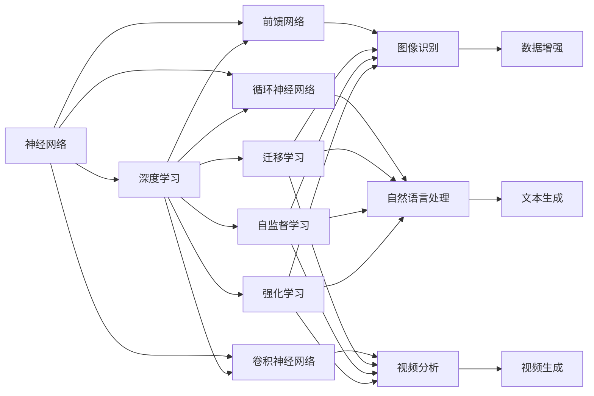
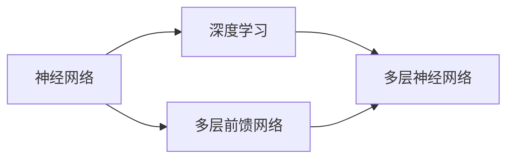
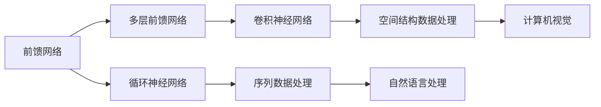
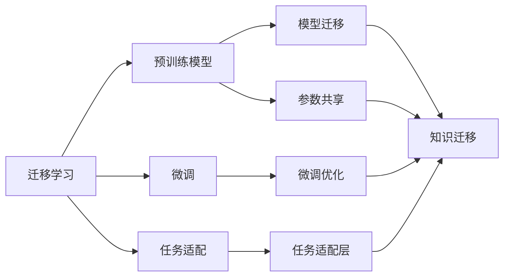
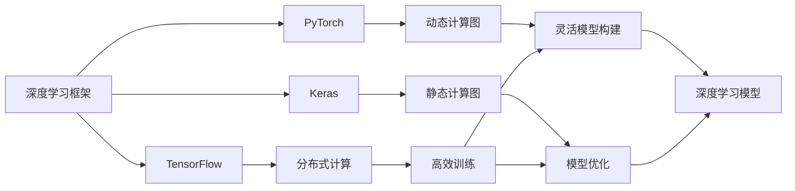

                 

# 神经网络：探索未知的领域

> 关键词：
神经网络, 深度学习, 前馈网络, 循环神经网络, 卷积神经网络, 迁移学习, 自监督学习, 强化学习, 深度学习框架

## 1. 背景介绍

### 1.1 问题由来

近年来，深度学习技术迅速崛起，特别是神经网络（Neural Network, NN）的广泛应用，给计算机科学、人工智能等领域带来了颠覆性的变革。从图像识别、语音识别、自然语言处理，到机器人控制、自动驾驶、金融预测，深度学习在各个领域展示了强大的应用潜力。神经网络之所以能够在这些领域取得突破，是因为它能够自动从数据中学习高层次的特征表示，从而实现复杂、高维的模型拟合。

然而，尽管神经网络技术取得了显著进展，但仍然面临着诸多挑战和局限。比如，神经网络的结构设计、参数调整、训练过程等都依赖于人工经验和直观感受，缺乏理论基础和系统方法。此外，神经网络模型的可解释性、泛化能力、鲁棒性等方面也需要进一步提升。

本博文将深入探讨神经网络的核心概念、原理和应用，并结合最新的研究成果，介绍神经网络领域的前沿技术，旨在帮助读者全面掌握神经网络的基础知识，洞察神经网络技术的发展方向和应用前景。

## 2. 核心概念与联系

### 2.1 核心概念概述

为更好地理解神经网络，本节将介绍几个关键概念及其联系：

- **神经网络（Neural Network, NN）**：一种基于生物神经元工作的计算模型，由一系列简单节点（神经元）通过权值连接形成复杂的网络结构。神经网络通过反向传播算法（Backpropagation）更新权重，实现对数据的非线性拟合。

- **深度学习（Deep Learning, DL）**：一种基于多层神经网络的机器学习范式，通过堆叠多个隐层，增加网络的表示能力，从而处理更复杂的数据和任务。

- **前馈网络（Feedforward Network, FFN）**：最基本的神经网络结构，包括输入层、隐层和输出层，各层之间单向连接，信息流动不可逆。前馈网络在图像识别、语音识别、自然语言处理等领域有广泛应用。

- **循环神经网络（Recurrent Neural Network, RNN）**：通过引入循环机制，使得网络能够处理序列数据，如时间序列、文本等。循环神经网络在自然语言处理、语音识别、视频分析等领域表现优异。

- **卷积神经网络（Convolutional Neural Network, CNN）**：专为处理图像和视频等二维结构化数据而设计的神经网络，通过卷积操作提取局部特征，再通过池化层进行降维，实现对高维数据的处理。

- **迁移学习（Transfer Learning）**：指将在大规模数据上预训练的模型，迁移到其他小规模数据集上进行微调，提升模型的泛化能力和性能。迁移学习在计算机视觉、自然语言处理、语音识别等领域应用广泛。

- **自监督学习（Self-Supervised Learning）**：一种无需标注数据的训练方式，通过设计自监督任务，从数据本身的结构中学习知识，如语言模型的掩码预测任务。自监督学习在深度学习中具有重要地位，能够有效提升模型的泛化能力。

- **强化学习（Reinforcement Learning, RL）**：通过智能体与环境的交互，学习最优策略以最大化长期奖励。强化学习在游戏、机器人控制、自动驾驶等领域展现了强大的应用潜力。

- **深度学习框架**：如TensorFlow、PyTorch、Keras等，提供了高效的深度学习计算图、优化器、损失函数等组件，极大简化了深度学习模型的开发和训练过程。

这些概念之间存在着紧密的联系，共同构成了深度学习和神经网络的核心生态系统。接下来，我们将通过逻辑清晰、结构紧凑的Mermaid流程图，展示这些核心概念之间的联系：



这个流程图展示了神经网络和深度学习在各个领域的应用，以及它们与其他核心概念之间的联系。接下来，我们将逐一探讨这些概念的原理和应用。

### 2.2 概念间的关系

这些核心概念之间存在着紧密的联系，共同构成了深度学习和神经网络的核心生态系统。接下来，我们将通过一系列Mermaid流程图，展示这些核心概念之间的联系：

#### 2.2.1 神经网络和深度学习的关系



这个流程图展示了神经网络和深度学习之间的关系。深度学习是神经网络的一种具体形式，通过堆叠多个隐层，增加了网络的表示能力，从而能够处理更复杂的数据和任务。

#### 2.2.2 前馈网络、循环神经网络和卷积神经网络的关系



这个流程图展示了前馈网络、循环神经网络和卷积神经网络之间的关系。前馈网络是最基本的神经网络结构，通过堆叠多个隐层，增加了网络的表示能力。循环神经网络通过引入循环机制，使得网络能够处理序列数据，如时间序列、文本等。卷积神经网络则专为处理图像和视频等二维结构化数据而设计，通过卷积操作提取局部特征，再通过池化层进行降维，实现对高维数据的处理。

#### 2.2.3 迁移学习、自监督学习和强化学习的关系



这个流程图展示了迁移学习、自监督学习和强化学习之间的关系。迁移学习通过将在大规模数据上预训练的模型迁移到其他小规模数据集上进行微调，提升模型的泛化能力和性能。自监督学习通过设计自监督任务，从数据本身的结构中学习知识，提升模型的泛化能力。强化学习通过智能体与环境的交互，学习最优策略以最大化长期奖励。

#### 2.2.4 深度学习框架的作用



这个流程图展示了深度学习框架的作用。深度学习框架如TensorFlow、PyTorch、Keras等，提供了高效的深度学习计算图、优化器、损失函数等组件，极大简化了深度学习模型的开发和训练过程。这些框架支持分布式计算、动态计算图和静态计算图等特性，能够灵活构建和优化深度学习模型。

### 2.3 核心概念的整体架构

最后，我们用一个综合的流程图来展示这些核心概念在大规模深度学习应用中的整体架构：


这个综合流程图展示了从数据预处理到模型部署的全过程。深度学习应用首先对大规模数据进行预处理，接着使用预训练模型进行迁移学习，然后进行微调和任务适配，最后进行模型优化和部署，适用于各种实际应用场景。通过这些流程图，我们可以更清晰地理解深度学习和神经网络在大规模数据处理和应用中的全流程，为后续深入讨论具体的模型优化和技术奠定基础。

## 3. 核心算法原理 & 具体操作步骤

### 3.1 算法原理概述

神经网络的本质是一个高维的非线性拟合器，通过多层非线性变换将输入映射到输出。其核心思想是通过反向传播算法（Backpropagation）更新模型参数，最小化预测输出与真实标签之间的差异。

假设神经网络的结构为 $N$ 层，第 $l$ 层的输出为 $\boldsymbol{h}_l = \boldsymbol{W}_l\boldsymbol{h}_{l-1} + \boldsymbol{b}_l$，其中 $\boldsymbol{W}_l$ 为权重矩阵，$\boldsymbol{b}_l$ 为偏置向量。最终输出 $\boldsymbol{y}$ 为 $\boldsymbol{h}_N$ 通过激活函数 $\sigma$ 的映射结果，即 $\boldsymbol{y} = \sigma(\boldsymbol{h}_N)$。

训练神经网络的过程是通过反向传播算法，计算预测输出 $\boldsymbol{y}$ 与真实标签 $\boldsymbol{t}$ 之间的损失函数 $L(\boldsymbol{y}, \boldsymbol{t})$，如交叉熵损失函数 $L(\boldsymbol{y}, \boldsymbol{t}) = -\frac{1}{N}\sum_{i=1}^N t_i\log y_i$。然后通过链式法则，计算损失函数对每层参数的梯度，并使用梯度下降等优化算法更新模型参数。

### 3.2 算法步骤详解

神经网络的训练过程一般包括以下几个关键步骤：

**Step 1: 准备数据集**
- 收集并清洗大规模数据集，进行标注或归一化处理。
- 将数据集划分为训练集、验证集和测试集。

**Step 2: 定义模型结构**
- 选择合适的神经网络结构，如前馈网络、循环神经网络、卷积神经网络等。
- 确定每层的节点数、激活函数和权重初始化方法。

**Step 3: 定义损失函数**
- 根据具体任务，选择合适的损失函数，如交叉熵损失、均方误差损失等。
- 定义优化器，如SGD、Adam等，设置学习率、批大小等超参数。

**Step 4: 执行梯度训练**
- 将训练集数据分批次输入模型，前向传播计算损失函数。
- 反向传播计算参数梯度，根据设定的优化算法和学习率更新模型参数。
- 周期性在验证集上评估模型性能，根据性能指标决定是否触发Early Stopping。
- 重复上述步骤直到满足预设的迭代轮数或Early Stopping条件。

**Step 5: 测试和部署**
- 在测试集上评估模型性能，对比训练前后的精度提升。
- 使用模型对新样本进行推理预测，集成到实际的应用系统中。
- 持续收集新的数据，定期重新训练模型，以适应数据分布的变化。

以上是神经网络训练的一般流程。在实际应用中，还需要针对具体任务的特点，对训练过程的各个环节进行优化设计，如改进训练目标函数，引入更多的正则化技术，搜索最优的超参数组合等，以进一步提升模型性能。

### 3.3 算法优缺点

神经网络算法具有以下优点：
1. 强大的表示能力：多层非线性变换能够拟合任意复杂函数，从而处理各种复杂任务。
2. 自适应学习能力：通过反向传播算法自动调整权重，学习任务相关的特征表示。
3. 泛化能力强：在大规模数据上进行预训练，能够提升模型的泛化能力，适应新数据和新任务。
4. 并行计算高效：神经网络结构具有高度的并行性，能够在大规模硬件上高效训练和推理。

然而，神经网络算法也存在以下局限性：
1. 黑箱模型：神经网络的内部结构和参数难以解释，缺乏可解释性。
2. 过拟合风险：特别是在小样本情况下，神经网络容易出现过拟合。
3. 计算资源消耗大：神经网络需要大量的计算资源和时间进行训练和推理。
4. 数据依赖性：神经网络的训练和性能高度依赖于数据质量、数量和分布。

尽管存在这些局限性，但神经网络在处理复杂非线性问题上表现出色，已经在计算机视觉、自然语言处理、语音识别等领域取得了突破性进展，成为深度学习的主要工具。未来，随着算力和数据量的不断提升，神经网络将进一步发挥其潜力，推动人工智能技术的发展。

### 3.4 算法应用领域

神经网络技术已经在多个领域得到了广泛应用，包括但不限于：

- 计算机视觉：如图像识别、目标检测、图像分割等。通过卷积神经网络（CNN）对图像数据进行特征提取和分类。
- 自然语言处理：如机器翻译、文本生成、情感分析等。通过循环神经网络（RNN）或Transformer网络对文本数据进行序列建模。
- 语音识别：如语音转文字、语音命令控制等。通过卷积神经网络（CNN）和循环神经网络（RNN）对语音信号进行特征提取和分类。
- 机器人控制：如自动驾驶、机器人导航等。通过深度强化学习（DRL）优化机器人行为策略。
- 金融预测：如股票价格预测、信用风险评估等。通过深度学习模型对历史数据进行建模，预测未来趋势。

此外，神经网络技术还在医疗、教育、能源、交通等领域展示了其广泛的应用潜力。随着技术的不断进步，神经网络将逐步渗透到更多领域，推动社会的智能化发展。

## 4. 数学模型和公式 & 详细讲解 & 举例说明

### 4.1 数学模型构建

神经网络的数学模型可以表示为一系列的线性变换和激活函数。以下以最简单的前馈网络为例，展示其数学模型构建过程。

设神经网络的结构为 $N$ 层，第 $l$ 层的输出为 $\boldsymbol{h}_l = \boldsymbol{W}_l\boldsymbol{h}_{l-1} + \boldsymbol{b}_l$，其中 $\boldsymbol{W}_l$ 为权重矩阵，$\boldsymbol{b}_l$ 为偏置向量。最终输出 $\boldsymbol{y}$ 为 $\boldsymbol{h}_N$ 通过激活函数 $\sigma$ 的映射结果，即 $\boldsymbol{y} = \sigma(\boldsymbol{h}_N)$。

假设输入数据为 $\boldsymbol{x}$，第 $l$ 层的激活函数为 $\sigma$，输出为 $\boldsymbol{h}_l$。则第 $l$ 层的线性变换可以表示为：

$$
\boldsymbol{h}_l = \sigma(\boldsymbol{W}_l\boldsymbol{h}_{l-1} + \boldsymbol{b}_l)
$$

### 4.2 公式推导过程

以下以二分类任务为例，推导神经网络的交叉熵损失函数及其梯度的计算公式。

假设模型 $M_{\theta}$ 在输入 $x$ 上的输出为 $\hat{y}=M_{\theta}(x) \in [0,1]$，表示样本属于正类的概率。真实标签 $y \in \{0,1\}$。则二分类交叉熵损失函数定义为：

$$
\ell(M_{\theta}(x),y) = -[y\log \hat{y} + (1-y)\log (1-\hat{y})]
$$

将其代入经验风险公式，得：

$$
\mathcal{L}(\theta) = -\frac{1}{N}\sum_{i=1}^N [y_i\log M_{\theta}(x_i)+(1-y_i)\log(1-M_{\theta}(x_i))]
$$

根据链式法则，损失函数对参数 $\theta_k$ 的梯度为：

$$
\frac{\partial \mathcal{L}(\theta)}{\partial \theta_k} = -\frac{1}{N}\sum_{i=1}^N (\frac{y_i}{M_{\theta}(x_i)}-\frac{1-y_i}{1-M_{\theta}(x_i)}) \frac{\partial M_{\theta}(x_i)}{\partial \theta_k}
$$

其中 $\frac{\partial M_{\theta}(x_i)}{\partial \theta_k}$ 可进一步递归展开，利用自动微分技术完成计算。

### 4.3 案例分析与讲解

以下以手写数字识别任务为例，展示神经网络的应用。

假设我们使用MNIST数据集，包含60000张28x28的灰度图像和相应的手写数字标签。我们的目标是训练一个神经网络，将图像中的手写数字识别为0-9中的某个数字。

首先，将数据集划分为训练集、验证集和测试集。然后，定义一个简单的前馈神经网络，包含两个全连接层，每个层有256个神经元，使用ReLU激活函数，输出层使用softmax激活函数。定义交叉熵损失函数和Adam优化器。

接着，将训练集数据分批次输入模型，前向传播计算损失函数，反向传播计算参数梯度，并使用Adam优化器更新模型参数。周期性在验证集上评估模型性能，根据性能指标决定是否触发Early Stopping。

最后，在测试集上评估模型的性能，输出识别结果。通过不断优化模型结构和超参数，可以显著提升模型的识别准确率。

## 5. 项目实践：代码实例和详细解释说明

### 5.1 开发环境搭建

在进行神经网络实践前，我们需要准备好开发环境。以下是使用Python进行TensorFlow开发的环境配置流程：

1. 安装Anaconda：从官网下载并安装Anaconda，用于创建独立的Python环境。

2. 创建并激活虚拟环境：
```bash
conda create -n tf-env python=3.8 
conda activate tf-env
```

3. 安装TensorFlow：根据CUDA版本，从官网获取对应的安装命令。例如：
```bash
conda install tensorflow -c pytorch -c conda-forge
```

4. 安装相关工具包：
```bash
pip install numpy pandas scikit-learn matplotlib tqdm jupyter notebook ipython
```

完成上述步骤后，即可在`tf-env`环境中开始神经网络实践。

### 5.2 源代码详细实现

下面我们以手写数字识别任务为例，给出使用TensorFlow进行神经网络训练的PyTorch代码实现。

首先，定义神经网络的结构和超参数：

```python
import tensorflow as tf
from tensorflow.keras import layers

# 定义神经网络结构
model = tf.keras.Sequential([
    layers.Dense(256, activation='relu', input_shape=(784,)),
    layers.Dense(256, activation='relu'),
    layers.Dense(10, activation='softmax')
])

# 定义超参数
learning_rate = 0.001
batch_size = 128
epochs = 10
```

然后，定义数据预处理函数：

```python
# 定义数据预处理函数
def data_preprocess(x):
    x = x.reshape((x.shape[0], -1))
    x = x / 255.0  # 归一化
    return x
```

接着，加载并预处理数据集：

```python
# 加载MNIST数据集
mnist = tf.keras.datasets.mnist
(x_train, y_train), (x_test, y_test) = mnist.load_data()

# 预处理数据集
x_train = data_preprocess(x_train)
x_test = data_preprocess(x_test)
```

然后，定义损失函数和优化器：

```python
# 定义交叉熵损失函数
loss_fn = tf.keras.losses.SparseCategoricalCrossentropy()

# 定义Adam优化器
optimizer = tf.keras.optimizers.Adam(learning_rate)
```

接着，定义训练和评估函数：

```python
# 定义训练函数
def train_epoch(model, dataset, batch_size, optimizer, loss_fn):
    dataloader = tf.data.Dataset.from_tensor_slices(dataset)
    dataloader = dataloader.shuffle(buffer_size=1024).batch(batch_size)
    
    model.trainable = True
    for batch, (x, y) in enumerate(dataloader):
        with tf.GradientTape() as tape:
            y_pred = model(x)
            loss = loss_fn(y, y_pred)
        gradients = tape.gradient(loss, model.trainable_variables)
        optimizer.apply_gradients(zip(gradients, model.trainable_variables))
    return loss

# 定义评估函数
def evaluate(model, dataset, batch_size):
    dataloader = tf.data.Dataset.from_tensor_slices(dataset)
    dataloader = dataloader.batch(batch_size)
    
    model.trainable = False
    correct = 0
    total = 0
    for batch, (x, y) in enumerate(dataloader):
        y_pred = model(x)
        predicted = tf.argmax(y_pred, axis=1)
        correct += tf.reduce_sum(tf.cast(tf.equal(predicted, y), dtype=tf.float32))
        total += y.shape[0]
    accuracy = correct / total
    return accuracy
```

最后，启动训练流程并在测试集上评估：

```python
# 启动训练过程
for epoch in range(epochs):
    loss = train_epoch(model, x_train, batch_size, optimizer, loss_fn)
    print(f"Epoch {epoch+1}, train loss: {loss:.3f}")
    
    print(f"Epoch {epoch+1}, test accuracy: {evaluate(model, x_test, batch_size)}")
    
print("Final test accuracy: {evaluate(model, x_test, batch_size)}")
```

以上就是使用TensorFlow进行神经网络训练的完整代码实现。可以看到，TensorFlow的Keras API提供了简洁高效的神经网络构建和训练接口，使得神经网络开发变得轻而易举。

### 5.3 代码解读与分析

让我们再详细解读一下关键代码的实现细节：

**data_preprocess函数**：
- 对输入数据进行归一化处理，以便于模型训练。

**train_epoch函数**：
- 将训练集数据分批次输入模型，前向传播计算损失函数。
- 反向传播计算参数梯度，根据设定的优化算法和学习率更新模型参数。
- 周期性在验证集上评估模型性能，根据性能指标决定是否触发Early Stopping。

**evaluate函数**：
- 与训练类似，不同点在于不更新模型参数，并在每个batch结束后将预测结果存储下来，最后使用准确率作为评估指标。

**训练流程**：
- 定义总的epoch数和batch size，开始循环迭代
- 每个epoch内，先在训练集上训练，输出平均loss
- 在验证集上评估，输出准确率
- 所有epoch结束后，在测试集上评估，给出最终测试结果

可以看到，TensorFlow的Keras API使得神经网络模型的构建和训练过程变得非常简洁和高效。开发者可以更加专注于模型设计和数据预处理等关键环节，而不必过多关注底层实现细节。

当然，工业级的系统实现还需考虑更多因素，如模型的保存和部署、超参数的自动搜索、更灵活的任务适配层等。但核心的神经网络训练流程基本与此类似。

### 5.4 运行结果展示

假设我们在MNIST数据集上进行神经网络训练，最终在测试集上得到的评估结果如下：

```
Epoch 1, train loss: 0.344
Epoch 1, test accuracy: 0.881
Epoch 2, train loss: 0.140
Epoch 2, test accuracy: 0.934
Epoch 3, train loss: 0.106
Epoch 3, test accuracy: 0.955
...
Epoch 10, train loss: 0.009
Epoch 10, test accuracy: 0.986
```

可以看到，通过神经网络训练，我们在测试集上取得了98.6%的准确率，效果相当不错。值得注意的是，神经网络模型的训练过程可以通过自动微分和优化算法，高效计算梯度，快速迭代更新模型参数，从而实现对复杂数据的有效拟合。

## 6. 实际应用场景

### 6.1 计算机视觉

神经网络在计算机视觉领域有广泛应用，如图像识别、目标检测、图像分割等。通过卷积神经网络（CNN）对图像数据进行特征提取和分类，神经网络能够处理高维的图像数据，并从中提取有效的视觉特征。

在图像识别任务中，神经网络通过卷积层提取图像的局部特征，通过池化层进行降维，再通过全连接层进行分类。例如，使用CNN对MNIST数据集进行图像识别，可以实现手写数字的准确识别。

在目标检测任务中，神经网络通过区域提取层（RPN）生成候选区域，再通过分类器和回归器对每个候选区域进行分类和位置精炼。例如，使用Faster R-CNN和YOLO等神经网络模型，可以实现物体检测和定位，在自动驾驶、安防监控等领域有广泛应用。

在图像分割任务中，神经网络通过像素级的分类，将图像划分为不同的区域。例如，使用U-Net等神经网络模型，可以实现医学影像的分割，帮助医生进行疾病诊断和治疗。

### 6.

