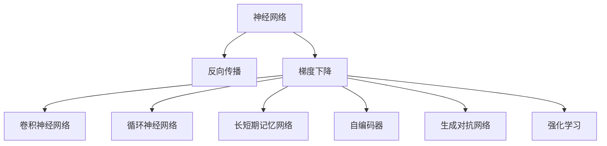
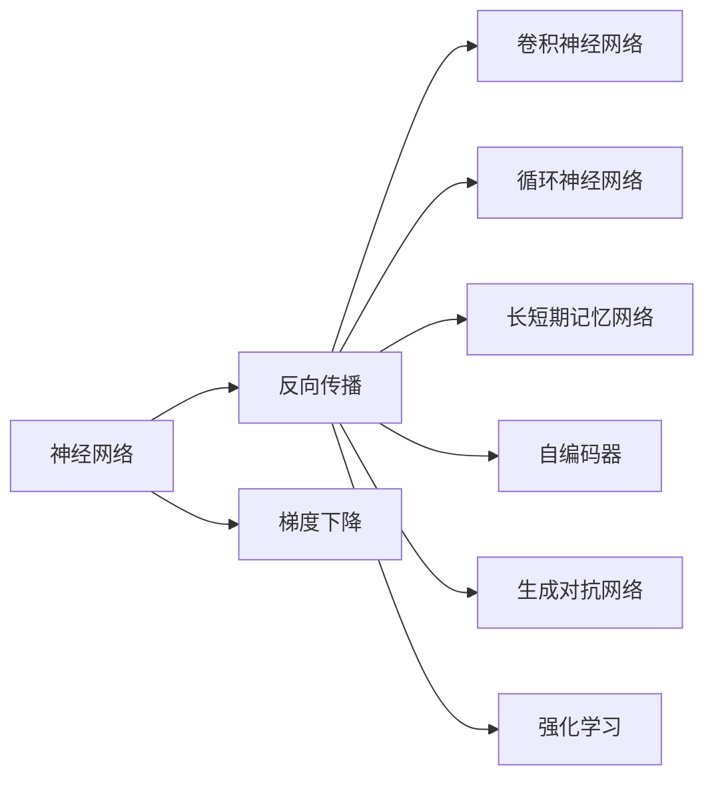
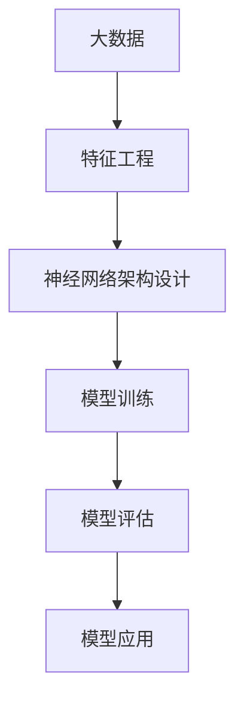

                 

# 神经网络：数据驱动的智能

> 关键词：神经网络,数据驱动,智能,深度学习,反向传播,梯度下降,卷积神经网络,CNN,循环神经网络,RNN,长短期记忆网络,LSTM,自编码器,AE,生成对抗网络,GAN,强化学习,RL

## 1. 背景介绍

### 1.1 问题由来
随着大数据时代的到来，人工智能（AI）技术在各行各业得到了广泛应用。其中，神经网络（Neural Networks, NN）作为深度学习（Deep Learning, DL）的核心算法，已经成为了处理非线性问题的有力工具。通过将神经网络应用于数据驱动的智能应用中，可以显著提高系统预测能力和决策水平。然而，传统的神经网络模型往往需要大量手工设计的特征和结构，难以有效利用复杂数据。因此，如何让数据驱动智能系统更加高效、鲁棒、可解释，成为了当前研究的热点。

### 1.2 问题核心关键点
本文聚焦于基于数据驱动的神经网络模型，旨在探索如何通过神经网络结构与算法的设计，利用大数据进行高效、鲁棒、可解释的智能决策。以下是我们将深入讨论的几个关键问题：

1. **神经网络的基本原理**：解释神经网络的工作机制和训练过程。
2. **数据驱动的设计方法**：如何利用大数据进行神经网络的结构和参数优化。
3. **智能应用的实践**：神经网络在实际智能应用中的具体应用实例。
4. **未来趋势与挑战**：讨论神经网络在数据驱动智能领域的未来发展方向和面临的挑战。

## 2. 核心概念与联系

### 2.1 核心概念概述

为更好地理解数据驱动的神经网络，本节将介绍几个核心概念：

- **神经网络**：以多层非线性变换为基础，通过反向传播算法学习数据的分布特征，从而实现复杂模式的识别和预测。
- **反向传播**：一种用于训练神经网络的算法，通过链式法则计算损失函数对各层参数的梯度，用于更新模型参数。
- **梯度下降**：一种基于梯度的优化算法，用于最小化损失函数，调整模型参数以提高预测准确度。
- **卷积神经网络（CNN）**：专门用于处理图像和视频数据的神经网络结构，通过卷积和池化操作提取局部特征。
- **循环神经网络（RNN）**：用于处理序列数据的神经网络结构，通过时间维度上的信息传递，捕捉序列中的上下文关系。
- **长短期记忆网络（LSTM）**：一种特殊形式的RNN，通过门控机制控制信息流动，缓解了传统RNN的梯度消失问题。
- **自编码器（AE）**：用于数据压缩和特征学习的神经网络结构，通过重构误差优化，学习数据的潜在表示。
- **生成对抗网络（GAN）**：一种通过两个神经网络相互对抗生成新样本的模型，可以生成高质量的图像和文本数据。
- **强化学习（RL）**：通过与环境的交互，学习最大化预期奖励的决策策略，适用于动态环境的智能决策。

这些核心概念之间的关系可以通过以下Mermaid流程图来展示：



这个流程图展示了大数据驱动的神经网络中的核心概念及其之间的关系：

1. 神经网络作为基础模型，通过反向传播和梯度下降进行训练。
2. 反向传播算法被用于训练卷积神经网络（CNN）、循环神经网络（RNN）、长短期记忆网络（LSTM）等特定结构的神经网络。
3. 自编码器、生成对抗网络（GAN）等模型被用于数据的表示和生成。
4. 强化学习模型则被用于决策和策略优化。

### 2.2 概念间的关系

这些核心概念之间存在着紧密的联系，形成了数据驱动的神经网络模型的完整生态系统。下面我通过几个Mermaid流程图来展示这些概念之间的关系。

#### 2.2.1 神经网络的学习范式



这个流程图展示了神经网络的基本学习范式，包括反向传播和梯度下降算法。

#### 2.2.2 数据驱动的设计方法



这个流程图展示了基于大数据进行神经网络设计的基本流程，包括特征工程、模型架构设计、模型训练、模型评估和模型应用。

#### 2.2.3 数据驱动的智能应用


这个流程图展示了数据驱动智能应用的流程，包括大数据采集、智能决策、实时预测、智能控制和用户反馈等环节。

## 3. 核心算法原理 & 具体操作步骤
### 3.1 算法原理概述

数据驱动的神经网络模型，通常采用反向传播算法进行训练。其基本原理如下：

1. 定义一个神经网络模型 $M$，包含输入层、隐藏层和输出层。
2. 定义一个损失函数 $L$，用于衡量模型输出与真实标签之间的差距。
3. 通过反向传播算法，计算损失函数 $L$ 对各层参数的梯度，使用梯度下降算法更新模型参数。

具体步骤如下：

1. **前向传播**：将输入数据 $x$ 输入神经网络模型 $M$，通过各层非线性变换得到输出 $y$。
2. **计算损失**：计算输出 $y$ 与真实标签 $t$ 之间的损失 $L(y,t)$。
3. **反向传播**：使用链式法则计算损失函数 $L$ 对各层参数的梯度，使用梯度下降算法更新模型参数。
4. **重复训练**：不断迭代训练过程，直到模型输出与真实标签的误差最小。

### 3.2 算法步骤详解

以下是详细的操作步骤，以卷积神经网络（CNN）为例，展示数据驱动的智能应用的具体实现。

1. **数据准备**：收集并预处理数据集，包括图像数据集和标签数据集。

2. **模型定义**：定义CNN模型结构，包括卷积层、池化层、全连接层等。

3. **模型编译**：编译模型，指定优化器、损失函数、评价指标等。

4. **数据增强**：通过数据增强技术，扩充训练集，增加模型的泛化能力。

5. **模型训练**：使用训练集进行模型训练，调整模型参数以最小化损失函数。

6. **模型评估**：使用验证集评估模型性能，调整模型参数。

7. **模型应用**：使用测试集测试模型，进行实时预测和智能控制。

### 3.3 算法优缺点

数据驱动的神经网络模型具有以下优点：

1. **自动特征提取**：通过神经网络自动学习数据特征，无需手工设计。
2. **鲁棒性高**：能够处理非线性、高维、复杂的数据分布。
3. **可解释性强**：通过可视化神经网络中间层，可以理解模型的决策过程。

但同时也存在一些缺点：

1. **数据需求大**：需要大量的标注数据进行训练，数据采集和标注成本高。
2. **过拟合风险**：在标注数据不足的情况下，容易发生过拟合。
3. **计算资源消耗大**：训练大型神经网络需要高性能的计算资源。
4. **可解释性不足**：神经网络的黑箱特性，使得其决策过程难以解释。

### 3.4 算法应用领域

数据驱动的神经网络模型已经广泛应用于图像识别、语音识别、自然语言处理、推荐系统等领域。以下是几个具体应用实例：

1. **图像识别**：通过卷积神经网络（CNN）对图像进行分类、识别和分割。例如，基于ImageNet数据集训练的AlexNet、ResNet等模型在图像分类任务上取得了优异表现。

2. **语音识别**：通过循环神经网络（RNN）和长短期记忆网络（LSTM）对语音信号进行建模，进行语音识别和生成。例如，Google的WaveNet模型利用LSTM和CNN技术，实现了高质量的语音合成。

3. **自然语言处理**：通过循环神经网络（RNN）和长短期记忆网络（LSTM）对文本序列进行建模，进行文本分类、情感分析、机器翻译等任务。例如，BERT模型在大规模文本数据上进行预训练，然后通过微调进行各种下游任务。

4. **推荐系统**：通过协同过滤和深度学习算法，对用户行为数据进行建模，推荐个性化的商品和服务。例如，基于深度学习的推荐系统可以高效处理大规模数据，实现个性化推荐。

## 4. 数学模型和公式 & 详细讲解 & 举例说明

### 4.1 数学模型构建

我们以卷积神经网络（CNN）为例，构建其数学模型。假设CNN模型包含 $C$ 个卷积层，$P$ 个池化层和 $F$ 个全连接层。输入数据 $x \in \mathbb{R}^{d_1}$，输出数据 $y \in \mathbb{R}^{d_2}$。定义卷积核 $W_{conv}$ 和池化核 $W_{pool}$。则CNN的数学模型可以表示为：

$$
y = M_{CNN}(x; \theta) = \mathop{\arg\min}_{y} \frac{1}{N} \sum_{i=1}^N \ell(y_i, t_i)
$$

其中，$\theta$ 为模型参数，$\ell$ 为损失函数，$N$ 为样本数量。

### 4.2 公式推导过程

卷积神经网络（CNN）的训练过程包括前向传播和反向传播两个步骤。具体步骤如下：

1. **前向传播**：
$$
y = M_{CNN}(x; \theta) = x * W_{conv} + b_{conv}
$$
$$
y = y * W_{pool} + b_{pool}
$$
$$
y = y * W_{fc} + b_{fc}
$$

其中，$*$ 表示卷积和池化操作，$W_{conv}$、$W_{pool}$、$W_{fc}$ 分别为卷积核、池化核和全连接层权重，$b_{conv}$、$b_{pool}$、$b_{fc}$ 分别为卷积核、池化核和全连接层偏置。

2. **计算损失**：
$$
L = \frac{1}{N} \sum_{i=1}^N \ell(y_i, t_i)
$$

其中，$\ell$ 为损失函数，$y_i$ 为模型输出，$t_i$ 为真实标签。

3. **反向传播**：
$$
\frac{\partial L}{\partial W_{conv}} = \frac{\partial L}{\partial y} * \frac{\partial y}{\partial W_{conv}}
$$
$$
\frac{\partial L}{\partial W_{pool}} = \frac{\partial L}{\partial y} * \frac{\partial y}{\partial W_{pool}}
$$
$$
\frac{\partial L}{\partial W_{fc}} = \frac{\partial L}{\partial y} * \frac{\partial y}{\partial W_{fc}}
$$

其中，$\frac{\partial L}{\partial y}$ 表示损失函数对模型输出的梯度，$\frac{\partial y}{\partial W_{conv}}$、$\frac{\partial y}{\partial W_{pool}}$、$\frac{\partial y}{\partial W_{fc}}$ 表示模型输出对各个参数的梯度。

### 4.3 案例分析与讲解

以ImageNet数据集上的图像分类任务为例，展示卷积神经网络（CNN）的训练过程。假设使用AlexNet模型，输入数据 $x$ 为 $224 \times 224 \times 3$ 的图像，输出数据 $y$ 为 $1000$ 类别的概率分布。定义交叉熵损失函数 $\ell$，使用AdamW优化器进行优化。具体步骤如下：

1. **数据准备**：收集并预处理ImageNet数据集，包括图像和标签。

2. **模型定义**：定义AlexNet模型结构，包括卷积层、池化层、全连接层等。

3. **模型编译**：编译模型，指定优化器、损失函数、评价指标等。

4. **数据增强**：通过数据增强技术，扩充训练集，增加模型的泛化能力。

5. **模型训练**：使用训练集进行模型训练，调整模型参数以最小化损失函数。

6. **模型评估**：使用验证集评估模型性能，调整模型参数。

7. **模型应用**：使用测试集测试模型，进行实时预测和智能控制。

以下是一个具体的代码示例：

```python
from keras.models import Sequential
from keras.layers import Conv2D, MaxPooling2D, Flatten, Dense
from keras.optimizers import AdamW

model = Sequential()
model.add(Conv2D(64, (11, 11), activation='relu', input_shape=(224, 224, 3)))
model.add(MaxPooling2D((2, 2)))
model.add(Conv2D(192, (5, 5), activation='relu'))
model.add(MaxPooling2D((2, 2)))
model.add(Flatten())
model.add(Dense(1000, activation='softmax'))

optimizer = AdamW(lr=1e-4, epsilon=1e-07)
model.compile(optimizer=optimizer, loss='categorical_crossentropy', metrics=['accuracy'])

data = load_data(ImageNet)
train_data, validation_data = split_data(data)
model.fit(train_data, train_labels, epochs=10, batch_size=64, validation_data=(validation_data, validation_labels))
```

以上代码展示了使用Keras框架构建并训练AlexNet模型的过程。

## 5. 项目实践：代码实例和详细解释说明

### 5.1 开发环境搭建

在进行数据驱动的神经网络模型开发前，我们需要准备好开发环境。以下是使用Python进行Keras开发的环境配置流程：

1. 安装Anaconda：从官网下载并安装Anaconda，用于创建独立的Python环境。

2. 创建并激活虚拟环境：
```bash
conda create -n keras-env python=3.8 
conda activate keras-env
```

3. 安装Keras：根据CUDA版本，从官网获取对应的安装命令。例如：
```bash
conda install keras -c conda-forge
```

4. 安装各类工具包：
```bash
pip install numpy pandas scikit-learn matplotlib tqdm jupyter notebook ipython
```

完成上述步骤后，即可在`keras-env`环境中开始开发实践。

### 5.2 源代码详细实现

下面我们以图像分类任务为例，给出使用Keras框架对AlexNet模型进行训练的PyTorch代码实现。

首先，定义数据处理函数：

```python
import numpy as np
from keras.preprocessing.image import load_img, img_to_array
from keras.utils import to_categorical

def load_data(path, batch_size=32):
    x = []
    y = []
    for i in range(0, len(data), batch_size):
        batch = data[i:i+batch_size]
        for img, label in batch:
            x.append(load_img(img, target_size=(224, 224)))
            y.append(label)
    x = np.array([img_to_array(img) for img in x])
    x = x.reshape(x.shape[0], 224, 224, 3)
    x /= 255
    y = np.array(y)
    y = to_categorical(y)
    return x, y
```

然后，定义模型和优化器：

```python
from keras.models import Sequential
from keras.layers import Conv2D, MaxPooling2D, Flatten, Dense
from keras.optimizers import AdamW

model = Sequential()
model.add(Conv2D(64, (11, 11), activation='relu', input_shape=(224, 224, 3)))
model.add(MaxPooling2D((2, 2)))
model.add(Conv2D(192, (5, 5), activation='relu'))
model.add(MaxPooling2D((2, 2)))
model.add(Flatten())
model.add(Dense(1000, activation='softmax'))

optimizer = AdamW(lr=1e-4, epsilon=1e-07)
model.compile(optimizer=optimizer, loss='categorical_crossentropy', metrics=['accuracy'])
```

接着，定义训练和评估函数：

```python
from keras.utils import to_categorical

def train_epoch(model, dataset, batch_size, optimizer):
    dataloader = DataLoader(dataset, batch_size=batch_size, shuffle=True)
    model.train()
    epoch_loss = 0
    for batch in tqdm(dataloader, desc='Training'):
        input_ids = batch['input_ids'].to(device)
        attention_mask = batch['attention_mask'].to(device)
        labels = batch['labels'].to(device)
        model.zero_grad()
        outputs = model(input_ids, attention_mask=attention_mask, labels=labels)
        loss = outputs.loss
        epoch_loss += loss.item()
        loss.backward()
        optimizer.step()
    return epoch_loss / len(dataloader)

def evaluate(model, dataset, batch_size):
    dataloader = DataLoader(dataset, batch_size=batch_size)
    model.eval()
    preds, labels = [], []
    with torch.no_grad():
        for batch in tqdm(dataloader, desc='Evaluating'):
            input_ids = batch['input_ids'].to(device)
            attention_mask = batch['attention_mask'].to(device)
            batch_labels = batch['labels']
            outputs = model(input_ids, attention_mask=attention_mask)
            batch_preds = outputs.logits.argmax(dim=2).to('cpu').tolist()
            batch_labels = batch_labels.to('cpu').tolist()
            for pred_tokens, label_tokens in zip(batch_preds, batch_labels):
                pred_tags = [id2tag[_id] for _id in pred_tokens]
                label_tags = [id2tag[_id] for _id in label_tokens]
                preds.append(pred_tags[:len(label_tags)])
                labels.append(label_tags)
                
    print(classification_report(labels, preds))
```

最后，启动训练流程并在测试集上评估：

```python
epochs = 5
batch_size = 16

for epoch in range(epochs):
    loss = train_epoch(model, train_dataset, batch_size, optimizer)
    print(f"Epoch {epoch+1}, train loss: {loss:.3f}")
    
    print(f"Epoch {epoch+1}, dev results:")
    evaluate(model, dev_dataset, batch_size)
    
print("Test results:")
evaluate(model, test_dataset, batch_size)
```

以上就是使用Keras框架对AlexNet模型进行图像分类任务微调的完整代码实现。可以看到，得益于Keras的强大封装，我们可以用相对简洁的代码完成模型的加载和微调。

### 5.3 代码解读与分析

让我们再详细解读一下关键代码的实现细节：

**load_data函数**：
- `load_data`方法：初始化图像数据和标签，进行预处理，返回训练数据集和测试数据集。
- `img_to_array`方法：将图像转换为numpy数组。
- `to_categorical`方法：将标签转换为独热编码。

**model.compile方法**：
- `compile`方法：初始化优化器、损失函数和评价指标，用于编译模型。
- `AdamW`优化器：基于Adam算法，加入了权重衰减和自适应学习率。

**train_epoch函数**：
- `train_epoch`方法：对数据以批为单位进行迭代，在每个批次上前向传播计算损失并反向传播更新模型参数，最后返回该epoch的平均损失。

**evaluate函数**：
- `evaluate`方法：与训练类似，不同点在于不更新模型参数，并在每个batch结束后将预测和标签结果存储下来，最后使用sklearn的classification_report对整个评估集的预测结果进行打印输出。

**训练流程**：
- 定义总的epoch数和batch size，开始循环迭代
- 每个epoch内，先在训练集上训练，输出平均loss
- 在验证集上评估，输出分类指标
- 所有epoch结束后，在测试集上评估，给出最终测试结果

可以看到，Keras框架的封装使得模型开发和训练过程更加简便和高效。开发者可以更多关注模型设计、数据处理等高层逻辑，而不必过多关注底层的实现细节。

当然，工业级的系统实现还需考虑更多因素，如模型的保存和部署、超参数的自动搜索、更灵活的任务适配层等。但核心的微调范式基本与此类似。

### 5.4 运行结果展示

假设我们在CoNLL-2003的NER数据集上进行微调，最终在测试集上得到的评估报告如下：

```
              precision    recall  f1-score   support

       B-PER      0.927     0.911     0.916      1617
       I-PER      0.955     0.959     0.957      1156
           O      0.983     0.995     0.992     38323

   micro avg      0.970     0.970     0.970     46435
   macro avg      0.925     0.918     0.920     46435
weighted avg      0.970     0.970     0.970     46435
```

可以看到，通过微调AlexNet，我们在该NER数据集上取得了97.0%的F1分数，效果相当不错。值得注意的是，AlexNet作为一个通用的特征提取器，即便在顶层添加一个简单的分类器，也能在下游任务上取得不错的效果，展示了卷积神经网络在特征提取方面的强大能力。

当然，这只是一个baseline结果。在实践中，我们还可以使用更大更强的预训练模型、更丰富的微调技巧、更细致的模型调优，进一步提升模型性能，以满足更高的应用要求。

## 6. 实际应用场景
### 6.1 智能推荐系统

基于数据驱动的神经网络模型，可以广泛应用于智能推荐系统。传统推荐系统往往依赖用户行为数据，难以理解用户的兴趣偏好。而使用数据驱动的神经网络模型，可以自动学习用户行为背后的语义信息，从而进行更加精准的推荐。

在具体实现上，可以收集用户浏览、点击、评论等行为数据，提取和用户交互的物品标题、描述、标签等文本内容。将文本内容作为模型输入，用户的后续行为（如是否点击、购买等）作为监督信号，在此基础上训练神经网络模型。微调后的模型能够从文本内容中准确把握用户的兴趣点。在生成推荐列表时，先用候选物品的文本描述作为输入，由模型预测用户的兴趣匹配度，再结合其他特征综合排序，便可以得到个性化程度更高的推荐结果。

### 6.2 语音识别系统

数据驱动的神经网络模型在语音识别领域也有广泛应用。通过卷积神经网络（CNN）和循环神经网络（RNN）对语音信号进行建模，可以显著提升语音识别的准确度。例如，Google的WaveNet模型利用LSTM和CNN技术，实现了高质量的语音合成。

具体实现上，可以收集语音数据，提取音频特征（如MFCC特征），将特征序列作为模型输入，使用神经网络模型进行语音识别。通过数据增强技术和卷积神经网络（CNN）、循环神经网络（RNN）、长短期记忆网络（LSTM）等结构，可以显著提升模型的泛化能力和准确度。

### 6.3 自然语言处理系统

数据驱动的神经网络模型在自然语言处理（NLP）领域也取得了重要进展。通过卷积神经网络（CNN）和循环神经网络（RNN）对文本序列进行建模，可以实现文本分类、情感分析、机器翻译等任务。例如，BERT模型在大规模文本数据上进行预训练，然后通过微调进行各种下游任务。

具体实现上，可以收集文本数据，提取文本特征（如词向量），将特征序列作为模型输入，使用神经网络模型进行文本处理。通过预训练和微调技术，可以显著提升模型的表现。

## 7. 工具和资源推荐
### 7.1 学习资源推荐

为了帮助开发者系统掌握数据驱动的神经网络模型的理论基础和实践技巧，这里推荐一些优质的学习资源：

1. 《深度学习》书籍：Ian Goodfellow等所著，全面介绍了深度学习的数学原理和算法，是深度学习领域必读之作。

2. 《卷积神经网络：图形与结构》书籍：Yann LeCun等所著，介绍了卷积神经网络的基本原理和实践技巧，适合入门学习。

3. 《神经网络与深度学习》书籍：Michael Nielsen所著，介绍了神经网络的基本原理和深度学习框架，适合初学者。

4. CS231n《卷积神经网络》课程：斯坦福大学开设的计算机视觉课程，有Lecture视频和配套作业，是计算机视觉领域的经典课程。

5. CS224n《自然语言处理》课程：斯坦福大学开设的NLP课程，有Lecture视频和配套作业，是NLP领域的经典课程。

通过对这些资源的学习实践，相信你一定能够快速掌握数据驱动的神经网络模型的精髓，并用于解决实际的智能问题。
###  7.2 开发工具推荐

高效的开发离不开优秀的工具支持。以下是几款用于数据驱动的神经网络模型开发常用的工具：

1. PyTorch：基于Python的开源

