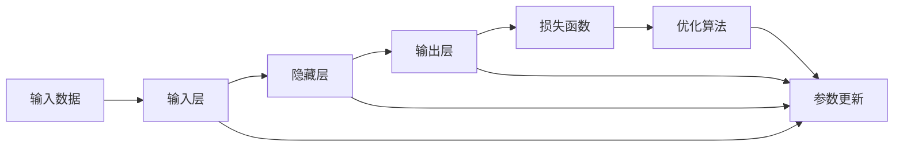
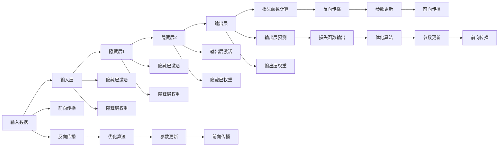

                 

# 神经网络：机器学习的新范式

> 关键词：神经网络,机器学习,深度学习,神经元,激活函数,损失函数,反向传播,优化算法,梯度下降,模型训练,深度学习框架

## 1. 背景介绍

### 1.1 问题由来

在人工智能（AI）领域，机器学习（Machine Learning, ML）一直是推动技术进步和创新应用的强劲驱动力。从早期的统计学习，到近年来的深度学习（Deep Learning, DL），机器学习技术已经在图像识别、自然语言处理、语音识别等诸多领域取得了突破性进展。

然而，传统机器学习模型（如线性回归、支持向量机等）往往依赖于手动设计的特征提取过程，对于数据中复杂的非线性关系无法有效建模，且需要大量手动调参。深度学习技术的兴起，特别是神经网络（Neural Networks, NNs）的广泛应用，为解决这些问题提供了新的思路和工具。

神经网络是一种以多层结构进行建模的机器学习算法，其核心思想是模拟人脑神经元之间的信息传递和处理过程。神经网络通过学习大量的数据样本，自动提取特征，并构建复杂的非线性映射关系，从而在许多复杂任务上取得了优异的性能。

### 1.2 问题核心关键点

神经网络的核心在于其结构设计和训练算法。神经网络由多个层次组成，每个层次包含多个神经元，通过前后层的逐级连接和信息传递，实现对输入数据的复杂映射。神经网络的学习过程，就是通过反向传播算法（Backpropagation）不断调整网络权重，最小化预测误差（损失函数）的过程。

神经网络的训练算法包括以下几个关键步骤：
- 前向传播：将输入数据通过网络进行逐层处理，输出预测结果。
- 损失计算：根据真实标签和预测结果计算损失函数值。
- 反向传播：通过链式法则反向传播误差，计算每个神经元的梯度。
- 参数更新：根据梯度信息，使用优化算法（如梯度下降）更新网络权重。

这一过程不断迭代，直到收敛到最优解。神经网络的训练过程复杂且计算量庞大，但一旦训练完成，可以处理大规模数据，输出复杂非线性映射，从而在多个领域展现出巨大潜力。

### 1.3 问题研究意义

神经网络技术的应用，不仅在学术界产生了深远影响，也在工业界得到了广泛应用。它改变了计算机视觉、语音识别、自然语言处理等诸多领域的技术面貌，推动了AI技术的落地应用和产业化进程。神经网络技术的普及和发展，也为机器学习和人工智能的未来带来了更多可能。

本节通过一系列生动的例子，解释神经网络的基本原理和核心算法，帮助读者深入理解神经网络的工作机制，并为后续深入学习相关算法和技术打下坚实基础。

## 2. 核心概念与联系

### 2.1 核心概念概述

神经网络由多个层次（Layer）构成，每个层次包含多个神经元（Neuron），神经元之间通过连接（Connection）形成网络结构。每个神经元接收多个输入，通过加权求和后送入激活函数进行非线性处理，最终输出一个值。多个神经元通过连接，形成层次化的网络结构，从而对输入数据进行复杂非线性映射。

神经网络的学习过程涉及以下关键概念：
- 激活函数（Activation Function）：用于对神经元的输出进行非线性处理，引入非线性特性，使网络能逼近任意复杂函数。
- 损失函数（Loss Function）：用于评估网络输出与真实标签之间的误差，指导参数的更新。
- 反向传播（Backpropagation）：通过链式法则反向传播误差，计算每个神经元的梯度，用于参数更新。
- 优化算法（Optimizer）：用于调整网络权重，最小化损失函数，实现网络训练。

这些概念通过网络的前向传播和反向传播过程，形成一个完整的学习循环。神经网络的学习过程，就是不断调整网络权重，使得预测结果尽可能接近真实标签，从而实现数据映射的优化。

### 2.2 概念间的关系

神经网络的核心概念之间通过前向传播和反向传播过程，形成一个完整的学习循环。下图展示了这些概念之间的逻辑关系：



这个图展示了神经网络的基本结构和学习过程：
1. 输入数据通过输入层，进入隐藏层进行处理。
2. 隐藏层通过加权求和和激活函数处理后，输出结果到输出层。
3. 输出层输出结果，与真实标签一起进入损失函数计算误差。
4. 损失函数输出误差，通过优化算法进行参数更新。
5. 参数更新完成后，重新进入前向传播过程，继续迭代学习。

通过这些关键概念和过程，神经网络能够自动提取数据的特征，并构建复杂的非线性映射关系，从而在多个任务上展现出强大的学习能力。

### 2.3 核心概念的整体架构

为了更直观地展示神经网络的结构和原理，以下给出更完整的神经网络架构图：



这个架构图展示了神经网络从输入到输出的完整流程：
1. 输入数据通过输入层进入网络。
2. 每个隐藏层通过加权求和和激活函数处理输入数据，输出结果到下一层。
3. 输出层通过加权求和和激活函数输出预测结果。
4. 真实标签和预测结果进入损失函数计算误差。
5. 误差通过反向传播计算每个神经元的梯度。
6. 梯度信息通过优化算法进行参数更新。
7. 更新后的参数重新进入前向传播过程，继续迭代学习。

神经网络的学习过程就是不断调整权重，使得预测结果更接近真实标签，从而实现数据映射的优化。

## 3. 核心算法原理 & 具体操作步骤

### 3.1 算法原理概述

神经网络的学习过程包括前向传播、损失计算、反向传播和参数更新四个关键步骤。以下详细介绍这四个步骤的基本原理和实现方式。

#### 3.1.1 前向传播

前向传播是神经网络对输入数据进行处理，输出预测结果的过程。具体步骤如下：
1. 输入数据通过输入层，进入隐藏层进行处理。
2. 隐藏层通过加权求和和激活函数处理后，输出结果到下一层。
3. 输出层通过加权求和和激活函数输出预测结果。

数学公式如下：

$$
h_1 = \sigma(w_1^T x + b_1)
$$

$$
h_2 = \sigma(w_2^T h_1 + b_2)
$$

$$
y = \sigma(w_3^T h_2 + b_3)
$$

其中，$x$为输入数据，$h_1$、$h_2$、$y$分别为不同层次的输出结果，$w_i$和$b_i$分别为权重和偏置，$\sigma$为激活函数。

#### 3.1.2 损失计算

损失函数用于衡量网络输出与真实标签之间的误差，常见的损失函数包括交叉熵损失、均方误差损失等。以交叉熵损失为例，其公式为：

$$
L = -\frac{1}{N}\sum_{i=1}^N(y_i \log \hat{y_i} + (1 - y_i) \log (1 - \hat{y_i}))
$$

其中，$y_i$为真实标签，$\hat{y_i}$为预测结果，$N$为样本数量。

#### 3.1.3 反向传播

反向传播是通过链式法则反向传播误差，计算每个神经元的梯度，用于参数更新的过程。具体步骤如下：
1. 计算输出层的误差，即损失函数对输出层的梯度。
2. 通过链式法则，逐层计算每个隐藏层的误差，即梯度。
3. 使用梯度信息，更新每个神经元的权重和偏置。

数学公式如下：

$$
\frac{\partial L}{\partial y} = \frac{\partial L}{\partial h_2} \frac{\partial h_2}{\partial y}
$$

$$
\frac{\partial L}{\partial w_3} = \frac{\partial L}{\partial h_2} \frac{\partial h_2}{\partial w_3} + \frac{\partial L}{\partial h_3} \frac{\partial h_3}{\partial w_3}
$$

其中，$\frac{\partial L}{\partial h_i}$为损失函数对隐藏层$i$的梯度，$\frac{\partial h_i}{\partial w_j}$为激活函数对权重$w_j$的梯度。

#### 3.1.4 参数更新

参数更新是使用优化算法，根据梯度信息调整网络权重和偏置的过程。常见的优化算法包括梯度下降、Adam、Adagrad等。以梯度下降为例，其公式为：

$$
\theta_j = \theta_j - \eta \frac{\partial L}{\partial \theta_j}
$$

其中，$\eta$为学习率，$\theta_j$为参数$j$的值，$\frac{\partial L}{\partial \theta_j}$为参数$j$的梯度。

### 3.2 算法步骤详解

#### 3.2.1 算法流程

神经网络的学习过程是一个迭代的过程，具体步骤如下：
1. 初始化网络参数。
2. 进行前向传播，计算输出结果。
3. 计算损失函数，评估预测误差。
4. 通过反向传播，计算梯度。
5. 使用优化算法，更新参数。
6. 重复步骤2-5，直至收敛。

#### 3.2.2 具体实现

以下以一个简单的多层神经网络为例，展示神经网络学习的具体实现过程。

```python
import torch
import torch.nn as nn
import torch.optim as optim

# 定义神经网络模型
class NeuralNet(nn.Module):
    def __init__(self):
        super(NeuralNet, self).__init__()
        self.fc1 = nn.Linear(784, 256)
        self.fc2 = nn.Linear(256, 128)
        self.fc3 = nn.Linear(128, 10)
        
    def forward(self, x):
        x = x.view(-1, 784)
        x = torch.relu(self.fc1(x))
        x = torch.relu(self.fc2(x))
        x = self.fc3(x)
        return x

# 加载数据集
train_dataset = ...
train_loader = ...

# 定义损失函数和优化器
model = NeuralNet()
criterion = nn.CrossEntropyLoss()
optimizer = optim.SGD(model.parameters(), lr=0.01)

# 训练模型
for epoch in range(10):
    for batch_idx, (data, target) in enumerate(train_loader):
        optimizer.zero_grad()
        output = model(data)
        loss = criterion(output, target)
        loss.backward()
        optimizer.step()
        
    print('Epoch: {}, Loss: {:.4f}'.format(epoch, loss.item()))
```

### 3.3 算法优缺点

神经网络的学习算法具有以下优点：
1. 能够自动提取数据的特征，无需手动设计特征提取过程。
2. 能够逼近任意复杂函数，处理复杂非线性关系。
3. 能够并行计算，提高计算效率。
4. 具有良好的泛化能力，适用于多个领域和任务。

同时，神经网络学习算法也存在以下缺点：
1. 需要大量数据进行训练，否则容易过拟合。
2. 计算量庞大，训练时间长。
3. 存在梯度消失或梯度爆炸问题，难以训练深层网络。
4. 需要手动选择网络结构，可能存在局部最优解问题。

### 3.4 算法应用领域

神经网络学习算法广泛应用于图像识别、自然语言处理、语音识别、推荐系统等多个领域。以下是几个典型应用场景：

#### 3.4.1 图像识别

神经网络在图像识别领域取得了巨大成功，如LeNet、AlexNet、VGG、ResNet等模型。通过使用卷积神经网络（Convolutional Neural Networks, CNNs），神经网络能够自动提取图像特征，并实现高效的图像分类、目标检测等任务。

#### 3.4.2 自然语言处理

神经网络在自然语言处理领域也有广泛应用，如Word2Vec、GloVe、BERT等模型。通过使用循环神经网络（Recurrent Neural Networks, RNNs）和Transformer模型，神经网络能够自动处理自然语言序列，实现文本分类、情感分析、机器翻译等任务。

#### 3.4.3 语音识别

神经网络在语音识别领域也有广泛应用，如DeepSpeech、Wav2Letter等模型。通过使用循环神经网络（RNNs）和卷积神经网络（CNNs），神经网络能够自动处理语音信号，实现语音识别、语音合成等任务。

#### 3.4.4 推荐系统

神经网络在推荐系统领域也有广泛应用，如协同过滤、基于矩阵分解的推荐等。通过使用神经网络模型，能够自动学习用户和物品之间的复杂关系，实现个性化推荐。

## 4. 数学模型和公式 & 详细讲解 & 举例说明

### 4.1 数学模型构建

神经网络的学习过程涉及前向传播、损失计算、反向传播和参数更新四个关键步骤。以下详细介绍这四个步骤的基本原理和实现方式。

#### 4.1.1 前向传播

前向传播是神经网络对输入数据进行处理，输出预测结果的过程。具体步骤如下：
1. 输入数据通过输入层，进入隐藏层进行处理。
2. 隐藏层通过加权求和和激活函数处理后，输出结果到下一层。
3. 输出层通过加权求和和激活函数输出预测结果。

数学公式如下：

$$
h_1 = \sigma(w_1^T x + b_1)
$$

$$
h_2 = \sigma(w_2^T h_1 + b_2)
$$

$$
y = \sigma(w_3^T h_2 + b_3)
$$

其中，$x$为输入数据，$h_1$、$h_2$、$y$分别为不同层次的输出结果，$w_i$和$b_i$分别为权重和偏置，$\sigma$为激活函数。

#### 4.1.2 损失计算

损失函数用于衡量网络输出与真实标签之间的误差，常见的损失函数包括交叉熵损失、均方误差损失等。以交叉熵损失为例，其公式为：

$$
L = -\frac{1}{N}\sum_{i=1}^N(y_i \log \hat{y_i} + (1 - y_i) \log (1 - \hat{y_i}))
$$

其中，$y_i$为真实标签，$\hat{y_i}$为预测结果，$N$为样本数量。

#### 4.1.3 反向传播

反向传播是通过链式法则反向传播误差，计算每个神经元的梯度，用于参数更新的过程。具体步骤如下：
1. 计算输出层的误差，即损失函数对输出层的梯度。
2. 通过链式法则，逐层计算每个隐藏层的误差，即梯度。
3. 使用梯度信息，更新每个神经元的权重和偏置。

数学公式如下：

$$
\frac{\partial L}{\partial y} = \frac{\partial L}{\partial h_2} \frac{\partial h_2}{\partial y}
$$

$$
\frac{\partial L}{\partial w_3} = \frac{\partial L}{\partial h_2} \frac{\partial h_2}{\partial w_3} + \frac{\partial L}{\partial h_3} \frac{\partial h_3}{\partial w_3}
$$

其中，$\frac{\partial L}{\partial h_i}$为损失函数对隐藏层$i$的梯度，$\frac{\partial h_i}{\partial w_j}$为激活函数对权重$w_j$的梯度。

#### 4.1.4 参数更新

参数更新是使用优化算法，根据梯度信息调整网络权重和偏置的过程。常见的优化算法包括梯度下降、Adam、Adagrad等。以梯度下降为例，其公式为：

$$
\theta_j = \theta_j - \eta \frac{\partial L}{\partial \theta_j}
$$

其中，$\eta$为学习率，$\theta_j$为参数$j$的值，$\frac{\partial L}{\partial \theta_j}$为参数$j$的梯度。

### 4.2 公式推导过程

以下以一个简单的多层神经网络为例，展示神经网络学习的公式推导过程。

假设有一个三层神经网络，输入层有2个神经元，隐藏层有3个神经元，输出层有1个神经元，激活函数为sigmoid。设输入数据为$x_1$、$x_2$，隐藏层权重为$w_1$、$w_2$，输出层权重为$w_3$，偏置分别为$b_1$、$b_2$、$b_3$。

#### 4.2.1 前向传播

前向传播的过程如下：

$$
h_1 = \sigma(w_1^T [x_1, x_2] + b_1)
$$

$$
h_2 = \sigma(w_2^T [h_1] + b_2)
$$

$$
y = \sigma(w_3^T [h_2] + b_3)
$$

其中，$[h_1]$表示将$h_1$的值视为一个向量。

#### 4.2.2 损失计算

假设真实标签为$y$，交叉熵损失的公式为：

$$
L = -\frac{1}{2}\sum_{i=1}^N(y_i \log \hat{y_i} + (1 - y_i) \log (1 - \hat{y_i}))
$$

其中，$y_i$为真实标签，$\hat{y_i}$为预测结果，$N$为样本数量。

#### 4.2.3 反向传播

计算输出层的误差，即损失函数对输出层的梯度：

$$
\frac{\partial L}{\partial y} = \frac{\partial L}{\partial h_2} \frac{\partial h_2}{\partial y} = \frac{\partial L}{\partial h_2} \frac{\partial y}{\partial h_2}
$$

$$
\frac{\partial L}{\partial w_3} = \frac{\partial L}{\partial h_2} \frac{\partial h_2}{\partial w_3} = \frac{\partial L}{\partial h_2} \frac{\partial h_2}{\partial h_3} \frac{\partial h_3}{\partial w_3}
$$

$$
\frac{\partial L}{\partial h_2} = \frac{\partial L}{\partial y} \frac{\partial y}{\partial h_2}
$$

$$
\frac{\partial L}{\partial w_2} = \frac{\partial L}{\partial h_2} \frac{\partial h_2}{\partial w_2} = \frac{\partial L}{\partial h_2} \frac{\partial h_2}{\partial h_1} \frac{\partial h_1}{\partial w_2}
$$

$$
\frac{\partial L}{\partial w_1} = \frac{\partial L}{\partial h_2} \frac{\partial h_2}{\partial h_1} \frac{\partial h_1}{\partial w_1}
$$

其中，$\frac{\partial y}{\partial h_2}$、$\frac{\partial h_2}{\partial y}$、$\frac{\partial h_2}{\partial h_3}$、$\frac{\partial h_2}{\partial w_3}$、$\frac{\partial h_2}{\partial h_1}$、$\frac{\partial h_2}{\partial w_2}$、$\frac{\partial h_2}{\partial w_1}$分别表示损失函数对输出层、隐藏层、权重和偏置的梯度。

#### 4.2.4 参数更新

使用梯度下降算法，更新网络参数：

$$
w_1 = w_1 - \eta \frac{\partial L}{\partial w_1}
$$

$$
b_1 = b_1 - \eta \frac{\partial L}{\partial b_1}
$$

$$
w_2 = w_2 - \eta \frac{\partial L}{\partial w_2}
$$

$$
b_2 = b_2 - \eta \frac{\partial L}{\partial b_2}
$$

$$
w_3 = w_3 - \eta \frac{\partial L}{\partial w_3}
$$

$$
b_3 = b_3 - \eta \frac{\partial L}{\partial b_3}
$$

其中，$\eta$为学习率。

### 4.3 案例分析与讲解

以下以一个简单的手写数字识别任务为例，展示神经网络学习的具体实现过程。

```python
import torch
import torch.nn as nn
import torch.optim as optim

# 定义神经网络模型
class NeuralNet(nn.Module):
    def __init__(self):
        super(NeuralNet, self).__init__()
        self.fc1 = nn.Linear(784, 256)
        self.fc2 = nn.Linear(256, 128)
        self.fc3 = nn.Linear(128, 10)
        
    def forward(self, x):
        x = x.view(-1, 784)
        x = torch.relu(self.fc1(x))
        x = torch.relu(self.fc2(x))
        x = self.fc3(x)
        return x

# 加载数据集
train_dataset = ...
train_loader = ...

# 定义损失函数和优化器
model = NeuralNet()
criterion = nn.CrossEntropyLoss()
optimizer = optim.SGD(model.parameters(), lr=0.01)

# 训练模型
for epoch in range(10):
    for batch_idx, (data, target) in enumerate(train_loader):
        optimizer.zero_grad()
        output = model(data)
        loss = criterion(output, target)
        loss.backward()
        optimizer.step()
        
    print('Epoch: {}, Loss: {:.4f}'.format(epoch, loss.item()))
```

## 5. 项目实践：代码实例和详细解释说明

### 5.1 开发环境搭建

在进行神经网络项目开发前，我们需要准备好开发环境。以下是使用Python进行PyTorch开发的环境配置流程：

1. 安装Anaconda：从官网下载并安装Anaconda，用于创建独立的Python环境。

2. 创建并激活虚拟环境：
```bash
conda create -n pytorch-env python=3.8 
conda activate pytorch-env
```

3. 安装PyTorch：根据CUDA版本，从官网获取对应的安装命令。例如：
```bash
conda install pytorch torchvision torchaudio cudatoolkit=11.1 -c pytorch -c conda-forge
```

4. 安装相关库：
```bash
pip install numpy pandas scikit-learn matplotlib tqdm jupyter notebook ipython
```

完成上述步骤后，即可在`pytorch-env`环境中开始神经网络项目的开发。

### 5.2 源代码详细实现

以下以一个简单的多层神经网络为例，展示神经网络学习的具体实现过程。

```python
import torch
import torch.nn as nn
import torch.optim as optim

# 定义神经网络模型
class NeuralNet(nn.Module):
    def __init__(self):
        super(NeuralNet, self).__init__()
        self.fc1 = nn.Linear(784, 256)
        self.fc2 = nn.Linear(256, 128)
        self.fc3 = nn.Linear(128, 10)
        
    def forward(self, x):
        x = x.view(-1, 784)
        x = torch.relu(self.fc1(x))
        x = torch.relu(self.fc2(x))
        x = self.fc3(x)
        return x

# 加载数据集
train_dataset = ...
train_loader = ...

# 定义损失函数和优化器
model = NeuralNet()
criterion = nn.CrossEntropyLoss()
optimizer = optim.SGD(model.parameters(), lr=0.01)

# 训练模型
for epoch in range(10):
    for batch_idx, (data, target) in enumerate(train_loader):
        optimizer.zero_grad()
        output = model(data)
        loss = criterion(output, target)
        loss.backward()
        optimizer.step()
        
    print('Epoch: {}, Loss: {:.4f}'.format(epoch, loss.item()))
```

### 5.3 代码解读与分析

让我们再详细解读一下关键代码的实现细节：

**NeuralNet类**：
- `__init__`方法：初始化神经网络的结构，包括各个层次的权重和偏置。
- `forward`方法：实现前向传播过程，计算输出结果。
- `loss

