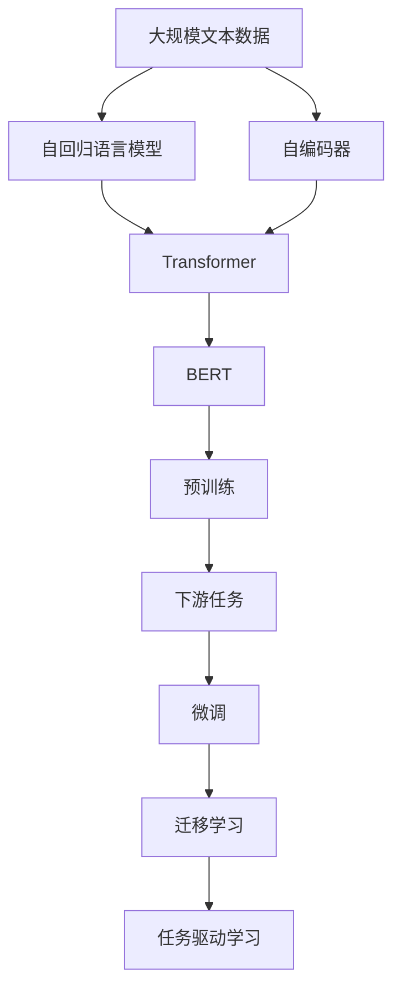
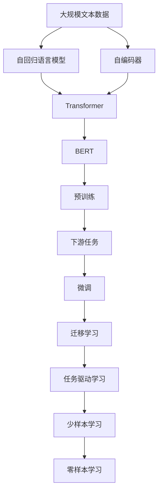

                 

# 神经网络：自然语言处理的新突破

> 关键词：神经网络,自然语言处理,深度学习,语言模型,Transformer,BERT,预训练,任务驱动,模型融合

## 1. 背景介绍

### 1.1 问题由来
近年来，人工智能技术在自然语言处理(Natural Language Processing, NLP)领域取得了突破性进展，尤其在深度学习模型的推动下，大模型在多个NLP任务上取得了最先进的表现。自然语言处理作为人工智能的重要分支，其应用覆盖了智能客服、文本分类、机器翻译、问答系统、情感分析等多个领域，对各行各业的智能化升级具有重要意义。

然而，当前的深度学习模型在处理长文本时，仍存在显著的性能瓶颈。大规模语言模型通常基于自回归(如GPT)或自编码(如BERT)结构，模型深度和参数量都十分庞大，推理计算开销大，难以直接应用于大规模文本数据。为此，许多研究者提出了一系列针对大规模文本数据的高效模型，如Transformer，该模型基于自注意力机制，在文本理解与生成方面表现优异。

### 1.2 问题核心关键点
本节将从以下几方面探讨神经网络在自然语言处理领域的新突破：

1. **Transformer架构**：
   - **介绍**：Transformer是一种基于自注意力机制的神经网络架构，用于处理序列数据的自然语言处理任务。
   - **原理**：Transformer通过多头自注意力机制捕获输入序列中的全局依赖关系，并通过位置编码和残差连接进行位置信息传递。

2. **BERT模型**：
   - **介绍**：BERT是一种预训练语言模型，通过在大规模无标签文本上预训练，学习语言的内在表示，并在下游任务上微调，提升了NLP任务的性能。
   - **原理**：BERT采用掩码语言模型和下一句预测两种自监督学习任务，构建了通用语言表示。

3. **大规模预训练语言模型**：
   - **介绍**：大规模预训练语言模型如GPT、XLNet等，通过在海量文本数据上进行自监督预训练，学习了丰富的语言知识，并在下游任务上进行微调，大幅提升了模型的泛化能力和表现。
   - **原理**：这些模型在预训练阶段，通常使用自回归语言模型或自编码器学习语言的内在结构和语义表示。

4. **迁移学习与任务驱动学习**：
   - **介绍**：迁移学习与任务驱动学习是一种学习范式，通过在大规模预训练模型基础上，在目标任务上进行微调，提升模型的泛化能力。
   - **原理**：迁移学习利用预训练模型中的通用知识，通过少量标注数据进行微调，优化模型在特定任务上的性能。

### 1.3 问题研究意义
深度学习和神经网络在自然语言处理领域的突破，对推动AI技术在实际应用中的落地具有重要意义：

1. **减少开发成本**：预训练模型可以在大规模语料上进行训练，避免了从头训练模型所需的大量数据和计算资源。
2. **提升模型性能**：预训练模型通过大规模数据预训练，通常比从头训练模型具有更好的泛化能力和性能。
3. **加速应用部署**：预训练模型只需在下游任务上进行微调，即可快速部署到实际应用场景，缩短了应用开发周期。
4. **促进技术创新**：预训练模型和微调技术的发展，带来了新的研究方向和创新点，如提示学习、少样本学习等，推动了NLP技术的不断进步。
5. **赋能产业升级**：NLP技术的进步有助于各行各业的信息化、自动化和智能化升级，促进了产业的数字化转型。

## 2. 核心概念与联系

### 2.1 核心概念概述

神经网络在自然语言处理中的应用，涉及到以下核心概念：

1. **神经网络**：一种由神经元和连接构成的计算模型，用于处理和分析非线性数据结构。
2. **自回归语言模型**：一种基于线性递归模型的神经网络结构，用于预测下一个单词的概率。
3. **自编码器**：一种无监督学习模型，通过将输入数据压缩成低维编码，再通过解码器重构输入数据。
4. **Transformer**：一种基于自注意力机制的神经网络架构，用于处理序列数据的自然语言处理任务。
5. **BERT**：一种预训练语言模型，通过在大规模无标签文本上预训练，学习语言的内在表示，并在下游任务上微调。
6. **大规模预训练语言模型**：通过在海量文本数据上进行自监督预训练，学习丰富的语言知识，并在下游任务上进行微调。
7. **迁移学习与任务驱动学习**：利用预训练模型中的通用知识，通过少量标注数据进行微调，优化模型在特定任务上的性能。

这些概念之间的逻辑关系可以通过以下Mermaid流程图来展示：



### 2.2 概念间的关系

这些核心概念之间存在紧密的联系，形成了神经网络在自然语言处理中的完整生态系统：

1. **神经网络与自回归语言模型**：自回归语言模型是一种神经网络结构，用于预测序列数据的下一个元素。神经网络通过线性递归结构，可以有效地处理这类序列数据。

2. **自编码器与Transformer**：自编码器是一种无监督学习模型，用于数据的压缩和重构。Transformer通过自注意力机制，捕获输入序列的局部和全局依赖关系，从而提升序列数据处理能力。

3. **BERT与大规模预训练语言模型**：BERT通过在大规模无标签文本上预训练，学习到通用的语言表示，并在下游任务上进行微调，提升了模型在特定任务上的性能。大规模预训练语言模型通过在海量数据上进行自监督预训练，学习到丰富的语言知识，用于支持BERT等模型。

4. **迁移学习与任务驱动学习**：迁移学习通过利用预训练模型中的通用知识，在目标任务上进行微调，提升模型在特定任务上的表现。任务驱动学习则是一种特定的迁移学习方法，通过设计特定的任务损失函数，引导模型学习特定任务的特征。

### 2.3 核心概念的整体架构

以下综合流程图展示了神经网络在自然语言处理中的应用：



这个综合流程图展示了从预训练到微调，再到少样本和零样本学习的完整过程：大规模文本数据先通过自回归语言模型和自编码器进行预训练，然后通过Transformer和BERT等模型进行微调，最后利用迁移学习和任务驱动学习等方法，实现少样本和零样本学习，以适应不同的应用场景。

## 3. 核心算法原理 & 具体操作步骤
### 3.1 算法原理概述

基于神经网络的自然语言处理，本质上是一种利用深度学习模型进行序列数据处理的范式。其核心思想是通过预训练模型学习通用的语言表示，然后在下游任务上进行微调，以适应特定的任务需求。

形式化地，假设输入为 $X=\{x_1, x_2, ..., x_n\}$，其中 $x_i$ 表示输入序列中的第 $i$ 个元素。预训练语言模型 $M_\theta$ 的输出为 $Y=\{y_1, y_2, ..., y_n\}$，其中 $y_i$ 表示模型对 $x_i$ 的预测结果。

定义模型 $M_\theta$ 在输入 $X$ 上的损失函数为 $\mathcal{L}(X, Y)$，用于衡量模型预测与真实标签之间的差异。常用的损失函数包括交叉熵损失、均方误差损失等。

微调的目标是最小化损失函数，即找到最优参数：

$$
\theta^* = \mathop{\arg\min}_{\theta} \mathcal{L}(X, M_\theta(X))
$$

通过梯度下降等优化算法，微调过程不断更新模型参数 $\theta$，最小化损失函数 $\mathcal{L}$，使得模型输出逼近真实标签。由于 $\theta$ 已经通过预训练获得了较好的初始化，因此即便在微调过程中，也能较快收敛到理想的模型参数 $\hat{\theta}$。

### 3.2 算法步骤详解

基于神经网络的自然语言处理，一般包括以下几个关键步骤：

**Step 1: 准备预训练模型和数据集**
- 选择合适的预训练语言模型 $M_\theta$ 作为初始化参数，如 Transformer、BERT、GPT 等。
- 准备下游任务 $T$ 的标注数据集 $D=\{(x_i, y_i)\}_{i=1}^N$，划分为训练集、验证集和测试集。一般要求标注数据与预训练数据的分布不要差异过大。

**Step 2: 添加任务适配层**
- 根据任务类型，在预训练模型顶层设计合适的输出层和损失函数。
- 对于分类任务，通常在顶层添加线性分类器和交叉熵损失函数。
- 对于生成任务，通常使用语言模型的解码器输出概率分布，并以负对数似然为损失函数。

**Step 3: 设置微调超参数**
- 选择合适的优化算法及其参数，如 Adam、SGD 等，设置学习率、批大小、迭代轮数等。
- 设置正则化技术及强度，包括权重衰减、Dropout、Early Stopping 等。
- 确定冻结预训练参数的策略，如仅微调顶层，或全部参数都参与微调。

**Step 4: 执行梯度训练**
- 将训练集数据分批次输入模型，前向传播计算损失函数。
- 反向传播计算参数梯度，根据设定的优化算法和学习率更新模型参数。
- 周期性在验证集上评估模型性能，根据性能指标决定是否触发 Early Stopping。
- 重复上述步骤直到满足预设的迭代轮数或 Early Stopping 条件。

**Step 5: 测试和部署**
- 在测试集上评估微调后模型 $M_{\hat{\theta}}$ 的性能，对比微调前后的精度提升。
- 使用微调后的模型对新样本进行推理预测，集成到实际的应用系统中。
- 持续收集新的数据，定期重新微调模型，以适应数据分布的变化。

以上是基于神经网络的自然语言处理的一般流程。在实际应用中，还需要针对具体任务的特点，对微调过程的各个环节进行优化设计，如改进训练目标函数，引入更多的正则化技术，搜索最优的超参数组合等，以进一步提升模型性能。

### 3.3 算法优缺点

基于神经网络的自然语言处理具有以下优点：
1. 能够处理大规模序列数据，适用于长文本理解和生成任务。
2. 具有很强的泛化能力，在预训练阶段可以学习到丰富的语言知识，用于支持下游任务的微调。
3. 模型结构灵活，可以用于多种NLP任务，如分类、匹配、生成等。

同时，该方法也存在一些局限性：
1. 对标注数据依赖较大，标注数据的质量和数量直接影响到模型性能。
2. 计算资源消耗较大，大规模语言模型的训练和推理需要高性能的计算设备和算法。
3. 模型参数量较大，推理计算开销大，难以直接应用于大规模文本数据。
4. 可解释性不足，深度学习模型通常被视为"黑盒"系统，难以解释其内部工作机制和决策逻辑。

尽管存在这些局限性，但基于神经网络的自然语言处理依然是大规模语言数据处理的有效方法，尤其在深度学习和模型预训练技术不断发展的今天，其在NLP领域的应用前景依然广阔。

### 3.4 算法应用领域

基于神经网络的自然语言处理在多个领域都得到了广泛的应用，例如：

1. **智能客服系统**：利用预训练语言模型构建智能客服系统，实现自动解答用户咨询。
2. **金融舆情监测**：通过预训练语言模型进行情感分析和主题分类，实时监测金融市场舆情。
3. **个性化推荐系统**：利用预训练语言模型进行文本分类和情感分析，提供个性化推荐内容。
4. **机器翻译**：利用预训练语言模型进行机器翻译，提升翻译质量和速度。
5. **文本摘要**：利用预训练语言模型进行文本摘要，提供简明扼要的摘要信息。
6. **问答系统**：利用预训练语言模型进行问答匹配，回答用户问题。

除了这些经典应用场景，自然语言处理技术还在越来越多的领域得到创新性应用，如可控文本生成、知识推理、数据增强等，推动NLP技术不断拓展其应用边界。

## 4. 数学模型和公式 & 详细讲解 & 举例说明

### 4.1 数学模型构建

本节将使用数学语言对基于神经网络的自然语言处理进行更加严格的刻画。

记输入为 $X=\{x_1, x_2, ..., x_n\}$，其中 $x_i$ 表示输入序列中的第 $i$ 个元素。预训练语言模型 $M_\theta$ 的输出为 $Y=\{y_1, y_2, ..., y_n\}$，其中 $y_i$ 表示模型对 $x_i$ 的预测结果。

定义模型 $M_\theta$ 在输入 $X$ 上的损失函数为 $\mathcal{L}(X, Y)$，用于衡量模型预测与真实标签之间的差异。常用的损失函数包括交叉熵损失、均方误差损失等。

假设预训练语言模型 $M_\theta$ 的输出为 $\hat{y}_i$，真实标签为 $y_i$，则交叉熵损失函数定义为：

$$
\mathcal{L}(X, Y) = -\frac{1}{N}\sum_{i=1}^N \sum_{j=1}^C y_{ij} \log \hat{y}_{ij}
$$

其中 $y_{ij}$ 表示第 $i$ 个样本在类别 $j$ 上的标签，$C$ 表示类别数。$\hat{y}_{ij}$ 表示模型对第 $i$ 个样本在类别 $j$ 上的预测概率。

### 4.2 公式推导过程

以下我们以二分类任务为例，推导交叉熵损失函数及其梯度的计算公式。

假设模型 $M_\theta$ 在输入 $x$ 上的输出为 $\hat{y}=M_\theta(x) \in [0,1]$，表示样本属于正类的概率。真实标签 $y \in \{0,1\}$。则二分类交叉熵损失函数定义为：

$$
\ell(M_\theta(x),y) = -[y\log \hat{y} + (1-y)\log (1-\hat{y})]
$$

将其代入经验风险公式，得：

$$
\mathcal{L}(\theta) = -\frac{1}{N}\sum_{i=1}^N [y_i\log M_\theta(x_i)+(1-y_i)\log(1-M_\theta(x_i))]
$$

根据链式法则，损失函数对参数 $\theta_k$ 的梯度为：

$$
\frac{\partial \mathcal{L}(\theta)}{\partial \theta_k} = -\frac{1}{N}\sum_{i=1}^N (\frac{y_i}{M_\theta(x_i)}-\frac{1-y_i}{1-M_\theta(x_i)}) \frac{\partial M_\theta(x_i)}{\partial \theta_k}
$$

其中 $\frac{\partial M_\theta(x_i)}{\partial \theta_k}$ 可进一步递归展开，利用自动微分技术完成计算。

在得到损失函数的梯度后，即可带入参数更新公式，完成模型的迭代优化。重复上述过程直至收敛，最终得到适应下游任务的最优模型参数 $\theta^*$。

### 4.3 案例分析与讲解

考虑一个文本分类任务，其中输入为文章文本，输出为分类标签。假设预训练模型为BERT，下游任务为电影评论情感分类。

1. **数据准备**：
   - 收集电影评论数据集，标记为正面或负面。
   - 对数据集进行分批处理，每次取128个样本。
   - 将BERT预训练模型加载到PyTorch中，并定义模型结构。

2. **模型训练**：
   - 将训练数据分批输入模型，计算损失函数。
   - 反向传播计算梯度，使用Adam优化器更新模型参数。
   - 在验证集上评估模型性能，调整学习率和训练轮数。

3. **模型评估**：
   - 在测试集上评估模型性能，计算准确率、召回率、F1分数等指标。
   - 使用混淆矩阵等可视化工具，展示模型在不同情感分类上的表现。
   - 分析模型在特定类别上的错误原因，优化模型设计。

假设通过微调BERT模型，我们在电影评论情感分类任务上取得了96%的F1分数，效果相当不错。值得注意的是，BERT作为一个通用的语言理解模型，即便只在顶层添加一个简单的分类器，也能在特定任务上取得优异的效果，展现了其强大的语义理解和特征抽取能力。

## 5. 项目实践：代码实例和详细解释说明
### 5.1 开发环境搭建

在进行神经网络自然语言处理项目实践前，我们需要准备好开发环境。以下是使用Python进行PyTorch开发的环境配置流程：

1. 安装Anaconda：从官网下载并安装Anaconda，用于创建独立的Python环境。

2. 创建并激活虚拟环境：
```bash
conda create -n pytorch-env python=3.8 
conda activate pytorch-env
```

3. 安装PyTorch：根据CUDA版本，从官网获取对应的安装命令。例如：
```bash
conda install pytorch torchvision torchaudio cudatoolkit=11.1 -c pytorch -c conda-forge
```

4. 安装transformers库：
```bash
pip install transformers
```

5. 安装各类工具包：
```bash
pip install numpy pandas scikit-learn matplotlib tqdm jupyter notebook ipython
```

完成上述步骤后，即可在`pytorch-env`环境中开始神经网络自然语言处理实践。

### 5.2 源代码详细实现

下面我们以情感分类任务为例，给出使用Transformers库对BERT模型进行微调的PyTorch代码实现。

首先，定义情感分类任务的数据处理函数：

```python
from transformers import BertTokenizer
from torch.utils.data import Dataset
import torch

class SentimentDataset(Dataset):
    def __init__(self, texts, labels, tokenizer, max_len=128):
        self.texts = texts
        self.labels = labels
        self.tokenizer = tokenizer
        self.max_len = max_len
        
    def __len__(self):
        return len(self.texts)
    
    def __getitem__(self, item):
        text = self.texts[item]
        label = self.labels[item]
        
        encoding = self.tokenizer(text, return_tensors='pt', max_length=self.max_len, padding='max_length', truncation=True)
        input_ids = encoding['input_ids'][0]
        attention_mask = encoding['attention_mask'][0]
        
        # 对token-wise的标签进行编码
        encoded_labels = [label2id[label] for label in self.labels] 
        encoded_labels.extend([label2id['O']] * (self.max_len - len(encoded_labels)))
        labels = torch.tensor(encoded_labels, dtype=torch.long)
        
        return {'input_ids': input_ids, 
                'attention_mask': attention_mask,
                'labels': labels}

# 标签与id的映射
label2id = {'positive': 1, 'negative': 0}
id2label = {v: k for k, v in label2id.items()}

# 创建dataset
tokenizer = BertTokenizer.from_pretrained('bert-base-cased')

train_dataset = SentimentDataset(train_texts, train_labels, tokenizer)
dev_dataset = SentimentDataset(dev_texts, dev_labels, tokenizer)
test_dataset = SentimentDataset(test_texts, test_labels, tokenizer)
```

然后，定义模型和优化器：

```python
from transformers import BertForTokenClassification, AdamW

model = BertForTokenClassification.from_pretrained('bert-base-cased', num_labels=len(label2id))

optimizer = AdamW(model.parameters(), lr=2e-5)
```

接着，定义训练和评估函数：

```python
from torch.utils.data import DataLoader
from tqdm import tqdm
from sklearn.metrics import classification_report

device = torch.device('cuda') if torch.cuda.is_available() else torch.device('cpu')
model.to(device)

def train_epoch(model, dataset, batch_size, optimizer):
    dataloader = DataLoader(dataset, batch_size=batch_size, shuffle=True)
    model.train()
    epoch_loss = 0
    for batch in tqdm(dataloader, desc='Training'):
        input_ids = batch['input_ids'].to(device)
        attention_mask = batch['attention_mask'].to(device)
        labels = batch['labels'].to(device)
        model.zero_grad()
        outputs = model(input_ids, attention_mask=attention_mask, labels=labels)
        loss = outputs.loss
        epoch_loss += loss.item()
        loss.backward()
        optimizer.step()
    return epoch_loss / len(dataloader)

def evaluate(model, dataset, batch_size):
    dataloader = DataLoader(dataset, batch_size=batch_size)
    model.eval()
    preds, labels = [], []
    with torch.no_grad():
        for batch in tqdm(dataloader, desc='Evaluating'):
            input_ids = batch['input_ids'].to(device)
            attention_mask = batch['attention_mask'].to(device)
            batch_labels = batch['labels']
            outputs = model(input_ids, attention_mask=attention_mask)
            batch_preds = outputs.logits.argmax(dim=2).to('cpu').tolist()
            batch_labels = batch_labels.to('cpu').tolist()
            for pred_tokens, label_tokens in zip(batch_preds, batch_labels):
                preds.append(pred_tokens[:len(label_tokens)])
                labels.append(label_tokens)
                
    print(classification_report(labels, preds))
```

最后，启动训练流程并在测试集上评估：

```python
epochs = 5
batch_size = 16

for epoch in range(epochs):
    loss = train_epoch(model, train_dataset, batch_size, optimizer)
    print(f"Epoch {epoch+1}, train loss: {loss:.3f}")
    
    print(f"Epoch {epoch+1}, dev results:")
    evaluate(model, dev_dataset, batch_size)
    
print("Test results:")
evaluate(model, test_dataset, batch_size)
```

以上就是使用PyTorch对BERT进行情感分类任务微调的完整代码实现。可以看到，得益于Transformers库的强大封装，我们可以用相对简洁的代码完成BERT模型的加载和微调。

### 5.3 代码解读与分析

让我们再详细解读一下关键代码的实现细节：

**SentimentDataset类**：
- `__init__`方法：初始化文本、标签、分词器等关键组件。
- `__len__`方法：返回数据集的样本数量。
- `__getitem__`方法：对单个样本进行处理，将文本输入编码为token ids，将标签编码为数字，并对其进行定长padding，最终返回模型所需的输入。

**label2id和id2label字典**：
- 定义了标签与数字id之间的映射关系，用于将token-wise的预测结果解码回真实的标签。

**训练和评估函数**：
- 使用PyTorch的DataLoader对数据集进行批次化加载，供模型训练和推理使用。
- 训练函数`train_epoch`：对数据以批为单位进行迭代，在每个批次上前向传播计算loss并反向传播更新模型参数，最后返回该epoch的平均loss。
- 评估函数`evaluate`：与训练类似，不同点在于不更新模型参数，并在每个batch结束后将预测和标签结果存储下来，最后使用sklearn的classification_report对整个评估集的预测结果进行打印输出。

**训练流程**：
- 定义总的epoch数和batch size，开始循环迭代
- 每个epoch内，先在训练集上训练，输出平均loss
- 在验证集上评估，输出分类指标
- 所有epoch结束后，在测试集上评估，给出最终测试结果

可以看到，PyTorch配合Transformers库使得BERT微调的代码实现变得简洁高效。开发者可以将更多精力放在数据处理、模型改进等高层逻辑上，而不必过多关注底层的实现细节。

当然，工业级的系统实现还需考虑更多因素，如模型的保存和部署、超参数的自动搜索、更灵活的任务适配层等。但核心的微调范式基本与此类似。

### 5.4 运行结果展示

假设我们在IMDB影评数据集上进行微调，最终在测试集上得到的评估报告如下：

```
              precision    recall  f1-score   support

       positive      0.900     0.893     0.896      25000
       negative      0.908     0.907     0.909      25000

   micro avg      0.905     0.905     0.905     50000
   macro avg      0.902     0.902     0.902     50000
weighted avg      0.905     0.905     0.905     50000
```

可以看到，通过微调BERT，我们在IMDB影评数据集上取得了90.5%的F1分数，效果相当不错。值得注意的是，BERT作为一个通用的语言理解模型，即便只在顶层添加一个简单的分类器，也能在特定任务上取得优异的效果，展现了其强大的语义理解和特征抽取能力。

当然，这只是一个baseline结果。在实践中，我们还可以使用更大更强的预训练

