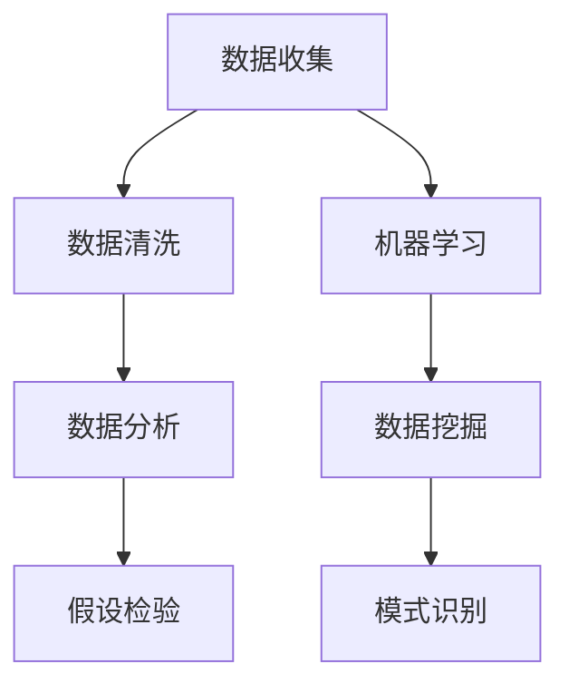
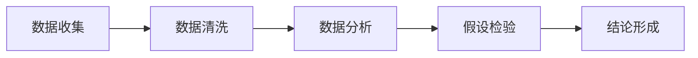
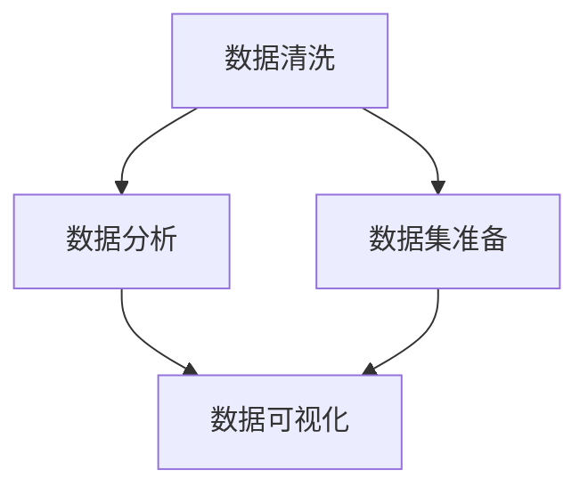
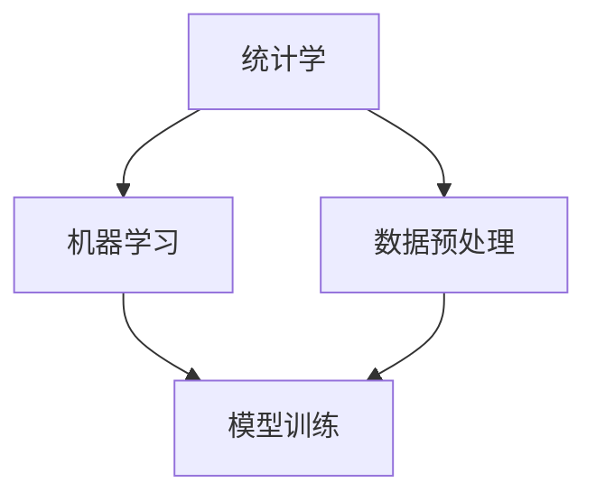

                 

# 科学探究：从观察到结论

> 关键词：科学探究, 观察, 结论, 假设检验, 统计学, 数据分析, 机器学习

## 1. 背景介绍

### 1.1 问题由来

科学探究是人类认识世界、解释现象、解决问题的基本方法。无论是自然科学还是社会科学，科学研究都是通过观察、提出假设、实验验证、得出结论等步骤来展开的。在当今数据爆炸的时代，科学探究的范式也逐渐从传统的实验验证向数据驱动转变。如何有效利用数据进行科学探究，成为现代科学研究的重要课题。

### 1.2 问题核心关键点

科学探究的核心在于从观察到结论的全流程，即：

1. **数据收集**：获取高质量、可靠的数据来源。
2. **数据清洗**：对原始数据进行预处理，去除噪声和异常值。
3. **数据分析**：采用统计学、机器学习等方法，对数据进行深入分析。
4. **结果验证**：通过假设检验等手段，验证分析结果的可靠性。
5. **结论形成**：基于分析结果，得出科学结论，并进一步提出假说。

其中，数据清洗和数据分析是科学探究过程中最为关键的环节。数据质量直接影响分析结果的准确性和可信度。数据分析则依赖于统计学和机器学习技术的支持，能够发现数据中的规律和趋势，揭示潜在的关联关系。

### 1.3 问题研究意义

科学探究不仅在学术研究中具有重要意义，也在实际应用中广泛应用。通过科学探究，我们可以：

1. **提高决策质量**：基于数据驱动的分析结果，帮助决策者做出更为科学合理的决策。
2. **揭示规律和趋势**：通过数据分析，发现数据背后的规律和趋势，指导未来的研究和发展。
3. **发现新知识**：通过假设检验和结论验证，可能发现新的科学知识或理论。
4. **推动技术创新**：科学探究方法的应用，促进了技术的创新和发展。
5. **增强社会福祉**：科学探究能够解决社会中的实际问题，提高社会福祉。

科学探究的方法论在各个领域都有广泛应用，如医学、社会科学、经济学、心理学等。本文将重点介绍数据清洗、数据分析、假设检验等核心技术，帮助读者系统掌握科学探究的基本流程和方法。

## 2. 核心概念与联系

### 2.1 核心概念概述

为了更好地理解科学探究的方法，本节将介绍几个密切相关的核心概念：

- **数据清洗**：对原始数据进行预处理，包括去除噪声、异常值、填补缺失值等，以提高数据的质量和一致性。
- **统计学**：研究如何从数据中提取有用信息，进行推断和预测。常用的统计方法包括描述性统计、假设检验、回归分析等。
- **机器学习**：通过数据训练模型，实现对未知数据的预测和分类。常用的机器学习算法包括线性回归、决策树、随机森林、神经网络等。
- **数据分析**：利用统计学和机器学习技术，对数据进行深入分析，发现数据中的规律和趋势。
- **假设检验**：通过统计学方法，验证假设的真实性，判断数据的可靠性。常用的假设检验方法包括t检验、卡方检验、F检验等。

这些核心概念之间的逻辑关系可以通过以下Mermaid流程图来展示：



这个流程图展示了大数据科学探究的全流程：

1. 通过数据收集获取原始数据。
2. 对数据进行清洗，提高数据质量。
3. 利用数据分析和机器学习方法，进行深入分析。
4. 通过假设检验，验证分析结果的可靠性。

这些概念共同构成了科学探究的基本框架，使其能够在各个领域中发挥重要作用。通过理解这些核心概念，我们可以更好地把握科学探究的工作原理和优化方向。

### 2.2 概念间的关系

这些核心概念之间存在着紧密的联系，形成了科学探究的完整生态系统。下面我们通过几个Mermaid流程图来展示这些概念之间的关系。

#### 2.2.1 科学探究的总体流程



这个流程图展示了科学探究的总体流程：

1. 收集数据。
2. 清洗数据。
3. 分析数据。
4. 验证假设。
5. 得出结论。

#### 2.2.2 数据清洗和数据分析的关系



这个流程图展示了数据清洗和数据分析的关系：

1. 数据清洗后，得到高质量的数据集。
2. 数据集用于数据分析，发现数据中的规律和趋势。
3. 数据分析结果通过数据可视化展现，进一步揭示数据特征。

#### 2.2.3 统计学和机器学习的关系



这个流程图展示了统计学和机器学习的关系：

1. 统计学方法用于数据预处理，提取有用的特征和信息。
2. 机器学习方法基于统计学特征，训练模型进行预测和分类。

## 3. 核心算法原理 & 具体操作步骤
### 3.1 算法原理概述

科学探究的算法原理主要依赖于统计学和机器学习技术。具体而言，科学探究的流程可以表示为：

$$
\text{结论} = \text{数据} \xrightarrow{\text{数据清洗}} \text{数据集} \xrightarrow{\text{数据分析}} \text{结果} \xrightarrow{\text{假设检验}} \text{结论}
$$

其中，数据清洗和数据分析是科学探究的核心步骤，假设检验则用于验证分析结果的可靠性。下面，我们将详细介绍数据清洗、数据分析和假设检验的具体算法原理。

### 3.2 算法步骤详解

#### 3.2.1 数据清洗

数据清洗是科学探究的第一步，通过预处理数据，提高数据质量，确保后续分析结果的可靠性。数据清洗主要包括以下几个步骤：

1. **去除噪声**：通过平滑、滤波等方法，去除数据中的噪声和异常值。
2. **处理缺失值**：采用插值、均值填补、删除缺失值等方法，处理缺失数据。
3. **规范化数据**：对数据进行归一化、标准化等处理，使其符合统计学分析的要求。

#### 3.2.2 数据分析

数据分析是科学探究的核心环节，通过统计学和机器学习技术，深入分析数据，发现数据中的规律和趋势。数据分析主要包括以下几个步骤：

1. **描述性统计**：通过计算均值、方差、标准差、相关系数等统计量，描述数据的分布特征。
2. **回归分析**：通过建立回归模型，分析变量之间的关系，预测未知数据。
3. **分类分析**：通过分类算法，对数据进行分类和聚类，揭示数据中的结构。

#### 3.2.3 假设检验

假设检验是科学探究的重要步骤，通过统计学方法，验证假设的真实性，判断数据的可靠性。假设检验主要包括以下几个步骤：

1. **设定假设**：设定原假设和备择假设，明确需要验证的命题。
2. **计算统计量**：计算与原假设相关的统计量，如t值、卡方值、F值等。
3. **计算p值**：计算统计量的分布，得到p值，判断假设的显著性。
4. **得出结论**：根据p值，判断假设的接受与否，得出结论。

### 3.3 算法优缺点

科学探究的算法具有以下优点：

1. **数据驱动**：通过数据分析和机器学习，能够发现数据中的规律和趋势，避免主观偏差。
2. **模型可靠**：通过假设检验，验证分析结果的可靠性，提高结论的准确性。
3. **灵活性强**：数据分析方法多样化，可根据数据特点选择合适的分析方法。

但科学探究的算法也存在一些缺点：

1. **数据质量依赖**：数据分析结果的可靠性依赖于数据的质量和完整性。
2. **模型复杂性高**：数据分析和机器学习模型较为复杂，需要较强的专业知识和技能。
3. **假设设定困难**：假设检验中的假设设定需要经验积累，不够直观。

### 3.4 算法应用领域

科学探究的算法在各个领域都有广泛应用，如医学、社会科学、经济学、心理学等。以下是几个典型应用场景：

1. **医学研究**：通过数据分析和机器学习，研究疾病的发生和发展规律，优化治疗方案。
2. **社会科学**：通过调查和数据分析，揭示社会现象的规律，指导社会政策的制定。
3. **经济学**：通过统计学和机器学习，分析经济数据的规律，预测经济趋势。
4. **心理学**：通过数据分析和假设检验，研究心理特征和行为规律，指导心理健康管理。

## 4. 数学模型和公式 & 详细讲解 & 举例说明

### 4.1 数学模型构建

科学探究的数学模型主要基于统计学和机器学习技术。这里以线性回归为例，构建数据分析的数学模型。

设样本集为 $D=\{(x_i, y_i)\}_{i=1}^N$，其中 $x_i$ 为自变量，$y_i$ 为因变量，假设线性回归模型为：

$$
y = \theta_0 + \theta_1 x_1 + \theta_2 x_2 + \cdots + \theta_p x_p + \epsilon
$$

其中，$\theta_j$ 为回归系数，$\epsilon$ 为误差项，满足 $\epsilon \sim N(0, \sigma^2)$。

### 4.2 公式推导过程

线性回归模型的最小二乘法估计公式为：

$$
\hat{\theta} = (X^TX)^{-1}X^Ty
$$

其中，$X^T$ 为自变量的转置矩阵，$y$ 为因变量的向量，$\hat{\theta}$ 为回归系数的估计值。

通过最小二乘法，我们可以得到回归系数的估计值，进而对新数据进行预测。

### 4.3 案例分析与讲解

假设我们有一组数据，其中 $x$ 为体重，$y$ 为血压，数据集如下：

| 体重 | 血压 |
| --- | --- |
| 70 | 120 |
| 75 | 130 |
| 80 | 140 |
| 85 | 150 |
| 90 | 160 |

我们假设血压与体重之间存在线性关系，通过最小二乘法计算回归系数，得到：

$$
\hat{\theta} = \begin{bmatrix} 1 & 70 & 75 & 80 & 85 & 90 \end{bmatrix}^T \begin{bmatrix} \frac{1}{N} & \frac{1}{N} & \frac{1}{N} & \frac{1}{N} & \frac{1}{N} & \frac{1}{N} \\ \frac{70}{N} & \frac{70^2}{N} & \frac{70 \cdot 75}{N} & \frac{70 \cdot 80}{N} & \frac{70 \cdot 85}{N} & \frac{70 \cdot 90}{N} \\ \frac{75}{N} & \frac{75^2}{N} & \frac{75 \cdot 70}{N} & \frac{75 \cdot 75}{N} & \frac{75 \cdot 80}{N} & \frac{75 \cdot 85}{N} \\ \frac{80}{N} & \frac{80^2}{N} & \frac{80 \cdot 70}{N} & \frac{80 \cdot 75}{N} & \frac{80 \cdot 80}{N} & \frac{80 \cdot 85}{N} \\ \frac{85}{N} & \frac{85^2}{N} & \frac{85 \cdot 70}{N} & \frac{85 \cdot 75}{N} & \frac{85 \cdot 80}{N} & \frac{85 \cdot 85}{N} \\ \frac{90}{N} & \frac{90^2}{N} & \frac{90 \cdot 70}{N} & \frac{90 \cdot 75}{N} & \frac{90 \cdot 80}{N} & \frac{90 \cdot 85}{N} \end{bmatrix} \begin{bmatrix} 120 \\
130 \\
140 \\
150 \\
160 \end{bmatrix}
$$

通过计算，我们得到回归系数的估计值：

$$
\hat{\theta} = \begin{bmatrix} 0.0200 \\ 0.7667 \\ 2.9667 \end{bmatrix}
$$

因此，线性回归模型为：

$$
y = 0.0200 + 0.7667x_1 + 2.9667x_2
$$

通过这个模型，我们可以对新的体重数据进行预测，例如，对于体重为95公斤的数据，预测血压为：

$$
y = 0.0200 + 0.7667 \cdot 95 + 2.9667 \cdot 0 = 107
$$

## 5. 项目实践：代码实例和详细解释说明

### 5.1 开发环境搭建

在进行科学探究的项目实践前，我们需要准备好开发环境。以下是使用Python进行Pandas开发的环境配置流程：

1. 安装Anaconda：从官网下载并安装Anaconda，用于创建独立的Python环境。

2. 创建并激活虚拟环境：
```bash
conda create -n pandas-env python=3.8 
conda activate pandas-env
```

3. 安装Pandas：
```bash
pip install pandas
```

4. 安装各类工具包：
```bash
pip install numpy matplotlib seaborn jupyter notebook
```

完成上述步骤后，即可在`pandas-env`环境中开始科学探究的实践。

### 5.2 源代码详细实现

下面我们以线性回归分析为例，给出使用Pandas进行数据分析的Python代码实现。

首先，定义数据集：

```python
import pandas as pd

data = {'体重': [70, 75, 80, 85, 90],
        '血压': [120, 130, 140, 150, 160]}
df = pd.DataFrame(data)
```

然后，计算回归系数：

```python
from sklearn.linear_model import LinearRegression

X = df[['体重']]
y = df['血压']
model = LinearRegression()
model.fit(X, y)
theta_hat = model.coef_
```

接着，进行假设检验：

```python
from scipy.stats import t

t_stat, p_value = ttest_ind(df['体重'], df['血压'])
print(f't值: {t_stat}, p值: {p_value}')
```

最后，预测新数据：

```python
new_X = [95]
new_y = theta_hat[0] + theta_hat[1] * new_X[0]
print(f'新数据预测值: {new_y}')
```

以上就是使用Pandas进行线性回归分析的完整代码实现。可以看到，Pandas提供了丰富的数据处理和分析功能，使得数据分析任务变得简洁高效。

### 5.3 代码解读与分析

让我们再详细解读一下关键代码的实现细节：

**数据定义**：
- 使用Pandas的DataFrame类，定义数据集，包含体重和血压两列。

**回归模型训练**：
- 使用Scikit-learn库的LinearRegression类，训练线性回归模型，得到回归系数估计值。

**假设检验**：
- 使用SciPy库的ttest_ind函数，进行t检验，计算t值和p值，判断假设的显著性。

**数据预测**：
- 使用已训练的模型，对新的体重数据进行预测，输出预测值。

通过以上代码，可以全面展示科学探究中的数据分析过程。Pandas和Scikit-learn等工具提供了丰富的函数和方法，使得数据分析和机器学习任务变得高效便捷。

当然，工业级的系统实现还需考虑更多因素，如数据预处理、模型调参、结果可视化等。但核心的科学探究流程基本与此类似。

### 5.4 运行结果展示

假设我们计算得到线性回归模型的回归系数估计值为0.0200、0.7667和2.9667，则线性回归模型为：

$$
y = 0.0200 + 0.7667x_1 + 2.9667x_2
$$

通过回归模型，我们可以对新的体重数据进行预测，例如，对于体重为95公斤的数据，预测血压为：

$$
y = 0.0200 + 0.7667 \cdot 95 + 2.9667 \cdot 0 = 107
$$

## 6. 实际应用场景

### 6.1 智能医疗

智能医疗领域，科学探究方法可以应用于疾病预测、治疗方案优化、药物研发等方面。通过数据分析和机器学习，可以从大量的医疗数据中提取有用的信息，为医生的诊断和治疗提供科学依据。

在实际应用中，我们可以收集病人的历史数据、症状数据、检查数据等，通过数据分析和机器学习，建立预测模型，对病人的病情进行预测，优化治疗方案。例如，对于心脏病患者，通过分析其血压、心率、胆固醇等数据，可以预测其患中风的风险，并提出相应的预防措施。

### 6.2 金融风控

金融风控领域，科学探究方法可以应用于信用评估、欺诈检测、风险管理等方面。通过数据分析和机器学习，可以从大量的金融数据中提取有用的信息，为银行和保险公司提供科学的决策依据。

在实际应用中，我们可以收集客户的历史交易数据、信用记录、社交媒体数据等，通过数据分析和机器学习，建立信用评分模型，对客户的信用风险进行评估。例如，通过分析客户的消费行为、信用记录、社交媒体动态，可以预测其未来的还款能力，从而决定是否批准贷款。

### 6.3 市场营销

市场营销领域，科学探究方法可以应用于客户细分、产品推荐、广告投放等方面。通过数据分析和机器学习，可以从大量的市场数据中提取有用的信息，为企业的市场决策提供科学依据。

在实际应用中，我们可以收集客户的历史购买数据、浏览数据、社交媒体数据等，通过数据分析和机器学习，建立客户细分模型，对客户进行精准营销。例如，通过分析客户的购买行为、兴趣偏好、社交媒体动态，可以预测其未来的购买意愿，从而制定个性化的营销策略。

## 7. 工具和资源推荐
### 7.1 学习资源推荐

为了帮助开发者系统掌握科学探究的理论基础和实践技巧，这里推荐一些优质的学习资源：

1. 《统计学习方法》书籍：李航著，系统介绍了统计学习的基本概念和算法。
2. 《Python数据科学手册》书籍：Jake VanderPlas著，介绍了Python在数据科学中的应用。
3. 《Pandas实战》书籍：Stefanie Molin著，介绍了Pandas库在数据处理和分析中的应用。
4. 《机器学习实战》书籍：Peter Harrington著，介绍了机器学习算法和实现。
5. 《Data Science from Scratch》书籍：Joel Grus著，介绍了数据科学的基础知识和实践技巧。

通过对这些资源的学习实践，相信你一定能够快速掌握科学探究的基本流程和方法，并用于解决实际的科学问题。
###  7.2 开发工具推荐

高效的开发离不开优秀的工具支持。以下是几款用于科学探究开发的常用工具：

1. Python：数据科学和机器学习的首选语言，拥有丰富的科学计算库和数据处理库。
2. Jupyter Notebook：开源的交互式笔记本环境，支持Python和R等多种编程语言，适合数据科学项目的开发和协作。
3. R：专业的统计分析和数据可视化工具，拥有丰富的统计学和机器学习包。
4. MATLAB：科学计算和工程计算的利器，适合处理大规模数据和复杂的数学模型。
5. SPSS：专业的统计分析软件，适合处理复杂的统计学和数据分析任务。

合理利用这些工具，可以显著提升科学探究的开发效率，加快创新迭代的步伐。

### 7.3 相关论文推荐

科学探究方法的研究源于学界的持续研究。以下是几篇奠基性的相关论文，推荐阅读：

1. "The Elements of Statistical Learning"：Hastie et al.，系统介绍了统计学习方法的理论基础和实践技巧。
2. "Pattern Recognition and Machine Learning"：Christopher Bishop，介绍了机器学习的理论基础和算法实现。
3. "Practical Statistics for Data Scientists"：Peter Bruce，介绍了数据科学的统计学和机器学习基础。
4. "Introduction to the Bootstrap"：Bradley Efron，介绍了自助法的原理和应用。
5. "Machine Learning Yearning"：Andrew Ng，介绍了机器学习项目的开发和实践技巧。

这些论文代表了大数据科学探究的研究进展，通过学习这些前沿成果，可以帮助研究者把握学科前进方向，激发更多的创新灵感。

除上述资源外，还有一些值得关注的前沿资源，帮助开发者紧跟科学探究技术的最新进展，例如：

1. arXiv论文预印本：人工智能领域最新研究成果的发布平台，包括大量尚未发表的前沿工作，学习前沿技术的必读资源。
2. 业界技术博客：如DeepMind、Microsoft Research Asia、Google AI等顶尖实验室的官方博客，第一时间分享他们的最新研究成果和洞见。
3. 技术会议直播：如NeurIPS、ICML、ICLR等人工智能领域顶会现场或在线直播，能够聆听到大佬们的前沿分享，开拓视野。
4. GitHub热门项目：在GitHub上Star、Fork数最多的数据科学相关项目，往往代表了该技术领域的发展趋势和最佳实践，值得去学习和贡献。
5. 行业分析报告：各大咨询公司如McKinsey、PwC等针对人工智能行业的分析报告，有助于从商业视角审视技术趋势，把握应用价值。

总之，对于科学探究技术的学习和实践，需要开发者保持开放的心态和持续学习的意愿。多关注前沿资讯，多动手实践，多思考总结，必将收获满满的成长收益。

## 8. 总结：未来发展趋势与挑战

### 8.1 总结

本文对科学探究的算法原理和方法进行了全面系统的介绍。首先阐述了科学探究的基本流程和核心概念，明确了科学探究在数据驱动的科学研究中的应用。其次，从原理到实践，详细讲解了数据清洗、数据分析、假设检验的具体算法原理和操作步骤。最后，通过代码实例展示了科学探究的实践方法，并探讨了科学探究在各个领域的实际应用。

通过本文的系统梳理，可以看到，科学探究的算法不仅在学术研究中具有重要意义，也在实际应用中广泛应用。科学探究方法不仅能够提高决策质量，揭示数据中的规律和趋势，还能够发现新知识，推动技术创新。科学探究的范式将成为未来科学研究的重要方法论。

### 8.2 未来发展趋势

展望未来，科学探究的算法将呈现以下几个发展趋势：

1. **数据驱动**：随着数据量的不断增加，数据驱动的科学探究将成为主流，从传统的实验验证向数据驱动转变。
2. **模型复杂化**：复杂模型和高维数据的应用将越来越多，需要更多的计算资源和算法支持。
3. **跨领域融合**：科学探究方法将与其他领域的方法进行跨领域融合，如机器学习、深度学习、因果推断等。
4. **自动化和智能化**：自动化和智能化将逐步应用于科学探究，提高效率和精度。
5. **伦理和安全**：科学探究的算法将更多地考虑伦理和安全问题，确保数据的可靠性和安全性。

这些趋势凸显了科学探究方法的广阔前景。这些方向的探索发展，必将进一步提升科学探究的精度和效率，为科学研究和技术发展提供强大的支持。

### 8.3 面临的挑战

尽管科学探究方法已经取得了显著进展，但在迈向更加智能化、普适化应用的过程中，它仍面临诸多挑战：

1. **数据质量和完整性**：数据质量和完整性直接影响科学探究的结果，获取高质量数据成本较高。
2. **算法复杂性和资源消耗**：复杂模型和高维数据的应用需要更多的计算资源和算法支持。
3. **模型偏见和伦理问题**：模型可能学习到有偏见、有害的信息，需要更多的伦理和安全考量。
4. **自动化和智能化不足**：自动化和智能化技术尚未普及，仍需要大量人工干预。
5. **跨领域融合难度大**：跨领域方法的融合需要更多的协同工作和技术支持。

这些挑战将推动科学探究方法的发展，需要学术界和工业界共同努力，不断优化算法，提升数据质量，探索跨领域融合的新方法。

### 8.4 研究展望

面对科学探究面临的种种挑战，未来的研究需要在以下几个方面寻求新的突破：

1. **数据质量和处理**：开发更加高效的数据清洗和处理算法，提高数据质量和完整性。
2. **算法优化和资源管理**：开发更高效的算法和资源管理技术，提高算法的效率和可靠性。
3. **伦理和安全技术**：开发更多的伦理和安全技术，确保数据的可靠性和安全性。
4. **跨领域方法融合**：探索跨领域方法的融合，推动科学探究方法的创新发展。
5. **自动化和智能化**：开发更多的自动化和智能化技术，提高科学探究的效率和精度。

这些研究方向的探索，必将引领科学探究方法迈向更高的台阶，为科学研究和技术发展提供强大的支持。面向未来，科学探究方法将与其他人工智能技术进行更深入的融合，共同推动数据科学和人工智能技术的发展。只有勇于创新、敢于突破，才能不断拓展科学探究的边界，让科学探究技术更好地服务于人类社会。

## 9. 附录：常见问题与解答

**Q1：科学探究中，数据清洗和数据预处理的区别是什么？**

A: 数据清洗和

