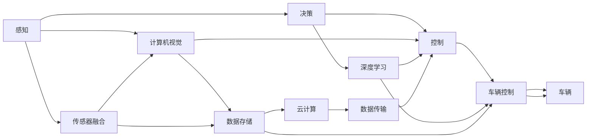

                 

# 端到端自动驾驶对开发组织架构的影响

> 关键词：自动驾驶、端到端、系统架构、软件工程、人工智能、深度学习、云计算、持续集成、持续部署、敏捷开发、DevOps、性能优化、自动化测试、部署流程、微服务、DevSecOps、数据管理、跨团队协作、安全与合规

## 1. 背景介绍

在近年来自动驾驶技术飞速发展的背景下，汽车行业正在经历深刻的变革。从最初的感知和决策系统到如今的端到端自动驾驶解决方案，技术不断进步，应用场景日益丰富。在此过程中，开发组织架构也面临着前所未有的挑战和机遇。本文将深入探讨端到端自动驾驶对开发组织架构的影响，分析其中的关键要素和具体实践，为相关领域的组织架构设计提供参考。

### 1.1 自动驾驶技术的演进

自动驾驶技术的发展历程可以分为以下几个阶段：

- **初级阶段**：基于传感器（如摄像头、雷达）的感知与决策系统，依赖人工设计的规则进行决策。
- **中级阶段**：引入深度学习、计算机视觉等技术，实现部分驾驶任务（如车道保持、障碍物检测）的自动处理。
- **高级阶段**：端到端自动驾驶解决方案，融合感知、决策、控制等模块，实现全流程自动化。

这一演变过程中，技术难度逐渐增加，对开发组织架构的要求也随之提升。早期阶段，开发者主要关注算法和硬件的适配；而端到端方案则需要在更复杂的系统结构中进行综合设计和优化。

### 1.2 自动驾驶带来的业务变革

自动驾驶技术的进步不仅在技术层面产生了深远影响，更在业务模式上带来了巨大变革。传统的汽车制造商、零部件供应商、软件公司等纷纷布局自动驾驶，通过合作、收购等方式整合资源。市场竞争加剧，产业生态发生了重构。在这样的大背景下，开发组织架构的优化和调整变得尤为重要。

## 2. 核心概念与联系

### 2.1 核心概念概述

自动驾驶技术涉及多个学科领域，包括计算机视觉、深度学习、控制理论、软件工程等。其中，软件工程和系统架构是实现自动驾驶的核心支撑。本节将介绍这些核心概念及其相互关系。

- **软件工程**：关注软件开发过程和软件系统的设计、实现、维护等。在自动驾驶中，软件工程是实现从感知到决策到控制的整个流程的关键。
- **系统架构**：定义软件系统的组件、接口、数据流和交互方式。自动驾驶系统涉及感知、决策、控制等模块，架构设计需综合考虑各模块的协作和集成。
- **人工智能与深度学习**：用于自动驾驶中的视觉感知、行为决策等环节，是实现自动驾驶的核心技术。
- **云计算与边缘计算**：为自动驾驶提供强大的计算能力支持，云计算负责数据处理和存储，边缘计算在车端进行实时处理。
- **持续集成与持续部署(CI/CD)**：确保软件开发的自动化和快速迭代，提高系统开发效率。
- **DevOps与DevSecOps**：强调开发与运维的协同工作，确保系统的安全性和可靠性。
- **微服务架构**：通过将系统分解为多个微服务，提高系统的可扩展性和维护性。

### 2.2 核心概念的整体架构

自动驾驶系统的开发架构可以概括为以下几个关键组成部分：



这个架构展示了自动驾驶系统的主要功能模块和数据流动：

- **感知层**：通过摄像头、雷达等传感器获取环境数据。
- **决策层**：利用深度学习算法处理感知数据，进行路径规划和行为决策。
- **控制层**：将决策结果转化为车辆控制命令，通过车辆控制单元执行。
- **数据层**：实时存储和传输感知、决策和控制数据。

## 3. 核心算法原理 & 具体操作步骤

### 3.1 算法原理概述

端到端自动驾驶的算法原理主要包括以下几个方面：

- **感知算法**：通过计算机视觉和深度学习技术，实现对环境的感知和理解。关键算法包括物体检测、语义分割、姿态估计等。
- **决策算法**：基于感知数据，通过强化学习、路径规划等方法进行行为决策。关键算法包括动态轨迹生成、避障策略、目标跟踪等。
- **控制算法**：将决策结果转化为车辆控制信号，通过车辆控制单元执行。关键算法包括转向控制、加速控制、制动控制等。

### 3.2 算法步骤详解

端到端自动驾驶的算法实现步骤大致分为以下几个阶段：

1. **数据收集**：通过车载传感器收集实时环境数据。
2. **数据预处理**：对传感器数据进行去噪、校正、融合等预处理。
3. **感知与决策**：利用深度学习模型处理感知数据，进行行为决策。
4. **控制与执行**：将决策结果转化为车辆控制信号，通过车辆控制单元执行。
5. **反馈与优化**：根据实际驾驶行为进行反馈和优化，逐步提升系统性能。

### 3.3 算法优缺点

**优点**：
- **端到端架构**：减少了模块间的接口复杂性，提高了系统集成和优化效率。
- **数据流统一**：各模块数据流统一，便于追踪和分析。
- **灵活性高**：模块独立性强，易于进行功能扩展和优化。

**缺点**：
- **系统复杂度增加**：端到端架构的模块数量和交互关系复杂，开发和维护难度增加。
- **资源消耗大**：涉及大量传感器、计算单元和存储设备，成本较高。
- **实时性要求高**：系统对实时性和可靠性要求极高，需要高效的数据处理和决策算法。

### 3.4 算法应用领域

端到端自动驾驶算法广泛应用在智能驾驶汽车、自动物流车辆、无人机等领域。这些场景对自动驾驶的要求各有不同，算法设计和优化需因地制宜。

## 4. 数学模型和公式 & 详细讲解  
### 4.1 数学模型构建

自动驾驶算法中常用的数学模型包括线性回归、深度神经网络、强化学习等。

- **线性回归**：用于对感知数据进行简单的建模和预测。
- **深度神经网络**：用于处理复杂的视觉感知和行为决策问题。
- **强化学习**：用于优化决策过程，通过奖励信号调整策略。

### 4.2 公式推导过程

以线性回归模型为例，公式如下：

$$ y = \theta_0 + \theta_1 x_1 + \theta_2 x_2 + ... + \theta_n x_n $$

其中 $y$ 为预测值，$x_1, x_2, ..., x_n$ 为输入特征，$\theta_0, \theta_1, \theta_2, ..., \theta_n$ 为模型参数。

### 4.3 案例分析与讲解

假设车辆需要根据前方的交通灯状态进行加速或减速。使用线性回归模型，可以建立交通灯状态与车辆速度之间的关系。例如，如果交通灯状态为绿灯，车辆速度应增加；如果为红灯，车辆速度应减小。通过训练数据对模型进行拟合，可以预测未来交通灯状态对应的车辆速度。

## 5. 项目实践：代码实例和详细解释说明

### 5.1 开发环境搭建

项目开发环境搭建需考虑以下几个方面：

- **硬件配置**：高性能计算资源，如CPU、GPU、TPU等。
- **开发工具**：如Python、TensorFlow、PyTorch、OpenCV等。
- **环境部署**：开发、测试和生产环境的配置，确保一致性。

### 5.2 源代码详细实现

以下是使用TensorFlow实现交通灯检测和状态预测的代码示例：

```python
import tensorflow as tf
from tensorflow.keras import layers

# 定义模型结构
model = tf.keras.Sequential([
    layers.Dense(64, activation='relu', input_shape=(2,)),
    layers.Dense(64, activation='relu'),
    layers.Dense(1, activation='sigmoid')
])

# 编译模型
model.compile(optimizer='adam', loss='binary_crossentropy', metrics=['accuracy'])

# 加载训练数据
train_data = ...
train_labels = ...

# 训练模型
model.fit(train_data, train_labels, epochs=10)

# 预测新数据
new_data = ...
predictions = model.predict(new_data)
```

### 5.3 代码解读与分析

上述代码展示了如何定义、编译和训练一个简单的线性回归模型，用于预测交通灯状态。其中，输入数据为交通灯的颜色（0表示红色，1表示绿色），输出为车辆速度的预测值。模型结构包括两个全连接层和一个输出层，使用sigmoid激活函数。编译时指定了优化器和损失函数，训练过程中使用交叉熵损失和准确率指标。

### 5.4 运行结果展示

训练完成后，使用模型对新的交通灯状态进行预测，输出车辆速度的预测值。假设模型在训练数据上达到了90%的准确率，在新的测试数据上也能取得类似的预测效果。

## 6. 实际应用场景

### 6.1 智能驾驶汽车

智能驾驶汽车是端到端自动驾驶的主要应用场景之一。通过集成感知、决策和控制模块，实现车辆自主驾驶。

- **感知**：车辆配备摄像头、雷达等传感器，实时获取环境数据。
- **决策**：利用深度学习算法进行路径规划和行为决策。
- **控制**：通过车辆控制单元执行转向、加速、制动等操作。

### 6.2 自动物流车辆

自动物流车辆用于仓储、配送等物流场景，需要高效、安全地实现自动化运输。

- **感知**：通过传感器实时监控车辆周围环境，识别障碍物和目标。
- **决策**：优化路径规划和避障策略，确保运输效率。
- **控制**：根据决策结果进行车辆控制，自动执行运输任务。

### 6.3 无人机

无人机在农业、物流、救援等领域有广泛应用，端到端自动驾驶技术是其核心组成部分。

- **感知**：配备摄像头、雷达等传感器，实现对环境的实时感知。
- **决策**：通过强化学习算法进行路径规划和避障。
- **控制**：根据决策结果调整飞行姿态和速度，执行飞行任务。

## 7. 工具和资源推荐

### 7.1 学习资源推荐

- **TensorFlow官方文档**：详细介绍TensorFlow的框架和使用。
- **PyTorch官方文档**：PyTorch深度学习框架的官方文档，包含丰富的教程和示例。
- **Kaggle**：数据科学竞赛平台，提供大量公开数据集和算法竞赛，用于学习和实践。
- **GitHub**：全球最大的开源代码托管平台，可以找到自动驾驶相关项目和代码库。

### 7.2 开发工具推荐

- **Git**：版本控制系统，便于团队协作和代码管理。
- **JIRA**：项目管理工具，用于跟踪任务和问题。
- **Confluence**：知识管理工具，用于文档和知识共享。
- **Ansible**：自动化运维工具，用于配置管理和系统部署。

### 7.3 相关论文推荐

- **End-to-End Training for Self-Driving Cars**：介绍端到端自动驾驶的训练方法和效果。
- **Deep Learning for Autonomous Driving**：讨论深度学习在自动驾驶中的作用和应用。
- **Automated Driving Systems: The State of the Art**：综述当前自动驾驶技术的进展和未来趋势。

## 8. 总结：未来发展趋势与挑战

### 8.1 总结

本文深入探讨了端到端自动驾驶对开发组织架构的影响，分析了其中的核心概念和关键要素。自动驾驶技术的发展，对软件工程、系统架构、人工智能、云计算等技术提出了新的要求和挑战。

### 8.2 未来发展趋势

未来，自动驾驶技术的演进将进一步推动开发组织架构的优化和创新：

- **更加智能化**：结合人工智能和深度学习技术，提高感知和决策的准确性和鲁棒性。
- **更加集成化**：通过云计算和边缘计算，实现高效的数据处理和实时决策。
- **更加协作化**：引入DevOps和DevSecOps，加强开发与运维的协同工作，提升系统稳定性和安全性。
- **更加自动化**：通过持续集成和持续部署，实现快速迭代和高效开发。

### 8.3 面临的挑战

尽管自动驾驶技术前景广阔，但其发展仍面临诸多挑战：

- **技术瓶颈**：感知和决策算法复杂，需要高效的计算资源和优化的算法设计。
- **安全性问题**：自动驾驶系统对安全性要求极高，需确保算法的可靠性和鲁棒性。
- **法规和伦理**：自动驾驶涉及复杂的法规和伦理问题，需制定标准和规范，确保合规性。

### 8.4 研究展望

未来的研究应聚焦于以下几个方向：

- **算法的优化与创新**：开发更加高效、鲁棒的感知和决策算法。
- **系统架构的优化**：通过微服务架构和DevOps技术，提升系统的可扩展性和维护性。
- **智能化的集成与协同**：结合人工智能和深度学习，实现更智能的集成和协同。

通过不断优化和创新，相信自动驾驶技术将在未来实现更大的突破，为人类社会带来更便捷、安全、高效的出行体验。

## 9. 附录：常见问题与解答

**Q1：自动驾驶算法需要处理哪些数据？**

A: 自动驾驶算法需要处理来自车载传感器（如摄像头、雷达）的实时环境数据。这些数据包括但不限于：

- **摄像头图像**：用于视觉感知，如物体检测、语义分割。
- **雷达数据**：用于感知障碍物和动态环境变化。
- **GPS和IMU数据**：用于定位和运动状态监控。

**Q2：自动驾驶算法需要考虑哪些安全因素？**

A: 自动驾驶算法需要考虑以下几个安全因素：

- **感知安全**：确保感知数据的准确性和鲁棒性，避免误识别和漏识别。
- **决策安全**：优化决策算法，确保行为决策的合理性和安全性。
- **控制安全**：通过精确的车辆控制，避免失控和事故。

**Q3：自动驾驶算法如何在极端天气条件下工作？**

A: 极端天气条件对自动驾驶算法提出了更高要求。以下是一些应对措施：

- **传感器冗余**：使用多个传感器（如摄像头、雷达）进行数据融合，增强鲁棒性。
- **实时处理**：通过边缘计算或云计算进行实时数据处理，确保及时响应。
- **自适应算法**：引入自适应算法，根据天气条件调整感知和决策策略。

**Q4：自动驾驶算法的开发过程中如何保证质量？**

A: 自动驾驶算法的开发需要采用严格的质量保证措施：

- **测试驱动开发**：编写测试用例，通过自动化测试验证算法功能。
- **代码审查**：定期进行代码审查，确保代码质量和可维护性。
- **性能优化**：通过性能测试和优化，确保算法的高效性和实时性。

**Q5：自动驾驶算法的开发和部署需要哪些关键资源？**

A: 自动驾驶算法的开发和部署需要以下关键资源：

- **高性能计算资源**：如CPU、GPU、TPU等，确保算法的计算效率。
- **数据管理平台**：用于数据存储、处理和分析，支持大规模数据管理。
- **部署平台**：如Kubernetes、Docker等，支持自动化部署和运维。

**Q6：自动驾驶算法的开发过程中如何处理数据隐私和安全问题？**

A: 自动驾驶算法的开发过程中需特别注意数据隐私和安全问题：

- **数据匿名化**：对数据进行匿名化处理，确保用户隐私保护。
- **访问控制**：通过身份认证和访问控制，限制数据的访问权限。
- **安全传输**：采用加密传输协议，保护数据在传输过程中的安全。

通过不断优化和改进，相信自动驾驶技术将为未来社会的出行方式带来革命性的变革，为人类社会创造更加安全、便捷、高效的出行体验。

